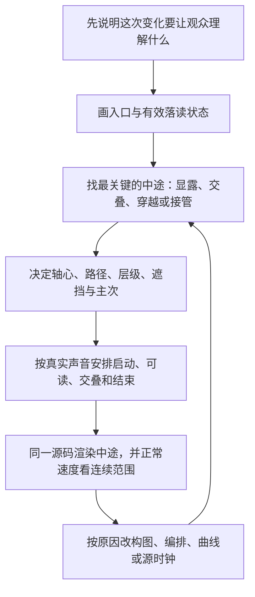

# 连续演出：关键中途、动作关系与返修

## 1. 先选择当前需要的观看动作

按内容选择并写成具体句子。以下是选择线索，不是效果配额：

| 当前任务 | 可采用的动作关系 | 需要保持的参照 |
|---|---|---|
| 多个场景或对象中关注一个 | 活动窗口重排、近远错位、前景取得面积 | 同一主体身份、源动作进展 |
| 现象背后还有条件 | 主体让位、遮挡揭字、边缘带出依据 | 现象本身或已建立的判断 |
| 有一个细节值得看 | 同源局部靠近、观察窗口、局部与整体对应 | 真实源时刻、可辨认部位 |
| 一个关系含多个部分 | 先建立共同骨架，再展开差异部分 | 比较尺度、上下/内外结构 |
| 一个物体值得展示或记住 | 局部到整体、拆分/离槽、方向变化、文字接管 | 部件归属、受光和空间 |
| 人物的反应或情绪需要时间 | 保持人物、干净切镜、源声延续 | 真实表情、动作和语义 |

真实素材本身有好的过程时，以其为主要内容；动效负责观看位置与重点，不把它替成低信息符号。需要切镜就切镜，只有共同对象或观看关系需要延续时才作形变接管。

## 保持、变化与内部依赖

先找本场最容易混乱的状态：新旧共存、遮挡解除、结果开始响应或内容取得前景。明确位置、投影面积、姿态、遮挡、第一关注和可见文字，再连接入口与阅读状态，不将50%插值当成设计。

区分必须保持的身份、比较尺度、准确文字和已积累状态，与负责变化的距离、主次、姿态和可见范围。连续所需的源时刻不能因拆件重置；明确切镜仍可成立。

从实际语义落点安排旧重点退让、新对象建立、内部显露与落读。大位移中不要全量摊开小字；到达有效字幅与投影后再读。阅读来不及时改交接、字幅或讲述，不直接拉长全片。

本场相对时间由整片时间减起点取得；对象姿态、位置沿本片轨迹求值，子层场景坐标由父变换乘局部坐标得到，可见范围取决于显露时机和遮罩。实际源时间独立于外层动作。

不要将所有属性绑定同一缓动或用弹性模拟所有物体。响应可以不同，但关键状态、归属和落读一致。累计关系由真正到达的输入驱动；容量与高度不一定线性。窗口、边框与内景应保持一致映射，接全屏时不跳位。没有物理因果的图解不冒称物理仿真。

#### 先安排何时认清，再选择速度表现

物体需要有决断地离场时，不要在即将出画处慢慢停车；文字要读清时，应在合适投影与字幅下收稳。连续观察的路径即使位置接上了，也要检查速度是否每次归零重启；确需逐项阅读或反应时可以停，不把“全程不停”当目标。

阅读、比较、情绪、材料欣赏和真实动作可以支持保持；无关粒子还在动不能证明停留有效。规则见 [按观看完成安排时间](../../effect-timing/SKILL.md)。声音和画面共同形成当前时长，不补满教学秒数。

#### 看见问题后改哪一层

| 实际问题 | 先检查与修改 | 不要先做 |
|---|---|---|
| 像软件表格，主体弱 | 主物是否被标题挤小、对象是否缺轮廓、区域是否等权；重配面积和字级 | 所有框统一加阴影 |
| 像两张无关广告 | 对象归属、共同空间和同尺度；恢复参照 | 加一个华丽转场掩盖 |
| 薄纸像厚砖 | 厚度、间隔、边缘与接触影 | 更重的阴影 |
| 中途花，终帧好看 | 风险中途的面积、对比、可见文字与主次 | 把所有动作整体放慢 |
| 动得顺却发飘 | 谁发起、谁跟随、位移与姿态的速度分布 | 所有层加同一弹簧 |
| 新重点太晚 | 语义落读与动作建立关系 | 只调阻尼 |
| 源内容跳位或重播 | 坐标映射、真实源时钟与拆件偏移 | 改讲稿掩盖实现错误 |

## 动效中途怎样设计：从两个端点，走到完整演出

### “中途”不是时间过半时随便截一帧

假设入口与出口是两组需要接替的内容。只写“旧组移走，新组出现”，只决定了两个端点，最重要的问题仍然没决定：

旧组离开到什么程度时，新内容开始进入？两者同时存在时，第一注意在哪里？新组从哪里被看见？源视频是否继续？声音讲到新内容时，它是否已可读？

**中途设计，就是在变化发生的过程中，主动安排观众能看见什么、先看什么，以及怎样从旧重点过渡到新重点。**

动画的“关键中途姿态”不必位于50%时间。它可能是遮挡刚解除的时刻、两个对象最拥挤的时刻、某个字第一次能读清的时刻，或旧对象离开而新对象还没接上的危险位置。

### 作者具体按什么顺序设计

**先写变化的意义。** 说明观众从前一段理解进入下一段判断的具体原因，不能只写“这里需要一个转场”。

**再画入口和读清后的状态。** 入口有哪些已经熟悉的对象；出口的新主体、文字和素材怎样组成一幅画面。两个端点都难看，先修美术。

**然后设计关键中途。** 选当前最容易出问题的几个时刻，给出明确姿态与主次。不能用两端位置自动插值，然后默认中间会好看。

**最后安排时间。** 先决定新内容最迟何时要可读，再反推启动时刻；决定旧内容哪些部分继续、哪些部分先退让。不是先给每个对象分配0.5秒，再把它们排成队。

### 每个重要中途，写清六件事

用连续正文即可，不必每次填大表。

**谁还在场。** 主体身份是否连续，还是明确换成另一个对象；哪些参照保留。

**姿态是什么。** 位置、投影尺度、朝向、轴心；不要只有“运动中”。

**谁挡住谁。** 层级、遮挡面积、文字从哪条边被看见；显露不等于全部元素统一淡入。

**此刻先看谁。** 旧对象是否仍然太亮，新对象是否过早抢注意；附属物是跟随还是各自表演。

**速度处于什么阶段。** 起势、通过、减速、读清、穿出；需要停稳的地方停，需要连续观察的地方不强行停车。

**声音与源画面怎样继续。** 源视频不因为父物体移动而重新开始；准确台词与当前观看任务要对应。

下面把这六件事落实到三个具体例子。

## 1. 使用时机与责任

导演已提出本段内容及在全片中的作用，且影响具体设计的材料已经可查看时，由正在负责该场的视觉作者读取本 Skill。作者可继续读取构图、时机、字幕或案例资料，不为每份资料另建子代理。主要剧情和跨场风格由原导演统筹，正式项目写入、生成与渲染仍由主任务按当前 MCP 合同执行。

本方法要产出的不是“给另一模型的华丽提示词”，而是原作者自己准备实现的完整演出。故事怎样发展、什么值得被看见、用了哪份实际材料，先有依据；然后作出美术和运动决定；最后把它们写在一份当前正文中。下游不应重新猜主角、主要构图和关键转场。

只需机械改字、固定偏移或简单直剪的任务按局部范围完成，不强迫它经过长表单。真实动作、人物原声或稳定对比已经足够时，可以明确采用直接剪辑；不为触发本 Skill 强行增加动画。

## 2. 先确认足以设计的实际输入

阅读导演当前声画稿、前后场面与本次发布配置。实际查看将被使用的源范围、图片、页面、原声和已有文字，理解主体、相机、动作、遮挡、原包装和清晰度。导演看过故事材料，不代表视觉作者已经知道如何裁它；反过来，素材摘要也不能代替导演决定这段值不值得讲。

缺关键输入时，向协调者返回具体请求：要补哪个源范围、哪句上下文、什么动作或字形。其他具备材料的场面继续，不要求全片等齐。没有看清的源内运动不写成已发生；静帧可支持静态构图，却不能支持未经观察的快速反应和精确词级时刻。

已剪成片、原始视频、照片和页面均按实际用途判断。不要因成片身份自动规定 contain 或两秒后退出，也不要因题材相同就采用无关人物与事件。普通搜材未命中走内容与选材反馈，真实技术故障才按项目故障入口处理。

## 3. 将内容写成一段可跟随的观看过程

先读导演当前观看发展与本片材料，不从组件名开始。用 [共同构思方法](../../production-director/references/story-and-shot-design.md#从实际声画构思主线段落与分镜) 判断这段是在经历处境、看见差异、累计结果、进入层次、表现气质或形式。它们不是必填模板，选择当前真正能被观看的关系，再写主体如何开始、怎样变化、留下什么以及怎样接下一段。

如稿只写“显示两个产品、加高级对比”，当前原作者要提出具体方案，而不是等导演给像素。例如可选择让相同服务保持、附带条件从对应对象内层显露；正式含义、原件和主体必须来自本片，教学示意不当作真实订单。主要讲法或跨段改变回导演采用，局部构图与运动由原作者负责。

材料本身已有完整过程、人物反应、稳定比较或美感时，可以采用直剪或克制处理；形式表现也可有价值，不要求每次动作增加事实。文字、字幕与主读的重复按用途判断，不机械清除必要转写和条件。

## 4. 按本场问题语义检索，再回到当前演出

专业方法可独立完成本段。已采用整片或局部参考时，按本轮范围继续；需要新表现时，读 [案例库](../../motion-case-library/SKILL.md) 与 [语义检索方法](../../motion-case-library/references/skillry-retrieval.md)，把困难作为完整自然语言问题交给当前模型。不要先把词不匹配的案例排除，再声称完成语义理解。

根据当前问题阅读相关卡片，必要时扩大到更多卡片，按行为、观看、构图和材料条件作语义初选，随后读入围analysis与必要原片范围。只借鉴动作或讲法时，不把材料不同自动视作不适用；精确跟踪或源内操作需要真实条件支持。返回真实编号、源段、适用关系、本片怎样改、缺什么、已观察到哪里，写回当前稿，不交脱离作品的心得。

Skillry原片与研究后写建议不等于固定生成配方。自有 [时代变化与节目安排](../../motion-case-library/references/cases/motion-case-attention-programme/CASE.md)及 [设计推导](../../motion-case-library/references/cases/motion-case-attention-programme/references/decision-walkthrough.md)可选，按实际具备的原输入、源码和媒体读取；不要求120条都具备原源码。历史命令不覆盖本轮权限和素材要求。

找不到匹配、参考缺失或局部方法不适用时，继续原创或改选表现，不降低完成度、不转交用户写分镜。参考采用不能替代本片字形、构图、中途和真实声画试排。

## 5. 先形成一套本片美术，而非一排风格词

在已发布的实际字体目录、当前材料和目标画幅中作出选择。导演给整片语气和文字用途，原视觉作者负责具体字款、字幅和布局。用户没有指定缺失字款时从已有目录自主设计，不先制造一个“必须同款”的条件；用户确实指定但目录未收录的字体，继续遵守仓库已有推荐、预览与用户选择合同，不能在本 Skill 内改成静默替代。

把主读、普通字幕、物体标签分工写清。主读需要被记住的词义，选择与它匹配的字形、笔画重量、字间距和可见面积；普通字幕首先稳定可读；标签须与物体归属一致。真实字重由绑定文件决定，不以 `fontWeight:900` 假冒不存在的字款。先看实际字形，名义字号不能代替最终字幅。

颜色也作有意义的分工：背景服务材质与层次，主要文字保持阅读，强调色指向当前关键关系。素材保留有价值的受光和颜色。不要只列几个色号，也不要把这次案例的绿色和宋体设为全项目默认。

说明主体的识别轮廓、主次比例、细节集中处、光向、边缘和接触关系。平面风格可以靠排印、形状和对齐成立；物体风格才需要与它相符的厚度和阴影。不把所有对象强制做成三维、玻璃或霓虹。

最后用当前真实素材和文字看整幅画面：第一眼落哪里，其他内容为何存在，留白是在帮助方向与阅读还是因为没有设计。主体缩小之后要重新判断构图，不能为了填空塞无关纸片，也不强制所有镜头铺满四边。比较候选只在存在实质不确定时进行，选定后交一套方案，不把普通选择继续留给实现端。

## 6. 把关键中途写成可执行决定

先读导演当前句群、已选材料和视觉构图，确定本段究竟在演什么，再安排属性变化。案例已采用时，按 [案例入口](../../motion-case-library/references/cases/motion-case-attention-programme/CASE.md) 阅读原指令第3、5.4、7、8节；需要的是它的行为组织、主次和阅读方法，不是默认沿用手机、镜片或旧坐标。

### 先设计最容易混乱的那一刻

找到新旧主体并存、材料解除遮挡、图像接到文字组或下一份内容取得前景的时刻。先写清这一刻的位置、可见面积、姿态、第一关注、仍要保持的参照和阅读条件，再把入口与出口连接起来。“中间进度50%”不是中途设计本身。

本片值得保留的参照随新主体一起编排，明确让出多少面积和对比，不默认清空所有对象再进入主角。

### 把关联对象作为同一件事来编排

明确谁发起、谁跟随、谁显露、谁接管，哪些需要保持身份和对应。相互关联的对象可以有不同延迟、速度与收势，不要求一条曲线控制所有东西，也不为了丰富而强制错相。

同源分区共享源时刻，文字、边缘、阴影与图像跟随所属对象变换；没有用途的分区不因参考存在就加入本片。

### 从需要读清的时刻反推交接

先决定新重点何时应被看见、主要内容何时需要读清，再安排旧重点退让、新对象建立和收势。源片自身的动作继续发展，不因外层对象移动而重新播放或被拉成另一个时间。

从当前声音的有效语义落点反推新旧交叠，让新重点在需要它时已可辨认；不等所有旧对象退完，也不照抄历史秒数。

### 分开处理路径、速度和画面主次

先把注意关系设计成立，再确定路径与速度。路径连续不代表速度合适；一段一段使用相同缓动也不等于连续观察。需要观察多个相关细节时，安排明确路径，在需要读的地方减速，经过不需阅读的部分继续前进。起点和结束可以停稳，中途不无故每到一个点都重新启动。

确需局部观察时，内外来自同一源状态，放大内容与外部位置对应；不要求每场都有观察窗口。

### 写成可实施演出，并按具体问题返修

返回准确讲述、当前材料及源范围、入口构图、关键中途、主要阅读状态、对象依赖、相对动作时机和出口。当前材料会影响裁切、字位、遮挡、路径或声音时一起更新，不能只换Asset ID。

中途乱而结束帧好看，先改中途面积、可见内容和主次；新内容建立晚，改事件先后和交叠；动作顺却发飘，改主动与跟随、姿态和速度分布；字或源画面跳位，查父子变换和源时钟。不要把所有问题都改成更大的弹性或更慢的动作。

适合的素材、模板与组件可以用于实现，缺的部件再补做。原作者继续采用现有 [执行稿模板](execution-brief-template.md) 和具体教学完成实际片段；局部参数自主修订，主要讲法与跨段变化回导演。没有实际观察过的动态与声音，不以设计说明代替结果。

## 7. 用语言和源事件安排时间

先有当前可讲内容和声音方向，再取得实际旁白、原声及可用对齐。画面设计可以与声音共同深化，但正式动作时机需要落到当前真实句群。首版配音可以因内容修订而重配，不能强行删掉主要演出来服从旧长度。

关键动作分别说明预进入、落读、回应和持续：哪句意思让旧对象离开，哪句开始时新重点应已看清，什么还需要阅读或反应。先用秒描述尺度，之后按当前 fps 换算；记录时间精度，没有词级证据不按字数平均制造精确时间。

讲述句群、字幕卡和视觉场面是不同单位。一段自然语音可有多个短字幕，同一对象也可以跨句发展。采用单行字幕的片子，用实际语音和字宽切成先后短卡，不通过把 TTS 切碎、缩字、非等比压字或隐藏内容来“通过”。需要双行且设计成立的其他影片可以保留。

运动完成后的停留必须有阅读、比较、反应、情绪或源声用途；背景还在漂浮不代表当前内容在发展。反过来，不把所有静态都判为空等。音乐、音效和源声按作用选择，这次无 BGM 的成功不成为新任务的默认静音方案。

## 8. 深化稿、导演采用与实现是同一个版本链

使用执行稿结构交回一份自洽正文，包含实际材料与范围、准确台词、主读、美术、连续演出、当前声音时机、字幕策略、前后接口与待核事项。简单段短写，复杂段写到能直接实现；不以字数、字段个数或效果数量判断完成。

主任务将完整稿回原导演统筹。导演检查本场发展与全片关系；局部坐标和曲线仍由原作者决定，不让每个像素都审批。采用只表示可以据此继续，不表示动态和审美已通过。随后同一作者读取 [Remotion实现](../../remotion-production/SKILL.md) 完成源码，不能把已选方案又压缩成一句交给另一个人猜。

完整稿沿已有任务消息、附件与创意决策引用保存，确保实现作者实际取得全文。提交的 `creativeBrief` 使用实时长度合同，摘要可以短，但不能丢掉主要执行关系；没有证据时不把字段上限当成本次失败根因。素材或时间变化后原作者重看影响，更新当前稿和对应实现，而不是只更换 Revision 号。

## 9. 在实际产物上检查，按根因返回

先从当前源码、素材和字体渲染必要关键状态，查看真实字号、裁切、边界和主次；不要用另画的概念图代替实现。对需要动态判断的接点，取得开始前、中间、落读后和下一画面的连续范围，再查看完整声画。

如果内容没有发展，回导演与文案；内容成立但稿只有动作名，继续深化；稿具体但源码漏层、裁错、字体回退或时钟错，修实现；实现忠实仍不好看，回到美术和演出选择。不要统一以加阴影、加字、更多 whoosh 或更长指令处理。

静帧只证明对应画面；声音检测只证明相应技术事项。未听到、未连续看过的范围明确保留，不将记录里“已播放”写成所有听感已通过。用户认可最终作品是独立反馈，不倒改较早的原始审阅记录。

## 10. 返回产物

返回当前完整执行稿与准确参数、素材/字体/声音引用、主要实现位置、实际检查请求和修改影响。继续本次作品直至完整交付，不停在“写好指令”。归档时分开原始任务、实际提交摘要、源码、最终视频、修订记录与后写的教学说明。新主题的新结果必须重新验证，不借用历史样片的认可。

## 段内创作的完整流程

**职责与默认方式**

`remotion-production` 接收总导演的具体分镜，负责本段的视觉细化、美术、构图、运动编排、受管实现与合成验证。上游决定整片主线、本段作用、主要可见事件、信息顺序与前后节奏；作者主动补足段内发现、观察位置、动作交叠与收势。导演未写坐标和曲线不表示只能做静态说明，局部细节由作者专业判断。

完整内容段首次先交场面设计、必要关键画面、秒级连续过程与试作请求，经主任务正常回原导演协调。取得统一采用分镜及修改差异后，由同一作者继续设计、试作或正式实现，更新完整指令与源码。主要表达变化提前反馈是额外要求，不替代完整深化稿的常规协调；局部参数不逐项审批。已经看出不成立的构思先改进，需要动态才能判断的关系安排限定范围试作，不能靠导演“采用”宣布设计成熟。

不要求参考 URL。需要内容专属的连续表达时，正常进入受管原创作品流程。现有组件在能够完整保留设计时可以复用；选择发生在构思之后。只修改数字、颜色或一个既有 Cue 的任务按局部范围执行，不强制重做整段。

**第一步：读懂内容与真实合成环境。**

读取当前 Revision、采用的故事与分镜决定、相关 Beat/Script、真实旁白时间及精度、Scene、人物/字幕/证据范围、前后画面、已有作品和本片视觉语言。先核对上游的主要对象、可见变化、信息时机与硬约束，再开始细化；旧作品指令与当前决定不同，先明确修改范围。

材料尚未查看时，可以提出待验证方向和具体观察请求，不把依赖该材料的裁切、原句、人物反应或完整动画当成已采用。相关实际范围看清后，依据内容与本次声画选择或重写美术、路径、时间与源关系。其他已具备场面及能力检查可以继续；缺事实回核实，普通缺画面继续补材或准确改变表达，不假称已取得。

动效可以发展短素材之外的讲述、细节、关系与记忆，也可以参与实拍二次加工、花字与画面调度。已实现合同在文字、图形和图片之外提供最多四路受管源视频，可在同一作品内持续播放并配合窗口、布局与运动。是否把真实过程放进作品，由完整分镜和素材范围决定；正常速度、静音、局部时钟和资源预算见下文。实际剪辑先读连接 Runtime 的实时 Schema，不能把源码已有字段当成当前会话已发布能力，也不能把视频改成截图后声称完成了持续动作。

用于正式制作的交接同时携带被采用素材的实际范围、裁切限制、原声策略和前后动作余量。完整指令明确哪段实拍播放、哪个具体状态交给图形、图形怎样持续发展、何时交给下一画面；不能把源片存在理解为可任意拉长或把实拍关键过程换成静态卡片。新素材改变接口时，返回导演及原视觉负责人确认后再调整作品。

同时读回导演采用的画面、讲述与文字分工，以及实际锁定与允许修改范围。已有旁白文本不是逐句动画清单；同一场面、源视频和对象可以跨句发展。所需声音、字幕或视频布局超出现有合同，返回具体执行缺口，不能由作者自行删掉承担表达的部分。

**第二步：提出内容对应的视觉构思。**

先判断总导演分镜中的关键关系怎样被实际看见：哪些对象必须保持身份，哪些属性可以变化，哪些比较需要共同基线，哪些信息必须按顺序出现。已有明确且可行的构思就直接细化；关键表达仍不确定时，比较有实质差异的载体或观看方式，再把改变主要表达的建议交回总导演。不要为了凑两套方案重做已明确的分镜。

选择主体时同时决定它怎样被识别、能发生什么变化、需要哪些比较参照、哪些部件能参与下一次发现。轮廓、比例、开口、连接与材质共同形成身份和运动可能性；不要先摆默认图标再靠阴影补质感。决定先看全貌还是细节、何时改变观看位置、怎样保留旧关系，再将实际文案与素材放入构图。比喻保留事实关系，说明真实素材的作用、可能误读及前后接续，不用“高级流畅科技风”代替设计。

**在构思与关键画面之间使用案例。**

按当前材料和观看任务读取 [案例学习与选型](../../motion-case-library/SKILL.md)。进入选定案例后，依据该例的资料入口完整读取真实生成输入与采用说明；历史例可使用 `generation-prompt-v1.md`，新例区分 `original-input.md`、原样提交摘要与本轮教学整理。不要假设每例都具有同名文件，也不用案例名称代替正文。

具体美术与运动由同一作者按 [完整演出写法](../SKILL.md) 深化。本次若已采用 [完整声画案例](../../motion-case-library/references/cases/motion-case-attention-programme/CASE.md) 为共同参考，先理解整条作品与完整原指令，再按职责深入当前关系，真实原输入、源码和视频已有明确来源；后写的迁移方法不冒称旧视频原始指令。

沿案例实际接点理解一组选择：前一构图怎样引出下一构图，新主体的轮廓、方向和尺度怎样改变画面，旧重点怎样降低对比并保留参照，必读内容怎样到达阅读位置，文字、细节和阴影怎样持续属于载体。把这些关系落实到本段自己的对象、美术与路径，不能只摘“对象延续、动作接力”。

例如机票案例不只保留原票：横向票面与竖向手机形成构图变化，旧价格退让而票面仍能辨认；翻面接近尚未收完，限制行已被送到阅读位置并展开高亮；手机退出时原票已经靠近。迁移时重新决定当前载体怎样改变方向与尺度、进入什么细节、保留什么参照、沿什么关系返回，不复制票面、手机、剧情与配色后仅替换文字。示例的事实、画幅、无声交付和自由时长也不覆盖本次约束。

只能读取静态图片而不能播放视频时，如实区分静态观察、源码理解和已有动态结论，
不把静帧检查说成完整播放。正式提交前读取实时 Schema，按当前工具合同提交。

**第三步：形成关键画面与连续变化。**

先按当前分镜用真实文字和素材设计入口、关键变化、阅读或观察、出口。每个状态确定主体、第一重点、位置尺度、朝向、层级与仍保留的对象，真实视频另标源动作进展；关键帧只支持构图与状态判断，不证明动态成立。

随后逐对连接状态：谁先发起，哪个对象或共同父层运动，沿什么路径、绕什么轴心、改变哪些属性，幅度与速度怎样分配，谁保持、退让或接管，文字何时达到可读尺度，下一动作能何时交叠进入。轻重、惯性与收势由这些实际选择形成，不是统一套弹性曲线。

起点和终点之间也要设计：主体经过哪里，是否出画，两份对象是否重叠，中途还有没有比较参照，什么变化让下一重点出现。阅读从文字实际达到有效尺度开始计时，动作交叠落实为真实起止。真实视频另核对内部动作与窗口变化的时钟，接管不能重播或跳过关键源动作。

连续主体从原状态发展，跨层替身或跨作品接管要核对交接瞬间的位置、尺度、朝向、内容和源时刻，避免双影、跳位或重播。需要真正切镜时允许切镜，连续不等于所有边界必须变形。

本段运动本身承担选择、比较、积累或揭示时，粗稿就实现这些主要过程与辨认时机，再接入前后声画试看。可延后次要纹理与装饰，不用静态卡加旁白替代叙事动作后宣布方案成立。

先找变化所需的参照，再决定运动。解释同一次输入与后台计费时，保留输入、展开内层、改变后台数量，观众才有比较依据；解释部件归属时，同一部件进入更大组织，原局部的位置仍可追踪。可迁移的是这些关系，不是复制参考里的对象和秒数。靠近、展开、复制或变色的具体作用由本段关系决定；同一动作可以承担不同表达，不能因效果可用而任意套入。

美术与运动共同设计：载体上的文字、细节与阴影共享透视和运动，主体的比例、材质、空间位置与收势共同形成重量或舒展感。固定字幕、稳定窗口或参照对象可以与内部动作并存；真实切镜更清楚时允许切镜，不把连续性等同于全片无切换。

精修前沿设计连续描述实际画面，检查主要依赖标题出现、换字和等下一句的部分。停留若有阅读、比较、反应、情绪或声音用途就保留；没有用途则重新安排观察位置、主体关系、细节发现、事件推进或提前接续。只靠发光、漂浮和音效显得忙碌时，回到主体与构图继续设计，不把保守初稿留给最后审片救活。

**第四步：完成美术与运动编排。**

用本片素材和准确文字完成美术：写主体轮廓与比例、部件和识别细节，写字级、字重、分行、对齐与强调范围，写主次颜色、主体尺度、留白、材质、光向、阴影及层级。适合当前载体的部分具体设计，不强制每段都有全部装饰。整片复用视觉语言，各段按自身内容形成构图。

按可见过程连续写运动：原对象从哪里怎样变化、新对象从何处进入、焦点怎样交换、到哪里停稳、何时读字及如何退出。给大约秒级起止与交叠、路径、幅度、速度变化和主要落点。保留当前用户声音与总长约束，预览后局部修订，不照搬案例总长。

在细化阶段与文字、声音负责人共同试排完整场面：语言、原声、音乐和音效从何处进入，哪层引导当前注意，动作与阅读怎样接续，何处预示、落定、回应或安静观察。声音可以先建立下一处观察或维持跨镜关系，不必始终追随画面，也不要求每个运动元素都有独立响声。主线依赖这些配合时，粗稿就有可检验的声音及主要动作。

实现后按真实音源与作品时序细化范围。源码命名事件与实际动作共用时序，区分相对画面的感知偏移与音源内部起音偏移，安排包络与当前主声音退让。动作、文字、声音或内部时序改版后，交原负责人复核对应关系与前后听感；整体平移沿现有跟随机制处理。

普通字幕、画内问题、标签和源内容按各自作用保持，不同一时钟清空。完整指令分别写文案、归属、秒级出现与保留跨度，并与讲述和动作连起来说明；动态画内文字进入本作品，普通字幕沿 Caption 链，最终看同一份实际合成。

**首次深化回导演，再由原作者形成统一指令与源码**

将采用场面与理由、主体美术、关键构图、连续过程、秒级初稿、文字与声音分工、前后接口写成完整创作正文，附实际关键画面、素材与参考观察范围、未解决项及必要试作请求。主任务将完整深化交原导演统筹；导演反馈未给出完整改后分镜或具体续接要求时，指出缺项，不根据“更高级”猜整片变化。

取得统一采用稿后，吸收保留设计和修改差异再实现。采用只表示整片选择已协调，不代表动态未知已解决。仅需判断运动的局部可以先试作，正式生成与渲染仍交主任务提交；同一作者保留构思到实现的连续性。

**写好本段完整生成指令，再实现源码**

对于承担连续解释或重要视觉记忆的动效，在开始写源码前，先形成当前段落的
完整文字指令。使用下面的结构，但每项都要写当前内容的实际设计决定。
简单的一次强调可以按任务范围简化，不强制凑章节或字数。

1. 内容与输出：实际讲稿、准确文字与数字、画幅、可用素材、人物和字幕位置，
   本段让观众理解什么，最后应看到什么。说明已有旁白及其真实时间。
2. 主体造型：主要对象的轮廓、比例、部件、识别细节、哪些部分能动。
   例如写清票面和票根比例、设备边框与屏幕，而不只写“做一张精致票据”。
3. 美术与构图：具体颜色各承担什么重点，字体粗细与分行，主次大小与位置，
   留白、遮挡、材质、光向和阴影。二维动画同样需要排印与形状设计。
4. 连续关系：哪个对象从头保留到尾，新对象为何进入，旧对象如何退让。
   使用前景替身时明确接管瞬间的内容、位置、大小和方向，避免双影与跳位。
5. 动作顺序：先用秒写每个动作大约的起止范围，再写从哪里开始、怎样移动、
   如何加减速、在哪里收住，以及下一动作怎样交叠。秒数和动作关系同时保留，
   完整预览后按实际速度、阅读和收势局部修订。
6. 阅读与结束：什么文字需要读清、何时达到可读状态、停留到什么条件结束，
   动画完成后的画面由谁承接。初稿给出秒级阅读范围，预览后再调整并换算帧数。
7. 声音与合成：按当前采用声音及用户锁定范围，标出需要配合的可见动作和语义位置，
   按当前人物、字幕及素材关系重构图；正式声音由既有流程完成。
8. 检查：指定关键画面和接点附近需要连续观看的范围，说明怎样判断造型、
   动作、读字和结尾是否成立，不以编译通过代替视觉检查。

上述内容应组合成一份连贯、可执行的当前指令，不是只有栏目名的空表。

写码时从主要过程追到实际对象和时序：持续主体使用可追踪的身份与状态，共同场面运动作用于相应对象或父层，比较中不变的属性保持同一依据，动作与声音事件共用本版时序。实现后既核对起止，也核对翻面中点、最窄间隔、接管瞬间、主体经过边缘和文字达到可读状态的范围。例如“水流收成三个点”，不能只检查创建了三个圆和末帧有三个点，还要看中途能否分别辨认、来源与原动作是否连续。

交回完整指令、源码、Props、素材绑定与真实源范围、确定的帧数和事件、放置接口、需复看的关键过程及未解决事项。改版同步正文与实现；独立作品和前后合成采用同一固定作品，原作者看兑现，原导演看整片接续。源码检查、事件存在或静帧都不代替真实连续观看。
完整案例提供具体写法，不能把几千字的设计读完后再次缩成“高级、顺滑”。

完整指令写入现有创作说明字段 creativeBrief，与源码一起提交，保留本次设计依据；渲染器执行受管源码，不直接执行中文指令。

**以下时间以秒表示，是首版动画的节奏设计，可根据实际效果调整，不是必须填满的时间槽。**

制作时先按这个安排实现完整动画，再连续观看预览。根据动作速度、交叠、文字阅读、旁白和前后画面的实际效果，调整各动作的起止时间及总长度。

如果内容已经表达完整，就提前衔接下一画面或结束；如果必要动作过快、文字读不清，则延长对应部分。不要为了保持示例总长而补静帧、拖慢收尾或增加无意义微动。

调整时保留主体、美术和动作接续的设计意图，不把整段动画简单统一加速或减速。最终以实际成片的表达和观看节奏验收。

用户明确锁定的讲稿、声音和交付总长按约束保留；已有文稿或音频不自动构成锁定。可修改讲述由导演在任务范围内结合画面共同修订，专项不自行裁改采用版本。锁定范围内通过内部编排与有效后续画面解决空等。秒级设计范围不替代真实语音、源素材时间或已提交作品的固定帧数；每次实现及修订将当次确定的秒数按项目 fps 换算为整数帧。

时长这样处理：
- 独立试作且没有硬时长：先按秒级范围实现完整首版，再通过预览调整动作、阅读、交叠和总长。
- 当前采用的旁白：按真实语义与完整场面安排覆盖；可修改版本由导演共同调整讲述与画面，必要或受约束的剩余声音由实际后续画面承接。
- 用户锁定总长或该段范围：在边界内调整画面、动作与接管。已锁定讲稿和旁白
  不擅自改写、裁切或变速，不擅自改总长；内容冲突交回现有导演处理。

有用途的停留、定格、重放与解析可以保留。写清此刻观众在辨认、阅读、比较、理解什么，或感受什么人物反应、空间与氛围，再设计画面怎样发展及何时接续。五秒源视频可以参与约十秒完整段落，新增部分有具体观看内容；禁止的是无用途冻结、循环漂浮、长尾慢放大或统一变速来凑长度。

对真实视频抽帧定格时，使用可追溯、画质适用且已正式登记的源静帧；原创图形可在当前作品内保持关键状态，不要求另生成静帧文件。重放明确回看范围与观察重点，不制造第二次事件，不自动重复原语音。必要派生或动态合成超出 MCP 时报告具体缺口。完整预览后局部修订，仍无法满足固定范围时交回总导演；不擅自裁改锁定旁白或总长。

**从完整指令落实到源码**

先沿本段完整指令逐段列出主要对象、变化和时序的实现安排：哪个持续图层或组件承担同一主体，哪些属性变化实现原定关系，什么时刻开始阅读、让位与接管。只记录决定表达的主要事件及对应源码位置，不新增逐属性验收数据库。

现成组件能够保留这些设计时用完整参数；默认直接显示结论、不能保持主体或缺少关键动作时，不让组件反过来改写分镜。使用当前受管能力实现相应过程；必要能力缺失时，给导演具体限制、替代及表达损失，由主任务核对已发布能力与可行恢复；只有确认平台或服务自身 Bug 阻断任务才报修，不自行换成卡片。

写码时逐段实现完整指令中的对象身份、状态、路径、速度变化、遮罩、交叠、阅读和出口，事件与动作共用实际时序。主任务收到完整指令、TSX、Props、素材绑定与源范围、作品时长、命名事件、放置及复核范围后才能确定性提交；缺创意回原负责人补齐。

源码完成后核对每个主要事件是否有实际实现，真实素材与文字是否存在。编译检查只发现技术问题或明显漏项；同名变量保留、事件字段存在并不证明观众看到了连续性。主任务回传固定作品与连续预览后，原专项对照指令看实际对象、变化与接点，再看本段观感。

漏实现就补源码；实现了但不好看，就根据实际问题改美术和运动设计；改变主要画面、信息顺序或前后关系则回导演。保留旧决定和修改理由，同时更新完整指令与实现；不删掉旧指令中的关键要求来为现有简化作品补写合格依据。

**第五步：提交固定版本作品。**

采用实时 `submit_motion_work` 合同，提交源码、Props、画布、时长、图片及所用视频绑定、创作说明；只有实际使用参考时才附参考观察。所有执行都通过受管 MCP，不修改平台源码、不安装依赖、不绕过隔离。源视频使用已实现的 `videoBindings` 与 `TimelineVideo` 合同，正式声音仍由 Timeline/Audio 链安排；当前会话缺少所需字段时返回明确能力缺口。

提交只创建 Job。通过 `track_job`、`read_motion_work` 和 `inspect_asset` 取得当前版本源码、产物与实际动态观察；未完成 Job 或无法检视的作品保留未审状态。需要修改时提交新作品并关联 `previousAssetId`，原版本和已使用的 Asset 不覆盖。

**第六步：审阅作品，再放回成片。**

先看真实作品是否表达了当前内容，是否实现选定设计，关键构图、运动和节奏是否成立；同时允许推翻一个已被正确实现但效果平淡的构思。用当前 `review_motion_work` 保存对应版本的实际结论。有参考时再检查所借鉴的关系，无参考时不填写虚构的匹配证明。作品审阅通过只是允许作为候选使用，不代表成片通过。

对照本版本的完整指令回看实际动画。已正确实现且效果好的部分保留；
动作遗漏、对象跳位、遮罩或排版错误需要修改代码；造型、构图或动作构思
本身不好看时重新设计指令和代码，不一律增加缓动。

重点检查完整对象是否持续，下一动作是否接得上，文字是否清楚，
最后有无不必要等待。关键帧只能检查静态状态，不能替代连续观看。

正式合成时检查动画前一句、整段和后一句。动画若短于旁白覆盖范围，
后面必须有实际画面接续；若人物或字幕遮住了重点，就重新构图。
作品内部时序修改后重新生成作品并复核声音，不能只裁固定作品的放置长度。
仅把完整作品在时间线上整体平移时，沿用现有放置更新与声音复核，不要求重渲染。

若无法脱离人物、字幕或 Cutaway 判断，或没有连续感知输入，保持未审或登记 inconclusive 与原因。作品只要技术就绪就可放置、预览、修订和导出，不需要先写一条 inconclusive 才允许使用。辅助审阅与人工定稿分别记录，不伪造通过。

独立受管动效放入草稿 Scene 后，实际参与合成的 Cue 按自身结束帧建立可预览时长；不需要先把 Scene 或作品审阅标成通过。空 Scene、失效或缺内容的 Cue 不应撑出空尾，提交后仍读回当前 Timeline 范围再请求 Preview。

根据当前 Scene 与层级放置完整 ManagedMotion，绑定明确的覆盖 Beat；Cue 决定整体时间和归属，作品内部排版与运动不再套第二层统一进出场。替换原生主视觉时局部处理旧 Program，配合 Cutaway 的遮盖范围。只修改整体放置可更新原 Cue；改内部设计必须生成新作品，并复核相关声音事件。

在同 Revision 中渲染真实合成，播放前一句、完整变化、后一句，检查人物、字幕、证据、实拍、声音及前后状态。独立透明作品好看，但在人物或字幕下失去主次，仍需要修改。检查失败后定位到构思、美术、运动或合成接口，不统一用增加缓动解决。

**第七步：扩展并交回主工作流。**

一个代表性段落经过实际合成验证后，将已验证的风格规则应用到其它相关段落，并逐段根据新内容构思。复用色彩与运动语气，不复用固定出场表。交回作品版本、Cue/Scene、覆盖 Beat、内部事件、修改范围、实际证据、已知问题和下一步。内部样段通过后继续原有整片任务，整片最终审阅仍由当前主工作流收口。

## 视觉机制而非文字容器

MG 可以使用空间分组、状态变化、路径、数量、层级、比较、时间和真实素材。短结论可以用排印；分类需要共同坐标；流程需要持续对象和路径；数字需要单位和基线；证据需要来源；产品展示需要真实 Asset。

默认 Glow、Glass、Gradient、Card、Spring、Sweep 和 Shine 都需要内容理由。它们不是“高级感”的同义词。

### 中文重点排印与人物同屏

重点短语可作为独立视觉对象，不必包在卡片里，也不必因为字幕已出现同样语义就被删掉。先用有限字级、字重、对比色、对齐与负空间建立主次；保留否定、单位和条件。基础字幕承担连续语言，动效承担注意与记忆，两者由 captions 协调。相关专业选择见 [人物剪辑语法](../../presenter-motion-director/references/presenter-editing-grammar.md)，只在人物包装任务按需读取。

在真实中文与目标人物背景上设计停稳画面。揭示可用遮罩、紧凑位移或尺度收敛建立重点，动作的距离、缓动和过冲要与对象体量一致，随后达到可读条件并保留必要阅读时间；稳定窗口内的源动作或支持理解的运动可以继续。不能让每个字各自弹跳造成振动，也不能将有语义的主文字去掉后只剩难以识别的装饰线。边框、底板或阴影用于分离背景与阅读，强度来自实际对比需求，不默认所有内容同一卡片。

对比采用共同基线和持续对象，按语义逐步揭示或聚焦差异；短标签可以直接组成关系，不强制双框。逐帧确定性仍由 Remotion 局部 frame 驱动，不用 CSS 计时动画；作品进入时间线后，在正常播放和目标显示尺寸中复核显著性、停留与前后连接。单独透明作品漂亮，不代表叠入人物与字幕后成立。

## Motion Grammar

运动表达信息状态：预进入建立期待，主要动作完成变化，Settled 提供阅读，退出为下一事件让路。速度、距离、Easing 和强度应匹配对象重量与内容语气。大产品、轻标签、严肃证据和喜剧反应不应共享同一 Spring。

MotionPreset 字段存在不代表 Runtime 已完整实现所有语法。当前组件实际消费什么必须通过代码和 Preview确认。`effect-timing` 负责语义落点，`depth-composition` 负责空间路径。

## 验证

检查进入前、运动中、Settled、退出、前后语义、人物/字幕/证据、静音和有声。Player 与 Render Worker 必须使用同一 Revision Snapshot；浏览器好看而导出不同是 blocking。

## 真实素材绑定前的审阅与渲染验证

EffectCue 或 ExplainerScene 绑定图片、视频、产品、证据或 UI Asset 前，先查看该 Asset 的真实内容、构图、运动路径和可用范围。AssetBinding 缺少必需内容、源文件不可用或 Props 不能完成组件任务时，Cue/Program 应进入 invalid 或 not_ready，并由 Web 与 Quality 显示具体原因；Renderer 不应把调试占位、通用文案或固定品牌渲染进正式画面。

视频 Asset 在 Cue 或 Scene 内要使用局部时间，确保从所选源范围正确播放；同一过程跨内部 Sequence 接管时核对声明的作品帧范围与实际接点源时刻。每个代表性样例检查实际采用的进入、变化、辨认与接出，必要阅读时间可以与窗口内部动作共同存在。源时序正确与实际连续感分别验证。

人物、字幕、证据和动效同屏时只设一个第一注意目标。进入全屏 Scene、人物做关键手势或证据正在阅读时，CameraPunch、大字幕、背景运动和 SFX 要相应退让。横版和竖版分别检查主体、动作路径、负空间和信息层级。

同类 Scene 批量生产前，先完成包含铺垫、运动、阅读与恢复的代表性连续样段，比较当前、最小处理、更强处理或不使用的实际结果。除信息理解外，还检查注意、记忆、情绪与节奏；移除效果后事实不变，并不证明效果没有价值。只有收益不成立或代价更大时才重新设计或取消；与 SFX 配合的事件须检查实际混合声画，不能用无声代理代替整段验收。

## 非球体触地、碰撞与积累

对象具有长度或不对称轮廓时，先判断哪一端或哪一面接触承载面，再决定转动与反弹。接触点、姿态和阴影必须一致，不能仅按圆点落地，也不能把整件物体画成等幅直上直下的弹跳。

弹起、翻滚与滑动的能量逐渐衰减。不同初始姿态和接触关系产生不同收势，不复制同一条弹簧曲线。落稳对象继续存在，后续对象与它形成可信的遮挡、接触和局部堆积；新增对象停止后，尚在空中的对象应完成运动，余下滚动逐渐收束，不能突然删除或一帧同时定住。

判断是否需要碰撞模拟取决于画面任务；简单可控运动可以预设，只要接触和收势可信。任意帧重建与随机可复现的实现方法见[受管组件合同](../../remotion-production/references/remotion-component-contract.md)。
