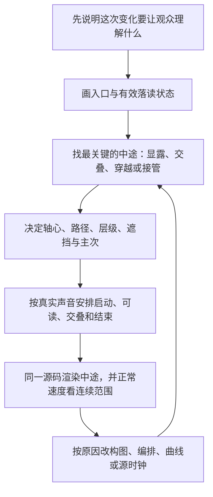

# 场面美术与运动的可执行方法

先学习已采用共同参考的完整发展，再按本片实际材料深化。以下原例来自 [完整原指令](../../motion-case-attention-programme/references/original-input.md)，教学初排不冒充历史实测；尺寸、字体与时长不是默认值。

阅读导航：美术选择与弱稿返修；字位侧转、旧新交接、同源镜片三种中途；遮挡与连续观察；文末纯数学示例。

## 1. 先选择当前需要的观看动作

按内容选择并写成具体句子。以下是选择线索，不是效果配额：

| 当前任务 | 可采用的动作关系 | 需要保持的参照 |
|---|---|---|
| 多个场景或对象中关注一个 | 活动窗口重排、近远错位、前景取得面积 | 同一主体身份、源动作进展 |
| 现象背后还有条件 | 主体让位、遮挡揭字、边缘带出依据 | 现象本身或已建立的判断 |
| 有一个细节值得看 | 同源局部靠近、观察窗口、局部与整体对应 | 真实源时刻、可辨认部位 |
| 一个关系含多个部分 | 先建立共同骨架，再展开差异部分 | 比较尺度、上下/内外结构 |
| 一个物体值得展示或记住 | 局部到整体、拆分/离槽、方向变化、文字接管 | 部件归属、受光和空间 |
| 人物的反应或情绪需要时间 | 保持人物、干净切镜、源声延续 | 真实表情、动作和语义 |

真实素材本身有好的过程时，以其为主要内容；动效负责观看位置与重点，不把它替成低信息符号。需要切镜就切镜，只有共同对象或观看关系需要延续时才作形变接管。


## 美术怎样做好看：从判断到实际样张

### 先选视觉想法，再选颜色

“深色、科技感、绿色强调”还不是美术方向。视觉作者先看当前稿和实际材料，决定：本片主要面对什么对象，观众离它多近，哪些地方需要空间，哪些地方适合平面排印，真实材料和文字怎样共同构图。

例如，已取得有价值的机场活动画面，可以采用“真实空间进入、近距离原件观察接管”的方向；如果核心材料是一件产品，就可以让同一对象持续承载不同观察。方向要由内容与材料支持，不因案例有手机就先做手机。

然后才确定颜色职责、字形语气、轮廓和材质。整片统一的是这些选择之间的逻辑，不是每镜套同一背景、页眉和列表。

### 先做关键构图，具体先做哪几张

不机械要求每镜三张图。针对当前场面的风险选择必要状态：观众第一次看到主体的入口、主要关系最清楚的状态、最容易遮挡混乱的中途，以及交给下一镜的出口。

这几张应使用 **当前真实素材、准确文案、已登记字体和实际作品源码** 。先允许简化非关键装饰，不能另画一张理想效果图当作已实现。[原指令 §9.1](../../motion-case-attention-programme/references/original-input.md)

若美术方向存在实质分歧，做少量真正不同的构图比较。例如同样的票据与文字，一版近距离物体，一版平面排印，比较观看任务是否成立；不是做六套同版式配色供人猜。

### 字体：怎样从“加粗”走到真实排印

**先用本片的字看，而不是只看字体名。** 调用当前字体能力目录后，由原视觉作者选真实字款，渲染最长主读、常用标签和代表字幕。字体选择仍遵守当前项目的用户指定与缺失字体处理规则。

接着看轮廓、实际字幅、笔画重量和阅读条件。显示字可以有更明确性格，正文字幕应稳定可读，标签要和物体归属一致。不要让三层字同等大、同等亮。

字体盒的宽高不等于实际墨迹轮廓；浏览器测量可以检查布局，最终还要看真实渲染。不能用不存在的900字重冒充粗字款，也不能任意横向挤压文字拼出假字体。[原指令 §5.1](../../motion-case-attention-programme/references/original-input.md)

**实际返修例：** “欢迎来到直播间”像细正文时，先核对字体是否回退，再看字幅、字高与凹槽比例；不是先加重阴影。字形太宽时优先选合适字款或调整可用区域，不把整片字幕一起缩小。

### 主次：不是把所有东西都放大

作者先为当前状态选定第一关注，再决定其他层怎样支持。第一关注可以是人物、关键字、真实动作或原文细节，不一定总是最大文字。

将实际画面缩到普通观看尺寸，再看灰度版本：是不是出现几个同等亮、同等大、互不相干的块？标题、来源、字幕和主读有没有重复抢同一信息？

发现竞争时，一次处理一个设计原因。先撤掉常驻同义标题，或压低背景对比，或把主角靠近；不要同时增加大字、加描边、加发光和加运动，令问题更重。

灰度只是检查明暗关系，不替代彩色与连续观看。稳定帧突出主字，动作中途仍可能因新对象突然放大而改变主次，需要一起检查。

### 造型：用原案例把“搜索框”改成“门牌”的过程讲清

**原案例设计。** 身份板约400×96个工作像素，头像直径80，凹槽约272×54，图像约384×216；欢迎语有明确字高，图像上缘与板面相接并有遮挡。[原指令 §6.3](../../motion-case-attention-programme/references/original-input.md)

这组数字属于原例，不是所有视频的模板。它说明的是：作者先决定部件比例和共同空间，物体才可能像一个完整视觉组。

**假设弱稿** 是一根400×40的条，头像24，欢迎语为细小正文，下面的图片与条之间留一段空隙。此时“像工具条”的主要原因是部件比例与关系，不是光影少。

**修正顺序如下。** 先确定本片对象应是什么，再把主要部件的比例重做；让头像有与板面相称的体量，文字属于板内的具体区域；把图像与板真正组成一组。去掉光影看轮廓是否仍成立，然后再补边缘、凹槽和接触。

**换到机票题材时，不复制门牌。** 票据要有票据的轮廓和信息组织；原规则页面保持原件身份；设备才需要壳体。不能把它们都画成相同圆角框，再用标题告诉观众它是什么。

### 材质、光影和空间：具体怎样检查

对于物体风格，先明确主要光向，检查亮边、暗侧与投影是否一致。贴着表面的影子和离开后的影子不应完全相同；文字、边缘和影子应跟随同一个物体变换，不能纸片走了、影子留在原地。

薄纸不应靠强烈多段渐变显得鼓起，设备的厚度不应仅是一圈粗黑描边。摄影材料已有受光时，原创图形要与它协调，而不是全部染成同一种颜色。

平面风格则用轮廓、排印、色块、对齐和负空间成立，不强制加三维、玻璃、金属或霓虹。 **质感不是越多越好，而是所选风格内部要一致。**

### 真实素材和文字怎样组成一幅画面

先查看素材主体的实际位置、行动方向、视线和可裁范围。然后同时决定视频取景、文字区域与原创图形的位置，而不是先给视频固定一个中间小框，再把字塞到四周。

如果主字来到前景，素材仍应保留能理解其身份与行动的部分；若字幕或主字挡住了关键动作，改变构图、出现时机或字幅，而不是简单把素材缩小。

源本身已经表达得很好时，可以直接切镜或保留原动作。图形需要有具体贡献，例如指认原条件、建立比较、引导到细节；不为了“用了动效”而复述画面。

### 一次视觉返修，怎样写才可执行

> 当前帧的主要问题不是背景颜色，而是票据与三组说明同等显眼。保留票据作为第一关注；常驻主题删掉，必要出处降为辅助；把当前必读条件和原位置关联，其他条件暂不进入。下一版先看真实缩略尺寸的入口与比较状态，再决定是否调整色彩。

这样的意见指出了原因、保留项、修改动作和复查位置。不能只说“高级一点”。

**视觉能力单独验证。** 固定准确文案和材料，仅改变美术。如果画面仍然弱，就继续修视觉判断；不能再用“导演故事不好”解释所有问题。


## 动效中途怎样设计：从两个端点，走到完整演出

### “中途”不是时间过半时随便截一帧

假设入口是一部手机，出口是一个节目组。只写“手机下移，节目组出现”，只决定了两个端点，最重要的问题仍然没决定：

手机离开到什么程度时，新内容开始进入？两者同时存在时，第一注意在哪里？新组从哪里被看见？源视频是否继续？声音讲到新内容时，它是否已可读？

**中途设计，就是在变化发生的过程中，主动安排观众能看见什么、先看什么，以及怎样从旧重点过渡到新重点。**

动画的“关键中途姿态”不必位于50%时间。它可能是遮挡刚解除的时刻、两个对象最拥挤的时刻、某个字第一次能读清的时刻，或旧对象离开而新对象还没接上的危险位置。

### 作者具体按什么顺序设计



**先写变化的意义。** 例如“让观众从随手划走的现象，进入提前安排节目的应对”，而不是“这里需要一个转场”。

**再画入口和读清后的状态。** 入口有哪些已经熟悉的对象；出口的新主体、文字和素材怎样组成一幅画面。两个端点都难看，先修美术。

**然后设计关键中途。** 选当前最容易出问题的几个时刻，给出明确姿态与主次。不能用两端位置自动插值，然后默认中间会好看。

**最后安排时间。** 先决定新内容最迟何时要可读，再反推启动时刻；决定旧内容哪些部分继续、哪些部分先退让。不是先给每个对象分配0.5秒，再把它们排成队。

### 每个重要中途，写清六件事

用连续正文即可，不必每次填大表。

**谁还在场。** 主体身份是否连续，还是明确换成另一个对象；哪些参照保留。

**姿态是什么。** 位置、投影尺度、朝向、轴心；不要只有“运动中”。

**谁挡住谁。** 层级、遮挡面积、文字从哪条边被看见；显露不等于全部元素统一淡入。

**此刻先看谁。** 旧对象是否仍然太亮，新对象是否过早抢注意；附属物是跟随还是各自表演。

**速度处于什么阶段。** 起势、通过、减速、读清、穿出；需要停稳的地方停，需要连续观察的地方不强行停车。

**声音与源画面怎样继续。** 源视频不因为父物体移动而重新开始；准确台词与当前观看任务要对应。

下面把这六件事落实到三个具体例子。

### 例子一：“不能冷场”怎样侧转，而不是两组文字平移

#### 先区分原资料和这次教学

原指令给出了四个独立字的侧转、错相和最终槽位。这一节解释怎样把它变成可执行设计；文末数学教学的数学函数是本轮新写的教学实现，不是旧成片源码，也没有宣称已复现旧片观感。[原指令 §5.4](../../motion-case-attention-programme/references/original-input.md)

#### ① 先把最终字形和位置做对

原例的四字最终顺序始终是“不能冷场”，固定在一条阅读线上。先实际渲染字形，确认总字幅、字高和间距，不靠入场动画掩盖终态排印不足。

每个字有自己的容器和竖向轴心；整组共享透视。旋转在单字内部发生，最终槽位不动。不要把“不能”合成一块、“冷场”合成一块；也不要按出场先后重新排列最终文字。

#### ② 决定入场时看见什么姿态

原例让每个字先以较窄的侧面出现，随后转向观众，短位移只作配合。这样中途主要变化来自投影宽度与姿态，不是从很远地方平移。[原指令 §5.4](../../motion-case-attention-programme/references/original-input.md)

| 字与最终槽位x | 相对起点 | 原例初始侧转／动作时长 |
|---|---:|---|
| 不，99 | 0.00秒 | −68°左右，约0.46秒归正 |
| 能，193 | 0.10秒 | +64°左右，约0.45秒归正 |
| 冷，287 | 0.25秒 | +72°左右，约0.46秒归正 |
| 场，381 | 0.17秒 | −70°左右，约0.43秒归正 |

x为原例舞台局部工作坐标，不是视频输出像素。“场”开始较早，但始终在最右侧；开始顺序与阅读顺序是两回事。

#### ③ 主动设计几种不同的中途，而不是所有字同一个进度

下表是按上述关系组织的 **教学观察点** ，不是旧片截图的测量结果。

| 相对时刻 | 应看到的中途状态 | 要防止的问题 |
|---:|---|---|
| 约0.18秒 | “不”已经展开较多，“能”在转向，“场”刚从窄面显露，“冷”尚未进入 | 四字同时相同角度，仍像一个整块标题 |
| 约0.36秒 | “不”接近读清，“能”继续归正；“冷”“场”保留不同姿态 | 字的位移过大，读序和词组轮廓被打乱 |
| 约0.55秒 | 两个早起字已稳，后起字完成剩余转向 | 已读清的字仍反复摆动，观众无法落读 |
| 约0.75—0.82秒 | 全词成为一个稳定主读，手机内的活动继续承担变化 | 为了“不停”再加漂浮，抢走源视频内容 |

这些观察点为什么这样选？第一处检查错相是否真的存在；第二处检查最复杂的共同姿态；第三处检查收势与稳定；最后检查阅读和其他内容是否接上。不是因为每段动画都必须抽四张图。

#### ④ 让姿态先展开，末段再落稳

教学实现可令单字进度 `u` 从0走到1，用 `1-(1-u)^3` 计算转向比例：前段较快展开，末段逐渐归正。位置偏移同时收回，透明度只用于最初短显现，不成为主要动画。

这条曲线不是通用高级公式。若真实字体在侧面过细难认，可以减小起始角度、稍微延长显露，或调整主光与透视；不要先把所有字加粗描边。若后半段显得过早不动，要看内容是否已完成，而不是必然添加反弹。

#### ⑤ 写到源码时要保住什么

每个字绑定固定阅读槽位，内部独立旋转，整体共享透视；字形、影子与附着装饰同组变换。`useCurrentFrame()`对应当前作品时钟，换算成秒后计算每字延迟；不能用真实墙钟或CSS动画来驱动渲染。[帧驱动属性动画](https://www.remotion.dev/docs/animating-properties)

文末数学教学的 `letterStates(t)` 返回这些姿态。它只计算字位和角度，真实字体加载、字形渲染与最终视觉检查仍由现有作者和受管源码完成。

### 例子二：手机怎样交到节目组，不是退完再进

#### ① 先规定“内容落点”，而不是固定转场总长

原例要求：声音讲到“随时被划走的压力”就启动交接；讲到“必须时刻有活”时，新的节目内容已经成立。[原指令 §3.2、§7D](../../motion-case-attention-programme/references/original-input.md)

设“压力”的实际语音起点为 `T`。下面相对时间是依据原例关系选择的教学初排。正式任务必须重新取得当前音轨的准确句群边界；没有词级证据时，不能按字数均分伪造词级时刻。

#### ② 先把整场的交叠排出来

| 相对T的时间 | 旧重点怎样让位 | 新重点怎样建立 |
|---:|---|---|
| −0.10—0.30秒 | 主字退出主要阅读，背景与旧源仍在 | 新组暂不抢主读 |
| 0.00—0.72秒 | 手机向下穿出，源视频继续，不到边缘慢慢停住 | 上部空间逐步让出来 |
| 0.22—0.64秒 | 手机仍在离开 | 头像开始展开到位 |
| 0.26—0.78秒 | 旧源降低主次，不突然变黑 | 板面从头像后展开；文字属于板面，不再单独弹一次 |
| 0.40—1.00秒 | 手机后半段已接近出画 | 图像从下方接到板后，板遮住图像上沿；组成一个主体 |

这不是把时间压得越短越好，而是让多个动作共同完成一次注意力转移。正式“有活”一词比教学初排更早，就需要提前建立或调整讲述，不盲目沿用表中秒数。

#### ③ 把最危险的中途写出来

**T+0.22秒：** 手机开始明显让出上部，头像刚进入。此刻不要同时亮起所有欢迎字、图像、纸条和箭头，否则新旧都在争抢主角。先建立新对象的入口轮廓。

**T+0.40秒：** 手机仍有一部分在场，新板已经逐渐可见，图像刚从下方进入。主要注意应开始转向上部，手机作为退出中的旧关系保持；不是两张完整大图同时等权铺在一起。

**T+0.60秒：** 手机大部分已离开。板与头像组成主组，图像正在接入板后。图像边缘被前景板短暂遮挡，因此它像接入同一物体组，而不是另一个浮动卡片。

**新内容可读以后：** 让主组稳定，纸条与观察过程接手后续发展。不能继续给身份板随机晃动来填满旁白。


文末数学教学用计算状态描述这一过程。它是本轮教学示意，不是旧成片截帧、最终美术样张或受管渲染验收。

#### ④ 手机退出的速度，怎样避免“滑到底停车”

只对位置使用完整的ease-out，容易在画面底部越来越慢，让人等它离开。该例更适合在出画前仍保留向下速度，真正出了可见范围再卸载。

教学舞台高436，手机起始中心y=205、高462。选退出终点中心y=720，则手机上边缘为489，已在舞台下方。这里的终点不是为了让它在边缘停下，而是为了保证卸载前整个物体已经不可见。

一种教学位移是：

```text
u = clamp((当前秒数 - T) / 0.72, 0, 1)
y = 205 + 515 × (2u² - u³)
```

这条函数起点速度为0，末端仍有向下速度；0.72秒后物体已出画再移除。它只是本例的计算选择，不是物理真实性证明。若边缘仍可见就调整路径或卸载时刻，不能依靠突然淡出掩盖错误。

#### ⑤ 板面与图片，怎样避免“各弹各的”

板、凹槽、欢迎字属于一个局部容器。展开可以通过遮罩显露板面与文字，不对字体横向拉伸；头像独立展开但与板共享空间。图像在板后接入，层级从一开始确定，不在中途突然改z-index造成跳层。

新的组内文字先确保真实尺寸，显露期间允许部分遮挡，达到阅读状态后必须完整。不是板弹一下、凹槽弹一下、字再弹一下、图再弹一下。

#### ⑥ 源视频时钟必须独立

手机运动只改变外层变换。内部视频沿原来已经开始的时间继续播放；不能为了转场重新挂载一个从0开始的视频。

可以在思考中分开三件事：整片时间、当前作品时间、源媒体时间。文末数学教学给出了源时间映射的教学函数；它不是可以直接填入VideoFlowCut的新增参数。现有媒体组件的用法仍以当前受管合同为准。[原指令 §9.1](../../motion-case-attention-programme/references/original-input.md) 与 [当前交接合同](../../_shared/PROJECT_REVISION_AND_HANDOFF.md)

#### ⑦ 返修时先找到是哪一层错

新内容来晚了，先改相对语义时机；中途两组都太抢眼，改面积、亮暗、层级和显露顺序；手机发飘，改姿态与速度；源视频重播，修时钟和组件生命周期。不要把这四种问题都变成“调一下spring”。

### 例子三：观察镜怎样连续阅读，不是逐行到站停车

#### ① 两种连续性必须同时成立

**位置连续：** 上一段结束的位置与下一段开始的位置一致，不发生跳位。

**速度与方向连续：** 经过连接处不突然停住、加速或折向。仅把路径点连起来，并不能保证这一点。

原指令要求沿同一路径观察、经过需要读的词时减速，中途不强制归零；起始进入和最后读清可以停稳。[原指令 §8.3](../../motion-case-attention-programme/references/original-input.md)

#### ② 先决定每一处要观察什么

原例观察中心依次在 `(306,178)`、`(309,222)`、`(310,270)`、`(305,310)` 附近。它们对应节目入口、中部安排、中下部和结句，不是为了让圆形沿四个点运动而存在。[原指令 §8.3](../../motion-case-attention-programme/references/original-input.md)

在新主题里，先取得原件，找到真实需要观察的位置。原文没有对应关系就换方法，不强制每片出现圆形镜片。

#### ③ 再决定“经过时慢一点”，不是每项都停一次

下面时间与速度是 **本轮计算演示** ，不是原片测量，也不是当前配音时序。速度单位是工作像素／秒。

| 教学节点 | 位置x,y | 经过节点时的速度vx,vy |
|---:|---|---|
| 0.00秒 | 306,178 | 0,0：起点可以停稳 |
| 1.05秒 | 309,222 | 2,26：放慢，但仍继续往下 |
| 2.15秒 | 310,270 | −1,26：继续观察，不归零 |
| 3.25秒 | 305,310 | 0,0：结句允许稳定 |

相邻两段共享节点的同一个速度，便不会各自ease-out到0再启动。文末数学教学用三次Hermite插值同时约束端点位置和速度，并检查了本组参数没有倒退、稳定镜圆没有越界。

**不是所有连续镜头都必须不停。** 材料需要逐项仔细阅读时，适当停留可以更好；这里针对的是原例已确定的连续观察任务，不把数学连续当成审美目标。

#### ④ 镜内外必须来自同一个状态

设源场景点为x，采样中心p，镜片显示中心q，倍率z。原指令的映射为：

```text
镜内位置 = q + z × (x − p)
```

同一帧先计算节目场景状态，普通画面和镜内放大都使用它。镜内不是另写一份更大的文字，更不能把镜片自己再次递归画进去。[原指令 §8.1](../../motion-case-attention-programme/references/original-input.md)

场景父级有缩放和位移时，先把采样点换到相同坐标系；不能把最终输出像素直接放进480宽的局部舞台。

#### ⑤ “字没裁掉”要怎样检查

原例镜片直径约216，倍率初排约1.42；最后中心y=310，底部是418，在高436的舞台内留有空间。这些只是原例的起点。[原指令 §8.2–8.3](../../motion-case-attention-programme/references/original-input.md)

真正要检查的是当前必读字形，而不是整张纸面的空白都必须装下。放大以后，必读字形边界要在圆内并留余量；纸面空边、非主读邻项可以自然裁去。实际检查还要看透视和字形，不能只信一个矩形盒尺寸。

若镜片退出，先在位置与直径保持的情况下把倍率回到1，使镜内外重合，再撤去边缘和取样层。不要缩整个镜内内容，留下第二套小字覆盖原字。若结句已经完成，可以直接结束，不必表演额外退场。

### 再补一种常见中途：对象从遮挡后出现

原例的椅子先让椅背解除遮挡，再让扶手、座面和脚轮取得前景；原有入口与人群略退小、降对比，但仍保持关系。[原指令 §7B](../../motion-case-attention-programme/references/original-input.md)

新任务采用这种方法时，先指定遮挡者和被遮挡者，确认实际素材能组成可信的完整轮廓。再确定显露顺序：观众先认出哪个部分，何时读成整个对象，接触或投影怎样变化。

如果只有一张完整背景摄影图，不具备分离能力，就采用干净取景或明确切镜；不能假定已经抠出物体。若同一部件需要从原位置来到前景，起点投影要对齐；两份不重合图层交叉淡化，只会产生双影，不等于同一个物体连续移动。

### 怎样把这些方法写成当前作品的演出稿

不要只交“手机下移、节目组进入”。至少写到下面这个深度：

> 语音进入“压力”时，旧主字先退让，手机开始向下穿出且内屏源继续播放。手机让出上部的过程中，头像先建立新组入口，板面从它后方显露；板、凹槽与欢迎字保持同一空间，不分别弹入。新图在板后上移接住主体，最拥挤的中途降低旧手机对比，第一关注转向新组。讲到新的应对方式时，新组已完整可读。旧手机完全出画再卸载，随后由节目内容展开承担发展，不额外停留。

然后补当前实际素材、声音锚点、关键几何、需要看的中途，以及源码里的实现位置。这才是可实现的设计；不需要每次写成几千字，但主要关系不能缺。

### 动效验收看什么，怎样避免“看了四张图就说丝滑”

先用正常速度看当前完整接点及前后语境，判断是否读得懂、有无空等、主次是否自然。再慢放或抽帧定位具体姿态和跳位。静帧只能证明那个时刻的构图，不能单独证明连续流畅；抽样也不能自动证明听感。

局部修订由原视觉作者处理。若需要改主要对象、内容顺序或跨场接口，再回导演协调。正式提交和版本写入仍由主任务负责。


## 6. 源码实施与交接

混合场面先落实 [素材到场面](../../_shared/MATERIAL_TO_SCENE.md) 的具体结合，再按 [素材坐标与时间](material-space-and-time.md) 实现。后者给出cover/contain映射、聚焦点、局部窗、Sequence和跨作品源时钟的具体计算；它是作者教学，不新增运行时模块。实际位置必须来自原件观察，不能拿数学例子的坐标当实测。

源媒体、作品局部、整片和声音使用独立、可核对的时间映射。跨作品接管时核对投影、姿态、文字、材质、源帧；容器显式拥有所需宽高，子层共享父变换。

尽量用同一份命名时序常量驱动动画与 resolveMotionEvents。事件描述对象和阶段须与实际实现相符；事件值本身不证明美术和阅读通过。

每个关键设计写出实现位置与中途检查：例如“让位揭字—ForegroundWindow / conditionText—检查遮挡解除中点”。若技术资源需要分作品，按正常预算拆分并继承出口，不把技术上限当整片时长。


## 数学教学：帧驱动的状态计算

### 这段代码做什么，不做什么

下面是本轮新写的纯计算教学代码，帮助作者把上文的字位、侧转、交叠与连续路径落实为每一时刻的状态。它不读取素材、不访问网络、不修改项目、不创建新的平台API，也不是旧成功视频的原源码。

它没有包含真实字体绑定、最终美术、视频组件与完整Remotion入口，因此不能作为完整作品直接提交。数值回归通过测试从本教学代码块提取运行；它不能替代受管渲染、真实语音或完整视频审片。

使用现有受管源码时，原作者可以把所需函数内联进去，或按当前允许的模块方式组织；不能假设受管环境允许任意本地导入。参数含义与坐标由当前作品确定，本例仍使用原例480×436局部舞台。

### 怎样接入帧驱动的作品

Remotion的属性动画应由当前帧驱动，而不是CSS实时动画。Sequence内的局部帧可能相对其起点偏移；本基线使用Remotion 4.0.519，不建议为使用网页最新示例而顺带升级依赖。[Remotion帧驱动动画](https://www.remotion.dev/docs/animating-properties) 与 [Sequence局部帧](https://www.remotion.dev/docs/sequence)

在当前作者自己的组件里，先分清时间。下面只是时钟对接片段；`sceneOffsetSec`与`pressureAtSec`都是本作品自定义的、已经核对的秒数，不是新工具参数。

```tsx
// 放在已有受管组件内部；相关hook按当前允许的方式引入。
const frame = useCurrentFrame();
const {fps} = useVideoConfig();
// 若当前frame已经是此场面的局部帧，sceneOffsetSec取0。
// 若它是当前整件作品帧，先减该场在作品内的真实起点。
const sceneTimeSec = frame / fps - sceneOffsetSec;
const state = handoffState(sceneTimeSec - pressureAtSec);

// phone外层用state.phone的位置；内层源视频沿原时间线继续。
// board用revealWidth作为遮罩显露宽度，不拉伸文字。
// avatar、image采用其相对位置；已确定的前后层级保持。
// 同一状态函数也为设计检查点提供数值，不另写矛盾的事件表。
```

真实源入点、源帧率与播放速度继续由现有媒体合同映射。下文的`sourceTimeAt`仅说明数学关系，不能被误写成某个未经核实的视频组件属性。

### 连续路径公式怎样理解

Hermite插值除了两端位置，还接收两端速度。设一段持续时间为Δt，归一化进度为u，位置p、速度v使用同一坐标与秒单位，则：

```text
p(u) = (2u³−3u²+1)p0 + (u³−2u²+u)Δt·v0
     + (−2u³+3u²)p1 + (u³−u²)Δt·v1
```

相邻段在公共节点使用相同位置和速度，位置与一阶速度就连续。它不自动保证任意输入下没有过冲、不自动保证高阶加速度连续，更不自动保证好看；实际参数仍要检查路径、阅读和语义。本文对给定教学参数另外抽样检查了不倒退和镜圆边界。

### 完整教学代码：`motion-teaching.mjs`

```javascript
/**
 * 本轮教学计算：不是案例原源码，不是 VideoFlowCut 新 API。
 * 坐标均为 480 x 436 教学舞台局部坐标；t 为事件起点后的秒数。
 * 真实任务须依据当前声音、字体和素材重新设计。
 */
const finite = (value, name) => {
  if (!Number.isFinite(value)) throw new TypeError(`${name} must be finite`);
  return value;
};
export const clamp01 = (u) => Math.max(0, Math.min(1, u));
export function progress(t, start, duration) {
  [t, start, duration].forEach((v) => finite(v, 'time'));
  if (duration <= 0) throw new RangeError('duration must be > 0');
  return clamp01((t - start) / duration);
}
const mix = (a, b, u) => a + (b - a) * u;
const outCubic = (u) => 1 - (1 - u) ** 3;
const smooth = (u) => u * u * (3 - 2 * u);

// 字位始终按阅读顺序。时间错相不改变阅读槽位。
const LETTERS = Object.freeze([
  {text: '不', x: 99, delay: 0,    duration: 0.46, angle: -68, dx: -12, dy: 3},
  {text: '能', x: 193, delay: 0.10, duration: 0.45, angle: 64, dx: -5, dy: -4},
  {text: '冷', x: 287, delay: 0.25, duration: 0.46, angle: 72, dx: 5, dy: -3},
  {text: '场', x: 381, delay: 0.17, duration: 0.43, angle: -70, dx: 12, dy: 2},
]);
export function letterStates(t) {
  finite(t, 't');
  return LETTERS.map((k) => {
    const u = progress(t, k.delay, k.duration);
    const pose = outCubic(u);
    return {
      text: k.text, slotX: k.x,
      x: k.x + k.dx * (1 - pose), y: 224 + k.dy * (1 - pose),
      rotateYDeg: k.angle * (1 - pose),
      opacity: smooth(progress(t, k.delay, 0.07)),
    };
  });
}

// 与原指令关系相符的一种教学初排，不是旧片实测曲线。
export function handoffState(t) {
  finite(t, 't');
  const exit = progress(t, 0, 0.72);
  // 初速为0，末速度不归零；整部手机出画后才卸载。
  const exitDistance = 2 * exit ** 2 - exit ** 3;
  const board = outCubic(progress(t, 0.26, 0.52));
  return {
    phone: {
      x: 240, y: 205 + 515 * exitDistance, width: 232, height: 462,
      opacity: mix(1, 0.58, smooth(progress(t, 0.16, 0.36))),
      mounted: t < 0.72,
    },
    oldTitleOpacity: 1 - smooth(progress(t, -0.10, 0.40)),
    avatar: {
      x: 88, y: 88, diameter: 80,
      scale: mix(0.72, 1, outCubic(progress(t, 0.22, 0.42))),
      opacity: smooth(progress(t, 0.22, 0.14)),
    },
    board: {x: 40, y: 40, width: 400, height: 96, revealWidth: 400 * board},
    image: {
      x: 48, y: mix(176, 126, outCubic(progress(t, 0.40, 0.60))),
      width: 384, height: 216, opacity: smooth(progress(t, 0.40, 0.18)),
    },
  };
}

/** p单位为坐标像素，v单位为像素/秒。返回位置与速度。 */
export function hermite(t, t0, t1, p0, p1, v0, v1) {
  [t,t0,t1,p0,p1,v0,v1].forEach((v) => finite(v, 'argument'));
  if (t1 <= t0) throw new RangeError('t1 must be > t0');
  const dt = t1 - t0;
  const u = clamp01((t - t0) / dt);
  const position = (2*u**3-3*u**2+1)*p0 + (u**3-2*u**2+u)*dt*v0
    + (-2*u**3+3*u**2)*p1 + (u**3-u**2)*dt*v1;
  const velocity = ((6*u*u-6*u)*p0 + (3*u*u-4*u+1)*dt*v0
    + (-6*u*u+6*u)*p1 + (3*u*u-2*u)*dt*v1) / dt;
  return {position, velocity};
}
// 节点语义时刻为本轮数学演示值，不是假造的语音测量。
const LENS = Object.freeze([
  {t: 0, x: 306, y: 178, vx: 0, vy: 0},
  {t: 1.05, x: 309, y: 222, vx: 2, vy: 26},
  {t: 2.15, x: 310, y: 270, vx: -1, vy: 26},
  {t: 3.25, x: 305, y: 310, vx: 0, vy: 0},
]);
export function lensState(t) {
  finite(t, 't');
  const first = LENS[0], last = LENS[LENS.length - 1];
  if (t <= first.t) return {x: first.x,y: first.y,vx: 0,vy: 0,radius: 108};
  if (t >= last.t) return {x: last.x,y: last.y,vx: 0,vy: 0,radius: 108};
  let i = 0;
  while (i < LENS.length - 2 && t > LENS[i + 1].t) i++;
  const a = LENS[i], b = LENS[i + 1];
  const x = hermite(t,a.t,b.t,a.x,b.x,a.vx,b.vx);
  const y = hermite(t,a.t,b.t,a.y,b.y,a.vy,b.vy);
  return {x:x.position,y:y.position,vx:x.velocity,vy:y.velocity,radius:108};
}
export function sampleInLens(point, sampleCenter, displayCenter, zoom) {
  [point.x,point.y,sampleCenter.x,sampleCenter.y,displayCenter.x,displayCenter.y,zoom]
    .forEach((v) => finite(v,'coordinate'));
  if (zoom <= 0) throw new RangeError('zoom must be > 0');
  return {x:displayCenter.x+zoom*(point.x-sampleCenter.x),
    y:displayCenter.y+zoom*(point.y-sampleCenter.y)};
}
export function sourceTimeAt(globalSec, visibleStartSec, sourceInSec, rate = 1) {
  [globalSec,visibleStartSec,sourceInSec,rate].forEach((v) => finite(v,'time'));
  if (rate <= 0 || sourceInSec < 0) throw new RangeError('invalid source range/rate');
  return sourceInSec + Math.max(0, globalSec-visibleStartSec)*rate;
}
```
