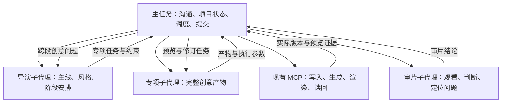

# VideoFlowCut 创意子代理分工与落地方案（待审阅）

整理日期：2026-09-14。

实施进展：用户已随后要求按本方案开发与验收。代码、候选验证、实际交接证据及剩余验收边界见[开发与验收记录](./VideoFlowCut_创意子代理开发与验收记录.md)。以下正文保留讨论时的待审阅表述，不作为当前实施状态。

本文同步本次讨论中的分工和落地建议，供用户阅读后决定是否实施。用户已提出“所有涉及创意的部分单独调用子代理执行”的目标；本文中的具体组织方式、代码调整和实施范围仍是待审阅方案，不表示已经批准开发或已经部署生效。

本次操作只新增本文档，不修改代码、Skills、配置、已有文档或正式视频项目。

## 1. 目标与基本边界

建议由主任务负责沟通、项目状态、调度、确定性提交和交付，由子代理负责创意判断、创意产物和专业审片。

判断边界的核心问题是：这一步是否还需要决定“怎样表达才合适”？如果需要，就交给子代理。故事主线、观众承诺、整体风格和节奏安排也属于创意，不能只把动效制作移出去，却把导演判断继续留在主任务。

本文统一使用以下称呼：

| 称呼 | 含义 |
|---|---|
| 主任务／协调者 | 与用户沟通，管理项目事实、分派、提交、证据回收和交付 |
| 导演子代理 | 执行整片导演判断和一个主要视频工作流，负责主线、风格、阶段创意安排和跨段协调 |
| 专项子代理 | 在明确范围内完成文稿、素材选择、动效、字幕、声音等创意工作 |
| 审片子代理 | 依据实际声画判断表达、节奏、自然度和审美，定位问题并提出复核范围 |
| 主要视频工作流 | Presenter、Explainer、Vlog 中选定的一条专业工作流，运行在导演子代理中 |

“主任务”与“主要视频工作流”必须区分。现有 Skills 中的“交回主工作流”，在新链路中指回到导演的专业判断，不能默认解释成主任务继续创作。

## 2. 当前基础与实际缺口

此前梳理已查看根目录 Skills、相关实现、现有测试和当前会话的实时 MCP Schema。现有专业知识、项目对象、Revision、预览和审计能力可以复用，但还需要建立真实的子代理调度。

| 当前基础 | 本方案需要补上的部分 |
|---|---|
| `production-director` 和三个主要工作流已有阶段路由与专项交接 | 明确由哪个代理执行，并发生真实分派；读取另一个 Skill 不等于启动子代理 |
| Agent 工作单记录用户意图、接手和完成状态 | 工作单不会自动调用模型，不能把它当成现成的子代理调度器 |
| `submit_motion_work` 接收固定源码和参数，提交受管作品渲染 | 构思、生成说明、源码制作和预览修订应由动效子代理完成 |
| Project Revision、Impact 和质量证据已有约束 | 将这些约束纳入跨代理交接，防止旧方案直接写入新版本 |
| ProductionRun、CreativeDecision 和 SkillExecutionReport 已有审计 | 补充委派来源关联，同时用宿主实际调用记录验证是否发生过分派 |
| 根 Skills 可同步到插件发行副本 | 通过现有发布流程交付新入口与规则，并验证安装后的实际内容 |

参考实现：

- [导演阶段交接](/E:/ai/VideoCut/.agents/skills/production-director/SKILL.md)。
- [项目与交接合同](/E:/ai/VideoCut/.agents/skills/_shared/PROJECT_REVISION_AND_HANDOFF.md)。
- [Agent 工作单与创意审计 MCP](/E:/ai/VideoCut/apps/server/src/mcp.ts)。
- [受管动效 MCP](/E:/ai/VideoCut/apps/server/src/motion-tools.ts)。
- [创意决定与审计类型](/E:/ai/VideoCut/packages/contracts/src/index.ts)。

以上是方案依据，不是长期维护的能力快照。后续实施和剪辑执行仍须读取当时的实时 Schema，不能把本文提议的字段当成当前已存在的接口。

## 3. 哪些工作交给子代理

| 创意工作 | 子代理负责的内容 | 对应现有 Skills |
|---|---|---|
| 整片导演与故事设计 | 观众承诺、故事顺序、开头结尾、整体风格、节奏、跨段衔接 | `production-director` 的创意部分，以及三个主要视频工作流 |
| 文稿与语义剪辑 | 原创文稿、删留、重排、精彩片段、Take 选择、停顿和切口判断 | `semantic-continuity`、对应主要工作流 |
| 视觉统筹与分镜 | 每段看什么、何时保持人物、何时使用图形、Scene 边界、注意力变化 | `visual-treatment-planning`、`scene-planning` |
| 视觉素材选型与生成 | 搜索策略、候选比较、素材适配、生成提示词及结果筛选 | `visual-asset-sourcing` |
| B-roll 与画面切换 | 是否采用、源片段选择、全屏或画中画、裁切、进入与返回 | `cutaway-planning` |
| 动效设计与制作 | 构思、关键画面、美术、构图、运动、时机、Remotion 源码及预览修订 | `remotion-production`、`depth-composition`、`effect-timing` |
| 证据与图表表达 | 证据怎样支持主张、阅读顺序、图表形式、高亮与条件呈现 | `evidence-visualization` |
| 配音与人物表演 | 音色适配、语气、重音、自然分段、表情手势和表演版本选择 | `voice-production`、`avatar-performance` |
| 字幕设计 | 分卡、排版、强调、阅读节奏、与画面的主次关系 | `captions` |
| 音乐与音效 | 选曲选音、情绪走向、声音留白、音效落点、听感调整 | `sound-asset-sourcing`、`audio-finishing` |
| 创意审片 | 是否讲清楚、是否自然、好看、拖沓、重复，以及问题应退回哪里 | `quality-verification` 的专业审片部分 |

六个 `motion-case-*` 及案例索引是动效子代理按需读取的资料，不为每个案例单独建立一个代理。一个专项子代理可以读取多个相关 Skills，负责一个完整工作范围。

子代理同样只能使用已发布能力。生成或处理能力尚未实现时，只能形成可审阅方案或报告缺口，不能把计划写成已完成的产物。

## 4. 哪些工作可以留在主任务

| 主任务工作 | 执行边界 |
|---|---|
| 用户沟通 | 收集目标、硬约束、反馈和已有批准；需要构思方案时交导演子代理 |
| 项目定位 | 确认 Project、Revision、素材、现有对象、未完成 Job 和可用工具 |
| 客观资料准备 | 导入指定文件、转写、读取媒体参数、整理来源和观察证据 |
| 调度与依赖管理 | 分派范围、提供上下文、等待结果、跟踪未完成事项 |
| 确定性执行 | 按子代理提供的完整方案提交项目修改、生成任务和渲染 |
| 技术核验 | 检查版本、引用、范围、资源就绪、失效对象和文件规格 |
| 交付与报障 | 汇总实际审片结果、处理导出、报告平台阻断并向用户交付 |

资料准备不包含素材的最终创意采用判断。分析工具给出的事实和候选可以由主任务整理，但“选哪条、放在哪里、为什么值得用”仍交给子代理。

| 用户要求或当前问题 | 处理方式 |
|---|---|
| 把指定字幕上移 20 像素 | 主任务按明确参数执行 |
| 字幕放在哪里更舒服 | 字幕或构图子代理判断 |
| 导入这三条视频 | 主任务执行 |
| 三条视频中哪条适合开头 | 导演或剪辑专项子代理判断 |
| 用已经确定的音色与参数生成旁白 | 主任务提交生成任务 |
| 旁白怎样处理才自然 | 配音子代理判断并根据真实声音修订 |
| 当前版本缺少审片证据 | 主任务识别证据缺口并分派补审 |
| 当前版本的节奏是否成立 | 审片子代理依据实际播放判断 |

## 5. 代理组织与主调用链

### 5.1 新增轻量协调入口

建议新增 `production-coordinator` Skill，作为主任务入口。它负责定位、分派、提交与收口，不承接文稿、风格、构图、运动或听感设计。

拟新增位置：`E:/ai/VideoCut/.agents/skills/production-coordinator/SKILL.md`。该文件当前只是拟议项，本次不创建。

整片任务按以下关系运行：

```text
主任务读取 project-basics、production-coordinator
→ 准备用户约束与当前项目事实
→ 启动导演子代理
→ 导演读取 production-director，并选择一个主要视频工作流
→ 导演返回当前阶段创意结论及下一项专项任务
→ 主任务分派、提交、回收实际版本和预览
→ 导演、专项与审片子代理完成修订和收口
→ 主任务完成技术检查与交付
```

局部创意任务直接进入对应专项，不重跑整片；明确参数的机械修改由主任务执行。若局部问题涉及主线、跨段结构或整体风格，则返回导演子代理判断。

### 5.2 使用宿主原生子代理

在当前 Codex 宿主中，由主任务通过 `spawn_agent` 启动子代理，通过 `followup_task` 让原代理继续修订。它们属于宿主协作能力，不是 VideoFlowCut 新增的 MCP 工具，也不是新的模型服务。

这类子代理属于当前任务内部协作，不需要为每个专项创建侧边栏任务。保留一个可续接的导演代理，修改反馈尽量交回原负责人，以保留专业上下文。

第一版建议由主任务统一派发。导演提出专业任务和依赖，协调者负责执行调度。授权子代理可以直接完成创作，不因为“涉及创意”而递归启动下一层代理。



## 6. 交接必须形成产物与预览闭环

### 6.1 输入与返回要求

| 输入 | 子代理返回 |
|---|---|
| 用户任务、当前阶段和明确范围 | 本次完成范围及剩余事项 |
| Project、输入 Revision、相关对象 ID | 产物依据的输入版本 |
| 事实素材、真实时序、已有审阅证据 | 选择理由、事实依据与限制 |
| 用户硬约束、整片风格、前后接口 | 完整文稿、源码、素材选择或参数 |
| 验收要求 | 需要的预览、实际观察和修订结论 |

这些是阶段交接要求，沿用现有项目对象和报告承载，不新增第二套 Story、Scene 或 Timeline。

子代理不能只返回“做一个流畅的产品动画”，让主任务继续补设计。主任务可以填入真实项目 ID、工具返回的新对象 ID和经核验的提交版本；文案、构图、时机、源码等创意内容由子代理提供。

如果子代理需要更多素材或预览，可以先返回明确的获取请求。主任务取得证据后继续交给同一代理，不要求一次调用完成全部工作，也不能把“等待证据”记为创作完成。

### 6.2 一个连续动效段的实际闭环

1. 主任务交付段落任务、旁白时间与精度、素材、人物和字幕约束、前后画面。
2. 动效子代理完成构思、完整生成说明、源码、图片绑定和内部事件帧。
3. 主任务按实时 Schema 提交受管作品，跟踪结果并读回实际版本。
4. 主任务把实际作品交回原动效子代理。
5. 子代理审阅、修改，或返回可放置结论及完整参数。
6. 主任务放入项目并渲染真实合成。
7. 子代理结合人物、字幕、声音和前后段再次审阅。
8. 审片子代理按本次范围复核；涉及跨段创意的问题由导演子代理协调。

作品生成成功不等于设计通过；独立作品通过不等于真实合成通过；局部段落通过不等于整片交付通过。仍沿用现有 Preview、Editorial Review 和最终 Artifact 的证据边界。

## 7. 第一版由主任务统一写入

第一版建议由子代理完成创意与审阅，由主任务统一提交正式项目修改。独立设计和资料审阅可以并行，正式写入集中排序，以复用现有 Revision 机制。

具体要求如下：

- 每次提交前读取当前版本，核对目标对象和依赖；每次写后读回对象、Revision、Impact 和失效范围。
- 会在完成时回写项目的生成 Job 也纳入写入安排。串行提交接口不等于 Worker 不会在后台改变项目版本。
- 输入对象或上下文发生变化时，将差异交回原子代理确认；不能只替换 `base_revision_id` 后重发旧方案。
- 主任务可完成无歧义的 ID 回填和接口参数装配，不能借此改变子代理的创意决定。
- 字幕、动效、人物或声音争夺重点时，由导演子代理协调；主任务负责落实协调后的结果。
- 子代理的创意与审阅活动仍受已发布能力、真实证据和正式项目边界约束。

这个选择的代价是正式提交环节串行，较大的源码或参数需要经过一次主任务转交。它能把创意推理移出主线程，但不能保证主线程完全不接触创意产物。

## 8. 需要修改的文件与最小范围

### 8.1 规则与 Skills

| 修改位置 | 准备解决的问题 |
|---|---|
| [AGENTS.md](/E:/ai/VideoCut/AGENTS.md) | 明确主任务与创意子代理边界，要求真实分派，并约定防递归、统一提交及失败处理 |
| 拟新增 `production-coordinator` Skill | 建立主任务专用的协调入口 |
| [project-basics](/E:/ai/VideoCut/.agents/skills/project-basics/SKILL.md) | 对齐新的协调入口及跨代理项目定位、版本读回要求 |
| [production-director](/E:/ai/VideoCut/.agents/skills/production-director/SKILL.md)及三个主要工作流 | 明确在导演子代理中运行，提出专项任务，保留跨段创意协调权 |
| [根 Skills 目录](/E:/ai/VideoCut/.agents/skills)中的创意专项 | 调整执行与交接段落，要求完整产物、参数、预览请求及修订返回 |
| [quality-verification](/E:/ai/VideoCut/.agents/skills/quality-verification/SKILL.md) | 区分主任务技术检查与子代理专业审片 |
| [共享交接合同](/E:/ai/VideoCut/.agents/skills/_shared/PROJECT_REVISION_AND_HANDOFF.md) | 补齐角色、输入版本、产物、提交、证据和失败返回规则 |
| [MCP 执行合同](/E:/ai/VideoCut/.agents/skills/_shared/MCP_EXECUTION_CONTRACT.md) | 在审计参数实际实现后同步接口说明，区分宿主协作工具和视频 MCP |

修改聚焦角色、执行顺序和交接段落。专业创作知识与案例继续保留；案例资料按需由子代理读取，不把创作型 Skill 重写成纯调度清单。

运行时 Skills 的唯一来源仍是根目录 `.agents/skills/`，本文只作为架构与审阅资料，不成为第二套可执行规则。

### 8.2 少量审计代码

现有 CreativeDecision 和 SkillExecutionReport 已保存创意决定、对象和证据。建议在现有创意决定记录中增加可选的委派来源信息，兼容旧报告，至少能够关联：子代理标识、本次分派标识、输入 Revision、承担职责，以及现有产物和预览证据。

上述内容是拟议的数据要求，不是已发布字段名；具体字段及校验应在实施时与实时 Schema、现有类型和测试一起确定。

| 文件 | 拟修改内容 |
|---|---|
| [contracts](/E:/ai/VideoCut/packages/contracts/src/index.ts) | 增加委派来源类型，兼容历史报告 |
| [EditingApplication](/E:/ai/VideoCut/packages/edit-application/src/index.ts) | 校验并保存来源信息，继续使用现有审计存储 |
| [MCP 注册](/E:/ai/VideoCut/apps/server/src/mcp.ts) | 扩展现有创意决定记录参数 |
| [核心测试](/E:/ai/VideoCut/tests/core.test.ts) | 验证来源读回、版本关联、旧报告兼容及不新增视频 Revision |

审片子代理的结论也通过现有质量记录与创意决定关联。ProductionRun 继续承担审计，正式成片事实仍由 Project Revision 和实际 Artifact 表达。

委派来源字段用于追溯。仅填写代理 ID 不能证明真实启动过子代理，仍需要宿主调用记录作为执行验收依据。第一版属于工作流约束与可追溯审计，不是平台身份权限强隔离。

## 9. 验收与实施顺序

### 9.1 四层验收

| 验收层 | 必须证明的内容 |
|---|---|
| 静态合同 | 协调入口可发现；创意专项具有明确执行角色；交接、案例引用和发行副本一致 |
| 代码回归 | 委派来源可读回；审计不制造视频 Revision；旧报告仍可读取 |
| 真实 Codex 任务 | 实际启动子代理，返回完整产物，并在收到真实预览后继续修订 |
| 成片验证 | 正确版本的实际声画通过现有审片和交付检查 |

现有 [Skills 集成测试](/E:/ai/VideoCut/tests/skills-v5-integration.test.ts)需补充协调入口、角色与交接检查。现有 [创意验收脚本](/E:/ai/VideoCut/scripts/presenter-creative-agent.eval.ts)可以验证 MCP 链路，但不能代替宿主真实分派或专业审美判断。不能以模拟代理、手填报告或出现一串 Skill 名称作为真实执行通过的依据。

真实任务至少覆盖以下场景：

- 完整视频经过导演、专项和审片子代理。
- 局部创意修改直接进入对应专项。
- 明确参数的机械修改由主任务完成。
- 子代理产物不完整时返回补全，主任务没有接手创意设计。
- 输入版本或依赖变化后重新确认方案。
- 子代理不可用、工具缺失或 Runtime 阻断时保留未完成状态，按已有流程报障。

### 9.2 实施顺序

1. 完成协调入口、角色规则和共享交接合同。
2. 用一个连续动效段验证“分派—产物—提交—预览—修订”闭环，补齐交接缺口。
3. 将同一合同落实到所有创意专项和三个主要视频工作流。
4. 完成审计代码、静态测试、代码回归和真实任务验收。
5. 同步插件 Skills，构建并验证候选版，再按既有流程正式切换。

代码能力、Skills、相关配置与路由／交接测试按同一完整交付范围更新。验证一个样段只是中间检查点，不表示“所有创意均由子代理执行”的目标已经完成。

测试使用隔离项目和候选环境；正式视频仍由原剪辑任务维护。候选 Runtime B 使用独立端口和工作区，不与生产 Runtime A 共用生产数据库的 Worker 队列。

## 10. 失败处理与发布验证

| 情况 | 处理方式 |
|---|---|
| 子代理只返回摘要或缺少必要参数 | 主任务返回原代理补全，不自行补设计 |
| 创意或审片未通过 | 返回对应专项修订；跨段问题交导演协调 |
| 子代理需要素材或预览 | 主任务取得明确请求的证据后续接原代理 |
| 输入版本变化 | 读回变化与影响，交原负责人重新确认受影响判断 |
| 提交结果未知 | 先核对 Job、Revision 和实际对象，不盲目重放写入 |
| 宿主缺少子代理能力 | 明确阻断相关创意步骤，不静默退回主任务创作 |
| MCP 工具缺失、报错或 Runtime 故障 | 停止该步，由主任务沿既有 `report_editing_blocker` 流程记录 Repair Ticket，不代替修复任务改平台 |
| 无法取得足够声画证据 | 保留未完成或无法判定状态，不以工具成功宣称创意通过 |

发布复用现有 [Skills 同步脚本](/E:/ai/VideoCut/plugins/videoflowcut/scripts/sync-skills.mjs)和[构建入口](/E:/ai/VideoCut/package.json)，从根 Skills 生成发行副本。运行时发行物沿现有流程生成到 `E:/ai/VideoCut/plugins/videoflowcut/runtime/dist/`，不手工覆盖 Codex 已安装插件缓存。

正式切换在候选验证完成后进行。核对 Runtime 与 MCP 的 Release ID、API 和 Worker 健康，同时确认新会话实际读取了新版协调入口和 Skills；只修改仓库源码或只比较 Runtime 版本，不能证明插件中的 Skills 已更新。

若有因平台问题暂停的原剪辑任务，仍由原报告者重新连接 MCP、读取当前 Revision，并完成 `acknowledge_repair_deployment` 后恢复，不能由修复任务代替它继续创作。

## 11. 第一版建议范围、代价与待审阅事项

第一版建议实现：所有创意环节实际分派、完整产物回收、真实预览修订、主任务统一写入，以及可追溯的委派来源。复用宿主原生子代理和现有项目、渲染、质量与审计能力。

主要代价如下：

| 选择 | 代价或限制 |
|---|---|
| 创意全部通过子代理 | 增加代理调用、上下文传递与等待开销 |
| 主任务统一写入 | 正式提交串行，大段源码与参数需要转交 |
| 保留导演统一协调 | 跨段分歧需要回到导演判断，专项不能各自改变全片方向 |
| 复用宿主原生子代理 | 依赖宿主提供相应能力；能力不可用时相关步骤会阻断 |
| 委派审计与真实调用验收 | 可以追溯过程，但审计字段本身不能认证创意确实由子代理产生 |

平台级身份、权限与调用来源强校验属于更大的实现范围。本文未将其纳入第一版；如用户要求这种强制保证，需要另行说明影响并决定范围。

阅读时主要需要判断：是否接受主任务统一提交的代价；是否采用新增协调入口和浅层分派方式；是否把少量委派审计代码纳入第一版；工作流约束与实际调用验收是否满足当前要求。

以上均为待审阅建议。本文落盘不触发开发、构建、部署或正式视频修改，后续由用户阅读后决定。
