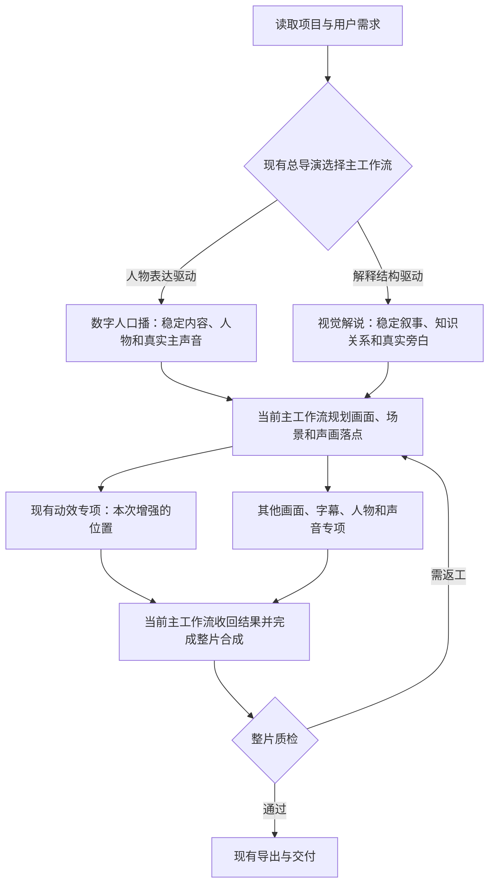
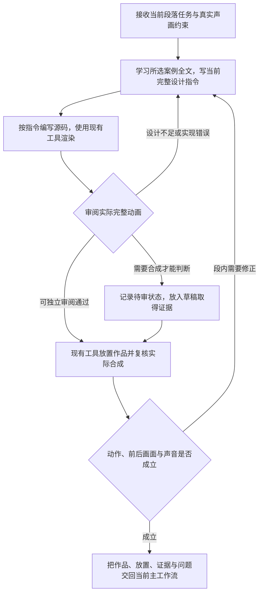

# VideoFlowCut 动效制作与时长策略优化方案

**状态：待用户审阅的开发方案。本轮更新的是这份文档，未执行文中的仓库、Skills、同步、构建或提交操作。**

使用顺序：你先阅读本文件，确认方案及改动范围，再把它交给开发 Codex 统一实施。正文中的“修改”“新增”和代码块均是待实施说明，不表示已经做完，也不构成本轮实施授权。第 7 节的开发任务同样在你明确要求实施后才执行。

## 1. 这次到底要把工程改成什么样

**目标：你以后只给正常的剪辑需求，项目中的 Codex 就能参考完整案例，自己写出一份详细的动效生成指令，再照着这份指令写 Remotion 源码、渲染并完成剪辑。** 不再每次由你手工补几千字的美术和动作要求。

这次要做的改动很明确：

1. **把前面写好的六份完整指令，全文放进工程的六个案例目录。** 胶囊完整指令也保存到总案例目录，作为指令写法的示例。
2. 修改案例的 `SKILL.md`，告诉 Codex：完整指令在哪里、什么时候要读、哪些设计可以借鉴。
3. 修改总案例 Skill 和 `remotion-production`，要求 Codex 选中案例后读全文，先为当前内容写好完整指令，再写动画代码。
4. 在同一制作流程里写清：什么时候该继续动、什么时候需要读字、什么时候应该结束，避免为了凑秒数空等。

**完整指令是要贴进案例的。** 本文选择把它单独保存为案例目录下的 Markdown 文件，再由 `SKILL.md` 引用。它仍然属于这个案例，不是放到工程外面，也不是只留一个摘要。

**不加入网络、海窗两个案例。** 上一版关于这两例入库、建立候选目录和入库验收的建议全部撤销。当前仍然只有原来的六个动效案例；胶囊仅作为完整指令的写法示例。

### 先把几个名字讲清楚

| 名字 | 在这个工程里是什么 |
|---|---|
| Skill | Codex 工作时读取的操作说明文件，不是一个会自己执行的服务。 |
| 案例 | 一份可学习的作品资料，包括设计解释、视频、源码，以及这次要补入的完整生成指令。 |
| 案例完整指令 | 已经写过的示例输入。例如 03 的机票造型、配色、手机翻面、条款阅读和日期聚焦全文。 |
| 本段完整指令 | Codex 看过案例后，为这次实际讲稿重新写的输入。它要讲当前内容，而不是照搬示例的机票金额和画幅。 |
| Remotion 源码 | Codex 按本段指令写出的 TSX 动画代码。渲染器执行这份代码，得到视频。 |

**Remotion 渲染器不会读中文提示词后自动设计动画。读指令、做设计、写代码的是 Codex；渲染器负责把代码变成画面。** 因此只归档提示词还不够，还要修改 Codex 的工作步骤，让它确实读全文并用于新设计。

本文中的优化尚未按本方案实施；这不表示仓库历史上没有其他改动。链路和路径依据已读取的工程版本核对，实施时还需以你当时的最新代码为准。已有的导演入口、生成工具、渲染和合成流程继续使用。你可以把这一个文档交给开发 Codex：完整示例和要粘入 Skill 的正文都在本文中。

## 2. 现有完整剪辑流程中的动效优化位置

**本方案接在项目已有的 `remotion-production` 动效专项里面。** 不另外建立一套从用户输入到成片的生产链。上一版把动效的局部步骤画成完整剪辑流程，省略了主线、声音、Scene 和返回主工作流的关系，本节据此重画。

以下分成两张图：第一张看动效在现有整片流程的什么位置；第二张只展开这个位置内部建议增强的步骤。图表示 Codex 依照现有 Skills 使用工具的工作顺序，不表示新增后台服务或自动调度器。

### 2.1 先看项目已有的完整流程

这张图聚焦你主要制作的数字人口播和视觉解说；项目原有 Vlog 路由不在本次调整范围。



两个视频类型是二选一的主工作流，混合视频仍由其中一个负责整片。图中的专项分支表示职责划分，实际按依赖执行，不要求同时启动所有专项。质检发现主线问题时，回到对应主工作流修正内容；局部美术或声音问题只退回相关步骤。

| 图中位置 | 工程现有入口与职责 | 本方案的接入关系 |
|---|---|---|
| 读取项目与选择主工作流 | `project-basics` 读取当前项目；`production-director` 判断主时间轴由什么驱动。 | 沿用现有入口。 |
| 数字人口播主线 | `presenter-motion-director` 负责内容、真实主声音、人物状态和叙事段落。 | 动效使用主工作流提供的真实声音时间和人物条件。 |
| 视觉解说主线 | `visual-explainer-director` 负责叙事关系、NarrativeMap、真实旁白和解释任务。 | 动效服务当前解释任务，使用真实旁白时间。 |
| 画面、场景与声音规划 | 当前主工作流结合 `visual-treatment-planning`、`scene-planning` 等专项，明确为什么需要动效、覆盖哪些内容、人物和字幕占哪里、前后画面如何接续；声音意图在这里共同规划。 | 把这些条件交给现有动效专项，不能仅交一句“这里做高级动画”。 |
| 动效专项 | `remotion-production` 已负责构思、关键画面、美术、运动、源码、生成和审阅。 | **在其现有步骤内补入完整案例指令学习、当前内容完整指令及对应审阅要求。具体修改见 3.4 节。** |
| 固定作品与实际放置 | 现有工具生成固定版本作品；之后通过 `manage_effect_cues` 绑定、放入合法的 Scene 与时间范围。 | 工具与放置流程沿用。生成作品本身不会自动进入时间线。 |
| 合成、质检与交付 | 当前主工作流接回动效结果，协调其他画面、人物、字幕和声音，继续完成原任务范围；最后使用 `quality-verification` 与 `export`。 | 动效完成后回到这里，不能交出一条独立 MP4 就宣称整片完成。 |

**真实主声音先稳定，不等于每次都重新配音。** 已有视频可以使用已确认的原声；需要生成旁白的任务，则先取得实际声音及其真实时间，不能用文字估秒代替。

声音也分前后两步：前面规划哪些动作需要声音、哪里应该留白；作品生成后按实际动作事件对齐音效、混音和复听。不能直到动画完成才第一次考虑声音。

### 2.2 再展开动效专项内部

这张图的入口来自上图的“当前主工作流规划”，出口回到上图的“当前主工作流收回结果”。它是一段子流程。



| 子步骤 | Codex 实际做什么 | 留下什么结果 |
|---|---|---|
| 接收任务 | 读当前讲稿、真实声音时间、观看目标、素材、人物和字幕空间、前后画面。若动效比整段旁白短，先明确其余范围由什么画面承接。 | 当前段落的设计条件与覆盖范围。 |
| 完整学习案例 | 先读总案例 Skill 选例，再读所选案例的 `SKILL.md` 与 `references/generation-prompt-v1.md` 全文。没有合适案例时自主设计，不硬套手机、撕纸等对象。 | 实际使用的案例全文，以及可借鉴和必须重做的设计决定。 |
| 写当前指令 | 针对这次内容写具体主体、美术、构图、连续动作、可读条件、收势和声画配合。示例仍完整保存在案例里，当前指令另行编写。 | 本次代码真正使用的设计依据，写入现有 `creativeBrief`。 |
| 源码与渲染 | Codex 按指令实现 TSX；使用现有 `submit_motion_work` 提交，随后通过 `track_job`、`read_motion_work` 取得结果。 | 固定版本作品及对应源码、参数和创作说明。提交成功不代表渲染完成，也不代表放置完成。 |
| 作品审阅 | 对照设计连续检查实际动画，使用现有 `review_motion_work` 记录判断。若设计成立但代码漏做，只修相应代码；若设计本身不好看，再改设计及代码。 | 有依据的审阅结果。静帧漂亮或编译通过不能替代连续观看。 |
| 待审合成与正式放置 | 通过 `manage_effect_cues` 绑定作品。需要人物、字幕和前后文才能判断时，沿用 `inconclusive` 待审状态进入草稿，取得合成证据后继续复核。 | 当前剪辑版本中的真实声画结果。待审草稿可以用于取证，不能当成最终审阅通过。 |
| 返回主工作流 | 交回实际作品版本、覆盖内容、放置变化、动作事件、证据和未解决问题，由原主工作流继续整片。 | 动效结果接回原任务，而不是停在独立动画交付。 |

需要改变已锁定旁白、事实、总长或跨段结构时，动效专项应交回当前主工作流决定。图里的返工箭头不授权它自行改动这些约束。

**本次修改的仍只有第 3 节列出的 8 个已有 Skill 和 7 个完整指令文件。** 本节列出导演、Scene、声音、放置和导出，是为了说明接入位置与交接关系，不是把它们都加入修改清单。只修某一段的现有项目，则沿用已有局部任务入口，不要求从头重做整片。

本节匹配的是已读取源码和 Skills 的职责及工具合同；本方案还需要第 6 节的项目内实际生成、放置和整片复核来验证，不能把“读过代码”当成“已经跑通”。

### 2.3 用机票案例举一次具体例子

假设本次讲稿是演出票的“标价吸引人，但还要核对场次和开演时间”。主工作流先确定实际旁白与前后画面，再把这段解释任务交给动效专项。

Codex 可以选择机票案例，因为二者都有“先看吸引点，再看条件，最后回到原凭证”的关系。它先完整阅读 03 指令，学习横票与竖手机怎样形成构图变化、手机怎样边入场边翻面、后撤时原票怎样接着靠近。然后为本次演出票重新设计票面、真实文案、演出视觉和动作时间。不能直接套用旧票价、退改条款和固定坐标。

这里留下两份不同用途的文字：案例目录长期保存的“机票示例指令”，以及这次作品使用的“演出票完整指令”。前者帮助 Codex 学习，后者指导本次代码生成。新作品经渲染、审阅和放置后，返回原主工作流，与人物、字幕、实际旁白及前后画面一起检查，再继续整片交付。

## 3. 开发时要改哪些文件

待你确认实施后，本批拟修改 **8 个已有 SKILL.md**，新增 **7 个完整指令资料文件**。下面列的是开发范围，本轮没有执行。不创建新案例、不新增导演、不改渲染 API。

统一修改 `.agents/skills/`。`plugins/videoflowcut/skills/` 是同步生成的副本，最后通过现有脚本更新；不要两边各写一遍。

### 3.1 第一步：把七份完整指令保存到工程

本文附录 A0—A6 已经包含七份完整指令，每份都在独立代码块中。**复制整个代码块内的原文，保存为下表目标文件。不是复制本表，不是复制一句总结，也不是只放外部下载链接。**

| 复制哪一段全文 | 在工程中新增的文件 |
|---|---|
| 附录 A0：胶囊完整指令 | `.agents/skills/motion-case-library/references/capsule-opening-prompt.md` |
| 附录 A1：SIM 到页面与撕纸 | `.agents/skills/motion-case-sim-paper/references/generation-prompt-v1.md` |
| 附录 A2：SIM、QCI、时钟接力 | `.agents/skills/motion-case-smooth-relay/references/generation-prompt-v1.md` |
| 附录 A3：机票到手机与日期 | `.agents/skills/motion-case-ticket-phone/references/generation-prompt-v1.md` |
| 附录 A4：产品扇开与回收 | `.agents/skills/motion-case-product-fan/references/generation-prompt-v1.md` |
| 附录 A5：封面流与单项聚焦 | `.agents/skills/motion-case-cover-flow/references/generation-prompt-v1.md` |
| 附录 A6：弹幕聚合与重点回应 | `.agents/skills/motion-case-comment-focus/references/generation-prompt-v1.md` |

目标是普通 Markdown 文件，保存原指令正文即可；测试状态和说明放在对应案例的 `SKILL.md`。六份文件虽然同名，但分属六个不同目录，不会互相覆盖。

完成这一步以后，指令已经在案例里了。接下来的修改负责让 Codex 知道必须读它们。

### 3.2 第二步：修改六个案例的 SKILL.md

六个案例现有的视频、源码解释和关键帧继续保留。**在每个案例标题之后、原有内容之前，插入附录 B 中该案例对应的完整文字。** 附录 B 已按六个实际文件分别写好，不需要开发者套一个带占位符的模板。

新增文字做三件事：链接全文；说明该案例为什么这样设计；要求选中本例时读完整指令，然后为当前内容重新设计。

测试状态按实际反馈记录：01、03 为“用户确认独立指令测试通过”；02、04、05、06 为“新版指令待测试”。它们原有的历史成片仍是已保存作品，不因为新版指令待测就删除。

目前没有取得 01、03 这次新测试的源码和成片，所以不更换旧 `assets/preview.mp4`、`assets/motion.tsx` 和参数文件。旧预览不能被标成新指令生成的结果。后面拿到新文件时，再单独归档对应版本即可；这不妨碍现在导入指令。

### 3.3 第三步：修改总案例 Skill

文件：`.agents/skills/motion-case-library/SKILL.md`。

**修改 A：替换“用案例帮助生成新动效”这一整个章节，使用以下正文。** 替换范围到下一个同级标题之前，其他章节保留。

```markdown
## 用案例帮助生成新动效

先理解当前段落要让观众看懂什么，再按内容关系选择一个主要案例。
不要只按机票、手机、产品等题材词选例；没有合适案例时自主设计。

选中案例后，先读它的 SKILL.md，再完整读取该例
references/generation-prompt-v1.md。完整指令中的造型、配色、构图、
主体关系、动作起止、交叠、阅读与检查要求共同构成示例，不能只读摘要。
视频和源码用于理解实际效果；注意所看视频属于历史版本还是新版指令的结果。

已有用户通过反馈的指令可优先用于相同内容关系，但不能因此强套不匹配题材。
其他新版指令可以用于相应试验，不能称为已验证输入。

阅读后，为当前讲稿重新写一份完整动画指令。明确保留了示例的什么方法，
以及当前主体、文案、美术、构图、动作和时长分别怎样重新设计。
不要只替换标题和总时长，也不要只写“参照此案例做得高级流畅”。

材质、排印、明暗、形状和空间关系应与动作一起设计，不能先拼完动作，
最后再加阴影或发光来补美术。具体编写要求由 remotion-production 执行。

需要理解专业指令应该具体到什么程度时，完整阅读
[胶囊指令范例](references/capsule-opening-prompt.md)。它展示的是写法，
不要求每条动画都用胶囊、三维碰撞、暗色背景或 27 秒长度。

只加载当前需要的案例。读完示例不是任务完成：继续写当前指令、实现源码、
渲染并检查实际结果，再交回剪辑流程。
```

**修改 B：在原“案例 Skill 与最终效果”表后增加下面这张表。** 原有六个视频链接保留，表名明确写“历史选定效果”，不要把它们说成本次新指令的输出。

```markdown
## 完整生成指令与新版反馈

| 案例 | 完整指令 | 新版反馈 |
|---|---|---|
| SIM 到页面与撕纸 | [阅读全文](../motion-case-sim-paper/references/generation-prompt-v1.md) | 用户确认独立测试通过；新产物尚未取得 |
| SIM、QCI、时钟接力 | [阅读全文](../motion-case-smooth-relay/references/generation-prompt-v1.md) | 待测试 |
| 机票到手机与日期 | [阅读全文](../motion-case-ticket-phone/references/generation-prompt-v1.md) | 用户确认独立测试通过；新产物尚未取得 |
| 产品扇开与回收 | [阅读全文](../motion-case-product-fan/references/generation-prompt-v1.md) | 待测试 |
| 封面流与单项聚焦 | [阅读全文](../motion-case-cover-flow/references/generation-prompt-v1.md) | 待测试 |
| 弹幕聚合与重点回应 | [阅读全文](../motion-case-comment-focus/references/generation-prompt-v1.md) | 待测试 |

胶囊完整指令作为写法示例，链接见上方使用章节，不增加新的默认生产案例。
```

### 3.4 第四步：修改动效生产 Skill

文件：`.agents/skills/remotion-production/SKILL.md`。这是本次最重要的一处：把“看了案例就直接写代码”，明确改为“读完整案例指令→写当前完整指令→按它实现”。

**修改 A：替换“在构思与关键画面之间使用案例”下面的正文。** 保留后面的“第三步”标题和原有内容。

```markdown
按当前观看任务读取 motion-case-library/SKILL.md，选择主要案例。
进入该例 SKILL.md 后，必须完整读取其 references/generation-prompt-v1.md，
不能用案例名称、几条摘要或旧源码代替全文。

区分示例中可以借鉴的方法与当前必须重做的内容。造型、色彩、材料、构图、
身份延续、动作交接和阅读条件都要用于当前设计；示例的事实、画幅、
无声交付和自由时长不能直接覆盖当前剪辑要求。

没有合适案例时，仍按后续步骤完成当前设计；不必强行加入手机、撕纸或卡片。
需要学习指令的细节深度时，按需读取总案例目录下的胶囊完整范例。

只能读取静态图片而不能播放视频时，如实区分静态观察、源码理解和已有动态结论，
不把静帧检查说成完整播放。正式提交前读取实时 Schema，按当前工具合同提交。
```

**修改 B：在“第四步：完成美术与运动编排”之后、“第五步：提交固定版本作品”之前，插入下面完整章节。** 它不删除原有第三、四步，而是要求把这些设计汇成一份真正用于代码生成的指令。

```markdown
**写好本段完整生成指令，再实现源码**

对于承担连续解释或重要视觉记忆的动效，在开始写源码前，先形成当前段落的
完整文字指令。使用下面的结构，但每项都要写当前内容的实际设计决定。
简单的一次强调可以按任务范围简化，不强制凑章节或字数。

1. 内容与输出：实际讲稿、准确文字与数字、画幅、可用素材、人物和字幕位置，
   本段让观众理解什么，最后应看到什么。说明已有旁白及其真实时间。
2. 主体造型：主要对象的轮廓、比例、部件、识别细节、哪些部分能动。
   例如写清票面和票根比例、设备边框与屏幕，而不只写“做一张精致票据”。
3. 美术与构图：具体颜色各承担什么重点，字体粗细与分行，主次大小与位置，
   留白、遮挡、材质、光向和阴影。二维动画同样需要排印与形状设计。
4. 连续关系：哪个对象从头保留到尾，新对象为何进入，旧对象如何退让。
   使用前景替身时明确接管瞬间的内容、位置、大小和方向，避免双影与跳位。
5. 动作顺序：每个动作从哪里开始、怎样移动、如何加减速、在哪里收住，
   下一动作在什么状态开始。写清交叠和因果，不能只列几个彼此孤立的秒数。
6. 阅读与结束：什么文字需要读清、何时达到可读状态、停留到什么条件结束，
   动画完成后的画面由谁承接。按下方时长规则决定帧数。
7. 声音与合成：保留主声音，标出需要考虑配声的可见动作和语义位置，
   按当前人物、字幕及素材关系重构图；正式声音由既有流程完成。
8. 检查：指定关键画面和接点附近需要连续观看的范围，说明怎样判断造型、
   动作、读字和结尾是否成立，不以编译通过代替视觉检查。

上述内容应组合成一份连贯、可执行的当前指令，不是只有栏目名的空表。
完整案例提供具体写法，不能把几千字的设计读完后再次缩成“高级、顺滑”。

写好当前指令后，在现有受管能力内实现 TSX。重要对象、动作、文字和事件
应对应这份指令；需要修改设计时同步修改指令和代码。
完整指令写入现有创作说明字段 creativeBrief，与源码一起提交。
这是保留本次设计依据，不是让渲染器直接执行中文指令。

时长这样处理：
- 独立试作且没有硬时长：按动作、阅读和收势完成计算最终帧数，完成就结束。
- 已有旁白：先按真实语义决定动效覆盖哪一部分，剩下由人物或实际画面承接。
- 用户锁定总长或该段范围：在边界内调整画面、动作与接管。已锁定讲稿和旁白
  不擅自改写、裁切或变速，不擅自改总长；内容冲突交回现有导演处理。

有用途的停留要保留；动作、读字都已完成就开始下一步或结束。
不能通过循环漂浮、长尾慢放大、复制末帧或全片统一变速来凑长度。
若必要内容无法在固定范围内说清，交回现有导演处理内容与画面安排。
```

**修改 C：在第六步的作品审阅段后增加下面正文。** 保留现有待审合成、作品版本、人物、声音和最终交付规则。

```markdown
对照本版本的完整指令回看实际动画。已正确实现且效果好的部分保留；
动作遗漏、对象跳位、遮罩或排版错误需要修改代码；造型、构图或动作构思
本身不好看时重新设计指令和代码，不一律增加缓动。

重点检查完整对象是否持续，下一动作是否接得上，文字是否清楚，
最后有无不必要等待。关键帧只能检查静态状态，不能替代连续观看。

正式合成时检查动画前一句、整段和后一句。动画若短于旁白覆盖范围，
后面必须有实际画面接续；若人物或字幕遮住了重点，就重新构图。
作品内部时序修改后重新生成作品并复核声音，不能只裁固定作品的放置长度。
仅把完整作品在时间线上整体平移时，沿用现有放置更新与声音复核，不要求重渲染。
```

**修改 D：同步补充文件末尾的“项目写入流程”和“交接合同”。** 在原流程的“按需案例学习”后加入“完整读取选中案例指令→写本段完整指令→据此写源码”；输出内容中增加“所用示例与本段完整指令”。其他已有工具顺序保留。

### 3.5 第五步：同步到插件，并确认实际任务读到了新内容

在项目根目录使用现有脚本：

```bash
npm run plugin:sync-skills
npm run plugin:build
```

这两条是现有工程的同步和构建命令，不是在要求安装新的 Remotion CLI。构建脚本本身也会同步，第一次单独运行同步方便检查新增资料是否已复制。

检查 `plugins/videoflowcut/skills/` 中是否出现上述七份完整文件，以及修改后的八份 `SKILL.md`。沿用项目现有插件更新方式加载这次构建，开启新剪辑任务，确认它实际读到新增的“写好本段完整生成指令”章节。

仓库已有 `tests/skills-v5-integration.test.ts` 检查引用和源/发行副本一致性，可以继续使用。不要只因文件在仓库里，就认为运行中的旧插件已经更新；也不要把这些文本检查通过当成动画质量通过。

### 本批不改哪些地方，为什么

`presenter-motion-director` 和 `visual-explainer-director` 已经会把相应段落交给动效生产；Scene 规划、时间线放置、声音事件和成片审阅也已有流程。它们这次继续使用，不为了加案例指令逐个重写。

本批修改集中在上述八份 Skill 的指令使用方式，以及七份新资料。时长要求直接写在 `remotion-production` 中，并交给现有导演与合成流程执行。不新增字段、不新增模型调用服务、不改编译器、不修改渲染限制。

## 4. 原来写的“6000”是什么，这次到底改不改

**这次不修改 6000 限制，也不要求你写满 6000 字。**

项目提交动画时有一个现成的文字项 `creativeBrief`，可以理解为“这条动画的制作说明”。它目前最多接受 6000 个字符，字母、数字、标点也算字符；不是 6000 个汉字的写作要求。

| 位置 | 目前是什么 | 本次要怎么处理 |
|---|---|---|
| `packages/motion-work/src/schema.ts` | 限制 `creativeBrief` 长度最多 6000 字符 | **不改这个 TypeScript 文件，不改上限。** |
| `.agents/skills/remotion-production/SKILL.md` | Codex 的制作与提交说明 | 按 3.4 节修改：把本段完整指令写进已有 `creativeBrief`。 |
| 六个案例下的 `references/generation-prompt-v1.md` | 保存用于学习的完整示例 | Markdown 资料不受这个提交字段的 6000 限制；完整保存，不压成摘要。 |

当前 01 完整正文约 4872 字符，03 约 3848 字符，都能装进现有字段，因此这两例没有容量改造需求。新作品应提交针对本次内容写的指令，不是把整本案例库和这份开发方案一起提交。

如果未来某份新指令真的超出上限，先检查有没有误塞案例讲解、版本说明和重复内容；不能直接截掉最后一截。若必要设计仍超限，再处理那个具体容量问题。这不是本批需要预先开发的功能。上一版关于替代 Props 字段等备选设计不再列入此次实施任务。

## 5. 动画时长怎样安排，才能不再空等

这条经验保留，并集中写入生产 Skill：**动作和必要阅读完成后，就结束当前动画或进入下一个有意义的画面。**

例如旁白有 18 秒，而某段动画正常讲清楚需要约 12 秒，并不意味着要让动画最后停 6 秒。可以由人物先提出问题，再让完整动画解释，随后回到人物或实际素材。具体何时切换根据真实语音确定，不能照搬这里的数字。

| 情况 | 正确安排 |
|---|---|
| 独立测试，未要求总长 | 先完成动作和阅读设计，再计算实际长度。 |
| 旁白已经确定 | 决定哪些语句需要动画，哪些由人物或其他画面表现；动画不自动占满整段旁白。 |
| 用户要求固定 12 秒或固定放置范围 | 在这个边界内调整表达与动作；不能擅自输出不同长度，也不能只补静帧。 |
| 文字还没读清 | 保留必要阅读时间；不因为画面静止就删除。 |
| 所有信息已经读完，动作也完成 | 结束或接下一画面；微弱漂浮和慢缩放不能成为延长理由。 |

项目会把一条生成作品固定成具体帧数。已经渲染的作品如果要改内部长度，重新排动作并生成新版本，再放到时间线；不直接缩短它的放置范围来偷偷裁尾。

数字人视频和全屏解说都可以使用这套方法。数字人同屏时要重新安排空间，不能把整张复杂票据缩到脸旁的小角落；全屏解释可以给主体更多面积，但结束后也必须接上真实画面。

主声音继续沿用当前剪辑音轨。手机翻面、撕纸等声音根据实际动作事件配合，不在每个动作开头机械放同一种音效。改过动作时序后，按现有流程复核对应声音。这些要求属于正式剪辑；附录里的无声规格只用于当时的独立测试。

## 6. 改好后怎样确认真的有用

验收分成两个简单问题：**文件是否接好了？正常剪辑任务是否真的用上了？**

### 6.1 文件是否接好了

开发 Codex 完成修改后，检查并报告：

1. 七个新增参考文件中确实是完整原文，与本文附录 A 对应代码块一致，没有用摘要或占位句替代。
2. 六个案例 `SKILL.md` 都能打开自己的全文；总案例 Skill 能找到六例和胶囊范例。
3. 01、03 写用户已确认通过，另外四份仍写待测；没有伪造新的预览文件或源码。
4. 修改后的生产 Skill 明确要求先写本段完整指令，再写代码，并包含自然时长与正式剪辑规则。
5. 插件同步后，新任务实际使用的是这些新文件。

### 6.2 正常剪辑任务是否真的用上了

选择一段适合 01 或 03 的真实内容，用正常剪辑需求启动任务。**这次不要由用户再粘贴整段长指令**，否则只能验证手工提示词有效，无法验证 Skill 已经接好。

Codex 应当能展示这四样东西：

- 实际读取的案例及完整示例文件。
- 为当前内容写出的完整指令，包含具体主体、美术、构图、动作和读字安排。
- 据此生成的源码与完整动画预览。
- 动画进入当前剪辑后的人物、字幕、声音和前后画面结果。

如果只写了“参考机票案例”，没有完整的新设计，说明第 3.4 节没有执行到位。若指令具体、代码也照做，但画面仍不好看，应改造型、构图或动作设计；不能把“流程已走完”当作效果通过。

同一题材通过后，再换一个确实不同的内容测试。可以沿用发现顺序，但主体、文案和构图需要有实质变化。最终仍以实际生成的视频判断，不由一次成功保证所有动画都成功。

## 7. 可以直接发给开发 Codex 的任务

下面这段用于你确认方案和范围后的**一次性工程实施**，与第 2 节的运行流程是两件事。当前保留为待执行文本；只有你明确让开发 Codex 实施时，才将本文件和下面任务一起交给它。让 Codex 阅读、评审或继续完善本方案，不等于授权执行这个代码块。

```text
请按《VideoFlowCut_动效制作与时长策略优化方案.md》修改当前工程的 Skills。

目标：正常剪辑时，Codex 自动读取完整案例指令，为当前段落重新写出具体的
动画指令，再按这份指令写 Remotion 源码并使用现有流程渲染、合成。

依次执行：

1. 按文档 3.1 节的七行路径，把附录 A0—A6 各自代码块中的全部原文保存到
   对应 references 文件。必须复制全文，不要只放摘要、占位文字或链接。
2. 按 3.2 节，将附录 B 对应的正文分别插入六个已有案例 SKILL.md。
   保留历史视频、源码和参数。01、03 写用户确认测试通过，其余四份写待测。
3. 按 3.3 节替换总案例 Skill 的使用章节，并添加完整指令与反馈表。
4. 按 3.4 节的 A—D 四项修改 remotion-production/SKILL.md：完整读示例，
   写当前指令，按指令实现，对照实际动画检查，并保留时长与声画要求。
5. 按 3.5 节执行项目已有同步与构建，检查实际插件中的文件和相对链接。
6. 按 6.1 节报告资料是否完整接通。具备真实测试项目时，再按 6.2 节做一次
   正常剪辑入口的验证；未执行的生成与合成测试明确列出，不能冒称通过。

本批只改八个已有 SKILL.md、新增七个 references 文件及其正常生成的插件副本。
不增加网络或海窗案例，不创建新导演或 Agent，不修改6000字符限制，
不增加接口字段，不改渲染器或模型依赖，不更换现有受管渲染与声音流程。

完成后给出改动文件列表，并展示至少一条从总案例 Skill 到案例全文的读取路径。
如果实际工程已经有相同修改，核对后补缺，不重复插入同名章节。
```

## 8. 附录怎么用

**附录 A 是必须保存进工程的完整示例原文。** A0 是胶囊写法范例，A1—A6 对应六个案例。以下正文从此前交付文件的完整指令代码块中提取，未把长指令缩成短版。

**附录 B 是要插入六个现有 SKILL.md 的说明。** 它解释全文在哪里、为什么这样设计、怎样用于当前任务。A 与 B 要一起放进项目，彼此不能替代。

下面的示例仍保留当时的独立测试规格，例如无声、特定画幅、演示文字；胶囊还保留历史 27 秒时序。保存时不改写这些原文。正式生成新作品时，由第 3.4 节要求 Codex结合当前任务重写新的完整指令。

## 附录 A0：胶囊完整指令

历史写法范例；保留当时 27 秒设计，不能继承为其他作品的默认时长。

复制下列代码块内全文，保存到第 3.1 节对应路径。

```text
请制作并完整渲染一段 27 秒的 Remotion 动画。

作品是一个具有写实三维质感的科普视频片头：先在暗色摄影棚中展示两颗不同颜色的胶囊，比较价格；随后胶囊向下掉落，镜头转入明亮的桌面空间，大量蓝白胶囊落下、碰撞、翻滚，最后积累在桌面上。

沿用当前环境已经可用的制作与渲染方式。下面规定作品本身的视觉和动作，不规定工程目录、安装命令或工具调用路径。

交付一条完整、可播放的无声 MP4，并保留对应的可编辑动画源码。不要用几张关键画面或局部试片代替整条成片。

一、画幅和视觉目标

1. 横屏 16:9。建议预览规格为 960×540、30 fps、27 秒；构图尺寸用画面宽高的比例表达，保持各部分比例一致。
2. 前半段接近产品摄影：深色空间、透明有色胶囊壳、细小颗粒、白色壳体、柔和而明确的摄影棚高光。胶囊要有体积和真实的表面曲率，不能只是圆角矩形叠渐变。
3. 后半段是自然光桌面：暖木桌、窗户、日常小物、接触阴影与前后景深。暗场中的主角落入这个空间，产生一次有原因的场景转变。
4. 同一种胶囊从特写、比较、跌落到堆积始终保持造型和材质身份。尺寸可以随镜头与空间改变，不能每一段重新设计一版。
5. 文字只解释眼前的产品关系，不承担主体画面。不要把片头做成标题卡、价格卡和列表页的接连切换。
6. 品名与价格是本片的参考演示标注，不需要检索或宣称当前市场价格，不增加药效比较结论。

二、先把胶囊本身做对

【统一几何】
胶囊总长度约为直径的 3 倍。主体是圆柱，两端是饱满的半球；上下两半在中部拼合，有一条很薄的接缝。上半壳透明有色，下半壳不透明偏白。

【金白胶囊】
上半壳为透明琥珀金色，壳体薄，能看出内部颗粒。颗粒直径约为胶囊直径的 3%—7%，大小略有差异，分布在内部容积中。

靠近观察面的颗粒更清晰，中间颗粒互相遮挡，深层颗粒受透明壳和景深影响略柔和。曲面边缘存在颜色加深和弧形反光。不能把颗粒画成贴在外壳表面的规则圆点，也不能画成漂浮星光。

下半壳为偏冷的乳白色，具有柔和的大面积明暗过渡和细长侧面反光；下缘受暗环境影响变深，但仍然像药用壳体，不像金属。

两半壳体各有暗红色 Fenbid 字样，沿长轴排布。字样贴着曲面，胶囊绕自身长轴转动时，字样应随表面转动、压缩并逐渐离开可见面，不能永远正对屏幕。

【蓝白胶囊】
使用同一套几何。上半壳与内部颗粒改为通透的青蓝色，下半壳维持乳白色，印字为暗红色 Generic。

【灯光】
背景接近炭黑，有很弱的冷灰环境渐变。主光来自前上方偏左的大面积柔光源，另一侧有较弱的补光。高光沿圆柱和半球曲面分布，旋转时高光、壳内颗粒与印字应呈现一致的空间关系。

三、暗场构图与文字样式

背景不画地平线，不加无关科技网格或粒子。

单颗金白胶囊位于画面中心附近，中心约为 (0.50W, 0.50H)，高度约为 0.62H，保持竖直。在主体两侧给标签留空间，在画面底部给字幕留空间。

双胶囊比较时，蓝白胶囊偏左、稍大、稍靠前；金白胶囊偏右、稍小、稍靠后。两颗的中部拼接线接近同一水平线，形成清楚的对照。

标签使用白色粗体无衬线中文，字号约为画面高度的 4%。每条标签配一个小三角，指向对应的胶囊。金白胶囊使用暖黄色三角，蓝白胶囊使用青色三角。标签无底板，无按钮边框，不做弹跳入场。

四、完整动作时间轴

【0.00—0.60 秒：产品从暗处建立】
开场金白胶囊已经在画面中。由稍暗、稍小的状态自然建立到主体亮度和尺寸，尺度约从 94% 到 100%。同时轻微绕自身长轴转动，使印字和透明壳的曲率被看见。不能从画外飞进来，也不要使用明显的弹簧回弹。

【0.60—3.10 秒：让材质成立】
主体构图稳定，保留极轻的长轴旋转，让壳体高光和内部颗粒的前后关系有变化。不要加持续上下漂浮。观众这一段是在看清胶囊的质感。

【3.10—3.70 秒：生产方标签出现】
金白胶囊右侧先出现一个朝左指向胶囊的小黄色三角，随后在三角右侧显出“中美史克生产”。文字的实际显现约 0.2 秒，三角和文字构成一个整体。

【4.65—5.05 秒：第一条价格出现】
同侧下一行出现“1.25元/颗”，同样配黄色三角。两行左边缘对齐，字号与视觉重量一致。

【5.05—6.15 秒：读清价格】
保留展示构图和微弱材质变化，不增加新装饰。

【6.15—7.10 秒：第二颗加入比较】
同一颗金白胶囊向右移动并缩小，相关标签保持与它的空间归属。蓝白胶囊从左侧进入。两个动作同时发生，形成一次构图重排。

最终蓝白胶囊中心约为 (0.39W, 0.50H)，高度约为 0.59H；金白胶囊中心约为 (0.61W, 0.50H)，高度约为 0.50H。

蓝白胶囊左侧出现“仿制药”，青色三角位于文字与胶囊之间并指向胶囊。入场末端减速，但不能先把一个对象停好再启动另一个。

【7.10—9.90 秒：维持比较空间】
两个主体继续极缓的构图调整和自身转动。蓝白胶囊中心可由 0.39W 缓慢接近 0.42W，金白胶囊中心由 0.61W 接近 0.60W。变化应接续入场，不能出现停一下再启动的机械分段。

【9.95—10.30 秒：第二条价格出现】
在蓝白胶囊标签下出现“0.125元/颗”，配青色三角，位置与对应产品明确关联。

【10.30—12.60 秒：读清比较】
两个价格同时成立。不要突然改成“10 倍差价”大数字卡，也不加第三个信息层。

【12.60—13.40 秒：通过前后换位重组关系】
旧标签先用约 0.2 秒退出。两颗胶囊保持竖直，绕共同中心的竖直轴完成半周空间换位：蓝白胶囊从左侧经过前景来到右侧，金白胶囊从右侧经过后景来到左侧。

中间约 13 秒，蓝白胶囊明确遮住一部分金白胶囊。前方对象略大、后方对象略小，印字和高光随自身朝向变化。不要用两张平面图片简单左右穿过，也不要在中心停顿后继续。

换位结束，金白胶囊中心约为 0.35W，蓝白胶囊中心约为 0.65W，两者高度约为 0.53H，中部接缝重新对齐。

【13.40—13.85 秒：新身份标签接上】
在金白胶囊右侧出现“原研药”，配黄色左指三角；在蓝白胶囊右侧出现“仿制药”，配青色左指三角。蓝白标签的位置相对上一阶段改变，是本次构图重组的一部分。

【13.85—16.05 秒：身份关系稳定】
保留缓慢的产品转动和正常阅读时间，不增加新动作。

【16.10—16.55 秒：跌落触发场景转换】
金白胶囊先向下加速掉落，蓝白胶囊迟约 0.12 秒跟随。标签随着对应主体向下离开，不在原地消失。落向画面下沿时保持重力加速的方向，不能在边缘减速刹车。

【16.50—17.15 秒：跟随跌落进入桌面空间】
暗背景通过短暂的光线和空间接管显露明亮室内：浅色墙面、右侧带百叶窗的窗户、下方木桌。镜头顺着刚才的向下动势转向桌面，然后柔和稳定。

不要做两张全屏背景左右推移。观众应感觉是在跟随刚才的胶囊进入另一个空间，而不是看到一次无缘由的幻灯片换页。

【17.15—17.65 秒：第一次落桌】
一颗尺寸符合桌面空间的金白胶囊从上方斜着落入，约 17.45 秒首次接触木桌，随后弹起、翻滚并开始减速。它仍然使用开场胶囊的造型和材质。

接触点、胶囊姿态和阴影必须一致。先接触的一端会产生转动，不能整颗直上直下等幅弹跳。

【17.60—19.00 秒：蓝白胶囊雨逐渐形成】
蓝白胶囊陆续从画面上方落下，数量逐渐增加。发射位置、前后深度、初始方向、旋转速度各有差异，不采用整齐网格，不等间隔齐刷刷落下。

【19.00—24.50 秒：落下、碰撞、堆积同时存在】
画面同时有空中的胶囊、新落下正在弹跳的胶囊、已经落稳的胶囊。落稳的胶囊继续留在桌面，后落的胶囊与它们碰撞或被其挡住，数量持续积累。

目标是形成约两百颗蓝白胶囊的丰富堆积观感，几乎都是蓝白款，保留先前那颗金白胶囊作为身份延续。根据可见范围组织数量与层次，不要求每颗都同样清晰。

前景胶囊较大，可以有被画面下沿裁切的对象；中景胶囊清楚；后景更小、更柔和。不要把所有胶囊画成同一尺度贴在同一个平面上。

【24.50—25.10 秒：发射逐渐收束】
新增数量减少，最后几颗完成落下。不能让还在空中的对象突然删除，也不能在某一帧把所有对象同时定住。

【25.10—27.00 秒：余下运动衰减】
少量胶囊继续短距离翻滚或滑动，逐步稳定。焦点落在前中景的胶囊堆，后景桌面物件明显柔化。结束在堆积已经成立的画面，不加 Logo 页或额外片尾。

五、桌面空间必须具体成立

最终构图中，暖浅木色桌面占画面下方约 45%—55%。木纹沿桌面透视延伸，不能是贴在屏幕上的平行条纹。

后方左侧为灰白墙，右侧为大窗，窗上有白色水平百叶帘，窗外透出偏冷的蓝灰色。

左侧中部放一个小黑板，约占画面宽度 8%—40%、高度 18%—58% 的范围，黑板用迷你木质画架支撑，上面写白色窄体英文 DEBUG THE WORLD。

黑板左边有一只小棕色毛绒熊；黑板右边有白色方盆和绿色多肉。中部偏右放横向的黑色网布音箱。最右侧有黑色双摇杆手柄。音箱前方有打开的白色线圈笔记本，纸张略微卷起并向画面右侧延伸。

这些物件有真实材料和体积，作为生活空间的背景，不能做成一排平面功能图标。主体仍然是胶囊。

主光来自右后方窗户，桌面右侧相对明亮。胶囊离开桌面时阴影分散，贴近桌面时接触阴影收紧。物件和胶囊有前后遮挡，不允许所有影子永远以同一大小贴在对象正下方。

可以使用当前环境适合的三维场景或自行制作的场景资产实现，但胶囊、桌面与背景的透视、光线和接触关系必须一致。

六、碰撞、景深与连续性要求

1. 胶囊是有长度的物体，端部和侧面触地会产生不同的转动；不能只按一个圆点计算落地观感。
2. 弹起、翻滚、滑动的能量逐步衰减。不同胶囊不要复制同一条弹簧曲线。
3. 落稳对象持续存在，后续对象能与其形成可信的遮挡、接触和局部堆积，避免明显穿透。
4. 动作应在不同帧的渲染中保持一致。对随机分布和碰撞使用固定种子、预计算或其他可复现方式，不依赖播放经过了前一帧才得到正确结果。
5. 复用同一套胶囊几何与材质。远处可以降低细节，近处仍能看出内部颗粒和透明壳，不能突然替换为纯色小图标。
6. 桌面刚显露时，背景小物相对清楚；随着堆积形成，焦点逐渐转向前中景。不要用整张画面统一模糊代替景深。
7. 只在快速跌落、旋转或换位时使用适量运动模糊。产品展示阶段保持清楚，不能靠持续模糊遮盖造型和动作问题。

七、字幕与阅读节奏

这是无声视觉测试。字幕使用白字、细黑描边，字号约为画面高度的 4.5%，固定在底部安全区。不逐字弹跳，不与价格标签抢位置。

0.00—6.15 秒：先看这颗胶囊
6.15—12.60 秒：两种选择，两种价格
13.40—16.10 秒：价格差异带来了新的问题
17.60—24.50 秒：更便宜，就意味着更差吗？
25.10—27.00 秒：价格，能否代表效果？

字幕不需要解释具体药理或给出价格代表疗效的结论。

八、完成前的检查

请检查这些画面，但检查关键帧不能替代连续播放：
- 约 1 秒：胶囊是否真的有透明壳、内部颗粒和体积？
- 约 10.5 秒：两颗胶囊、两个价格是否清楚且有构图主次？
- 约 13 秒：换位时是否有明确的前后遮挡和连续轨迹？
- 约 17.5 秒：第一次落桌是否有可信接触、转动和阴影？
- 约 22 秒：空中、弹跳、落稳三种状态是否同时成立？
- 约 26 秒：焦点和堆积是否形成有层次的收尾？

连续播放时还要检查：第二颗加入是否接得上第一颗的移动；换位是否中途卡停；向下跌落是否真正引出桌面；胶囊雨是否有逐渐增强和收束；落稳的对象是否始终保留。

修正可见问题后，交付整条可播放 MP4 和对应源码。若实际有某项交付未完成，明确说明，不把计划、源码草稿或关键帧称为成片。
```

## 附录 A1：SIM 到页面与撕纸

用户确认独立指令测试通过；本轮新产物尚未取得。

复制下列代码块内全文，保存到第 3.1 节对应路径。

```text
请从零制作并完整渲染一条 Remotion 动画，内容是：五张看起来相似的 SIM 卡展开，其中一张获得注意；镜头把问题引向手机里的服务说明；同一张页面被撕开，露出关键问题；纸面继续打开，转入基站和手机使用场景，形成完整的认知接力。

沿用当前环境已经可用的制作与渲染方式。以下要求规定画面、动作和交付，不规定安装命令、工程目录或工具调用路径。

一、输出与内容边界

- 竖屏，画幅比例 4:7，建议 768×1344、24 fps。
- 输出一条完整、可播放、不透明背景的无声 MP4，保留匹配的可编辑动画源码。
- 本轮是独立视觉测试，没有必须铺满的旁白或固定剪辑槽。按照下面动作的自然速度、必要阅读和结束条件确定最终时长；渲染前将最终长度取成整数帧。
- 画面使用原创几何、排版和自制场景，不需要外部实拍、品牌图片或原视频。
- SIM 的 A—E、标签和页面都是机制演示，不代表真实套餐等级。页面明确写“演示页面 / 非运营商原文”。本片不声称某个套餐一定享有优先级，也不把优先级画成凭空增加带宽。

观众应沿着一条问题线看完：看起来相似的对象 → 为什么被区别呈现 → 去页面中找适用条件 → 回到具体网络和终端环境。

二、整体美术与画面分区

使用深墨色 #151716、黄绿色 #bcff42、暖纸白 #f5f3e9、银灰和暗金组成配色。强调色只服务于选中对象、目标句、撕裂后的问题和最终结论。

开头画面上部是排版，中部是有纵深的产品舞台，下部是一句解释。以画面宽 W、高 H 为单位：
- 顶部细眉题位于 x=6%W、y=4.5%H，写“网络现场 / 视觉实验”；右侧小字“01—02”。
- 主标题位于 x=6%W、y=11%H，分两行：“看起来相似，”和“待遇未必相同。”第二行用黄绿。字号约为 7.5%W，粗黑体，行距紧凑。
- 产品舞台覆盖 y=29%H—80%H。舞台是浅灰绿的连续平面，中心偏左更亮，边缘稍暗，不能每张卡各有一个独立背景框。
- 下部解释位于 x=6%W、y=84%H，字号约 3.4%W。底部留出安全边距。
- 全片使用一种中文无衬线字体与清楚的粗细层级。文字边缘干净，胶片噪点极弱，不影响读字。

产品舞台采用统一的 2.5D 斜视投影：能看到卡面、窄侧边和投影。光来自左上方，右下方投影方向一致。所有卡、芯片、标签都服从同一个空间变换，不能分别凭感觉漂动。

三、SIM 主体要做到什么程度

制作五张同形 SIM 卡。卡长宽比约 1.3:1，右上角有明显但适度的裁角；正面是偏暖银白塑料，边缘有窄灰色厚度，圆角很小。

卡面中央放暗金色芯片，芯片约占卡面宽度的 64%、高度的 47%。它是圆角矩形接触面，包含一个中间小接触区、左右分区和上下引线。线条细、暗于金面；用两三段宽缓金属明暗表现反射，不能画成荧光黄图标。

上缘有小字“SIM / 01”至“SIM / 05”；下缘分别写“方案 A”至“方案 E”。同一张卡的编号、方案文字和运动身份从头到尾保持不变。

卡片最终分布在同一舞台：A 在左上、B 在右上、C 在左下、D 在右下、E 在中央稍靠前。它们有不同的平面转角，彼此允许少量遮挡，但五个身份都能辨认。卡片不是等间距 UI 网格。

选中的始终是 E。E 提起时，卡面和边缘一起运动，投影与卡的距离增加；其余四张稍退后、略降对比。E 周围增加窄黄绿轮廓，轮廓随卡投影；不要在屏幕上另画一张独立高亮卡。

标签是紧邻卡片上方的小型平面字签。有四张写“接入请求”，E 在选择时改为“优先处理”。未选标签深灰底白字，选中标签黄绿底深墨字。标签不能遮住芯片。

四、手机与页面的连续身份

手机是深灰窄边框、轻微圆角的竖向物体。它携带一张完整服务说明页，从下方进入；入场起始有轻微绕竖轴侧转和约 -7° 的画面内倾斜。正文转到正面时进入可读范围。

同一页面先存在于手机中，之后边框退去、页面推近，再用于上下撕裂。全文只有一份稳定布局；放大或撕开时不能换行、随机重排、变成不同文章。

页面为暖纸白，内边距约为页面宽的 7.5%。页眉、标题、编号小节和细分隔线形成出版物式层级。按以下文字排版：

阅读之前 · 先找适用条件
流量套餐
服务说明

演示页面 / 非运营商原文                  01—03

01  套餐包含什么
流量额度、服务范围及有效期，
请以实际购买页面为准。

02  网络繁忙的时候
接入请求可能有不同优先级
是否适用，需要核对具体条款。

03  别漏掉限定条件
网络负载、终端能力、信号质量，
都可能影响最终使用体验。

本页为原创视觉机制测试，不作为事实证据。

主标题是最大文字，小节标题次之；“接入请求可能有不同优先级”比普通正文大一档。画面不要求观众逐字读完全部小字，它们负责页面可信的视觉层级；真正要阅读的是第二小节及限定条件。

镜头推近时保持目标句在画面中央偏下，纸面左右位置稳定。手机边框随推近逐渐退去，不能让正文在横向突然漂移。目标句已到可读尺度后，一条略有手工斜度的黄绿底色从左向右扫过文字背后；文字本身保持深墨色。

五、动作顺序与自然时间安排

以下时间是各动作的局部持续量，用来保持重量和阅读节奏，不是总片长配额。先排出事件起点、交叠区和必要停留，再求总长。后一动作按条件启动，不等待预设的整秒钟刻度。

A. 堆叠展开与身份建立

第一帧中央就有 SIM 堆叠，不以黑屏开场。五张卡在约 1.3—1.6 秒内向各自落点展开，启动顺序相差 3—4 帧。移动先快后缓，保留厚度与投影。

最后两张尚未完全落定时，标签开始依次出现，每个标签用约 0.3 秒从卡片上方很小的位移中显现。底部建立“同一个网络里，请求也有先后。”及小字“机制示意 · 方案字母不代表真实套餐等级”。

五张身份都看清后，只保留约 0.5—0.7 秒的整体辨认时间，随后选择 E。

B. 从群体选中 E

用约 0.8—1.0 秒将 E 向前提起、轻微放大、移向视觉中心。其余卡只退让，不全部消失。舞台观察角从较斜逐渐正一些，让选中卡的芯片更清楚。

E 尚在上抬时，标签改为“优先处理”，黄绿窄轮廓建立。底部解释换成“优先处理 ≠ 凭空增加带宽”。确认选中对象和这句限定后，直接启动下一动作，不再回到群体原位。

C. 从产品注意力接到手机页面

E 在约 0.9—1.2 秒内向镜头靠近，芯片成为主要可见形状；卡片、舞台和原标题同时逐渐退去。该动作进入后半程时，手机从下方开始进入，约 0.8 秒完成主要位移。

二者保持约 0.4—0.6 秒交叠：E 还可辨认时，手机中的纸白页面已建立。这里是视觉交接，不要求把 SIM 的几何硬变成整台手机。不得先清空一屏，再让手机单独出现。

D. 从手机推到条款

手机主体进入可读区域后，正文停稳约 0.4 秒以认识这是说明页面，随即在约 1.2—1.5 秒内推近第二小节。推近最后约 0.25 秒，高亮开始从左向右建立，约 0.35 秒完成。

目标句与下一行限定条件都稳定后，留出约 1.1—1.5 秒阅读。此时页面可以完全稳定；不为制造“动感”让文字漂浮。阅读完成即启动撕裂。

E. 同一页被撕开，问题从裂口建立

撕裂线横穿页面约 53% 高度。使用一条固定的、不规则但细密的纸纤维边，横向约 60—90 个细节点，叠加大、中、小尺度起伏。上下两部分共用完全相同的边界坐标，互为拼合边。

撕裂开始前只显示完整页面，不能提前露出水平接缝。撕开时，上半向上、下半向下，各有约 1°—2° 的轻微反向转角。第一段约 0.9—1.1 秒，打开一个约为画面高度 25%—30% 的中央空隙；纸边有细窄、方向一致的落影。

下半页仍带着刚才的黄绿目标句，维持“打开的就是那张纸”的身份。撕裂边随页面移动，不能每帧随机抖动、裂口两侧不吻合或像均匀锯齿。

空隙达到一半宽度时，后层问题已开始建立：上方小字“真正要看的是”，下方两行黄绿粗字“忙的时候 / 谁先被处理？”。大字从 94% 尺度缓慢到 100%，没有夸张弹跳。

问题完全可读后，保留约 1.2—1.5 秒。它承担提出问题的作用，不为了占时间连续呼吸缩放。

F. 纸面继续打开，基站场景接管

先在后层准备好完整的基站插画场景。上下纸面在约 0.9—1.1 秒内沿原方向继续离开，原问题在打开过程中向上轻移并退去；后层场景随开口扩大逐渐成为完整画面。

新说明在纸边尚未完全出画时进入：“从规则，回到使用现场 / 还要看基站的实际负载。”不能在纸层下方留下透明洞或空黑屏。

G. 基站转入手机使用场景并收束

基站场景完成下面规定的一个可见事件后，黄绿色斜擦从右向左经过，约 0.6—0.8 秒。斜擦足够宽，在最满的瞬间完全覆盖切点。手机使用场景在下层已就位，擦除尾部经过时显露它。

手机中的使用动作与结论同步完成；结论读完、手机动作收势后自然结束。不要复制最后一帧补满历史 24 秒，不要把整条作品按比例放慢，也不要为凑时长新增循环。

六、自制基站与手机使用场景

这两景统一采用细致的 2.5D 编辑插画：有真实比例、面与面明暗、接触阴影和分层视差，但不模拟实拍人物，不依赖外部视频。

基站景：低视角看一座三角桁架通信塔，塔身位于 x=64%W，塔顶约 y=27%H。细深灰主梁、交叉支撑和三组竖向浅灰矩形天线构成可信轮廓。下方是两三个层次的灰蓝楼顶；后方天空为低饱和蓝色，云是大块柔和形状，细节克制。左上柔光，让天线亮面与暗侧清楚。

纸面刚离开时，镜头完成一段轻微上移，露出塔顶和天线。少量黄绿短线沿不同方向汇向基站天线，随后在一个小入口区形成三枚依次排开的点，表示“观察负载”的视觉示意。这个事件持续约 1.4—1.8 秒，做一次即可，不把点数伪装成真实测量结果。

说明文字放在下方深墨半透明条带，左侧一条窄黄绿线。主字大、辅助字小，背景场景保持可见。文字与一次汇聚事件已经完成时，立即准备斜擦。

手机景：一部深墨手机斜放在浅暖灰桌面，屏幕朝观众、上端略远。手机占画面宽度约 62%，中心在 (52%W, 46%H)，有清楚的薄侧边和右下投影。桌面后方仅留一段柔焦窗光和一个低对比杯子的局部轮廓，避免杂物抢戏。

屏幕上是原创中性网页：上方短标题，下方一张简化照片占位构图与三行正文。一个小黄绿触点在屏幕下半部轻触并上移，页面随之连续滚动约屏幕高度的 18%，露出原先在下方的内容；页面保持同一份布局。滚动在约 1.0—1.3 秒内完成并自然收速。

结论条在滚动后半程进入，放在底部，不遮挡手机主体：“信号、负载、套餐 / 一起看，才完整。”第二行黄绿。小字“再回到你的手机”。结论完整可读后约 1.2—1.5 秒结束；如果此前已经充分读到，可以缩短收尾，不能额外补几秒桌面微动。

七、实现与最终检查

所有位置、投影、遮罩和随机细节必须能由当前帧稳定计算。卡片与标签共享变换；页面使用同一布局；撕裂使用同一条固定边。动作交叠时明确前后层级，不能因透明度和层级切换导致主体闪断。

先检查六类关键画面：五卡展开、E 上抬、条款可读、撕裂半开、基站接管、手机结论。关键帧只是制作检查，不代替完整视频。

正常速度检查：卡片与标签没有脱离；手机在旧场退去期间进入；高亮后确有阅读时间；撕裂没有预先接缝；后景在纸面退出前已就位；斜擦确实遮住景别切点；手机页面滚动保持内容身份；结尾在任务完成处结束。

遇到停顿，先判断是不是认识对象、读限定句、读结论所必需。删掉无用途等待，保留必要停留。需要调整时只改相关动作起点、交叠和阅读段，不统一加速所有动作。

完成实际渲染与必要修正，交付完整 MP4、匹配源码，以及一段简短说明：最终帧率、帧数、自然长度，主要阅读段分别用于读什么。不能只交制作计划或关键帧。
```

## 附录 A2：SIM、QCI、时钟接力

新版完整指令待测试。

复制下列代码块内全文，保存到第 3.1 节对应路径。

```text
请从零制作并完整渲染一条 Remotion 作品：银灰 SIM 群体落下、绿色标签建立并推进选中对象；横移接入巨大 QCI 术语、纸页与 5QI；再横移接入立体感时钟，完成翻面、向前拨针和回拨。

这是一个包含三部分的动效接力测试，输出一条完整视频。三种题材用来检验运动组织和视觉切换，不虚构网络术语与时间制度之间的因果故事。

沿用当前环境已经可用的制作与渲染方式。下面规定画面与动作，不要求安装工具、改工程目录或改变渲染限制。

一、输出与时长原则

- 画幅 12:11，建议 720×660、30 fps。
- 输出完整、可播放、带完整背景的无声 MP4，并保留匹配源码。
- 无旁白，无固定剪辑槽。不要预设必须做到多少秒；根据下面的局部动作时长、交叠、阅读和自然结束条件排出事件表，再确定最终整数帧数。
- 三部分共享青绿强调色和克制的材质语言，但允许暗产品舞台、浅纸面、浅色时钟环境之间形成层次变化。
- 所有场景、卡片、纸页与时钟均自行绘制，不需要外部截图或视频。
- QCI 6、QCI 7、QCI 8、QCI 9 都是演示标签。皇冠只表示本画面的选中对象，不表示真实网络中数字越小就越优先。小字明确标记“视觉演示 · 数字与皇冠不代表实际优先次序”。

二、第一部分：九张 SIM 的物体感与布局

背景是灰绿产品摄影台，中心略偏右亮，边缘深。不要画地平线或网格。使用共同斜视投影，光从左上来，卡片右下方有接触投影。

卡片长宽比约为 1.26:1，左上角有一个裁角，薄灰侧面和银灰正面。单卡未推进时的可见宽度约占画面宽的 16%。芯片是一块暗金圆角矩形，几乎占据正面中央，有清楚但细窄的接触分区线。卡壳、金面和线条的明暗分开，不能只有一个平涂矩形。

九张卡在同一个空间里落下。用以下落点建立疏密不均的群体；坐标是画面宽高的百分比，角度是落定后的画面内转角：
- A：(24%, 28%)，-35°，正面，无标签。
- B：(49%, 28%)，+17°，正面，无标签。
- C：(62%, 35%)，+30°，正面，QCI 6。
- D：(55%, 41%)，-34°，正面，QCI 7。
- E：(36%, 46%)，-34°，正面，无标签。
- F：(31%, 57%)，+16°，正面，QCI 9。
- G：(65%, 66%)，-24°，背面，无芯片。
- H：(77%, 68%)，-12°，正面，QCI 8。
- I：(54%, 76%)，+8°，正面，无标签。

坐标用于固定对象身份和构图，不把它们改成整齐九宫格。卡之间有少量遮挡，C 与 D 比较接近，右下 G 的素背面给画面留出形状变化。

卡面总体向后倾斜约 45°—50°。厚度、金面和卡上的标签都使用一致投影。能看到表面压缩和边缘厚度，表现 2.5D 物体即可，不必把本片改成写实三维大片。

三、第一部分的动作接力

1. 落下和落定

第一帧已有第一张正在进入的卡和对应投影。九张卡在约 0.65—0.85 秒内错开落下，启动差异约 1—3 帧。下落有加速；卡片从不同朝向翻转到落点角度。落地后只有一次小而衰减的抬起或回弹，接着贴住共同平面。

投影随离地高度改变：悬空时偏离卡片、较软；落地时更靠近、更实。已经落定的卡不再随机跳动，也不能消失后重建。

2. 压暗和标签

最后几张卡正在收势时，整体逐渐压暗，约 0.5—0.7 秒完成，让青绿色标签成为视觉重点。仍保留芯片、卡面和侧边的层次，不能把底图压成不可辨认的黑块。

标签依次建立：QCI 9 → QCI 7 → QCI 8 → QCI 6。相邻启动约差 0.25—0.35 秒，每个标签显现约 0.4—0.5 秒。

文字颜色接近 #1ff5a2，略有倾斜和克制外发光，字高约为画面高的 5%。标签像浮在各自卡面上方的一层字，不是固定于屏幕的字幕。每个从短距离上方下降并由左向右揭示，文字完全清楚后不再闪烁。

3. 推进与皇冠

第二个标签刚建立时，镜头已经开始缓慢靠近 C，即 QCI 6 所在卡。推进持续约 2.0—2.5 秒，将群体整体放大到约 1.6 倍，同时将 C 从右上带到中心稍偏右。边缘卡被构图裁切是自然结果，不把它们逐个淡掉。

所有卡、投影和标签共享相同的视点变化。标签必须跟着自己的卡移动和放大。

推进进入最后约 0.7 秒时，一枚青绿色三尖小皇冠在 QCI 6 上方落定。皇冠先从很短的上方距离靠近，约 0.35—0.5 秒收势，保留尖角与窄底边，不使用巨大光爆。

皇冠与 QCI 6 已同时可辨认约 0.45—0.65 秒后，开始第一次横移接续。推进仍可处于最后轻微收势阶段，不另加一段静止尾帧。

四、两次段间过渡

第一部分到第二部分、第二部分到第三部分，都采用统一向左的横移混合。每次约 0.65—0.8 秒。

旧画面向左离开，新画面从右侧进入，交叠区有短暂柔和混合。新片的主体动作在进入期间已经启动；不要等转场结束后重新播放一段静态开头。

这是一种整幅画面的方向接力，不要强行把卡片拉成 QCI 字母，也不要把 QCI 字母变成钟面。保持原有造型，靠方向、时机和注意重点完成接续。

每部分使用自己的局部动作时间，最终合成时正确计入交叠。整片长度是各部分实际长度之和减去两次交叠，不在中间重复添加过渡长度。过渡过程中不能出现空背景或不连续的亮度闪变。

五、第二部分：对象、术语、页面、新术语

背景为近黑的深墨绿。中央偏右是一张放大的银灰 SIM 示意物，卡面竖向、略向左倾斜，顶部芯片可见，底部延伸出画面。它不是一张白色 PPT 卡片：边缘有窄厚度、灰绿反射和统一投影。

巨大“QCI”位于画面中下部偏左，宽度约为画面 75%，采用极粗、略斜的拉丁无衬线字体，青绿色，紧字距。外发光分为窄而清晰的亮边和较弱的大范围光晕，字形本身始终清楚。

下面是小一档的“QoS Class Identifier”，再下方一个小青绿实底标签“服务质量等级标识符”。层级是主体大字、英文解释、中文说明，不让三者同样大。

动作顺序：
- SIM 在约 1.2—1.5 秒内向上进入并轻微放大；入场后半程，QCI 大字已经开始建立。
- 大字建立约 0.6 秒。前面可以有一次约 0.15—0.25 秒的横向电子扫描扰动：两三条窄条掠过字形并迅速归位。它只出现一次，不持续抖动，也不破坏字母可读性。
- 英文在大字收势时接入，中文说明约晚 0.25 秒；每项显现约 0.3—0.4 秒。
- 中英文都清楚后，保留约 0.8—1.0 秒阅读，再启动页面接管。不能一边揭示最后一个字，一边把它移出画面。

页面接管时，旧 SIM、QCI 和释义共同向左退去；纸页从右侧进入，约 0.9—1.2 秒完成。两边共享同一推进进度，不先清屏。

六、自制的 QCI 演示纸页

准备三张有轻微厚度和窄投影的暖白说明页，彼此叠放。中央主页面略向左倾 4°，占画面宽约 76%，上下可以自然越出画框；左右后方各露一部分其他页面，形成资料展开的空间。正文字色深灰，使用正式、克制的文档排版。

中央页面内容：

网络术语视觉演示
QCI / 示例标识

演示页面 · 非标准原文

本页展示术语和编号的排版关系。
不以编号或皇冠推断实际网络优先次序。

对象        演示标识        本例用途
C           QCI 6          选中对象
D           QCI 7          对照对象
H           QCI 8          对照对象
F           QCI 9          对照对象

下一张画面出现 5QI，作为另一个术语示意。
本页不提供技术配置或编号映射。

后方页面只露出同风格章节标题、细线和表格局部，不使用真实标准组织的徽标、真实标准编号或伪造引文。不要临时下载一张标准文档截图，也不要用无法阅读的乱码模拟正文。

纸面进入后约 0.4—0.6 秒开始轻微靠近，主要为了建立“现在看的是资料页”的尺度。只要求观众看清页标题与演示标记，不强迫逐行阅读整张表。

在页面已经被认识、主要标记可读约 0.8 秒后，深墨绿遮罩逐渐降低它的对比，持续约 0.6—0.8 秒。页面仍留在原处作为背景，不能淡成空屏。

压暗进行到约一半时，“5QI”从很短的下方位移中进入中央，持续约 0.6—0.8 秒。它宽约 80%W，青绿色，厚重字形，发光比前面的 QCI 更克制。

“5QI”尚在收势时，右上侧接入小字“5G QoS 标识符”，持续约 0.35 秒。小字离主字留有清楚呼吸空间，不挤进字母内部。

新主字和释义都可读后，保留约 0.7—1.0 秒，开始第二次横移接续。不追加空白总结页，不在页面后方制造无限漂移来延长时长。

七、第三部分：有厚度的时钟

环境为浅蓝灰到暖灰粉的柔和纵向渐变。钟面占画面高度约 88%，中心在 (49%W, 50%H)，整体有约 -10° 的轻微画面内倾斜。钟外留出窄边距，显示完整圆形轮廓。

钟壳由深灰外侧、明暗变化的金属外圈、内侧窄暗缝和偏灰紫的浅色表盘组成。侧边向右下略露出，形成实体厚度。表盘中心偏冷，下方带轻微暖反射；左上有一段细长柔和高光。

十二个数字使用普通清楚的无衬线字，按真实钟表位置排列；有六十个细刻度，五分钟刻度略长。数字、刻度、指针和中心轴都必须处于同一表盘坐标系，不能分开漂移。

时针短且较宽，分针长且窄，二者为深蓝灰，中心有小金属轴。不要添加秒针或不断旋转的装饰圆环。

初始钟圈是深灰金属；翻面后变成克制的暖铜色。标签沿钟面右上区域出现，青绿小色签、深色字，大小约为钟面直径的四分之一。翻面前写“时间示意”，翻面后写“拨针演示”。

八、时钟的动作、连续读数和结束条件

1. 接入与建立

在第二次横移期间，时钟已经从较窄的侧视状态开始展开。约 1.0—1.2 秒内从横向压缩的椭圆转向接近正面，尺寸和中心同时平滑就位。过程中保持纵向尺寸和轴心连续，不像一个橡皮圆被随意拉伸。

“时间示意”在正面逐渐可辨认时出现。初始读数设为 6:10，时针必须位于 6 与 7 之间，而不是停在整数 6 上。

2. 翻面

建立动作到达主要构图后即启动约 1.0—1.2 秒的绕竖轴翻面。横向可见宽度随着转角缩窄，在最窄处仍保留一条可信的钟壳侧边，然后展开。

在侧面最窄、表盘内容不可读的中点切换钟圈配色、标签和演示读数；翻面后是暖铜钟圈、“拨针演示”和 1:00。这个读数切换属于明确的翻面换状态，不把它假装成钟表自然走时。

物体中心、钟壳厚度、数字与刻度的排列始终属于同一只钟。翻面展开后数字正常朝向，不能镜像倒读。

3. 向前拨针

翻面结束前约 0.1—0.2 秒，指针已经开始向前转动。分针顺时针走两整圈，模拟从 1:00 快进到 3:00，主要持续约 1.7—2.1 秒；时针按相同比例连续移动 60°，不能独立乱摆。

用一个统一的“演示时间”驱动两根针。分针角度可以跨越 360°、720°连续累计，不在每次过 12 时跳回零角度再重新缓动。

快进先适度加速，中段连贯经过多个刻度，末段收速。不要每到整点都停一次，也不要给每一圈套一个独立起止缓动。

4. 回拨与自然结束

到达 3:00 后保留约 0.2—0.3 秒方向辨认，随后开始回拨。分针逆时针转一整圈，回到 2:00，约 1.1—1.4 秒完成；时针同步回退 30°。

方向反转有可读的短停顿，它帮助理解“回拨”，不是需要删除的空等待。结束时两根针在 2:00 共同收势，中心轴不晃，表盘仍保持原位。

保留约 0.6—0.8 秒确认最终读数后结束整条作品。如果回拨接近结束时已经足够清楚，可以缩短收尾；不增加数秒钟面呼吸、镜头漂移或静帧填充。

九、实施与交付检查

所有几何、随机落点、光影和动画状态必须能按帧稳定重建。九张卡的落点和身份固定，时钟用统一演示时间驱动指针。只在有表达用途的位置安排停止，不用全程微动掩饰已经完成的动作。

关键帧检查：
- 九卡落定：确实有九张，包含一张背面，疏密和投影成立。
- 推进中段：QCI 6、7、8、9 各自跟着正确卡片，皇冠只属于 QCI 6。
- QCI 主画面：物体、主字、英文和中文层级清楚。
- 5QI 主画面：可辨认原纸页退到背景，主字没有被正文抢对比。
- 时钟窄侧面：有连续厚度，中心没有跳动。
- 最终读数：数字正常，时分针共同指向 2:00。

正常速度连续检查：标签仍在建立时镜头已推进；皇冠建立时推进尚在收势；页面压暗时 5QI 已起势；翻面收尾时拨针已开始；快进到回拨有必要的短方向停顿；两个横移过渡没有重复静止开头。

如果发现无新信息的等待，缩短该停留或提前下一动作的起势，不全片倍速。阅读不足则延长相应文字可读段，不能把落卡、翻面、拨针一起拉长。

完成整段实际渲染和必要修正，交付 MP4、匹配源码、最终帧数与时长。附一段简短说明：两次过渡的交叠范围，保留了哪些阅读或方向辨认停顿。不以关键帧、未渲染源码或制作计划代替成片。
```

## 附录 A3：机票到手机与日期

用户确认独立指令测试通过；本轮新产物尚未取得。

复制下列代码块内全文，保存到第 3.1 节对应路径。

```text
请从零制作并完整渲染一段 Remotion 动画，内容是：一张机票首先吸引人看价格，手机订单页随后揭示限制条件，最后视线回到同一张机票上的日期。

这是一件连续的独立动画作品。沿用当前环境已可用的制作与渲染方式，交付完整、可播放的无声 MP4 和与成片对应的可编辑源码。下面的描述包含全部画面与动作要求，无需再索取参考样片。

一、表达内容与输出

使用 720×660 画幅、30 fps。这个接近方形的比例服务于横向机票和竖向手机共同占据画面，不要拉伸成横屏或竖屏。

表达顺序只有三步：先看标价，再看订单中的限制，最后核对机票日期。只表现这三个注意重点，不增加退款计算、价格对比柱状图或购票建议。

票面和手机统一使用演示数据：纽约到北京；总价 ¥6409；日期 2026 年 10 月 1 日；界面提示“不支持退票，不支持改期”。这些内容是演示界面，不代表真实航班或实际规则。作品角落保留很小、低对比的“演示界面”字样即可，不扩展成额外说明页。

时长由完整动作与必要阅读决定。先按后面的动作依赖列出事件开始、完成与阅读结束帧，计算最后一帧，再确定 Composition 总帧数。不要先设一个整秒长度再将动作铺满，也不要把每个动作按总时长比例拉长。最终 MP4 必须有确定的帧数。

二、整体美术

使用精致的平面矢量与轻微厚度表现。背景、票面、字体、设备边框共同形成设计感，不要求改造成写实三维产品广告。

背景从画面偏右上方的深松绿色 #123328，平滑过渡到四周近黑绿 #060B08。亮区宽而柔和，没有明显圆斑、粒子、星光或背景波纹。

主色按功能分配：薄荷绿 #17FFAE 属于价格和最终日期强调；蓝紫色 #2616BD 属于机票识别；黄色 #F4D448 只用于手机里的限制；白色和乳白色属于可阅读的纸面与文字。不要在不同阶段任意换整片色调。

黑色正文、白色界面字采用清楚的无衬线字体。大价格使用极粗数字，数字宽度稳定。中英文允许使用匹配的不同字体，但粗细、基线和间距要统一。

三、主体一：机票与价格

机票以 540×218 的内部坐标设计，整体是圆角约 12 的宽扁纸面。纸面乳白 #F6F8EF；右侧约四分之一为蓝紫票根。纸面与票根之间是细点状撕口线，上下边缘连续，不能画成两张分离卡片。

纸面上方有一条较短的蓝紫色标题条，写 BOARDING PASS；右上方放较小的 ECONOMY CLASS。左侧有一根短黑竖线。中部左写 NEW YORK，右写 BEIJING，中间用点状航线与蓝紫圆形飞机符号相连。飞机是清楚的白色简化剪影。

日期放在航点文字下方、纸面偏左：OCTOBER 01-2026；下一行是 10:30 PM。日期必须足够清楚，因为它会成为结尾重点。下方用 PASSENGER、CLASS、DATE、SEAT 四组细小字段建立票据层级。票根上保留几组白色小字段和底部细白条，不生成复杂可扫码图案。

初始落位时，机票约占画面宽度的 76%，主体位于中下部，中心约 (50%, 55%)，整体逆时针倾斜约 8 度。可以加一层很弱的纸面投影，投影沿整个票面统一变换。

大价格“¥6409”位于票面上方，占画面宽度约 80%，与票面上缘略有空间重叠。票面的最上缘可以遮住数字极少部分，但不能影响辨认。大价格和机票不是一个共同缩放的标题卡。

大价格由固定身份的货币符号与数字组成，末位 9 单独可动。价格下方保留一行小字“演示总价 ¥6409”。数字动作期间这个完整总价持续可读，且不能变成“¥640”的价格结果。

四、主体二：同一部手机

手机是窄边、圆角、深色屏幕的竖向设备。未推近时约 245×456 内部尺寸。边框带淡灰绿色细线，右下方有非常窄的厚度侧面。圆角约为机身宽度的 11%。背面是灰白壳，上方有三个深色摄像头圆环和一个小闪光点。

正面屏幕为近黑绿。顶部居中写“纽约—北京”；其下是深灰舱位栏，主项“经济舱”亮白，次项“公务/头等舱”降低对比。再下方用薄荷绿写 ¥6409，右侧一个紧凑的绿色方形“订”字示意按钮。

价格下方保留一行短行李信息。限制行写“！不支持退票，不支持改期”，用黄色粗字，底下有可横向展开的暗金色透明高亮底。再下方只保留两三行较弱的演示字段。界面顶部与限制行是阅读重点，不增加长段正文。

背面与正面共用完全相同的外轮廓、中心和设备坐标。可以用二维翻面近似：围绕固定竖向中轴把宽度收窄，到最窄侧面时切换前后内容，再恢复宽度；最窄宽度保留约原宽的 3%—5%。前后内容在侧面交接，不用交叉淡化出两套同时可读的文字，也不能让正面字被镜像反转。

五、连续动作与自然时间

以下时长指单个动作的起始估计，最终根据正常播放确认；它们不是整段平均分配的时间格子。以相邻动作的实际状态触发后续事件。

1. 票面建立与价格接入

第一帧已有正在接近落位的票面，票从比目标低约画面高度 13% 的位置向上滑入，约 0.8—1.0 秒落定。倾角从略大于 8 度收至 8 度，只有很小的角度变化。

票完成约三分之一的入场后，大价格开始在原位显现并上移约 10 像素，用约 0.5 秒完成。不要等票完全停稳才让价格启动。结束时形成纸票与巨大标价的完整构图。

保留约 0.6—0.9 秒，让人认出“机票”和“¥6409”。这个阅读段不加晃动来伪装忙碌。

2. 数字下探，把视线交给手机

末位 9 在约 0.18 秒内向下移动自身高度的三分之一，伴随很小的顺时针倾斜；不透明度保持为 1。随后约 0.25 秒回到原基线、恢复原角度。只完成一次，不做多次弹跳。

完整小总价始终保留。9 不能脱离画面、渐隐消失或变成碎片；最终大价格仍是 ¥6409。

9 开始回到基线时，手机背面已从画面下方进入。手机初始中心偏右，约在 (58%, 66%) 的区域落位。入场用约 0.75—0.9 秒，前半加速、后半减速，不从静止突然出现。

手机进入时，价格整体降低亮度，票面仍保留。压低的是旧重点的对比，不要把机票抹成不可辨认的背景。

3. 入场没有结束，翻面已经开始

手机完成约六成入场时启动翻面，约 0.6—0.7 秒完成。竖向入场、翻面与后面的推近共享同一部手机。

设备横向最窄时是前后内容切换点。机身侧边仍可见，厚度阴影左右关系随朝向变化。整个过程中没有设备中心跳动或前后尺寸不一致。

翻面进入最后三分之一时，开始推近正面：手机放大并向左上方轻移，约 0.8—1.0 秒后使限制行进入画面视觉中心。最终手机可以占画面宽度的约 78%，顶部接近画面上边缘，底部允许自然超出画面。

放大改变整个手机的尺度与位置，不是单独把条款复制成一个浮层。手机后面仍能看到部分机票边缘，维持同一场景的关系。

4. 把限制变为此刻唯一重点

手机推近完成约七成时，暗金高亮从限制行左端向右展开，约 0.25—0.35 秒覆盖完整短句。文字本身不改变，也不逐字跳动。

从手机与高亮都稳定、文字足够清楚后开始计阅读时间。这一句约保留 1.0—1.4 秒；先按实际字号和正常播放判断可读性，再确定结束帧。缩短长停不能以读不清为代价。

阅读结束立即启动手机后撤，不再插入没有新信息的空白等待。

5. 手机退让，原票日期接力

手机沿右下方向后撤，约 0.65—0.8 秒内缩至推近尺寸的约六成，并移向右边界。越接近画外，对比越弱；屏幕、边框和文字作为整体退出。

手机后撤开始约 0.1—0.2 秒后，同一张机票开始放大并向左上方重新构图。机票的日期位置从中下部向画面中部靠近。整个票面统一变换，不能另建一张日期卡遮住原票。

票面约放大到原来的 1.55—1.65 倍，倾角从约 -8 度收为约 -5 度。最后票面左右边缘可以被画面裁切，日期、两端航点和一部分蓝紫票根仍能建立身份。

日期尚在最后一小段减速时，薄荷绿底条从日期文字左侧展开，约 0.3 秒完成。底条只强调日期，不修改日期数字。最终“大价格”可以整体淡出或降为背景，但必须作为完整 ¥6409 处理，不能只剩 ¥640。

六、结束条件与节奏

最终日期高亮完整、机票已完成重构图，并留出约 0.8—1.1 秒阅读后结束。若这之前还有手机尾部可见，要让其完成离场。结束后不额外留两三秒静帧，不安排漂浮、呼吸或循环高亮填满预设时长。

重点检查两个接点：手机未完全入场就开始翻面，翻面未完全收束就开始推近；手机后撤时原票已开始靠近。这两处靠对象持续和速度收束实现连续，不能用场景淡出再淡入代替。

七、渲染前后检查

在源码中保留稳定对象身份和可追踪的事件帧。所有画面状态由当前帧确定，重复渲染同一帧必须得到一致结果。

检查五个关键状态：完整票价建立；数字下探但总价不误读；手机翻面的最窄侧面；条款清楚可读；同一张机票的日期成为终点。逐项确认裁切、字符宽度、透视近似和层级。

正常速度连续播放数字到手机、翻面到推近、手机到日期三段。检查手机中心跳动、文字镜像、票面被重置、大数字误读和读完后的空等。静帧漂亮不能替代这些动态检查。

若某个动作没有生成，不得通过延长上一帧凑足长度。修正动作和依赖，重新推算终止帧，再渲染整条 MP4。

最终交付一条完整 MP4、对应源码，并简短说明实际秒数与帧数，以及“日期完成阅读”发生在何处。不要仅交关键帧或制作计划。
```

## 附录 A4：产品扇开与回收

新版完整指令待测试。

复制下列代码块内全文，保存到第 3.1 节对应路径。

```text
请从零制作并完整渲染一段 Remotion 产品集合动效：四台示意平板由紧密叠放进入画面，像一把纸扇连续展开，白色大数字“70”在展开过程中抬升成为重点；随后四台重新收拢，数字退让，黄绿色下箭头接过视线，把同一组产品引向画面下方。

沿用当前环境已可用的制作与渲染方式。制作一件完整的独立作品，交付可播放的无声 MP4 和与成片对应的可编辑源码，无需其他参考材料。

一、表达和规格

画幅为 960×540，16:9，30 fps。整段只有一个舞台、一组四台平板、一个数字和一个方向箭头。

四台平板代表演示目录中选出的四个样例；大数字 70 的完整含义是“演示目录共 70 款”。不要求观众把四台数成七十台，不暗示折扣、销量或真实商品参数。

平板不使用真实品牌标志或产品照片。四种外观只用于区分稳定对象身份。文字保持简短：大数字“70”，小单位“款”，辅助行“演示目录 · 展示其中 4 例”。最后箭头表达继续向下浏览，不假装视频里存在一个可以点击的真实按钮。

先根据后面的动作持续时间与交接条件生成事件帧表，再得到最终总帧数。不要预先选一个 10 秒、15 秒或 18 秒长度，把动作结束后的时间补成等待。每个动作的速度来自其作用和路程，不能用整段时间的百分比统一伸缩。

二、舞台和视觉层级

背景为均匀深蓝灰 #19232D。画面中央可以有非常弱的亮度差，但不要添加可见网格、纹理粒子或抽象漂浮形状。

画面下方约 y=83% 的位置放一条深色椭圆投影，中心 x=50%，初始宽约 54%、高约 9%。颜色接近 #101820，边缘柔和。它是整组产品的地面关系，不能像一块纯黑饼抢夺注意。

四台平板是浅紫、乳白、浅蓝和中性灰：#B7A5CF、#EEE8DF、#A9C8DC、#747982。它们都明显亮于背景。白色大数字 #F4F5F2 的对比最强。黄绿 #B5FF35 只在最后箭头出现时使用，形成新的注意重点。

画面没有固定页眉、解释卡片或进度条。大数字、平板、箭头三者通过大小、前后覆盖和出现时机轮流承担主重点。

三、四台平板的具体造型

以每台宽约 206、高约 282 的内部尺寸设计，长宽比约 0.73。机身圆角约 15，外轮廓近黑，最外侧有 2—3 像素的浅灰金属边线。

机身内面向内缩约 6 像素，使用各自的浅色，内圆角略小。右侧或下侧有一条很窄的深边，提供轻微厚度。整体保持干净的矢量产品插画质感，不要为了“高级”改成复杂写实三维机身。

每台左上角有一枚小圆镜头：外圈近黑，内圈蓝灰，一处极小的柔和高光。镜头位置始终相对机身固定，不能在旋转或回收时滑动。

背面中心放一个极淡、无品牌含义的线形装饰：两段对称曲线组成横向叶眼状轮廓，白色透明度约四分之一。线宽轻，不要画成醒目的徽标。

每台的机身、边线、镜头、装饰和自身微弱投影构成一个完整对象。所有阶段复用这四个对象，保持颜色、左右顺序和前后关系。

四、构图与扇形关系

四台对象按浅紫、乳白、浅蓝、中灰编号，保持固定绘制顺序，中灰位于最前。初始叠放时中心基本重合，后面三台只露出很窄的顶部和侧边，让人能认出不止一件。

叠放组落位时中心约在画面 (50%, 59%)。单台原始大小约占画面宽度 21.5%、高度 52%。机身下端接近地面投影上方，不要贴到画面底边。

完全扇开后，四台中心横坐标大致为 30.5%、43.5%、56.5%、69.5%，中心纵坐标仍接近 59%。绕各自机身中心的角度依次约为 -19.5、-6.5、+6.5、+19.5 度，保持彼此遮挡的扇形排列。

位置与角度由同一展开进度驱动：中心离开堆叠越远，角度也同步增加。不能先把四台平移到位、再分别旋转，那会变成两个无关动作。

允许用轻微的 y 偏移调整扇形下缘，但不可让四台像四张悬浮卡片分离，机身之间始终具有明确覆盖。

展开时后排投影随间距增大而展开，回收时随集合缩小而收紧。投影变化从属于主体，不单独做呼吸循环。

五、大数字的构图

“70”使用白色极粗无衬线数字，字号约为画面高度的 39%，放在产品后层。初始中心在画面中央偏下，尚被机身遮住较多；随后上移，最终数字上缘距离画面顶边约 3%—5%，整体位于扇形上方。

数字没有描边、发光或单独数字卡。白色大形状与下方浅色机身要有足够间隙，至少让“7”和“0”的主要轮廓完整可认。

单位“款”比大数字小很多，放在数字右下侧或紧邻右侧空白处。辅助行“演示目录 · 展示其中 4 例”放在数字附近的留白，不压住平板边缘，字号约 18—20。根据实际文字宽度排版，不能任意缩成难读的小点。

单位、辅助行和数字作为同一信息组移动与退让。两行小字安静出现，不逐字跳动。

六、连续动作与交接

以下是动作本身的自然持续时间估计。先给每段建立开始条件，再根据可读性和速度确定实际帧数。允许微调某个动作，不能给所有动作统一乘一个时间系数。

1. 同一组产品从下方建立

开始时画面已有背景和地面投影。第一台平板从画面底部附近向上进入，后面三台依次错开约 3—4 帧启动。每台入场约 0.9—1.1 秒，中心从画面底边之外收至 y≈59%。

入场前段速度较快，接近落位时平滑减速。用同一套运动语言，不给每台随机弹簧或不同风格的弹跳。

初始小幅角度和几像素偏移表现叠放，不额外排成四列。第一台进入约 55% 的路程时，展开动作就开始，最后一台尚未完全落位，集合已经在横向打开。

2. 堆叠连续扇开

扇开约用 1.2—1.5 秒完成。四台同步离开共同中心，左右对称展开，旋转角和横向位移共享进度。最外两台走得更远，视觉速度也相应更大；不要强行让所有机身中心走相同距离。

展开中间主要看机身之间的覆盖变化：浅紫和乳白的背面逐渐露出，蓝色边框从灰色后面显现。不是用透明度把背后的机身逐个“打开”。

到终点时扇形稳定，无明显过冲和多次来回摆动。如果需要轻微机械收势，幅度控制在约 1 度以内，并尽快结束。

3. 产品尚在展开，数字已经向上露出

展开完成约四成时，大数字从产品后方开始显现，用约 0.4 秒建立不透明度，并在约 1.0—1.2 秒内抬升到产品上方。数字向上的运动与产品向两侧展开在方向上互补。

不要让数字从画外猛落砸在产品上；它像原本在后面的一层信息，随着集合展开得到空间。上抬进入最后一段时减速，单位和辅助行一起稳定下来。

从数字与四台平板都已经清楚可辨时开始计阅读时间，约留 0.8—1.1 秒即可让人理解“70 款目录、这里只展示 4 例”。辅助行未到位不能提前开始计时。

这段允许真正稳定的阅读，不能为了持续有变化让所有机身上下漂浮。阅读结束就是回收的启动条件，不再额外停等一个整数秒。

4. 沿原有关系收回

四台从当前扇形位置连续回到共同中心，约用 0.9—1.2 秒完成。同时将机身角度收回接近 0 度，并把整个集合缩至展开时单台尺度的约 62%。

横向回收、角度归正和尺度缩小由同一回收进度组织。颜色与绘制顺序保持不变，后面几台自然被前面灰色机身遮住。不能把四台删掉后换成一台新的灰色平板。

收回完成时仍可露出后面三台细窄的顶边或侧边，保留“它们还是同一组”的视觉证据。合拢的精确几何比额外光效更重要。

5. 数字退让，箭头接手

回收完成约七成时，白色数字、单位和辅助行开始整体降低不透明度，在约 0.4—0.55 秒内退去。数字消失前黄绿箭头可以开始建立，但不覆盖仍需要阅读的 70。

箭头最初在数字下方与缩小产品上方的留白显现。它是一个实心向下箭头：直杆宽约 60，箭头头部宽约 130，总高度约 125，轮廓干净，没有描边和发光。中心与产品组始终对齐 x=50%。

箭头用约 0.3 秒完成显现，同时已经开始向下运动。不要先完全显示、再停住、再下移，也不要无限循环上下弹跳。

6. 同方向离场

回收结束前的最后一小段，产品组已经开始沿中轴下移。箭头在其上方跟随，同一方向把视线引向画面下边缘。

产品先启动，箭头晚约 0.1—0.15 秒跟随。后续下移保持相近的速度趋势，箭头尖端到产品顶部保留约画面高度 5%—8% 的间距，避免箭头穿进机身。

下移总过程约 1.0—1.4 秒。主体接近边缘时继续运动出画，不在底边上急刹车。不能把箭头停在中央，单独等待产品慢慢消失。

七、结尾与总时长

最后一段要让观众看清“聚回同一组、继续向下”的动作，随后产品与箭头完成方向一致的离场。最后可见物刚离开画面后即结束，最多保留 2—3 帧自然余量，不额外输出空背景尾巴。

若完整离场显得过长，调整产品与箭头起始间距和位移路程，不把下移拖到任意预设时长。若数字阅读不足，只调整数字清楚可见的停留，别同时减慢入场、展开和回收。

将每段事件的开始、完成、必要阅读终点和交叠帧写入源码可追踪的位置。根据最后一个完成事件计算总帧数，再渲染完整 MP4。

八、具体检查

先看五个关键状态：第一组叠放形成；扇开中背后机身露出；70 与单位完整可读；回收中四台仍是原对象；箭头与缩小集合共同向下。

展开帧中要能辨认四种颜色、四个固定摄像头和连续外轮廓。浅色机身要靠深色细边分开，不因阴影过重变成一团黑边。

数字获得注意时检查头部裁切、7 和 0 是否被机身挡住、辅助行能否正常阅读。看过这一帧，应当清楚“70 是目录总款数，四台是展示样例”。

连续播放入场到展开、展开到数字上抬、回收到箭头三个接点。不能出现每一步都完全停止后才启动下一步的分段感，也不能为追求重叠让三个重点同时抢注意。

如果中间存在已读完、已落定、下一动作却未开始的时间，直接调整下一事件的启动帧。不要增加无意义晃动，不能通过尾部静帧保证输出某个秒数。

画面状态完全由帧与固定对象数据决定，重复渲染一致。修正发现的遮挡、跳位或空等后再交付完整 MP4、匹配源码，并简短报告实际时长与帧数。关键帧只能作为检查材料，不能代替整条动画。
```

## 附录 A5：封面流与单项聚焦

新版完整指令待测试。

复制下列代码块内全文，保存到第 3.1 节对应路径。

```text

请从零设计、实现并完整渲染一段 Remotion 动画：三排各有不同内容的封面在同一空间内流动，随后选中《山海之间》，它从集合中获得注意、展开为完整竖版封面，内部的圆与山形接着完成构图，观众最终记住这一项。

沿用当前已经可用的制作、渲染和交付方式。交付一条独立、完整、可播放的无声 MP4，文件名可为 `cover-flow-focus.mp4`，并保留对应的可编辑源码和实际输出规格。不把多个案例拼接起来，不以几张关键画面代替成片。无需新增工程环境或指定工具调用路径。

## 一、观看任务与自然长度

观众先感到“这里有丰富、风格统一的内容”，随后明确“现在关注的是山海之间”。滚动阶段不要求读完每张封面的标题；重点封面阶段需要看清名称与主图。

采用 16:9 横屏，以 960×540、30 fps 作为设计和预览基准。所有坐标相对这个画布描述，可按比例适配输出规格。

本片不预设必须填满的秒数。先根据下面动作与阅读任务排出事件时间，再确定最终帧数。主要事件完成后，观众已读清“山海之间”、识别圆与山形，短暂收势即可结束。不能增加循环横移、长尾缓慢放大或长黑场补长度。

## 二、整体美术：一面经过设计的内容墙

这是精细的平面图形与排版动画，保持二维编辑设计风格。

背景使用深墨绿 `#101610`。封面之间留出的背景缝隙必须清楚，形成版面秩序。画面最上、最下各放一条细黄绿色边界线，颜色 `#AEFF50`，线宽约 3—4 像素。边界线属于内容墙，焦点接管时一起退让。

缩略图基础尺寸 184×164，水平步长 196、纵向步长 176。三行初始顶部位置约为 -2、174、350，让画幅两端有轻微裁切，表现内容墙延伸到画外。中间行的起始横坐标与上下行错开约四分之一张封面，不形成所有竖缝同时对齐的表格。

用土红 `#BE5438`、灰蓝 `#647A9B`、暖黄 `#D8BA68`、灰绿 `#6D8570` 组织相邻色块。每行避免连续三张同色，也避免八种高饱和色平均竞争。图形主体使用深青黑 `#203331` 与较浅的同色系，标题使用暖白 `#FFFBE8`。

封面是无圆角、无外框的矩形。不要给每张封面套悬浮卡片、阴影和发光边框；视觉层次主要由色块、间隙、大小和遮挡决定。

## 三、封面内容要有区别，也要像同一套作品

创建八张原创示意封面，不使用真实作品海报或假冒真实节目。名称如下：

- 《深空来信》：深青圆形星体、偏离中心的一条细轨道，土红底。
- 《山海之间》：深青圆形与前后两层山形，灰绿到浅橄榄配色；这是重点项。
- 《城市切片》：三块高低不同的竖向建筑切面、一处圆形光源，暖黄底。
- 《隐秘世界》：偏心大圆与较小的月牙负形，灰蓝底。
- 《时间之外》：被一条斜向切面穿过的圆盘，灰绿底。
- 《蓝色星球》：较大深色圆及两条有克制间距的弧线，灰蓝底。
- 《声音档案》：宽窄不同的五条竖向节奏块和一段低弧，暖黄底。
- 《旷野日记》：低地平线、两层错开的斜坡与小圆，土红底。

它们共享以下规则：每张最多一个主图形、两三个辅助形；标题左对齐，距左边约 14 像素、距底边约 16 像素，字高约 21—23 像素，粗无衬线字体。用实际字体排版，不让长标题被横向压扁。名称、图形、颜色绑定到稳定的封面 ID，不随它滚到哪一行而改变。

每行提供足够的画外对象覆盖本次有限旅程。不要在观众可见的位置突然更换一张封面；不需要为了这次短片制作无限图库。

## 四、重点项的完整竖版设计

《山海之间》最终位于画面中心，完整外框约 364×464，顶部 y≈38。外框保持直角，颜色为浅橄榄 `#B7BC81`。

封面内的主圆为深青 `#263D3C`，最终圆心约在封面宽度中点、距离顶部 170 像素处，半径约 102 像素。圆要像版面主图，不带玻璃反光或发光粒子。

山形使用 `#567265`：左山从底部向封面约 35% 宽、43% 高的位置升起，随后落向中右；右侧第二个斜坡从较低处升到右边缘中部。前景山形遮住圆的一小部分，形成“圆在山后”的关系。山形延伸到封面底部，不能像贴在上面的悬浮图标。

标题“山海之间”放在底部中央，字号约 46 像素，粗体暖白，距下沿约 40 像素。字面与山形之间保留足够对比，不加大黑条衬底。

缩略图与完整封面使用同一套主题、图形和字体。完整封面是对缩略图排布的展开，不是另换一张图片。展开时逐步调整图形位置和字号，不能非等比拉伸整个矩形，导致圆变椭圆、中文字变长。

## 五、动作链：铺开、流动、提取、内部接力

### A．首帧有内容，内容墙进入

首帧就有一到两排封面的一部分在可见区域。整个墙可从最终位置下方约 180—230 像素向上进入，在约 0.8—1.1 秒内形成三排布局。

横向运动从开场就开始：上下排向右，中间排向左。竖向进入与横移同时存在，竖向逐渐收稳后，横移维持自己的速度。不要让整面墙先完全停住，再重新启动水平滚动。

横向速度以约每秒 65—85 像素为起点，三行可有不超过 15% 的速度差，但不能每张封面独立忽快忽慢。标题短时间可辨认，观众重点感知的是共同方向和色块节奏。

### B．丰富感成立后，就准备选中

三排都建立、观众至少看到一轮邻接封面的关系后，进入聚焦。稳定流动通常只需约 1.2—1.8 秒，具体看正常播放时是否已形成集合感。

提前按运动坐标安排重点项：中间排一张《山海之间》在接管开始时应位于中央附近，不能临时把画外的另一张传送过来。同名重复项此时远离中央，避免观众不清楚选中了哪张。

重点项在横移末段略微减速，周围墙仍保持运动趋势。不要出现整面墙瞬间刹停的一帧。

### C．前景替身对齐，再接管

如果使用独立前景图层，在替换当帧读取被选缩略图的实际屏幕位置、尺寸、裁切范围、颜色、文字与图形状态。前景首帧与它完全重合，然后移除或遮住墙中的原绘制实例。

这是一次图层接管：接管瞬间只应看见一张内容一致的封面。不要一张留在原地、另一张从右边飞入，也不要用两张不同布局的半透明封面交叉淡化，造成双标题和双圆。

接下来约 0.9—1.2 秒，前景向中心移动，外框从缩略图连续展开到完整竖版。标题基线、字号、圆心、山形顶点分别沿连续路径调整。开场沿用横移方向的速度趋势，再进入向中心收束的曲线；中途不折线急转、不在半途停顿。

在前景开始获得面积的同时，背景墙用独立深色遮罩逐渐降低对比。遮罩位于墙上、前景下，最终只留下约 8%—12% 的墙面可见度。不要把前景和背景放进同一个整体透明度动画，导致重点项也变灰。

背景可以在接管早段再运动约 0.25—0.4 秒后收稳；停止时已经处于低对比状态。背景完成退让后，不再为补时继续滚动。

### D．外框尚未落稳，封面内部开始变化

前景外框进入最后三分之一收势阶段时，内部主圆从约最终半径的 60% 生长到完整尺寸，持续约 0.65—0.9 秒。圆心只作配合版面展开的移动，不能突然从山前跳到山后。

山形在展开过程中接近最终轮廓，圆的最后生长发生在山形后方，形成一次清楚的遮挡变化。标题在封面接近最终尺寸时已可读，不等所有图形结束才另做一次标题进场。

这样，观众看到的是墙的运动交给封面，封面的外部运动交给内部构图。每一步的视觉任务不同，没有“进来一次、等一会、再动一下”的分段感。

### E．名称读清后结束

圆、山形和标题全部落稳后，保留读清四字名称和确认图形所需的短停留，初始可按约 0.65—0.95 秒检查。标题在收势期间已清楚可读，这部分时间也计入阅读，不重复追加整段等待。

若正常播放已经明确完成“很多项→山海之间”的观看任务，就结束在稳定画面。不要再安排一次慢推镜、呼吸缩放或新的副标题。最终片长由这些事件的实际起止计算，不能整体按比例拉伸凑预定长度。

## 六、画面精度和确定性

运动由帧时间驱动，封面 ID、排列和图形固定可复现。随机访问同一帧时，内容和位置应相同。元素变暗、画面裁切和几何移动各自有清楚的图层职责，避免多层透明与嵌套变换使交接难以校准。

所有矩形间隙和边界线保持稳定，不在横移时忽粗忽细。必要时调整渲染实现以保持清楚边缘，但不能以损坏路径连续性的明显跳格来处理。无运动模糊也可以成立，重点是稳定速度与正确交接。

## 七、生成后检查并修正

检查这些事件对应的实际帧，而不是套用历史版本的固定帧号：三排刚形成、重点项接管前一帧、接管后一帧、前景展开中段、圆尚在生长、最终画面。

逐项确认：

- 首帧有内容，边缘有连续补位，没有空等第一张封面。
- 每张示意封面的内容可识别，标题未裁断，色块没有杂乱竞争。
- 接管前后的位置、尺寸与内容一致，没有双影、换图或一帧闪失。
- 展开中圆保持圆形、字形比例正确，外框与内部图形有合理层次。
- 背景在前景需要阅读时及时退让，最后视觉中心只有一项。
- 最后的稳定时间服务于阅读，结束后没有多余尾巴。

随后正常速度播放完整 MP4，重点观察接管点附近连续的一小段：外框速度有没有突然归零，内部圆是否接得太晚。关键帧好看不能替代连续播放检查。发现问题先修正，再交付完整文件、对应源码和实际长度；简要记录你最后保留阅读停留的理由。
```

## 附录 A6：弹幕聚合与重点回应

新版完整指令待测试。

复制下列代码块内全文，保存到第 3.1 节对应路径。

```text

请从零设计、实现并完整渲染一段 Remotion 动画：多行文字从右向左穿行，表现讨论中的不同声音；这些文字向中央区域收束，一句“这下看懂了”保持身份并获得关注，红橙气泡围绕它形成，最后留下这一条清楚、稳定的回应。

这是一条独立视觉示意作品，所有句子都由本任务创作，不代表真实评论或公众态度。沿用当前环境已可用的制作、渲染和交付方式，完成可播放的无声 MP4，文件名可为 `comment-focus.mp4`，并保留对应可编辑源码和实际输出规格。不要只给方案、关键帧或多案例合集。

## 一、表达目标、画幅和长度

观看过程是“注意到讨论氛围→看到讨论向中心收束→读清一条重点回应”。前半段允许只扫到部分短句，后半段必须能轻松读出“这下看懂了”。聚合表示注意力集中，不表示所有人变成了同一观点。

使用 16:9 横屏，以 960×540、30 fps 为设计与预览基准。以下坐标按这个画布描述，可按比例适配输出。

不预设全片必须达到多少秒。先按文字流动、收束、重点建立和必要阅读确定自然长度，随后计算最终帧数。收束完成后，不以气泡长时间缓慢放大、背景文字继续漂浮或新增句子来补时。短句所需阅读时间已经在最后动作中获得的部分，也要计入，不能等所有动作结束后再重复等待。

## 二、整体美术与排印

背景使用暖奶油 `#EEE9DE`，不添加纸张照片、花纹或明显颗粒。常态文字使用深灰绿 `#303735`，主体形状只有最后出现的红橙气泡 `#ED482D`。重点文字为暖白 `#FFF8EB`。

风格是排印主导的平面动效，视觉丰富性来自文字的大小、间距、路径和主次。保持整洁的直观表达，不给每条文字加圆角卡片、头像、点赞数和浮动阴影。

使用同一套清楚的中文无衬线字体，字重 700—800。不能在不同对象上混用窄体、手写和宋体。正文文字不加描边；最终大字依靠红橙底形成对比。

六行字高约为 26、32、38、26、32、38 像素，允许小范围调整。每行内部用同一个字高，形成可感知的行节奏，不能每个字随机缩放。长句按实际字宽安排水平间隔，不压缩字形塞进固定宽度。

## 三、文字内容与空间布局

使用八条示意短句：“原来如此”“这下看懂了”“等一下”“还有这种操作”“重点来了”“为什么呢”“再看一遍”“还有疑问”。每条最多重复三次，形成约 24 个有稳定 ID 的文字对象。允许用同义短句替换少量重复，但重点句保持完全一致。

六行的基线约为 y=58、145、232、319、406、493。每行让两到三条短句同时或部分可见，画外保留后续文字。相邻短句之间至少留出约 65—95 像素的净空，具体按文字长度调整。

首帧至少有十二条文字完整或部分可见，左右边缘有自然裁切。第一批不能全从画外很远处慢慢进入，否则开场没有讨论氛围。

各行从右向左流动，速度约为每秒 95—135 像素。相邻行差异不超过 20%，同一行的对象保持共同速度。每行初始横坐标错开约 25—65 像素，避免出现垂直整齐的四列文字墙。

预先指定一个稳定对象 ID 作为重点，它的内容是“这下看懂了”。安排它在准备收束时位于中央附近、y 在 220—320 的范围内。不要等重点需要出现时临时创建一个不相关的句子。

如果背景有相同文字的重复项，保持它们是不同 ID，并在收束时更早退让；不要让两个同样大的重点句同时留在中央。

## 四、最终气泡的具体造型

最终主体位于画面中心稍偏上，气泡矩形外框约宽 526、高 170 像素，中心约在 (480,250)，圆角约 12—15 像素。它像一句明确的编辑回应，不像聊天 App 的截图。

下边缘偏左位置接出一个斜向左下的三角尾部。尾部根部位于气泡中心左侧约 45 像素处，尖端向左下延伸约 45 像素。尾部与主体同色、无接缝，根部不能出现因重叠透明造成的深色三角。

重点文字“这下看懂了”水平居中，字高约 60—64 像素，字重 800—900。根据实际字体校正视觉中心，不能仅按字体框计算导致文字显得下沉。左右有充足内边距，文字不碰圆角。

最终只有这一个红橙色块和一条重点句。周围保持大面积奶油留白，不追加标题、解释段落和第二个气泡。

## 五、动作链与自然时序

### A．文字已经在场，开始穿行

第一帧直接建立多行文字流。文字从开场按稳定速度穿过，不逐条弹入，也不先显示标题页。

让观众看到六行不同大小的文字和共同方向，通常约 1.4—2.0 秒足以建立氛围。以是否感知到不同声音和流动层次为准，不要求读完所有短句。首帧可见对象和最后进入对象都使用固定内容，不在画幅中突然换词。

### B．穿行自然转向收束

当集合感成立，启动一次约 1.0—1.35 秒的收束。每个对象从它在该事件起点的真实屏幕位置出发，逐渐转向中央的讨论区域，而不是跳到预先写死的起点。

中央区域约为 x=130—830、y=135—395。对象先保留一些向左的运动趋势，再弯向各自的收束位置。转向有缓冲，不在同一帧突然从水平速度改成斜向速度。

收束目标有间距，形成几行松散的文字簇。不是所有文字都冲向 (480,270) 这一个点。与重点句较远的文字收束幅度可以更小，越接近中央，视觉密度越高，但仍能辨认出“有多条文字正在归拢”。

聚合不是逐字阅读阶段，允许短暂交叉；不过不能形成一团叠得无法辨识的黑色墨块。必要时减少当时可见对象、分配前后到达顺序，或让外围对象更早退淡。不要为保留 24 条数字而牺牲画面。

重点句也从自己原来的位置连续运动，趋向最终文字中心。它的清晰度保持高于周围文字，不能先被集体淡出，再重新出现。

### C．背景退让与气泡建立交叠

当收束进行约一半时，外围文字开始降低对比；最靠近重点字面的几条最先退让。收束剩余运动继续发生，不能等所有文字完全排好才打开另一个页面。

气泡建立早段，重点文字周围应已经腾出阅读空间。背景可以短暂留少量低对比字形，但不能透过重点气泡看到清晰黑字，尤其不能出现与白色重点文字重叠的另一行正文。

使用独立前景层时，重点文字替身的第一帧必须与原 ID 的文字在内容、字体、字号、基线、位置和透明度上完全对齐；然后停止绘制原实例。一次交接只显示一份文字，没有交叉淡化导致的双影。重点对象延续的是这条句子的身份，不声称所有弹幕逐字变形成这句话。

### D．气泡围绕句子长出来

在约 0.45—0.65 秒内，红橙气泡从重点文字下方的一段短而圆润的底形，向左右和上下展开为最终形状。它始终位于重点文字后方。

气泡开始取得覆盖面积时，重点文字由深灰转为暖白；确保过渡期间文字与底色都有足够对比，不出现浅字配浅背景的失读时刻。

文字与气泡一同从当前大小向最终大小靠近，整个重点建立过程约 0.7—0.95 秒。不要把文字先定到最大字号，再让过小气泡追着它长大，也不要把字体作为图片非等比拉伸。

尾部在主体外框已经展开约三分之二时伸出，持续约 0.15—0.25 秒。尾部接在下边界上，保持同一填充色；没有独立飞进来的箭头。

所有扩展动作使用一次明确的加速和收势，最后轻稳落定。不要反复弹跳、越过目标后明显缩回，也不要让一条短句逐字蹦跳。轻微弹性只有在正常播放确实改善落定感时才保留。

### E．读清这一条，立即完成作品

重点形成末段，最后的背景文字已消失，气泡接近最终位置。此时观众已经开始读句子。

气泡完全落稳后，仅保留完成阅读所需的余量，可从约 0.6—0.9 秒试起。正常速度播放时，确认从句子第一次清楚可读到结尾已有合理时间，再决定是否调整。不能为了得到一个“整齐的总长度”把这个停留拉长。

作品结束在稳定的气泡画面，不做额外退场，不制造一段缓慢从 100% 放大到 112% 的空尾，不在结尾再引入新的讨论。最终长度由上述事件及其交叠计算，完整导出不需要全局压缩或伸长这些动作。

## 六、动作实现与可复现性

文字内容、ID、初始位置、速度和收束目标在渲染前确定。使用帧时间计算状态，随机访问同一帧应得到同一结果；不能依赖上一次播放到哪里。

收束从事件起点的位置接续。不要在每一帧把“仍在向左漂移的动态起点”和目标简单混合，导致接近末端时出现难以控制的追赶或折返。选定路径后，关注转向处的速度趋势；重点句与前景替身在交接点还要匹配当前运动方向。

同一时间只有一个主要阅读层。文字流负责氛围，收束负责转移注意，重点气泡负责阅读。颜色对比的变化与这一顺序一致。

## 七、完成前检查

检查首帧、穿行中段、刚开始收束、重点替身接管前后两帧、气泡展开中段、最终画面，使用这次事件的实际帧号。

逐项确认：

- 开头已有清楚的讨论密度，没有等待文字从远处抵达。
- 字体、字号层级和间距稳定，长句没有被压扁或裁成乱码。
- 收束可看出方向和层次，没有全部挤进同一点。
- “这下看懂了”从原位置到重点位置连续可追踪；接管前后无双字、闪失或身份更换。
- 气泡获得注意时，背景已及时退出文字阅读区；不存在半透明气泡下黑字与白字打架。
- 最后大小、位置、形状稳定，尾部连接正确，字面在气泡内视觉居中。
- 收尾时间足够读清短句，同时没有慢放大或新弹幕撑时。

正常速度播放整段，单独重看收束到气泡落稳的连续区间。若感觉“先等一拍再开始”，检查后一个动作是否启动过晚；若感觉拥挤，先减少交接瞬间的竞争文字。修正后再交付完整 MP4 与匹配源码，附实际时长和一句说明：结尾保留的时间用于完成哪项阅读任务。
```

## 附录 B：插入六个案例 SKILL.md 的完整说明

每小节已写明目标文件。将该小节代码块里的正文插入目标文件的主标题之后，原视频、源码和其他分析继续保留。不要把本附录的小节标题或目标路径也复制成 Skill 正文。

### B1：SIM 到页面与撕纸

目标文件：`.agents/skills/motion-case-sim-paper/SKILL.md`。

```markdown
## 新版完整指令与使用

[完整生成指令 v1](references/generation-prompt-v1.md) 已由用户确认独立测试通过。
本次新视频和源码尚未取得，下方历史 24 秒预览仍属于旧版：旧版后段接外部实拍，
新版完整指令改用自制 2.5D 基站和手机场景，并按动作与阅读自然结束。

采用本例作为主要参考时，完整读取上述文件，再设计当前作品。
本页总结和旧源码用于解释，不能代替完整指令里的具体造型、构图和动作要求。

新版可借鉴的设计包括：银灰卡体和暗金芯片先建立物体质感，黄绿依次突出
选中对象、条款、裂口问题和结论；五张卡处于同一有光向和投影的空间，
通过同一张卡的上抬把注意力从群体交给个体。

手机内页、放大页面、上下撕开的纸始终是同一份布局。固定细纸边和一致遮挡
使撕裂有材质感，后层在开口扩大前准备好，问题与场景才能连续接上。
这些关系比单独多加一个弹跳或发光更重要。

新题材可以借鉴“群体—选中—说明—使用场景”，但必须重做对象、真实文案、
选择理由、美术、页面和后景。若撕纸不适合内容，可以重新设计揭示方式。
当前指令要写清每个主体怎么画、在哪里、怎样接力，不能只换 SIM 标签。

独立测试按动作和阅读完成决定长度。正式剪辑结合当前旁白、人物、字幕和
后续画面重新安排，不直接继承无声、画幅和历史时长。
```

### B2：SIM、QCI、时钟接力

目标文件：`.agents/skills/motion-case-smooth-relay/SKILL.md`。

```markdown
## 新版完整指令与使用

[完整生成指令 v1](references/generation-prompt-v1.md) 已提供，等待用户测试。
下方历史选定视频仍是三部分加两次横移接续的合集，不是这份新指令的验证结果。

采用本例时完整读取上述文件，学习九卡的空间落位、标签与镜头交叠、术语到
页面的主次变化，以及时钟翻面到拨针的连续动作。不能只读取一句“顺滑接力”。

银灰物体、青绿文字、浅色资料页与钟面各自有清楚的明暗和大小层级。
卡片与标签一起推进，旧画面退出时新画面已起势；两次横移提供方向接续，
不假装 SIM、字母和钟表是同一个物体连续变形。

新指令使用自制演示页和中性时钟标签；QCI 数字与皇冠是演示，不表示真实
优先级排序。两根指针由同一演示时间驱动，经过整圈时不跳回起点。

迁移到新内容要重做对象、术语、页面和读数关系。按当前内容的先后关系
安排动作，不强行把三个无关主题拼出因果，也不复制历史 19.23 秒。
完整指令可用于试验，但新版实际效果应在渲染后判断。
```

### B3：机票到手机与日期

目标文件：`.agents/skills/motion-case-ticket-phone/SKILL.md`。

```markdown
## 新版完整指令与使用

[完整生成指令 v1](references/generation-prompt-v1.md) 已由用户确认独立测试通过。
尚未取得本次新视频和源码，下方 8.6 秒预览仍对应旧版。旧版末位 9 离场，
新版要求 9 短暂下探后归位，并保持完整总价锚点；两种行为不能混为一版。

采用本例时，先完整读取上述指令，再为当前内容写一份完整新指令。
不能把全文缩成“价格—条款—日期”之后就直接写代码。

深绿背景收住空间，薄荷绿大价格先吸引注意；乳白横票和蓝紫票根形成
清楚轮廓，窄竖手机进入后改变方向与尺度。黄色只强调手机里的限制，
让价格、条款、日期依次成为重点，而不是同时最亮、最大。

同一张票始终存在。手机入场未结束就翻面，翻面收势时开始推近；
后撤时原票已开始靠近，将日期送到阅读中心。前后面共用设备轮廓和轴心，
在最窄侧面切换内容，避免中心跳动、双重文字和镜像字。

可以迁移“先看吸引点—再看条件—回看原凭证”的关系。换演出票、订单等
内容时，重做凭证、真实金额、限制、最终重点、排版和时序。
数字拆分不是必选动作，不能为了模仿下落而暗示不存在的价格变化。

阅读时间从条款清楚可读时开始计算；日期读清后结束或交给下一画面。
正式剪辑重新处理人物、字幕、旁白和声音，不继承独立测试的无声规格或旧时长。
```

### B4：产品扇开与回收

目标文件：`.agents/skills/motion-case-product-fan/SKILL.md`。

```markdown
## 新版完整指令与使用

[完整生成指令 v1](references/generation-prompt-v1.md) 已提供，等待用户测试。
历史选定预览及源码保持原版本，不能称为新版指令已经生成的结果。

使用本例时完整阅读上述指令，理解产品造型、颜色、扇形间距、数字层级、
回收与箭头离场的全部设计，不只提取“展开四个产品”的动作名称。

深蓝灰底与浅色产品建立清楚分离，四种颜色帮助追踪同一组对象。
扇开时位置和角度同时改变，机身遮挡逐步露出后排；白色大数字在后层上移，
用面积和方向变化获得重点。收回时仍是原四台，箭头接走下一步的视线。

新版中的 70 表示演示目录款数，四台只是展示样例。真实新任务必须重新核对
数量与图形的含义，不把四件示意物当成证明七十件数量的图表。

换产品要重做轮廓、材料、尺寸、颜色、排列路径、数字单位和最后行动。
展开与回收的方法可以借鉴，产品外壳及 70 不是固定模板。
数字读清后回收，箭头和产品完成离场后结束，不延长空背景凑旧 10 秒。
```

### B5：封面流与单项聚焦

目标文件：`.agents/skills/motion-case-cover-flow/SKILL.md`。

```markdown
## 新版完整指令与使用

[完整生成指令 v1](references/generation-prompt-v1.md) 已提供，等待用户测试。
原预览属于历史版本，不能代替新版指令的实际渲染。

使用本例时完整读取全文，学习封面的具体内容、颜色、排印、三排速度、
前景接管与内部图形展开；不能只写“很多卡片滚动后放大其中一张”。

几种低饱和色块、相近的图形语言和稳定间隙形成统一版面，三排方向变化
提供集合的节奏。重点项放大后，背景及时退暗，圆、山形和标题形成独立构图。

新版要求前景接管时与选中缩略图在内容、位置、尺寸和裁切上对齐，
只显示一个实例。展开时分别调整内部图形与文字，不能把圆和字非等比拉长。
外框将要落稳时内部图形继续完成，形成外部动作到内部动作的接力。

新题材应重新设计或使用当前真实封面，调整标题、颜色、比例和重点项。
观众已感知集合并读清重点名称后自然结束；不靠末段慢推近凑历史长度。
```

### B6：弹幕聚合与重点回应

目标文件：`.agents/skills/motion-case-comment-focus/SKILL.md`。

```markdown
## 新版完整指令与使用

[完整生成指令 v1](references/generation-prompt-v1.md) 已提供，等待用户测试。
历史视频与源码继续保留，不将它们标为新版输入的输出。

使用本例时完整阅读全文中的文字内容、字重、行距、移动速度、聚合路径、
重点句交接和气泡造型。多行文字不是随便堆字，最后气泡也不只是放大一个框。

奶油背景和深灰文字让排印形成主体，红橙气泡只在重点建立时使用。
字号与行距形成可读的疏密；收束时外围文字提前退让，避免黑字挤成一团。

重点句保持同一身份。若另用前景实例，交接当帧匹配内容、基线、位置、字号
和运动方向，再停止绘制旧实例。气泡围绕句子建立，重点字面清楚，背景不争抢。

迁移时重做当前讨论内容、重点句、颜色与最终形状，并说明评论是真实材料
还是原创示意。聚合只表示注意力集中，不自动代表所有人同意。
短句读清、气泡落稳后结束，不追加长时间慢放大或新弹幕填满旧 10 秒。
```
