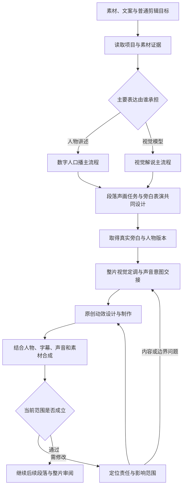
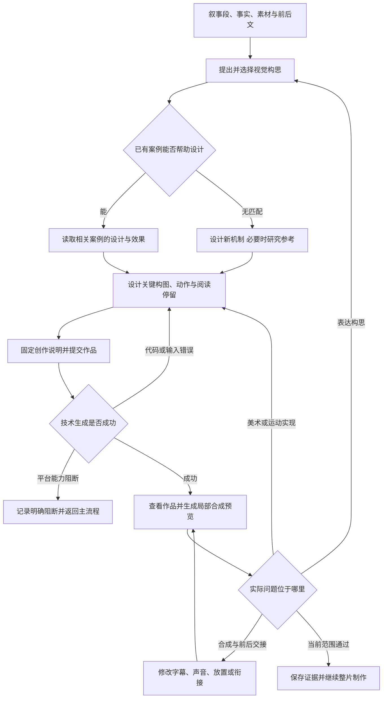
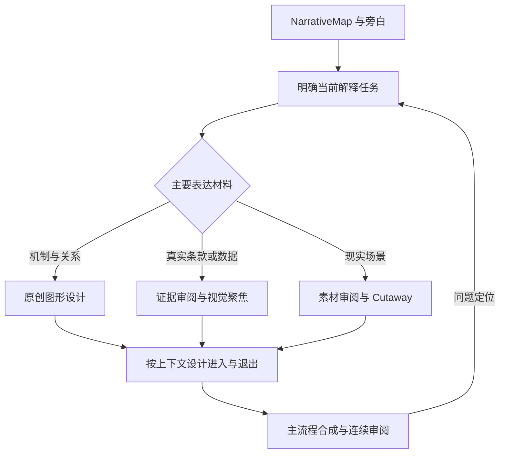
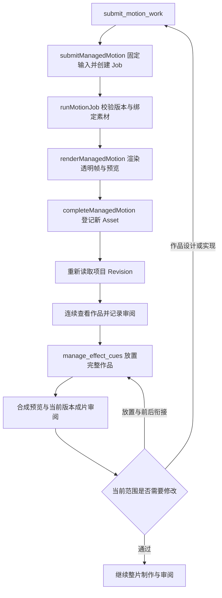
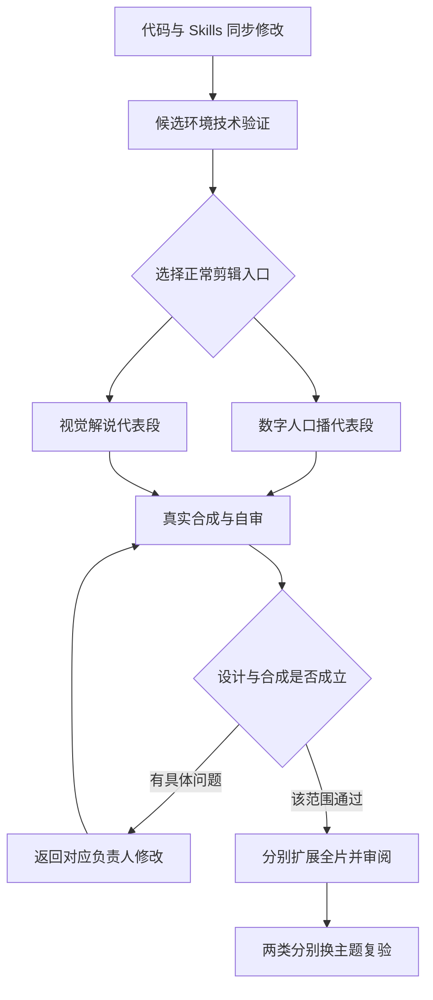

# VideoFlowCut 连续原创动效完整开发方案（含案例库）

**版本：v1.4 素材理解与声音联动版｜2026-09-08｜状态：需求已纳入文档待整体评审，未授权功能开发**

**案例资料同步：2026-09-08。** 第 9 章和相关案例引用已按用户确认统一到根库的最新六项；本次仅整理资料，不改变本方案的功能范围或发布状态。第 1–8 章涉及历史代码基线与待开发能力的判断继续按各节原有边界阅读。

这份文档合并最初的“内容驱动原创动效优化开发方案”与后续案例库方案。**最初的导演交接、原创构思、美术与连续运动、作品接口、多 Beat 覆盖和审阅返修均保留；案例库是其中的教学与质量支撑，不替代整条链路。**

上一版将重点缩成案例 Skills，并写了主导演默认无需调整，确实没有完整承接最初方案。本版恢复对主导演交接方式的具体改动，保留其主流程归属：不新增一个主导演，不等于不调整原导演的职责和输出。

此前的产品对齐和动效需求继续保留。2026-09-08 按用户要求补入[音效链路优化开发方案](音效链路优化开发方案.md)，同步本文中直接受影响的制作顺序、声音交接、代码合同和验收，不重写原有视觉设计与案例内容。源码、运行时 Skills、配置、GitHub 提交/PR、构建部署和正式视频项目均不在本轮修改范围。用户整体阅读并另行授权后，才开始相应功能开发。

同日继续补入[素材理解与多模态检索开发方案](素材理解与多模态检索开发方案.md)，作为视觉素材、证据和声音共同使用的分析与检索基础。本文只同步依赖、采用依据和联合验收，公共链路细节集中在新方案，不复制或重写原有创作方法。

## 0. 阅读入口、材料位置与方案完整性

**当前仓库阅读入口：[README.md](README.md)。** 开发方案保留在本目录，案例统一链接到根库的[总 Skill](../../.agents/skills/motion-case-library/SKILL.md)和最新六项。正文、视频、冻结源码、参数及关键帧只维护在 `.agents/skills/`；本目录不再保存旧 ZIP 中的案例副本。

### 0.1 与现有产品规则的替代关系

现有能力与源码依据见[主架构文档 1.1 节](../ai_video_platform_architecture_development_plan.md#11-本次对齐依据与阅读边界)，动效需求的产品摘要见[第 28 章](../ai_video_platform_architecture_development_plan.md#28-连续原创动效待评审需求与旧规则替代关系)。下表的动效实现对照保留 2026-09-07 核对基线，不能据此否定后来工作区已经形成的代码；正式能力仍核对发布版本和实时 Schema。2026-09-08 的声音能力与缺口另见[声音方案第 1 章](音效链路优化开发方案.md#1-当前能力与需要补齐的缺口)。

| 现有代码/旧规则 | 本文拟替代规则 | 详细章节 |
|---|---|---|
| 受管 TSX 已实现；`reference` 必填、只接受四站；没有 `creativeBrief` | 新建作品保存创作说明，参考可选；无参考原创进入正常生产路径 | 6.7、7.1–7.4 |
| 单件审阅只存 `referenceMatch`、说明和时间；passed/inconclusive 可放置，inconclusive 阻止交付 | 以 `outcome`、作品版本、实际 `evidence` 审阅设计和效果，兼容旧记录 | 7.5 |
| Cue 单一时间锚点承担主要对账；没有显式多 Beat 覆盖字段 | 新增覆盖关系，与时间锚点分开，并补齐非主锚点失效传播和固定时长保护 | 7.6 |
| 主导演/专项已有持续对象原则，但逐 Beat 计划易过早固定形式 | 交接完整内容段与边界，专项负责段内构思、美术、运动与连接 | 2–6 |
| 案例库原基线为旧四例阅读快照 | 资料已切换用户选定六项，以 `.agents/skills/` 为唯一源；运行接入与成片验收仍以实际版本和证据为准 | 6、9 |
| 已有透明帧、受管资源、音效事件失效与五轮成片审阅 | 保留这些边界，增加原创代表段、两类完整成片、换题与六组十二段对照 | 7.7–7.9、8 |

现有代码与过期操作规则的修正已写回主架构及 `docs/skills-v5/` 验收资料；它们不等于本文新规则已发布。第 2–9 章的完整创作链、案例解释和验收细节继续保留。

### 0.2 完整方案索引

| 你要查看的内容 | 本完整方案位置 | 与最初方案的关系 |
| --- | --- | --- |
| 导演只交接内容任务，不提前固定卡片、箭头 | 第 2、4 章；第 6.2–6.6 节 | 恢复完整职责、交接与建议替换正文 |
| 数字人与解说两条正常剪辑链路 | 第 3、5 章；第 6.3–6.4 节 | 分别保留人物接管返回、解释模型与素材交接 |
| 原创构思、美术、关键构图、连续运动和内部返修 | 第 4 章；第 6.7–6.8 节 | 恢复完整生产流程，案例学习进入构思与设计阶段 |
| 提交、Job、资产、缓存、作品与成片审阅 | 第 7.1–7.5 节 | 使用一套统一合同，消除两版提案冲突 |
| 一份作品覆盖多个 Beat、失效与对账 | 第 7.6 节 | 恢复上版遗漏的关联字段与非主锚点失效传播 |
| Scene 边界、层序、透明画面、实拍及预算 | 第 7.7–7.9 节 | 保留可执行组织方式与代码路径 |
| 六项选定案例的 Skill、源码、参数、视频与总索引 | 第 9 章及根案例库 | 已统一的教学材料；含一项明确选定的接力合集，不代替整片验收 |
| 好看与连续怎样验证 | 第 8 章，尤其第 8.8 节 | 完整成片验收加案例迁移对照，两者都要保留 |
| 旁白、在线音效、音乐与动效如何共同制作 | 本文 0.3、4.6、7.11 节及[声音方案](音效链路优化开发方案.md) | 补齐在线选材、模型 HTTP、同步混音和声音验收，不替代原视觉方案 |
| 视频、图片、证据与声音怎样理解、检索并采用 | 本文 0.4、7.11、8.1、10 节及[公共素材方案](素材理解与多模态检索开发方案.md) | 统一源时间、观察、覆盖、片段检索和采用依据；声音为首个应用 |

建议先看第 3–5 章理解整体优化，再看第 9 章的案例；准备开发时读取第 6–8 章。后续以本完整整合版为统一提案，不需要自行拼接两版互相矛盾的字段。

**合同收敛结论：** 新作品使用 `creativeBrief` 保存设计快照，`reference` 可选；审阅统一为 `outcome`、作品版本与实际 `evidence`；Cue 使用拟新增的 `coveredNarrativeBeatIds` 描述多 Beat 兑现。所用案例、材料版本与迁移取舍先写入短创作说明。**不再同时提出另一套 `reference.kind=design`、结构化 `design` 或独立设计审阅状态。** 这些都是拟开发合同，当前接口不因本文已写出就获得新能力。

> 适用重点：数字人口播、视觉解说，以及由两者构成的混合视频。  
> 核心目标：用户提供视频、文案和普通剪辑要求后，系统自主设计与内容匹配的美观、连贯动效；正常制作不要求用户提供动效参考样片。  
> 代码基线：`angelOnly/VideoFlowCut`，`main` 提交 `f7789fd5a01380409770c168ffe9ad892dfe0c99`，2026-09-07，提交说明“第一版剪辑”。  
> 文档性质：待实施的开发方案。文中的新增合同、建议正文和验收场景不代表代码已修改、能力已发布或真实成片已通过验收。  
> 当前归档位置：`docs/VideoFlowCut_动效案例阅读包/完整开发方案.md`；与主架构第 28 章共同供产品评审，尚不授权开发。

本文按实施顺序组织。产品与创作方法见第 1～5 章，逐文件 Skills 改法见第 6 章，代码合同与兼容见第 7 章，开发与验收见第 8 章，案例库与具体教学内容见第 9 章。

- [1. 目标、现状与优化思路](#1-目标现状与优化思路)
- [2. 适用范围与职责划分](#2-适用范围与职责划分)
- [3. 调整后的整体流程](#3-调整后的整体流程)
- [4. 原创动效的创作方法与交接内容](#4-原创动效的创作方法与交接内容)
- [5. 两类视频的具体生产链路与示例](#5-两类视频的具体生产链路与示例)
- [6. Skills 逐项调整](#6-skills-逐项调整)
- [7. 代码与接口调整](#7-代码与接口调整)
- [8. 开发顺序与验收](#8-开发顺序与验收)
- [9. 案例库、总 Skill 与独立教学材料](#9-案例库总-skill-与独立教学材料)
- [10. 后续开发范围与交付清单](#10-后续开发范围与交付清单)

### 0.3 本次声音方案的联动范围

声音完整合同以[音效链路优化开发方案](音效链路优化开发方案.md)为准，主架构第 29 章保存替代关系摘要。本期在线找音效和音乐，项目保留实际采用原文件；不先建设全局本地音效库。MiniCPM/Qwen 通过外部 HTTP 调用，纯音频输入仍需外部服务补齐。

调整后的声画链路是“段落声音与旁白表演共同设计 → 取得真实旁白时序 → 在线候选的真实音频分析 → 当前作品事件表 → 点/范围同步、音乐和混音 → 连续声画与最终音轨验收”。声音专项增加前期设计入口，拟新增 sound-asset-sourcing 负责选材；它们仍交回同一个主要视频工作流。

这项声音计划允许新增必要的 SoundPlan、MotionEventMap 和音频观察，不另建图形设计 DSL、第二套创作说明或独立导演服务。本文原有的声音独立轨、固定作品、真实时序、声音所有权与版本失效边界继续保留。

### 0.4 素材理解与多模态检索的联动范围

公共链路以[素材理解与多模态检索开发方案](素材理解与多模态检索开发方案.md)为准，主架构第 30 章保存替代关系。素材事实、对本次需求的适用判断和正式创作采用分开；目标是找到有源范围、证据和使用条件的片段，不是为整条视频生成一段总结或永久“适合”标签。

MiniCPM 经外部 HTTP 理解实际声画，Qwen 编码文字参与检索，FunASR 与真实源对齐提供语言证据。分段、上下文和覆盖、MediaObservation、任务、检索及纠错共用；音频观察成为公共观察的专门部分。长视频后半段、连续动作、图片区域、原声与预览/原文件映射都需要明确处理，不能仅增加音频入口。

在线声音先验证完整应用，视频 B-roll、动效用图和证据再按依赖扩展；不要求整库深度索引完才开始声音开发。是否用实拍、静音、裁切、全屏或 PiP，以及怎样进入和返回，仍由对应主工作流和专项决定。公共分析不会自动改 Story、Scene 或 Timeline，也不替代原创动效构思。

## 1. 目标、现状与优化思路

### 1.1 本次要解决的问题

当前项目在单独制作动效时，可以出现较强的视觉设计；进入完整剪辑流程后，画面却容易变成多个独立信息页：每页有标题、图形和入场动画，但段落之间缺乏对象延续、注意力转移和有设计的衔接。用户反复提出“更高级、更连贯”，得到的仍可能是原有画面上增加局部效果。

本次优化要使普通剪辑流程主动完成三件事：

1. 根据这一段内容，构思适合的视觉表达。
2. 设计完整画面过程，包括美术、对象变化、运动、阅读停留和前后连接。
3. 生成后查看实际结果，定位问题并修订，再整合进成片。

“原创”指表达方案由当前内容和创作目标驱动，允许使用已有图形方法、代码能力和合法素材；不要求每一个基础形状都重新发明。“无参考”指不依赖用户提供动效样片，也不强制先访问模板网站；真实事实、产品图片、证据页面和用户已有素材仍需按内容正常使用。

抖音参考片和已成功的独立动效，用于说明用户期望的制作水平。本次不把它们写成每次剪辑的必填输入，也不把某一段撕纸、卡片或机舱动画固化成全片模板。

### 1.2 已有能力与真实缺口

| 项目 | 基线中的现状 | 本次优化落点 |
| --- | --- | --- |
| 自定义作品执行 | 已有 `submit_motion_work`，可以隔离执行受限 React/Remotion TSX，生成固定版本透明帧 | 继续复用，用于内容驱动的原创作品 |
| 创作原则 | Skills 已写持续对象、渐进状态、先设计稳定构图、样段验证和避免逐句卡片 | 调整主入口、设计职责和实际交付物，使这些原则进入执行 |
| 默认生产路线 | Remotion 主流程仍突出 Registry；在线参考章节与提交合同以四个网站为中心 | 原创制作成为正常路径；网站灵感作为可选补充 |
| 主从交接 | 逐 Beat 处理计划容易在交接前固定表现形式 | 导演确定内容目标和整片边界，动效专项负责段内具体设计 |
| 多 Beat 作品 | Scene 可关联多个 Beat，但 Cue 对账主要只认单个语义锚点 | 增加明确的作品覆盖关系，保留原时间锚点职责 |
| 审阅 | 已有参考对照、真实预览和整片审阅；部分作品检查只认 `referenceMatch` | 原创作品按创作目标和实际效果审阅，有参考时再补充对照 |
| 确定性检查 | 已能检查时间覆盖、素材、帧数和版本等 | 保留；不能把时间连续覆盖认作视觉连续或审美合格 |

以上为基线代码及 Skills 的检查结果。未读取本次成片对应的生产工程和完整调用日志，因此不将某一接口限制或模板选择写成该成片已证实的唯一根因。

### 1.3 采用的实施路线

采用现有架构内的增量修改：主导演和专项 Skills 调整职责，作品接口支持原创输入，既有审阅机制检查设计与成片，必要的覆盖关系进入现有项目对象。

| 路线 | 能解决什么 | 取舍 |
| --- | --- | --- |
| 仅增加“高级、连贯”的 Skill 要求 | 改善部分提示和选择 | 不能消除强制参考、单目标对账和创作交接限制，不足以完成本次目标 |
| 现有 Skills 与作品链路同步调整 | 从构思、生成到合成审阅贯通原创制作 | 本方案采用；需要少量接口、合同和兼容代码调整 |
| 另建动效导演服务、模板平台或新渲染引擎 | 可扩展更多独立生产能力 | 当前没有必要；会增加任务、状态和维护边界 |

案例库补强这条路线：在内容构思与美术设计时读取相关案例的真实效果、源码和设计解释，提高新作品的设计质量。它不代替导演交接、作品合同或成片审阅，也不把选定案例变成固定模板。

本次不建立新的 Skill 调度服务。文中“主导演调用动效专项”，默认指现有 Codex 在相应阶段读取和执行对应 Skill；不要求新增常驻 Agent 或让多个服务各持一份项目状态。

## 2. 适用范围与职责划分

### 2.1 数字人口播与视觉解说同时覆盖

数字人描述人物素材的来源，解说描述内容组织方式。数字人也可以出现在视觉解说中；路由应依据谁承担主要表达，而不是是否使用了数字人模型。

| 项目 | 数字人口播为主 | 视觉解说为主 |
| --- | --- | --- |
| 主要工作流 | `presenter-motion-director` | `visual-explainer-director` |
| 主要表达 | 人物语言、态度和表演贯穿内容 | 分类、比较、机制、证据、UI 或视觉模型承担理解 |
| 动效使用 | 与人物同屏；必要时全屏接管；处理接管与返回 | 组织完整视觉段落，连接图解、证据和现实素材 |
| 专项输入 | 旁白、真实人物构图、字幕、动作、可用空间、前后画面 | 旁白、认知问题、事实关系、素材与证据、前后解释模型 |
| 连续性重点 | 人物与图形的注意力交接，同一对象在同屏和全屏之间的延续 | 对象、关系、空间和视角随着内容持续发展 |
| 共用创作能力 | 调整后的 `remotion-production` | 调整后的 `remotion-production` |
| 必须单独验收 | 数字人完整剪辑入口 | 视觉解说完整剪辑入口 |

对于已提供数字人成片的任务，沿用 Existing Avatar Assembly：读取并使用现有声音与人物，不因为要优化动效就重新生成口型或人物。`avatar-performance` 负责真实人物能力、声音所有权、Mask 和已有动作的交接，不负责决定整片动效风格。

若人物只在开场和结尾出现，中段主要靠图解、证据建立理解，主流程可以选择 Explainer。混合视频仍只有一个主要工作流，局部借用另一类场景能力。

### 2.2 其他类型的边界

Vlog、采访、剧情等可以复用原创动效能力，但应由各自主工作流决定是否需要。不能把“有原创动效能力”变成所有内容都必须全屏图解，不能把本次两类验收结果扩展宣称为所有视频类型都已验证。

仅做 Cleanup、修字幕、换背景音乐的任务继续遵循用户原范围。完整制作任务则应主动规划必要的视觉表达，不等待用户逐项指出哪里加效果。

### 2.3 三个环节的明确责任

| 环节 | 负责决定 | 应交付 | 不应替其他环节决定的事项 |
| --- | --- | --- | --- |
| 主导演与视觉规划 | 内容目标、主线、事实、整片风格、观看节奏、人物与解释的大范围关系 | 完整叙事段的交接、可调整边界、素材与声音上下文 | 不提前把每句话固定成某个组件、卡片或入场效果 |
| 原创动效专项 | 段内视觉构思、美术、构图、主要对象、动作编排和衔接 | 简短设计说明、可执行作品、局部事件、使用条件和审阅证据 | 不自行改变事实、重写已锁定旁白、修改平台代码或扩展用户需求 |
| 合成与审阅 | 判断设计本身和实际实现是否成立，定位问题与返工范围 | 当前版本的观察、问题、修订与复核结果 | 不凭代码描述或渲染成功直接宣布美观、连贯或合成通过 |

动效专项可提出合并或调整视觉 Scene 的建议；由主工作流用已发布能力修改项目结构。段内对象、构图和动作可以自主设计，事实与已确认主线仍由主工作流控制。

## 3. 调整后的整体流程

### 3.1 两条主流程共用原创动效生产



该图描述共用的动效支线。主流程可以在某段选择人物、实拍或简单字幕，不要求每个 Beat 都经过原创作品生成。

### 3.2 创作、生成与审阅循环



这里不新增逐步用户审批。代表段由系统进行实际审看和必要修订，随后主动继续；只有内容事实缺失、用户硬约束冲突等确实需要用户决定的问题，才提出具体问题。已有平台修复隔离规则继续适用，剪辑任务不能在发生技术阻断时自行改平台。

### 3.3 计划与时间线的落地顺序

1. 将共同解释一个问题的语句组织为创作范围，保留内部各 Beat 的语义关系；共同设计旁白表演、观看目标、声音功能、音乐和留白。
2. 取得并核对这一阶段实际使用的语音和人物版本，按真实时长安排后续动作，保留声音所有权。
3. 主导演给出目标和边界；动效专项提出段内画面方案，声音选材专项按声音需求在线寻找并分析候选。
4. 核对画幅、真实时长、素材、人物与能力，确定宿主 Scene 及作品范围；必要内容变化返回主工作流，不静默改词或拉长旁白。
5. 提交固定版本作品，由同一作品时序生成动作事件表；等待 Job 完成并读回当前项目版本。
6. 记录作品真实审阅状态，以完整匹配的 Cue 放入 Scene；所选声音原文件入库并复核声音锚点。
7. 按动作事件绑定点或范围声音，编排音乐与主次，在相同上下文比较重要声音候选。
8. 结合字幕、声音、人物及其他视觉层做当前范围真实合成审阅，再按整片要求验证最终音轨。
9. 有问题时修改具体对象，生成新作品版本或调整声音与合成，传播影响并复核当前范围。

“先稳定主线”不意味着此时就把每句话的视觉形式和 Scene 长度完全锁死。场景边界需给连续视觉设计留下空间；字幕、事实和已批准内容不能因为改变包装而被静默改写。

## 4. 原创动效的创作方法与交接内容

### 4.1 导演提供什么

每次交接一个有完整表达任务的范围。输入保持紧凑，由系统从已有工程提取，用户不需要填写专业字段。

| 信息 | 必须回答的问题 | 使用现有对象 |
| --- | --- | --- |
| 原文和实际时序 | 当前准确讲了什么，落在哪段真实声音上 | Script、SpeechSegment、StoryBeat |
| 观看目标 | 观众进入时已知什么，离开时新增什么理解或感受 | NarrativeMap、VisualTreatment |
| 事实与素材 | 哪些是真实数据、产品、原文、现成画面，哪些允许示意 | Asset、EvidenceCapture、现有来源记录 |
| 前后关系 | 前一段的焦点和结束状态，后一段的起点与任务 | Scene、Timeline、前后 Preview |
| 人物和字幕 | 真实人物位置、已有动作、可用空间、文字阅读区域 | ActorPerformance、Caption、真实合成帧 |
| 风格和范围 | 本片视觉语气、画幅、允许调整的范围、已锁定事项 | CreativeBrief、CreativeDecision、Scene |

上游可以给视觉方向，但应区分“必须遵守的约束”和“尚可优化的初步想法”。例如“保留人物、不能遮住产品操作”是约束，“考虑使用两个卡片”只是候选，除非用户已明确锁定该形式。

### 4.2 如何提出有内容针对性的构思

动效专项先识别这段内容的关系：对象与属性、变化前后、因果、选择、空间、流程、比较、证据或情绪。然后选择能表达关系的具体画面。

对重要且存在多个合理方向的段落，内部比较少量有实质区别的方案。例如一个方案直接操作真实产品界面，另一个用抽象图形拆解机制；不要把同一张卡片换两种配色称为两个构思。已有清楚且适合的方案可直接实施，不要求每一拍都额外生成候选。

选型同时考虑：

- 是否表达了当前内容的真实关系，容易产生什么误读。
- 画面是否有明确焦点、尺度变化和视觉记忆点。
- 实际素材和当前 Runtime 是否支持，是否有更直接的表达。
- 与前后段落是否互补，是否已经连续重复了同一构图。
- 在真实中文、画幅和语音时间里能否看清。

抽象内容不强制使用隐喻。真实对象、重点排印、对比、空间分组和图像组合同样可以是原创表达。水桶、道路、齿轮、撕纸等都只是具体任务下的选择，不能成为新的关键词模板表。

### 4.3 怎样落实“好看”

先确定本片共享的视觉语言，再为各段设计不同构图。共享内容包括字体层级、颜色含义、图像处理、材质倾向与运动语气；不意味着所有内容必须使用同一背景、卡片和进出场。

每个段落至少要能描述几个有代表性的可读状态，包括开场建立、主要变化后的构图和收束。状态数量由内容决定，不增加固定模板字段或强制每段三个镜头。

设计时具体处理：

- 主对象占画面多少，重要文字是否在目标观看尺寸下可读。
- 文字、图像和关系图怎样形成主次，哪些内容需要分阶段出现。
- 什么时候应使用局部、近景或全貌，观看距离变化是否帮助发现信息。
- 图像是否应该裁切、抠出、并置或与标记结合，证据关键内容是否完整。
- 负空间是否有意图，画面是否因所有对象都很小而显得空。
- 材质、光影和强调色是否服务当前视觉语言，是否过于平均。

这些决定应落实到源码和实际渲染。基线 StylePack 的消费能力有限，不能仅登记一个 `stylePackId` 就声称整片样式已自动统一。

### 4.4 怎样落实“连贯”

连贯设计需要说明主要对象的身份及其在各阶段的变化。例如同一票据上的价格先成为焦点，条件随后展开，最终费用变化发生在这张票据或其明确延伸出的关系图中。

对象可以保留、放大、拆解、重组、退为背景，或通过遮罩和构图交给下一段。也可以在任务改变时直接切镜；关键是观众知道为什么换画面、应该继续看什么。

动作安排要说明先后、距离、速度变化和停留。多个元素共同服务一次变化时可以形成统一重音；如果同时指向不同重点，应压低次要运动。保持足够阅读停留，不把“全程都在移动”作为合格条件。

跨作品时，首尾状态要对齐对象位置、尺度、方向及动作节奏。仅仅让两个 Cue 在时间上相邻，不能证明画面衔接成立。需要保持同一动作的范围，优先在同一作品内完成；工程组织和预算处理见第 7 章。

### 4.5 设计说明保存到哪里

规划阶段复用 `record_creative_decision`：`decision` 写选定构思，`rationale` 写原因，`alternatives` 保存必要取舍，`objectIds` 关联现有 Beat、Scene 等对象。不要把完整项目状态复制进去。

提交阶段建议新增 `work.creativeBrief`，保存这份作品的自包含短说明：目标、准确内容与必要限制、视觉构思、关键状态与运动、前后衔接和核验重点。具体最小合同见第 7 章。

使用案例时，在该短说明中记录实际读取的案例 ID、随包材料对应的提交标识或内容摘要、保留的机制与重新设计的部分。不另建并行的结构化设计合同，也不把案例 MP4 的本地路径填写成在线参考 URL。

该说明是作品版本的输入快照。修改设计或源代码产生新作品版本，旧说明与旧作品一起保留。不能在修改后继续使用旧说明声称已兑现新目标。

`ExplainerSceneProgram.states` 服务现有 Registry 组件，不能把原创创作说明硬塞成一个假 Program 来通过门禁。当前并不需要建立新的 MotionPlan 数据库、复杂图形 DSL 或独立导演服务。

### 4.6 素材与声音的协作

纯图形、排印、路径、遮罩与关系图可在受支持的 TSX/CSS/SVG 内创作。真实产品、人物、文档和现场按现有素材链路取得和审阅；不能因为是原创动画就虚构官方页面或事实。

首版受管作品只直接绑定支持的图片。实拍视频仍放在现有 Cutaway/Timeline 中，透明作品与其同步合成；所需层级、入出点和声音归属必须一起设计。当前不将任意视频、音频、三维依赖或外部网络访问开放给作品源码。

声音设计在制作最终旁白和动效前进入：主工作流与 `audio-finishing` 确定段落声音功能、重音与留白；拟新增 `sound-asset-sourcing` 负责在线候选、真实音频观察及具体使用范围。音效和音乐的详细选择、HTTP 分析与获取见[声音方案第 3–7 章](音效链路优化开发方案.md#3-skill网站适配器模型与平台的职责)。

视觉关键动作通过拟新增的 MotionEventMap 交付点和范围事件，事件表与画面共用作品时序；当前自由名称和局部帧绑定是兼容基线，不是最终权威事件机制。声音专项针对实际入库原文件确定起音、主要攻击和尾音，再通过扩展 AudioCue 绑定。音效仍走独立音轨，不隐式嵌入作品。

更换作品或内部节奏后，读取新事件表并重新计算、绑定和复核；整体平移的物理跟随不代表新位置听感已经成立。连续声音、音乐跨段和内容演示主次见声音方案第 9–10 章，无声作品通过不能替代声画合成通过。

## 5. 两类视频的具体生产链路与示例

### 5.1 数字人口播主流程

入口为 `project-basics → production-director → presenter-motion-director`。提供已生成数字人视频时使用现有素材；需要新生成人物时才进入对应人物生产步骤。

主流程先按段落共同确定内容、旁白表演和声音意图，再取得真实声音和人物版本，读取人物构图、表演与前后画面，规划哪部分由人物承担、哪部分需要图形解释。新数字人口型使用干净旁白，音乐和音效在最终合成时加入；已有视频不因包装升级而自动重生人物或旁白。人物贯穿不代表永远占据第一注意中心；图形可以在内容需要时显著放大或全屏接管。

数字人专项交接增加这些具体信息：

- 画面里实际存在的动作、视线和人物位置；不为不存在的手势设计精确跟随。
- 同屏图形的可用空间，以及必须保护的人物、产品和字幕内容。
- 允许短暂全屏解释的范围、返回人物时要接到的语句和视觉状态。
- 当前有无可用 Mask。没有 Mask 时使用支持的前景或全屏设计，不默认实现人物后景穿插。

#### 数字人示例：解释“套餐流量与速度的区别”

以下为一个约 16 秒范围的设计示例，实际事件帧以真实旁白为准，不可直接复制秒数套用全部视频。

| 局部范围 | 观看任务与画面 | 连续性安排 | 数字人及字幕处理 |
| --- | --- | --- | --- |
| 0～3 秒 | 人物提出问题；一个简洁套餐对象建立焦点 | 对象从人物画面的可用空间进入，避免多个装饰同时抢注意 | 人物和声音正常持续，保留必要字幕 |
| 3～6 秒 | 展示套餐容量增加 | 保留同一套餐对象，只改变容量属性，形成清楚比较 | 图形成为主要焦点，人物仍正常播放 |
| 6～10 秒 | 解释容量与传输速度属于不同维度 | 对象及对应关系放大，作品内背景展开成全屏解释 | 人物可以被设计中的不透明背景覆盖，旁白持续 |
| 10～13 秒 | 聚焦区别，给观众读懂的时间 | 稳定比较结果，次要对象退让，停止无意义循环 | 字幕与主图的文字分工，不能靠缩小字号共存 |
| 13～16 秒 | 收束并返回人物讲述 | 图形收回或让出人物，保留一句核心结论完成交接 | 检查返回处人物动作、字幕及音效尾部 |

这个示例可以在一个足够长的 PresenterScene 内放置一份固定 `front` 图层的透明 ManagedMotion。作品内部改变背景透明度和构图完成接管，不要求 Cue 中途更换图层，也不要求 TSX 直接控制人物视频。

实际缩放、移动人物是另一项合成操作，必须走当前已支持的人物布局能力。首版不能把“人物退为次要焦点”擅自理解为作品代码能够任意操控人物图层。若内容已按多个宿主 Scene 划分，则按第 7 章的边界方案处理，不直接跨 Scene 放置一个 Cue。

这只是可选组织方式。有些段落全程同屏即可完成，有些段落直接切证据更自然，不固定每段都执行人物、全屏、返回三步。

### 5.2 视觉解说主流程

入口为 `project-basics → production-director → visual-explainer-director`。主要工作流从问题、机制、证据和结论组织 NarrativeMap，同时确定段落声音与旁白表演意图；取得真实旁白后，把同一解释任务和声音要求交给原创动效与声音专项。音乐按叙事段落承接，声音本身承担演示时明确其主导范围，不统一套用压低规则。

原有 Scene Grammar 保留为思考视觉关系的方法，不作为只能选择的模板目录。动效专项可以把真实图片、排印、空间关系与多个动作结合成一个完整作品，正常使用 `ManagedMotion` 承担主视觉。



这里的分支表示主要表达材料，允许组合使用。实际素材搜索、证据审阅和动效制作仍按依赖顺序完成，不要求三个分支同时争夺主视觉。

#### 解说示例：解释“一张机票为什么有不同退改条件”

这个示例说明内容如何决定画面，所有具体费用和条件必须来自当前素材。未给定数值时不虚构费率，也不把示意图包装成真实合同。

| 讲解推进 | 画面设计 | 要保留的关系 |
| --- | --- | --- |
| 观众首先看到价格 | 建立一张机票或已核实的购票信息，突出价格和必要上下文 | 确定主要对象，给后续条件一个依附位置 |
| 价格之外还有条件 | 同一票据中的条件区域展开，镜头或构图聚焦相关内容 | 保留价格与条件的对应，避免突然切成无关文字页 |
| 条件影响退款 | 在清楚标注的示意关系中呈现已付金额、扣除项与结果，或使用真实页面解释 | 对象身份、单位和条件不丢失，不能通过动画改变事实比例 |
| 解释回到真实场景 | 结论连接真实购票界面、机舱或人物场景 | 用语义、构图或动作完成过渡，切镜也应让观众继续跟得上 |

不要求每个段落都采用票据拆解。若当前问题是“同一机舱为什么不同座位退改规则不同”，空间分组可能更适合；若是“页面小字如何影响选择”，真实 UI 和阅读路径可能更适合。设计应由问题和素材决定。

### 5.3 两类视频共享与差异化验收

两条流程都应检查：内容是否被准确表达、构图是否具有主次、重要变化是否可感知、动作是否有承接、停留是否合理、连续多个段落是否重复。

数字人额外检查：人物与图形的注意力关系、全屏接管和返回、字幕保护、真实表演配合及 Mask 能力边界。

解说额外检查：模型是否逐步建立、证据与示意是否清楚、对象和关系是否保留、从抽象图解回到现实素材时是否可追随。

独立作品通过只能说明该作品范围成立。完成两类适配必须分别通过两条主流程的真实成片验收，不能用一条解释片样段代替数字人测试。

## 6. Skills 逐项调整

### 6.1 修改范围与实施规则

本节定位基于 `f7789fd5`。以下路径均指源文件 `.agents/skills/`；同名内容发布到 `plugins/videoflowcut/skills/`。开发时先改源文件，再运行仓库的插件同步与校验流程；不能只修改插件副本，随后被同步脚本覆盖。

现有 Skills 已经明确持续对象、Scene 内部渐进、声音落点、代表段、完整审片等原则。本次重点是改变**默认生产路径、段内设计权限、具体交付物和审阅依据**，并清理同一文件里相互矛盾的旧示范。不能仅在末尾追加“更高级、更连贯、不要 PPT”。

| 调整层级 | 涉及 Skills | 修改重点 |
|---|---|---|
| 总体路由 | `production-director` | 无参考仍正常制作；明确两类主流程；视觉专项获得段内创作权 |
| 两条主流程 | `presenter-motion-director`、`visual-explainer-director` | 分别规定人物与图形交接、解释模型与素材交接；显式调用原创作品全链 |
| 视觉规划 | `visual-treatment-planning`、`scene-planning` | 按完整观看任务交接；先形成内容表达，再确定可执行边界 |
| 创作执行 | `remotion-production` | 内容构思、关键画面、美术与运动、代码、作品审阅、成片复核；在设计阶段调用案例教学 |
| 案例教学 | `motion-case-library` 与六份选定的 `motion-case-*` | 提供实际效果、生成方法、设计理由和迁移边界，返回 Remotion 段内创作流程 |
| 质量收口 | `quality-verification` | 对照内容与设计检查真实作品，并检查设计本身是否成立 |
| 配套合同 | 项目基础、共享合同、人物、时机、空间、字幕、声音、素材和 Web | 去除强制参考残留；补充连续作品与外层合成的操作差异 |

下文的“建议正文”可以直接用于改写对应章节。涉及新增输入字段的文字，应与代码合同同批发布；尚未发布的字段不能先写成当前 MCP 已支持。

### 6.2 `production-director`：给两条主流程一致的原创生产目标

**文件：** `.agents/skills/production-director/SKILL.md`。

**当前定位。** 总导演已经按主时间轴驱动方式选择一个主工作流，也明确混合视频的入口和出口。这些保持。需要补的是：没有参考样片时如何确定风格，以及“动效交给下游”究竟给多少设计空间。

**具体修改。**

1. 在 `先把用户目标转成生产合同` 第二段后插入“无参考原创”的默认规则。
2. 在 `Gate B：包装成立` 中，将“包装对象需要目的”扩展为“完整表达段先有内容任务，再有段内设计”；保留纯 Cleanup 的范围保护。
3. 在 `主工作流的阶段交接` 与 `混合视频的控制权` 中补充设计权限边界。
4. 在 `质量问题如何退回` 中，把笼统的 MG 失败拆成构思、美术、运动实现与成片交接四种；负责人规则与 6.8 一致。

**建议插入正文：**

> 完整数字人口播和视觉解说的原创视觉生产，不以用户提供动效参考为前提。参考存在时用于校准本片视觉语言；没有参考时，由主工作流依据内容、受众、人物与素材，自主确定排印层级、色彩语义、材质、构图尺度和运动语气，并保存关键创作决定。不得向用户逐段索取样片或要求用户填写动效专业参数。
>
> 主工作流决定这一段为什么需要图形、希望观众获得什么、允许使用什么素材，以及与前后文如何衔接。`remotion-production` 在这些约束内负责段内视觉构思、美术、构图和运动；上游的机制建议是可修改的候选，已锁定内容与用户明确批准的设计除外。段内优化若不改变事实、旁白和已确认范围，可自主完成；需要改变主线或跨段结构时，返回当前主工作流重新安排，不新增一个与主工作流竞争的导演服务。
>
> 代表段的生成、内部评审和必要修改由系统执行。代表段通过后继续完成原任务范围，不能将“等待用户确认每一段”作为默认生产步骤。

**输出与检查。** ProductionRun 能读出选择 Presenter 或 Explainer 的理由、本片共享视觉语言、代表段选择和实际推进状态；没有参考 URL 的任务能够继续进入 Gate B。只记录加载了哪些 Skills，不视为完成交接。

### 6.3 `presenter-motion-director`：把数字人与原创图形作为一个段落调度

**文件：** `.agents/skills/presenter-motion-director/SKILL.md`。

**当前定位。** 本文件已经覆盖数字人、人物表演不足、前后景与全屏交接，也允许图形成为瞬时重点。缺口在于实际工具路线仍主要落到单个 EffectCue，且“先确认 Registry”容易把设计收窄到现有组件。

**具体修改位置。**

| 现有章节 | 修改动作 |
|---|---|
| `Existing Avatar Assembly` | 保留 AudioMode、表演承载力判断；追加“表演弱时可由完整视觉解释段承担表达”，不能只补更多小效果 |
| `总体生产顺序` | 将“素材需求、Remotion、Cutaway”细化为段落创作交接、代表段设计与生成、合成审阅、扩展其它段落；字幕安全预算在设计前交接，字幕正式生成与混音仍沿用原链 |
| `Gate B：视觉和声音包装成立` → `Remotion` | 替换“先确认 Registry 是否能保持所需机制”所在段落，采用下方正文 |
| `详细工具工作流与读回点` → `6. 视觉和 Remotion` | 明确原创作品提交、审阅、放置，与 Registry Cue 分支；不再对 ManagedMotion 要求无效的 Props/Motion 覆盖 |
| `参考风格怎样进入 Presenter` | 改名为“自主风格设计与可选参考”；无参考采用主工作流的风格决定 |
| `从空项目到交付的示范路线` | 在 `manage_effect_cues` 前明确列入创作说明、`submit_motion_work`、Job 读回、作品审阅；加入放置后的真实合成复核 |
| `专项交接总表` | MG 输出补充设计依据、固定作品版本、覆盖 Beat、内部事件帧与剩余限制 |

**`Remotion` 小节建议替换正文：**

> 当一段内容需要比较、状态变化、关系解释、重点排印或视觉记忆时，把完整观看任务交给 `remotion-production`。输入包括实际旁白范围与精度、相关 Beat、人物构图与可用动作、字幕预算、真实素材、本片视觉语言和前后画面；不要先拆成逐句独立效果清单，也不将 Registry 名称当作既定设计。
>
> 段内可以保持人物同屏，也可以让图形接管画面，再返回人物。动效专项先设计关键画面、对象变化和交接，再选择受管原创作品或能够完整实现设计的现有组件。需要独特连续表达的段落直接进入原创作品流程，不要求先找网站参考或遍历组件作为前置门槛。
>
> 人物与全屏的选择须由内容和真实构图决定。不能固定每段都执行“人物—全屏—人物”，也不能因为人物是叙事锚点，就将核心图形缩到角落。没有可靠 Mask 或手势证据时，使用可实现的同屏构图与全屏交接，不能假装人物能够把图形拿在手里。
>
> 交接主画面控制权时，记录离开人物前的状态、解释段起始状态、关键变化和返回人物的句子/姿态。若连续对象需要贯穿这些阶段，先共同设计其身份、位置和尺度，再按当前 Scene、层级与作品时长约束实施；语义上同一段设计，不代表一个 Cue 已经支持任意跨 Scene。

**示范路线的核心替换。** 原 `manage_visual_treatment → 获取资产 → manage_effect_cues` 改为：

1. 保存 Treatment 与完整段落的任务、范围和上下文。
2. 确认真实人物构图、基础字幕预算与所需资产。
3. 动效专项构思并记录关键画面，内部选定一个方案。
4. 提交原创作品；完成后读取并审阅，必要时改版。尚需人物、字幕或 Cutaway 上下文才能判断的，登记 `inconclusive` 和具体原因。
5. 按最终设计协调 Scene/Cutaway/底层 Program，放置通过作品或明确待审的草稿；读回 Revision 与 Impact。待审草稿用于取得合成证据，不得作为交付通过结果。
6. 字幕与声音按内部事件配合，播放包含前后语句的真实合成。
7. 代表段成立后继续其它段落，最后完成整片审阅。

**输出与检查。** 至少验证一段数字人素材能在无参考条件下，从内容任务自主得到完整视觉设计。验收范围包含人物参与、图形推进和前后交接；不能只看独立透明动效。图形是否必须全屏、人物是否需要退场，不设固定比例。

### 6.4 `visual-explainer-director`：从解释模型进入原创作品，不受组件名称限制

**文件：** `.agents/skills/visual-explainer-director/SKILL.md`。

**当前定位。** NarrativeMap、信息账本、大 Scene 渐进与来源阅读已经写得较完整。应保留这些方法，改变它们进入可执行作品的路径。

**具体修改。**

- 在 `Scene Grammar：选择视觉机制` 开头说明：下列名称是帮助构思的方法，既不是封闭模板目录，也不是当前 MCP 的必选枚举。允许组合、变形和为当前内容新建表达方式。
- 修改 `从 Script 到 NarrativeMap 的实际方法` 第三遍工作：先形成候选视觉模型，再由动效专项细化关键画面；主流程不把候选语法直接固定成组件。
- 在 `Scene 计划表` 中补充相邻段入口/出口状态、允许变更的设计范围；维持“不是数据库字段要求”的说明。
- 更新 `工具与当前落地` 与 `Gate B：具体生产` 中“仅有限视觉、完整 Registry 未落地”的表述：按本版本真实能力说明已有 Scene 加受管 ManagedMotion 可以承担原创主视觉；不存在某个 Registry 组件不再自动表示不能生产该类二维段落。
- 将 `参考视频复用` 改为“自主设计与可选参考”。参考只在提供或主动研究时参与，不作为每个作品的交付依据。

**`Gate B：具体生产` 建议替换正文：**

> `visual-treatment-planning` 确认当前观看任务、主要表达方式和整片 AttentionCurve；`scene-planning` 形成范围与前后接口；`remotion-production` 将完整解释段转成具体视觉构思、关键画面和连续运动。Scene Grammar 提供思考工具，不能把所有内容强行装入现有卡片或有限 Program。
>
> 原创主视觉可以由受管 Remotion 作品实现，并通过现有 ExplainerScene 与 ManagedMotion 放置。先确认素材与实现能力，再生成、审阅和合成。需要真实证据时由 `evidence-visualization` 提供可追溯素材；需要视频时由素材与 Cutaway 链路承担播放，不假定受管作品已经支持嵌入任意视频或声音。
>
> 作品替换现有 Program 时，明确谁承担主视觉，再对旧 Program 局部停用。不能用新的不透明背景把旧内容遮住后就宣称替换完成。结构上覆盖完整 Scene，只证明有可用主视觉；内部是否真的解释了内容，仍由真实连续观看验证。

**输出与检查。** NarrativeMap 的知识推进能对应到作品中的真实变化。换一份不同主题的 Script，应得到不同的视觉关系与构图，不只是把相同模板换标题。代表段需覆盖解释过程及至少一个自然前后接口；是否插入证据由内容决定，不能为验证而伪造证据。

### 6.5 `visual-treatment-planning`：交付内容任务与设计余地

**文件：** `.agents/skills/visual-treatment-planning/SKILL.md`。

**当前定位。** 已规定先判断观看任务，再选模式，最后选组件；也已比较保持、最小处理和更强处理。需要解决的是“每个 Beat 一条计划”如何让下游仍能设计一整段。

**具体修改。**

1. 在 `三方案比较` 后插入“相邻 Beat 的联合表达”。原三方案是是否及如何处理的策略比较；不再为每一小效果追加三次完整渲染。
2. 在 `视觉决策的层级` 中明确“处理决定可以确定任务与强度，具体构图仍由动效专项细化”。
3. 在 `输出 Visual Treatment` 和 `交接合同` 中补充联合表达范围、共享对象、前后接口与设计权限。
4. 将 `何时调用下游` 末尾的不可改变规则细化：事实与观众任务保持，建议机制可以改进；已锁定设计按原锁定合同处理。

**建议插入正文：**

> 每个 Beat 仍保留自己的观看任务与保持/处理决定。相邻 Beat 如果共同解释同一个问题，且主要对象或关系应延续，可交给下游作为一个完整表达段设计。联合表达是对现有 Beat、Scene 和创作决定的组织方法，不要求新建一套与 Story 并行的段落数据库。
>
> 交接写清：相关 Beat 与真实时间范围；观众进入时已知什么；结束时应该理解什么；不可提前透露的信息；第一注意目标；已有素材；本片视觉语言；前后画面与声音；允许采用的同屏/全屏方式；哪些是硬约束，哪些只是候选机制。
>
> 动效专项可以在范围内提出更合适的比喻、对象、布局和运动，不必逐次返回请求许可。若新构思会改变事实、改变观看任务、改动主声音、侵犯已锁定内容，或无法在当前范围实现，才返回本 Skill 或当前主工作流重新决定。技术失败不能把原定的重要解释任务自动改称安静区。

**输出与检查。** 读回的 Treatment 仍逐 Beat 可追溯，跨 Beat 的创作选择写入现有 CreativeDecision。下游收到的是能开展创作的内容任务，不是预先编号的组件出场表；重要任务完成与否由实际作品覆盖和观看证据共同确认。

### 6.6 `scene-planning`：分清创作段落、Scene 与作品边界

**文件：** `.agents/skills/scene-planning/SKILL.md`。

**当前定位。** 已明确一个 Scene 可以覆盖多个 Beat、对象应持续、场景切换有桥。本次要补齐的是这些原则与固定作品范围、实际层级和 Cutaway 的关系。

**具体修改。**

- 在 `Scene 和 StoryBeat 的关系` 后插入“创作范围与执行范围”。
- 在 `内部状态：Entry、Progressive、Settled、Exit` 的 Progressive 与 Settled 中说明：完整段落可以有多次“变化—停留”，不能把内部简化为一遍统一入场、静止、退场。
- 在 `Scene 之间的桥` 与 `当前项目写入` 中明确交接状态如何交给作品生产；修正“内部 State 未自动编译”容易被理解为“不能原创制作”的歧义。

**建议插入正文：**

> 创作段落表示一个完整观看任务；Scene 表示项目中的叙事和空间范围；受管作品表示一份固定时长、画幅和帧率的渲染版本。三者可以对应，但不是强制一一对应。按语义先设计整段，再根据当前实现能力确定 Scene、Cue、作品和 Cutaway 的实际边界。
>
> 同一视觉任务中的连续对象，应保留身份、空间基线与关系；中间可经历多次聚焦、变形、比较和停留。具体变化来自当前内容。跨 Scene 或因渲染预算拆成多件作品时，写清交接对象的末态与初态、位置、尺度、颜色、阅读状态及运动方向；运动中接续还要匹配速度与相位。不能仅因两件作品时间首尾相接就认定视觉连续。
>
> 优先在可行的自然稳定点拆分。不得为适应单件预算，把一个仍在发生的关键动作直接截断；也不能通过拼接重复入场制造“连续覆盖”。完整设计可以包含一个自然切镜，持续运动不是所有边界的硬要求。
>
> 本版本不为创意状态新增通用自动编译器。状态设计写进创作说明，由受管作品的帧驱动代码实现。需要人物或实拍接管时，由现有 Timeline、Scene、Cutaway 与层级规则共同实现；关键事件不能在被其它画面遮住时悄悄播放完。

**输出与检查。** Scene 有真实范围与目的；作品的完整长度可放置；入口、内部变化和出口有可观察状态。跨 Beat 的覆盖有明确关联；跨 Scene 的语义设计不能代替实际合法放置。检查包含接缝前后完整动作，不只检查各作品自身。

### 6.7 `remotion-production`：重写主生产顺序与默认路径

**文件：** `.agents/skills/remotion-production/SKILL.md`。

这是改动最集中的文件。当前同时存在三个容易把创作拉回旧路线的位置：`使用现有 Registry` 写着“视频生产默认使用”；`在线参考驱动的作品创作` 将创作建立在四站参考上；`项目写入流程` 又从浏览组件直接进入写 Cue。三处必须一起调整。

#### 6.7.1 章节调整清单

| 现有章节 | 修改方式 |
|---|---|
| Frontmatter `description`、`Remotion 在系统中的位置` | 明确专项负责段内创作与实现，主工作流负责整片任务；区分 Remotion 渲染库与承担创作的 Skill |
| `先确认任务是生产还是代码开发` | 改为“先区分项目创作与平台开发”；删除默认从 Registry 开始的措辞 |
| `在线参考驱动的作品创作` | 整章移到主生产流程之后，改名“可选的在线参考研究”；保留合法获取、实际观察与不能捏造参考运动的规则 |
| `编码或选择组件前的输入` | 前移到主流程起点；增加真实上下文、设计自由度、目标显示尺寸和可实现合成方式 |
| `Style 对齐和代表性样例 Gate` | 明确无参考也自主建立风格；样段是系统内部验证，默认不暂停请求用户确认 |
| `Design Map`、`先设计 Settled Frame`、`Motion Grammar` | 组合为内容构思、关键画面、美术与运动设计三步；保留阅读与声音事件原理，扩展成多个关键状态 |
| 拟新增 `案例学习与原创适配` | 放在内容构思与关键画面之间，按需读取总 Skill、最相关的案例及其独立效果；明确学习机制而非复制外壳，结果回到本 Skill 继续设计 |
| `受管作品生成和修改` | 独立为一级主章节；更新为创作说明与可选参考合同，保留隔离、哈希、图片绑定、固定版本、生成与放置分离 |
| `当前 EffectCue 写入合同` | 分开普通 Registry Cue 与 ManagedMotion；原创作品示例作为主示例，EvidenceCard 示例移到复用分支 |
| `新组件代码开发流程`、`修改已有组件还是新建组件` | 放到末尾的平台维护分支；单片原创作品不需要注册为全局组件 |
| `项目写入流程`、`验证`、`交接合同` | 替换为完整原创链；列明返回主工作流的设计、版本、覆盖、事件和证据 |

保留并按新顺序引用 `Props 设计`、`局部时间与 Remotion Sequence`、`Natural Box 与 Timeline Canvas`、`响应式与多画幅`、`当前代码安全边界`、`性能和缓存` 等技术章节，避免重写成熟实现边界。

#### 6.7.2 可直接采用的主流程替换正文

以下正文替换原文件前部的默认路线与末尾“项目写入流程”。实际工具字段以本次发布后的实时 Schema 为准。

> **职责与默认方式**
>
> `remotion-production` 负责当前内容段落的视觉构思、美术、构图、运动编排、受管实现和合成验证。主要工作流决定整片承诺、段落任务、事实与上下文；本 Skill 在这些边界内自主完成设计。Remotion 库只负责实现，Skill 不能把“库不是导演”理解为自己只能执行上游已指定的组件。
>
> 不要求参考 URL。需要内容专属的连续表达时，正常进入受管原创作品流程。现有组件在能够完整保留设计时可以复用；选择发生在构思之后。只修改数字、颜色或一个既有 Cue 的任务按局部范围执行，不强制重做整段。
>
> **第一步：读懂内容与真实合成环境。**
>
> 读取当前 Revision、相关 Beat、Script、真实旁白时间与精度、Scene、人物/字幕/证据范围、前后画面、已有作品和本片视觉语言。检查实际素材与可用 API。判断观众当前不知道什么、视觉要让他发现什么，以及结尾要留下什么。没有参考不构成缺口；必要事实或必需素材缺失时，先返回明确的素材需求或可保持任务的替代方案。
>
> **第二步：提出内容对应的视觉构思。**
>
> 对承担核心解释或记忆的段落，内部比较两个有实质差异的表达构思，然后选一个实施。差异应在对象、关系、发现顺序或观看视角，不只是两种颜色。普通强调可以直接采用成熟表达，不为每个小元素重复方案评审。
>
> 说明为何这个构思适合当前内容、哪些关系会通过变化被看懂、真实素材承担什么作用、可能造成什么误读，以及它怎样进入和结束。比喻只能帮助理解已确认的事实，不能把不同机制硬套成相似图案。不要用“高级流畅科技风”代替具体构思，也不要把所有名词转换成图标。
>
> **在构思与关键画面之间使用案例。**
>
> 按需读取 `motion-case-library`，由观看任务判断哪份案例能提供设计方法。先看该例选定效果，再读生成思路、源码与实际关键帧；能读取静态图片而不能播放本地视频时，如实区分静态观察、源码理解和已记录的动态结论。借鉴对象持续、构图、注意顺序与运动组织，重新设计当前文字、数值、素材、人物和时序。没有匹配案例仍可设计新机制，不强迫套用已有案例。当前正式提交限制以实时 Schema 为准；本完整方案的无参考路径须与第 7 章合同同批发布。
>
> **第三步：形成关键画面与连续变化。**
>
> 先设计少量足以说明本段的关键画面：入口、重要变化、可读结论与出口；复杂段落按信息推进增加中间状态，不规定固定数量。每个状态说明第一重点、仍然存在的对象、发生变化的属性、真实中文、相对大小与位置、人物/字幕关系、需要停留的理由。保持身份的对象应让观众能够追踪；新对象在需要时建立，不反复清空重画。
>
> 为每两幅关键画面说明怎样到达：聚焦、展开、遮罩揭示、关系生长、视角转换、自然切镜或回收；选用什么由内容决定。写清起势、主要变化、落点与阅读时段。若对象需要持续运动跨件交接，明确边界状态与运动相位；若自然切镜更清楚，可以采用切镜，不强迫每段变形。
>
> **第四步：完成美术与运动编排。**
>
> 用真实文字和素材设计关键构图，确认中文排印层级、颜色含义、主体尺度、留白、图片处理、材质与背景分离。整片共享视觉语言，但不同任务应有不同构图。停稳状态在目标观看尺寸下必须成立，不能依赖粒子、发光或漂浮掩盖画面空弱。
>
> 再确定动作顺序、空间路径、距离、速度变化、过冲与阅读停留。对象运动建立注意主次，背景与次要信息按阶段退让。需要声音的主要动作命名并给出局部帧；保持声音由现有 Audio 轨实现。内部可见变化、代码时序与交付的事件帧应一致。
>
> **第五步：提交固定版本作品。**
>
> 采用本次更新后的 `submit_motion_work` 合同，提交源码、Props、画布、时长、图片绑定、权利和创作说明；只有实际使用参考时才附参考观察。所有执行都通过受管 MCP，不修改平台源码、不安装依赖、不绕过隔离。代码只使用已支持的确定性 API；实拍与声音通过现有合成链安排，不写入不支持的作品资源类型。
>
> 提交只创建 Job。通过 `track_job`、`read_motion_work` 和 `inspect_asset` 取得当前版本源码、产物与实际动态观察；未完成 Job 或无法检视的作品保留未审状态。需要修改时提交新作品并关联 `previousAssetId`，原版本和已使用的 Asset 不覆盖。
>
> **第六步：审阅作品，再放回成片。**
>
> 先看真实作品是否表达了当前内容，是否实现选定设计，关键构图、运动和节奏是否成立；同时允许推翻一个已被正确实现但效果平淡的构思。用更新后的 `review_motion_work` 保存对应版本的实际结论。有参考时再检查所借鉴的关系，无参考时不填写虚构的匹配证明。作品审阅通过只是允许作为候选使用，不代表成片通过。
>
> 若无法脱离人物、字幕或 Cutaway 判断，或尚未取得足够连续观察，先登记 `inconclusive` 与明确原因，允许进入待审草稿取得真实合成证据，再复核结论。未观察不能写成通过；需要合成才能判断，也不应成为无法制作草稿的循环前置条件。
>
> 根据当前 Scene 与层级放置完整 ManagedMotion，绑定明确的覆盖 Beat；Cue 决定整体时间和归属，作品内部排版与运动不再套第二层统一进出场。替换原生主视觉时局部处理旧 Program，配合 Cutaway 的遮盖范围。只修改整体放置可更新原 Cue；改内部设计必须生成新作品，并复核相关声音事件。
>
> 在同 Revision 中渲染真实合成，播放前一句、完整变化、后一句，检查人物、字幕、证据、实拍、声音及前后状态。独立透明作品好看，但在人物或字幕下失去主次，仍需要修改。检查失败后定位到构思、美术、运动或合成接口，不统一用增加缓动解决。
>
> **第七步：扩展并交回主工作流。**
>
> 一个代表性段落经过实际合成验证后，将已验证的风格规则应用到其它相关段落，并逐段根据新内容构思。复用色彩与运动语气，不复用固定出场表。交回作品版本、Cue/Scene、覆盖 Beat、内部事件、修改范围、实际证据、已知问题和下一步。内部样段通过后继续原有整片任务，整片最终审阅仍由当前主工作流收口。

#### 6.7.3 与现有技术章节必须同步的说明

`当前 EffectCue 写入合同` 应提供两个清晰分支：

- **Registry 分支：** 可按类型消费 Props、Motion、StylePack、空间参数；只写当前 Registry 实际支持的字段。
- **ManagedMotion 分支：** 固定版本 Asset 承担内部画面与运动；通过 Cue 放置完整范围、语义关联及覆盖 Beat。不能假装通用 Inspector 参数能够改变透明帧里的具体对象。

`媒体 Asset 处理` 应继续区分平台组件与受管 TSX 的能力。平台其它 Runtime 能播视频，不意味着首版受管 TSX 可以嵌入视频。设计可以用图片、CSS、SVG 与外层 Cutaway 实现丰富组合；遇到无法忠实实现的核心机制，应提交明确能力缺口，不得删掉关键环节仍宣称完成。

`批量生产和一致性` 应明确：关键帧对比检验美术，连续段检验运动与交接，完整成片检验重复、密度与声音。不能用整齐的静帧联系表证明连续动画已经成立。

**输出与检查。** 无参考作品有可读的内容设计依据、固定版本和真实审阅；独立生成与整片入口共用这套生产方法；不会因缺少网站参考或 Registry 条目而自动退化为通用卡片。

### 6.8 `quality-verification`：同时检查设计与实现，按根因返回

**文件：** `.agents/skills/quality-verification/SKILL.md`。

**当前定位。** 四级证据、五轮审片、未关闭问题跨版本保留、局部与整片覆盖已存在。这些机制保留，不再新建一套评分服务或第六轮审阅。

**具体修改。**

1. 在 `局部真实合成` 后说明作品审阅与合成审阅的范围差异。
2. 将 `根因而不是症状` 的 MG 分派扩展为下表。
3. 在 `表现不足与未兑现计划` 中加入原创设计与作品的对应检查，并明确覆盖 Beat 只是结构关联。
4. 在 `Presenter 质量的深入问题`、`Explainer 质量的深入问题` 中加入各自连续表达检查。
5. 同步修改 `references/mode-specific-rubrics.md` 对应模式的 `视觉机制`、`人物与视觉`、`失败信号`。

| 可观察问题 | 返回位置 | 有效修改与复核 |
|---|---|---|
| 图形有动作，但无法说明本段关系；比喻造成误读 | 动效构思；涉及任务错误时返回 Treatment/主流程 | 重选表达机制，再观看完整解释过程 |
| 静态画面小、散、平，主体和结论不突出 | Remotion 美术与关键画面 | 重做主体尺度、排印、构图和素材处理，检查目标显示尺寸 |
| 静帧好看，运动中跳变、争抢或停留不足 | Remotion 运动编排 / `effect-timing` | 调整内部变化和事件帧，重新播放完整动作 |
| 独立作品成立，叠入字幕、人物或实拍后失败 | 主流程协调 `depth-composition`、字幕、Cutaway、声音 | 修改合成位置和交接，复核前后语句 |

**建议插入正文：**

> 原创作品的审阅依据是当前内容、创作说明、实际素材与可观察输出。分别判断“设计是否值得采用”和“输出是否实现设计”。同一模型写出的设计说明，不构成效果通过的证据；渲染成功、语义覆盖完整、审阅字段齐全也不构成审美通过。
>
> Presenter 检查人物与图形是否有明确主次交换，同屏和全屏的选择是否有内容理由，返回人物时语句、姿态与视觉尾部是否衔接。Explainer 检查对象身份、比较基线与关系推进是否可跟随，来源阅读与图解/实拍切换是否保持理解。两类都检查重复构图、视觉尺度、运动轻重、停留与声音落点，不以动效数量或始终运动为目标。
>
> 一份作品覆盖多个 Beat 时，对账接受合法的显式覆盖关系；专业审阅仍需要看作品是否实际处理了这些内容。时间覆盖和共同 Scene 不能代替内容兑现。只看完一个代表段，不能关闭其它段落或新 Revision 的问题。
>
> 根据已确认方向进行必要修改是正常内部流程，不默认要求用户逐段审批。已有重大问题应修复并复核；可选建议不导致无限重渲染。超出当前能力或感知证据不足时保留具体阻断/未知，报告已完成的可检验范围，不能降低严重级别或虚报观看结果来收口。

**输出与检查。** Finding 能指出具体对象、版本、范围、观看影响和负责人；新作品不能继承旧作品的通过结论。作品通过、代表段通过、整片通过和最终 Artifact 通过分别有自己的证据范围。

### 6.9 配套 Skills 与共享合同的具体同步项

以下文件按需修改相关章节，无需全文重写。所有路径相对于 `.agents/skills/`。

| 文件与准确章节 | 需要怎么改 | 检查点 |
|---|---|---|
| `project-basics/SKILL.md`：`Presenter、Scene 和 Effect`、`例二：添加一个产品效果` | 工具列表补齐受管作品链；例二保留为组件复用案例，另加一段无参考原创作品写入示例，包含 Job、作品审阅、Cue 放置和读回 | 项目基础入口不再暗示所有效果都从 `browse_effect_types` 开始 |
| `_shared/MCP_EXECUTION_CONTRACT.md`：`受管 Remotion 作品` | 同步新提交与审阅字段、原创设计依据、可选参考、旧数据兼容、覆盖 Beat；撤掉 `reference_match` 是所有作品必填依据的描述 | 合同、代码、工具 Schema 与测试同一 PR 更新 |
| `_shared/MCP_EXECUTION_CONTRACT.md`：`阶段审片、对账与恢复`、`既有场景主视觉的局部启停` | 明确显式多 Beat 关联与结构覆盖的区别；保留 Program 局部停用、底层透明处和前后审阅 | 不能为对账重复创建 Cue，不能为替换主视觉整批重编译 |
| `_shared/PROJECT_REVISION_AND_HANDOFF.md`：`专项 Skill 的交接合同` | 视觉交接补任务、约束/候选、前后接口；作品交回补设计版本、覆盖、事件与证据。继续复用现有对象，不新增第二事实源 | 下游不需重新猜意图，写后仍读回 Revision/Impact |
| `avatar-performance/SKILL.md`：`目光、表情和手势`、`交接合同` | 交付实际可用构图、有效动作范围、Mask 状态与返回人物风险；这是素材事实，不让该专项替导演决定每段特效 | 无手势/Mask 时不会编造精确互动；既有声音所有权不变 |
| `effect-timing/SKILL.md`：`动作阶段`、`当前写入和验证`、`交接合同` | 扩展为一件作品内多个语义事件及停留；普通 Cue 可改 Motion，ManagedMotion 内部时序需改源码/Props并重生版本；整体平移与内部重定时分开 | 不按字数伪造词级时间，不给完整作品统一再套入场 |
| `depth-composition/SKILL.md`：`Fullscreen 与返回`、`当前工具`、`交接合同` | 描述入口、关键状态、出口的构图约束及可见范围；明确受管作品内部位置由源码负责，外层不能任意拖动内部图形或重排人物 | 设计有足够视觉尺度，同时遵守实际层级与人物素材能力 |
| `captions/SKILL.md`：`基础字幕与重点排印的角色分离`、`字幕与其它画面的分工` | 在作品设计前提供字幕预算；设计后按已有可持久化能力协调字幕。持续保留语言和真实时间，不因主视觉有字就自动删字幕 | 不假定已实现自动避让、动态隐藏或任意字幕重定时 |
| `audio-finishing/SKILL.md`：入口、声音选材、事件绑定、音乐与复听 | 增加前期段落设计入口；默认在线选材交接；按当前作品事件表编排点/范围、音乐、角色主次与包络；换版重算并复核 | 详见声音方案第 9–12 章；不把来源目录、模型调用或无声动效当声音验收 |
| 拟新增 `sound-asset-sourcing/SKILL.md` | 根据声音意图组织在线查询、硬过滤、实际音频分析、原文件与备选推荐；共享 acquisition，不套用视觉构图与生成降级 | 返回具体文件/范围、来源、观察和采用限制；本轮只列计划，不创建运行时 Skill |
| `cutaway-planning/SKILL.md`：`时长与进入返回`、`当前能力`、`Cutaway 两端同时审阅` | 从共同设计读取进出状态、源范围和主视觉交接；明确 Cutaway 覆盖期间底层作品继续按局部时间运行，必须给返回画面安排正确状态 | 不让关键解释在遮盖期间播完；front 与 fullscreen 的选择符合真实渲染顺序 |
| `visual-asset-sourcing/SKILL.md`：`当前能力与计划能力` 的“在线动效”段 | 改成“可选参考研究”；原创二维对象不需要先找模板。区分灵感、作品所用图片、证据、实拍四种用途，只有实际使用的素材进入获取链 | 搜不到参考不会阻断原创制作；无原文件不能把预览当素材 |
| `evidence-visualization/SKILL.md`：`原始内容与项目增加层`、`证据 Scene 的退出`、`当前能力` | 交接真实来源图与可读范围，原创作品可负责聚焦/高亮/连接；指出已支持的图片绑定可实现部分表达，但不冒充完整抓取服务或伪造页面 | 动效示意与真实证据可区分；条件、来源、否定与单位保留 |
| `web-editor-operator/SKILL.md`：`如何看一个效果`、`如何做微调`、`A/B/不使用比较` | 检查多个关键状态和完整运动；区分普通 Cue 参数与受管作品内部源码修改；仅高影响分歧比较候选，不规定每个效果都渲染三个版本 | 不在网页临时改 CSS；不以浏览器打开或抽帧证明已看完连续声画 |

共享 `_shared/QUALITY_EVIDENCE_AND_DELIVERY.md` 的质量依据与修复回路同步以上范围区分；不增加新的用户审批节点。用户主动提出的已授权任务和既有 Artifact 批准规则分别按原合同执行。

### 6.10 案例、发行副本与无需修改的 Skills

**案例要改变示范路径。** 只改主文而继续提供大量“某组件适合什么”的案例，模型仍容易回到组件驱动。配套参考文件按下表调整：

| 文件 | 具体调整 |
|---|---|
| `remotion-production/references/motion-graphics-casebook.md` | 在 `MetricBackdrop` 等组件案例之前加入两篇完整案例：数字人同屏解释与返回、视觉解说对象推进与素材交接。每篇包含内容任务、两个构思取舍、关键状态、作品与外层分工、一次具体失败与修订。原组件案例移入“适合直接复用时”部分 |
| `remotion-production/references/remotion-component-contract.md` | 在 `生产组件与代码组件` 补充无参考原创的正常路径；`更新与兼容` 明确作品版本、设计与审阅一起固定；维持平台组件与项目作品的区别 |
| `presenter-motion-director/references/presenter-editing-grammar.md` | 在 `从方法到已验证成片` 接入新的原创主链；保留已有语义排印、对比和声音方法，不复制一套相同规则 |
| `presenter-motion-director/references/talking-head-casebook.md` | 在 `案例九：整片“太平”` 后增加“无参考、固定景别数字人的完整原创解释段”，展示如何判断表演承载力与主次交换 |
| `visual-explainer-director/references/explainer-scene-grammar-casebook.md` | 在案例说明中注明语法不是组件；补一个跨多个 Beat 的原创作品案例及一个自然切镜案例，防止把持续运动当成唯一解 |
| `quality-verification/references/mode-specific-rubrics.md` | Presenter 与 Explainer 分别补充设计本身、运动实现、合成关系的失败示例；与主文件使用同一分派规则 |

第 9 章的教学材料已统一为总 Skill 加六份选定案例 Skill。上述 casebook 继续负责完整剪辑上下文及失败返修示例，通过相对链接引用根库案例，避免把源码与设计正文复制出第二份。所选视频是教学结果；合集同时保留分段材料，casebook 中的真实人物／字幕／声音合成仍需单独验证。

案例中的流量、水桶、机票等只用于展示判断方法，不能进入固定模板路由或成为默认题材规则。至少一个案例采用不同的非容器表达，避免所有机制都被画成“装东西的盒子”。

**无需为原创视觉目标重写：** `asset-import`、`transcription`、`semantic-continuity`、`vlog-director` 等核心业务流程。新增声音方案会涉及 `voice-production` 的表演意图落实，以及 `export`、`known-errors` 的音频检查和失败交接，具体局部调整见声音方案第 12.2 节；不改变既有原声剪辑、Vlog 事件剪辑或交付批准模型，也不为宣称“全部 Skills 已优化”制造无关改动。

**发布完成检查：** 源 `.agents/skills/`、插件副本、共享合同、案例、描述字段和工具 Schema 使用一致的新路径；检索旧“默认 Registry”“确认参考对照后”“参考必填”等措辞，逐处判断是合法的可选参考分支还是已过期要求。最终以两条无参考整片入口的实际执行记录验证，不能只靠文本检索或 Skills 加载计数验收。

## 7. 代码与接口调整

本章以提交 `f7789fd5` 的实际实现为原动效方案基线。下文标为“新增”的字段是相对该基线的开发建议，后续工作区和安装态可能已有部分进展，实施前逐项核对，不能照文档重复开发或假定已发布。现有工具继续使用，不增加一套独立动效服务。第 7.11 节补入本次声音合同及联合验证要求。

**与上一版案例提案统一：** 采用本章的单一创作说明、可选参考、统一审阅和多 Beat 覆盖。案例 ID、版本及选用理由放进 `creativeBrief`，不再增加 `reference.kind=design` 分支与第二套审阅完成状态。

### 7.1 先固定现有调用链，明确作品生成与成片编排的边界

目前真实执行顺序如下。`submit_motion_work` 只创建生成 Job，不自动写 Timeline，也不会安装新组件到平台 Registry。



需要写进工具返回提示和 Skills 的调用规则：

1. 提交前读取当前项目 Revision，固定源码、Props、图片绑定、画幅、帧率、时长和创作说明；使用幂等键提交。
2. 使用现有 Job 查询和 `read_motion_work` 确认结果。任务提交不等于渲染完成；失败时读取错误，不能继续假定 Asset 已存在。
3. Worker 完成时，`completeManagedMotion` 登记 Asset，会产生新的项目 Revision。等待期间其他操作也可能改变版本，审阅和放置前必须重读最新状态。
4. `review_motion_work` 本身也会写 Revision。后续 `manage_effect_cues` 使用审阅操作返回的最新版本；并发发生变更时重新读取，不能连续复用最初的 `base_revision_id`。
5. 作品源码、Props、时长或图片发生变化，提交新的作品版本，填写现有 `previousAssetId`；然后局部更新原 Cue 的 Asset 绑定。不能修改 Cue.props 假装已修改作品。
6. 作品完整帧数必须等于 Cue 的持续帧数，Cue 范围必须完整位于宿主 Scene 内。作品独立承担整场景主视觉时，还需完整覆盖该 Scene；人物同屏的局部作品不要求与整个 Scene 等长。现有合同不支持隐式裁切或时间拉伸。

### 7.2 作品合同：参考可选，新增一份简短创作说明

修改 `packages/motion-work/src/schema.ts` 的 `motionSubmissionSchema`。

| 内容 | 当前实现 | 本次改法 |
|---|---|---|
| `reference` | 必填；URL 必须属于四站；附观察记录 | 改为可选。没有参考时完整省略，不生成占位 URL 或虚构观察 |
| `creativeBrief` | 不存在 | 新增短文本快照，记录当前作品采用的具体视觉设计 |
| `source / props / imageBindings` | 固定版本作品输入 | 保留；创作说明随这些输入一起固定 |
| `rights` | 作品及绑定素材的来源与使用条件 | 保留现有字段；去掉必填参考不改变素材记录方式 |
| `previousAssetId` | 关联同项目上一作品 | 保留，作为修改作品的正常入口 |

建议 `creativeBrief` 使用有长度上限的非空文本，例如上限 6,000 字符。它只保存已选方案，不保存完整推理和所有候选草稿。内容包含：本段表达目标、关键画面及变化、主要阅读停留、段落进出方式，以及数字人同屏或全屏安排。相关旁白时间和已批准的风格决定也写入短快照，以便审阅时定位。

示意如下，省略了现有源码和素材字段：

```ts
// 拟新增合同示意；不是当前接口原样定义。
type MotionSubmissionUpdate = {
  creativeBrief?: string;
  reference?: ExistingMotionReference;
};
```

这里类型允许缺省，是为了读取历史任务。**对本次上线后新创建的作品，提交入口要求真实的 `creativeBrief`；对既有任务读取、重试和旧缓存验证，不补写新字段。** 新作品有参考时也写创作说明，因为“看过某个模板”不能替代当前段落的表达设计。幂等命中旧任务应先走旧任务一致性验证，不能被新作品的必填规则误伤。

本次无需扩大参考抓取范围。`browse_motion_sources`、`inspect_motion_reference` 仍可保留原四站范围，作为可选工具；把它们从原创生产的必经路径移除即可。用户不提供参考，Agent 不访问四站，也必须能提交作品。

创作说明只建立设计与结果之间的核对依据，不能由“字段已填写”直接判定美术与叙事合格。

### 7.3 将新合同贯穿 Job、Worker、Asset 和读取接口

不能只把 Zod 中的 `reference` 加上 `.optional()`。至少同时修改以下位置：

| 文件与定位 | 必须修改的行为 |
|---|---|
| `apps/server/src/motion-tools.ts`：`registerMotionTools` | 更新提交工具说明；`browse_motion_sources` 返回提示改为“可选灵感”；新增输入说明不要求先观看四站 |
| `apps/server/src/app.ts`：提交与审阅 HTTP 入口 | 与 MCP 使用相同的新旧输入、审阅和证据校验，避免两种入口产生不同状态 |
| `packages/edit-application/src/index.ts`：`submitManagedMotion` | 新任务验证创作说明；通过既有 `payload.work` 保存固定快照；保持素材绑定哈希和幂等校验 |
| 同文件：`readManagedMotion` | 返回可读取的创作说明、可选参考和本作品版本的审阅；改掉“参考对照通过后才能放置”的无条件提示 |
| `apps/render-worker/src/motion-job.ts`：`runMotionJob` | 读取新旧两种 work；`source.json` 保存新快照；返回中用中性审阅要求替代 `referenceReviewRequired: true` |
| `packages/edit-application/src/index.ts`：`completeManagedMotion` | 删除对 `work.reference.url` 的无条件解引用；作品 `referenceUrl` 可缺省；保存 `creativeBrief` 供读取与审阅；新 Asset 使用中性待审标记 |
| `packages/contracts/src/index.ts`：`Asset.motion` | `referenceUrl` 改为可选；新增可选 `creativeBrief`；兼容旧 Asset 没有该字段 |
| `apps/web/src/MotionLibraryPanel.tsx`：来源与审阅展示 | 无参考时显示创作说明及其中的案例依据；有参考时保留真实链接；统一展示中性作品审阅状态，不再固定要求在线参考 |

实现上建议由 `completeManagedMotion` 从已验证 Job 的 `work` 复制创作说明到 Asset.motion。Job/source.json 是固定作品输入，Asset.motion 是便于读取的摘要；不能让后续编辑绕过重新提交，只改单份摘要。旧 Asset 没有说明时返回“历史作品无创作说明”，不要根据文件名自动编造。

去掉 `reference_review_required` 这类新资产默认标签及返回措辞，改为中性的作品审阅要求。历史标签只按兼容信息读取，不能再成为所有作品必须有参考的判据。若 Web 或工具消费者依赖旧返回名，一次性更新消费者或短期双写明确弃用，不能让两个字段分别表示不同的完成状态。

### 7.4 旧任务与缓存兼容：不要为了加字段改变旧作品哈希

`packages/motion-work/src/compiler.ts` 的 `motionHash` 当前对引擎版本、`JSON.stringify(input)` 和绑定图片序列计算哈希。`runMotionJob` 会重新 parse Job 和缓存中的 `source.json`，再检查哈希。**新字段默认值、旧字段重排或新的归一化步骤，都可能把未改动的旧作品判为损坏。**

本次采取最小兼容方案：

- 保留现有字段的解析与序列化次序；新增可选字段追加在旧字段之后。
- 不给历史输入注入 `mode: "reference"`、空 `creativeBrief`、空对象 `reference` 或新的 schema 版本默认值。
- 对原来缺失的新字段保持缺失；旧 Job 和旧 `source.json` 经新解析器处理后的序列化结果必须与基线一致。
- 新输入含 `creativeBrief` 时自然参与作品哈希，保证修改设计依据也产生新版本；相同输入的幂等重试仍得到同一结果。
- 本次不更换渲染算法，不因合同新增字段随意提升 `MOTION_ENGINE_VERSION`。将来确需换算法时，为旧任务保留明确的版本验证路径，不能全局替换常量后期待旧队列仍能恢复。
- 验证已有 `managed-motion-3` Job、旧缓存命中、队列重启、重复完成和新无参考作品；同时确保损坏的图片、帧或源码仍被检测出来。

如果现有解析器无法保持旧序列化，就明确保留一份旧输入解析路径，再增加新输入路径；不允许以跳过 `MOTION_VERSION_MISMATCH` 或缓存校验解决兼容问题。

### 7.5 作品审阅改为中性结果，并绑定具体版本

现有 `review_motion_work` 输入是 `reference_match`，Application 保存为 `Asset.motion.review.referenceMatch`；质量系统直接检查这个字段。其语义无法完整表达无参考原创作品的审阅，应统一更新。

建议新接口使用 `outcome: passed | failed | inconclusive`，继续使用现有 `note`。审阅说明要求回答两个问题：**画面是否实现本次创作说明，以及这份设计在真实播放中是否成立。** 对原创作品不要求参考相似度；有参考时可在说明中补充对风格或运动目标的核对，也不把像不像模板作为总成绩。

新增审阅记录绑定 `asset.motion.version`，例如保存 `version`。后端从目标 Asset 自动填入，不依赖 Agent 自报。现有 `asset_id` 和 `base_revision_id` 保留。旧客户端的 `reference_match` 仅对历史参考作品作为过渡输入别名，且只在没有新参数时解释；新原创作品不得通过旧别名绕开新审阅合同，两种参数冲突直接返回明确错误。

旧数据的 `referenceMatch` 可兼容读取其历史结果，同时保留“旧参考审阅”来源，不将旧说明改写成已完成新标准的创作审阅。当前作品修订后，新 Asset 不复制上一版的通过结果。`previousAssetId` 仅关联版本历史，不能授予审阅通过状态。

**最小证据关联。** 当前作品审阅只有结论和文字说明，尚未像成片审阅一样验证实际媒体。建议新增一个可选 `evidence` 对象，保存观察目标、方式和范围，复用已有媒体校验能力：

| 建议输入 | 用途与校验 |
|---|---|
| `kind: work_proxy \| project_preview` | 区分作品自身代理与实际合成预览，不能混用两种结论 |
| `previewJobId` | 仅合成预览需要；必须是本项目、目标 Revision 的成功 Preview，且该版本中实际包含目标作品 |
| `startFrame / endFrame` | 作品代理使用作品局部帧；合成预览使用时间线帧。后端检查实际文件时长、范围及作品覆盖 |
| `method` | 复用 `frames / continuous_video / audio / audiovisual` 的既有语义；作品动态通过需要实际连续画面，截图只能支持局部构图问题 |

观察内容继续写入 `note`，不增加另一份重复说明。作品代理由目标 Asset 的受管产物定位，调用方不传任意文件路径；后端固定作品版本、实际媒体路径、内容哈希、观察范围与时间。有合成 Preview 时，复用 `packages/edit-application/src/editorial-evidence.ts` 的 `validateEditorialObservations` 及媒体检查，再核实目标版本的 Cue 确实出现在所看范围。独立作品代理不属于普通 Preview Job，新增薄适配复用其中路径、哈希和媒体验证，不能直接把它伪装成 Preview。

新 `passed` 记录须有覆盖完整作品动态过程的有效观察；`failed` 可以来自确实看见的问题；未看见、只看静帧或缺少必要上下文时记 `inconclusive` 并说明缺口，允许不带 `evidence`。当前作品代理由无音轨渲染生成，不能登记为 `audio` 或 `audiovisual`；声音与声画配合须使用有真实音轨的合成 Preview。校验只能证明证据文件、身份和声明方式可用，不能证明审阅者确实理解画面。该限制在 Skills 与验收中同时保留。

**避免生成与合成互相等待。** 单件作品可以先凭自身连续代理完成设计审阅，也可以明确登记 `inconclusive` 后放入待审草稿生成合成预览；不要求先有成片审阅才允许制作草稿。传入合成证据时，对照审阅提交时的 `base_revision_id` 验证，并保留该证据的来源 Revision；审阅写操作自身产生的新 Revision 不使已验证的单件作品证据失效。当前成片的后续预览和最终审阅仍针对最新 Revision，沿用现有脏范围与复核规则。作品版本未变时不反复清空其单件审阅，但旧成片预览不能冒充新项目版本的通过证据。

审阅与放置边界如下：

| 状态 | 放入草稿 | 正式交付 |
|---|---|---|
| 技术未就绪或渲染失败 | 不作为有效作品放置 | 阻挡 |
| 未审阅 | 先明确登记待审状态和原因 | 阻挡 |
| `inconclusive` | 允许技术就绪作品进入待审合成，复用现有机制 | 阻挡 |
| `failed` | 返回修改，不作为有效完成结果 | 阻挡 |
| 当前作品版本 `passed` | 允许 | 仍须当前项目版本的完整合成审阅通过 |

同步修改 `packages/contracts/src/index.ts` 中的 `inspectEffectContentContract`、`packages/edit-application/src/index.ts` 中的 `assertManagedMotionCue`、`packages/quality-system/src/index.ts` 对待审作品的读取，以及 MCP／HTTP 审阅入口与 `apps/web/src/MotionLibraryPanel.tsx` 的状态展示。建议统一封装新旧审阅读取逻辑，避免 Renderer 认 `outcome`、质量系统仍认 `referenceMatch`。错误信息改为“作品连续动态审阅未通过”，包括现有 `MOTION_REFERENCE_REVIEW_REQUIRED` 的生产者和消费者。

平台代码只执行状态、版本、素材、时长、画幅和证据完整性检查。连续性、美术与表达的判断由真实预览审阅提供。现有 `hasManagedExplainerVisual` 只是时间覆盖检查，应保留其结构语义，不把“覆盖全 Scene”解释为“动效连贯好看”。

### 7.6 一份连续作品覆盖多个 Beat：增加关联，保留单一时间锚点

现有 `productionReconciliation` 只把 `semanticAnchor.type === "narrative_beat"` 且 `targetId` 相同的 Cue 计入该 Beat。这样一份解释三个叙事点的完整作品，若只锚定第一个 Beat，其他两个仍可能被报告为未实施。

建议在 `EffectCue` 上新增可选 `coveredNarrativeBeatIds`，MCP 对应输入 `covered_narrative_beat_ids`。这里只保存本次放置实际实现的 Beat ID，通常很短；无需创建新的覆盖实体或时间线。覆盖归属放在 Cue 上，因为同一作品在不同项目位置可能承担不同内容任务。

必须保持两种关系独立：

- `semanticAnchor`：决定作品随哪段内容定位，继续只负责时间锚定。
- `coveredNarrativeBeatIds`：供计划与结果对账，说明本次放置实现哪些叙事点；不用于把一份作品拆成多个 Cue，也不拉长作品时长。

涉及改动如下；现有构造器只挑选固定字段，必须显式透传，不能只改 TypeScript 接口。

| 文件与定位 | 修改内容 |
|---|---|
| `packages/contracts/src/index.ts`：`EffectCue` | 增加可选关联字段，旧快照缺省合法 |
| `apps/server/src/mcp.ts`：`manage_effect_cues` | 新增创建/更新输入并传入 Application |
| `packages/edit-application/src/index.ts`：`createEffectCue / updateEffectCue` | 持久化覆盖关系，检查范围与关联，返回影响范围 |
| `packages/edit-domain/src/index.ts`：`createEffectCue / assertProjectGraphValid` | 构造器显式透传；项目图校验检查关联合法性 |
| `packages/edit-application/src/persistence/normalize-snapshot.ts`：`normalizeSnapshot` | 保留可选字段及旧数据缺省，不自动填满宿主 Scene 的全部 Beat |
| `packages/quality-system/src/editorial-review.ts`：`productionReconciliation` | 对账读取显式关联，旧数据回退单一语义锚点 |

校验规则：ID 去重且属于当前项目；被声明覆盖的 Beat 应关联宿主 Scene，并具有与当前 Cue 范围相交的有效内容范围；Cue 必须真正参与合成且未 stale。范围相交只是必要条件，不能证明内容已实现；审阅仍需确认作品确实表达了这些点。没有精确 Beat 时间时，以现有语音映射和场景归属核实，不推断共用 Scene 内全部 Beat 自动完成。旧 Cue 没有新增字段时，回退到原单锚点对账。

同时修改失效传播，重点检查 `packages/edit-application/src/index.ts` 的 `recompileCueFromAnchor`、`propagateTimelineMove`，以及脚本/Story 更新和语音时间更新路径：

1. 被覆盖的 Beat 删除、含义变化、旁白内部时间变化或 Scene 归属变化，相关 Cue 的覆盖声明需要重新核实，使用现有 `stale` 标记并加入影响报告。
2. 整段时间线等量平移，作品内容和局部时间未变，可沿用固定作品，只移动 Cue；旧位置与新位置均标脏，成片需重审。
3. 范围缩短、拉长、内部重排时，不能让现有 `fit()` 静默裁切固定作品后重新置为 ready。需要新作品版本，或明确复核后做合法的放置调整。
4. 某个非主锚点 Beat 变化时，也必须传播到该 Cue；不能仅遍历 `semanticAnchor.targetId`。
5. 一份已因内容变化而 stale 的 Cue，不能被无关的时间线移动顺手恢复 ready。覆盖重新确认应通过明确的更新动作，作品改变则提交新版本。

### 7.7 场景组织与合成：在现有单 Scene 合同内实现连续设计

当前 Cue 只能绑定一个 `sceneId`，范围必须完整位于这个 Scene 内。`updateEffectCue` 不能更换 Scene、类型或图层。**本次不新增跨 Scene Cue。**

先把一个完整解释过程组织成合理的宿主 Scene，再在其内部放一份或少量完整作品。一个 Scene 可以承载多个叙事点；不要因为每句话有一个 Beat 就提前切成无法承接的短容器。既有工程确实需要重组 Scene 时，先评估字幕、音效、人物和 Cutaway 绑定，做有范围的调整；不能仅为了方便动效就重建整片。

数字人“同屏→全屏解释→返回人物”可以在同一 PresenterScene 内实现：保持底层人物视频和旁白，使用固定 `front` 图层的透明作品。作品先只在留白区绘制对象，再逐渐展开不透明背景与主体覆盖画面，结束时收回或清空覆盖，底层人物重新显露。它不要求修改 Cue 图层，也不要求跨 Scene。

这条实现只改变覆盖关系，**不等于 TSX 能驱动数字人视频移动、缩小或改机位**。需要人物真正位移、重新构图时，必须交给现有 Actor/Timeline 能力；动效设计不能承诺当前编排工具没有的行为。设计素材与人物遮挡关系，也应按现有布局及蒙版能力决定。

视觉解说已有原生 ExplainerProgram 时，替换主视觉应使用现有 `set_explainer_program_enabled`，对应 `setExplainerProgramEnabled`，仅关闭目标 Program。保留 Scene 语义、字幕、音效、已有作品与素材。不要为了让新动效露出来再次全量执行 `compile_explainer_scenes`；当前全量编译会清理旧场景关联的 Cue 和 Item，可能删除刚放好的作品。

### 7.8 透明帧、实拍与层级必须按真实渲染器组合

`validateMotionSource` 当前允许 React、指定 Remotion API、文字、CSS、SVG 和通过 `imageBindings` 注入的图片。渲染禁止 `<video>`、`<audio>`、任意外部依赖及网络加载；最多绑定 8 张受管图片。不要把“原创”写成任意 3D、视频纹理或外部脚本都可用。

实拍视频、人物和证据视频继续由现有 Timeline/Cutaway 承担，原创作品提供相配合的透明图形。`CueLayer` 在正式合成中读取 PNG 透明帧，预览代理的背景不会带入成片，也不会再次套通用入场动画。

当前从下到上的相关顺序为：

| 层次顺序 | 对设计与放置的影响 |
|---|---|
| 普通人物/主视频 | 可作为连续作品的底层 |
| 原生 ExplainerProgram | 替换时局部停用，防止旧视觉从透明区域露出 |
| ExplainerScene 的 `fullscreen` Cue | 在 Cutaway 下方，不应假定能盖住其上实拍 |
| Cutaway 视频 | 可在原创主视觉上方显示 |
| `actor/front` Cue | 可在 Cutaway 上绘制高亮、边框或局部遮罩 |
| 非 ExplainerScene 的 `fullscreen` Cue | 位于上述画面上方 |
| 字幕 | 最终仍需检查阅读和遮挡 |

因此，撕纸露出实拍一类设计，若使用同场景的 Cutaway，应让透明遮罩位于能覆盖 Cutaway 的 `front` 层，并按真实视频范围同步。不是把一份普通 MP4 填进 `imageBindings`。必要时同一设计使用主视觉与前景两个完整作品，二者共享已确定的运动时间与构图，但不因此拆成逐句独立模板。

由 `packages/remotion-runtime/src/index.tsx` 的 `ProjectComposition / CueLayer` 对照实际层序核实。保留现有 alpha、可见性和字幕安全测量；通过合成预览确认底层退出、透明区域和阅读位置。源码里设计“透明”，与最终确实露出预期视频，是两项必须连起来验证的事实。

### 7.9 预算约束与开发范围

保留 `apps/render-worker/src/motion-renderer.ts` 的现有资源限制：最多 650,000,000 像素帧、透明 PNG 缓存 256 MiB、渲染浏览器 5 分钟截止；Schema 另有 900 帧和 30 秒上限。上限同时生效，例如 60 fps 的作品在 900 帧限制下最多 15 秒，不能只看“30 秒”。

| 示例 | 像素帧计算 | 判断 |
|---|---|---|
| 768×1344、24fps、24 秒 | 768×1344×576＝594,542,592 | 低于像素帧上限，可作为首轮完整连续段规格 |
| 1080×1920、30fps、24 秒 | 1080×1920×720＝1,492,992,000 | 超限，不能直接承诺该规格单件 24 秒 |

第一项通过像素预算不保证通过缓存和实际耗时，仍需真实渲染。验证工程的 Timeline 与作品必须使用同一画幅、帧率，不能将低分辨率作品直接放入不同规格工程。

建议在提交入口提前计算现有像素帧预算，返回明确的预计帧数和超限原因；最终 Worker 继续执行强校验。超限时按自然叙事边界组织作品并设计承接，不能为了满足预算把每句话机械切开。本次不要求重写为流式帧引擎或分块渲染服务；这些只有在已验证原创效果后、确有高规格长段需求时单独评估。

### 7.10 代码交付核对表

开发完成时，至少应能核对以下事实：

- 无参考的新作品，经现有工具完成提交、渲染、读取、审阅与放置；新参考作品按新创作说明合同提交，历史作品和已排队任务继续可读、可恢复。
- 旧 Job 和缓存不因新增字段而改变哈希；新作品版本不继承旧版审阅。
- 多 Beat 连续作品正确对账；非锚点 Beat 改变也能使相关放置失效；整段平移不会误裁作品。
- 原生主视觉可局部停用，其他 Cue、字幕、音效和素材保持；替换作品仅更新目标放置。
- 数字人覆盖与返回、解说加 Cutaway、透明区域和字幕在真实合成中按预期呈现。
- `inconclusive` 可进入待审草稿，却无法正式交付；`passed` 的单件作品仍不能代替当前项目版本的完整审片。

测试优先扩展现有 `tests/managed-motion.test.ts`、`tests/managed-motion-render.test.ts` 与 `scripts/managed-motion-mcp.e2e.ts`，并在现有传播与质量测试中补多 Beat 和版本失效场景。这里验证真实合同风险，不增加“字段存在即质量优秀”的测试，也不把美感做成虚假的自动分数。

### 7.11 声音合同与动效的联合改动

声音完整数据和工具合同见[声音方案第 8–12 章](音效链路优化开发方案.md#8-数据合同事实归属与兼容)。动效侧必须交付与画面共用时序的 MotionEventMap，并在作品生成、读取、版本校验和 Cue 绑定中贯通；不能只在创作说明写几个时间点，就宣称已完成可靠事件同步。

点事件用主要攻击对齐动作；范围事件同时处理开始、主体和收尾。声音来源是在线候选经分析、采用、入库后的实际文件；模型只经外部 HTTP 调用。预览与原文件分别观察，声音锚点按实际源裁切计算，持续音效与音量包络需要扩展 AudioCue、Application 和 Renderer，不能只改工具描述。

现有纯平移跟随与内部变化 stale 作为安全基线保留。新版本事件语义成立时经验证重绑和重算，周围语言或音乐变化后重新审阅；事件删除或含义改变时旧声音停用。SoundPlan、观察与事件表不复制 Script/Scene 状态，搜索会话与试听缓存不反复创建创作 Revision。

素材观察、源范围与采用依据共用[公共素材方案](素材理解与多模态检索开发方案.md)。音源锚点、B-roll 范围和动效图片区域分别以真实源定位保存，进入项目时再换算或绑定；预览与原文件映射不明时重新核验。动效采用的图片需核对完整性、分辨率和实际裁切，证据需核对来源与限定条件，不能用检索相似度替代。观察纠错或源内容变化后，定位到相关采用对象复核；单纯 Timeline 平移保留源观察，合成上下文仍需重审。

联合验收至少覆盖数字人进入全屏动效再返回、持续动作和内容演示声音；预览与导出共用声音计算，最终文件增加完整音轨解码与混音检查。独立无声案例、成功获取音效和单点播放都不能替代这些结论。

## 8. 开发顺序与验收

### 8.1 本次完成的判断标准

本次优化的目标是：用户只给内容、素材和正常剪辑要求，系统就能在数字人口播、视觉解说两条主流程中，自主构思并完成原创动效，经过实际合成审阅后用于成片。用户不需要每次提供动效样片，也不需要逐段批准视觉方案。

开发验收分为三个不同结论：**技术链路通过、代表段创作通过、完整成片通过**。前一个结论不能代替后一个。脚本可以证明没有参考的作品能够提交、渲染和放置，不能证明系统已经具有稳定的视觉创作水平；一个独立 Remotion 文件好看，也不能证明它进入数字人剪辑后仍然成立。

验证不设置统一审美分数，不规定必须使用多少动画、模板或转场。是否采用原创动效，由段落的解释、强调和情绪任务决定；静止阅读、保留人物表演和直接呈现证据都可以是合理设计。

本次合并评审增加声音链路的联合完成标准，详见[声音方案第 14 章](音效链路优化开发方案.md#14-开发批次与验收标准)。前期声音意图、在线候选真实分析、作品事件同步、持续声与音乐、改稿复核和最终音轨均需验证；不能只交付音频上传入口或来源列表。声音方案的四个批次与下文视觉三批按依赖组合，保留原代表段、完整成片和换题复验。

公共素材部分按[素材方案第 15–16 章](素材理解与多模态检索开发方案.md#15-四个实施阶段)实施和验收：验证长素材任意范围检索、连续可用时长、声画/转写来源区分、原文件定位、纠错及采用失效；再把选中的素材放入真实代表段。模型调用成功或片段命中不等于其进入数字人加动效后的效果通过，也不能替代下文视觉创作实验。

### 8.2 开发批次及先后关系

**准备批次：整理案例教材，必要时先验证方法。**

核对第 9 章已统一的六项案例 Skill、冻结源码、Fixture、所选视频及必要分段材料，按第 8.8 节用新脚本验证教学价值。总 Skill 与实际修订经验只在根库维护，在线参考选型示范见第 9.5 节。已有选定版不必为了重新交付而全部重渲染。若本次授权只覆盖案例验证，就到该范围为止，并分别说明完整链路的实际状态；不得自动扩大为接口或源码改动。

案例验证只是可以提前做的局部验证，不能替代下列三批，也不能以它为由省略本方案已列出的主导演和接口优化。获准完整开发后，按以下顺序完成。

**第一批：在同一候选变更中贯通合同、实现和 Skills。**

按前文章节修改作品提交、设计依据保存、审阅、版本兼容、多 Beat 覆盖关系与质量对账；同步修改总导演、两个主导演、视觉规划、Remotion 制作、案例教学和质量审阅的操作说明及示例。代码和 Skills 应放在同一 PR 中评审，避免先上线“没有参考也能提交”的接口，但实际导演仍要求先找四站参考；也避免 Skill 已经使用新字段，安装的 MCP 仍拒绝请求。

这一批完成时必须能在隔离候选环境中证明：无参考的原创作品可以走到真实草稿合成；存在参考时仍能正常使用；设计依据和审阅状态完整保存；未完成审阅不会被误报为最终交付通过。

**第二批：分别从两类正常剪辑入口检验创作。**

分别建立一个 `presenter_motion`、一个 `visual_explainer` 验收项目。由普通剪辑任务进入 `production-director`，正常路由到对应主工作流。测试指令只包含主题、素材、受众与成片要求，不写“必须调用 remotion-production”，不附动效参考，不预填作品代码或完整分镜。

每条链路先制作一个承担完整解释任务的代表段，保留前后文，并放回实际人物、旁白、字幕、Cutaway 和声音环境中。代表段长度由内容决定，不为了凑固定秒数压缩阅读或延长空转；渲染配置必须符合实际预算。验证代表段之后扩展全片，不能用单件作品的通过状态覆盖全片。

**第三批：换主题复验，检查能力能否迁移。**

为两类主流程各换一份内容关系不同的素材：例如初次验证容量与速度的机制关系，复验改为条件判断或多方案取舍。检查对象、构图和推进方式是否根据新内容重新设计。只换数字、标题和颜色，仍保留完全相同的水桶、卡片或镜头顺序，说明创作入口尚未真正改变。

三批顺序如下；图中的修改回路由系统自行完成，不是新增用户审批环节。



### 8.3 最少必要的自动化验证

以已存在的测试和 E2E 为基础增加有针对性的分支。测试主要保护本次合同变化和版本边界，不用断言 Skill 中出现“高级”“连续”等关键词来证明创作能力。

| 验证范围 | 最少应覆盖的行为 | 复用位置 |
|---|---|---|
| 提交与兼容 | 无参考、有完整设计依据的新作品可提交；缺必要依据的请求被明确拒绝；旧版含参考作品及旧任务仍可读取；参考存在时仍按原有规则处理 | `tests/managed-motion.test.ts` |
| 作品身份与审阅 | 设计依据、源码或受管输入变化进入作品身份判断；同幂等键不同内容不能复用旧 Job；新版本保持待审，不继承旧作品通过；旧 Cue 不被自动换绑；审阅关联真实作品或合成媒体，错误版本、范围及证据方式被拒绝 | `tests/managed-motion.test.ts` |
| 草稿与交付状态 | 技术成功不能自动审美通过；证据不足允许按现有规则进行草稿验证，不能收口交付；失败作品不能成为正常就绪效果；有参考与无参考走一致的质量状态语义 | `tests/managed-motion.test.ts` |
| 多 Beat 对账 | 一件作品明确覆盖多个有效 Beat 时无需复制 Cue；不存在、跨项目或与实际放置范围不相容的关联被拒绝或报告；删除、过期及失效作品不算兑现；仍兼容单锚点旧数据 | 在现有质量对账测试中扩展，或新增单一聚焦测试文件 |
| MCP 与发行物 | 通过候选 Runtime 实际执行无参考提交、Worker 生成、重读、草稿放置、真实合成和审阅状态读回；返回信息不再无条件要求对照四站参考 | `scripts/managed-motion-mcp.e2e.ts` |
| Skills 与工具一致 | 源目录、插件副本同步；总索引与六份案例 Skill 及其 TSX／JSON／MP4／关键帧引用可达且镜像一致；示例工具名和字段符合新 schema；两类主导演均能进入原创生产和对应审阅 | `tests/skills-v5-integration.test.ts` |

保留 `tests/managed-motion-render.test.ts` 已有的真实 Alpha、逐帧寻址、代理帧数及渲染隔离验证。本次如果没有修改渲染器，就复用这些回归，不另写一套重复验证透明像素的测试。候选 E2E 继续使用独立测试项目与固定测试音，明确标记它只证明技术行为，不代表自然语音、听感或用户审美已通过。

现有 `scripts/presenter-creative-agent.eval.ts` 只验证 Skill、MCP、ProductionRun 和报告可达性，并正确拒绝没有真实证据的完成请求。这项结果仍保留为技术接入结论，不能将其命名或包装为本次数字人创作验收。解说入口也必须有对应的真实任务记录。

运行现有 typecheck、上述相关测试及必要的候选 E2E；根据仓库要求完成 Skills 同步和发行物验证。只在发现具体风险时扩大测试范围。本文列的是开发实施要求，并不表示这些修改或测试已经执行。

### 8.4 两条主流程分别看什么

两个验收项目可共用配色、字体等技术能力，但不能共用一次审阅结论。每个项目都要保存输入要求、主工作流选择、设计依据、当前 Revision、真实预览及修改记录。

| 观察对象 | 数字人口播验收 | 视觉解说验收 |
|---|---|---|
| 内容与画面 | 人物负责哪些内容、图形解释哪些关系清楚；没有把每句话都改成角落装饰 | 画面真正表达机制、条件、对比或进程；没有把旁白逐句换成文本卡 |
| 对象连续性 | 同屏图形进入全屏或返回人物时，焦点和关系可追随；不强制每段都执行这套切换 | 同一对象在后续讲解中继续承担意义；确需换场时有明确观看任务变化 |
| 美术与构图 | 人物、字幕和重点图形有明确主次；数字人表演较弱时仍能由画面设计承担重点 | 主体大小、排印、留白和素材处理支持理解；局部细节不需要暂停放大才能看清 |
| 运动和节奏 | 动作与真实旁白、停顿及现有人物动作配合，不臆造手势或眼神；留有阅读恢复时间 | 准备、变化、结果和阅读的次序成立；没有一连串相同入场或没有意义的持续晃动 |
| 实际合成 | 人物遮挡、字幕位置、Cutaway 时序和主声音一致；全屏解释期间没有重复人声 | 证据与图解边界清楚，真实素材接入自然，图形变化没有造成错误事实关系 |
| 整片分布 | 人物段、解释段和重点段有合理变化，没有全片一个近景加同种小卡片 | 段落之间有轻重与呼吸，没有每一段都重复同一套动画结构 |

检查以目标画幅、正常播放速度和实际观看尺寸进行。关键帧用于检查构图、文字和素材；连续画面用于判断路径、节奏与衔接；带真实音轨的声画播放用于检查语义和声音落点。任何一种证据都只支持其实际可观察范围。

### 8.5 复用五轮审片，明确证据边界

继续使用 `quality-verification` 和当前代码要求的五轮：`audio_only`、`mute_visual`、`audiovisual`、`first_viewer`、`mode_specific`。最终文件技术检查仍单独执行，不能把它替换成第五轮。

通过 `record_editorial_quality_review` 记录实际执行的 Pass、固定 Revision 的成功 Preview、成片范围、观察方式和 Findings。局部审阅可以只记录已完成的轮次。一次代表段通过，只支持这个版本的这个范围；`first_viewer` 的完整成片判断必须来自一次连续看完整片，不能拼接多个局部结论。

不得把截图、Contact Sheet、均匀抽帧或播放窗口成功启动写成已经完整看过。连续采样只能帮助定位一部分可见问题，不能独立证明细微运动节奏和完整连续观看成立。波形、RMS、音轨存在和字幕文本也不能证明实际听过声音。若执行环境没有向审阅者提供可感知的真实音轨，对声音与声画配合的相关结论保留 `inconclusive`，写明尚需复核的范围，继续完成其他有证据的工作；不能用无声代理视频把它标成通过。

缺少相应感知能力属于真实验收条件未满足，应如实暴露，不把用户每次提供参考或逐段指导作为补救路径，也不为赶进度降低现有交付门禁。

### 8.6 问题退回与迭代结束条件

| 可观察问题 | 优先退回 | 修复后需要的证据 |
|---|---|---|
| 对象选错，图形关系无法解释当前内容 | 主导演、`visual-treatment-planning` 或 `scene-planning` | 新表达构思及实际段落，证明观看任务得到解决 |
| 构思合理，但主体过小、画面散、排印层级弱 | `remotion-production` | 修订后的关键构图与目标尺寸下的连续预览 |
| 单帧好看，运动出现突跳、重复入场、阅读不足 | `remotion-production`、必要时 `effect-timing` | 修改动作前后的连续范围，包含承接与恢复 |
| 独立作品成立，放回人物、字幕或前后镜头后失效 | 对应主导演及 `captions`、`cutaway-planning` 等专项 | 包含问题前后文的真实合成，不能只重看独立作品 |
| 动作视觉合理，但声音遮对白、攻击点不合适 | `audio-finishing` | 对应源声音及实际混音的听觉证据 |
| 全片重复，只有局部漂亮，叙事重点仍然平 | 主导演 | 调整后的段落分布与完整声画审阅 |

Finding 至少记录对象、时间范围、可观察现象、观看影响、可能原因和复核方式。已修复问题使用现有 Finding ID 及新的证据关闭，不能删掉旧记录、换一个 Run 或改低严重级别掩盖未完成项。

修订以解决 blocking、major 及交付所需的证据不足为主；仅为可选风格建议不无限生成。局部修改先复核 Dirty Range；旁白、Scene 时长、整片风格或音乐结构变化时扩大复核范围。某类问题重复失败时，应明确记录当前能力瓶颈并返回设计或工具实现，不能继续随机调整缓动参数。

### 8.7 验收环境与文档收口

遵循项目开发约束，代码修复任务只在独立工作区和候选 Runtime 中创建样例、队列及验收项目，不写入用户的正式视频工程。需要用真实素材检验观感时，在隔离验收项目中按原目录之外的路径导入，保留正式工程不被开发测试修改。后续正式插件发行与重载按项目流程执行；在确认正式运行版本后，原剪辑任务才能对正式项目执行制作或修订。本文描述后续实施顺序，不代表本次文档任务已授权部署或修改正式视频。

本轮已在已有 `docs/skills-v5/evals/03_PRESENTER_REAL_E2E.md`、`04_REMOTION_PRODUCTION_EVAL.md`、`05_REVIEW_CHECKLIST.md` 中区分当前合同与待评审扩展；这不是验收执行报告。后续获准开发并运行时，再新增 `07_CONTENT_DRIVEN_MOTION_REAL_E2E.md`，记录两类项目的输入、版本、作品、预览、具体问题、修订与最终结论，并更新 evals 入口；本轮不创建一份空的通过报告。

最终开发交付须分别说明：哪些合同及候选 E2E 已通过，数字人和解说各验证到代表段还是全片，哪些实际声画范围仍未完成审阅。只有两条主流程都通过真实成片检验，才能称本轮覆盖了用户主要使用的两类剪辑；不能以其中一类成功概括全部视频类型。

### 8.8 用新脚本验证案例是否提高审美与迁移能力

#### 8.8.1 能保证什么，不能保证什么

可以保证材料完整、代码在受支持能力内、数量与单位有校验、结果经过明确审阅；可以通过案例和对照测试提高成功率。无法仅靠 Skill 文本或一套评分规则保证每次输出都符合人的审美。

因此案例进入库的依据应是实际效果经过审阅，Skill 总结能解释效果为何成立，而新内容仍要经过视觉反馈。模型自评分只用于发现问题，不能作为“已保证好看”的唯一证据。

#### 8.8.2 四层验证

| 层 | 检查什么 | 采用什么证据 |
| --- | --- | --- |
| 材料层 | 每案所选效果、源码与 Fixture 对应；合集保留分段，链接和打包完整 | 实际渲染与文件一致性检查 |
| 迁移层 | 换脚本后能否选择正确关系并重新设计 | 未出现在案例中的任务，对比原流程与案例流程 |
| 合成层 | 数字人／字幕／声音中是否仍美观且连续 | 同一 Revision 的正常速度连续播放与最终渲染 |
| 系统层 | 新旧提交、版本、审阅、质量门禁、缓存是否正确 | 针对改变合同的回归测试与候选环境验证 |

六项由用户最终选定的案例说明这些具体效果符合本次视觉偏好，总 Skill 与对应资料已在根库整理。它们不证明模型能自主迁移，更不证明放回剪辑链路后稳定有效。

#### 8.8.3 建议首轮对照实验

准备六份未直接写入教学案例的简短任务，三份人物口播、三份全屏解说。每份用原流程与案例流程各生成一版，形成六组对比、十二段结果。

| 测试任务 | 类型 | 要验证的能力 |
| --- | --- | --- |
| 同一券的固定费、资格条件与结论，使用不同金额和较长中文 | 数字人 | 能否迁移持续票面与条件揭示，重新设计当前费用模型，同时处理人像和阅读空间 |
| 为团队配备 24 台设备，并给出真实产品素材 | 数字人 | 区分产品集合与精确计数，不用四件示意代替 24 台的数量表达；真实素材实际被使用 |
| 根据“开始—限制—结果”解释一项流程，人物居中且字幕占空间 | 数字人 | 能否选择简化同屏或全屏接管，而非硬塞复杂模型 |
| 计量基准改变，实体保持不变，使用不同于钟面示意的脚本 | 解说 | 能否正确处理不变量与方向，必要时改源码模型 |
| 总容量固定，仅改变两类请求的处理优先级 | 解说 | 能否拒绝错误套用扩容动画，并设计适合的新关系 |
| 一个案例库未直接覆盖的因果过程，连续解释三个步骤 | 解说 | 能否迁移共同方法，而非强行套入已有案例 |

正式实验前提供经过确认的事实、文案、语音时序、素材、画幅和同等风格目标。两种方法用相同模型、相同输入和相同生成／修订预算；测试提示不能额外告诉新流程“这里必须用某个案例”。

建议每份结果包含动效前后的人物或解释上下文，而不是只导出无声透明 MP4。可以先把最多两轮自主修订作为同等预算；具体时长与成本在开始实验前固定。记录失败结果，不能只挑最好看的两段交付。

案例教学的提前实验可以在开发原型环境进行，但两种方法必须使用相同渲染器、能力限制、画幅、合成上下文和审阅要求，差异仅为教学与相关创作入口。若比较现有正式接口，两组都遵守其提交合同；参考限制导致无法产出的任务单列为流程可用性结果，不直接记为另一组在审美上的胜出。

只有本方案第 7 章的合同与第 6 章的完整工作流在同一候选版本贯通后，才按第 8.2 节从两类正常剪辑入口验证无参考完整制作。教学实验、技术 E2E、代表段通过、全片通过分别记录，不能互相替代。

#### 8.8.4 审片维度与建议判定方法

| 维度 | 具体审片问题 |
| --- | --- |
| 内容忠实 | 数字、比例、单位、条件和因果是否正确？有没有好看但讲错？ |
| 构图层级 | 手机实际显示尺寸下，第一注意目标是否明确？字体与留白是否得当？ |
| 对象连续 | 变化前后是否仍能辨认同一对象？是否无必要地换卡、重建和跳位？ |
| 运动质量 | 速度、距离、路径和停稳是否匹配对象？有无无意义抖动与持续漂浮？ |
| 阅读节奏 | 结论和复杂条件是否来得及读？是否强行压缩样例时长？ |
| 整片适配 | 与人物、字幕、素材、声音的注意顺序是否协调？前后段交接是否自然？ |
| 视觉一致性 | 同片排印、色彩语义、材质与运动强度是否统一，同时保留内容个性？ |

建议把以下作为首轮工程决策门槛，供你评审调整，而非审美定律或统计保证：

- 六组对比隐藏方法名称并打乱播放次序，由你或指定审片者判断更偏好哪版、为什么。
- 新流程至少在四组六组中获得明确偏好，且人物与解说各至少两组三组获得偏好；平局不计胜出。
- 不允许有未解决的事实错误、关键文字不可读、人物／字幕严重遮挡、固定动画被裁断或最终导出不一致。
- 改善不能依赖开发者对新流程额外手工修镜头或超额多轮提示；额外干预必须单列。
- 若结果分化或无法稳定辨别，应回到选型、案例解释、构图或交接的具体问题修订，再决定是否扩大开发范围。

六组样本只用于是否继续投入的判断，不足以证明所有未来视频都有效。没有必要为了达到一个自评分数不断加效果。

#### 8.8.5 自动化检查与人的判断分工

自动化适合检查 Schema、时长、尺寸、帧数、资源存在、版本对应、镜像字节一致性和已有遮挡提示；对简单数量／比例关系可写针对性校验。

构图是否舒服、运动是否有重量、阅读是否从容、整体是否接近你认可的质量，仍需看动态结果。几张关键帧可以定位问题，不能替代正常速度连续播放。静音适合查视觉结构，有声适合查语义与节奏，两者不能互相代替。


## 9. 案例库、总 Skill 与独立教学材料

### 9.1 案例库实际在哪里，当前材料是什么状态

案例资料已按用户最终选择统一为六项。唯一维护源是根目录 [.agents/skills/ 下的总案例 Skill](../../.agents/skills/motion-case-library/SKILL.md)；本阅读包只保留方案和链接，不再携带旧案例快照。先看 [README](README.md)，再按内容需要读取一份案例，视频、冻结源码、参数和关键帧均从该例打开。

| 当前选定案例 | 唯一源中的案例说明 | 所选效果与教学重点 |
|---|---|---|
| SIM → 页面 → 撕纸 → 实拍 | [motion-case-sim-paper](../../.agents/skills/motion-case-sim-paper/SKILL.md) | 最早的 24 秒；对象持续、共享纸边、透明开口与外层实拍接管 |
| SIM、QCI 与时钟顺滑接力 | [motion-case-smooth-relay](../../.agents/skills/motion-case-smooth-relay/SKILL.md) | 19.23 秒选定合集；内部空等压缩、动作交叠与分段局部时间 |
| 机票价格 → 手机条款 → 日期 | [motion-case-ticket-phone](../../.agents/skills/motion-case-ticket-phone/SKILL.md) | 8.6 秒；持续票面、数字拆分、设备翻面与视线返回 |
| 产品扇开 | [motion-case-product-fan](../../.agents/skills/motion-case-product-fan/SKILL.md) | 10 秒 v2；集合展开、数字突出、回收与箭头接力 |
| 封面滚动 | [motion-case-cover-flow](../../.agents/skills/motion-case-cover-flow/SKILL.md) | 10 秒；多排滚动、前景接管与合成层稳定性 |
| 弹幕聚合 | [motion-case-comment-focus](../../.agents/skills/motion-case-comment-focus/SKILL.md) | 10 秒；持续文字、汇聚路径与唯一前景重点 |

24 秒案例不是单份 TSX 的全部输出，实拍在外层合成；19.23 秒是用户明确选定的三段合集，同时保留分段视频、源码和转场参数。其余四项为独立效果。六项不共用固定画幅、帧率或时长，实际参数以各例 `fixture.json` 为准；不能继续用旧版“均为 14 秒、一个视频只能一个独立动作”的描述约束它们。

六份案例正文、固定版本资源与关键帧已经存在，根库与仓库插件发行副本已对齐。它们是用户选定的视觉案例，不代表当前人物、旁白、字幕与音效合成已经验收；24 秒容器含音轨也不等于完成声音设计。案例资料状态与第 1–8 章保留的历史功能基线、拟开发合同分开，不以文件同步冒称功能部署。

旧四例与旧索引不再作为推荐材料；统一前的完整阅读包保存于 [归档](../../.candidate/case-docs-unify-20260908/reading-package-before.zip)，仅供追溯。本目录链接依赖仓库结构，不再是可单独解压使用的自包含案例包，也不提供新的本地复现命令。

### 9.2 库结构与各层职责

#### 9.2.1 当前目录与维护方式

以下是当前根案例库的目录关系；不代表已安装插件或生产 Runtime 被本次文档整理更新。

```text
.agents/skills/
  motion-case-library/
    SKILL.md
    references/
      timing-continuity.md
      observed-mechanisms.md
  motion-case-sim-paper/
  motion-case-smooth-relay/
  motion-case-ticket-phone/
  motion-case-product-fan/
  motion-case-cover-flow/
  motion-case-comment-focus/
```

每个案例目录都包含 `SKILL.md` 与 `assets/`。资源包括所选 `preview.mp4`、固定源码、`fixture.json`、`integrity.json` 与 `preview-<帧号>.png`；具体源码清单由 `fixture.sourceFiles` 指明。合集另有分段源码、分段视频与交叠参数，24 秒案例另有外层素材和合成范围，不要求所有案例都只有一份 `motion.tsx`。

资料以用户选定的完整效果为入口。一个案例可以是连续复合段，也可以是明确标注的接力合集；合集必须保留分段边界和独立材料，不能把总片全局帧当成每段局部帧，也不能用转场代替段内设计。视频、源码和参数须对应固定版本；`fixture.json` 是案例说明，不是可直接整包发送的 MCP 参数。正式创作仍通过当前受管工作流，不把教学目录变成剪辑任务随意执行本地代码的通道。

关键帧已经随所选视频保存，实际帧号在 `fixture.reviewFrames` 中，并由正文引用。帧数与命名不强制统一为四张 entry/progress/settled/exit 图；24 秒案例还需要展示实拍接管和遮盖切点。图像不替代连续动态观察；不能播放本地视频时，应区分看过的静帧、源码理解和既有动态反馈。校验哈希、参数和链接只证明资料完整，不能证明新片审美通过。

`.agents/skills/` 是唯一维护源；`plugins/videoflowcut/skills/` 由现有同步脚本生成发行副本；本 `docs/` 阅读包只保留方案与入口，不再复制可执行 Skill、源码或视频。

#### 9.2.2 三层职责

| 层 | 回答的问题 | 不应接管的工作 |
| --- | --- | --- |
| 总 Skill | 这个内容适合什么视觉关系？为什么选这个案例？哪些原则可以迁移？ | 整片主导演、Timeline 写入和底层渲染 |
| 案例 Skill | 这个效果为什么成立？它具体怎样生成？换内容时哪些必须重做？ | 给所有题材套统一的颜色、容器、时长和分镜 |
| `remotion-production` | 怎样完成段内构思、美术、运动编排、提交、换版、合成和返修？ | 将案例总 Skill 当成新导演，或用 API 成功替代创作与审片 |

主导演仍只有一个。完整数字人视频由 `presenter-motion-director` 负责，解释片由 `visual-explainer-director` 负责。案例 Skill 是按需读取的专业材料，不增加新的主工作流。

### 9.3 每个案例 Skill 的具体写法与生成解释

#### 9.3.1 必须回答的内容

案例正文应以连贯的专业解释为主体。以下表格是编写验收合同，不建议原样变成一串泛化指令。

| 内容 | 必须具体到什么程度 |
| --- | --- |
| 观看任务与适用范围 | 观众看完要理解什么关系；哪些相似题材实际不适合 |
| 视觉隐喻的理由 | 为什么选择票据、设备、时钟或流线；它怎样承载内容 |
| 静态构图与美术 | 主次、字体层级、色彩语义、间距、材质、留白分别解决什么问题 |
| 持续对象和状态 | 哪些对象始终是同一个；哪些属性变化；哪些基线必须保持 |
| 生成顺序 | 从结论画面到中间状态，再到帧驱动运动和细节，不能只有最终代码 |
| 节奏和帧表 | 对应实际源码的阶段、主要动作、阅读停留和结束状态 |
| 改编边界 | 哪些现有 Props 可改；哪些看似改字，实际必须改模型、布局或源码 |
| 失败与修正 | 至少说明几种容易生成得俗、乱、断或语义错误的结果及修法 |
| 两种剪辑适配 | 全屏与人物同屏分别怎样重新构图；哪些条件必须回看真实画面 |
| 结果与证据 | 直接引用本案例 MP4、源码、Fixture；说明参考观察的边界 |
| 交回生产流程 | 输入时长、实际锚点、透明／全屏策略、动作帧和待合成检查项 |

#### 9.3.2 六项案例的具体生成说明

具体教学正文直接维护在第 9.1 节链接的六份案例 Skill，不在本方案再保存第二份写作样稿。每例已有观看任务、美术理由、对象身份、实际源码机制、帧段、改写边界和交接验证；按当前内容选择一例阅读，而不是一次加载所有资源。

旧四例的生成样稿、旧参数和旧帧表已随统一前阅读包归档，不能只换成新案例名称后继续沿用。新产品扇开不是可数的 70 件阵列，合集中的时钟不是日照与通勤模型，机票 v2 只裁短尾部而没有改写 Ticket 动作函数。这些具体边界由对应 Skill 与冻结源码负责说明。

卡顿变顺滑的共同比较集中在[实际修订经验](../../.agents/skills/motion-case-library/references/timing-continuity.md)。先区分无阅读任务的空等、播放掉帧与同帧不一致，再核对具体版本；动作交叠、对象接力与合成修正不能混记为“加缓动即可”。新内容仍须重新确认阅读时间、声音事件和真实合成效果。

### 9.4 总动效 Skill 怎样帮助原创设计

#### 9.4.1 入口说明与按需读取

建议总 Skill 的描述表达为：

> 为数字人和解说中的 Remotion 动效提供案例学习与原创设计方法。根据观众要理解的内容关系选择案例，读取该案例的设计说明、实际源码和选定效果，形成适合当前文案、人物、字幕与时长的设计，再交回 `remotion-production` 生成和合成验证。

进入总 Skill 后先读索引和共同原则，再读最相关的一个案例。确实需要组合机制时，再读第二个案例并明确谁承担主关系、谁只提供局部方法。不默认一次加载所有源码，也不按案例顺序给整片依次安排所有动效。

#### 9.4.2 按内容关系选择，不按关键词套模板

| 观众需要理解的关系 | 优先阅读 | 必须先排除的问题 |
|---|---|---|
| 从对象群体找到规则，再回到现实场景 | SIM → 页面 → 撕纸 | 示意页面是否被误当成真实证据？外层实拍是否已准备好？ |
| 多段动作结束后空等，需要镜头和主体接力 | 顺滑合集 | 是节奏问题还是播放故障？交叠是否截掉了必要阅读？ |
| 醒目价格引出条款，再返回票面或日期 | 机票 → 手机 → 日期 | 展示动作是否暗示了不成立的费用计算？实际条件是否读得清？ |
| 产品集合展开、数字获得注意、回收到行动 | 产品扇开 | 是集合展示还是精确计数？真实产品与数字单位是否齐全？ |
| 展示内容集合后聚焦一项 | 封面滚动 | 示意封面是否被误当真实作品？前景接管是否遮住需读的信息？ |
| 从讨论氛围收束到一个问题或回应 | 弹幕聚合 | 示例评论是否被误当真实反馈或公众共识？ |
| 没有准确匹配项 | 独立设计新机制 | 按真实内容与当前发布能力构思，不为了使用案例牺牲语义；缺少必要事实、素材或能力时明确说明 |

[总索引](../../.agents/skills/motion-case-library/SKILL.md)负责维护六份案例与所选 MP4 的链接。本方案只解释选型，不另复制视频；19.23 秒合集按已确认选择保留，分段源码与视频仍可单独读取。

#### 9.4.3 共同原则应写成可以推导设计的解释

建议正文至少包含以下内容，并用前述案例分别说明。

**让对象承载内容。** 先问内容中谁在变化、什么关系必须被看见。纸面打开把注意交给规则或实拍；票面与手机引出条件；产品展开与回收改变集合和重点；封面与弹幕从群体中收束焦点。若删掉所有文字，动画仍应留下部分关系信息；但这不意味着删除必要标签、单位或条件。

**把连续理解放在持续运动之前。** 连续不要求画面一直动，而要求观众知道“还是刚才那个对象”。位置、轮廓、颜色和命名是身份线索。完成一次变化后应停止，让新状态成为下一步推理的基础。

**先把停稳画面设计好。** 主对象、辅助标签、结论与背景要有清楚等级。文字在实际显示尺寸可读，单位、否定和适用条件不丢失。若静态画面没有主次，先改构图，不增加粒子、发光或弹跳补救。

**用运动安排注意，而不是平均装饰。** 一次主要动作对应一个理解步骤。大对象的移动、标签的揭示和强调色的切换存在先后关系；装饰层应让位。适合纸张的运动、适合机械装置的运动、适合证据阅读的运动可以不同，但同一视频的运动强度应有整体控制。

**让结尾交接，而不是重新开场。** 结论对象可以缩回、成为下一段的空间锚点，或在人物回归时保留简化标记。若下一段确实换了问题，则明确建立新模型，不硬追求每段都做变形转场。

**迁移机制，重新设计内容。** 案例提供状态关系、路径组织、构图和失败经验。实际文案、数量、字体、素材、画幅、人物位置和语音节奏都要重新检查。不能把六项案例变成固定六种皮肤。

#### 9.4.4 生成前留下一份短设计说明

不新增数据库对象，也不要求用户填写专业表格。由剪辑者在现有 Design Map／工作说明中记录；以下以当前产品扇开案例的适配为例，不代表案例已经配好旁白或进入正式项目：

| 项目 | 产品扇开适配例子 |
|---|---|
| 观看任务 | 认识一组产品，记住有事实依据的数量文案，再关注行动方向 |
| 连续范围 | 集合建立、数字突出、回收与箭头接力，放置范围由当前 Scene 与真实语音决定 |
| 持续对象 | 同一组产品保持身份，位移、角度与尺度共同展开及收回 |
| 保持不变 | 产品事实与数量口径；四件示意产品不能证明真实数量是 70 |
| 变化 | 展开程度、数字注意层级、回收尺度与向下的行动方向 |
| 美术决策 | 数字、产品与箭头依次成为重点，颜色与间距适配本片真实素材 |
| 时序依据 | 真实语音与可见动作共同决定落点；案例帧表仅用于理解原版 |
| 结束与下一段 | 按行动意图接入后续画面，结论需要阅读时重新安排末段时长 |
| 本次风险 | 数字缺单位、产品与数字遮挡、不透明横版直接覆盖人物、声音晚于主动作 |

规划时复用现有创作决定；正式提交时将已选设计整理为第 7.2 节的 `creativeBrief` 文本快照。表格各项不单独变成新的 MCP 字段，不要把其中的自由文本字段直接传给当前 Schema。

### 9.5 现有四站参考流程的具体教学示范

在线参考的决策示范保留在本节，不再另行复制到已移出的旧案例参考文件。当前运行入口直接读取 [remotion-production 的在线参考段](../../.agents/skills/remotion-production/SKILL.md)；历史观察资料见[已观察机制](../../.agents/skills/motion-case-library/references/observed-mechanisms.md)。

教学示范应展示一次真实决策，而不是重复“去网站找好看的动效”。结构为：当前内容任务 → 检索理由 → 实际观察 → 匹配与不匹配 → 保留什么 → 自己怎样重设计 → 如何验证。

#### 9.5.1 可采用的观察材料

此前已观察 [Jitter：The Track — Product Reveal](https://jitter.video/template/the-track-product-reveal/) 的公开预览。记录中的可见状态包括白底符号与轮廓、红底产品与大字、尺度转场、低密度品牌结尾。观察来自预览的连续截图，不能据此声称取得了完整源码、精确运动曲线或音效。

这一参考能支持“主体层级、持续空间轮廓、复杂到简单的收束”等判断；**没有证明它包含产品从一件增殖到多件的机制。** 它只能提供部分构图与节奏启发；当前选定的产品扇开案例也不是可核对的数量阵列，需要精确数量关系时应另行设计。

#### 9.5.2 拟写入的决策示范

> 当前脚本要表达一台产品扩展为团队配备。观察到的 Jitter 案例擅长单产品揭示和收束，但没有观察到数量扩展。保留它的主体可识别、前后层级和结尾减密度原则；数量关系依据当前内容重新设计，不把本地产品扇开直接当成已完成的计数模型。品牌照片、符号和原广告文案不作为自有素材带入。
>
> 编码前先画出单台、团队阵列和回到主产品三个状态，再把首台对象在三个状态间连起来。数字和阵列规模来自当前事实，进入与停留来自当前语音。生成后分别检查数量关系与构图层级，不能因为画面配色接近参考就判定设计通过。

#### 9.5.3 普通参考任务的执行要求

不要求每次遍历四站。根据缺少的设计方法选择候选；用现有工具实际查看动态预览；记录看见、未看见和推导的内容；参考不匹配时只取局部原则或换候选。页面存在、标题相似、缩略图漂亮都不能代替观察。

第 7 章完整合同实现后，四站保留为补充灵感入口，适用于缺少某种排印、材质、转场或构图方法的情况；本地案例和原创设计无需为了提交成功再配一个无关四站链接。


### 9.6 案例材料进入完整链路时，维护哪些文件

下表同步当前六项案例资料的维护位置。根库已有的说明与资源不再列为“尚未创建”；第 6 章的完整功能调整和第 8 章的真实成片验收仍分别核对，不能只统一文档就把整项优化报成完成。

| 路径 | 当前维护内容与后续核对 | 验证 |
|---|---|---|
| `.agents/skills/motion-case-library/SKILL.md` | 总索引、共同设计推理、六项选型和效果链接 | 从 Remotion 创作阶段可达，选型后回到段内设计与合成 |
| 六份 `.agents/skills/motion-case-*/SKILL.md` | 依第 9.3 节保留各例真实生成理由、帧段、修订与迁移边界 | 说明与所选版本源码、输入和效果一致 |
| 各例 `assets/` | 固定源码、`fixture.json`、所选 MP4、必要分段与外层素材、`integrity.json` | 哈希、画幅、fps、总帧数与分段局部时间对应，不用可变临时文件替代 |
| 各例 `assets/preview-*.png` | 以 `fixture.reviewFrames` 记录真实抽取帧 | 在 Skill 阅读环境能打开；静帧不冒充连续观察 |
| `motion-case-library/references/timing-continuity.md` | 集中保留停顿诊断与真实顺滑修订对照 | 区分动作编排、播放故障和合成层问题，不泛化检测阈值 |
| `motion-case-library/references/observed-mechanisms.md` | 保留历史观察与研究边界；在线参考教学见本文第 9.5 节 | 采样不冒充完整观看，不把别人的素材变成自有素材 |
| `tests/skills-v5-integration.test.ts`、`tests/selected-motion-cases.test.ts` | 根库和发行副本、入口可达、资源完整性、受管编译与合成时长校验 | 总索引及六份 Skill 可达；技术检查不替代实际作品和成片审阅 |
| `plugins/videoflowcut/skills/` | 使用现有同步脚本生成发行副本，不在本次文档统一中重写 | 不手动维护第二份正文或素材 |
| 本阅读包 `README.md` 与相关方案段落 | 只保留统一入口、资料状态和方案说明 | 不再包含另一套案例 Skill／视频／源码副本 |

通常无需改变 `plugins/videoflowcut/scripts/sync-skills.mjs` 的复制逻辑。确需一个开发用的案例复现脚本时，保留小范围、按 Fixture 逐例输出；不要因此加入新的服务、业务数据库或第二套渲染引擎。是否新增 package 命令或 TypeScript 包含项，取决于真实开发工具缺口，不作为默认附带改动。

### 9.7 案例怎样持续增加，而不变成模板堆积

新增案例的触发条件是发现一种反复出现且当前案例无法充分指导的内容关系。先生成独立效果并审阅，确认它在构图、运动和语义上值得保留，再整理源码、输入、生成理由与失败边界，最后加入总索引。

不能自动把每次生成结果收为优质案例。也不要求用户每次提供参考样片。系统学习的是稳定的设计方法，实际内容仍须按完整工作流重新构思、生成和审阅。这六项选定案例不是所有内容的覆盖声明。

## 10. 后续开发范围与交付清单

这份完整方案与配套声音、素材理解方案包括五组互相配合的工作：

1. **创作链路优化：** 第 2–6 章的职责、交接、完整设计与根因返修。
2. **平台合同与合成支撑：** 第 7 章的可选参考、创作快照、中性审阅、多 Beat 关联、版本和预算。
3. **教学与效果验证：** 第 9 章的总 Skill／六项选定案例／固定版本效果，结合第 8 章的迁移实验、两类真实代表段、完整成片与换题复验。资料统一已经完成不等于这些真实制作验证已经通过。
4. **完整声音链路：** 配套[声音方案](音效链路优化开发方案.md)的旁白前置设计、在线来源、HTTP 模型分析、真实选材、动作事件表、音乐混音、改稿复核和最终音频验收；包含后续源码、工具、Skills 与配置的具体联动范围。
5. **公共素材理解与检索：** 配套[素材方案](素材理解与多模态检索开发方案.md)的源身份/时间、分段覆盖、多模态观察、片段检索、用途评估、采用引用、纠错与失效。它为声音和视觉共用；先统一必要合同并以在线声音跑通，再扩展视频、图片和证据，不重复建设音效专用分析系统。

你可以先评审材料与方案，再明确批准全部或某组工作。仅认可案例效果、提出文档修订、或者允许一次独立实验，都不构成对全部源码改动的授权。

正式开发交付至少应包括：逐文件改动；统一后的 Skills 和工具合同；六项选定教学效果及其说明；当前版本技术验证；数字人与解说各自的真实预览和审阅结论；未完成范围。结果要区分“已写方案”“已编译”“已渲染”“代表段通过”和“整片通过”。

**给后续 Codex：** 先读取用户明确批准的范围，再核对当前代码；用户指定分支时遵循其指定。此前仓库草稿须逐项复核，不能直接合并充当新方案完成。当前只授权产品文档对齐与需求整理，没有功能开发授权；不得修改源码、运行时 Skills、配置、GitHub 提交/PR 或正式视频项目。获准后再按第 8 章顺序，在候选环境实现并验证。
