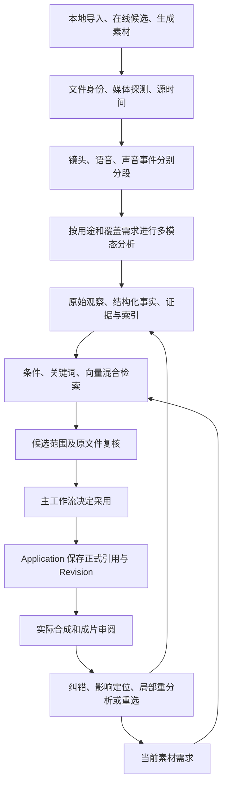

# VideoFlowCut 素材理解与多模态检索开发方案

**版本：v1.0｜2026-09-08｜状态：已讨论方案的文档整理，待整体评审，尚未实施**

本文说明视频、音频、图片及证据材料怎样从“文件已导入、可以播放”变成“能找到具体片段、解释选择依据、知道使用限制，并能放进当前视频验证”的素材。主要解决数字人加动效制作中的 B-roll、动效用图、引用证据、原声与在线音效选择，也为人物素材和 Vlog 复用同一套分析基础。

本文承接[完整动效方案](完整开发方案.md)与[音效链路优化开发方案](音效链路优化开发方案.md)。通用分析、源时间、观察、覆盖、检索及失效机制以本文为详细说明；声音来源、段落声音设计、动作同步和混音仍由声音方案负责。本文只更新开发文档，不表示已经接通模型、建立索引或完成视频分析，也不授权修改源码、配置、运行时 Skills、模型服务或正式视频项目。

## 0. 结论、范围与阅读顺序

建议把素材理解建设为公共基础，以在线音效作为第一个完整业务应用。不是每个业务各建一个模型入口和索引，也不要求先把所有历史素材深度分析完，才能开始声音开发。

平台需要交付的核心结果是**带来源、范围、证据和使用条件的候选片段**。整条文件的总结、网站标签、一次向量相似度和播放控件都只能提供部分线索。最终能否用于当前段落，还要结合需求、原文件和真实合成判断。

“给短窗口补上下文”属于素材理解的一部分，也有助于检索，但它只解决信息不完整的问题；身份与时间、分段、覆盖、观察存储、检索、用途复核、采用和纠错都接通后，才形成完整链路。

推荐先读第 1–3 章了解现状与架构；第 4–9 章查看模型、分段、理解和检索细节；第 10–13 章查看数据、任务与开发落点；第 14–16 章查看声音依赖、实施批次与验收。第 17 章给出数字人视频的假设示例。

## 1. 现有架构中已经有什么、缺少什么

以下是 2026-09-08 对工作区源码的核对结论，文件链接用于定位实现。源码存在不等于已安装 Runtime/MCP 已发布相应能力，后续调用必须读取对应发布版本的实时 Schema。本轮没有重新运行真实素材质量评测。

| 环节 | 当前实现 | 需要补齐的部分 |
|---|---|---|
| 导入与技术分析 | [Job Worker](../../apps/job-worker/src/index.ts) 的 `runMediaAnalysis` 探测媒体或 PDF、生成缩略图；[Application](../../packages/edit-application/src/index.ts) 的 `applyMediaAnalysis` 更新 metadata 与 ready | 技术可播放不等于已有语义；增加独立分析覆盖和检索状态 |
| 源素材审阅 | [source-review](../../apps/server/src/source-review.ts) 提供原媒体、代理、接触表、指定范围的声音辅助、转写、镜头和使用位置；缓存已有哈希、范围及派生参数 | 目前主要为审阅证据，不是持久化的多模态事实及检索系统 |
| 长视频范围 | `candidateRanges` 优先返回已有镜头，最多 40 条；无镜头时按 15 秒生成最多 12 段建议 | 默认建议可能只覆盖前 180 秒，手动仍可请求后续范围；需要全时长目录、分页与覆盖说明 |
| 采样与原声 | source-review 的 overview、range、dense 有不同帧数/时长上限；overview 无指定范围时只报告音轨存在 | 有限抽帧和音轨存在不能证明已观察完整动作或实际听到某种声音 |
| 镜头与 Vlog | [vlog-analysis](../../apps/job-worker/src/vlog-analysis.ts) 使用 FFmpeg 场景变化检测，返回技术镜头、音轨存在和固定初始技术分 | 将镜头检测抽成公共能力，另补动作、事件与现场声理解；检测分不能当语义质量分 |
| 语音 | [speech-services](../../packages/speech-services/src/index.ts) 已有 FunASR 全文转写与真实源字幕对齐服务；source-review 的普通候选句没有可靠时间 | 复用真实对齐，抽出不依赖先创建 TimelineItem 的源范围服务；全文、时间证据和创作语义分开 |
| 素材对象与浏览 | [Contracts](../../packages/contracts/src/index.ts) 的 Asset 有哈希、角色、来源、标签、metadata；[MCP](../../apps/server/src/mcp.ts) 的 `browse_assets` 主要按 kind 浏览 | 缺少统一观察、片段语义索引及面向具体需求的匹配结果；不能靠 tags 承载整套分析 |
| 在线候选选择 | [Application](../../packages/edit-application/src/index.ts) 的 `candidateFilterReasons` 检查类型、来源、整条时长与权利等 | 整条时长够长不代表存在满足条件的连续可用范围；网站描述需要与实际媒体观察分开 |
| 搜索与存储 | `recordAssetSearch` 当前将搜索意图与候选写入 Revision；[SQLite Repository](../../packages/edit-application/src/persistence/sqlite-project-repository.ts) 保存完整 snapshot JSON | 分析窗口、观察、向量和反复搜索迁入操作数据，避免每次查询和模型结果膨胀创作快照 |
| Web 与质量 | [SourceReviewPanel](../../apps/web/src/SourceReviewPanel.tsx) 已有播放器、代理、帧、声音辅助及已用位置 | 增加片段检索、覆盖、声音限制、观察纠错与采用依据；保留真实合成审阅 |

本次核对未发现 `packages/`、`apps/` 中已经实现通用 MiniCPM/Qwen 素材语义调用或向量/全文混合检索。两模型已在外部部署，表示接口具备接入基础，不表示 VideoCut 已经用它们理解整库素材。

现有[素材审阅阶段方案](../VideoFlowCut_素材审阅Skills增量与阶段1-5漏洞收口方案_最终版.md)中的源范围审阅、只读证据和采用前检查继续复用。本文增加公共分析与检索层，不把历史方案当作当前全部能力清单，也不重写已有主工作流。

## 2. 三层职责与完整调用链

### 2.1 素材事实、用途判断、创作决定分开

| 层次 | 回答的问题 | 保存什么 | 谁消费结果 |
|---|---|---|---|
| 素材事实 | 这个文件的这个范围里看见、听见和读到什么？ | 源身份、直接观察、时间/区域、证据、覆盖与未知项 | 检索、源审阅和各专项 |
| 本次用途判断 | 能否满足这一条需求？需要静音、裁切或补查什么？ | 需求版本、候选范围、满足/违反/未知条件、使用限制 | 当前主要工作流及选材专项 |
| 正式创作决定 | 最后采用哪里，放在何处，怎样与人物、旁白和动效配合？ | Asset、采用范围、声音策略及相应 Scene/Cue/Timeline 关系 | Application、Renderer 与质量系统 |

例如“这段含画外讲解”是素材事实；“本次旁白继续，因此可以静音使用画面”是用途判断；“放在第一个解释段，全屏四秒后返回数字人”是创作决定。后两项不能被写成该素材永久适合所有视频的标签，模型也不能根据观察直接修改 Story 或 Timeline。

### 2.2 公共链路

既有项目素材、在线候选和生成素材共用事实合同。在线音效仍默认在线搜索；公共检索不等于先建设全局本地音效库。未取得实际媒体时只能使用明确标注的来源元数据，不提前生成“已观察”的内容。

## 3. 文件身份与源时间是第一层基础

### 3.1 分清预览、原文件和派生文件

每份观察绑定实际输入的内容哈希、源版本、文件身份、分析的媒体流/音轨及范围。Provider ID 和 URL 用于追踪来源，不能替代文件身份；相同 URL 内容变化后不能继续使用旧观察。

在线 preview 与 original 分别登记。预览可能经过裁切、变速、重剪辑或重新编码；只有存在可靠映射时才能换算范围。预览第 8 秒不自动对应原片第 8 秒，取得原文件后需要核验内容并重新定位拟用范围。

代理、抽取音轨、降采样音频、裁切视频、PDF 页面图都保存派生依据与映射。相同字节可复用分析计算，但来源、许可和本次采用记录仍分别保留，不能因为哈希相同就合并授权结论。

### 3.2 源定位独立于项目帧率

视频和音频的分析范围使用明确的源时间，范围统一为开始包含、结束不包含；可用整数时间单位保存，声学锚点另保留采样率与样本位置。记录原始时间基、起始偏移、实际采样帧时间和解码映射，不从帧序号乘平均 fps 猜测所有时间。

当前部分源范围接口按项目 fps 表示和换算，不能把这些值称为原视频帧号。新分析层使用独立源时间，在交给当前项目时通过边界适配换算；不需要先重写整个 Timeline，但换算和舍入规则必须唯一、可测试。

变帧率视频、视频与音轨起始不一致、旋转信息、音频编码延迟和派生裁切都可能影响定位。保存各流的实际时间依据，才能把听到的攻击点、看到的动作和导出位置对应起来。改变速度或源范围后重新计算使用关系，不能只平移旧值。

图片定位用全图或区域，PDF 用页码及区域，不给它们伪造视频时长。区域坐标必须说明基于原图、旋转后的图像还是页面渲染图，并保存必要的变换映射。

## 4. 外部模型与已有服务怎样分工

### 4.1 只经 HTTP 使用两模型

基础地址由配置提供：同机 `http://127.0.0.1:8188/comfyui-bridge/v1`；跨机器使用实际内网地址，例如 `http://192.168.3.42:8188/comfyui-bridge/v1`。VideoCut 不启动 MiniCPM/Qwen Python 子进程、不读取权重，也不安装模型运行依赖。FFmpeg 等现有媒体工具仍负责探测、解码、派生和技术测量。

| 服务 | 已知能力与接入依据 | 在本方案中的用途与边界 |
|---|---|---|
| MiniCPM-o 4.5 | 工作流 `ee8e9c17-bd16-566f-ad2d-a7ec239bf4b8`；视频 multipart `file_video`；`start_seconds`、`duration_seconds`、`prompt`、`max_new_tokens` | 理解实际画面和原声，输出观察；当前没有可直接调用的纯音频或图片输入字段 |
| Qwen3-Embedding 0.6B | 工作流 `15904667-24ab-5e91-bc56-19ee2ad9eb4f`；`texts_json`、`mode`、`instruction`；CPU、1024 维、L2 归一化 | 编码需求、事实或元数据文字，辅助召回与排序；不直接读取音视频，也不是最终适用性裁判 |
| FunASR 与源字幕对齐 | 复用现有 Speech Services 和外部 Bridge 调用 | 真实语言转写及可获得的时间证据，不用 MiniCPM 概括替代准确字幕 |
| 媒体工具 | 复用 FFmpeg/ffprobe、波形、静音及镜头检测等现有实现 | 技术结构、源定位和声学测量；测量结果与模型语义各自保存 |

用户部署的 MiniCPM 视频窗口为 0.1–30 秒、默认 5 秒，约每秒抽一帧，音轨按真实时间对齐为 16kHz 单声道，输出原始文本。Qwen 的 document 模式编码素材描述，query 模式按实际检索任务添加 instruction。模型初始版本记录为 MiniCPM `073dbbc8c5bc0af2d789e1ce12e7c17a6be746e1`、Qwen `97b0c614be4d77ee51c0cef4e5f07c00f9eb65b3`，服务更新后按实际版本更新缓存依据。

当前约 1fps 无法保证看清短动作、微表情、快速转场或口型同步。需要更密集视觉证据时，先利用源审阅密集帧和真实播放复核；自动高密度模型分析需要外部服务明确支持采样配置或相应输入，再按新 Schema 接入。缩短窗口本身不会自动提高采样率。

纯音频是声音首个闭环的明确外部依赖；图片/页面原生输入是相应用途的后续依赖。它们可扩展现有应用或另建外部工作流，但客户端都只调 HTTP。不能向现有视频 Schema 填入假 `file_audio`、`file_image` 字段，也不以黑屏封装方式冒充已部署的原生能力。

### 4.2 调用与结果管理

复用 [ComfyUIBridgeClient](../../packages/comfyui-bridge-client/src/index.ts)：先 GET 工作流当前 Schema，按实际字段构造请求，再 POST runs，立即持久化返回的 run ID，通过 GET runs/{runId} 查询结果。工作流 ID 可配置，schemaVersion 不硬编码成文档示例值。

VideoCut 的 Job 负责范围、进度、缓存和恢复；推理由外部 ComfyUI 队列执行。用户当前服务逐次加载 MiniCPM，返回后退出推理子进程，具有加载成本和取消延迟；客户端减少重复分析、按当前队列限制调度，不能靠增加并发请求宣称提升 GPU 吞吐。

结构解析保留原始响应；有限格式修复只能修复表达结构，不能补造声音、动作或时间事实。没有足够证据的字段返回未知。模型自报 confidence 只作附加信息，不替代输入覆盖和验证方式。

## 5. 分段与分析深度

### 5.1 三种边界分别计算

| 边界 | 解决什么问题 | 不能承担什么 |
|---|---|---|
| 视觉镜头 Shot | 镜头切换、连续构图及画面范围 | 不自动等于完整事件或一个完整思想 |
| 语音范围 Speech | 真实语言、停顿、句子与上下文 | 不用标点或字数估计伪造精确时间 |
| 声音事件 Audio Event | 环境、动作、音乐、人声及变化范围 | 不强迫与每个视觉镜头同起同止 |

同一个动作可能跨镜头，旁白可以贯穿多镜头，音乐和声音桥也可能跨场景。分析单元依据目的组合这些边界，保存关联及上下文，不能把所有媒体统一切成五秒块再当成天然语义单元。

Vlog 的镜头检测可下沉到公共模块；VlogEvent、ShotSelect 等仍是主工作流的事件解释和创作选择。通用分析不预先决定因果、叙事位置和最终剪辑点。

### 5.2 发现、索引、复核三个深度

| 深度 | 默认工作 | 可交付结论 | 触发方式 |
|---|---|---|---|
| 发现 | 技术探测、全时长结构目录、低密度画面线索和声音分布 | 哪些范围值得进一步查看，哪些还未分析 | 导入后的轻量处理或显式范围扫描 |
| 索引 | 对选定覆盖范围分析画面、语言及声音，整理可检索事实 | 对已覆盖范围返回有依据的片段与关键词 | 当前任务相关素材；用户明确要求的批量索引 |
| 复核 | 对拟用范围补前后文、密集视觉证据、原声与实际使用检查 | 这个范围在本次需求下是否成立，还有什么限制 | 准备推荐、取得原文件或正式采用前 |

“发现”可有全时长目录，但不宣称完整理解每一秒。导入不默认阻塞在整库深度模型分析；可以先完成技术与轻量结构，在当前需求明确后继续相应范围。用户要求整条或整批素材索引时，建立覆盖全部时长的可恢复任务，并明确进度、失败窗口和剩余范围。

### 5.3 长素材、上下文与覆盖

全时长目录支持分页和任意范围定位，不以 UI 首屏显示条数作为检索边界。镜头检测可先列出技术范围；过长镜头再按外部单窗上限切分析窗口，窗口可重叠，结果按源位置归并，避免重复命中。

每个分析任务记录目标范围、实际覆盖、采样密度、可用模态、窗口状态及版本。音轨不存在、解码失败、没有请求音频分析、分析过但未知必须区分。未覆盖范围只能标未分析，不能推导为不存在某个人、动作或声音。

短窗口带上与任务有关的前因后果、相邻语句或事件；明确当前输入直接观察到的内容与由上下文提供的信息。前文在讲海浪，不等于当前窗实际听到海浪；文本中“不要开门”的否定不能在归并时丢失。

召回动作时保存完整动作范围、稳定可用范围及进入/退出余量。查询要求连续时长时按实际可用范围判断；不能用整条文件长度或多个不相连片段的长度相加代替。

## 6. 多模态观察具体保存什么

### 6.1 按事实来源分开记录

| 事实类别 | 需要记录的内容 | 典型误判与约束 |
|---|---|---|
| 画面 | 主体、动作、环境、景别、镜头运动、方向、构图、遮挡、可见文字，及各自范围/区域 | 画面中的标志不自动证明具体产品型号；抽到一帧不证明持续存在 |
| 语言 | 实际转写、可用时间精度、否定与修正、重录线索、上下文 | 旁白说到某物，不等于该物出现在画面或实际发声 |
| 非语言声音 | 环境、动作、音乐、人声混入、变化、攻击/尾音性质和可独立使用范围 | 声音分离或“干净无人声版本”不是模型描述即可生成的能力 |
| 声画关系 | 可观察的动作与声音关系、画外讲述、声音延续及桥接 | 模型估计的同步时间不是精确瞬态测量 |
| 可用条件 | 连续稳定范围、必要余量、裁切限制、遮挡、音质及原声限制 | 素材事实保留限制，是否允许静音或遮挡由具体需求决定 |
| 证据材料 | 可见原文、来源定位、日期或页码、区域、限定条件 | 新闻截图或模型描述本身不证明陈述真实，必须绑定来源核验 |

原始听觉、可见字幕/OCR、来源元数据、用户说明和模型推断分别标明来源。它们冲突时保留差异，按具体任务复核，不强行合成一个更流畅却没有依据的总结。

16kHz 单声道可用于语义理解，立体声、底噪、精细瞬态和最终音质必须检查实际采用文件。先用波形或瞬态检测定位候选，再复核所需锚点；不能把最大能量峰统一视为动作落定。

### 6.2 源转写与创作语义的关系

从现有 FunASR 和 SourceCaptionAlignmentService 抽出可对源素材范围调用的转写/对齐能力，输入源身份、音轨和范围，输出原始转写及服务实际提供的时间证据。分析一段原视频不应先被迫把它放进 Timeline。

普通全文、带真实时间的语音段、token 对齐与最终 SpeechTiming 分别表示。若只取得全文，就只能全文检索和粗定位后复核，不能按字数分配时间；服务未确认的说话人也不能编造。生成旁白的 segment_exact 仍基于实际生成段时长，不被素材摘要替换。

SemanticUnit 的语义取舍、重录判断和上下文保护继续由相应主工作流与 semantic-continuity 负责。转写纠错更新语言证据及依赖，不能自动把模型摘要提升为新的剪辑决定。

## 7. 公共观察合同与状态

下列名称是拟开发领域合同，不是当前可调用的 MCP 字段。实现时可合并合理的数据结构，但事实与决定的边界必须保留。

| 合同 | 最少必要内容 | 生命周期 |
|---|---|---|
| 源身份与定位 | 哈希、源版本、预览/原文件/派生身份、流、时间或区域、派生映射 | 文件替换或映射变化产生新版本 |
| 分段与覆盖记录 | 目标范围、镜头/语音/声音边界、窗口、实际覆盖、密度、未完成原因 | 可局部重跑，不因部分成功宣称整片覆盖 |
| MediaObservation | 源定位、事实类别、结构化内容、依据、未知项、原始响应、模型/提示词/预处理版本 | 修订可追溯；有效版本供检索 |
| 用途评估 | 需求及版本、候选范围、条件逐项结果、限制、待复核项、所用观察版本 | 随需求和相关依据失效，不是永久素材标签 |
| 正式采用引用 | 原文件身份、源范围、用途评估/观察版本、使用策略及创作对象引用 | 写入创作 Revision，随相关改稿复核 |

声音方案此前的 `AudioObservation` 统一为 `MediaObservation` 的音频部分或类型化输出，保留起势、攻击、尾音等声音专门字段。HTTP 调用、文件身份、原文、覆盖、纠错和向量派生只有一套公共实现，不再维护一个独立声音事实库。

观察的关键结论至少带依据类型、实际范围、精度和未知原因。模型说“没有人声”时还要知道分析覆盖了哪里、依据是否足以支持该排除条件；缺少证据不等于证据证明不存在。技术测量、模型观察和真实播放审阅也不能互相覆盖。

状态分为四个独立维度：文件技术就绪、语义分析覆盖、索引版本、对本次用途是否满足。可播放且已人工审阅的素材不会因为模型暂时失败而变成损坏；旧技术 ready 也不会自动升级为“全片已理解、可直接采用”。

纠错保留模型原文和旧观察，创建新的有效修订，注明用户纠正、实际审阅或模型重分析等来源。向量由当前有效观察派生，旧采用仍能追溯当时依据；纠错影响了已用范围时通知相应对象复核。

## 8. 从素材需求到片段检索

### 8.1 先拆需求，再组合召回

素材需求保留自然语言，同时提取有用条件：用途、媒体类型、画面主体/动作、真实声音、需匹配的语言或原文、连续时长、画幅/裁切、声音策略、来源和权利、排除项。条件标明必须满足还是偏好，以及允许怎样处理。

“有六秒笔记本接口特写，旁白继续，允许静音”和“找六秒能直接用的接口操作原声”是两种需求。前者允许带讲解原声的视频在静音后用画面，后者必须检查所需原声，不能把同一条人声排除规则套给两者。

| 检索方式 | 主要职责 | 使用限制 |
|---|---|---|
| 条件过滤 | 类型、来源、权利、真实范围、明确排除项及取得能力 | 未知条件不能伪装成通过；高相似度不能抵消违反条件 |
| 关键词/全文 | 精确名词、数字、型号、原文和显式词项 | 中文需要分词或 n-gram 等实际支持，不能假定英文默认分词足够 |
| Qwen 向量 | 同义表达、动作和材质等语义召回/排序 | 不擅自证明型号、否定条件、许可或精确时长 |
| 用途复核 | 对少量候选结合范围、上下文、实际原声重新判断 | 没有足够证据时追加分析或返回不足，不用评分补事实 |

视觉、声音和转写保留各自的可检索文本与向量视图；需要时增加带来源的上下文视图，不能把所有信息揉成一段摘要。用户找“海边画面”时，旁白提到海浪但画面是办公室的片段不应被视为画面匹配。

元数据可先参与在线候选排序，取得实际媒体后由观察提供更强依据。合并词法与向量召回时保留各自命中原因，并按源身份和重叠范围去重；具体权重用真实需求验证，不把未经标定的不同分数直接解释成采用概率。

### 8.2 连续可用范围必须真实成立

每个命中返回源身份、命中范围、建议可用范围、证据、匹配/违反/未知条件、使用限制及补查建议。用户检索的是可定位片段，而非一堆整条文件标题。

“连续八秒、海边画面、没有人声”要求三项在同一连续范围交集内成立。不能把前四秒的海边和后四秒的安静室内拼成一个八秒命中；也不能用未分析的人声状态当成已满足。

“没有人声”需要拟用范围的足够音频证据及采用前检查。“未检出”只表示检测结果，不等于绝对保证；无法确认时标证据不足。用户允许静音，则改变的是本次声音策略，不是原素材含人声的事实。

### 8.3 在线来源、项目素材与缓存

声音继续按在线优先方案检索有限元数据，筛出少量实际试听/分析候选，采用的原文件才进入受管项目。视觉素材也复用现有受控 acquisition，搜索范围可以是项目已有、指定在线来源或获准材料，不通过本方案增加全网爬取。

取得原文件后重新核对内容、连续范围、许可和源时间；预览分析只能支持候选筛选。若映射不明，必须重新定位，不能把预览的确认状态直接复制给原文件。

小规模先在现有 SQLite 和后台计算中实现词法与有限向量排序；按真实索引数量和延迟测量后再决定是否需要专门向量索引。建立公共合同不意味着现在就部署向量数据库、下载全站或建设完整本地音效库。

## 9. 不同用途怎样复核并交回创作

| 用途 | 除语义相似外还要核对 | 交接内容 |
|---|---|---|
| 数字人 B-roll / Cutaway | 是否支撑当前旁白、稳定时长、裁切、原声与旁白关系、返回余量 | 具体范围、声音策略、画面限制；全屏/PiP 和放置由主流程决定 |
| 人物源视频 | 可见表演、视线、构图、动作完整性、声音所有权、进入退出余量 | 可观察范围和限制；抽帧不足时不推断微表情或口型准确 |
| Vlog | 事件前因后果、动作和反应、现场声连续性 | 可供选择的事件证据；因果解释及 ShotSelect 归主工作流 |
| 截图、文档与证据 | 原文、来源、页码/区域、日期、限定条件和可读性 | 可核对的证据范围；视觉相似不等于事实可信 |
| 动效用图 | 主体完整性、分辨率、可裁切范围、透明/遮挡情况与实际画幅 | 图片用途限制及源绑定，不把低清预览当高分辨率原图 |
| 音效、环境声、音乐 | 功能、可用范围、攻击/尾音、人声混入、循环与衔接、对白竞争 | 原文件及声音部分观察；段落 SoundPlan、事件绑定和混音归声音链路 |

用途评估采用“可直接用、按明确条件处理后可用、证据不足、不符合”四类可解释结果，而非一个模糊总分。所谓“可直接用”只表示对这条素材需求满足，不表示放入成片后免除审阅。

主工作流选择具体原文件和范围，保存正式采用依据，再交 Application 创建或更新相应对象。选择的范围、裁切或声音策略变化时重新评估受影响条件；素材分析模块不自行决定剪辑结构或修改时间线。

## 10. 存储、异步任务与并发

### 10.1 操作数据与创作数据分开

保留模块化单体、SQLite 与现有 Job Worker。分段目录、分析请求、外部 run、观察、词法/向量索引、检索会话和有限缓存放在独立操作记录中，不反复复制进 ProjectSnapshot。仍由平台统一管理身份和关联，不另建第二个项目状态服务。

正式 AssetRequest、采用决定、Asset、Scene、Cue 与 Timeline 变化继续进入创作 Revision。正式采用保存必要候选快照、来源与使用条件、原文件身份、观察版本和范围引用；重开旧 Revision 时能读回当时依据。模型升级或重建索引不会自动改成片。

不能清理仍被正式采用引用的文件和必要分析依据。未采用的在线预览、临时比较产物和可重建索引按来源条款、配额和有效期清理；操作数据转正式采用时明确提升保留范围，避免项目只剩一个已过期缓存 ID。

### 10.2 分析任务显式化

`inspect_asset` 保留轻量、只读的证据入口，不在一次查看中隐式启动几十分钟素材的完整推理。拟新增分析入口返回 Job；Job 记录源、目标范围、分析深度、模态、版本、窗口进度和错误，可读回已有有效结果及未覆盖范围。

以源哈希、流、范围、分析配置、预处理、模型与提示词版本去重；相同请求复用已有有效结果或关联进行中任务。重试只处理失败/缺失窗口。窗口完成时保存原始结果，全部必需窗口完成后才能报告请求完成，部分成功保持明确状态。

Qwen 向量的缓存键还包含有效文本/观察修订、模型、document/query 模式及 instruction；不同模型版本的向量不混用。长文本按可解释的片段拆分，不超过当前单条 8192 token 限制，不静默截掉关键否定或后半段内容。

分析完成只更新操作记录。结果若基于旧源版本则不能覆盖新源结果；采用时验证当前 base_revision_id、需求版本和源身份，在 Application 事务中关联正式对象。重复采用有明确幂等依据，不因重试产生重复 Asset 或 Cue。

## 11. 纠错和依赖失效

| 发生变化 | 可以保留 | 需要失效、重算或复核 |
|---|---|---|
| 源文件字节、音轨或派生映射变化 | 历史观察与来源记录 | 相关源范围观察、索引、定位和采用依据；新文件重新分析 |
| 转写/OCR/声音描述纠错 | 未受影响的画面、技术测量和原文件 | 对应文字索引、向量、推荐；受错误影响的已用范围待复核 |
| 模型、提示词或采样策略升级 | 旧版本可追溯，已用作品保持原样 | 按需生成新分析/索引，不自动替换正式选择 |
| 需求改为另一个动作、时长或原声条件 | 对同一源的有效事实观察 | 重新匹配、过滤和用途评估 |
| Timeline 整体移动 | 源观察及索引 | 使用处的声画上下文和相关合成审阅 |
| 源裁切、画幅或声音策略改变 | 仍有效的底层事实 | 本次连续时长、裁切、原声与同步关系 |
| 在线原文件与预览内容不一致 | 预览作为历史候选线索 | 原文件重新定位、观察和采用判断 |

影响定位到具体范围、事实类别和使用对象，不把每次文字纠错变成全库重跑。也不能只刷新向量而让受错误影响的已采用片段继续显示旧通过结论。

## 12. 开发模块、工具与工作台

### 12.1 代码落点

| 模块 | 具体开发工作 |
|---|---|
| 拟新增 `packages/media-intelligence/` | 公共源身份/定位、分段与覆盖、分析配置、MediaObservation 解析校验、用途评估和检索编排；它是共享模块，不是独立推理服务 |
| [Job Worker](../../apps/job-worker/src/index.ts)、[vlog-analysis](../../apps/job-worker/src/vlog-analysis.ts) | 公共技术镜头检测、分窗调度、外部推理、观察/索引持久化、去重、进度与恢复；Vlog 创作对象留在原工作流 |
| [source-review](../../apps/server/src/source-review.ts) | 复用代理、帧、音轨和缓存，补全时长范围目录、覆盖、观察及片段定位；重任务交给 Job |
| [speech-services](../../packages/speech-services/src/index.ts)、[Bridge Client](../../packages/comfyui-bridge-client/src/index.ts) | 提取可复用的源范围转写/对齐，保留真实精度；接外部模型动态 Schema 和恢复，不添加模型执行器 |
| [asset-acquisition](../../packages/asset-acquisition/src/index.ts) | 区分候选预览/原文件与定位映射，返回实际来源能力，接公共观察和用途评估 |
| [Contracts](../../packages/contracts/src/index.ts)、[Application](../../packages/edit-application/src/index.ts)、[Repository](../../packages/edit-application/src/persistence/sqlite-project-repository.ts) | 公共合同、操作数据表及迁移、正式采用引用与并发验证、旧数据缺省、依赖失效 |
| [MCP](../../apps/server/src/mcp.ts) 与对应 Runtime API | 贯通异步分析、片段检索、复核、纠错和采用；标明能力状态，避免字段只出现在工具描述 |
| [SourceReviewPanel](../../apps/web/src/SourceReviewPanel.tsx) 与素材/声音候选工作面 | 片段命中、原声与上下文播放、覆盖进度、条件和限制、观察纠错、已用位置；Web 和 MCP 共用规则 |
| [质量系统](../../packages/quality-system/src/editorial-review.ts)及相关预览链 | 检查采用依据是否仍有效、范围与原文件是否一致，并关联真实合成审阅；不以模型成功代替成片通过 |

### 12.2 对外保持少量完整入口

保留 `inspect_asset`，拟增加“提交素材分析”“检索素材片段”“按需求复核候选”“纠正素材观察”等入口，名称与参数在开发时统一。分析和复核等耗时操作返回 Job，检索返回范围及依据，纠错说明影响；不暴露几十个要求 Agent 手动串联的窗口/向量微工具。

声音方案中的 `analyze_audio_candidate` 改由公共分析入口的音频用途或薄适配完成，不单独建立观察存储、队列或模型客户端。正式采用继续通过应用层受管入库及编排能力，不能把检索命中直接视为正式 Asset。

工作台以用户任务呈现“查到了哪一段、依据是什么、原声能否保留、还缺什么、在哪里已经用过”。播放时能定位命中和上下文；未覆盖或仍在分析可以看见。用户纠正的是具体观察，界面不要求填写模型提示词或理解向量参数。

### 12.3 Skills 的后续联动

公共审阅方法继续集中在现有 `.agents/skills/_shared/SOURCE_REVIEW_METHOD.md`，补充模态来源、覆盖、检索、采用前复核和纠错。visual-asset-sourcing、拟议声音选材专项、transcription、人物/Vlog/解释片主工作流分别消费相关证据，不新增包办创作的“素材理解导演”。

素材导入说明区分技术就绪和语义状态；声音专项保留音色与同步判断；证据专项检查真实来源；质量专项检查采用依据和合成。开发时同步清理 Skill 中与真实 Provider 能力冲突的旧描述，例如前文已涉及 Mixkit、后文仍称只有 Pexels 的情况。

后续代码、工具合同、Skills、配置及路由/交接测试在同一 PR 中更新。本轮不修改运行时 Skills，不把本文变成 `docs/` 中另一套可执行操作手册。

## 13. 失败处理和已知代价

| 情况 | 应有处理 |
|---|---|
| 缺音轨、某模态不可解码或接口未支持 | 返回实际可用模态和缺口；不能写成未出现该声音/对象 |
| 外部模型不可用、输出非法或关键事实未知 | 保留原文与错误，允许已有技术审阅继续；相关自动推荐标证据不足，不伪造替代模型结果 |
| 明确 Schema 409 | 按 Bridge 语义刷新一次 Schema 并有限重试，能力缺失则明确返回 |
| 提交结果未知、轮询超时、服务重启或 run 丢失 | 持久化提交意图/外部 ID 并对账；不盲目重复创建，不把停止轮询当取消成功 |
| 长素材部分窗口失败 | 保存成功窗口、实际覆盖与失败原因，恢复时只补缺失范围 |
| 原文件替换或预览映射不明 | 阻止沿用旧定位，重新核验目标范围；保留历史结果便于追踪 |
| 检索结果违反条件或仍未知 | 说明拒绝/补查原因，有界扩大检索或调整请求；不强行挑最高分作为成功 |
| 采用时需求或 Revision 已过期 | 重新读取并评估影响，不能把旧推荐自动写入新计划 |
| 索引落后于观察纠错 | 过滤过期派生结果并报告待更新，恢复一致版本后再作为自动推荐依据 |

代价主要是外部模型加载与队列延迟、分析证据和索引的存储、在线原文件的网络成本，以及复杂条件仍需真实复核。按需分析、版本缓存和局部失效控制这些成本，但不能同时承诺全量深度理解、即时返回和零存储。

本方案不新增常驻推理服务、全网爬虫、独立导演或默认大型向量数据库。身份、真实时间、观察、覆盖和采用依据仍是完整闭环必需项，不能为减少改动而退化成只增加音频上传或在 tags 中塞模型总结。

## 14. 对音效开发的影响与实施依赖

**素材理解需要优化，但不要求先完成全部素材类型，音效才能开工。** 音效与通用理解的共享部分先统一合同并实现，以在线声音验证真实路径；随后把相同基础扩展到长视频、图片和证据。

| 工作 | 与通用理解的关系 | 推进条件 |
|---|---|---|
| 在线 Provider、来源状态、下载与许可 | 复用 acquisition，可独立推进 | 候选身份、预览/原文件与公共合同对齐 |
| SoundPlan、旁白表演、MotionEventMap | 属于声音和动效的创作编排 | 可以独立开发；正式绑定依赖真实文件与时序 |
| 音乐结构、角色混音、持续声和对比试听 | 属于声音应用及渲染 | 可以在明确样段与合法文件上推进，不等整库索引 |
| 模型 HTTP、范围、观察、缓存、任务、检索 | 所有用途的公共基础 | 第一阶段统一实现，禁止声音专用重复建库 |
| 纯音频输入 | 外部模型服务依赖 | 声音真实分析闭环必须落实并按实时 Schema 验证 |
| 长视频全量检索、图片/证据理解 | 后续共享基础上的用途扩展 | 不作为上线声音全部专业能力的前置，但分别验收 |

因此，声音方案的“在线获取与真实分析”第一批要包含公共身份、观察、HTTP、任务和操作存储的必要实现；后续声音自动选材复用公共检索。声音的同步、混音与最终听审仍按声音方案完整交付，不能因公共模块已完成就省略。

## 15. 四个实施阶段

| 阶段 | 必须交付 | 阶段结束时可验证的结果 |
|---|---|---|
| ① 公共基础与在线声音闭环 | 源身份/时间、MediaObservation、操作存储、HTTP、任务/缓存、必要检索与采用；落实外部纯音频输入，连接在线候选及原文件 | 一条真实声音需求能从在线查询走到实际分析、明确范围、采用及上下文试听；预览/原文件不混淆 |
| ② 视频片段理解与检索 | 公共镜头、源转写/对齐、声音事件、分窗上下文、长视频目录/覆盖、模态分开的检索和用途复核 | 数字人 B-roll 需求能从长素材后半段找到连续可用范围，并给出裁切和原声处理依据 |
| ③ 图片、证据与不同用途 | 落实外部图片输入等能力；区域/页面定位、动效用图、证据来源与人物/Vlog用途复核 | 图片适用性和证据可核对；人物与事件观察交回对应主流程，不能冒充自动叙事决定 |
| ④ 纠错、成片与一致发布收口 | 前三阶段已具备的纠错/失效、幂等和并发做跨链路回归；完善工作台，完成真实合成及发布一致验证 | 纠错影响可定位、旧版本可追溯、正式状态受保护，Runtime/MCP/Skills 的能力一致 |

纠错、时间验证和幂等属于各阶段基础验收，不能全部推迟到第四阶段才补。阶段四负责完整跨链路收口。声音方案的四批按第 14 章依赖穿插进行，不机械地把两套批次排成八个串行大阶段。

旧 Asset 的技术状态、标签和转写继续可读；默认语义覆盖为未分析，索引按需建立，不强制重分析全部历史项目。正式采用引入新依据时走明确修订，历史审阅缺少新字段不能被自动补成新流程已通过。

开发与验收沿用独立候选 Runtime、独立端口和工作区，不与生产数据库/Worker 队列混用。代码、MCP、Skills 和配置联合验证后核对 releaseId、实时 Schema、API 及相关 Worker；安装态验证前不能称功能已发布。

## 16. 如何证明理解和检索真的变好

### 16.1 确定性合同检查

- 源定位：变帧率、音轨偏移、裁切/改速、帧率转换、图片旋转及页码区域映射，采用范围能回到真实内容。
- 覆盖：长视频后半段可检索、窗口重叠不重复累计、部分失败不误报全片完成；1fps 证据不伪装成短动作确认。
- 条件：连续时长按同一范围交集判断；含人声、无证据、允许静音分别处理，向量高分不能覆盖硬条件。
- 任务：动态 Schema、外部 run 恢复、未知提交不重复、同请求去重、旧源结果不覆盖新源、取消状态真实。
- 数据：分析/搜索不制造创作 Revision，正式采用验证当前版本；语义失败不把可播放素材标成损坏。
- 纠错：有效观察、词法和向量版本一致，受影响使用对象待复核；缓存清理保留正式引用，历史依据可读。

### 16.2 真实语义与使用效果评估

建立当前项目的代表需求集：数字人 B-roll、动效用图、证据定位、人物/Vlog范围、音效及音乐。使用有权限的真实素材，人工标注满足范围、明显不满足范围、未知情况和允许处理条件；尤其覆盖长素材后半段、中文专名、否定、画面/旁白冲突和短动作。

对比现有“元数据/抽帧审阅”流程与新流程，记录找到可用范围的比例、前几个候选的采用价值、定位误差、误用/漏检、补查次数、耗时和成本。声音检索沿用[声音方案第 14 章](音效链路优化开发方案.md#14-开发批次与验收标准)的需求集与候选标准，不另造一套互相冲突的声音成绩。

用同一批人工确认的需求和范围做前后对比，检索排序与最终采用分别评估；模型自己给高分、向量相似或 HTTP 200 都不算质量成绩。新链路必须保存真实原声与画面证据，并把采用结果放入数字人、旁白、字幕和动效上下文复核。

用户提供的 11 条视频可作为经授权的分析与评估输入，需按真实片段标注和调用结果记录覆盖；本文不新增或冒充对这 11 条视频的听审结论，也不将参考视频中的音效提取后视为可自由复用素材。

## 17. 数字人 B-roll 的完整假设示例

以下仅用于说明拟开发行为，不是本轮实测命中或已制作片段。

需求为“六秒笔记本接口特写，用来说明接口布局，竖屏，主旁白继续，允许素材静音，不要求证明某个具体型号”。来源是一段已取得适用授权的较长产品视频。

1. 技术分析登记原文件哈希、视频/音轨与源时间，全时长目录显示四分钟之后也有可查看镜头。
2. 相关范围索引发现源 `04:12–04:22` 有接口特写，稳定可用范围为 `04:13–04:21`，实际原声含讲解；这些是假设的独立事实，分别保存证据。
3. 画面检索命中接口布局，语言索引中的产品介绍只作为语言信息；不因旁白提到某型号就证明画面是该型号。
4. 用途复核从稳定范围内选择六秒，检查接口是否一直完整可见、竖屏裁切后是否被截断，并检查进入/退出余量。旁白继续且允许静音，所以含讲解不必直接淘汰，但采用必须明确静音。
5. 返回具体原文件、建议六秒范围、静音条件、裁切限制和“只能说明可见布局，不能证明具体型号”的依据边界。另一个总长二十秒、只有三秒稳定特写的文件不能因总时长够长而通过。
6. 主工作流决定是否全屏切入、何时返回数字人；Application 保存源范围、观察版本、声音与裁切策略，再进入真实合成。
7. 若竖屏构图挡住关键接口，返回范围选择或换素材；若最终需求改成“必须保留插入接口的清晰原声”，复用现有事实重新评估，不把之前的静音可用结论沿用。

声音例子采用相同公共链路：落定音的标题只作搜索线索，实际音频观察负责音色与人声情况，原文件测量负责攻击位置，SoundPlan/MotionEventMap 负责本片声音意义与同步。完整声画计算仍见声音方案的容量流示例。

## 18. 与其它开发文档的关系

| 文档 | 本文增加或调整的关系 |
|---|---|
| [阅读包 README](README.md) | 增加公共素材理解入口，建议先理解公共基础，再读声音与动效专业方案 |
| [音效链路优化开发方案](音效链路优化开发方案.md) | 共用源时间、MediaObservation、HTTP、覆盖、检索、任务和操作存储；保留在线优先、声音设计、事件同步与混音细节 |
| [完整开发方案](完整开发方案.md) | 补充视觉素材、证据和声音的共同采用依据；不重写原创构思、美术、连续运动和案例 |
| [主架构第 30 章](../ai_video_platform_architecture_development_plan.md#30-通用素材理解与多模态检索待评审优化方案) | 登记公共模块职责、旧规则替代、与声音的依赖和实施验收 |

本轮完成的是方案文档及关联对齐。外部输入扩展、通用分析与索引、界面及实际效果均保持待开发/待验证状态；具体开发范围由用户整体阅读后另行确定。
