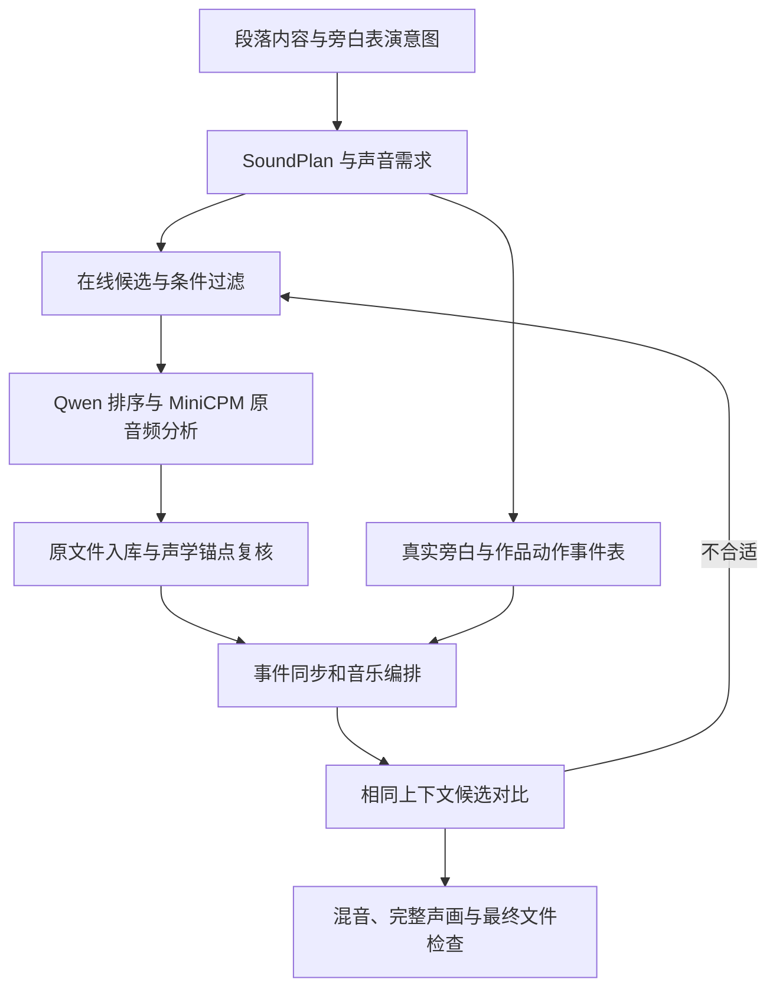

# VideoFlowCut 音效链路优化开发方案

**版本：v1.1 公共素材理解联动版｜2026-09-08｜状态：待整体评审的开发方案，尚未实施**

本文将旁白、动作音效、环境声和音乐组织成一条完整制作链路，承接[连续原创动效完整开发方案](完整开发方案.md)。主要适用于数字人加动效、人物口播加实拍素材、旁白驱动的视觉解释片。

通用素材事实、源时间、模型 HTTP、分段覆盖、观察、检索和采用依据统一依赖[素材理解与多模态检索开发方案](素材理解与多模态检索开发方案.md)。在线声音是该公共基础的第一个完整应用；本文继续负责声音来源、旁白表演、动作发声、音乐和混音，不另建音效专用的分析存储或模型服务。

用户本次授权的是把已讨论方案写入 docs，并同步相关开发文档，供整体阅读和继续调整；不包含功能开发、运行时 Skill 修改、模型服务改造、素材下载、视频项目修改或部署。本文中的新增对象、工具名称和参数均为拟开发合同，不能直接提交给当前 MCP。

## 0. 本次确定的方向与阅读顺序

本期默认从在线来源查找音效和音乐，不要求用户先准备本地音效库，不先下载或索引整个网站。同一项目已经采用的声音可以复用；全局本地音效库检索不作为默认步骤，后续有足够素材时再接入。

选中的原文件仍下载到受管项目目录，用于精确同步、稳定预览、离线编辑和可复现导出。在线目录、有限试听缓存和项目原文件是三种不同用途，不能把原文件落地误解成必须先建本地素材库。

MiniCPM-o 与 Qwen3-Embedding 均由 VideoCut 通过用户已部署的外部 ComfyUI Bridge HTTP 接口调用。VideoCut 不启动这两个模型的 Python 子进程，不安装模型依赖，也不读取权重目录。外部服务内部使用子进程属于其部署实现，不改变客户端边界。

建议先读第 3–5 章理解制作与在线选材，再读第 6–10 章理解接口、数据和同步，最后读第 12–16 章查看代码落点、失败处理、验收与完整示例。与旧文档的调整关系集中在第 17 章。

综合评审时可先读公共素材方案第 2–10 章，再回到本文的声音专业链路。公共合同先统一并以音效跑通，不要求视频、图片和全部历史素材都完成深度索引后才开发声音；具体依赖见[公共方案第 14–15 章](素材理解与多模态检索开发方案.md#14-对音效开发的影响与实施依赖)。

## 1. 当前能力与需要补齐的缺口

以下依据 2026-09-08 的源码和已核对工具合同整理。源码存在不等于已安装 Runtime/MCP 已开放全部字段；开发与正式调用仍以对应发布版本的实时 Schema 为准。

| 环节 | 当前已有能力 | 本次拟开发内容 |
|---|---|---|
| 在线音效 | 来源目录；Mixkit 六个分类的候选查询、原文件获取与来源记录 | 扩大实际分类覆盖；补音乐获取和 Freesound 正式 API；返回真实能力与可用状态 |
| 候选检查 | 候选元数据、音频播放控件、基础媒体探测 | 实际音频语义分析、声学时间候选、结构化比较及上下文试听 |
| 素材需求 | AssetRequest 支持 audio_brief、音频用途和查询提示 | 与段落声音意图关联的结构化声音条件、硬过滤与查询转换 |
| 模型接口 | 通用 ComfyUIBridgeClient 已有动态 Schema、multipart、轮询与失败类型 | 接通外部 MiniCPM/Qwen 工作流；外部服务补纯音频输入能力 |
| 动效声音绑定 | AudioCue 可绑定 effect_event，处理整体平移和版本失效 | 作品权威事件表、点与范围事件、多阶段声音锚点及重新编排 |
| 混音 | 独立 BGM/SFX、基础增益、淡化、音乐循环和 Duck | 按声音角色组织主次、持续声、音量包络、上下文对比与声音依赖复核 |
| 对白处理 | 已有高通、降噪、齿音、响度、峰值处理及候选选择 | 复用现有能力；不把新增声音方案描述成第一次拥有对白处理 |
| 质量检查 | 项目结构、预览和导出检查 | 完整音轨解码、最终混音测量、声音观察证据和真实连续样段验收 |

主要源码依据：[在线音效目录](../../packages/asset-acquisition/src/sound-catalog.ts)、[Mixkit 获取](../../packages/asset-acquisition/src/mixkit.ts)、[MCP](../../apps/server/src/mcp.ts)、[Bridge 客户端](../../packages/comfyui-bridge-client/src/index.ts)、[事件绑定](../../packages/edit-application/src/effect-audio-events.ts)、[混音实现](../../packages/remotion-runtime/src/index.tsx)、[对白处理](../../apps/job-worker/src/dialogue-processing.ts)、[导出检查](../../apps/render-worker/src/exporter.ts)。

## 2. 前期视频研究怎样转成工程要求

研究输入为用户提供的 11 条参考视频，合计约 75 分 23 秒。前期分析采用 63 个原片窗口和 6 个对照，去重覆盖约 314.5 秒；其中第 2 条真人短片连续覆盖约 0–68.5 秒。其余视频为代表窗口分析，不能声称已完整听审全部 75 分钟。

MiniCPM 在这些任务中接收了真实原音轨。模型观察、画面核查、信号测量和本文提出的设计建议需要分别标明，模型分析不能写成 Codex 自身具有原生听觉。原研究素材和临时结果不在本次文档更新中复制入仓库；后续验收需要固化有使用依据的片段、时间范围、哈希和观察原文。

| 样段事实或对照发现 | 工程结论 | 本方案中的落点 |
|---|---|---|
| 第 2 条约 46.1–46.6 秒，“信号中断”色条配短哔声；纯音轨复查及约 1000Hz 信号支持该观察 | 声音可以承担包袱后的反应，不能提前泄露反转 | SoundPlan 保存反应功能和语义先后关系 |
| 第 9 条约 122–136 秒，用喇叭遮住句中词语来演示语境补全 | 有些声音本身是内容，允许有意遮蔽局部语言 | 内容演示角色及明确遮蔽意图，不能统一压低全部 SFX |
| 第 11 条包含专家采访和主持讲述等不同声音来源 | 主声音不能仅按名为 Dialogue 的轨道判断 | 声音角色、声音所有权与主导区间 |
| 静音画面对照中，模型仍可能描述有人声 | 画面与字幕会污染声音判断 | 音效采用纯音频审查；合成审阅分开记录音频与声画观察 |
| 文本检索曾把“无旁白”需求匹配到含旁白记录；“新片/芯片”纠错会改变排名 | 向量相似度不能代替硬条件，描述错误必须可纠正 | 结构化条件过滤、观察修订、受影响向量重编码 |

这些发现支持声音按叙事功能设计，而不是每个转场、字幕或运动元素都配一个音效。关于具体音乐曲名、精确节拍与未覆盖视频范围，本文不补造结论。

## 3. Skill、网站适配器、模型与平台的职责

### 3.1 与 Remotion 在线参考的关系

当前 Remotion 来源链路是“来源目录 → 公开预览观察 → Codex 理解视觉机制 → 自己编写受管作品 → 渲染和合成审阅”。四个网站是参考入口，不是四个网站 Skill，也不意味着能够自动导入它们的所有工程文件。[当前参考采样实现](../../apps/server/src/motion-reference.ts)会静音视频并采集画面，因此不能用它证明已听过参考音效。

音效复用同样的分工：来源发现由代码提供，专业选择由 Skill 指导，取得合法可用文件后进入正式项目。音效额外需要真实音频观察与时间测量，截图型参考工具不能承担选音。

### 3.2 主流程和两个声音职责

| 负责人 | 职责 | 交付 |
|---|---|---|
| Presenter / Explainer 主工作流 | 统筹内容、旁白、人物、视觉和声音；收拢专项结果与影响范围 | 段落任务、声音所有权、制作依赖和整片结论 |
| audio-finishing：前期入口 | 在最终旁白与动效制作前确定声音功能、主次、音乐段落和留白 | SoundPlan，以及对旁白表演和动作的要求 |
| 拟新增 sound-asset-sourcing | 根据声音需求在线检索，比较原声结构、音色、许可和可取得性 | 推荐候选、备选、使用范围、分析证据与拒绝原因 |
| remotion-production | 制作画面，并由实际作品时序交付事件表 | MotionEventMap、作品版本、事件语义及范围 |
| audio-finishing：混音入口 | 在真实旁白与动效中决定最终使用、编排音乐、处理声音与验证 | AudioCue、处理结果、连续声画审阅及未解决问题 |
| Provider / HTTP 客户端 / Worker / Renderer | 执行搜索、取得文件、模型调用、测量、处理和合成 | 可追溯任务、文件、观察与播放结果 |

不新增第二个整片导演。sound-asset-sourcing 推荐原声候选，audio-finishing 对其在成片中的最终使用负责。常规候选自动比较和选择，不要求用户逐条批准；关键位置提供可以实际播放的对比结果。

运行时唯一 Skill 源仍是根目录 .agents/skills/。本轮只在本文说明拟调整内容，不创建可执行 Skill，也不把拟新增 Skill 写成已安装能力。

## 4. 在线来源、覆盖范围与获取策略

### 4.1 首期来源

| 来源 | 开发方案 | 用途与边界 |
|---|---|---|
| Mixkit 音效 | 扩展现有适配器，在实际公开分类内支持生活、机械、科技、交通、自然、人物动作等候选 | 现有 interface、transition、notification、whoosh、click、pop 只是代码接入范围；不虚构任意关键词搜索 API |
| Mixkit 音乐 | 单独实现音乐目录、预览、原文件获取和许可解析 | 音效适配器不自动获得音乐能力；音乐不沿用音效许可结论 |
| Freesound | 新增正式 API 适配器，支持关键词和可用筛选条件、预览及原文件获取 | 搜索需 API 凭据；原文件下载需 OAuth；商用 API 条件落实后才启用对应使用方式 |
| 其他来源 | 保留为人工补充入口，清楚标记不支持自动获取 | 来源目录存在不表示有 Adapter，也不表示该网站全部免费可用 |

Mixkit 音效允许商业及个人项目使用且无需署名，仍须遵守网站访问和素材使用条款。按项目需要获取少量候选，不进行脚本整库下载、镜像或无边界遍历。分类映射可维护，网页结构变化应明确报错，不能猜下载链接或把 HTML 错误页当媒体。

Freesound 的声音逐条检查许可：商业成片默认优先 CC0，允许署名时可纳入 CC BY，排除 CC BY-NC。声音许可和 API 使用条件分别处理；免费声音不等于商业 API 使用必然免费。凭据未配置或条件未满足时，返回未启用状态，不能伪装联网结果。

ZapSplat 的免费计划有署名、格式和限额条件，其标准许可禁止自动访问，不作为无人值守自动 Provider。Pixabay 公开 API 没有已核实的音效接口，不虚构接入。Kenney 等本地包与 Sonniss 大合集不作为本期前置；对限制 AI 使用的来源，也不能默认送入模型分析。

### 4.2 声音需求不依赖文件同名

| 内容动作 | 可检索的声音结构 | 查询示例 |
|---|---|---|
| 票据展开 | 纸张摩擦、展开、轻折叠 | paper unfold、paper rustle |
| 通道扩宽 | 克制的机械滑动、伺服运动、末端卡扣 | mechanical slide、soft servo、latch |
| 产品成组增殖 | 一组轻弹或柔和点击，节奏可编排 | soft pop、light click |
| 规则状态切换 | 短确认、轻数字提示、克制落定 | subtle confirmation、digital tick |
| 真人反应或解释中断 | 短故障提示、哔声、必要留白 | short error beep、signal interruption |

选择依据是材质、起势、攻击、尾音、力度、速度和叙事用途。没有“容量变宽.wav”并不构成缺口。允许在有来源的文件中选范围、做合理处理或组合少量层；每一层仍需可追溯。

找不到候选时，先调整中英文查询与类别，再换已启用来源，再判断声学结构替代或少量分层是否能保留原意。装饰声可以经记录判断省略；必要的内容演示声不能悄悄省略，也不自动切回用户尚未建设的本地库。

## 5. 从段落设计到最终旁白

### 5.1 声音设计前置

SoundPlan 按一个完整解释或表演段落组织，不按每句话机械拆分。它说明观众要理解什么、第一注意对象、旁白重音和停顿、哪些动作值得发声、音乐如何承接，以及何处需要安静。

声音功能包括预示、落定、反应、连接、环境和内容演示；这是选择与编排依据，不要求每段齐备。例：“解释共享瓶颈扩大，旁白强调放宽瓶颈；展开可用轻机械运动，完成时一次克制落定；不为每条流线发声，音乐延续上一段，结论处降低存在感。”

### 5.2 表演意图必须落实到实际音频

先确定说话意图，再生成或选用实际旁白，检查语速、重音、停顿、句尾和相邻段连续性，最后用真实 SpeechTiming 安排动作。不能先把案例演示时长锁死，再按字数虚构旁白时长。

当前 OmniVoice 主要接收段落文本与声音参考。开发时按实际工作流 Schema 使用可用控制，控制不足时通过文本调整、合适分段、候选重生成和审阅落实意图；新增表演说明字段不代表模型必然执行，不传入未经支持的情绪参数。

新生成数字人使用干净 SpeechAsset 驱动口型；BGM、SFX 和环境声在最终混合时加入。全屏动效期间旁白延续，返回人物时保持主声音连续。已有真人或数字人视频沿用明确的声音所有权，不因声音包装升级而自动重新生成旁白或人物。

### 5.3 端到端顺序



找音和动效制作可以在意图明确后分别推进；最终绑定依赖真实文件、真实旁白时序与当前作品事件表。内容或表演需要调整时返回所属主工作流，不能用音效掩盖问题。

## 6. 外部模型 HTTP 接入与素材理解

### 6.1 现有部署与拟补接口

基础地址由配置提供：同机为 http://127.0.0.1:8188/comfyui-bridge/v1，跨机器使用实际局域网地址，例如 http://192.168.3.42:8188/comfyui-bridge/v1。

| 能力 | 用户已部署工作流 | 当前输入与限制 | 本次调用方工作 |
|---|---|---|---|
| MiniCPM-o 4.5 | ee8e9c17-bd16-566f-ad2d-a7ec239bf4b8 | multipart file_video；单窗 0.1–30 秒，默认 5 秒；画面约 1fps，音轨按真实时间对齐为 16kHz 单声道；输出原始文本 | 接入视频原声审阅；外部服务另补 file_audio 或独立纯音频工作流，再按新 Schema 接入 |
| Qwen3-Embedding 0.6B | 15904667-24ab-5e91-bc56-19ee2ad9eb4f | texts_json、document/query、查询 instruction；CPU 编码，1024 维且 L2 归一化 | 批量编码本次候选描述与需求，在有限候选集排序 |

部署版本由用户给出的 MiniCPM revision 073dbbc8c5bc0af2d789e1ce12e7c17a6be746e1、Qwen revision 97b0c614be4d77ee51c0cef4e5f07c00f9eb65b3 建立初始记录；运行时实际版本和 Schema 随每份观察保留。本文不重写现有工作流字段，也不编造尚不存在的纯音频工作流 ID。

纯音频输入是该链路需要完成的服务端依赖，不以“已经有视频接口”冒充支持。外部服务升级和 VideoCut 适配分别实现、联合验收，客户端仍只使用 HTTP。

### 6.2 调用、缓存与失败语义

本节使用公共素材理解模块的模型客户端适配、任务、源定位和观察缓存，详细边界见[公共方案第 3–7 章](素材理解与多模态检索开发方案.md#3-文件身份与源时间是第一层基础)。音效、视频原声与其它素材不分别维护一套 run 恢复、覆盖和纠错逻辑。

复用 ComfyUIBridgeClient：GET 工作流详情取得当前 schemaVersion 与字段，POST runs 提交，立即保存 run ID，再 GET runs/{runId} 查询终态并读取文本结果。Qwen 使用 JSON 提交，媒体使用工作流实际支持的 multipart 字段。

只有明确的 Schema 409 才刷新一次 Schema 并有限重试；提交网络故障或结果未知时不盲目重复创建。轮询超时与任务失败分开，保留 run ID；服务重启造成 run 丢失时报告可追溯状态。取消已进入模型推理的任务，遵循外部服务当前取消能力，不把停止轮询写成已经释放模型。

Qwen 可利用现有批量文本输入。MiniCPM 沿 ComfyUI 实际队列运行，不在 VideoCut 另建并行 GPU 推理服务。重复文件和范围按哈希、预处理版本、模型版本和提示词版本复用观察，避免为每次查询重复加载和分析同一声音。

### 6.3 理解输出与精度边界

MiniCPM 提供实际声音的语义观察：人声或旋律是否存在、材质和动作、背景环境、起势与尾音性质、可用范围及不确定项。Qwen 编码这些文字与需求，不直接读取音轨，也不能仅凭文本向量证明音色匹配。

声音事实与画面事实分开保存；短窗携带必要的段落/相邻事件上下文，并标明哪些来自当前音频、哪些来自周边资料。上下文有助于素材理解和检索，但不能把未听到的声音补进观察。

短音效分析完整使用范围。长环境声、音乐和合成段落采用相关窗口及必要前后文，记录覆盖范围；音乐还需检查拟用段的进入、变化和结束，不以五秒概括整首。超过服务单窗限制时分窗并归并重复观察。

声音采用公共方案的发现、索引、复核三个深度：网站描述可用于发现，实际音频观察用于已覆盖范围的检索，采用前核对原文件及当前上下文。未覆盖或未检出人声不自动等于整个拟用范围无人声；预览与原文件缺少可靠映射时重新定位，不能继承预览时间。

保存模型原始文本与解析结果。格式修复只修复 JSON 结构，不补事实；关键属性使用“存在／不存在／不确定”等明确状态。16kHz 单声道分析不能代替原文件的精确瞬态测量、立体声检查或最终混音音质判断。

## 7. 检索、真实选材与三类存储

### 7.1 需求、硬条件和排序分开

共用[公共方案第 8–9 章](素材理解与多模态检索开发方案.md#8-从素材需求到片段检索)的条件、关键词、向量和用途复核。音频事实与视觉、转写分别检索，避免把旁白提到的声音当实际音效；本节补充声音需求的专业条件和在线查询预算。

扩展现有 AssetRequest 的声音需求，以 SoundPlan 中的具体声音意图为来源。结构化条件包括用途、材质、起势和攻击、尾音、持续时间、排除项、对白关系和使用条件。例如“扩宽落定，轻机械，0.4–1.2 秒，主要攻击清晰，尾音短，排除人声、旋律和爆炸感，不遮住容量这个词”。

初始预算可设为每项独立声音需求读取约 20–30 条元数据，选出 3–5 条进行实际音频分析；这只是待调优的查询预算，不是质量保证或必须消费的数量。同类动作先找一组音色，再在全片复用，避免逐帧或逐元素重复查询。

处理顺序为：

1. 根据需求生成中英文查询、同义词和排除项，映射到 Provider 实际支持的分类或检索参数。
2. 先过滤来源不可用、许可不适合、时长不满足、无法取得等条件；网站元数据没有证明的声音属性保留未知。
3. Qwen 依据标题、标签和描述对当前候选排序；保存输入文本与版本，不能把标题当成音频分析。
4. 对少量候选预览取得实际音频观察，结合声学测量复排；含人声等排除条件若确认违反，直接剔除，不能被高相似度抵消。
5. 推荐候选与必要备选，说明用途、可用范围和拒绝其它候选的原因。
6. 对最终取得的原文件复核身份、内容与时间锚点；原文件检查不沿用预览的“已确认”状态。

纠正声音描述后，只失效该观察派生的向量与推荐，不重做无关素材；改变需求后可以复用事实观察，但必须重新过滤和排序。不把模型 confidence 或相似度分数当成最终听感评分。

时长按实际连续可用范围判断。例如持续八秒且无人声，需要这些条件在同一源范围内同时成立；多个不相连的短片段、整条文件时长或未知人声状态不能替代。用途允许的循环、裁切等处理另行评估，不把处理后的可用性写成原素材事实。

### 7.2 在线优先无需整库索引

| 存储 | 内容 | 生命周期与用途 |
|---|---|---|
| 在线搜索会话与元数据缓存 | Provider 查询、返回候选、来源 ID、描述、许可线索、有限向量 | 按来源条款和项目检索需要设置有效期；不持续爬取整站 |
| 临时试听与分析缓存 | 少量候选预览、波形、模型观察和候选对比产物 | 配额和有效期清理；不能删除仍被正式对象引用的文件 |
| 受管项目素材 | 实际采用的原文件、派生文件、哈希、来源和许可记录 | 随项目保留，支撑断网编辑、重开项目和再次导出 |

当前候选集合规模下，在现有数据库保存有限向量并计算相似度即可，不新增专门向量数据库。本期不建设全局本地音效索引。以后增加本地检索时，可以复用相同需求与观察合同，通过单独来源接入；已有项目素材不会因此需要重新下载。

### 7.3 搜索记录与创作 Revision 的边界

当前 search_media_candidates 会通过 recordAssetSearch 将搜索结果写入项目 Revision。本次拟将反复查询、候选预览和分析缓存迁入独立搜索会话等操作数据；它们仍使用现有 SQLite 和 Job 系统，不进入另一套项目状态服务。

正式声音计划、采纳的候选、取得的素材和声音编排继续由 Editing Application 在明确 Revision 中保存。采纳时验证候选来源、有效性和当前需求版本，将必要 Candidate 信息正式关联到项目，再沿现有入库链执行；不得让 acquire_media_asset 依赖一个未定义存储位置的候选 ID。

搜索和试听不改创作 Revision，不表示可以忽略并发。采用决定必须携带当前 base_revision_id 与声音需求版本；过期计划先对账，不把旧推荐自动放进新段落。任务与观察状态通过操作记录更新，正式 Asset/Cue 变化仍走应用层事务。

## 8. 数据合同、事实归属与兼容

以下是领域字段的拟议含义，具体命名与 MCP 映射在开发时统一；不是当前 Schema。

| 对象 | 必要内容 | 事实归属 |
|---|---|---|
| SoundPlan | 所属叙事范围、旁白表演意图、声音功能、主导声音、音乐段落、留白、关联需求、依赖版本 | 段落声音的创作意图；不复制完整 Script、Scene 或素材状态 |
| MotionEventMap | 作品版本、事件 ID、语义、点或范围、局部帧、fps 和时序计算依据 | 来自当前作品真实时序；不是 Agent 独立维护的第二份秒表 |
| MediaObservation 的音频部分（原方案称 AudioObservation） | 共用源身份、范围、覆盖、证据、版本和原文；音频专门内容包括声音事实、起势/攻击/尾音及声学锚点候选 | 针对实际输入的公共观察；预览与原文件分别保存，不另建声音事实库 |
| 扩展 AudioCue | 所用 Asset 与源范围、Plan 意图引用、点/范围绑定、声音角色、增益和包络、必要处理、复核状态 | 最终采用决定；物理 Item 由应用层计算并保持一致 |

模型分析的开始/结束时间、音源锚点可保存为毫秒或明确采样率下的样本位置，渲染时再换算成目标帧率。不得混用源文件时间、裁切范围内时间、作品局部帧和项目全局帧。

观察持久化、原始响应、纠错修订、索引版本和技术/语义状态依照[公共方案第 7、10–11 章](素材理解与多模态检索开发方案.md#7-公共观察合同与状态)。声音是否适合本次段落单独评估，正式 AudioCue 保存采用依据；模型升级或索引更新不自动改变已采用的成片声音。

动作点的局部帧在作品范围内；持续事件采用开始包含、结束不包含的范围，结束允许等于作品总帧数。主要落定可另设点事件。事件 ID 在同一动作语义延续时保持稳定，动作意义变化或删除时明确处理，不仅依靠名称相同判断可复用。

MotionEventMap 建议通过受管作品内与画面共用的时序解析函数产生，并由 Worker 提取、校验和保存解析结果。函数命名可在实现中确定；不依靠解析任意 TSX 文字猜事件。源码、Props、时序函数或 fps 变化应产生对应新版本，事件表和作品不能分开发布。

SoundPlan 是声音编排意图，MotionEventMap 是作品可观察时序，两者不替代动效方案已有 creativeBrief，也不恢复此前放弃的第二套通用图形设计合同或复杂 MotionPlan DSL。

历史项目读取允许缺省。旧 AudioCue 的自由事件名和局部帧保留为历史绑定，在旧合同下继续读取；不能自动伪造新事件表或补“已听审”。进入新链路时显式映射事件并验证。旧哈希和固定作品产物不因填充新字段而被静默改写。

## 9. 动作事件、声音锚点与改稿传播

### 9.1 时间计算与精确落点

对点事件，沿用并明确现有计算关系：

```text
目标声音事件帧 = 动效开始帧 + 作品内动作帧 + 有意同步偏移
音频 Item 开始帧 = 目标声音事件帧 - 所选源范围内声音锚点偏移
```

所选源范围开始、第一次可听起音、主要攻击/落定和有效尾音结束分别记录。主要攻击不总是文件开头或最大能量点。波形、瞬态和能量算法只提供可复核候选；不能仅凭算法跑完把 onsetReview 设为 confirmed。

时间测量以最终采用的原文件或实际派生文件为准。预览压缩延迟、不同裁切、源起点修改、改速和处理导致的锚点变化，都需要重新计算。原文件不能取得时，不把试听 MP3 冒充原文件；如某来源明确允许采用特定文件，应记录它真实的文件类型和身份。

平台要校验事件范围、源裁切、攻击位置、必要尾音、项目边界和实际放置关系。需要预进入但计算结果早于项目开始时，调整声音方案或明确裁切，不静默把起点钳为 0 造成错位。

### 9.2 持续动作

范围声音绑定开始和结束事件，可分别指定起势、主体、收尾。需要时使用适合连续播放的纹理或少量分层；不把一个短 whoosh 任意拉成长达十几秒的噪声。

持续范围变化不意味着自动变速原文件。重新评估裁切、循环或候选替换；循环素材需检查可重复性、接缝和交叉淡化，有明显攻击的声音不能随意循环。拟新增的持续 SFX 能力需要同时扩展当前仅允许 BGM loop 的合同、应用层和渲染器。

### 9.3 失效与复核矩阵

| 变化 | 可保留内容 | 必须处理的影响 |
|---|---|---|
| 整体平移，作品内容和局部时序不变 | 音源、源锚点、动作关系 | 自动移动声音；旧/新位置标脏，重新审阅周围语言和音乐关系 |
| 新作品版本仅调整对应动作时间，事件语义仍成立 | 可保留选材和事实观察 | 验证新事件表后重新绑定、计算时点或范围；合成审阅失效，不自动继承通过 |
| 事件删除、含义或声音功能改变 | 素材仍可作为项目候选 | 旧绑定停用，返回声音设计或重新选材 |
| 旁白内容、时间或声音版本改变 | 未受影响的原声观察 | 重算保护区间和主次，复查有意遮蔽、停顿、音乐及动作关系 |
| 原文件、源范围或处理版本改变 | 来源历史与未改变的计划 | 重测声音锚点，复核包络和混合听感 |
| 只修正候选文本描述 | 原媒体与技术测量 | 相关向量、筛选和推荐更新；已经受该错误影响的选择标记复核 |

自动跟随证明的是物理关系仍可计算，不证明新位置听感成立。已经因内容变化失效的 Cue，不能被一次无关移动或音量调整恢复。对同一声音意图的修订优先更新既有 Cue，避免重试产生重复声音。

## 10. 音乐、主次、混音与连续试听

### 10.1 音乐按叙事段落编排

音乐可以跨人物、B-roll 和全屏动效持续，不跟随每个 Scene 重启。SoundPlan 保存进入、维持、转折、退出与留白的理由。论证、包袱、关键原声和结论处可减弱或撤出；贯穿不等于从头到尾音量恒定。

在线音乐检索增加情绪、能量、节奏密度、有无明显主旋律或人声、所需时长和可衔接段等条件。模型观察不用于编造曲名、BPM 或未分析段落；实际采用的进入、循环接缝、章节变化和尾部必须有声音证据。

### 10.2 按角色保护主声音

现有 Duck 主要读取名为 Dialogue 的轨道 Item 范围。本次扩展为显式声音角色与段落主导区间，例如旁白、引用人声、内容演示、辅助音效、环境和音乐，不能靠轨道名字决定全部主次。

可用时读取当前实际语音的可听区间，结合保持、进入和释放包络处理短停顿，避免音乐逐字抽动。没有可靠语音区间时明确降级到真实段级范围，不假装具备词级精度。

普通包装音效默认保护重要语言；内容演示声音可以成为主声音，并保存明确的有意遮蔽范围和理由。这项决定来自叙事任务，不能用它绕过实际遮字问题。数字人口型输入保持干净，采访、原声和旁白的声音所有权先于混音处理确定。

### 10.3 包络和必要处理

AudioCue 增加可计算的音量包络，支持起势、运动中变化、关键词附近避让和收尾。先选合适的音色、结构与源范围，再调整增益；不把不同材质的短音效统一归一化成同样响。

需要的裁切、滤波、循环接缝等处理由现有 Worker 生成受管派生文件，保存源哈希与处理参数并保留原文件。已有对白处理继续复用，不新建一套重复降噪服务。本期不以建设完整 DAW 或任意音频插件宿主为前提。

预览和导出共用声音计算与派生文件。若增加最终混音整理，必须同样作用于审阅所用声音版本，不能只在导出端额外加工后沿用旧试听结论。

### 10.4 上下文对比和证据

候选支持原声单听，以及包含前一句、完整动作、后一句的声画试听。重要位置比较 A、B 和不使用音效；保持相同的旁白、音乐及上下文范围，记录候选各自的增益和裁切，避免单纯更响被误判为更好。

审阅关心语句可懂度、动作落点、音色语气、尾音、前后连续、重复疲劳及音乐结构。先检查音轨，再看声画；必要时比较对白或 SFX 独立轨与混合结果。界面播放成功、模型调用成功、波形存在和结构检查通过，都不能代替声音观察。

记录观察方法、实际文件或预览版本、时间范围、结论和限制。模型音频分析可以提供证据，但模型自评分高不构成听感通过；没有实际音频输入时只能保留待复核，不能写成已听过。

## 11. MCP 能力与 Web 工作面

### 11.1 拟开发工具合同

下列新增工具名为方案用名，开发时统一命名；当前工具参数仍以实时 Schema 为准。异步分析和处理复用 Job 与 track_job，不为每一步另建一套轮询服务。

| 入口 | 复用或扩展内容 | 读写与输出 |
|---|---|---|
| browse_sound_sources | 来源实际分类、音效/音乐、搜索/预览/原文件能力、凭据和可用状态 | 只读；目录项不能伪装成已接入 Provider |
| 拟新增 manage_sound_plans | 段落声音计划的读取、创建和修订 | 正式创作变化使用 Revision，输出依赖与影响范围 |
| manage_asset_requirements | 结构化声音条件与 Plan 意图关联 | 正式需求写入，不重复复制整份计划 |
| search_media_candidates | 在线查询转换、来源路由、候选归一化与独立搜索会话 | 不因每次查询新建创作 Revision；返回会话和候选身份 |
| inspect_media_candidate | 元数据、来源、取得能力及关联观察 | 只读；未分析时明确没有声音观察 |
| 拟新增公共素材分析入口的音频用途 | 分析候选预览或项目原文件，目标类型明确；原 analyze_audio_candidate 设想由公共入口或薄适配承接 | 返回共享 Job，完成后读取 MediaObservation 的音频部分与实际覆盖；不另建分析服务 |
| acquire_media_asset | 取得原文件、检查格式与来源、去重并登记 Asset | 正式采用后沿受管入库链，保留下载失败和未知状态 |
| submit_motion_work / read_motion_work | 作品时序解析与 MotionEventMap | 事件表随固定作品生成与读取，不接受独立伪造事件签名 |
| manage_audio | 点/范围、声音角色、包络、处理、重绑定与复核 | 应用层计算 Item，显式处理依赖和重复请求 |
| 拟新增 preview_sound_alternatives | 相同上下文的候选对比预览 | 临时试听产物不自动修改正式 Timeline；采用另走写入 |
| 现有预览、质量与导出入口 | 增加混音分析任务、实际音频证据与最终检查 | 技术测量与创作审阅分别返回，不自动把成功设为 passed |

### 11.2 声音面板

在现有 SoundLibraryPanel 上按段落显示声音需求、在线候选和采用状态，避免只展示来源卡片与文件列表。每个候选可以查看来源、使用条件、实际音色说明、可用范围、波形和分析不确定项。

提供“单独试听”“放进这一段试听”“比较备选”“采用”“调整落点和音量”等与创作有关的操作。来源未启用、下载失败、分析未完成或事件过期时明确显示可处理状态；不向用户暴露无助于选择的内部字段，也不要求用户填写模型提示词才能选音。

一次采用绑定具体候选、原文件、声音意图与当前 Revision。后续再次打开项目仍能找到所用文件与决定；在线来源下线不影响已经合法取得且保存在项目中的正常编辑和导出。

## 12. 代码模块、Skills 联动与发布

### 12.1 代码落点

| 文件或模块 | 具体开发工作 | 保留与验证 |
|---|---|---|
| [asset-acquisition](../../packages/asset-acquisition/src/index.ts)、[sound-catalog](../../packages/asset-acquisition/src/sound-catalog.ts)、[mixkit](../../packages/asset-acquisition/src/mixkit.ts) | 扩展分类映射、音乐获取；新增 Freesound Adapter；候选结构和来源能力归一化 | 复用 search/download 边界、文件核验和 Provenance；不重复造一套音频下载系统 |
| 拟新增公共 `packages/media-intelligence/` | 源身份/时间、MediaObservation、覆盖、用途评估、检索与纠错；声音保留专门观察字段 | 共用公共素材方案合同，不维护独立 AudioObservation 存储与向量链路 |
| [comfyui-bridge-client](../../packages/comfyui-bridge-client/src/index.ts)及 [Job Worker](../../apps/job-worker/src/index.ts) | 经公共模块接通视频/纯音频分析和文本向量；观察缓存、外部 run 对账、声学测量和必要派生处理 | 不在 VideoCut 加 MiniCPM/Qwen 本地执行器；明确当前串行队列与取消代价 |
| [Contracts](../../packages/contracts/src/index.ts)、[Application](../../packages/edit-application/src/index.ts)、[持久化](../../packages/edit-application/src/persistence/normalize-snapshot.ts) | SoundPlan、观察引用、扩展 AudioCue；搜索操作数据与正式采纳事务分开；历史数据缺省与状态迁移 | 项目状态一个事实源，构造、校验、持久化、读回和失效路径同时接通 |
| [motion-work Schema](../../packages/motion-work/src/schema.ts)、[Motion Worker](../../apps/render-worker/src/motion-job.ts) | 同一作品时序解析与事件表生成、版本绑定、合法范围校验 | 保留固定作品、图片绑定和隔离边界，不开放 TSX 内任意声音播放 |
| [effect-audio-events](../../packages/edit-application/src/effect-audio-events.ts)、[motion-dependencies](../../packages/edit-application/src/motion-dependencies.ts) | 点/范围事件解析、源锚点换算、重新绑定和改稿影响传播 | 自动位置跟随与创作审阅状态分开；不绕过 stale |
| [Remotion Runtime](../../packages/remotion-runtime/src/index.tsx) | 声音角色、主导区间、持续声和包络；共用预览/导出计算 | 依赖同一文件与时间关系，不能只改 Web 播放逻辑 |
| [MCP](../../apps/server/src/mcp.ts)、[作品工具](../../apps/server/src/motion-tools.ts)和对应 Runtime API | 开放第 11 章合同，明确只读/操作任务/创作写入 | 新字段在完整调用链显式透传，旧运行时不伪装支持 |
| [SoundLibraryPanel](../../apps/web/src/SoundLibraryPanel.tsx) | 需求驱动的在线候选、观察、上下文试听与采用 | Web 与 MCP 共用应用层业务，不在浏览器重写规则 |
| [exporter](../../apps/render-worker/src/exporter.ts)、[质量系统](../../packages/quality-system/src/editorial-review.ts) | 完整音频解码、实际响度与峰值检查、缺音和尾部、证据与依赖版本验证 | 已有对白处理继续复用；导出有音轨不等于音轨有效或听感通过 |

### 12.2 后续运行时 Skills 的调整清单

| Skill / 共享合同 | 后续需要调整的正文 | 交接和验收 |
|---|---|---|
| production-director 与 Presenter / Explainer 主工作流 | 将段落声音设计放到最终旁白和视觉制作之前，锁定声音所有权；收拢选材与混音结果 | 能读回意图、采用决定、主声音和未解决问题 |
| audio-finishing | 明确前期设计与后期混音两个入口；默认在线选材；角色、持续声、音乐、上下文比较和复核 | 不再以先浏览全局本地库为前置；不把声学候选当已复听 |
| 拟新增 sound-asset-sourcing | 编写从功能需求到查询、候选分析、原文件与推荐交接的连续专业说明及完整案例 | 不是网站清单或固定关键词模板；返回具体文件、范围和证据 |
| remotion-production / effect-timing | 交付来自同一作品时序的 MotionEventMap，区分点和范围、局部帧与项目时间 | 改作品后重新读事件；不往 TSX 隐式塞音频 |
| voice-production / avatar-performance | 落实可执行的旁白表演意图、真实时序和干净口型输入 | 未支持参数不伪传；已有声音不会被重复输出 |
| visual-asset-sourcing | 保留视觉与证据职责，声音选材交给声音专项；底层 acquisition 共享 | 不为音频套画幅、构图或 MiniMax 视觉生成降级 |
| quality-verification / web-editor-operator / export | 原声与上下文比较、实际音轨证据、完整输出检查和失效复核 | 区分模型音频观察、技术检查、真实声画审阅与用户批准 |
| 相关 Shared 合同与插件配置 | 同步工具、字段、路由、Job 和新 Skill 的发现方式 | 代码、Skills、配置、路由与交接测试同一 PR 更新 |

只有功能实现和候选验证后才修改并发布相应运行时规则。本次不修改 .agents/skills/ 或插件副本；docs 只保存开发计划，不新增第二棵可执行 Skills 树。

### 12.3 联合发布边界

外部 ComfyUI 服务先验证纯音频工作流及现有视频/文本向量接口；VideoCut 基于该服务实际返回的 Schema 联调。外部接口文档在部署后登记真实工作流 ID、字段和限制，不提前填入假 ID。

VideoCut 按现有候选 Runtime 隔离规则验证，不共用正式项目数据库或生产 Worker 队列。检查 Runtime/MCP 的 releaseId、API、媒体与渲染 Worker，并读取新 MCP Schema 确认已开放能力。源码、工具合同与安装态曾存在差异，不能只运行源码测试就宣布正式部署完成。

本方案保留当前模块化单体、SQLite 和 Job 系统，不新增独立导演服务、模型进程管理器、完整音频工作站或全网素材爬虫。完整链路的必要改动仍应完成，不能只交付一个新入口或来源列表就结束。

## 13. 失败处理与已知代价

| 情况 | 处理方式 | 不得伪装成什么 |
|---|---|---|
| 来源无结果或候选不合适 | 有界调整查询、分类和来源，必要时重新设计声音结构 | 不能把不相关文件强行采用；必要声音未满足不能记完成 |
| Provider 未配置或不支持原文件获取 | 显示实际能力与缺少条件，使用其它已启用来源 | 目录存在不等于自动 API 已接通 |
| 限流、验证页、页面结构变化 | 遵守来源限制，保留错误与适当重试时间 | 不换身份绕过、不猜资源 URL、不无限重试 |
| 许可、署名或 API 条件未满足 | 保留候选限制，选其它满足当前用途的声音 | 不把“免费下载”当所有用途都获得许可 |
| 模型响应格式错误 | 保留原文，有限格式修复；关键事实未知时继续未知 | 不补造人声、音色或时间事实 |
| 提交未知、轮询超时或 run 丢失 | 保存外部 ID 和请求摘要，按 Bridge 现有语义对账 | 停止轮询不等于取消，超时不等于任务失败或可以重复创建 |
| 下载失败、文件头异常、内容不符 | 失败状态可读；重新选择或重新取得后检查 | 不把 HTML、损坏文件或预览冒充正式原文件 |
| 找到的声音遮字、过长或重复疲劳 | 优先调整选材、范围、时序和层级，必要时返回声音设计 | 音量足够小不等于已经服务内容 |
| 作品、旁白或素材版本改变 | 按第 9.3 节传播影响，重绑和复核 | 旧已通过结论不能直接继承 |
| 音轨缺失、解码失败或最终混音不符合目标 | 阻止交付并定位具体对象或处理步骤 | 不能用视频导出成功掩盖缺音 |

在线方案依赖来源覆盖、网络、条款、凭据与页面稳定性，免费来源也不能保证任意声音都存在。模型当前逐次加载会增加分析延迟，少量候选分析和版本缓存用于控制成本，不能为了速度省去最终原文件与上下文验证。

原文件落地消耗与实际采用素材相应的磁盘空间；临时试听也需要有限缓存。它们换来精确同步和可复现导出，不能同时承诺零下载、零存储和可靠离线渲染。

## 14. 开发批次与验收标准

### 14.1 四个批次

以下是声音应用的交付批次，与[公共素材方案第 15 章](素材理解与多模态检索开发方案.md#15-四个实施阶段)按依赖组合。第一批先实现共用身份、源时间、观察、HTTP、任务与操作存储的必要部分；不等待所有素材类型上线，也不先做一套音效专用实现再迁移。

| 批次 | 必须形成的结果 | 验收范围 |
|---|---|---|
| ① 公共基础与在线获取、真实分析 | 公共身份/观察/任务等基础、Mixkit 扩展、纯音频 HTTP 依赖、候选与原文件分析、受管入库，形成一个可听样段 | 真正调用在线来源和实际音频，模型、覆盖、源时间与文件身份可追溯 |
| ② 自动选材与比较 | 结构化需求、公共条件/关键词/Qwen 检索、声音选材 Skill、查询调整、来源状态与对比预览；Freesound 条件满足后启用 | 候选选择有实际声音依据，连续可用范围成立，未启用来源不计入覆盖成绩 |
| ③ 段落编排与同步混音 | SoundPlan、作品事件表、点/范围声音、音乐段落、角色混音及改稿跟随 | 数字人、动效和语言连续；持续动作和教学原声的主次正确 |
| ④ 质量、回归与一致发布 | 完整音频检查、代表段和成片审阅、接口及 Skills 契约、候选与发布验证 | 预览和导出使用相同声音依赖，失败明确，安装态能力真实可用 |

开发过程中的样段只在获准的隔离测试项目中制作，不借开发验收修改用户正式项目。四个批次是落实顺序，不是只完成第一个批次便宣称完整方案结束。

### 14.2 必要自动检查

- Provider 契约：真实分类映射、音乐/音效许可区分、原文件与预览区分，以及无结果、限流、过期 URL、错误文件和凭据缺失。
- HTTP 契约：动态 Schema、JSON/multipart、run ID 持久化、明确 409 的有限刷新、未知提交与服务重启，不产生重复任务。
- 数据与缓存：预览/原文件分离；声音描述纠错后的向量失效；同哈希复用；过期需求不能直接采纳；搜索不污染创作 Revision。
- 时间与版本：已知声学锚点的测试音对齐已知视觉事件；整体平移等量跟随；裁切后重新换算；事件删除停用；新版本不得继承旧审阅。
- 范围与混音：持续声接缝和尾部、短停顿的 Duck、内容演示例外、重复 Cue 防护、口型输入不含包装声。
- 最终输出：完整音轨解码、声道与时长、可配置响度和 true peak、意外缺音及头尾检查；有意留白需与计划核对。

预览和导出验证同一编排版本、源哈希、处理参数与时间关系，不要求不同编码器输出的音频文件哈希相同。测得的同步误差应符合目标 fps 的帧级精度；不能把模型估计时间当测量基准。

### 14.3 真实效果验收

固定三种连续样段：数字人切入全屏动效再返回、产品展开与回收等持续动作、以某个声音本身承担解释任务的片段。分别保存原声、最终混合、必要的候选对比和具体观察。

检索质量先整理 20 组当前项目真正常见的声音需求，可把“至少 16 组在前三个候选中找到可采用声音”作为初始待评审目标。采用必须同时满足实际声音、时长与使用条件；这是目标而非本轮成绩，不以相似度排名自证。

连续试听检查语言清楚、动作有意义、音乐有结构、尾音和返回自然、重复不疲劳。每次修改只重审受影响范围，再按原完整成片要求收口；结构测试、模型部署测试与单条点击音播放不能替代整片效果。

## 15. 产品扇开案例的声音落地示范

本节改用最新选定的[产品扇开案例](../../.agents/skills/motion-case-product-fan/SKILL.md)，对应[固定 v2 源码](../../.agents/skills/motion-case-product-fan/assets/motion.tsx)与[选定视频](../../.agents/skills/motion-case-product-fan/assets/preview.mp4)：30 fps、300 帧、10 秒，目前无声。只替换教学案例，不改变前文 SoundPlan、在线选材、事件绑定、混音或验收方案；以下声音仍是拟制作方案，不是既有 MP4 的听感，也不表示已取得具体网络文件。

| 原版局部视觉范围（30 fps） | 叙事任务 | 拟用声音与绑定 |
|---|---|---|
| 第 0–60 帧，各件错开入场 | 先认识产品组 | 旁白为主；如需提示，只做一次成组进入，不为每台产品发声 |
| 第 30–100 帧扇开 | 建立集合与展开感 | 候选为轻量展开或滑动纹理，绑定 fan.start 到 fan.settle；没有合适持续纹理时可以只强调主要落位 |
| 第 65–127 帧数字建立并上抬 | 记住有事实依据的数字与单位 | 是否加短重音取决于主注意目标；它与展开交叠，不同时给两层都加响亮落定 |
| 第 125–195 帧回收 | 将集合收回一个关注点 | 可沿用同一声音语气短暂回收，也可无声；不把动作起点机械当成必配音点 |
| 第 180–298 帧箭头引导；产品第 200–295 帧下移 | 将视线交给行动方向 | 从实际可见主动作选择主要攻击，或安排与向下运动相符的短纹理；不把第 180 帧 opacity=0 当成已可见的落点 |
| 末段与下一画面交接 | 保持语义、声音尾部与下一句连续 | 原版没有长结尾阅读段；旁白需要停留时重新安排时序，音尾不能被 10 秒边界突然截断 |

实际顺序保持不变：先保存介绍产品组、突出数字与引导行动的 SoundPlan；生成或读取正式旁白；根据真实时长重定作品时序；由同一组参数输出画面和 MotionEventMap；在线获取少量展开、回收或短落定候选；Qwen 排序、MiniCPM 分析少量原声音频；取得采用原文件并测量；绑定事件；在旁白、画面和音乐中比较；记录最终使用与验证。`fan.start`、`fan.settle` 在这里是拟命名事件，归档源码不代表已经输出了 MotionEventMap。

例如经声画设计确认，要把一个短落定音的主要攻击对齐原版扇开完成第 100 帧：若所选音源范围内主要攻击在 0.6 秒处，即 18 帧，应从第 82 帧开始播放。0.6 秒只是计算示例，实际 onset/attack 必须测量；展开完成若改到第 130 帧，应确认事件语义和作品版本后重算为第 112 帧并重新审阅，不能复用旧绝对时间或旧通过结论。这不是要求原版第 100 帧必配一声。

四台示意产品和独立数字“70”不是可数阵列；实际产品、数量与单位必须来自当前内容。10 秒和上述帧段用于解释所选版，不能先锁死时长再虚构旁白时序。原版从停顿到顺滑的修订说明见[共同经验](../../.agents/skills/motion-case-library/references/timing-continuity.md)，视觉重定时后也要同步复核声音事件。

其它选定案例同样按功能选声：撕纸只在真实可见的撕开或接管处寻找合适声音；机票与手机按翻面、聚焦中的主要动作取舍；封面滚动和弹幕聚合不为每个元素都发声；时钟拨针不以持续滴答暗示真实时间流逝。六项案例均未完成本方案要求的声音与数字人合成验收。

## 16. 官方来源与核验边界

以下资料于本次研究中核对，接入和发布时仍需重读对应官方页面；引用是实现依据，不代表整站声音具有相同许可。

| 资料 | 用途 |
|---|---|
| [Mixkit 音效](https://mixkit.co/free-sound-effects/)与[生活分类](https://mixkit.co/free-sound-effects/lifestyle/) | 免费音效用途与实际分类覆盖 |
| [Mixkit 许可入口](https://mixkit.co/license/)与[访问条款](https://mixkit.co/terms/) | 分别读取音效/音乐许可，核对禁止批量下载与其它使用限制 |
| [Freesound API 概览](https://freesound.org/docs/api/overview.html)与[认证](https://freesound.org/docs/api/authentication.html) | 搜索、预览、API Key 和 OAuth 的实际能力 |
| [Freesound 许可说明](https://freesound.org/help/faq/#licenses)与[API 条款](https://freesound.org/help/tos_api/) | 单条声音许可和 API 使用条件分别核对 |
| [ZapSplat 标准许可](https://www.zapsplat.com/license-type/standard-license/) | 免费使用条件及自动访问限制，不纳入自动 Provider 的依据 |
| [Sonniss 合集许可](https://sonniss.com/gdc-bundle-license/) | 音乐/音效使用与 AI 相关限制需分别判断，不默认当模型分析底库 |

## 17. 与原开发文档的调整关系

声音专业链路以本文为唯一详细说明；公共素材事实、源时间、观察、检索与任务机制以配套公共素材方案为准。原动效方案保留完整视觉生产内容，仅同步交接、合同和验收相关段落，避免复制出多份容易漂移的方案。

| 文档 | 本次写入或调整 | 后续开发含义 |
|---|---|---|
| [素材理解与多模态检索开发方案](素材理解与多模态检索开发方案.md) | 统一公共分析、范围、观察、检索与采用依据；本文音频观察并入 MediaObservation | 在线声音是首个应用，长视频、图片和证据按依赖扩展，不重复建库 |
| [阅读包 README](README.md) | 保留本文入口与阅读顺序，统一链接根库最新六项；案例未完成声音合成的状态不变 | 阅读材料不等于发布运行时 Skill 或声音方案已实施 |
| [原完整开发方案](完整开发方案.md) | 声音设计前置、明确在线选材专项、动作事件表和声音合成要求；补充声音开发组与联动验收 | 原有“只交事件名与局部帧、后期再配音”不再是完整目标链路 |
| [主架构](../ai_video_platform_architecture_development_plan.md) | 第 29 章登记声音方案，第 30 章登记公共素材理解及依赖；在相关职责处注明拟变更 | 当前代码行为和拟开发能力分开，不能提前使用新增 MCP 字段 |
| 运行时 Skills、源码、配置、外部工作流与测试 | 仅列明第 12 章后续调整计划，本轮不修改 | 功能开发另行授权，之后在候选环境实现并联合发布 |

整体评审重点是来源覆盖是否足够、声音选择依据是否可复核、旁白和动效能否共同设计、长动作是否有合适声音结构、改稿后是否可靠，以及验收是否真的覆盖数字人加动效成片。尚待取得的来源凭据、外部音频接口和真实效果成绩，均应保持明确的未完成状态。
