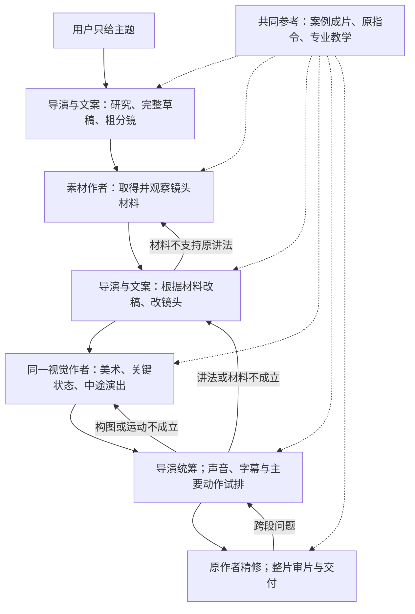
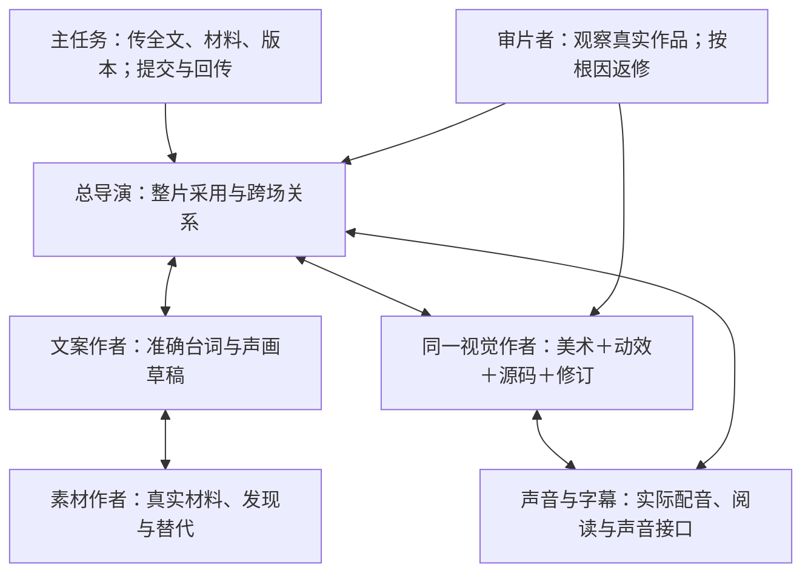
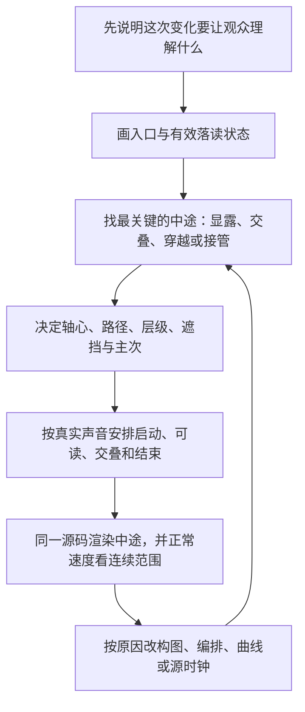
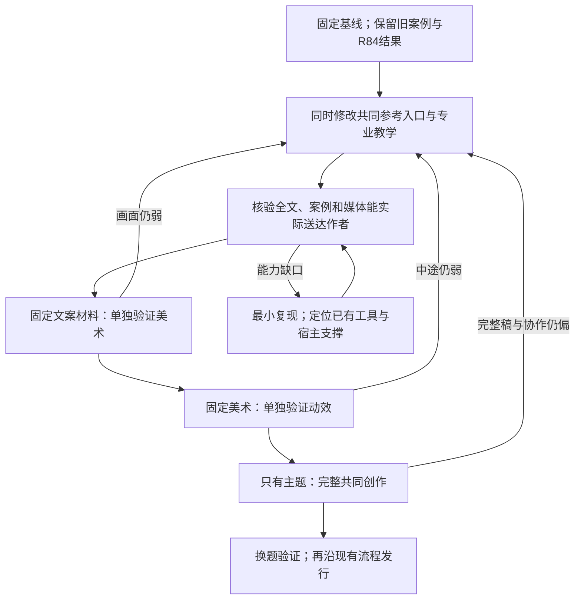

# VideoFlowCut 主题视频创作改造方案 v4
## 从共同参考、整片声画稿，到美术与动效的具体实现

**版本：v4 完整实施稿｜日期：2026年10月8日**  
**核对基线：`codex/topic-quality-v2-071`，提交 `8ceddf6cfb1c925ebe4b333971430cab3ea44740`。**

本文重新组织前面聊天中已认可的方案，并把执行方法、设计推导和修改正文补齐。旧 v3、R84 复盘和成功指令均保留；不要求先读旧文档。这里交付的是实施方案与教学示例，没有修改仓库、安装插件或重新生成完整视频。

## 阅读入口

想先看整套调整，读第1—3章；想知道导演、文案和素材怎样工作，读第4—5章；想知道怎样真正做好画面和动作，读第6—8章，其中第7章专门展开“动效中途”；准备开发时，读第10—12章和附录A。公式与完整教学代码放在附录B，不影响前面阅读。

[1. 本轮究竟要改变什么](#ch01) · [2. 先看整套流程](#ch02) · [3. 案例怎样贯穿全员](#ch03)  
[4. 导演与文案怎样共同写稿](#ch04) · [5. 素材怎样参与创作](#ch05) · [6. 美术怎样做出具体选择](#ch06)  
[7. 动效中途怎样设计](#ch07) · [8. 声音、字幕与节奏](#ch08) · [9. 一份完整交接长什么样](#ch09)  
[10. 工程要改哪些层](#ch10) · [11. 实施顺序与工具支撑](#ch11) · [12. 怎样验证真的变好](#ch12)  
[附录A. 可合入的 Skills 正文](#appendix-a) · [附录B. 教学代码与计算说明](#appendix-b) · [附录C. 认可要点对照与依据](#appendix-c)

**文中三种内容分清楚。** “原案例”指你提供的 `02_attention_new_generation.md` 及既有案例记录；“本轮方案／教学初排”是这次提出的新设计，不冒充旧片实测；“工程事实”来自上述固定提交。所有示例秒数和尺寸只服务相应例子，不变成全项目默认值。

---

<a id="ch01"></a>
# 1. 本轮究竟要改变什么

## 1.1 不是再规定一次“要有节奏、要参考案例”

这次失败有两类问题，必须同时改。

**一类是共同创作没有真正发生。** 导演、文案、素材、视觉之间有交接，但同一份稿子没有充分经历素材反馈、镜头重排、声画试排和实质修订。于是早期的知识目录，一路被制作成说明页。

**另一类是各角色没有把专业知识变成具体设计。** 即使文案普通，视觉作者仍有责任把字形、主体、构图和材质做好；即使画面已定，动效作者仍有责任把姿态、动作中途、主次和交叠做好。不能把所有局部问题都推给导演。

因此，本轮一起调整四件事： **共同参考从第一版草稿开始贯穿；各角色学会具体设计与返修；同一份整片声画稿持续生长；真实产物决定是否继续采用。**

## 1.2 为什么之前已经写了正确流程，实际还是跑偏

当前规范并非完全没有素材回传、美术和中途设计。`production-coordinator`、`narration-writing` 已要求全文、素材反馈和导演统筹；`scene-art-and-motion.md` 已包含造型、排印、路径、速度和检查。[R1–R4]

偏差出在： **“有这个步骤”被当成“已经完成这个步骤的创作任务”。**

例如，稿子写了“出现两个条件框、比较两个数字、显示结论”，它有入口、变化和出口，也能编程实现；但这不说明它值得看。素材仅用于核实费率，视觉仅负责信息出现，审片仅负责文字和裁切正确，各角色就可能一起完善一套偏弱的方案。

R84 原复盘记载了导演停止 B-roll、正式讲稿采用后未随声画实质重构，以及修订偏向正确性的过程。这些是已有记录；至于某次宿主消息是否截断、模型是否忘记某条规则，没有完整逐字记录，不能认定。[R5]

## 1.3 为什么那份成功MD特别有效

那份指令已经完成了大量本来应由团队完成的工作：它组织“住在／路过”的评论、椅子笑点、划走压力和节目安排；规定每份材料承担什么；给出字形、物体比例、动作中途和语义交接；还写清实际应该观察什么。[S1 §1–9]

**它不是一个“更长的提示词”，而是一份成熟的声画设计。**

只有主题时，团队必须在内部产生同等深度、但属于当前内容的稿件。不能继续由用户替团队写几百行细节，也不能认为案例已经放进目录，模型就自然学会了。

## 1.4 这次保留什么，不做什么

保留现有主任务、总导演、专业作者和受管制作链路。美术、动效和源码仍可由同一视觉作者连续负责，不因教学分工增加几个新代理。

不另建通用剧情数据库、第二条时间线、全片美学打分器；不规定每片必须几段 B-roll、几个反转、几种转场；不把黑底、绿色、宋体、26秒或无BGM设成默认。

**也不承诺“修改这些文件就保证好看”。** 本方案要通过独立美术试验、独立动效试验、只有主题的完整任务和跨题验证，判断哪些方法真正有效。

---

<a id="ch02"></a>
# 2. 先看整套流程：案例贯穿，同一份稿子反复完善

## 2.1 整片工作流程图

下图的实线是主要制作顺序，回线表示需要修改时回到对应作者。右侧共同参考贯穿各阶段。它不是要求所有素材到齐才能继续，也不是新增软件状态机。



**读这张图，抓住两个区别。** 第一，第一次完整草稿就与画面一起构思，不先写一篇文章再配图。第二，试排不是最后检查错字，而是可以推动改稿、重配、换素材和重选美术。

## 2.2 每次向前走，具体应该多出什么

### 第一次：从主题到“能从头讲完、也能从头想象画面”的草稿

导演与文案先看共同参考，结合初步研究，写出完整朗读正文和粗分镜。粗分镜说清每镜要讲什么、看到什么、想找什么、动画可能解决什么问题。未知材料保持候选身份。

此时不需要精确裁切和曲线，但不能只有五个知识标题。

### 第二次：从草稿到“实际材料能够支持”的版本

素材作者返回真实文件、源区间和发现。导演与文案重看全文：哪些句子保留，哪些必须改，哪些过程比设想更有趣，哪些镜头需要换载体。

材料已足够的一场可以继续深化，其他场面继续找；但是不能因为部分制作已经开始，就让整条初稿失去修改权。

### 第三次：从能讲清，到“已经选好如何表现”的版本

视觉作者在实际材料上确定主体、字形、颜色职责、关键构图和运动中途。导演把它放回整片，检查前后是否重复、声画是否抢先或落后、各段是否像彼此无关的作品。

此时交回的是一套已选定的设计，不是一排“可用淡入、缩放、旋转”的效果菜单。

### 第四次：从设计文字，到“真实声画验证过”的版本

用本片准确文字、当前声音、真实材料和主要动作试排。构图错误回视觉；中途混乱回动效；讲法拖沓回文案和导演；源时钟错误回实现。能够观察到的问题必须实际处理，不能用“尚待人工审片”包住全部不足。

## 2.3 角色怎样交流，而不是互相交差



**图中交流箭头表示创作往返，实际调用仍由主任务按现有宿主能力分派与续接。** 不让子代理递归派人，不允许各作者绕过MCP改正式项目。

主任务不替导演决定美术，但要检查交接是否完整。例如导演取消一项素材任务，主任务可以要求说明“原观看任务由什么接替”，这不等于主任务擅自选择新画面。

## 2.4 共同工作的是一份什么稿子

把它称为 **“当前整片声画稿”** 即可。它是现有完整消息或附件中的创作正文，不是新增API对象。随制作逐步完善以下内容：

| 稿件部分 | 装什么内容 |
|---|---|
| 本片方向与共同参考 | 观众关注什么；案例教什么；哪些历史外观不迁移 |
| 当前完整解说 | 可朗读的全文；真实原话、评论和演示分清 |
| 逐镜观看过程 | 入口、主要变化、出口、与前后关系 |
| 当前材料与美术 | 真实源范围、当前选定字体和构图；未取得的材料另写 |
| 演出与声音 | 动作中途、语义时机、字幕职责、声音接点 |
| 本轮修改 | 哪几处改了，为什么改，影响到哪些已有产物 |

草稿v1、v2是正文版本，不等于项目Revision，也不规定必须改到第几版。全文只保留一个明确的当前版本；旧稿作为历史，不让下游拼接几条修改留言。

---

<a id="ch03"></a>
# 3. 案例怎样贯穿全员：既学作品，也学判断

## 3.1 从第一版草稿开始共同参考

对本轮要改善的这类解说视频，`motion-case-attention-programme` 已被采用为共同质量参照。它不是等到某位视觉作者觉得相关时才看。

大家先理解整条作品和完整原始指令，再按自己的职责深入。不要求文案作者读全部TSX，不要求所有人读哈希与日志；但也不能由导演读一段摘要，就代替其他作者理解原作品。

**前期参考和素材驱动不冲突。** 先学“怎样让具体例子推进观点、怎样让新旧重点交接”；看过本片材料以后，再选具体裁切、遮挡、字位和源动作。

## 3.2 不是每个角色重复写“我学到了什么”

参考要进入当前产物，不另做阅读打卡。一位作者可以直接写：

> 参考片让椅子暂离的例子继续推动评论，而不是单独插入一张图。本片同样需要让具体处境参与判断。因此，开头先进入行程变更这一处境，再查看实际订单条件；不先列三项知识。镜头形式仍待本片材料决定。

这句话包含借鉴、当前选择和不照搬的边界。比“已学习高级动效”更有价值。

## 3.3 各角色的阅读位置与实际动作

### 导演：把案例的“发展”用到本片结构

先读原指令第1、2、7节。注意“住在／路过”并不是两张对比卡，而是通过具体例子走向压力和节目安排。然后试写本片从开头到结尾的观看过程，检查每段是不是在回应前面的关注。

收到素材、视觉深化与整片预览后，继续对照：有没有反复重建同一类页面？例子有没有被削成标签？结尾是否真的完成了这条发展？

### 文案：学习具体例子、评论和声画分工

先读第1、3、7节。把“抽象判断”展开成可以看见的处境和行为；让语言补充动机、态度或关系，不把画面全部念一遍。材料和配音回来后，再按相同问题改稿。

不是模仿原作者口头禅，也不是每句变反问。更不是复制案例文案到新题材。

### 素材：学习材料为什么非它不可

先读第2、6、7节。案例中椅子摄影、身份图与真实活动视频承担不同任务；不能因为图片更容易取得，就把所有活动都改成静图。[S1 §2.2]

本片每个候选都要回答“支持哪个具体观看过程”。选材时允许发现更好的内容，而不是只按名词找一张能装进去的图。

### 视觉：学习比例、字形、构图，而不是色板

先读第4—7节，并实际看相应状态。观察主字与手机怎样共场、门牌为何有体量、纸条为何不是按钮。随后用本片真实文字与素材做关键构图，比较的是主次、比例和观察尺度，而不只是换背景色。

### 动效：学习发生的中间过程

重点读第3、5.4、7D—7F、8节。把“错相”“交叠”“连续路径”展开成实际姿态、层级和速度。第7章会给出完整做法。

### 声音、字幕和审片：学习怎样共同完成一句内容

读第3、4.2、9节。声音不是先读完再等动画；字幕短卡不是短音频；案例无BGM不意味着本片必须无BGM。审片先看实际作品，再对照共同参考提出具体差距，不只核对作者有没有写计划。

## 3.4 主任务首次分派时该怎样写

下面是可用于现有角色任务消息的写法，不是新的宿主接口参数：

> 本次用户只给主题，由团队完成研究、完整声画草稿、取材、设计、配音、合成和内部修订。共同参照为已采用的 `motion-case-attention-programme`：先理解整条作品、原始完整指令和主要发展，再读本职责相关章节。参考贯穿草稿、材料反馈、设计、试排和审片，不等到编码才读取。迁移内容推进、材料作用与设计深度；历史手机、椅子、颜色、时长、权限只属于案例。请把这些方法体现在本片选择中，不单独提交阅读心得。先回当前完整创作产物与下一项依赖，不直接改正式项目。

随后再附“本次主题、当前全文、相关材料、真实版本、前后场面和本轮具体问题”。不能只发这段公共话就开始制作。

## 3.5 接任和失忆时怎么办

换负责人或上下文恢复时，主任务重新交回：本次共同参考入口、当前全文、已采用的实际材料、已经明确的美术和声音、最新预览及未解决问题。接任者确认这些内容后继续，不重新从主题猜一次。

若实际没有视频连续观察或音频理解能力，只记录能看的帧、能读的文本及缺口。不伪造“已完整学习动态”。这会限制动态评价的结论，但不妨碍根据已读原指令深化设计。工具支撑怎样核验见第11章。

---

<a id="ch04"></a>
# 4. 导演与文案怎样共同写稿：给出实际改写方法

## 4.1 第一步先写“观众会经历什么”，不是先列知识点

接到主题后，导演与文案把初步研究变成一段连续叙述：从什么处境开始，看到什么具体差异，怎样理解它，理解后又要核对什么，最后完成什么认识。

例如，机票题材可以提出以下 **待研究的方向** ：

> 观众从一次行程变更进入。原先最关心价格，现在开始关心改变计划的代价。查看一份真实订单及其规则，发现表面相似的产品可能附带不同条件；再区分收费解释与收费依据，最后回到这份订单，完成具体核对。

这不是已经核验的事实稿，也不声称已拿到某份订单。它提出研究与镜头任务，比“时间、舱位、成本、费用、维权”五个章节更接近一条视频。

导演在这里作出角度选择，文案把它写成准确台词。两者的工作有重叠，但最后只采用一份当前全文。

## 4.2 第二步让抽象观点有一个具体支点

原案例先提出“观看方式变了”，接着用几个熟悉房间、主播暂离、椅子仍被等候，使抽象评论获得可见的例子；随后才引出随手划走和节目压力。[S1 §1.1、§7B–7F]

可迁移的不是椅子笑点，而是下面的写法：

**先说一个值得判断的问题，再给一个能被看见的具体情境，让情境推动下一句判断。**

当文案只剩“影响、提升、条件、成本、机制”等抽象词时，作者应追问：这个词在本片里对应哪件事？观众能看到的前状态和后状态是什么？没有对应材料时，提出研究或镜头需求，不编造一次真实经历。

## 4.3 从弱稿到可拍草稿，具体改哪些地方

下面是教学改写，不是对真实航空规则的结论。正式稿仍要由实际材料支持。

**弱稿：**

> 机票退改费用由时间、票价条件等因素决定。不同产品条件不同，越临近出行，相关安排越受限制。我们还应区分手续费和差价，因此购票前要仔细阅读规则。

它大体在解释概念，没有让人进入一件事，答案也一开始就全部给出了。

**第一次改：把开场放到一个处境里。**

> 票买好了，行程却变了。你重新打开订单，这一次，最关心的已经不是当初便宜了多少，而是现在改计划要付出什么代价。

先建立关注，不必夸张愤怒，也不暗示发生了一起真实投诉。

**第二次改：让材料提供一次发现。**

> 我们先不急着下结论，把这份订单里的价格和退改条件放在一起看。刚才比较的是一个数字，现在需要比较的，还有它旁边那些不那么显眼的条件。

这段只有在实际取得相应原件后才能正式采用。没有取得，就保持草稿，或改成明确的原创示意；不能制作一个仿官方页面冒充事实。

**第三次改：不要用“所以”提前结束，继续提出有根据的核对。**

> 条件能解释差别，但还没有回答每一笔钱是什么。页面上的总额，究竟由哪些项目组成？接下来，按这份订单能查到的项目逐项核对。

新问题从前面的发现产生，不是突然另开一个知识章节。实际订单不存在这个拆分时，就删掉或改变这一段，不为使用动画而制造项目。

**第四次改：结尾回到已经完成的事情。**

> 到这里，我们没有替所有收费作判断，而是把这份订单里能核对的条件与金额归属拆开了。哪些有清楚依据，哪些仍需要进一步确认，分别说清楚。

这是研究型方向的一种写法，不是所有视频必须采用“核账”结构。最终结论不能超过实际查证。

## 4.4 草稿旁边，必须同时有粗分镜

粗分镜先写观看任务，不急着写最终动画参数。下面仍是 **候选设计示范** ，不是已取得的素材记录。

| 镜头任务 | 草稿里的主要画面 | 当前要取得什么 |
|---|---|---|
| 进入行程改变的处境 | 真实出行环境与订单关注相接，不先出讲义封面 | 有可辨行动的候机、离港或出行情境；可用订单原件 |
| 从价格转向条件 | 保留同一对象，观察从价格转到条件区域 | 原页面及其上下文，而不只是局部数字 |
| 看清实际差异 | 在同一比较基线上显示材料支持的不同 | 可比、可核验的条目；不可比就换讲法 |
| 区分解释与依据 | 画面返回前面的对象，再引出新的核对点 | 与当前论证直接相关的原文或操作 |
| 完成核对 | 把已查清与仍未知的内容分开，回到开头关注 | 这次真正得到的研究结果，不预写结论 |

粗分镜不等于“第1句配图1，第2句配图2”。同一个对象可以跨句，一句话也可以跨几个镜头。

## 4.5 文案怎样获得起伏，而不是只加情绪词

作者应逐段标出当前讲述在做什么：进入处境、发现差异、给出解释、提出质疑、等待观察、完成判断。然后检查是否连续很长时间只在做同一种事。

**发生重复时，先改内容顺序或展开方式。** 例如先报答案再演示，可以改为先让观众看见差异，再给解释；两个相邻总结可以合并；关键过程值得看，就少念一层重复说明。

之后才安排语气：发现处可以稍有停顿和落点，质疑处可以收紧语气，说明必要条件时清楚而不含混。不是每段都惊讶，更不是全片都用平稳讲义腔。

配音试排后，若画面已经讲完而旁白还在重复，回文案改写。若画面还没让人看懂，旁白已经讲下一件事，重排动作、句群或停顿。第一版配音不自动锁定全片。

## 4.6 导演怎样判断“这一稿可以进入取材或深化”

导演不是看字段齐全就通过，而是把稿从头到尾读一遍，按观看过程提出具体判断：

开头的关注是否具体？材料有没有改变判断，还是仅给旧观点贴来源？相邻镜头为何相接？哪句话已经被画面讲过？结尾到底完成了什么？

例如，“第三段仍然只是第二段结论的复述；把这段合并，让真实操作承接后面的质疑”，是有效的采用意见。单写“逻辑清楚，继续制作”不能推动稿子变好。

---

<a id="ch05"></a>
# 5. 素材怎样参与创作：从搜索词到镜头与改稿

## 5.1 先区分材料的用途，再找文件

**事实依据** 回答一句主张凭什么成立，例如原规则、原页面和真实操作结果。

**情境材料** 让观众进入地点、时间、行动和感受，例如候机、推出、离港。它不必证明费率，才有画面价值。

**可被演出的材料** 提供能继续设计的主体、动作、纹理和空间，例如有明确主体位置的活动视频、完整摄影物体、可以局部观察的原件。

同一份素材可以有几种用途，但要分别说清。情境片段不冒充当前订单或某次投诉的现场；原件上的条件不因构图方便而被裁掉。

## 5.2 一条可执行的搜材任务怎样写

不要只发“找飞机视频”。可以写成：

> 当前段落需要让观众感到这一班正在离开，不承担退改费率证明。寻找有可辨行动的离港、推出或滑行素材。采用前实际检查主体运动方向、连续可用区间、竖屏取景能否保住主要动作、已有字幕与水印、声音以及使用条件。优先返回能够支持当前讲法的候选，也可以提出更好的观看方式。搜词可从“飞机 推出 机场 停机坪”“aircraft pushback airport apron footage”等开始；这些只是查询方向，不是已搜索结果。

这个任务说明了要完成什么，而不提前锁死“飞机必须从左向右才能配合我已经写好的转场”。实际材料的方向回来后再设计。

## 5.3 返回时不要只交链接，要交“这份材料能怎样用”

候选反馈可直接写在现有交接正文中，不新增数据库字段。下面演示格式， **候选A、时间和动作都是假设的教学内容** ：

> 候选A：连续范围约12.4—17.8秒；宽景中飞机正在推出，主体从画面中部往右侧移动，左上区域较空。可用于表现离港过程，不能证明当前订单收费。竖向取景如果紧跟机身，会丢掉推出车；建议保留更宽范围，或让画面先作环境再靠近主体。当前只检查了此范围，声音与许可仍待核对，尚不采用。

正式制作时换成真实文件、真实观察和真实状态。不能把这段示范当搜索记录，也不能把“相关”当成“已可用”。

## 5.4 一个素材发现，怎样同时修改文案和画面

假设草稿写“飞机已经起飞”，实际取得的只是推出素材。正确处理不是用推出画面硬配起飞，也不是把视频取消改成飞机图标。

导演与文案先判断：本段需要的是“真的离地”这一事实，还是“这班逐渐结束可安排的窗口”这一观看意图？

若必须起飞，继续寻找对应材料；若推出已能承担情境，改准确措辞和镜头过程，并保留它只是情境的身份。视觉作者据新的方向和主体位置设计取景，声音作者也调整相应落点。

**材料变更后，至少重新看文字指代、主体位置、动作方向、可用长度和前后接点。** 不能只更换Asset ID。

## 5.5 一次入口失败以后，怎样继续而不盲目重试

先分清普通未命中、单个入口受阻、许可不适合和平台故障。普通未命中可以改关键词、范围、来源或表达；同一失败下载或结果未知的正式提交，不能盲目重复。

若确实决定不用某份动态材料，导演要给出新的表达安排：原来它承担什么，现在由哪个真实过程、摄影材料、原创场面或明确切镜接替，文案因此怎样改变。

**“官方原件足够，所以不再找现实画面”不是完整理由。** 原件解决的是依据，未必同时解决处境、行动和观看变化。

本轮不规定视频占比。但是已经采用的“观看一个真实过程”任务，不能在未告知导演、未改稿的情况下悄悄降成静图。

---

<a id="ch06"></a>
# 6. 美术怎样做好看：从判断到实际样张

## 6.1 先选视觉想法，再选颜色

“深色、科技感、绿色强调”还不是美术方向。视觉作者先看当前稿和实际材料，决定：本片主要面对什么对象，观众离它多近，哪些地方需要空间，哪些地方适合平面排印，真实材料和文字怎样共同构图。

例如，已取得有价值的机场活动画面，可以采用“真实空间进入、近距离原件观察接管”的方向；如果核心材料是一件产品，就可以让同一对象持续承载不同观察。方向要由内容与材料支持，不因案例有手机就先做手机。

然后才确定颜色职责、字形语气、轮廓和材质。整片统一的是这些选择之间的逻辑，不是每镜套同一背景、页眉和列表。

## 6.2 先做关键构图，具体先做哪几张

不机械要求每镜三张图。针对当前场面的风险选择必要状态：观众第一次看到主体的入口、主要关系最清楚的状态、最容易遮挡混乱的中途，以及交给下一镜的出口。

这几张应使用 **当前真实素材、准确文案、已登记字体和实际作品源码** 。先允许简化非关键装饰，不能另画一张理想效果图当作已实现。[S1 §9.1]

若美术方向存在实质分歧，做少量真正不同的构图比较。例如同样的票据与文字，一版近距离物体，一版平面排印，比较观看任务是否成立；不是做六套同版式配色供人猜。

## 6.3 字体：怎样从“加粗”走到真实排印

**先用本片的字看，而不是只看字体名。** 调用当前字体能力目录后，由原视觉作者选真实字款，渲染最长主读、常用标签和代表字幕。字体选择仍遵守当前项目的用户指定与缺失字体处理规则。

接着看轮廓、实际字幅、笔画重量和阅读条件。显示字可以有更明确性格，正文字幕应稳定可读，标签要和物体归属一致。不要让三层字同等大、同等亮。

字体盒的宽高不等于实际墨迹轮廓；浏览器测量可以检查布局，最终还要看真实渲染。不能用不存在的900字重冒充粗字款，也不能任意横向挤压文字拼出假字体。[S1 §5.1]

**实际返修例：** “欢迎来到直播间”像细正文时，先核对字体是否回退，再看字幅、字高与凹槽比例；不是先加重阴影。字形太宽时优先选合适字款或调整可用区域，不把整片字幕一起缩小。

## 6.4 主次：不是把所有东西都放大

作者先为当前状态选定第一关注，再决定其他层怎样支持。第一关注可以是人物、关键字、真实动作或原文细节，不一定总是最大文字。

将实际画面缩到普通观看尺寸，再看灰度版本：是不是出现几个同等亮、同等大、互不相干的块？标题、来源、字幕和主读有没有重复抢同一信息？

发现竞争时，一次处理一个设计原因。先撤掉常驻同义标题，或压低背景对比，或把主角靠近；不要同时增加大字、加描边、加发光和加运动，令问题更重。

灰度只是检查明暗关系，不替代彩色与连续观看。稳定帧突出主字，动作中途仍可能因新对象突然放大而改变主次，需要一起检查。

## 6.5 造型：用原案例把“搜索框”改成“门牌”的过程讲清

**原案例设计。** 身份板约400×96个工作像素，头像直径80，凹槽约272×54，图像约384×216；欢迎语有明确字高，图像上缘与板面相接并有遮挡。[S1 §6.3]

这组数字属于原例，不是所有视频的模板。它说明的是：作者先决定部件比例和共同空间，物体才可能像一个完整视觉组。

**假设弱稿** 是一根400×40的条，头像24，欢迎语为细小正文，下面的图片与条之间留一段空隙。此时“像工具条”的主要原因是部件比例与关系，不是光影少。

**修正顺序如下。** 先确定本片对象应是什么，再把主要部件的比例重做；让头像有与板面相称的体量，文字属于板内的具体区域；把图像与板真正组成一组。去掉光影看轮廓是否仍成立，然后再补边缘、凹槽和接触。

**换到机票题材时，不复制门牌。** 票据要有票据的轮廓和信息组织；原规则页面保持原件身份；设备才需要壳体。不能把它们都画成相同圆角框，再用标题告诉观众它是什么。

## 6.6 材质、光影和空间：具体怎样检查

对于物体风格，先明确主要光向，检查亮边、暗侧与投影是否一致。贴着表面的影子和离开后的影子不应完全相同；文字、边缘和影子应跟随同一个物体变换，不能纸片走了、影子留在原地。

薄纸不应靠强烈多段渐变显得鼓起，设备的厚度不应仅是一圈粗黑描边。摄影材料已有受光时，原创图形要与它协调，而不是全部染成同一种颜色。

平面风格则用轮廓、排印、色块、对齐和负空间成立，不强制加三维、玻璃、金属或霓虹。 **质感不是越多越好，而是所选风格内部要一致。** [R4]

## 6.7 真实素材和文字怎样组成一幅画面

先查看素材主体的实际位置、行动方向、视线和可裁范围。然后同时决定视频取景、文字区域与原创图形的位置，而不是先给视频固定一个中间小框，再把字塞到四周。

如果主字来到前景，素材仍应保留能理解其身份与行动的部分；若字幕或主字挡住了关键动作，改变构图、出现时机或字幅，而不是简单把素材缩小。

源本身已经表达得很好时，可以直接切镜或保留原动作。图形需要有具体贡献，例如指认原条件、建立比较、引导到细节；不为了“用了动效”而复述画面。

## 6.8 一次视觉返修，怎样写才可执行

> 当前帧的主要问题不是背景颜色，而是票据与三组说明同等显眼。保留票据作为第一关注；常驻主题删掉，必要出处降为辅助；把当前必读条件和原位置关联，其他条件暂不进入。下一版先看真实缩略尺寸的入口与比较状态，再决定是否调整色彩。

这样的意见指出了原因、保留项、修改动作和复查位置。不能只说“高级一点”。

**视觉能力单独验证。** 固定准确文案和材料，仅改变美术。如果画面仍然弱，就继续修视觉判断；不能再用“导演故事不好”解释所有问题。

---

<a id="ch07"></a>
# 7. 动效中途怎样设计：从两个端点，走到完整演出

## 7.1 “中途”不是时间过半时随便截一帧

假设入口是一部手机，出口是一个节目组。只写“手机下移，节目组出现”，只决定了两个端点，最重要的问题仍然没决定：

手机离开到什么程度时，新内容开始进入？两者同时存在时，第一注意在哪里？新组从哪里被看见？源视频是否继续？声音讲到新内容时，它是否已可读？

**中途设计，就是在变化发生的过程中，主动安排观众能看见什么、先看什么，以及怎样从旧重点过渡到新重点。**

动画的“关键中途姿态”不必位于50%时间。它可能是遮挡刚解除的时刻、两个对象最拥挤的时刻、某个字第一次能读清的时刻，或旧对象离开而新对象还没接上的危险位置。

## 7.2 作者具体按什么顺序设计



**先写变化的意义。** 例如“让观众从随手划走的现象，进入提前安排节目的应对”，而不是“这里需要一个转场”。

**再画入口和读清后的状态。** 入口有哪些已经熟悉的对象；出口的新主体、文字和素材怎样组成一幅画面。两个端点都难看，先修美术。

**然后设计关键中途。** 选当前最容易出问题的几个时刻，给出明确姿态与主次。不能用两端位置自动插值，然后默认中间会好看。

**最后安排时间。** 先决定新内容最迟何时要可读，再反推启动时刻；决定旧内容哪些部分继续、哪些部分先退让。不是先给每个对象分配0.5秒，再把它们排成队。

## 7.3 每个重要中途，写清六件事

用连续正文即可，不必每次填大表。

**谁还在场。** 主体身份是否连续，还是明确换成另一个对象；哪些参照保留。

**姿态是什么。** 位置、投影尺度、朝向、轴心；不要只有“运动中”。

**谁挡住谁。** 层级、遮挡面积、文字从哪条边被看见；显露不等于全部元素统一淡入。

**此刻先看谁。** 旧对象是否仍然太亮，新对象是否过早抢注意；附属物是跟随还是各自表演。

**速度处于什么阶段。** 起势、通过、减速、读清、穿出；需要停稳的地方停，需要连续观察的地方不强行停车。

**声音与源画面怎样继续。** 源视频不因为父物体移动而重新开始；准确台词与当前观看任务要对应。

下面把这六件事落实到三个具体例子。

## 7.4 例子一：“不能冷场”怎样侧转，而不是两组文字平移

### 先区分原资料和这次教学

原指令给出了四个独立字的侧转、错相和最终槽位。这一节解释怎样把它变成可执行设计；附录B的数学函数是本轮新写的教学实现，不是旧成片源码，也没有宣称已复现旧片观感。[S1 §5.4]

### ① 先把最终字形和位置做对

原例的四字最终顺序始终是“不能冷场”，固定在一条阅读线上。先实际渲染字形，确认总字幅、字高和间距，不靠入场动画掩盖终态排印不足。

每个字有自己的容器和竖向轴心；整组共享透视。旋转在单字内部发生，最终槽位不动。不要把“不能”合成一块、“冷场”合成一块；也不要按出场先后重新排列最终文字。

### ② 决定入场时看见什么姿态

原例让每个字先以较窄的侧面出现，随后转向观众，短位移只作配合。这样中途主要变化来自投影宽度与姿态，不是从很远地方平移。[S1 §5.4]

| 字与最终槽位x | 相对起点 | 原例初始侧转／动作时长 |
|---|---:|---|
| 不，99 | 0.00秒 | −68°左右，约0.46秒归正 |
| 能，193 | 0.10秒 | +64°左右，约0.45秒归正 |
| 冷，287 | 0.25秒 | +72°左右，约0.46秒归正 |
| 场，381 | 0.17秒 | −70°左右，约0.43秒归正 |

x为原例舞台局部工作坐标，不是视频输出像素。“场”开始较早，但始终在最右侧；开始顺序与阅读顺序是两回事。

### ③ 主动设计几种不同的中途，而不是所有字同一个进度

下表是按上述关系组织的 **教学观察点** ，不是旧片截图的测量结果。

| 相对时刻 | 应看到的中途状态 | 要防止的问题 |
|---:|---|---|
| 约0.18秒 | “不”已经展开较多，“能”在转向，“场”刚从窄面显露，“冷”尚未进入 | 四字同时相同角度，仍像一个整块标题 |
| 约0.36秒 | “不”接近读清，“能”继续归正；“冷”“场”保留不同姿态 | 字的位移过大，读序和词组轮廓被打乱 |
| 约0.55秒 | 两个早起字已稳，后起字完成剩余转向 | 已读清的字仍反复摆动，观众无法落读 |
| 约0.75—0.82秒 | 全词成为一个稳定主读，手机内的活动继续承担变化 | 为了“不停”再加漂浮，抢走源视频内容 |

这些观察点为什么这样选？第一处检查错相是否真的存在；第二处检查最复杂的共同姿态；第三处检查收势与稳定；最后检查阅读和其他内容是否接上。不是因为每段动画都必须抽四张图。

### ④ 让姿态先展开，末段再落稳

教学实现可令单字进度 `u` 从0走到1，用 `1-(1-u)^3` 计算转向比例：前段较快展开，末段逐渐归正。位置偏移同时收回，透明度只用于最初短显现，不成为主要动画。

这条曲线不是通用高级公式。若真实字体在侧面过细难认，可以减小起始角度、稍微延长显露，或调整主光与透视；不要先把所有字加粗描边。若后半段显得过早不动，要看内容是否已完成，而不是必然添加反弹。

### ⑤ 写到源码时要保住什么

每个字绑定固定阅读槽位，内部独立旋转，整体共享透视；字形、影子与附着装饰同组变换。`useCurrentFrame()`对应当前作品时钟，换算成秒后计算每字延迟；不能用真实墙钟或CSS动画来驱动渲染。[T1]

附录B的 `letterStates(t)` 返回这些姿态。它只计算字位和角度，真实字体加载、字形渲染与最终视觉检查仍由现有作者和受管源码完成。

## 7.5 例子二：手机怎样交到节目组，不是退完再进

### ① 先规定“内容落点”，而不是固定转场总长

原例要求：声音讲到“随时被划走的压力”就启动交接；讲到“必须时刻有活”时，新的节目内容已经成立。[S1 §3.2、§7D]

设“压力”的实际语音起点为 `T`。下面相对时间是依据原例关系选择的教学初排。正式任务必须重新取得当前音轨的准确句群边界；没有词级证据时，不能按字数均分伪造词级时刻。

### ② 先把整场的交叠排出来

| 相对T的时间 | 旧重点怎样让位 | 新重点怎样建立 |
|---:|---|---|
| −0.10—0.30秒 | 主字退出主要阅读，背景与旧源仍在 | 新组暂不抢主读 |
| 0.00—0.72秒 | 手机向下穿出，源视频继续，不到边缘慢慢停住 | 上部空间逐步让出来 |
| 0.22—0.64秒 | 手机仍在离开 | 头像开始展开到位 |
| 0.26—0.78秒 | 旧源降低主次，不突然变黑 | 板面从头像后展开；文字属于板面，不再单独弹一次 |
| 0.40—1.00秒 | 手机后半段已接近出画 | 图像从下方接到板后，板遮住图像上沿；组成一个主体 |

这不是把时间压得越短越好，而是让多个动作共同完成一次注意力转移。正式“有活”一词比教学初排更早，就需要提前建立或调整讲述，不盲目沿用表中秒数。

### ③ 把最危险的中途写出来

**T+0.22秒：** 手机开始明显让出上部，头像刚进入。此刻不要同时亮起所有欢迎字、图像、纸条和箭头，否则新旧都在争抢主角。先建立新对象的入口轮廓。

**T+0.40秒：** 手机仍有一部分在场，新板已经逐渐可见，图像刚从下方进入。主要注意应开始转向上部，手机作为退出中的旧关系保持；不是两张完整大图同时等权铺在一起。

**T+0.60秒：** 手机大部分已离开。板与头像组成主组，图像正在接入板后。图像边缘被前景板短暂遮挡，因此它像接入同一物体组，而不是另一个浮动卡片。

**新内容可读以后：** 让主组稳定，纸条与观察过程接手后续发展。不能继续给身份板随机晃动来填满旁白。


图文阅读版用附录B的计算状态展示这一过程。它是本轮教学示意，不是旧成片截帧、最终美术样张或受管渲染验收。

### ④ 手机退出的速度，怎样避免“滑到底停车”

只对位置使用完整的ease-out，容易在画面底部越来越慢，让人等它离开。该例更适合在出画前仍保留向下速度，真正出了可见范围再卸载。

教学舞台高436，手机起始中心y=205、高462。选退出终点中心y=720，则手机上边缘为489，已在舞台下方。这里的终点不是为了让它在边缘停下，而是为了保证卸载前整个物体已经不可见。

一种教学位移是：

```text
u = clamp((当前秒数 - T) / 0.72, 0, 1)
y = 205 + 515 × (2u² - u³)
```

这条函数起点速度为0，末端仍有向下速度；0.72秒后物体已出画再移除。它只是本例的计算选择，不是物理真实性证明。若边缘仍可见就调整路径或卸载时刻，不能依靠突然淡出掩盖错误。

### ⑤ 板面与图片，怎样避免“各弹各的”

板、凹槽、欢迎字属于一个局部容器。展开可以通过遮罩显露板面与文字，不对字体横向拉伸；头像独立展开但与板共享空间。图像在板后接入，层级从一开始确定，不在中途突然改z-index造成跳层。

新的组内文字先确保真实尺寸，显露期间允许部分遮挡，达到阅读状态后必须完整。不是板弹一下、凹槽弹一下、字再弹一下、图再弹一下。

### ⑥ 源视频时钟必须独立

手机运动只改变外层变换。内部视频沿原来已经开始的时间继续播放；不能为了转场重新挂载一个从0开始的视频。

可以在思考中分开三件事：整片时间、当前作品时间、源媒体时间。附录B给出了源时间映射的教学函数；它不是可以直接填入VideoFlowCut的新增参数。现有媒体组件的用法仍以当前受管合同为准。[S1 §9.1、R6]

### ⑦ 返修时先找到是哪一层错

新内容来晚了，先改相对语义时机；中途两组都太抢眼，改面积、亮暗、层级和显露顺序；手机发飘，改姿态与速度；源视频重播，修时钟和组件生命周期。不要把这四种问题都变成“调一下spring”。

## 7.6 例子三：观察镜怎样连续阅读，不是逐行到站停车

### ① 两种连续性必须同时成立

**位置连续：** 上一段结束的位置与下一段开始的位置一致，不发生跳位。

**速度与方向连续：** 经过连接处不突然停住、加速或折向。仅把路径点连起来，并不能保证这一点。

原指令要求沿同一路径观察、经过需要读的词时减速，中途不强制归零；起始进入和最后读清可以停稳。[S1 §8.3]

### ② 先决定每一处要观察什么

原例观察中心依次在 `(306,178)`、`(309,222)`、`(310,270)`、`(305,310)` 附近。它们对应节目入口、中部安排、中下部和结句，不是为了让圆形沿四个点运动而存在。[S1 §8.3]

在新主题里，先取得原件，找到真实需要观察的位置。原文没有对应关系就换方法，不强制每片出现圆形镜片。

### ③ 再决定“经过时慢一点”，不是每项都停一次

下面时间与速度是 **本轮计算演示** ，不是原片测量，也不是当前配音时序。速度单位是工作像素／秒。

| 教学节点 | 位置x,y | 经过节点时的速度vx,vy |
|---:|---|---|
| 0.00秒 | 306,178 | 0,0：起点可以停稳 |
| 1.05秒 | 309,222 | 2,26：放慢，但仍继续往下 |
| 2.15秒 | 310,270 | −1,26：继续观察，不归零 |
| 3.25秒 | 305,310 | 0,0：结句允许稳定 |

相邻两段共享节点的同一个速度，便不会各自ease-out到0再启动。附录B用三次Hermite插值同时约束端点位置和速度，并检查了本组参数没有倒退、稳定镜圆没有越界。

**不是所有连续镜头都必须不停。** 材料需要逐项仔细阅读时，适当停留可以更好；这里针对的是原例已确定的连续观察任务，不把数学连续当成审美目标。

### ④ 镜内外必须来自同一个状态

设源场景点为x，采样中心p，镜片显示中心q，倍率z。原指令的映射为：

```text
镜内位置 = q + z × (x − p)
```

同一帧先计算节目场景状态，普通画面和镜内放大都使用它。镜内不是另写一份更大的文字，更不能把镜片自己再次递归画进去。[S1 §8.1]

场景父级有缩放和位移时，先把采样点换到相同坐标系；不能把最终输出像素直接放进480宽的局部舞台。

### ⑤ “字没裁掉”要怎样检查

原例镜片直径约216，倍率初排约1.42；最后中心y=310，底部是418，在高436的舞台内留有空间。这些只是原例的起点。[S1 §8.2–8.3]

真正要检查的是当前必读字形，而不是整张纸面的空白都必须装下。放大以后，必读字形边界要在圆内并留余量；纸面空边、非主读邻项可以自然裁去。实际检查还要看透视和字形，不能只信一个矩形盒尺寸。

若镜片退出，先在位置与直径保持的情况下把倍率回到1，使镜内外重合，再撤去边缘和取样层。不要缩整个镜内内容，留下第二套小字覆盖原字。若结句已经完成，可以直接结束，不必表演额外退场。

## 7.7 再补一种常见中途：对象从遮挡后出现

原例的椅子先让椅背解除遮挡，再让扶手、座面和脚轮取得前景；原有入口与人群略退小、降对比，但仍保持关系。[S1 §7B]

新任务采用这种方法时，先指定遮挡者和被遮挡者，确认实际素材能组成可信的完整轮廓。再确定显露顺序：观众先认出哪个部分，何时读成整个对象，接触或投影怎样变化。

如果只有一张完整背景摄影图，不具备分离能力，就采用干净取景或明确切镜；不能假定已经抠出物体。若同一部件需要从原位置来到前景，起点投影要对齐；两份不重合图层交叉淡化，只会产生双影，不等于同一个物体连续移动。

## 7.8 怎样把这些方法写成当前作品的演出稿

不要只交“手机下移、节目组进入”。至少写到下面这个深度：

> 语音进入“压力”时，旧主字先退让，手机开始向下穿出且内屏源继续播放。手机让出上部的过程中，头像先建立新组入口，板面从它后方显露；板、凹槽与欢迎字保持同一空间，不分别弹入。新图在板后上移接住主体，最拥挤的中途降低旧手机对比，第一关注转向新组。讲到新的应对方式时，新组已完整可读。旧手机完全出画再卸载，随后由节目内容展开承担发展，不额外停留。

然后补当前实际素材、声音锚点、关键几何、需要看的中途，以及源码里的实现位置。这才是可实现的设计；不需要每次写成几千字，但主要关系不能缺。

## 7.9 动效验收看什么，怎样避免“看了四张图就说丝滑”

先用正常速度看当前完整接点及前后语境，判断是否读得懂、有无空等、主次是否自然。再慢放或抽帧定位具体姿态和跳位。静帧只能证明那个时刻的构图，不能单独证明连续流畅；抽样也不能自动证明听感。

局部修订由原视觉作者处理。若需要改主要对象、内容顺序或跨场接口，再回导演协调。正式提交和版本写入仍由主任务负责。

---

<a id="ch08"></a>
# 8. 声音、字幕与节奏：不是动画做完以后配个音

## 8.1 四种单位不要混在一起

**讲述句群** 是自然说话的一段； **字幕卡** 是屏幕上一段可读文字； **视觉场面** 是一个持续观看过程； **技术作品** 是受管生成与合成的单位。

一句群可以有多张字幕卡，一个场面可以跨句，一件作品也可以有多个明确镜头。不能由字幕换卡决定画面重建，也不能因为一件作品预算有限就截断语义或重播源视频。[S1 §3、§4.2、§9.1]

## 8.2 给配音作者的方向要包含“怎么说”，不只有禁令

例如，围绕实际采用稿写：

> 开头进入具体处境，语气直接；第一次发现差异时放出一点疑惑，留给画面辨认；解释部分清楚但不拖长；转向核对时语气收紧，结尾完成已得到的认识。不要全程惊讶，也不要每句话都同等平稳。具体停顿以实际朗读和画面为准。

这比只写“不夸张、不激动、不促销、不训话”更能指导表演。它仍需真实回听，不凭指令就宣称声音有起伏。

## 8.3 实际声音回来后怎样校准

先核对文字、读音和句群边界，再决定每个语义动作是提前进入、落在重音、说完回应，还是贯穿整句。关键关系优先，例如新内容必须在对应话语时已经可读。

如果没有可靠词级对齐，就按可靠的句级精度设计，或进一步核实；不能按字数均分生成“精确词时码”。改稿或重配后同步字幕、动作、源声和跨场接点，不只换一个版本号。

## 8.4 音乐、音效与源声怎样安排

先判断需要什么声音作用。真实源声可以帮助建立环境或动作；简短设计声可以加强一次接触或交接；音乐可以支持段落情绪，也可以不用。

参考案例未采用BGM，不意味着新片默认静音。反过来，音乐也不能掩盖画面空等；镜片每经过一行就叮一下，可能破坏自然讲述。每个声事件都应对应具体用途，并在实际混音里核对。

## 8.5 字幕怎样不破坏美术

字幕负责当前正文，画内主读负责强调，标签负责指认。可以有合理重复，但不要同时堆几层同等大字。

先在本片真实字款与观看尺寸下确定行数、字级、基线和有效字宽，再按自然语言边界切卡。原案例用单行是这条片的设计，不是全项目所有任务只能单行；需要双行的影片另作设计。不能为塞字把TTS切成许多独立短音频，也不能突然缩小整片字幕。

---

<a id="ch09"></a>
# 9. 一份完整交接长什么样：不是让用户填表

## 9.1 每轮正文在原稿上生长

导演交观看任务与主要分镜，文案补准确台词，素材补真实发现，视觉作者补美术与中途，声音补实测语义时机。主任务维护明确的当前全文与引用；专业作者仍对自己的内容负责。

不是每人分别写一套不同的大文档。下面用一个场面演示交接深度，内容来自旧案例关系；其中具体素材与真实时机必须在新任务里重新取得，不能当作已经准备好的提交包。

## 9.2 完整场面教学稿

**本场发生什么。** 前文已经让观众看见随手划走的现象；本场把关注转向主播为这种压力作出的提前安排。不是为了换一套好看图形，而是继续同一段评论。

**准确讲述。** 沿当前已采用的“随时被划走的压力—必须有活—提前安排”句群。新任务按真实材料改写，不把旧评论当事实通用结论；全文由原文案作者返回。

**材料。** 手机内采用本次实际取得的活动视频，退出过程中持续播放；节目图像是另一个独立图像主体，不伪装成手机里某帧变形。材料作者交回真实源区间、尺寸、主角区域及使用条件，未取得时保留待补。

**关键构图。** 入口以手机和主字为主要关系。出口由头像、身份板、凹槽文字和图像构成一组，上方为新阅读入口，下方保留后续内容位置。实际字款与比例通过本次源码样张确认。

**中途与运动。** 采用第7.5节的交接逻辑：旧主字先退，手机向下穿出，新头像与板在上部建立，图像随后接入板后。最拥挤时刻不让两组等权。板中文字不独立弹入；源视频不重播。

**声音与字幕。** 动作相对当前“压力”起点安排，新组在新的应对内容到来时可读。字幕只跟当前准确讲述，不把制作备注放入画面；纸条内容不要求旁白逐项念完。

**出口。** 新组读清后由后续安排内容接管。没有额外空镜片循环、没有所有对象逐一退完的等待；是否结束或继续由整片内容决定。

**实现与观察。** 原视觉作者在同一源码内命名旧主读、手机、新身份组及其时机；从真实作品提取最拥挤中途和新组读清状态，并看连续交接。坐标、遮罩、图像与源时间的变化同步。

**当前未知。** 这是一份教学设计，不宣称当前材料、配音、字体或预览已取得。正式任务先补实际输入，再由导演采用、主任务提交。

## 9.3 导演接回后应该返回怎样的意见

例如：

> 本场的对象接管可以沿用，但它与前一场都采用手机缩放，整片观看变化不足。保留这一场的压力交接；前一场优先让真实浏览动作承担变化，去掉重复设备入场。文案第二句压缩对已见画面的复述，声音重配后重新校准新组可读时刻。视觉作者保留板内比例，调整与前场的接点。

这是一条跨角色的具体修订，不是“效果不错，继续”。

## 9.4 接口中的摘要不能取代全文

`creativeBrief`可以按当前接口容量保留摘要；完整稿通过现有宿主消息、附件和 `CreativeDecision` 引用传递。不能为了塞进摘要字段而悄悄删掉中途、材料与声音关系。

是否存在容量或读取障碍，要实际复现；不能没证据就认定本次失败是字段上限。第11章说明如何核验工具与回传。[R1、R6]

---

<a id="ch10"></a>
# 10. 工程要改哪些层：不是只改三个入口

## 10.1 先分清三种东西

**Skills是专业工作方法。** 告诉各角色读什么、怎样作判断、交什么、怎么看与修改。安装文件不是模型参数训练，资料存在也不等于该轮实际使用了它。

**运行中的完整稿是当前作品。** 包含本片角度、准确正文、材料、分镜、美术与演出，不应被压成工具参数摘要。

**MCP与渲染链路是执行支撑。** 取得事实、管理对象、提交作品、生成声音、回传媒体、处理版本与故障。它们不能替作者设计，但也必须让作者真的拿到全文和媒体。

这次三个层次都要核对。已经存在的能力修调用和交接；确实缺失的能力才补代码。不先假定需要换渲染器。

## 10.2 专业知识怎样组织，才不会继续堆文件

每个专业教学单元采用同一条推导： **问题→原例依据→本片选择→真实观察→具体修改。**

原则告诉作者为什么；真实范例告诉作者长什么样；迁移推导让它不照搬；实际观察避免只想象；返修方法指出下一版该改哪一层。五者缺一，可能分别退化成术语、模板、空想或无效微调。

优先深化已有文件，不为每个小概念建新Skill。例如第6—7章的美术和运动方法合入现有 `scene-art-and-motion.md`；完整演出写法进入现有 `motion-brief-writing`；角色阅读导航进入现有案例入口。

**原视频、原指令、固定源码和事实性历史记录不改写。** 教学说明可以合并，日志按需查看；原六例与其他案例保留，不把一条完整成功作品拆成多次独立成功。

## 10.3 需要联动的修改范围

下面所有Skills路径以 `.agents/skills/` 为编辑源。`plugins/videoflowcut/skills/` 是正常发行镜像，必须通过既有同步流程生成，不手工维护两套。[R7]

| 修改组 | 已有位置 | 这轮具体改变 |
|---|---|---|
| 共同参考与主题入口 | `production-coordinator`、`production-director`、`_shared/TOPIC_TO_FILM.md` | 参考进入首次分派；完整稿逐步完善；取消表达任务要有接替 |
| 主要工作流 | `visual-explainer-director`；核对Presenter与Vlog相关入口 | 解释片不默认说明页；参考贯穿；技术拆件不等于镜头结构 |
| 案例教学 | `motion-case-library`、`motion-case-attention-programme`及现有教学引用 | 增加全角色入口；区分原件、后写教学与局部技法 |
| 导演与文案 | `narration-writing`、`references/writing-methods.md`、`_shared/EDITORIAL_FOUNDATIONS.md` | 完整讲述与粗镜头一起写；有具体弱稿到改稿教学 |
| 素材 | `visual-asset-sourcing`、`cutaway-planning`、`_shared/MATERIAL_TO_SCENE.md` | 依据、情境和可演出材料分工；实见材料推动改稿 |
| 美术与演出 | `visual-treatment-planning`、`depth-composition`、`motion-brief-writing`及引用 | 比例、字体、共同构图、关键状态和中途真正作选择 |
| 动效与实现 | `effect-timing`、`remotion-production`、`references/scene-art-and-motion.md` | 错相、交叠、速度、阅读与源时间的具体推导和检查 |
| 声音与字幕 | `voice-production`、`sound-asset-sourcing`、`audio-finishing`、`captions` | 积极表演方向；实际语音校准；不同粒度共同编排 |
| 审片与交接 | `quality-verification`、`_shared/PROJECT_REVISION_AND_HANDOFF.md`、`_shared/QUALITY_EVIDENCE_AND_DELIVERY.md` | 局部专业责任；实际观察；完整稿与参考随版本回传 |
| 测试与发行 | `scripts/check-topic-film-skills.mjs`、Skills／委派测试、插件构建验证 | 静态、行为与作品分开验证；新会话实际确认可用 |

附录A给出可合入的具体正文、目标位置和需要去掉的冲突语句；不是让开发者只凭这张表重新写方案。

## 10.4 哪些旧表述需要定向修改

把“先决定当前场面，再按需要看一例”修改为： **已采用的共同参考从构思开始；具体技法按本片材料选择。** 保留“不照搬物体和旧时码”。

把“参考可选”限制到未被本任务采用的局部技法。它不能覆盖本次明确采用的整片共同参考。

把“主任务不做创意”保留，同时补清：主任务负责检查全文、依赖、取消任务的接替和回传是否完整；它可以退回缺产物，不自行设计替代画面。

把“待审不阻断导出”保留为技术与权限边界，但不能用它消除已经发现的缺字、错误源帧、构图竞争和无用等待。能导出不等于专业完成。

不删除原有MCP安全、版本、字体选择、素材身份、许可和故障合同。新教学与这些合同冲突时，应修教学，不绕过原规则。

---

<a id="ch11"></a>
# 11. 实施顺序与工具支撑：每步怎样落地

## 11.1 修改与验证流程图



开发验证在隔离或经授权的测试项目进行。最终正式部署仍遵守既有流程，不在有运行任务时手工替换缓存；图不是授权自动改生产环境。

## 11.2 第一步：固定可比基线，不凭印象评估

开发者先确认工作树、分支和当前提交。本文以固定SHA为依据；如果已经有后续提交，就对差异重新合并，不把本方案当作可以无条件覆盖的新文件集。

保留旧R84、成功案例、原指令和当前发行身份。原件hash用于确认身份，不用于证明美学好坏。

输出是本轮实际基线与改动范围，不是新增一套创作数据库。

## 11.3 第二步：入口与能力教学同时修改

按附录A修改入口、案例导航、导演文案、素材、美术、动效、声音和审片。先建立清楚的引用关系，再把本方案已经写出的教学正文放进对应既有参考文件。

不能只改三个入口就立刻跑整片：那只能验证是否多读了资料，不能证明视觉和动效已获得具体方法。

也不必先扩全部插件功能。多数确定改动是工作方式和教学正文；代码缺口由下一步实际核验决定。

## 11.4 第三步：验证角色真的拿到了什么

这一步要看真实宿主记录和返回材料，不看“已读取”自报。用小范围任务检查以下链路：

| 核验对象 | 实际执行 | 不成立时怎么处理 |
|---|---|---|
| 共同参考 | 在导演与视觉等接收者侧读取原指令，打开当前可观察的案例媒体 | 定位路径、附件或权限；不拿主任务摘要代替全部观察 |
| 完整稿 | 作者接收包含关键中途和末段的全文，返回能对应的修改 | 查长度、附件范围和消息传递；禁止静默截断 |
| 实际素材 | 接收者能查看采用源范围，而不只是文件名和缩略图 | 复用已有inspect／媒体返回；缺能力保留具体范围 |
| 当前预览 | 原作者实际取得本版生成物，并据它修改一处具体问题 | 查版本、文件绑定和回传；不能把旧预览改名当新版 |
| 声音与时序 | 音轨、准确正文和对齐精度一致；接收者有实际观察能力 | 未听审就标未知；修音频支撑或换合适的观察方式 |

### 真有代码缺口时，怎样决定改哪里

先形成最小复现：一个明确的真实输入、一次失败读取或提交、原始返回、预期能够取得什么。再沿现有工具定义定位实现与测试，保留正式错误处理。

例如全文丢失，先查是宿主消息、附件传递还是工具字段问题；不能直接新增 `fullCreativeScript` 之类未经当前Schema核实的字段。媒体不可读，也先查当前工具是否已经返回了可访问帧、范围或代理媒体，不先重做播放器。

每个条件性修复应证明：原来缺的东西现在实际可读、已有任务未被破坏。读到文件不等于模型理解动态，二者分别验证。

## 11.5 第四步：静态与工程检查怎么跑

以下命令来自固定基线的 `package.json` 或已有检查脚本。用于开发分支，不表示本轮已在完整仓库执行：[R7]

```bash
npm run typecheck
node scripts/check-topic-film-skills.mjs
npm run test:creative-delegation
npm run plugin:build
npm run plugin:verify
```

`plugin:build` 在该基线包含Skills同步。执行前核对本地Node版本、依赖、脚本副作用与工作树状态；不要用跳过失败的方式获得“全绿”。媒体E2E沿已有隔离环境与实际配置运行，不能把演示脚本成功替代整片创作验证。

静态测试新增检查：共同参考从多个角色入口可达、引用存在、历史原件未改、模板未缺关键中途、源与发行镜像一致。测试只证明这些事实，不为“高级”“丝滑”等关键词计分。

## 11.6 第五步：行为检查要用具体反例

**反例一：** 给素材作者一个只有相关图片、没有被要求的活动过程的返回。应继续补材或由导演明确改写表达，而不是静默宣称动态任务完成。

**反例二：** 给视觉作者一份只写“移入、放大、淡出”的弱稿。应补姿态、遮挡、主次与接点；不是直接套统一曲线。

**反例三：** 更新配音并改变关键句起点。原作者应更新受影响动作和字幕，不把旧时码换个Revision继续用。

**反例四：** 只提供静帧。审片可以提出构图问题，但不能登记完整动态或听觉通过。

**反例五：** 给出已采用的共同案例，同时提供一个不相关的局部模板。作者应沿共同目标重新设计，不因局部模板容易调用就改换整片方向。

这些检查需要真实委派与返回正文。模拟测试只能验证代码合同，不能单独证明模型行为已改善。

## 11.7 第六步：发行之后仍需新会话验证

沿原有插件同步、构建、验证和安装路径，确认源文件、镜像、安装快照及运行身份一致。正式部署需要已有授权与空闲窗口；本方案没有执行部署。

用新会话做主题任务，避免只有旧开发线程知道补充要求。新任务只给主题与已采用的通用方法，不悄悄附上人工写好的成熟分镜。

如果恢复旧会话，也要让相关负责人实际重新取得本版入口和当前稿，不把“插件版本升级了”当作上下文已经刷新。

---

<a id="ch12"></a>
# 12. 怎样验证真的变好：四项试验与实际返修

## 12.1 固定文案与材料，单独检验美术

使用同一份准确正文、实际材料、画幅和声音条件，允许重新选择构图、字形、比例、色彩职责、造型与材质。

看真实关键状态和共同构图。记录旧画面哪一处弱、新版具体改了什么、还有什么不足。若故事未变而画面改善，说明美术有独立进步；若仍弱，就回美术教学，不能继续归因文案。

## 12.2 固定美术，单独检验动效

使用已选定的主体、字体、材料、内容顺序和关键构图，允许修改中途、时机、路径、速度、交叠和接点。

正常速度比较同一段，再用慢放定位差异。若新版本只是动作更多，却更难读，就不是进步。若两端漂亮而中途混乱，回到第7章检查姿态、主次与遮挡。

附录B的数值测试仅用于排除若干实现错误，不是这一项专业验收的替代。

## 12.3 只有主题，检验完整共同创作

用户仅提供主题。团队内部形成完整声画稿、找到材料、根据材料改稿、做美术和演出、试排与修订，再完成整片。

需要回看真实过程：案例是否在第一次草稿就发挥作用；素材是否真的影响采用；视觉是否提出独立专业判断；预览反馈是否产生具体修订；最终作品是否优于基线。

不能给团队预先写好第9章那样的成熟执行稿，再称为“只有主题”的成功。

## 12.4 换题检验迁移，不只学会机票和直播外壳

保留方法、角色和工具，换一个适合当前产品目标的新主题。看它是否重新选择对象、材料、美术和观看过程，而不是继续出现手机、门牌、纸条和观察镜。

可以在本轮改版评估时重复同输入试验，记录模型配置、材料和工具差异；隐藏版本名比较也可减少“新版应更好”的先入印象。单次认可只是本次作品的反馈，不能归因到某一句Skill，也不能证明稳定跨题提升。

## 12.5 每条返修意见用同一种可执行写法

**位置与实际观察 → 判断问题属于哪层 → 保留什么 → 改什么 → 下一版在哪里复查。**

例如：

> 交接中间，新板已出现，但手机仍占最大面积且亮度最高，观众继续盯着旧对象。保留新板造型和源视频内容；提前退旧主读，调整手机通过速度，让新组建立时取得主次。复查同一语义接点的连续范围，而不只比较出口帧。

这比“参考感不够”更具体。内容问题回导演文案，构图回视觉，运动回同一视觉作者的动效环节，源帧／绑定／字体加载问题回实现。各段独立不错但整片割裂，回导演统筹相邻场面。

## 12.6 停止把三种通过混成一种

技术通过说明文件可用、引用与参数没有对应错误；实现通过说明采用的设计被正确做出来；表达通过才涉及故事、美术、节奏和观看体验。

可以导出预览继续工作，不用审美未知封禁所有导出。但已发现的问题要进入真实修订，不能以技术成功作为完整交付的理由。

当能力或资源限制使某类观察无法完成，准确交付当前结果和未知范围；不要反复增加无针对性的修订轮数，也不要虚构“已达到参考水平”。

---

<a id="appendix-a"></a>
# 附录A. 可合入的 Skills 正文与具体位置

## A0. 先说明怎样使用这些正文

以下是 **开发候选正文** ，不是已经改好的仓库文件。根路径均为 `.agents/skills/`。对已有同题章节进行合并替换，保留其他任务类型、工具合同、版本控制、权限、字体选择、许可和故障处理；不能把一段文字覆盖整个Skill。

已有 `topic-film-v2-…:begin/end` 标记的角色，可在该主题块内合并本文对应正文，保留 `material-scene-v3` 及原素材方法入口；没有该块的文件，放入现有创作方法章节。完成后搜索“参考可选”“先决定当前场面再学习”等旧句，按第10.4节限定其适用范围，防止新旧指令相互抵消。

本附录的代码框是可以直接合入的文字。第4—8章本身也是完整教学正文，A14列出它们应进入哪个已有参考文件，避免开发者收到“补充美学知识”后还要重新发明教材。

## A1. 共同方法：`_shared/TOPIC_TO_FILM.md`

**位置：** 将“导演探索、文案画面、场面形成、美术、声音、检查”的相关正文合并为以下主题主线；保留原“当前采用稿与正式对象”里的既有接口边界。此处是共同总则，角色入口只引用和落实，不再各写一套平行流程。

```markdown
## 从共同参考与完整草稿开始

用户只给主题是正常输入。导演、文案、素材、视觉、声音与审片共同完成生产，不要求用户补分镜、找素材或填写专业参数。

本次已采用的参考从首次构思参与。相关负责人先理解案例整条作品、完整原指令及主要发展，再按职责深入；实际材料、当前稿、声音和预览变化后继续参照。未采用的局部技法可以按需选读，不能据此跳过已采用的共同参考。历史题材、颜色、时长、字体和权限保持资料身份。

导演与文案结合初步研究，先交从开头到结尾的准确朗读草稿与粗分镜：每镜讲什么、看什么、如何发展、要找什么材料、动画可能增加什么。未看到的动作与未核实的结论保持候选，不能先写成事实。

素材作者按镜头任务返回实际文件、源范围、观察和发现。事实依据、情境材料、可演出主体分别说明用途。材料回导演与文案，实质判断改词、换镜头、重排或继续寻找，不只给旧稿添加来源。材料足够的场面可以继续，不要求全片齐备。

当前整片声画稿是现有全文或附件，不新增剧情数据库。它持续包含完整正文、逐镜观看、实际材料、已选美术、中途演出、声音与修订。正文版本和Project Revision区分；当前只有一份明确采用稿，旧稿留历史。

同一视觉作者在实见材料上完成美术、关键状态、动作中途、源码与修订。全文回导演协调跨场关系后继续实现。普通比例、字形、路径和曲线由原作者决定；主要对象、事实含义或讲述顺序变化回导演，不逐像素审批。

试排使用当前真实文字、材料、字体、声音与主要动作。先看正常速度与整片语境，再抽风险状态定位；不拿另外生成的理想图代替实际实现。观察可以推动改稿、重配、换材和重选美术，第一版TTS不是用户未提出的锁定。

正确性、美术、中途、源时钟、声画和整片发展分别检查。已发现的问题回对应原作者；动态和听觉未观察到就如实保留未知。技术可导出不等于专业已完成，也不把审美未知变成所有导出的禁令。完整任务内继续必要修订与交付，不停在阅读心得或一张样张。
```

## A2. 主任务：`production-coordinator/SKILL.md`

**位置：** 合入现有主题交接块，并与“真实分派与续接”“完整场面的深化”合并去重。

```markdown
## 围绕当前整片声画稿调度

首次主题任务向导演和相关作者提供本次需求、已采用共同参考的可访问资料、真实项目状态与本轮范围。参考从草稿开始贯穿；不只发送“参考案例库”，也不将全文压成标题和效果名。

调度沿“完整草稿与粗分镜—实际材料—共同改稿—美术与中途—声画试排—精修审片”推进，相关无依赖工作可并行。每次返回要接回当前全文和下一项具体依赖，不能把知识段数量直接变成作品数量。

收到取消素材或删减演出的决定，核对原观看任务由什么接替、当前稿怎样修改。主任务不自行设计，但可以将缺少产物、缺少接替或缺少全文的交接退回原负责人；不能把“不做创意”理解成无条件转录弱摘要。

相关作者实际取得参考、素材、全文和本版预览。接任时恢复这些内容及未解决问题；技术只读回传不代表接收者已观看。缺动态或听觉能力保留具体范围，按既有故障与观察合同处理。

同一视觉作者连续负责美术、动效、源码和修订。导演统筹整片；专业审片尽可能由未主导该内容的合适负责人完成。确有角色复用就披露熟悉稿件的局限，不把同一作者自查称作首次观众。

正式项目唯一写入、宿主真实委派、版本与未知结果处理仍按既有合同执行。读过Skill不是分派，源码已返回不是渲染成功，路径已存在不是已看过。
```

## A3. 总导演与主工作流

**目标：** `production-director/SKILL.md` 的主题采用段，以及 `visual-explainer-director/SKILL.md` 的主题场面与Gate A部分。总导演合入第一段正文；解释片入口合入第二段，不复制整份总则。

```markdown
## 用共同参考作整片采用判断

第一次构思就阅读本次共同参考的内容发展、材料用途与连续演出，不把它留给后期视觉作者。与文案形成完整讲述和粗分镜后，判断具体关注、有效例子、变化、前后关系与结尾；有入口展开出口的栏目不代表内容已值得制作。

素材发现、视觉深化和声画试排每次回到整片稿。导演必须返回吸收这些结果的当前采用稿或具体改动：哪些镜头保留、哪些改写、为何接下一镜、缺口由什么补足。不能只回复“整体通过，继续制作”。

局部专业作者有权改好比例、字形、曲线和动作中途；导演处理主要表达与跨段冲突。若整条片反复做同一种观看动作，重排内容、载体或观察尺度，不统一要求所有镜头加转场。
```

```markdown
## 解释片不是说明页模板

visual-explainer是观看关系与机制的主要工作流，不规定所有镜头都为图表或页面。共同参考从主题草稿开始参与；真实材料可以承担情境、行动、理解与情绪，原件可以承担依据或被观察的主体。

先形成连续观看稿，再映射既有NarrativeMap、Scene与受管作品。叙述句、字幕卡、Scene和技术作品不是同一单位。素材反馈与试排可以改变稿件和边界，不以首轮配音固化全片。

原件足以支持事实，不自动表示整片画面已足够。取消一项真实过程时，明确原观看任务如何被接替；任何替代都要回到当前文案与镜头，不悄悄转成概念框。
```

**其他主工作流：** 核对 `presenter-motion-director/SKILL.md` 与 `vlog-director/SKILL.md` 的案例和共创入口，加入“本任务已采用的共同参考贯穿相关创作阶段”。不要把解说稿流程强加给不需要旁白的观察片，也不强制现有局部机械修改重跑整片。

## A4. 案例入口与总库

**目标：** `motion-case-attention-programme/SKILL.md`。更新发现描述与“什么时候读这例”，保留原件身份、实际成功范围和依赖说明。

```markdown
# 发现描述建议
# 将下句作为该Skill front matter中的description值，不把注释放入description。
学习用户已认可的完整声画作品如何共同组织讲述、选材、美术、动作中途、声音与修订；当本例被采用为共同参照时，从主题草稿到审片由各相关作者持续使用。按职责深入原指令、真实作品与实现，不是直播外观模板，也不证明新主题已验证成功。

## 什么时候与怎样使用

本例被本次任务采用为共同参照后，导演、文案、素材、视觉、声音与审片均从自己的首次相关工作开始使用，不能仅留给当前场面的视觉作者选读。先理解整条作品及完整原指令，再看职责相关章节。

导演与文案重点看原指令第1、2、3、7节；素材看第2、6、7节；视觉看第4—7节；动效看第3、5.4、7、8节；声音字幕看第3、4.2、9节。实际作品与源码按需要核对，日志不全员灌入。

参考持续参与材料反馈、改稿、美术、动作和实际审片。把方法体现在当前选择，不提交阅读打卡。源内动作与具体取景在本片材料看清后确定；前期学习内容发展不必等待所有素材。

保留原指令、固定源码与视频的历史身份。新题重做内容、美术和材料，旧时长、坐标、字款、主题和授权不自动继承。相关教学参见references/design-decisions.md与references/transfer-guide.md。
```

**目标：** `motion-case-library/SKILL.md`，在选型说明中合入：

```markdown
## 共同参考与局部技法分开

先识别本次已采用的整片共同参考。它参与最初构思及各专业工作，不能被“局部效果按需选读”规则跳过。随后按当前材料和具体问题，选择需要深入的局部技法与源码。

现有案例保留各自已验证范围；一条成片内的多个章节不算多次独立成功。原件与后写教学分开。没有相同题材，也可以借鉴相近的观看关系，但不把无关的物体、配色或动作菜单强套到本片。
```

## A5. 导演与文案专业教学

**目标：** `narration-writing/SKILL.md` 的主题块与写稿方法入口。

```markdown
## 从共同参考形成能观看的完整草稿

首次从主题写作时，与导演共同阅读本次参考的讲述发展、具体例子和声画分工。先写观众从什么处境进入、材料带来什么发现、判断怎样推进、结尾完成什么，再形成完整准确台词与粗分镜；不把知识目录加连接词当作成稿。

每个句群旁写主要观看过程、已有材料与待补项。语言补充关系、动机、态度或必要条件，画面承担可观察变化；合理强调可以重复，不同时堆几层等权说明。

实际材料回来，重新判断词句、顺序与镜头。配音和预览显示密度不合适时，允许重排和重配；第一版音频不是用户锁定。每次交回完整当前稿与具体改动，不让下游拼留言。

当前稿连续定义、解释或总结时，使用references/writing-methods.md中的弱稿改写方法：进入具体处境、由实见材料产生发现、让发现推动下一步、结尾完成已验证的认识。不得编造材料或为反转隐去必要条件。
```

**目标：** `narration-writing/references/writing-methods.md`：合入本方案第4.1—4.6节的完整方法与示范；保留“教学方向／待研究／非事实终稿”的标记。`_shared/EDITORIAL_FOUNDATIONS.md` 只增加对该方法的引用和下段，不重复整篇示例。

```markdown
## 完整观看先于技术分段

叙事发展、画面观察和声音节奏共同决定镜头，不从知识点、句号或技术作品数量倒推全片。先试排完整关注怎样转移，再按材料与制作依赖划分。固定同一份文案时，美术与运动仍应各自作专业选择；上游普通不免除局部作者责任。
```

## A6. 素材与用法

**目标：** `visual-asset-sourcing/SKILL.md` 的主题探索部分。

```markdown
## 依据镜头表达寻找材料

先读本次共同参考怎样使用摄影、活动视频、原件和源声，再读取当前粗分镜。每项需求说明要让观众看见什么，分别标明事实依据、情境与可演出对象的作用；不只按主题名词配图。

候选返回实际文件与源范围、可见动作、主体位置、上下文、声音及使用条件，并说明哪些发现会改变文案或镜头。未知事项不写成已取得。材料回导演和文案，相关视觉作者实际查看设计依赖。

单个入口失败不代表所有来源无素材。按当前故障规则区分普通未命中、不可用候选与平台错误；继续合适的来源或表达探索，不盲目重试未知提交。已采用的真实过程若被取消，由导演明确替代表达与改稿，不能静默用静图代替活动。
```

**目标：** `cutaway-planning/SKILL.md`。

```markdown
## 采用材料后的具体观看设计

在导演采用的当前稿与已查看源范围上，确定入出点、取景、主体方向、原声、前后接口与图形贡献。材料自己有好的动作时优先使用，不为套动画删掉过程。情境材料不冒充当前事件证据；同题材不等于同一事件。

更换材料后重新检查词句指代、主体位置、时长、字幕、路径与声音，不仅替换Asset ID。发现更好的观察方式交原导演和文案，允许它改变当前镜头。
```

**目标：** `_shared/MATERIAL_TO_SCENE.md`。

```markdown
## 材料与表达的共同修订

交接必须能说明材料中实际观察到什么，以及它对当前观看任务有何贡献。来源只有题材相关不算源内观察完成；来源可核事实也不代表它已完成整片情境与行动表达。

未看材料可以提出镜头方向，不能提前定死源内动作、裁切和遮挡。取消、换材或改范围时，回当前全文确认表达接替和设计影响。原有来源关联、使用条件与实际审阅合同保持。
```

## A7. 美术与空间

**目标：** `visual-treatment-planning/SKILL.md` 的主题美术采用段。

```markdown
## 先作视觉选择，再进入参数实现

从本次共同参考学习字形、体量、主次与共同构图，先决定本片的视觉想法，而不只列色号。实际素材、准确文字与当前字体目录共同决定主体轮廓、观察尺度、排印、颜色职责、材质与前后层级。

使用当前作品源码渲染入口、主要关系、危险中途与出口等必要状态；不固定图数，不用另画的理想图代替实现。有实质分歧时比较不同构图，不只换色；普通选择由原作者在任务内完成。

看普通观看尺寸的真实字幅与主次，灰度辅助判断明暗，彩色和动态继续复核。返修说明具体原因、保留项、修改动作和复查位置；不能只增加阴影、描边和发光。教学方法见../remotion-production/references/scene-art-and-motion.md。
```

**目标：** `depth-composition/SKILL.md` 的空间和主次部分。

```markdown
## 用共同空间而不是孤立区域组织层次

实际查看素材主体与动作后，同时决定取景、文字和图形位置。主字来到前景时保留必要源内容，主体缩小时重新检查观看任务；不用填满四角代替构图。

物体风格检查轮廓、比例、共同光向、厚度、接触和附着变换；平面风格用排印、边界和色块成立，不强制三维。运动中途也有构图，遮挡顺序和主次须在最拥挤状态复核。
```

## A8. 演出稿：`motion-brief-writing/SKILL.md`

**位置：** “完整演出”“中途”和实际检查章节合并增强；保留当前职责和完整稿回导演的合同。

```markdown
## 把关键中途写成可执行决定

本次共同参考从上游构思已参与；当前作者继续按具体场面深入，不等到编码才开始学习。先确认当前内容、实见材料、准确声音与前后接口，再决定关键状态和中途。

中途不等于时间过半的一帧。选遮挡解除、主体交叠、首次读清或旧新接管等实际风险位置，说明在场对象、姿态、轴心或路径、谁挡谁、第一注意、速度阶段、源与声音怎样继续。先决定新内容何时需要可读，再反推启动与交叠，不给每层机械排队。

区分语义时机、动作编排、运动表现和技术实现。每层独立ease-out不是完整演出；连续观察需要时保持方向与速度，阅读和反应需要时允许停稳。具体三例及返修方法见../remotion-production/references/scene-art-and-motion.md。

将这些选择与美术、实际材料、准确台词、字幕和出口写成一份当前正文，回导演协调后由同一作者实现。局部设计由原作者改进，主要内容和跨场变化回导演。真实预览显示稿件或美术不成立时可以重选，不用实现修补包住设计问题。
```

## A9. 可直接替换的执行稿模板

**目标：** `motion-brief-writing/references/execution-brief-template.md`。下面是一份完整的候选模板正文，保留旧模板已有的材料、声音、版本和实现边界，不新增工具字段。

```markdown
# 当前作品完整演出稿

这是原作者交回的创作正文，不是用户问卷或MCP Schema。简单场面合并短写，复杂场面写出已作出的决定；标题不能代替内容。

## 本场内容与共同参考
前文已建立什么，本场实际发生什么，观众的关注或认识怎样变化，下一场为什么接入。本次共同参考帮助哪项判断，哪些外观和历史条件不迁移。

## 当前准确讲述与材料
完整准确句群；真实原话、评论与示意身份。已取得并查看的文件、源范围、主体、动作、原文与观察精度；待补材料及其影响另列。

## 美术与主要构图
当前实际字款、字幅、颜色职责、主体轮廓、比例、材质与光向。入口、有效阅读和出口的第一关注、观察尺度和前后层级。

## 关键中途与连续演出
先说变化目的，再给发起、路径／轴心、姿态、显露、层级、主次、速度、落读与出口。每个关键中途写观众此刻看见什么，而不是只有“移入”“缩放”。新旧内容怎样交叠，哪些附属物同组变化，哪些内容保持稳定。

## 当前声音与时间
当前实际声音或源事件的锚点和证据精度；动作相对秒数与有效阅读用途；字幕与主读、标签分工。正式实现再换算当前fps。源时间、作品局部时间、整片与预览偏移分清，短源结束有明确接续。

## 实现与返修
主要对象／函数怎样兑现设计；动画与事件共用命名时序。跨作品保留出口投影、姿态、源帧、当前文字与声音偏移。列实际风险中途及连续范围，说明要看什么、看到哪种问题要改哪一层。

## 当前版本和未知
当前采用全文、摘要、源码与预览的对应；这轮变化影响什么；哪些内容已看、哪些动态或声音仍未知。全文回导演，主任务按真实合同写入，不把本模板栏目当作API字段。
```

**目标：** `_shared/SCENE_DESIGN_HANDOFF.md`。保留现有导演正文和来源、可见文字职责；把“关键中途与连续演出”这一要求加到视觉回传中，并路由到上述模板，不再复制一套不同大表。

## A10. 动效时机与实现

**目标：** `effect-timing/SKILL.md`。

```markdown
## 语义时机与运动中途共同设计

持续使用本次共同参考的动作关系。先确定旧观看任务何时完成、新内容何时应可读，再反推启动、收势和交叠；不要先分固定时间槽，再等待旁白填满。

入口、通过、落读和出口可以使用不同速度。需要连续观察时，相邻路径既要位置连续，也要核对方向和速度；中途阅读可以减速，不强制每项归零。需要停稳的动作保留，不以不停运动为质量标准。

先用相对语义事件的秒数设计，实际声音和源范围明确后再落当前帧率。没有词级证据不按字数均分伪造时间。素材、配音或句群改变时，相关动作、字幕和声音重新校准。
```

**目标：** `remotion-production/SKILL.md`。同步更新其中“参考可选”的适用边界，并合入：

```markdown
## 原作者把已选美术与中途完整实现

本次已采用共同参考贯穿当前工作；其他局部案例按需选读。同一作者负责当前美术、运动、源码和修订，不把完整演出压成一句交给默认模板猜。

使用实际素材、准确文字与已登记字体预排。关键中途先有具体决定，再实现轴心、路径、遮罩、层级和时间；附着元素共享正确变换。动画由当前作品帧驱动，源时钟不随对象移动重置。坐标与时钟方法继续使用references/material-space-and-time.md。

同一命名时序用于动作与事件描述，不能事件表写了交叠、源码却串行等待。跨作品按既有预算拆分并交清投影、姿态、源时间、文字与声音，技术边界不自动重建画面。

实际作品与合成回原作者观察。设计忠实实现仍不好看，就改设计；源错帧、漏层、字体回退则修实现。工具成功不替代美术与动态判断。
```

## A11. 声音、字幕与审片

以下正文分别进入相应现有章节，不把声音工具合同改写成新的通用规范。

**`voice-production/SKILL.md`：**

```markdown
本次共同参考的讲述与动作关系从声音方向开始使用。返回积极的表演安排：哪里进入处境、发现、解释、质疑、落读或完成，而不只有禁止情绪的指令。先保持自然句群，字幕短卡不要求拆成独立短音频。实际回听后再判断语气，改稿与重配允许改变原估时。
```

**`sound-asset-sourcing/SKILL.md`：**

```markdown
按当前声画任务寻找源声、音乐与动作声，说明每项声音支持的处境、动作或交接。参考案例没有采用的声音不自动成为本片禁令；也不按动作数量逐项加叮响。材料真实来源与使用条件保留，实际听过的范围如实记录。
```

**`audio-finishing/SKILL.md`：**

```markdown
以当前实际旁白、源声与动作关系完成混音，听清主次、交接和必要留白。音轨存在与响度达标不代表声音表演和声画已经成立。改配音后回传真实时长与影响，关联字幕和动作随之复核；不通过音乐填补内容空档。
```

**`captions/SKILL.md`：**

```markdown
参照当前共同作品理解正文字幕、画内主读与标签分工，再按本片字款和画幅作设计。字幕卡、自然句群与视觉场面不同粒度，不因换卡重建画面。单行或双行来自本片采用，不照搬旧例；不缩字、挤字或切碎TTS来机械通过。切点依据实际声音精度，改稿后全文与字幕同步。
```

**`quality-verification/SKILL.md`：**

```markdown
先理解本次共同参考和当前作品任务，再实际观察新作，不能只检查作者计划。分别判断事实与实现、美术、运动中途、声画与整片发展。正常速度用于观感，慢放和静帧用于定位；没有动态或听觉观察就保留对应未知。

每条意见写具体位置与观察、问题层次、保留项、修改动作和复查范围。弱构图回视觉，差中途回原视觉作者的动效环节，源时钟与绑定错误回实现，讲法和跨段问题回导演文案。已发现的问题进入真实返修，不被技术可导出掩盖。自查、独立审片与用户批准分别记录。
```

## A12. 全文、接任与状态

**目标：** `_shared/PROJECT_REVISION_AND_HANDOFF.md`，合入完整消息／负责人接替的相关章节。

```markdown
当前采用全文与共同参考随实际角色交接。接任者得到本次需求、参考入口、当前稿、采用材料、已选美术与声音、最新媒体及未解决项，再确认接手范围。主任务摘要不能替代专业正文和接收者实际观察。

正文版本、Project Revision、作品固定输入与Preview身份分别对应。素材或声音变更要回原作者确认影响，不能改一个版本号继续旧设计。creativeBrief按当前合同摘要，完整正文由已有消息、附件与CreativeDecision引用保存；容量或可读性问题先复现，不静默截断或擅造API字段。
```

**目标：** `_shared/QUALITY_EVIDENCE_AND_DELIVERY.md`。

```markdown
区分技术可用、设计正确实现和表达成立。路径、渲染、字段或审计齐全不能替代美术与完整声画。可以导出预览继续工作，但已观察到的缺陷仍需具体处理；未观察到的动态和声音保留真实未知。单次新作认可不回写为所有新题稳定通过。
```

## A13. 历史案例中的设计与迁移教学

**`motion-case-attention-programme/references/design-decisions.md` 开头合入：**

```markdown
本文是根据原指令、固定源码与作品记录整理的教学解释，不是原作者的逐字思考，也不证明各个设计参数有独立因果效果。阅读时区分原指令要求、已保存实现和本轮迁移建议。

按“当前问题—原例具体选择—其作用—新题应重新决定什么—实际如何观察与修改”解释。不能只记录用了哪些组件，也不把几何、绿色、手机或旧时码写成通用模板。美术与中途的通用教学见../../remotion-production/references/scene-art-and-motion.md。
```

**`motion-case-attention-programme/references/transfer-guide.md` 合入：**

```markdown
迁移从共同参考开始，贯穿导演、文案、素材、美术、动效、声音和审片。先提取内容推进、材料用途、主次与交接判断，再在本片实际内容和材料上作新选择。

原例“具体例子推动评论”可以进入新稿；“一个对象持续承接多句”可以改变镜头；“新内容在旧物退出时建立”可以指导接点。它们都不要求新片继续使用椅子、手机、纸条或镜片。

新题的成熟稿必须由本次团队产生。先有草稿与粗分镜，实见素材后共同改稿，再深化美术、中途与声音，通过实际试排修改。未生成新结果的迁移示范只作为教学，不沿用旧片用户认可状态。
```

## A14. 将长教学放入已有文件，不再要求开发者“自行补充”

以下映射是 **正文迁移操作** 。对应章节已在本方案中完整写出，合入时去掉本方案章节号、保留“原例／本轮教学”标记，并把来源定位改成现有案例相对链接。不需要新建平行Skill，也不把附录里的MCP假设当代码。

| 已有目标文件 | 本方案中要完整合入的教学 |
|---|---|
| `narration-writing/references/writing-methods.md` | 第4.1—4.6：完整发展、具体支点、逐次改稿、粗分镜与采用判断 |
| `remotion-production/references/scene-art-and-motion.md` | 第6.1—6.8及第7.1—7.9：美术选择、三种完整中途、遮挡显露、诊断与返修 |
| `motion-brief-writing/references/decision-walkthrough.md` | 第9.1—9.4：一份完整教学交接与导演如何吸收深化；标明材料未取得，非新成片 |
| `effect-timing/references/pacing-by-completion.md` | 第7.5的语义反推与第8.1—8.3的时间单位、配音反馈；与既有停留方法合并去重 |

附录B数学示例可以作为上述教学文件中的代码段，不默认新建运行时模块。作者理解后在当前受管作品里使用；真实媒体组件、字体绑定和提交按原合同。

## A15. 测试的修改位置与断言边界

`scripts/check-topic-film-skills.mjs`：在已有检查中验证新入口与教学引用完整、源与镜像一致、历史原件身份未变。不要用“包含高级、节奏、美学”等关键词判创作通过。

`tests/skills-v5-integration.test.ts`：验证共同参考入口、现有模板的中途和全文交接、原安全与素材入口未被替换块删掉。保留旧任务路由回归，不把全部任务改成原创解说。

`tests/creative-delegation.test.ts`及既有真实委派验证：检查现有角色实际返回和接收当前全文与材料的合同；真实运行再执行第11.6节五个反例。模拟的消息长度测试不等于实际宿主没有截断。

插件验证继续沿已有构建、同步与隔离E2E。新增教学代码的数学测试单独记录，不替代真实受管渲染、完整观看或冷启动验收。


---

<a id="appendix-b"></a>
# 附录B. 教学计算、源码用法与已完成测试

## B1. 这段代码做什么，不做什么

下面是本轮新写的纯计算教学代码，帮助作者把第7章的字位、侧转、交叠与连续路径落实为每一时刻的状态。它不读取素材、不访问网络、不修改项目、不创建新的平台API，也不是旧成功视频的原源码。

它没有包含真实字体绑定、最终美术、视频组件与完整Remotion入口，因此不能作为完整作品直接提交。本轮在Node环境运行了8项数值测试；没有运行用户本机的受管渲染、真实语音或完整视频审片。

使用现有受管源码时，原作者可以把所需函数内联进去，或按当前允许的模块方式组织；不能假设受管环境允许任意本地导入。参数含义与坐标由当前作品确定，本例仍使用原例480×436局部舞台。

## B2. 怎样接入帧驱动的作品

Remotion的属性动画应由当前帧驱动，而不是CSS实时动画。Sequence内的局部帧可能相对其起点偏移；本基线使用Remotion 4.0.519，不建议为使用网页最新示例而顺带升级依赖。[T1–T2、R7]

在当前作者自己的组件里，先分清时间。下面只是时钟对接片段；`sceneOffsetSec`与`pressureAtSec`都是本作品自定义的、已经核对的秒数，不是新工具参数。

```tsx
// 放在已有受管组件内部；相关hook按当前允许的方式引入。
const frame = useCurrentFrame();
const {fps} = useVideoConfig();
// 若当前frame已经是此场面的局部帧，sceneOffsetSec取0。
// 若它是当前整件作品帧，先减该场在作品内的真实起点。
const sceneTimeSec = frame / fps - sceneOffsetSec;
const state = handoffState(sceneTimeSec - pressureAtSec);

// phone外层用state.phone的位置；内层源视频沿原时间线继续。
// board用revealWidth作为遮罩显露宽度，不拉伸文字。
// avatar、image采用其相对位置；已确定的前后层级保持。
// 同一状态函数也为设计检查点提供数值，不另写矛盾的事件表。
```

真实源入点、源帧率与播放速度继续由现有媒体合同映射。附录的`sourceTimeAt`仅说明数学关系，不能被误写成某个未经核实的视频组件属性。

## B3. 连续路径公式怎样理解

Hermite插值除了两端位置，还接收两端速度。设一段持续时间为Δt，归一化进度为u，位置p、速度v使用同一坐标与秒单位，则：

```text
p(u) = (2u³−3u²+1)p0 + (u³−2u²+u)Δt·v0
     + (−2u³+3u²)p1 + (u³−u²)Δt·v1
```

相邻段在公共节点使用相同位置和速度，位置与一阶速度就连续。它不自动保证任意输入下没有过冲、不自动保证高阶加速度连续，更不自动保证好看；实际参数仍要检查路径、阅读和语义。本文对给定教学参数另外抽样检查了不倒退和镜圆边界。

## B4. 完整教学代码：`motion-teaching.mjs`

```javascript
/**
 * 本轮教学计算：不是案例原源码，不是 VideoFlowCut 新 API。
 * 坐标均为 480 x 436 教学舞台局部坐标；t 为事件起点后的秒数。
 * 真实任务须依据当前声音、字体和素材重新设计。
 */
const finite = (value, name) => {
  if (!Number.isFinite(value)) throw new TypeError(`${name} must be finite`);
  return value;
};
export const clamp01 = (u) => Math.max(0, Math.min(1, u));
export function progress(t, start, duration) {
  [t, start, duration].forEach((v) => finite(v, 'time'));
  if (duration <= 0) throw new RangeError('duration must be > 0');
  return clamp01((t - start) / duration);
}
const mix = (a, b, u) => a + (b - a) * u;
const outCubic = (u) => 1 - (1 - u) ** 3;
const smooth = (u) => u * u * (3 - 2 * u);

// 字位始终按阅读顺序。时间错相不改变阅读槽位。
const LETTERS = Object.freeze([
  {text: '不', x: 99, delay: 0,    duration: 0.46, angle: -68, dx: -12, dy: 3},
  {text: '能', x: 193, delay: 0.10, duration: 0.45, angle: 64, dx: -5, dy: -4},
  {text: '冷', x: 287, delay: 0.25, duration: 0.46, angle: 72, dx: 5, dy: -3},
  {text: '场', x: 381, delay: 0.17, duration: 0.43, angle: -70, dx: 12, dy: 2},
]);
export function letterStates(t) {
  finite(t, 't');
  return LETTERS.map((k) => {
    const u = progress(t, k.delay, k.duration);
    const pose = outCubic(u);
    return {
      text: k.text, slotX: k.x,
      x: k.x + k.dx * (1 - pose), y: 224 + k.dy * (1 - pose),
      rotateYDeg: k.angle * (1 - pose),
      opacity: smooth(progress(t, k.delay, 0.07)),
    };
  });
}

// 与原指令关系相符的一种教学初排，不是旧片实测曲线。
export function handoffState(t) {
  finite(t, 't');
  const exit = progress(t, 0, 0.72);
  // 初速为0，末速度不归零；整部手机出画后才卸载。
  const exitDistance = 2 * exit ** 2 - exit ** 3;
  const board = outCubic(progress(t, 0.26, 0.52));
  return {
    phone: {
      x: 240, y: 205 + 515 * exitDistance, width: 232, height: 462,
      opacity: mix(1, 0.58, smooth(progress(t, 0.16, 0.36))),
      mounted: t < 0.72,
    },
    oldTitleOpacity: 1 - smooth(progress(t, -0.10, 0.40)),
    avatar: {
      x: 88, y: 88, diameter: 80,
      scale: mix(0.72, 1, outCubic(progress(t, 0.22, 0.42))),
      opacity: smooth(progress(t, 0.22, 0.14)),
    },
    board: {x: 40, y: 40, width: 400, height: 96, revealWidth: 400 * board},
    image: {
      x: 48, y: mix(176, 126, outCubic(progress(t, 0.40, 0.60))),
      width: 384, height: 216, opacity: smooth(progress(t, 0.40, 0.18)),
    },
  };
}

/** p单位为坐标像素，v单位为像素/秒。返回位置与速度。 */
export function hermite(t, t0, t1, p0, p1, v0, v1) {
  [t,t0,t1,p0,p1,v0,v1].forEach((v) => finite(v, 'argument'));
  if (t1 <= t0) throw new RangeError('t1 must be > t0');
  const dt = t1 - t0;
  const u = clamp01((t - t0) / dt);
  const position = (2*u**3-3*u**2+1)*p0 + (u**3-2*u**2+u)*dt*v0
    + (-2*u**3+3*u**2)*p1 + (u**3-u**2)*dt*v1;
  const velocity = ((6*u*u-6*u)*p0 + (3*u*u-4*u+1)*dt*v0
    + (-6*u*u+6*u)*p1 + (3*u*u-2*u)*dt*v1) / dt;
  return {position, velocity};
}
// 节点语义时刻为本轮数学演示值，不是假造的语音测量。
const LENS = Object.freeze([
  {t: 0, x: 306, y: 178, vx: 0, vy: 0},
  {t: 1.05, x: 309, y: 222, vx: 2, vy: 26},
  {t: 2.15, x: 310, y: 270, vx: -1, vy: 26},
  {t: 3.25, x: 305, y: 310, vx: 0, vy: 0},
]);
export function lensState(t) {
  finite(t, 't');
  const first = LENS[0], last = LENS[LENS.length - 1];
  if (t <= first.t) return {x: first.x,y: first.y,vx: 0,vy: 0,radius: 108};
  if (t >= last.t) return {x: last.x,y: last.y,vx: 0,vy: 0,radius: 108};
  let i = 0;
  while (i < LENS.length - 2 && t > LENS[i + 1].t) i++;
  const a = LENS[i], b = LENS[i + 1];
  const x = hermite(t,a.t,b.t,a.x,b.x,a.vx,b.vx);
  const y = hermite(t,a.t,b.t,a.y,b.y,a.vy,b.vy);
  return {x:x.position,y:y.position,vx:x.velocity,vy:y.velocity,radius:108};
}
export function sampleInLens(point, sampleCenter, displayCenter, zoom) {
  [point.x,point.y,sampleCenter.x,sampleCenter.y,displayCenter.x,displayCenter.y,zoom]
    .forEach((v) => finite(v,'coordinate'));
  if (zoom <= 0) throw new RangeError('zoom must be > 0');
  return {x:displayCenter.x+zoom*(point.x-sampleCenter.x),
    y:displayCenter.y+zoom*(point.y-sampleCenter.y)};
}
export function sourceTimeAt(globalSec, visibleStartSec, sourceInSec, rate = 1) {
  [globalSec,visibleStartSec,sourceInSec,rate].forEach((v) => finite(v,'time'));
  if (rate <= 0 || sourceInSec < 0) throw new RangeError('invalid source range/rate');
  return sourceInSec + Math.max(0, globalSec-visibleStartSec)*rate;
}
```

## B5. 完整测试：`motion-teaching.test.mjs`

```javascript
import test from 'node:test';
import assert from 'node:assert/strict';
import {letterStates,handoffState,lensState,hermite,progress,sampleInLens,sourceTimeAt} from './motion-teaching.mjs';
const near=(a,b,eps=1e-7)=>assert.ok(Math.abs(a-b)<eps,`${a} != ${b}`);
test('参数与时域边界',()=>{
 assert.throws(()=>progress(1,0,0),RangeError);
 assert.throws(()=>letterStates(NaN),TypeError);
 near(progress(-1,0,1),0);near(progress(2,0,1),1);
});
test('字位不因显现次序改变，末态归正',()=>{
 for (const t of [-1,0,.18,.36,.55,.82,2]){
  const a=letterStates(t);assert.equal(a.map(x=>x.text).join(''),'不能冷场');
  assert.ok(a.every((x,i)=>i===0||x.x>a[i-1].x));
  assert.ok(a.every(x=>x.opacity>=0&&x.opacity<=1));
 }
 const middle=letterStates(.18);
 assert.ok(middle[3].opacity>0);near(middle[2].opacity,0);
 letterStates(.82).forEach(x=>{near(x.rotateYDeg,0);near(x.x,x.slotX);near(x.opacity,1);});
});
test('交接中途新旧同时存在；卸载前手机已出画',()=>{
 const s=handoffState(.4);
 assert.ok(s.phone.mounted&&s.avatar.opacity>0&&s.board.revealWidth>0);
 const end=handoffState(.72);
 assert.equal(end.phone.mounted,false);assert.ok(end.phone.y-end.phone.height/2>436);
 let last=-Infinity;
 for(let t=0;t<.72;t+=.001){const y=handoffState(t).phone.y;assert.ok(y>=last);last=y;}
});
test('Hermite在端点满足位置和指定速度',()=>{
 for(const t of [0,1]){
  const s=hermite(t,0,1,0,10,2,3);
  near(s.position,t?10:0);near(s.velocity,t?3:2);
 }
});
test('镜片内部节点速度连续且非零',()=>{
 for(const t of [1.05,2.15]){
  const left=lensState(t-1e-7),right=lensState(t+1e-7);
  near(left.x,right.x,1e-4);near(left.y,right.y,1e-4);
  near(left.vx,right.vx,1e-4);near(left.vy,right.vy,1e-4);
  near(lensState(t).vy,26);assert.ok(lensState(t).vy>0);
 }
});
test('本演示路径不倒退，稳定阅读时镜圆在舞台内',()=>{
 let last=178;
 for(let t=0;t<=3.25;t+=.001){
  const s=lensState(t);assert.ok(s.y>=last-1e-9);last=s.y;
  assert.ok(s.x-s.radius>=0&&s.x+s.radius<=480);
  assert.ok(s.y-s.radius>=0&&s.y+s.radius<=436);
 }
});
test('倍率1且p=q时原点不偏移；源时钟不因转场重置',()=>{
 const p={x:310,y:270},x={x:286,y:268};
 assert.deepEqual(sampleInLens(x,p,p,1),x);
 near(sourceTimeAt(10.4,7,12),15.4);near(sourceTimeAt(10.72,7,12),15.72);
});
test('秒驱动在24、30、60fps的同一可表示时刻一致',()=>{
 for(const fps of [24,30,60]){
  const t=(fps/2)/fps;
  assert.deepEqual(handoffState(t),handoffState(.5));
 }
});
```

## B6. 本轮实际运行结果与复跑

在配套文件所在目录运行：

```bash
node --test motion-teaching.test.mjs
```

本轮结果为8项通过、0项失败。覆盖参数边界、字位顺序与归正、交叠和出画后卸载、Hermite端点、内部速度连续、本组镜圆边界、采样与源时钟关系，以及24／30／60fps下同一可表示秒时刻的状态一致。

这不证明文字真实投影好看、不证明在任意参数下都不越界、不证明完整Remotion组件已经编译，更不证明新主题成片成功。它只排除了本组数学教学例里这些已测试的问题。

---

<a id="appendix-c"></a>
# 附录C. 认可要点对照、依据与验证边界

## C1. 前面聊天中认可的要点，现在写在哪里

| 已认可的要点 | 本文完整展开位置 |
|---|---|
| 案例从第一版草稿开始，贯穿所有角色 | 第2章流程图、第3章、A1—A4 |
| 前期参考与素材回来后再定具体动画并不矛盾 | 第2.2、3.1、5.4、A1 |
| 各角色实际接触作品和原指令，不只拿摘要 | 第3.3—3.5、第11.4、A2、A12 |
| 正确流程不能免除局部视觉与动效责任 | 第1.1、第6.8、第12.1—12.2 |
| 原则、范例、迁移、实际观察、返修共同教学 | 第10.2；第4、6、7章为完整示范 |
| 导演文案写完整草稿与粗分镜，材料回来改稿 | 第4—5章、A3、A5、A6 |
| 材料分事实、情境、可演出用途，不因单入口失败取消 | 第5章、第11.6、A6 |
| 美术先有视觉想法，再做字形、体量、颜色与共同构图 | 第6章、A7、A14 |
| 动效区分语义、编排、表现与实现 | 第7章、A8、A10 |
| 中途具体到姿态、轴心、遮挡、主次、速度与声画 | 第7.1—7.9、附录B |
| 同一视觉作者贯穿美术、动效、源码和修订 | 第2.3、第7.9、A2、A8、A10 |
| 声音、字幕、场面、技术作品不同粒度 | 第8章、A11 |
| 大范围联动修改，而不是只改几个入口 | 第10章及附录A全部目标 |
| 真有工具支撑缺口才补代码，不提前推倒引擎 | 第10.1、第11.4 |
| 固定材料检验美术、固定美术检验动效、主题与跨题验证 | 第12章 |
| 不做固定素材比例、动作数量、美学分数或额外代理层 | 第1.4、第5.5、第10.1—10.2 |
| 旧案例原件保留，日志按需，不伪造新成功 | 第3.1、第10.2、A4、A13 |
| 静态、行为和作品验证分开，无法感知就如实标记 | 第7.9、第11—12章、B6 |

## C2. 来源与使用方式

**[S1] 用户上传原始指令 `02_attention_new_generation.md`。** 本文对讲述、材料、几何、错相、交叠与镜片的“原例”描述，均定位到该文件对应章节。它给出设计要求，不等于每个数字已在最终视频逐帧实测。本轮没有重新完整播放或听审旧26秒成片。

**[S2] 前面已认可的聊天方案与 `VideoFlowCut_案例贯穿与角色创作能力_深化方案_v3.md`。** 本轮读取了完整v3；第C1表将已认可要点映射到新版。v3里的部分判断是前轮分析，不提升为未经验证的客观因果结论。

**仓库固定基线：** `8ceddf6cfb1c925ebe4b333971430cab3ea44740`。下面是依据位置，不声称本轮重新审查了整个仓库；本轮新增核对了美术运动方法、执行稿模板和package.json，其他位置结合本对话已取得的同提交内容与前轮记录。

**[R1] 角色与创作交接。**  
[production-coordinator](https://github.com/angelOnly/VideoFlowCut/blob/8ceddf6cfb1c925ebe4b333971430cab3ea44740/.agents/skills/production-coordinator/SKILL.md)、[production-director](https://github.com/angelOnly/VideoFlowCut/blob/8ceddf6cfb1c925ebe4b333971430cab3ea44740/.agents/skills/production-director/SKILL.md)、[narration-writing](https://github.com/angelOnly/VideoFlowCut/blob/8ceddf6cfb1c925ebe4b333971430cab3ea44740/.agents/skills/narration-writing/SKILL.md)。

**[R2] 主题与场面。**  
[TOPIC_TO_FILM.md](https://github.com/angelOnly/VideoFlowCut/blob/8ceddf6cfb1c925ebe4b333971430cab3ea44740/.agents/skills/_shared/TOPIC_TO_FILM.md)、[SCENE_DESIGN_HANDOFF.md](https://github.com/angelOnly/VideoFlowCut/blob/8ceddf6cfb1c925ebe4b333971430cab3ea44740/.agents/skills/_shared/SCENE_DESIGN_HANDOFF.md)、[visual-explainer-director](https://github.com/angelOnly/VideoFlowCut/blob/8ceddf6cfb1c925ebe4b333971430cab3ea44740/.agents/skills/visual-explainer-director/SKILL.md)。

**[R3] 内部案例入口。**  
[motion-case-attention-programme](https://github.com/angelOnly/VideoFlowCut/blob/8ceddf6cfb1c925ebe4b333971430cab3ea44740/.agents/skills/motion-case-attention-programme/SKILL.md)及其 `references/original-input.md`、`references/design-decisions.md`、`references/transfer-guide.md`。后写教学与原始输入的身份保持区分。

**[R4] 美术和中途方法。**  
[scene-art-and-motion.md](https://github.com/angelOnly/VideoFlowCut/blob/8ceddf6cfb1c925ebe4b333971430cab3ea44740/.agents/skills/remotion-production/references/scene-art-and-motion.md)。它本来已有相关原则，本文扩展为具体示例和操作，不声称旧版完全没有美学知识。

**[R5] 原运行复盘与开发记录。**  
[机票退改费成片复盘](https://github.com/angelOnly/VideoFlowCut/blob/8ceddf6cfb1c925ebe4b333971430cab3ea44740/docs/机票退改费_成片问题与流程复盘_20261008.md)、[主题创作第二版开发验收](https://github.com/angelOnly/VideoFlowCut/blob/8ceddf6cfb1c925ebe4b333971430cab3ea44740/docs/主题创作第二版_开发与部署验收_20261008.md)。关于历史角色读取、采用与修订行为，按这些记录归属，不假装拥有全部宿主逐字对话。

**[R6] 完整演出与实现边界。**  
[motion-brief-writing](https://github.com/angelOnly/VideoFlowCut/blob/8ceddf6cfb1c925ebe4b333971430cab3ea44740/.agents/skills/motion-brief-writing/SKILL.md)、[execution-brief-template.md](https://github.com/angelOnly/VideoFlowCut/blob/8ceddf6cfb1c925ebe4b333971430cab3ea44740/.agents/skills/motion-brief-writing/references/execution-brief-template.md)、[PROJECT_REVISION_AND_HANDOFF.md](https://github.com/angelOnly/VideoFlowCut/blob/8ceddf6cfb1c925ebe4b333971430cab3ea44740/.agents/skills/_shared/PROJECT_REVISION_AND_HANDOFF.md)。

**[R7] 依赖与发行脚本。**  
[package.json](https://github.com/angelOnly/VideoFlowCut/blob/8ceddf6cfb1c925ebe4b333971430cab3ea44740/package.json)。本文列出的npm命令与Remotion固定版本来自此基线；运行支撑的条件性修改不是已经发布的新接口。

**[T1] Remotion官方：帧驱动属性动画。**  
[Animating properties](https://www.remotion.dev/docs/animating-properties)。仅作为`useCurrentFrame`与属性计算的技术依据，不证明本文美术和演出方案有效。

**[T2] Remotion官方：Sequence与局部时间。**  
[Sequence](https://www.remotion.dev/docs/sequence)。本文仅使用局部帧偏移的概念，不把最新文档里的新增属性强加给4.0.519。

**[T3] Remotion官方：spring计算原语。**  
[spring()](https://www.remotion.dev/docs/spring)。它是运动数值工具，不替作者决定内容、构图和动作编排。

## C3. 本轮完成与未完成

已完成：把已认可分析整理为独立可读文档；补全四张流程图、角色执行方法、美术与三种重点中途教学、修改正文、实施顺序和验证方案；编写并运行8项教学数值测试。

未完成：修改或提交仓库；插件安装与正式部署；真实宿主多角色行为试验；当前受管源码完整渲染；用户本机音频与视频生成；新成片的完整观看或审美验收。

**最终要验证的不是“每个角色都读过案例”，而是“团队能自己产生一份成熟的当前作品稿，并把各专业的具体判断变成看得见、听得到的改进”。**
