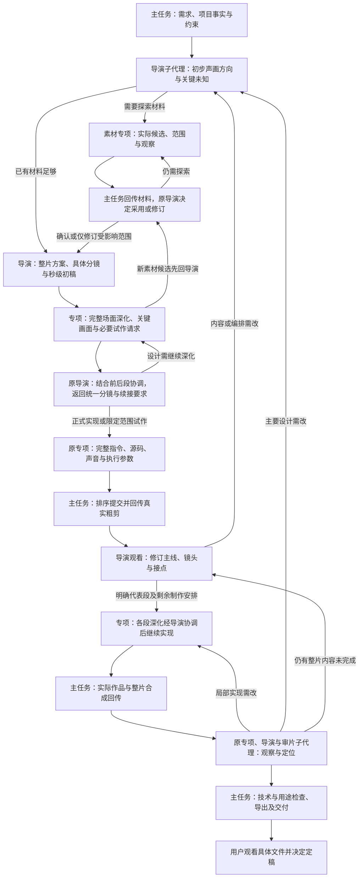

# VideoFlowCut 总导演分镜驱动的整片制作链路优化方案

初稿：2026-09-10；本轮局部更新：2026-09-15。

状态：第 14 节的执行细化方案已获用户确认，本轮仅更新 docs；实施等待用户另行指令，未据此修改 Skills、代码、配置或部署。其他历史待评估技术方案保留原状态，不因本次确认自动进入开发。

本文承接本轮已经对齐的创作架构：**用户可以只提供主题或剪辑目标，也可以同时提供部分或全部素材。总导演以主题、目标和约束为起点，结合已有材料（如有）提出初步故事方向和声画构想；根据需要组织事实调研、素材搜索与获取、生成或原创制作，再依据实际材料完善剧本、段落、具体分镜和初始声画节奏；视觉、动效、声音专项据此细化制作；总导演持续观看实际结果，修改设计与编排，负责最终成片。**

本次只更新本方案与配套具体修改审阅稿中相关的创作方法、职责、交接和验收说明。文中的开发、Skill 调整、测试和发布均为后续建议，不表示已经完成。此前的视频拆解和源码审计保留为依据；其余文档与运行文件不在本轮修改范围。

本轮从七条参考片的实际画面发展重新校准方法：以完整声画场面为交接单位，写清叙事怎样发生、素材怎样被组织、文字与讲述各承担什么、预览后怎样共同修改。固定字幕、稳定构图和持续实拍均可保留；是否采用取决于它们在本片中的作用。

具体细化四件事：总导演实际怎样构思（第 4 节）、怎样做可观看的声画粗剪（第 5.6 节）、专项怎样把分镜做成具体指令和作品（第 6.7—6.8 节）、审片怎样发现原设计或实现的问题并返工（第 8 节）。**它们主要应用到现有 Skills 的具体工作阶段，由真实子代理执行；调度、保存和渲染复用当前链路，不新建自动导演引擎。** 逐环节落点见第 9.1、9.6 节，拟用 Skill 正文见[具体修改审阅稿](</E:/ai/VideoCut/docs/VideoFlowCut_总导演主线与素材补全_Skill具体修改审阅稿.md>)，均待用户统一确认实施。

建议先读第 4.6、5.6、6.6、7.2、9.1 节，再看附录 A 的参考观察。第 2 节和附录 B 是初稿时期的审计依据；本轮核对了当前角色与交接规则，没有重新验证全部历史能力结论。第 9.3—9.4 节保留原待评估技术方案，不代表当前已发布能力或已批准开发；第 9.5 节已按当前人工定稿规则收窄。

**本次确认内容集中在第 14 节。** 它具体说明总导演首次构思、专项首次深化、原导演常规协调、同一作者实现、样片之后继续整片，以及交接、保存与验收。第 3.2、6.7、7.1、9.2、9.6 节同步对齐直接相关的职责与顺序；配套审阅稿只同步相关交接，不扩展素材获取、媒体能力或发布范围。

## 1. 要优化出的实际效果

无论用户只提供主题或剪辑目标，还是同时提供部分或全部素材，总导演都应能从需求开始构思观众将经历怎样一条片：提出能进入内容的第一段声画，安排后续发生的事、认识或感受的变化以及结束方式，再结合已有材料的审阅和必要的外部探索，完善故事、剧本、段落、分镜和节奏。用户提供素材不是启动规划的条件；尚未取得的画面明确为待寻找或制作，不能当作已经存在。推进可以来自行动、关系、判断，也可以来自空间发现、感官积累、情绪与主题关联；结尾按照本片承诺完成体验，不统一要求反转、升华或回收疑问。

视觉丰富度应体现为具体表达：真实素材接管画面、全屏视频退成窗口、人物从环境中成为重点、多个动态画面形成比较、同一对象进入不同情境、文档从全貌进入局部、操作产生可见结果。图形、花字和镜头运动都应参与这些表达，并有足够的美术与运动完成度。

“有故事、有起伏”也适用于温馨、平静的视频。例如先建立一个日常动作，再发现人物在意的细节，从环境全貌进入近处反应，最后回到更有意味的全貌。起伏可以来自发现、尺度、空间、声音和情绪的变化，不必制造冲突或持续提高刺激强度。

本方案要求同时兑现三件事：

1. **整片编排成立。** 观看顺序、段落边界、信息安排、节奏与结束方式都有内容依据，能够完成本片选定的体验。
2. **具体画面成立。** 素材选择、排印、主体造型、构图、空间层次、运动与声音真正完成导演的表达。
3. **实际观看成立。** 连续声画中能看懂、读清、感受到变化；局部精彩放回整片后仍然自然。

不能以增加动效数量、提高强度字段、扩大提示词字数或新增几个角色名称作为完成标准。

## 2. 初稿审计定位的问题与保留依据

### 2.1 已经具备的能力应保留

现有 Skills 已包含观众承诺、故事脊椎、信息账本、Scene 内部状态、连续对象、完整动效指令、秒级初始节奏、真实声音、版本固定、草稿与交付区分、五轮审片等要求。工程也已有 Story、NarrativeMap、VisualTreatment、Scene、SoundPlan、ManagedMotion、ProductionRun 和 EditorialReview。

因此，本次应局部修正职责、强化实际交接和验证，再补明确的媒体能力缺口。无需另建一套平行的视频生产系统。

### 2.2 从职责到成片，存在四个相连的缺口

| 环节 | 当前可核对的情况 | 会怎样影响成片 | 本方案的处理 |
|---|---|---|---|
| 总导演构思 | `production-director` 偏重路由、边界与 Gate；交接偏重段落目的，缺少从素材推导具体编排的执行方法。 | 段落和分镜可能先套结构再填内容，主要画面又由下游临时发明，难以统一整片。 | 按第 4—5 节从主题、实际发展与可取得材料构思整片，推导顺序、段落、完整场面和节奏，保留取舍依据，再交下游。 |
| 指令与源码 | `remotion-production` 已要求完整指令，但历史执行仍出现设计和实现缩成标题、结论与中间简图。 | 必要的关系变化和持续对象丢失，需要逐步经历的内容过早显示完整结果，后面只有等待。 | 按第 6 节把分镜发展成美术与连续运动，再将指令、源码和真实事件对照；区分设计不足与实现遗漏。 |
| 审阅与修订 | 已有动态审阅与整片证据门禁；前轮两个任务记录中的待审状态和少量静帧不足以证明完整动态通过。 | 生成成功、草稿可看容易被理解成效果已经成立，未完成的观看与修订没有真正收口。 | 保留草稿取证路径，明确待审事项；总导演完成粗剪、代表段与整片实际观看。 |
| 动态素材编排 | 当前原创受管作品可使用图片，但不能自由调度动态视频；已有单画中画与镜头处理有边界。 | 一些参考片中的真实视频多窗运动、连续缩放接管无法直接按设计落地。 | 单独补受管视频参与原创合成的能力；遇到缺口必须反馈，不静默变成文字卡。 |

前轮源码审计还确认：优质独立案例与差作品均可使用同一受管渲染路径，提交源码与保存源码一致，没有发现 Worker 把复杂设计自动改成简单动画的证据。也没有发现“先尝试复杂多窗、工具失败、于是被迫退化”的完整执行证据。**制作端的构思、指令和源码兑现问题，不能全部归因于工具不支持。**

`VisualTreatment.intensity` 不能直接生成更强的运动，历史 `allowHighDensityMotion=false` 也没有被证明是受管作品自动降级的原因。这些字段不应成为解释画面缩水的替代答案。

### 2.3 现有测试验证了什么、没有验证什么

当前路由与 Skill 测试能够检查文件可发现、一个主工作流、工具名称、交接章节和发行一致性。渲染与质量测试能验证版本、范围、资源、审阅状态及交付条件。

这些测试不能证明总导演实际构思了一套好分镜，也不能证明 Agent 已经完整观看，更不能证明“同一人物留在前景”比“标题卡入场”更适合本段。需要增加真实创作验收，检查实际交接文本、生成代码和连续声画之间的对应关系。

## 3. 角色架构：一个持续负责的总导演

### 3.1 总导演与现有主工作流是什么关系

保留 `production-director` 入口，并继续只选择一种主要工作流：人物口播、视觉解释片或 Vlog。

**所选主工作流是总导演完成该类型视频的方法，不是另一个接走整片创作责任的人。** 当前任务中的总导演责任贯穿素材审阅、故事构思、分镜、制作、观看和修订。不能在完成路由后结束，再等专项全部完成才回来审批。

按当前角色合同，主任务读取 `project-basics → production-coordinator`，负责事实、调度、正式写入、生成与渲染提交、证据回传和交付；整片创作由真实导演子代理承担。导演提出专项范围，主任务分派视觉、动效、声音等专项子代理，按需由同一专项负责人读取多个相关 Skills；专业审片由审片子代理承担。主任务不补写创意，创意子代理不递归分派、不直接写正式项目。无需新增常驻后台服务或另一套审批系统。

### 3.2 决策边界

| 责任 | 必须亲自作出的决定 | 交出的具体内容 |
|---|---|---|
| 总导演 | 选出实际开头，试排后续发展，安排关键变化与反应、确定结束，形成段落与分镜，决定主要画面、整体节奏和声音方向，并按实际观看修订。 | 有素材和取舍依据的整片故事、段落、分镜、秒级参考节奏、前后接续、声音意图与约束。 |
| 视觉导演职责 | 在导演分镜上选择和处理素材，确定主体造型、排印、构图、光色、材质、图层和整片视觉语言。 | 带真实文案和素材的关键画面；具体采用范围；遮挡、分层和可读性安排。 |
| 动效导演职责 | 把分镜中的画面事件做成有主次、有路径、有速度变化和收势的连续运动；安排实拍窗口、图形、花字和虚拟镜头。 | 完整生成指令、源码、固定版本作品、实际动作事件与段内节奏修订。 |
| 声音导演职责 | 将导演安排的情绪、重点和跨段关系落实为旁白表演、原声、音乐、音效、静音与混音。 | 声音方案、实际采用素材、对齐依据、带前后文的试听与修订结论。 |
| 主任务与审片专项 | 主任务做确定性技术检查；审片子代理观察真实声画，区分设计和实现问题。 | 对应版本、时间段和实际事件的观察、问题及修订建议；导演处理创作与跨段取舍，最终由用户对具体交付文件定稿。 |

专项主动补足段内构思、观看位置、美术、动作交叠和收势，并可自主调整字号、运动曲线、局部交叠、声音包络等细节。每份完整深化稿、代表段及阶段合成都正常回原总导演统筹；改变主要比喻、关键素材、发现顺序、主画面方式或跨段节奏时提前反馈，是额外的协调要求，不能理解为只有这些变化才回导演。

总导演不必预先给出所有像素坐标与代码参数，却必须依据第 4—5 节完成具体画面、主要事件、观察尺度和接续决定。专项按第 6 节细化载体、美术、空间与运动，总导演协调后回传统一采用稿，由原作者继续实现。尚不成熟的设计继续构思，必须靠动态判断的部分安排试作；导演采用表示整片选择已经协调，不代替专项完成专业设计。具体派发与返回见第 14 节。

## 4. 总导演怎样构思一条愿意让人看下去的片

这一阶段发生在导演子代理的主线构思阶段，先于正式批量制作。导演接收主题、剪辑目标与约束，结合可选的用户素材提出初步开头、发展和结束构想；已有材料可直接审阅试排，缺少材料则先探索或制作关键声画，根据实际发现修订故事，再完善段落与具体分镜。镜头数量与初始总长在这些选择中产生，不预先给定一套段数和时间表。吸引力不能只从题目的知识含量推断，也不能用“观众会好奇”证明。每一步都应形成具体表达决定，取得材料后再以实际声画试排检验。

这些步骤可以因新素材或试剪结果返回修订。每一步保留实际采用的决定及重要取舍即可，不要求再建多张评分表，也不能用填完栏目代替创作。

### 4.1 从主题出发，按素材条件展开构思

输入是主题或剪辑需求、目标观众及旁白、时长和交付边界，连同用户已提供的材料与已知事实（如有）。素材与事实资料可以在规划过程中逐步取得，不要求用户先准备齐全。总导演按当前素材条件开展工作：

| 用户起初提供的素材 | 规划如何开始 |
|---|---|
| 没有素材 | 从主题与目标提出初步故事方向、关键声画和需要核实的问题，组织事实调研、外部素材搜索与获取，或生成、原创制作；根据实际结果完善故事与分镜。 |
| 有部分素材 | 审阅已有材料，判断能支持什么表达，同时探索或制作关键缺口；已有与新增材料共同反馈故事、剧本和分镜。 |
| 素材充分 | 直接审阅并展开具体编排，必要时再补材，不强制增加外部搜索。 |

材料取得后，区分实际可见或可听的事实、有材料支持的关系、讲述者的解释、尚待确认的信息。正式采用前仍须查看真实内容，文件名、转写关键词和单张缩略图只帮助发现候选；这一要求不等于用户一开始必须提供素材。

审阅时寻找完整动作、结果、反应、前后差异、条件变化、人物选择、空间细节和有表现力的声音。对于可能采用的范围，确认动作是否完整、人物处境是否清楚、来源能证明到什么程度、画面或声音本身有什么值得观看的变化。不要把素材只归纳成一组主题名词。

主题、目标和约束是规划起点，用户素材是可选输入。通过已有材料审阅或外部探索，逐步得到可用内容、真实范围及连接依据，并据此完善主线。尚未取得的材料保留具体缺口：缺什么事实、真实过程或表达画面，缺了会使哪一处无法成立。材料只证明结果时，不靠相邻剪辑制造原因；应补查依据、修正判断或改变表达。

缺事实，提出待核实的具体主张和来源；缺真实动作或反应，补查同一事件的材料；事实清楚但缺画面，提出主体、动作、观看尺度、所需连续源长度和前后接口，由素材专项搜索、生成，或由动效专项原创。网络、MiniMax 与原创图形都可作为首版计划的主动选择；生成示意不冒充真实证据。

实际候选返回后，导演把它放回拟定位置试排：只能完成一部分作用就补剩余部分；换载体可成立就局部改分镜；关键事实或整个发展不成立才重排主线。内容不足时在题目和授权范围内继续研究可展开的过程、比较或体验，确实无法满足再说明影响。不能陷入“等素材才能构思、等主线才能补素材”的循环，也不以弱相关素材填长。

### 4.2 先选出实际开头，再写整片怎样发展

导演先将用户要讲的题目变成可以进入的具体处境、行为、对象或观察。回到材料中选取能够辨认的源范围，或写出需要制作的第一段画面和实际文稿：观众第一眼看见谁或什么、听见哪句话或什么声音、接下来能跟随哪个过程。只写“以反差吸引用户”“建立观看价值”仍没有完成这一步。

随后立刻接排后面一段。开头呈现了正在进行的动作，就试接它的过程或后果；呈现了判断，就给观众看参与判断的实际依据；呈现了一个空间或人物状态，就继续选择能深化这次观察的细节与声音。选择的依据是两段连起来能否形成可进入、可延续的观看过程，不能只比较开头孤立时有多刺激。

开头有实质不确定性时，用已有片段和简短文稿试排不同的进入方式，比较进入内容所需的背景、后续能展开什么、是否过早用尽最重要的内容。只比较影响本片的选择，不机械生成三套片头；用户已明确开头或锁定声音时，在允许的画面与编排范围内试排。

再写一版从开头到结尾的连续叙述，写本片真实内容，不写“钩子—展开—高潮”等空阶段名。逐项安排将发生的行动、观察、判断和感受变化，并写出一个具体结束。结尾可以在试排中改变，不必先决定抽象的“价值”才能开始构思。缺少的事实与画面按第 4.1 节留明需求，已有旁白与用户硬约束同时进入方案。

温馨、幽默、观察、欣赏与陪伴可以依靠人物细节、熟悉感、节拍、空间和声音本身吸引人。对此要选出实际可感受的材料与呈现方式，不强造疑问、危机或反转。这里产出的是可试排的整片声画构想；“观众为什么愿意看”是对这些选择的说明，不能替代选择。

### 4.3 找到内容自身的推进关系

视角确定后，判断哪些材料能使下一步自然发生。连接应来自材料中的真实关系，以及本片选择的观看方式。以下是可用的判断知识，不是必须依次使用的结构模板。

| 材料提供的关系 | 如何组织观看 | 判断是否适用 |
|---|---|---|
| 行动改变处境 | 跟随目标、行动、结果和反应，保留造成变化的关键过程。 | 动作与结果确实有关，观众能理解人物为何行动。 |
| 条件改变判断 | 先建立判断所需依据，再引入会改变它的条件或范围。 | 新条件实质影响理解，不是为制造反转故意隐瞒必要背景。 |
| 机制需要理解 | 从可辨认的现象进入必要关系，再用材料、操作或结果验证。 | 每次解释解决前面尚未解决的问题，没有重复换词。 |
| 多个对象需要比较 | 先建立共同尺度，再呈现重要差异及其意义。 | 比较维度有效，条件差异没有被剪辑或画面掩盖。 |
| 过程产生积累 | 选择能显示进展的阶段，压缩重复劳动，保留积累后的变化。 | 观众能感到增加、消耗、熟练、距离或处境等发生变化。 |
| 空间、人物或细节逐渐被认识 | 通过观察距离、细节发现、感官积累和主题关联逐步展开。 | 稳定观看或新的观察确实深化体验，不靠旁白硬说“发生了变化”。 |

总导演选出主要推进关系，再决定哪些关系只在局部使用。事实先后、空间游历或主题并置也可以成立，不能要求每两个镜头都具有因果关系。

如果顺序只能用“然后又介绍另一个知识点”解释，应检查是否缺少共同关注点。若几个部分只是并列说明，就明确组织比较或分类，不硬编成事件故事。

把选中的关系写成实际发展：起初是什么处境或状态，随后哪次行动、条件、观察或感受改变它，哪些过程值得展开、哪些可以略过，最终落在什么结果或体验上。再从结尾向前检查是否有足够铺垫，从开头向后检查每一步是否仍在发展同一个关注点。由此形成的是成片剧本的内容，不是“困境—反转—升华”的阶段标签；它可以包含持续体验，也可以以新的观察改变原先的理解。

例如游戏参考片依次让人经历设备改善却不开心、身体与注意疲劳、任务接管时间、清完仍舍不得离开，再进入自主玩法与实际体验。可迁移的操作是让后一部分改变前一部分的理解或感受；不能把这一顺序套成所有题材的五段模板。分镜随后决定如何把本片自己的发展变成实际画面。

### 4.4 实际编排铺垫、发展、变化和反应

先把拟采用的材料和文稿按第 4.2 节的主线顺序摆出来。对关键变化向前检查：观众必须先认出哪个对象、知道哪个条件、看见什么状态，才能感到这次变化？把必要的画面或声音放到变化之前。必要背景只够定位就可以，不必一次讲完；不能为悬念扣住理解当前内容的前提。

再从开头顺着试排。每接入一镜，具体决定它怎样接住前面的关注：动作继续接近结果，新的条件改变刚才的比较，细节改变对整体的认识，真实反应显出事件的分量，或声音与空间使体验继续深入。接不上时，实际移动素材、补前提、改变观看位置、压缩重复或移走无关内容。不能只在说明中加一个“因此”，画面却仍是并列知识卡。

希望观众参与判断时，先给出可辨认的判断依据；希望观众期待一个结果时，先让过程的方向可见；希望引导注意画外或未揭示的内容时，先有真实视线、动作、声音或内容线索。然后明确后面哪一镜回应它。字幕、背景文字、旁白和画面一起试排，防止嘴上说“稍后揭示”，画面已经将答案清楚写出。结果先行也可用，此时要实际展开仍值得看的过程、依据或体验。

重复过程先建立足以认出的动作与节拍，再选取能表现进展或差异的重复；熟悉之后可以压缩中间步骤，把时间给发生变化的那次。变化可以是行为、条件、数量、尺度、观察位置或声音关系的改变。它必须让观众看到新的关系或获得不同感受，不能只是给相同内容换背景色。没有适合的重复就不套这个手法。

重要变化出现后，再选取实际反应、后续行为、前后状态并置、细节辨认或欣赏停留。它们让结果的分量有机会被感到。没有人物反应素材时不借别处的表情制造反应；改用可证实的后果、观察或说明。也不能一看到结果就马上切走，使已经建立的期待没有落下来的时间。

末段从最后一个有用的结果、确认、反应或体验落点向后试：还留这一镜会增加什么实际观看？需要余韵就设计画面和声音怎样退出；已经完成就结束或接后续内容。总结、回收开头、行动号召均按本片需要选择。

以上是导演排列、删留和试剪时的操作，不是每段必须依次套用的结构。并列比较、平静观察和直接说明可以成立。纸面上的“观众将期待、惊喜、共鸣”只是待验证的判断，必须在第 5.6、8 节找出实际声画依据，不能声称已经测得观众反应。

### 4.5 让段落从完整的观看任务中形成

沿已经推导的顺序，把共同完成一次理解、行动、发现或感受的材料组织成一段。形成段落时，总导演实际执行以下判断：

1. 找出这一组内容开始时的关注点，以及需要建立的最少语境。
2. 排列内部材料，说明每一项怎样推进、补足或深化这次观看。
3. 判断到哪里已经完成了本段任务，是否还需要结果确认、反应或欣赏停留。
4. 找出接下来必须变化的观看对象、问题、空间、证据或组织方式，确定下一段为何此时开始。

同一对象、问题和观察方式仍在有效推进时，保留在同一段；观看任务已经改变、继续塞在原段会使主次不清时，才拆开。段落边界不能由句号、源文件边界、动效时长或知识点数量决定。

随后检查删并：删除一段，如果理解、行动、情绪、欣赏过程与必要连接均无损失，考虑删除；相邻段承担同样作用且没有新增体验，考虑合并；一段同时要求观众完成互相竞争的任务，考虑拆分或重新组织。

由此得到实际段落数、顺序、内部材料和承接理由。段落标题只是这些决定的摘要，不能反过来成为填内容的空槽。

### 4.6 总导演把发展写成完整声画场面的分镜

输入是整片发展的当前版本、段落作用、可用或待取得的材料、前后状态和声音约束。导演先写这一段实际发生什么，再选择观众从哪里看见它。不能先把文稿按句切开，再分别派“字幕、B-roll、动效”去填空。

**先选能承受这次发展的载体。** 人物、环境、纸面、页面、持续播放的视频或并置窗口，都可以承载多步变化。选择依据是它能否让本段过程被看见、保留必要联系，并适合本片的气质与真实性要求。以下用于推导画面，不是效果名到模板的映射：

| 本段实际怎样发展 | 导演据此决定什么画面关系 | 专项继续细化什么 |
|---|---|---|
| 内容持续累积并改变处境 | 由哪个对象或空间承受累积，后来内容怎样改变整体，先前内容是否还需留在场内 | 素材或图形的组织、拥挤程度、层级、进入顺序与运动力度 |
| 表层现象背后存在机制 | 保留哪一个表层参照，从哪里看见与它相关的内层，内层变化怎样重新解释表层 | 展开、分层、遮挡和视点变化；需要直接切镜时如何保留对应 |
| 局部逐渐显出整体作用 | 起点是哪个可辨认局部，进入更大范围后它位于哪里、承担什么作用 | 尺度、共同父层、相对位置及接入真实素材的切点 |
| 人物感受或观看立场改变 | 人物与环境原来是什么关系，何时改变观看距离或重构空间，讲述怎样把体验转为思考 | 人物与环境分层、画框、画内文字和视线；真实分层条件不足时反馈 |
| 几个过程需要并置 | 比较或并列的共同参照是什么，哪些素材同时可见，观众先认哪项、再认哪项 | 各窗口的内部源动作、裁切与标签时序；窗口可稳定，不强制全都飞动 |
| 一段体验值得持续 | 让哪个真实动作、空间、表演或声音继续，观看何时充分、之后怎样转换立场 | 选段余量、构图、声音进出和必要文字；不为每句旁白另加图形 |

**再写整幅场面怎样发展。** 分镜用本片对象和实际文稿说明：起初整幅画面是什么，观众先注意哪里；随后谁或什么关系变化；原内容保留在哪里、何时退让；文字、讲述和其他声音各补充什么；最后哪个画面或声音接管。明确采用的素材范围、待补项与大约秒数。相同对象可跨句发展，一次讲述也可跨多个镜头；故事段落、分镜、Scene 和作品不必一一对应。

导演同时决定主要观察尺度、同屏还是先后呈现、实拍何时成为画内对象，以及直接切镜还是连续变化更适合。不是所有镜头都先全貌再细节，也不是所有交界都做变形。对于需要持续发展的对象，保留它的身份和观众能辨认的关系；切到新的地点、时间、材料或观点时，可以直接切换。

这些决定应让下游知道本镜究竟要做成什么。导演不必给每个像素和缓动参数；视觉、动效、文字与声音负责人在同一场面内细化，改变主要表达或跨段顺序再回导演。字幕带和留白在这时结合构图安排，不先永久占满某个区域，也不强迫每镜换位置。人物表演、文档阅读、录屏操作或环境观看本身成立时，允许它们持续承担画面。

### 4.7 交出能被下游直接细化的整片方案

导演交回四份相互对应的内容，可以在同一文档或已有记录内表达，不新增四套对象：

- **整片叙述与采用顺序。** 用本片内容从开头写到结束，说明重要发展；附已选源范围、关键事实和未解决的素材需求。
- **段落与完整场面分镜。** 写清起初整幅画面、第一关注、实际变化、仍保留的内容、文字与讲述分工、出口与下一镜；连同主要载体、观察尺度和前后关系。不能只给主题、情绪或效果名。
- **秒级声画初稿。** 写大约起止、主要变化与必要阅读、反应的位置、可交叠关系；区分估计时间、实际声音时间与锁定范围。
- **本轮先验证的部分。** 指出哪些关键表达一旦不成立会影响主线、什么粗稿能检验它、还需哪些素材或声音。保留重要取舍及本轮采用版本。

专项收到后应能继续决定造型、构图、路径、速度与声音，而无需重新猜“这段究竟拍什么、先告诉观众什么”。缺这些决定，主任务回原导演补全；只有局部专业选择未定，交相应专项细化。

镜头、段落、Scene 与受管作品不要求一一对应。实际保存复用第 9.2 节对象；导演返回创意产物与依赖，主任务按当前合同排序写入并读回，不能让导演或专项直接改正式项目。

## 5. 总导演怎样设计、估计和修订节奏

### 5.1 同时处理整片、段落与镜内三个尺度

节奏设计从内容选择就已经开始。先选择哪些经历值得展开、哪些重复可以略过，再安排观看顺序、主要变化与停留；不能先画一条固定强弱曲线，再往里面填素材。

| 尺度 | 总导演需要作出的选择 | 发生问题时回到哪里 |
|---|---|---|
| 整片 | 哪些经历展开或压缩，重要发现何时到来，哪些部分形成对比，结尾怎样完成承诺。 | 选材、视角、段落取舍与顺序。 |
| 段落 | 先建立什么，再让什么变化，何处辨认、比较、阅读、反应或欣赏，下一段何时接管。 | 段内组织、具体分镜与表达方式。 |
| 镜内 | 对象、镜头、文字、素材内部动作与声音怎样起动、交叠、落定和退出。 | 构图、动作路径、局部时间与声画配合。 |

整片平淡不一定由镜头太长造成，段落难懂不一定由动画太少造成。先判断问题属于哪个尺度，再决定改法，不能全部交给动效专项统一加速。

还需区分三个问题：**动作速度**是元素或人物移动得多快；**剪辑节奏**是切点、注意事件、交叠与停留怎样分布；**观看进展**是正在跟随的事情或感受怎样发展。运动很多但一直重复同一关系，应改内容、视点或编排；关系成立而动作来不及看清，才主要调局部速度。长镜头可以持续发展，快速切换也可能没有进展。

### 5.2 分别安排信息、情绪、视觉与声音

每段先明确希望观众如何观看：聚焦一个事件、比较几个对象、跟随一个过程，还是进入人物、环境与氛围。然后安排四个方面怎样共同支持这种观看。

信息安排决定何时需要辨认新对象、建立关系和作判断；情绪安排决定期待、反应与感受何时发展；视觉安排决定景别、密度、空间、运动和材质怎样变化；声音安排决定此刻听谁、听什么、何时预示、连接或释放。

四者不要求同步升降。高信息段可以保持声音和背景稳定；稳定画面中人物、环境声或音乐仍可推进体验；重要变化也可以借助声音退出获得力量。多个元素支持同一重点时可以同时发生，互相争夺不同重点时应错开。

视听愉悦、材质和氛围有自身价值，不要求每一处运动都增加新事实。总导演要判断这些形式怎样使本片更有表现力，以及与前后是否形成有效差别；不能用元素数量、运动量或切镜次数代替判断。

### 5.3 秒级初稿从实际材料与观看需要估出来

先核对任务范围：用户明确锁定的讲稿、声音、总长，以及仅做包装的范围，属于约束；已有文稿或音频文件本身不构成锁定。允许共同创作时，讲稿、画面和声音意图一起试排，现有录音可作粗稿，导演按成片效果决定删改、重排或重录。真实人物原话的剪辑保护原意，不能把改写冒充本人原话。

标出当前采用声音的真实语句、重音与停顿，连同素材事件估时。它们用于安排本版粗稿，声音调整后重新核对，不把第一次配音结果永久变成画面时钟。只要求包装或明确锁定声音时，在允许的内部编排与后续画面中解决时长问题。

对每个分镜，分别估计建立对象与空间、完成主要动作、辨认关系、读清文字、感受反应和衔接下一镜需要的时间。以真实素材、目标观看尺寸和实际文案为依据，不使用统一镜头长度或仅按字数决定阅读时间。

随后明确哪些步骤有依赖、哪些可以交叠：需要先辨认的对象不能在关键变化结束后才看清；文字阅读从真正达到可读状态开始；辅助动作不必全部结束后才允许下一主动作。按交叠后的实际占用形成秒级初稿，不把所有动作时长简单相加。

将估计放回整片，检查篇幅是否与内容重要性、观看价值和固定约束相符。若总长过大，先删重复、减少不必要的任务或改用更直接的表达；必要内容依然过快，就调整相应范围。用户锁定声音或总长时，不擅自删改，先在允许的内部编排中解决。

完成后才得到可制作的起止安排和参考总长，并注明估计依据及仍需预览验证的接点。

### 5.4 时间规则沿用已确认正文

> **以下时间以秒表示，是首版动画的节奏设计，可根据实际效果调整，不是必须填满的时间槽。**
>
> 制作时先按这个安排实现完整动画，再连续观看预览。根据动作速度、交叠、文字阅读、旁白和前后画面的实际效果，调整各动作的起止时间及总长度。
>
> 如果内容已经表达完整，就提前衔接下一画面或结束；如果必要动作过快、文字读不清，则延长对应部分。不要为了保持示例总长而补静帧、拖慢收尾或增加无意义微动。
>
> 调整时保留主体、美术和动作接续的设计意图，不把整段动画简单统一加速或减速。最终以实际成片的表达和观看节奏验收。

用户明确锁定总长、讲稿或声音，或任务仅允许包装时，保留相应约束，通过内部编排和后续实际画面解决空等。可改的旁白则与画面一起修订，不将“已有”视为锁定。字幕阅读、人物反应、证据辨认、感官欣赏和情绪停留都有正当用途，不能因为暂时没有新元素就一律删除。

最终执行帧数由当次确认的秒数与项目帧率换算。源素材时间、作品局部时间和整片时间分别标明；初稿时间不是永久锁定的时间槽。

### 5.5 根据具体症状选择修订方法

总导演先连续观看，再定位不成立的范围，比较预定观看过程与实际注意到的内容。时间码指出症状位置，根因可能在更早的选材、铺垫或分镜中。

| 实际症状 | 先检查的原因 | 优先考虑的修订 |
|---|---|---|
| 平淡 | 内容、表现形式或观看关系是否持续重复，预期的变化是否没有形成。 | 删重复、重排材料、改变观察距离或重做画面表达；素材本身不足时调整视角。 |
| 空等 | 辨认、阅读、反应或欣赏已经完成，下一件值得看的事是否迟迟未开始。 | 提前接续、缩短尾部，或安排有效后续画面；保留锁定声音与总长。 |
| 过载 | 是否同时要求观众完成过多任务，多个重点是否互相打断。 | 减少竞争、错开揭示、改用直接表达，必要时延长对应部分。 |
| 碎裂 | 是否频繁重新建立人物、对象、空间和关系，却没有获得相应收益。 | 合并不必要的切分，保留对象、补动作或声音连接，必要时重排镜头。 |
| 动作接点生硬 | 路径、方向、速度、源视频时刻或新旧焦点是否没有接上。 | 修对应接点与局部动作，再连同前后画面复看。 |

安静、缓慢、低运动量不能直接判为空等；有意的跳跃和反差也不能直接判为碎裂。判断依据是本段观看意图和实际效果。

修改后查看原问题是否消失，有没有造成新的阅读、声音或后续镜头问题。跨段顺序或整片节奏改变时重看整片；纯局部动作修订先复核相关上下文。具体观察与修订反馈沿用第 8 节。

### 5.6 声画粗剪具体做成什么、怎样用

声画粗剪是按当前分镜从开头到结尾可播放的一版实际声画，用于尽早检验观看过程。纸面分镜、镜头清单、只听旁白和只看关键帧分别有用途，都不能代替这份产物。它进入现有 Timeline 与 Preview 流程，不要求新增“粗剪系统”。

**导演先确定这版要验证什么。** 读回第 4.7 节产物，指出主线依赖的具体变化、容易失去理解的接点、需要观众感受到的反应与节拍。主任务把对应范围交给专项制作；简单且已经给齐参数的拼接由主任务执行。

**粗稿保留会影响判断的声画条件。** 采用真实源范围和本版实际文案；受约束的旁白按约束使用，允许修改的文稿与声音明确标为草稿，预览后可删改、重排或重录，取得新声音后重新估时。需要依靠音乐起止、现场声或音效来判断节拍的段落，先有可试听的候选及实际进出点，不能全留到最后。装饰纹理、精细光影等不影响本轮判断的部分可稍后完善。

若动画本身承担比较、积累、选择、揭示或对象接管，粗稿必须演出对应变化、先后与阅读尺度。不能用“此处做高级动画”的标题卡验证这段是否好看。可先简化材质与次要细节，但同一对象怎样变化、何时看清、何时接管和声音如何作用都应真实发生。关键内容尚未做出就标明该段未验证；主任务继续可执行的制作，不把整片排满占位卡叫作主线已成立。

**先做容易影响全片的试排，再拼成整片粗稿。** 关键转折依赖尚未取得的镜头，先取得或试作该范围；只是在两个开头或两个接点之间不确定，就用相同上下文比较那一处，不重做多套全片。代表段不取代整片粗稿：前者检验专业做法与接口，后者检验从开头到结尾的发展。

导演收到真实可访问媒体后，先连续看，再回到问题时间段。记录实际注意到了什么、哪里需要等、哪里来不及、哪次变化没有感到，随后对照原计划。下一镜的起点要连同上一镜的收势一起调整；不能只在孤立画面中拖一个时长滑块。需要更多辨认就改尺度、竞争层或局部停留；已完成作用且不再支持辨认、比较、记忆、情绪或体验的重复，就删并或提前接续；整段没有发展则回到主线和镜头顺序。

画面和讲述在同一粗稿内比较各自作用。画面演出过程时，讲述可以解释原因、态度、意义或提出下一次观察；重要措辞可以被字幕转写，也可以作为画内问题或数值保留。听和看表达相同内容并不自动构成冗余，只有重复已经妨碍发展时才删减。若必要图形出现过迟，造成当前语句误读或无法跟随，就调整声画接点，或在任务范围内改写句子；若过程值得亲自经历，就减少盖住它的讲述或文字；若长旁白仍有必要，就补足实际画面发展。导演决定取舍，相关专项共同修订。

粗剪交回的结果包括：采用的方案与输入版本、实际 Timeline/Preview、临时声音或画面的范围、真实观察、这次修改了哪些镜头及原因、仍待检验什么。主任务提交修订并回传新媒体，导演复看受影响上下文。局部时长改变带动后续落点、字幕或声音时，由对应负责人依据实际差异修订，不能只换 Revision 重发旧方案。

这一步增加一次尽早试剪的成本，目的是减少全片精修后才发现结构无效的返工。已经存在合适粗剪时直接读取并继续，不为了流程另做一份。AI 暂时无法连续感知时保留相应未审结论，按当前规则继续能做的制作与导出，不把未审写成效果通过。

## 6. 视觉与动效怎样把导演分镜发展成完整生成指令

本节接收总导演已经确定的具体画面事件、主要对象、发现顺序和前后接续。专项在此基础上解决素材组织、美术、空间、动作和时间的专业设计。主要画面方案尚不明确时，先回总导演补足或提出候选供其判断，不能把抽象目标直接当作完整交接。

完整生成指令应记录已经完成的设计选择。仅要求填写“主体、构图、动作、时长”几个栏目，不能产生这些选择；需要按以下方法逐步形成。

### 6.1 先识别这段画面真正要发生的关系变化

从导演分镜中找出承担事件的主体、建立语境的环境和帮助理解的辅助信息，确认谁影响谁，什么被揭示，哪种状态要变成另一种状态，注意力需要怎样转移。

同时明确情绪与观感任务。迫近、舒展、迟疑、惊喜或沉浸等感受，需要通过观看距离、构图、运动和声音共同形成；不能只写进风格形容词。

输出应说明这段可见过程及其必要关系。只提取名词再为每个名词找图标，会丢失对象之间发生的事情。若导演意图与现有素材不能共同支持所需关系，返回缺口与保持表达的替代建议。

### 6.2 把表达关系转成视觉设计约束

从不同案例中抽象的知识，应说明某种表达必须让观众追踪什么，以及哪些变化会破坏理解。以下关系可用于不同题材和载体，具体手法还需结合本片构图选择。

| 表达任务 | 设计必须保留的关系 | 选择动作时应排除的问题 |
|---|---|---|
| 从集合中选择一个对象 | 被选对象的来源可辨认，观众能跟随它获得重点。 | 对象突然在别处重建，无法确认是否仍是原对象。 |
| 比较前后或不同方案 | 保留必要共同尺度，使重要差异可以被辨认与归因。 | 同时改变所有条件，或用不一致的视觉比例误导比较。 |
| 展示积累、占用与负担 | 保留承受变化的对象或空间，新增内容确实改变其状态。 | 只叠装饰，积累数量与所表达事实无关，原对象不再可见。 |
| 从局部进入整体 | 原局部在整体中保留可识别的位置、归属或功能。 | 每个层级另起一张卡，观众无法连接局部与整体。 |
| 揭示条件或隐藏信息 | 新信息与原对象建立明确关系，并影响相应理解。 | 新增信息与原对象或当前疑问关联不清，无法改变相应理解，或无理由延迟必要背景。 |
| 把注意力交给新对象 | 新重点建立时，旧重点有明确的保留、退让或退出方式。 | 两个焦点争抢，或旧画面清空后长时间等待新重点。 |

这些约束不直接指定某个效果。缩放、位移、遮罩、真实切镜、内部展开或其他方式，都应根据对象特征、所需空间与情绪选择。不能把表格再次编译为“看到选择就用扇开、看到条件就用手机”的固定映射。

### 6.3 按表达需要选择和组织载体

在总导演已经选定的主要画面内，检查什么适合由真实视频、照片、图形、文字或组合画面承担。比较载体时依次确认：能否直接展示关键变化，是否满足真实性与辨认要求，能否接上前后镜头，质感与表现力是否适合本片。

实际行为优先检查真实素材是否已经包含完整过程；证据需要保留来源、上下文与可读条件；抽象关系可以通过图形建立；准确措辞由文字承担。它们共同构成一个观看过程，不是各自分配一张展示卡。

实拍或录屏同时存在两层时间：素材内部动作的时间，以及它在作品中进入、运动、裁切和退出的时间。选择源范围时就核对两者，避免窗口落位后关键动作已经过去，或者接管时从源开头重播。

需要改变导演选定的关键素材或主画面方式时，带着表达收益和代价返回总导演。当前工具不支持关键载体时明确报障，不丢掉素材后声称完成原设计。

### 6.4 先建立有表现力的关键画面

依据内容、素材特征、导演的情绪方向和整片既有风格，确定主体造型、排印、色彩语义、材质、光向与空间处理。关键设计要落到实际文字、素材和画幅，不能仅写“精致、科技、电影感”。

检查主体的视觉重量、前中后层、疏密和留白，安排观众进入画面的视线与后续关注方向。色彩、尺度和材质在同一关系中保持可理解的含义；不同镜头允许改变构图和景别，整片一致性不等于固定同一版式。

美术也承担质感、张力、氛围和欣赏价值。画面讲清楚只是要求之一，不能因此忽略材料细节、光影、空间与运动气质，也不能以背景装饰数量代替丰富度。

美术选择同时约束运动：承担重量的主体要有相应比例、透视、阴影与收势；同一纸面上的文字和细节随载体一起改变视点；巨大数值是否位于人物身后、是否遮住环境，取决于它表达的是能力、压力还是背景参照。先建立这些空间与观看关系，再细化速度曲线。不能保持一张平面信息卡的构图，只添加弹性就期待得到参考片的质感。

入口、重要变化、可读或可感受的状态、出口要一起设计。同一段可有多次变化，关键画面按实际事件选择，不要求每次都重新入场、停住和退出。检查主画面在目标观看尺寸下是否成立，以及它是否留有容纳下一事件的空间。核心画面存在明显不同的构图选择时，用关键画面比较主次、情绪、连续性和实现代价，选出适合本段的方案；不为每个小元素强制制作多套设计。

### 6.5 从关键状态推导连续动作

为相邻状态明确哪些属性改变、哪些必须保持。属性包括位置、尺度、朝向、形态、可见范围、对象关系和源素材时刻。需要持续的对象保持身份与可追踪性；适合真实切镜的时间、空间或视点变化，允许直接切换。

动作设计先决定路径、方向、旋转轴、变形方式和空间关系，再安排速度。判断这些选择是否使关系更清楚、情绪更准确，以及原位置腾出的空间将由谁使用。共同父层运动适合保持一组对象内部关系，独立运动适合表达彼此差异；不能不分对象地同时漂浮。

轻、重、紧、松等力度来自幅度、速度分布、形变、惯性和收势的配合。弹性、过冲与余动只在对象气质和表达需要时使用，不统一套同一缓动曲线。

跨层接管或视觉替身要核对交接瞬间的位置、大小、方向、内容与源视频时刻，避免双影、跳位或重播。下一对象从原对象内部发展时，让观众看得见这个来源。切镜更清楚时不强制变形，连续运动更有意义时不因模板方便拆成独立卡片。

### 6.6 让画面、文字与声音按各自作用衔接

先围绕完整场面安排主要动作、观看位置和听到的内容，再给各层自己的持续范围。普通字幕更新当前语句，画内问题可以跨句保留，标签跟随所指对象，真实过程可以连续承接多句，运动也可以跨越句尾。它们不共用一个“每句开始入场、句尾清空”的时钟。

| 场面中的内容 | 决定出现与保留的依据 | 实际交接与复核 |
|---|---|---|
| 普通语音字幕 | 转写本次采用的语音，按语义和实际声音分卡；是否全程呈现按需求和构图决定 | 保留转写与对齐来源；显示安排与真实朗读对应，不把关键词花字冒称完整字幕 |
| 画内问题、结论或强调大字 | 它何时成为关注中心，后续过程是否仍围绕它发展 | 写准确文案、空间位置、出现动作、跨句保留范围和接出方式；允许与当句字幕重复但承担不同作用 |
| 数值、对象标签、证据文字 | 何时需要指认、比较、精确阅读，以及所属对象何时仍有用 | 标签与对象保持归属；数值权重按本次判断决定；阅读从实际可读状态开始 |
| 实拍、录屏和图形过程 | 源动作、关系变化或体验何时开始、完成和接管 | 同时标源时间、作品局部时间与整片位置；窗口变小不重播，句子结束不自动终止过程 |
| 讲述、音乐、原声和音效 | 此时解释、表态、预示、体验、落定或连接的具体作用 | 可以先于画面进入或跨镜延续；按实际音源试听修订，不为每个元素配同类音效 |

稳定字幕带或固定外框可以帮助持续识别，与画内动态共同成立。构图中的安全边距要区分交付平台确实会裁掉或遮住的区域，以及本片为了阅读、人物或证据临时安排的位置。前者按实际交付要求保留，后者随本镜设计；不预留全片相同的大块空地，也不以移动字幕作为高级感证明。多画幅分别复核。

专项一起检查相邻状态：观众要看哪里，哪些层仍在帮助理解，哪些已应退让。对象尚未辨认，不让依赖它的变化已经结束；文字达到可读尺度才开始计算阅读；新重点已建立，无须等所有次要内容清空才接续。并置窗口可以稳定而内部持续播放，标签按指认顺序出现；不要求窗口数量等于运动数量。

按第 5 节给秒级初稿和交叠，连同实际声音、素材动作及前后镜头修订。允许共同创作时，导演可同时改讲述与画面；专项提供改动建议，不能各自锁住自己的时长。明确锁定声音、总长或仅做包装时遵守该边界，通过有效后续画面和内部编排解决。必要阅读或体验延长对应部分，表达已完成则提前接续，不统一缩放整段速度。

### 6.7 把已经完成的设计完整转写为生成指令

按“导演意图与约束—视觉组织—连续过程—时间与声画—验证”的顺序，用连贯正文写下实际选择：

1. 明确本段采用的导演分镜、主要事件和发现顺序，说明进入与离开时的画面及硬约束。
2. 写实际主体、环境、载体、素材范围和准确文字，展开造型、排印、构图、色彩、材质与层级的选择。
3. 逐段说明从哪个状态到哪个状态，保留什么对象，改变什么属性，路径和收势怎样发生，焦点如何接管。
4. 给出大约的秒级起止与交叠、达到可读状态的时刻、素材内部动作位置和声音意图；分别写普通字幕、画内文字、对象标签的文案与保留跨度，以及可共同修订的讲述。
5. 指明必须兑现的设计与允许预览后调整的参数，以及检查哪些真实画面和接点才能判断成立。

记录决定观感的空间与时间关系，必要时给出明确比例、幅度和落点。未解决的选择不能用形容词掩盖，关键设计不能在转交时再次压缩成“入场—展示—退场”。

实际指令与源码共同固定，保存方式见第 9.2 节。完整指令不是供渲染器自动理解中文的程序，而是代码实现与审阅的同一份设计依据。

**这份指令怎样沿当前链路形成：**

| 交接位置 | 负责人实际增加什么 | 下一步拿到什么 |
|---|---|---|
| 导演 → 视觉专项 | 导演已经决定本段主要画面、可见事件、前后关系与声音方向；视觉专项选用真实素材，画出入口、变化、阅读与出口的关键构图，确定造型、排印、材质与空间。 | 对应当前文案和画幅的画面设计、素材采用范围、尚缺的画面；不是“科技风、丰富一点”。 |
| 视觉 → 动效专项 | 动效专项沿同一组对象逐个连接关键状态，确定运动主体、路径、轴心、幅度、速度变化、遮挡、主次交接与收势。 | 完整连续过程及秒级初稿；同一对象的来处与去处可以追踪。 |
| 视觉/动效 ↔ 文字/声音负责人 | 围绕同一场面决定画面演什么、讲述补什么、哪些文字随句更新或跨句保留，哪些事件需要声音预示、落定或连接；选真实音源并共同试排。 | 当前完整声画稿、文字归属与时序、实际音源和事件依据；修改主要表达回导演，不能各自锁住一条轨道。 |
| 专项 → 主任务 → 原总导演 | 专项首次交回完整场面设计、关键画面、秒级动作及必要试作请求；导演结合前后画面协调观看顺序、声画分工与接点。 | 吸收本轮决定的完整分镜、给原作者的具体续接要求及仍需判断的内容；不能仅返回“采用”或“更高级”。 |
| 原总导演 → 主任务 → 原专项 | 主任务完整回传统一采用稿与修改差异；原作者继续设计、试作或正式实现，更新完整指令与对应源码。 | 同一作者沿同一设计继续制作；未成熟部分先改进，未知动态不预先宣称成立。 |
| 原专项 → 主任务 | 原负责人汇合当前采用的分镜、完整指令、TSX、Props、实际素材绑定、时长与命名事件，以及放置范围和需复核的上下文。 | 可以按当前 Schema 提交的完整产物；尚缺创意参数退回原负责人。 |
| 主任务 → 原专项与导演 | 主任务返回实际对象、固定作品版本、新 Revision、Impact 和可访问媒体，不能只回报 Job 成功。 | 专项看本段实现；导演看本段如何进入、发展、退出及对整片的影响。 |

这些专业步骤不要求每格创建一个新代理，也不要求把正文分成更多表单。同一专项可以连续完成视觉与运动；主任务按完整范围分派，始终保留完整设计。摘要可以导航，不能代替正文进入下一步。

**写码前的具体操作：** 动效负责人沿完整指令逐段建立实际对象与时间安排，决定哪个组件或持续图层承担同一主体、哪段代码改变什么状态、阅读和声音事件采用哪一个时刻。然后再选已有组件或原创实现。现成组件的默认行为不能覆盖导演决定；如果它提前显示结论或无法连续保留对象，就调整可用参数、选择其他已发布能力或编写受管源码，而不是删掉原设计。

**写码后的具体操作：** 对本段决定表达的主要事件留下简短对应说明：采用的分镜事件、源码中对应的对象/变化/时序、渲染后要看的范围。只记录会影响判断的事件，不建立逐属性验收数据库。对照能发现漏项，但对象变量仍在、事件字段存在，都不能证明观众看见了连续性。进入实际预览再判断路径、尺度、遮挡、文字出现和收势。

若旧指令明确写了“同一对象延续”，源码却换成独立卡片，就回原动效负责人补实现；不能在事后删改指令，将现有简化作品包装成符合要求。实际试作证明原设计不合适时，可以提出改变：保留旧方案，说明所见问题与新表达，由相应负责人确认后同时更新指令、源码和受影响声音。平台能力缺失则报告具体缺口，交导演评估保持表达的替代，不能静默缩成 PPT。

### 6.8 实现后沿同一设计逻辑检查

先对照源码确认必要对象、关系和动作确实实现，再连续观看实际版本。逐项比较预期看到什么、实际看到什么、差异是什么，区分以下情况：

- 设计中的动作、对象或时序被遗漏，修作品实现。
- 设计被正确实现，但构图、路径、力度或阅读效果不好，修对应设计与源码。
- 局部成立，放回前后镜头后节奏或意义不成立，由总导演调整分镜、放置或跨段编排。
- 观察不足，保留待审并取得所需证据，不能从源码或静帧推定通过。

关键帧检查美术和状态，连续画面检查过程，声画合成检查整体体验。按照问题改构图、路径、接点或选材，不能将所有返工都变成增加缓动。

## 7. 把创作方法贯穿制作，并检验能否迁移

### 7.1 完整制作顺序

图表示主任务调度、专业创作和实际媒体之间的往返，不新建自动导演服务。探索接初步声画方向、关键未知和约束，不要求已有最终分镜；定向补材与制作接当前采用的具体分镜。候选及观察先回原导演决定采用、修订或继续寻找，再推进依赖该选择的制作。已有材料足够则跳过无必要的探索，不固定搜索两轮，也不等待所有普通补材完成才继续无依赖的工作。获取与生成可以提前用于构思，最终精确时序依赖实际素材和声音；粗剪具体产物按第 5.6 节。 导演的创意采用不替代主任务对实际文件、用途、权利和版本的核验。

导演从初步方向出发，按需要结合素材探索形成全片初稿，再优先验证会影响主线或风格的表达。代表段包含需要验证的完整事件与前后接口，不按固定秒数或效果数量选取。可以复用其已验证的视觉语言和运动气质，其余段落仍按各自内容设计。

发现有具体依据且可修的问题，按授权范围执行修订；可选建议不引发无限重渲染。图中的观看与修订是专业工作要求，**不是“AI 审片通过才允许导出”的新门禁**。感知证据缺失保留未审范围，继续当前可执行工作；工具或技术阻断按正式合同处理，最终由用户对具体文件定稿。

### 7.2 把参考中的方法落实到制作与验收

本轮七片复核中，既有同一对象持续展开、视频由全屏转为画内窗口，也有固定外框、稳定字幕带、直接切入真实材料和持续体验。由此采用第 4—6 节的方法：先构思实际发展，再选择载体与观看位置，把文字、讲述、素材内部动作和美术运动放在同一场面内设计。参考提供选择依据和完成度参照，不给所有影片规定相同形式。

开发时具体写入共同方法、总导演及所选主流程、视觉、Scene、Remotion、语义、字幕、时机和声音的对应入口；逐条拟文见配套审阅稿第 3 节。运行时由负责的子代理读取并执行，交出完整场面与实际粗稿。代码负责承载与渲染这些决定，不把参考分析编成自动分镜模板，也不新增研究服务。

学习具体参考时，先描述真实观察的过程，随后说明它解决什么观看问题、需要保留什么关系、什么情况下应换表达。七片的核对索引见附录 A；六个已有动效案例的完整指令继续用于学习美术、空间、动作和时序的细节深度。需要参考才按本片问题选读与观看，不要求每次重分析七片，也不复制其素材作为默认成片资产。

成片能证明最终可见安排，不能证明原作者先写旁白还是先做动画、改过几次稿。第 5.6 节共同粗稿是本项目拟采用的方法，不能写成对参考作者工作过程的事实还原。有限动态取样与完整正常速度声画观看也必须分别记录。

验收用普通需求与陌生材料，不提供逐镜答案；再改变声音约束或表达目标，检查导演是否据此调整发展、载体、文字分工与节奏。允许沿用视觉语言，但要看实际选择与本片内容的关系，以及完整声画是否成立；不能以标题换词、访问参考首页或效果数量证明迁移。

### 7.3 四个动效网站继续怎样使用

当前目录仍保留以下四个来源：

- [Onda](https://remotion.onda.video/components)：文字、图形和组合画面参考。
- [Jitter](https://jitter.video/templates/all/)：排印、品牌与运动设计参考。
- [RemotionLab](https://remotionlab.com/showcase)：中文排印、转场与作品参考。
- [Mixkit](https://mixkit.co/free-after-effects-templates/)：标题、转场和包装参考。

入口存在不代表某次制作实际使用过。此前两次失败任务没有找到足以证明实际观看四站具体动态预览、并将观察落实到当前设计的完整证据，因此不能说它们已参考四站完成制作。

建议继续保留四站，并在代表段设计时主动检查是否需要外部参考。总导演先定本片分镜和视觉目标，专项按目标选有限候选；适合本地案例时读取完整案例指令，需要外部形式时再观看具体预览。不能把访问四个首页作为质量指标，也不能为了模板反过来修改故事。

实际采用时，记录具体页面或作品、真正观察的方式、借鉴的构图或运动、对当前分镜的适配和放弃的部分。只看到静帧时只作静态参考，不写成已看完整动态。找不到合适参考可以原创，但仍要完成同等深度的设计与观看。

当前 `inspect_motion_reference` 对选中预览固定取 5 张采样图，默认覆盖约 6 秒，HTML 视频静音；返回时间是墙钟采样时刻，不是源视频精确时间码。它不检测这些图是否实际变化，也不证明完整动作或声音已被理解。因此该工具只能提供有限观察，快速交接、循环和收势仍需足够的实际动态证据。此处先明确能力边界，不把重建网站采集系统列入首批范围。

## 8. 怎样审片，才能发现原设计和实际制作的问题

### 8.1 先看实际媒体，再对照作者想表达什么

审片子代理先收到当前版本媒体、必要事实与用户约束。对首次理解和节奏观察，先不提供“这里应该惊喜、这里会共鸣”等预期结论，按正常顺序观看并记录：实际先注意到什么、何时认出关系、哪处开始等待或迷失、什么声音抢走重点、最后记住了什么。已有上下文的审阅者如实注明熟悉方案，不能假装自己是完全陌生的观众。

第一遍观察之后再读当前采用的导演分镜、完整动效指令与声音方案，对照计划。这不是隔离版本或隐藏素材事实，而是避免靠作者解释替画面补信息。首遍观察仍需准确绑定 Revision 和实际媒体；遇到需要计划才能判断的事实或实现问题，再有针对性地读回。

对声称建立了期待的段落，找到前面实际提供线索的声画范围，再找到后面回应它的实际事件。只在文字里写“观众好奇”，媒体中没有足够线索，说明预期未被建立；线索存在却很快被别层盖过，需要修注意安排；后续没有回应，需要导演改编排。观察和欣赏段则核对空间、细节、表演、运动或声音是否提供持续体验，不强制编造悬念。

这些观察能检查声画提供了什么条件，不能证明所有观众一定喜欢、记住或看完。没有真实观众测试时，不编造留存率、情绪曲线或观众反应。

### 8.2 对同一段作两种判断

**先检查设计是否值得做。** 开头实际提供了可进入的内容吗，后续是否接住了它，变化前能否建立比较或节拍，结果后是否有必要的确认或反应？观感问题可来自构图、美术、材料、声音或观看位置，并非都来自信息不足。即使完全照计划做了，也允许建议改计划。

同时核对文字与声音的实际作用：同一问题跨句留下是否继续支撑思考，普通字幕是否更新当前话语，画内数值和标签是否仍能指认，稳定源视频是否持续提供值得看的过程。相同措辞、固定位置或少运动量不直接判失败；若它们挤占了过程、重复拖延或破坏阅读，再明确该改哪一层。

**再检查实现有没有做到。** 同一主体是否在观众能追踪的方式下延续、状态变化和阅读是否真实发生、声音是否作用于正确事件、原视频内部动作是否连续、出口是否接上。漏对象、漏动作、时序和绑定错误回制作；不靠生成成功或源码变量存在宣布兑现。

导演负责自己方案的粗剪反馈与整片取舍，审片子代理提供专业观察；主任务只核对和转录事实、调度返工。审片不直接重写整片，主任务不把审片意见加工成自己的创意参数。

### 8.3 三个观看时点分别解决什么

| 时点 | 实际观看材料 | 具体决定 |
|---|---|---|
| 声画粗剪 | 第 5.6 节的全片粗稿，含主线依赖的真实声画变化。 | 导演决定开头、顺序、段落、声音与结束怎样改；占位内容不能证明对应表达成立。 |
| 代表性连续段 | 关键画面、完整动态与前后文的实际合成。 | 专项调整美术、运动、源范围和声音；改变主画面、信息先后或跨段节奏交导演。 |
| 整片与交付文件 | 当前版本完整声画，以及最终具体 Artifact。 | 检查组合后的节奏、重复、负荷、接续和结束；主任务核对文件，用户观看并决定定稿。 |

保留现有纯声音、静音画面、声画关系、首次理解和类型审查五种观察方法，按问题取得需要的证据。五种方法用于发现问题，不重新规定“全五轮 AI 通过才可导出”。分段看过只能证明相应范围，不能自动合成一次整片连续观看。

### 8.4 把问题写成能执行的返工

每项问题先写当前媒体的具体时段和实际事件，再区分已知症状与待验证原因，最后给负责人与下一次比较方式。例如“持续对象不可追踪”需要指出在哪次切换消失或跳位；“节奏平”需要指出观看已经完成什么、后续在重复什么，不能只补一个形容词。

| 观察到的症状与进一步核对 | 返回谁、实际改什么 | 复看什么 |
|---|---|---|
| 关键变化出现时尚不能辨认主体或比较依据 | 视觉专项改尺度、层级和竞争信息；涉及揭示顺序则由导演改分镜。 | 变化之前的建立、变化本身及阅读。 |
| 早已显示最终结果，后续仍按“尚未揭示”展开 | 导演确认是否有意结果先行；无意提前泄露则改对应字幕、画面或声音，原设计绕远则重排过程。 | 从线索建立到结果及其后续，不能只看结论帧。 |
| 动作连续但段落一直重复相同关系 | 导演删并、改内容顺序或观察位置，确定新的具体分镜。 | 修改后的完整段落及前后发展。 |
| 指令写明延续、翻面、靠近或接管，实际只有卡片淡入淡出 | 动效专项补对应对象、状态转换和时序；主任务不得用改摘要掩盖遗漏。 | 完整指令对应的每次主要变化及接点。 |
| 结果已出现，实际反应或必要欣赏被截掉 | 导演选回真实范围或安排有效观察；专项按新范围调整。 | 结果到反应再到下一镜，不挪用无关人物反应。 |
| 画面完成后还等旁白结束 | 导演判断后续讲述是否仍有作用；可改稿时共同删改或重排，讲述有必要或被锁定时安排实际后续画面。 | 同一语句、图形出口与后续镜头，以及改稿造成的依赖变化。 |
| 独立段好看，整片中遮人、抢字或接续重置 | 导演协调构图、放置、字幕与声音；原专项返回明确参数。 | 带前后文的合成，顺序变化后重看全片。 |
| 源范围、版本、工具或运行能力存在问题 | 主任务核对事实；能力故障报 Repair Ticket，创意替代由导演判断。 | 新版本实际媒体，不能靠换状态消除问题。 |

不确定根因时，提出最小的验证操作：只换一个接点、恢复被裁的反应、将竞争文字后移，或比较实际声音候选。用相同上下文比较当前版与修订版，记录解决了什么、代价是什么。已经有充分依据时直接修，不要求每镜多方案。

主任务将原问题、当前版本、完整证据与影响范围回传原负责人；负责人返回修订后的完整产物。主任务排序提交并回传新媒体，再由负责人复看。改动主线、声音或源范围时，导演确认哪些分镜及专项受影响；不能只把旧创意换个 base Revision 重发，也不能事后删掉原设计来宣称符合。

### 8.5 观察不足和用户定稿如何处理

静帧只支持构图与状态观察，连续画面支持运动与接续，实际声音及声画支持听感判断。缺失某类输入，相应结论保留 inconclusive 和具体未审范围；不能把抽帧、播放器启动、音频模型摘要或文件存在改称完整观看。

技术引用、文件解码、资源用途等按当前正式合同检查；AI 审阅提供辅助判断和修订建议。未审、failed、inconclusive 或未关闭的审美意见本身，不阻挡当前可执行的制作和导出，也不迫使用户逐段批准。导出时如实交代未验证范围，用户对具体 Artifact 决定定稿。新版本不能未经依赖和范围核对就沿用旧媒体的已审结论；未变化部分是否可复用依据按当前合同处理。用户批准也不能反写成 AI 曾完整看过。

本轮按当前共享交接规则校正了旧稿的导出门禁表述。加强审阅方法的目标是让问题得到具体处理，不是增加一套审美评分或审批系统。

## 9. 工程与 Skill 具体怎样改

### 9.1 四部分具体应用到目前哪个环节

**首先改的是创作型 Skills 的方法与交接正文。** 它们告诉执行该职责的子代理，接到输入后要作出什么具体选择、交回什么完整产物、看到预览后怎样修订。代码负责保存明确参数和合成媒体，不能自行替导演产生这些决定。docs 是供用户审阅的方案，本次改 docs 不会改变运行中的剪辑行为。

当前已具备真实子代理分派、正式项目单一写入者、作品固定版本、预览回传和审阅分工。本轮不把这些列为需要新建的系统；要补的是在这些环节中实际传递、制作和观看的内容。

| 本轮要具体化的部分 | 现有环节与执行者 | 以后拟改的源文件与章节 | 完成后应真正多出的产物或行为 |
|---|---|---|---|
| 导演怎样构思 | 导演子代理接收需求与必要事实，形成全片初稿。 | `_shared/EDITORIAL_FOUNDATIONS.md` 的“故事脊椎和信息账本”；`production-director/SKILL.md` 的“先把用户目标转成生产合同”“Gate A”。 | 第 4 节中的实际开头、发展与结束，试排取舍、段落与分镜、主动素材需求；不只写观看价值。 |
| 构思怎样进入三种视频 | 同一导演只选一种主要工作流执行。 | `presenter-motion-director` 的“总体生产顺序 / Gate A”；`visual-explainer-director` 的“Gate A / 从 Script 到 NarrativeMap 的实际方法”；`vlog-director` 的“Gate A / Selects 与 Stringout”。 | 人物的真实语义与反应、解释片的可见关系、Vlog 的事件与体验分别支撑编排；复用已有对象，不能三种类型都套同一结构。 |
| 素材探索与定向补材 | 导演提出初步表达问题或具体镜头需求；主任务分派素材专项，并将实际候选回传原导演决定采用。 | `visual-asset-sourcing` 的探索、查询与交接；`production-coordinator` 的分派回传；`cutaway-planning` 的采用后用法细化。 | 真实候选范围、观察与组合建议，导演的采用或修订决定；依赖制作继承实际素材和限制。 |
| 声画粗剪 | 导演指定验证范围，专项给产物，主任务提交，真实媒体回导演。 | 共同方法的节奏部分、上述主流程的 Gate A→B；`production-coordinator` 的“项目写入与预览回传”。 | 第 5.6 节可播放的粗稿、临时内容范围、实际问题与局部修订；关键动画不是占位文字。 |
| 视觉与动效细化 | 视觉/Scene/动效专项接完整分镜；需要素材时提出需求。 | `visual-treatment-planning` 的设计与交接；`scene-planning` 的内部状态与交接；`remotion-production` 的完整指令、提交前和验证阶段；`visual-asset-sourcing` 的需求入口。 | 真实材料与美术、状态间具体动作、秒级初稿、完整指令、源码及主要事件的对应说明。 |
| 文字与声画共同编排 | 导演定本场面发展，相关专项协同细化。 | `semantic-continuity` 的声画关系边界；`captions` 的进入阶段、信息主次与遮挡；`effect-timing` 的落点与持续范围。 | 普通字幕、画内文字和对象标签各有作用与保留跨度，可调整讲述进入共同粗稿；不按语句重置场面。 |
| 声音进入构思与制作 | 声音专项前期参加节拍试作，正式混音依据真实时序。 | `voice-production` 的生成前输入；`audio-finishing` 的进入阶段与交接；`sound-asset-sourcing` 的输入。 | 具体文稿/声音意图、必要候选与粗稿声音；实际动作事件与音源范围、入点、包络对应。 |
| 完整交接不缩水 | 主任务真实分派与续接原子代理，排序正式提交。 | `production-coordinator` 的“真实分派与续接”“项目写入与预览回传”“技术核验与审计”。 | 传完整产物、采用版本与约束；缺创意退回原负责人；实际对象、版本、Impact 与媒体回传，不只报成功。 |
| 审片能否否定原设计 | 审片子代理先观察，导演处理主线与跨段取舍，专项处理局部问题。 | `quality-verification` 的“局部真实合成 / first_viewer / 根因而不是症状”；`production-director` 的“反馈与修订”。 | 首遍实际观察、与计划对照、可执行修订、同一上下文的新旧比较；保留未知，不替用户定稿。 |

表中章节按 2026-09-15 工作区读取定位。完整拟用正文见[具体修改审阅稿](</E:/ai/VideoCut/docs/VideoFlowCut_总导演主线与素材补全_Skill具体修改审阅稿.md>)第 3 节：四部分细化包括 F1/F2、P3/P5—P9、M4—M6/M8、Q1—Q3、C1—C3；选材配合同时包含 A0—A9、C4/C5、CP1 及关联主流程条目。累计清单为 18 个 Skill/共享源文件、73 个编号；本轮在原 70 条中局部落实完整场面方法，并补 SM1、CA1、ET1 三个入口，后续统一实施时合并核对，保留已确认的素材探索与采用链。获取能力的代码与测试范围另见审阅稿第 6 节，仍待统一确认实施。三个主流程只写各自实际应用，不再复制一遍通用全文。运行时仍只从 `.agents/skills/` 读取；docs 不能成为第二套运行时来源。

**代码什么时候需要改：** 实施时核对实际提交、保存与读回是否丢失指令，所需对象与时间是否能够表示，主线或作品改版后依赖是否正确更新，真实媒体是否能交给审阅者。当前合同已经能完成就复用；有可复现的断点才补相应代码、Schema 与回归测试。不能为了上述创作方法先开发“故事评分器”、分镜数据库或六轨导演服务。

本轮只读源码还核对到：`submitManagedMotion` 固定调用方给出的 `creativeBrief/source/props`，`compileMotion` 执行 TSX；没有把抽象目标自动补成丰富动画的阶段。因此，指令和源码之间的遗漏应首先由实际编写者解决；不能期待增加一段中文审计后渲染器自动恢复设计。声音方案也已有前期预估范围与意图的承载位置，前期声音构思无需先建立新服务。以上是源码消费关系，不是本轮运行验收结论。

现有角色与版本交接合同继续复用；六个案例的完整指令、秒级节奏和四站参考保留。未来实施根据实际变化同步 Skill、代码合同、配置和路由/交接测试，再构建候选验证。本轮未触及这些运行文件。

### 9.2 计划保存：先复用现有对象

建议首批不新增分镜数据库、导演服务或全套镜头状态机。总导演创作结论按用途写回现有对象：

| 内容 | 保存与读回方式 |
|---|---|
| 故事摘要、段落顺序和段落任务 | 现有 Story 与 StoryBeat；解释片继续用 NarrativeMap 保存知识与揭示顺序，Vlog 继续用事件与镜头选择。这些结构化信息不能代替完整创作正文。 |
| 完整分镜、深化稿和导演协调稿 | 通过真实宿主消息完整交接并续接原负责人；恢复尚未提交作品的长篇设计时仍依赖原任务全文。当前没有通用的完整分镜文稿保存与自动恢复对象。 |
| 分镜的采用决定、推导与取舍 | 当前 ProductionRun 中按段记录 CreativeDecision，关联实际 Beat/Scene/Asset 与产物引用，说明关键理由；审计不是完整文稿存储，也不自动执行导演调度。 |
| 当前范围与实际主画面决定 | Scene、VisualTreatment 和最终 Timeline；物理播放结构仍以当前 Revision 为准。 |
| 当前作品的完整美术与运动指令 | `submit_motion_work` 的 `creativeBrief`，与源码、Props、素材绑定共同固定。 |
| 声音意图与实际声音 | SoundPlan、AudioCue 及采用与混合审阅记录。 |
| 实际版本的完成与问题 | 作品审阅、EditorialReview、Preview 和 ExportArtifact 的证据。 |

一个拟用的记录方式是：导演返回“整片方案第 1 版”的完整正文，由主任务在真实宿主交接中保留全文；按 B01、B02 等段落记录采用决定、理由与产物引用，修订时追加明确“替代哪个决定、改了哪些镜头及原因”的审计。下游接手前同时取得本轮完整创作正文，通过现有 `read_skill_execution_report` 读取采用记录，通过 `read_project` 等工具核对当前对象；不能仅凭报告或聊天摘要恢复长篇设计。

每份实际下发的 `creativeBrief` 同时注明当前 Scene/Beat、本轮采用的 CreativeDecision ID、读取的 Revision、分镜事件和硬约束，再展开完整美术与运动指令。该字段已经参与作品输入哈希并随固定版本保存，可追溯“当时下发什么、生成什么、审阅哪个版本”。这里采用现有文本字段，不假装已经增加了机器校验的分镜关联字段。

**首批方案的明确代价：** CreativeDecision 可持久化与读回采用审计，不能充当通用完整分镜文稿存储；现有对象也没有完整分镜的结构化依赖和自动替代关系。尚未提交作品的长篇设计恢复仍依赖原任务全文，镜头兑现和失效范围仍需总导演显式关联、修订和复核。若需仅靠项目 MCP 恢复草稿，另行提出文稿存取能力，不纳入本次默认实施范围。

特别是后续追加新分镜，不会自动让旧作品失效。改规划或恢复任务时，总导演必须比较本次采用的决定与作品固定指令，再决定重新生成、放置和审阅。不能把 ProductionRun 的起止 Revision 当作每条分镜自身的正式版本，也不能以“旧决定的哈希没有变化”证明它仍是当前采用方案。AgentWorkOrder 继续用于用户提出的编辑意图，不改成导演内部逐镜队列。

本文推荐先接受这项较小实现成本，验证实际创作收益；更复杂的结构化分镜系统不作为首批默认范围。如果试运行仍反复发生分镜版本读错，再针对已证实问题扩展版本引用，另行评估后实施。

初稿核对时，`record_creative_decision.decision` 上限为 2000 字符、`rationale` 为 4000 字符，`creativeBrief` 为 6000 字符；实施前以届时实时 Schema 重新核对。按完整内容段控制范围，不能把全片指令塞入一个动效字段。超限应明确报错，不能自动截断或把关键动作缩成摘要；没有证据证明这些上限导致了此前两次缩水，暂不把扩容列为质量修复的主要手段。

### 9.3 从完整场面的制作需求核对必要能力

先有本片需要的画面，再核对当前链路能否兑现。以下区别创作决定与执行缺口，防止把工具修好直接当作成片变好。

| 要完成的场面 | 先由导演与专项决定什么 | 能力边界与最小方向 |
|---|---|---|
| 视频从全屏缩进画框后继续发展，或多路素材并置 | 为什么改变观看关系、各自源动作与指认顺序、接管位置 | 当前固定 PiP 与有限 CameraPunch 不等于自由调度；受管动态视频按 9.3.1 评估 |
| 人物成为前景，环境退为被讨论对象 | 人物和环境分别承担什么、重构是否改变事实或感受 | 动态视频绑定不自动提供抠像与时变 Mask；先确认可用分层材料，缺口单列 |
| 问题大字跨句保留，底部字幕继续更新 | 两种文字的作用、文案、空间与持续跨度 | 画内动态文字用现有受管作品；普通字幕的显隐与布局合同按 9.3.2 核对 |
| 素材内部过程连续发展，旁白按画面删改 | 演出什么、讲述补什么、哪处值得停留 | 可修改讲稿走现有语义与声音链；改稿影响必须读回，不能假定仅一句失效 |

#### 9.3.1 让动态视频参与原创构图

这项能力服务导演已经提出的分镜，例如全屏驾驶视频退为窗口、海景视频继续运动并进入同一构图、三个用途视频同时播放、录屏内容在虚拟舞台中放大与接管。

当前边界需要明确：主视频 CameraPunch 是有限的数码推近与回位；现有单个 PiP 使用固定布局；原创 ManagedMotion 主要支持文字、CSS、SVG 与受管图片。它们不能直接代表多动态视频自由编排。

建议在现有受管作品管线中扩展视频绑定，沿用固定作品、资源哈希与权利校验，不另建视频合成服务。

拟议的最小合同为：每个命名视频槽绑定已就绪的项目视频 Asset，以媒体时间戳为基准，用起止毫秒表示左闭右开的源范围；作品中的显示区间、位置、尺寸、裁切、遮罩、层级和运动由受管组件及帧驱动 TSX 控制。源时间不使用项目帧号，实际解码统一映射到作品 fps。这里是待开发合同，**不是当前 MCP 已有字段**。

实现路线选择“可信 Worker 预解码 + 受管视频组件逐帧消费”：Worker 用 FFmpeg 按已固定的范围和作品 fps 生成可寻址帧；编译器向作品开放一个受信组件（暂称 `BoundVideo`），通过 slot 消费这些帧。组件遵循作品局部时钟，现有 Sequence 与 CSS 负责布局和运动。沿用现有固定透明帧、代理、Asset 与 Cue 合成链。

这比直接开放 `Video`、`OffthreadVideo` 或原生 video 更适合当前逐帧截图引擎：现有渲染器只等待图片解码，没有可靠的视频逐帧寻址协议。首版不同时开发第二套原生媒体图层和关键帧系统。

首版建议限定：视频正常速度播放、默认静音、源范围不足时报错、结束不隐式冻结或循环；多个窗口可独立安排出入场，并可随共同父层运动。原声继续通过现有声音轨道显式选择与同步，避免视频组件隐式叠音。

关键设计约束：

1. 源视频、绑定范围和依赖字节进入固定版本与缓存依据；素材变化必须产生新版本或明确失效。
2. 全屏转窗口过程中同一素材的源时间连续，不能重新从源开头播放；多窗口各自拥有明确的播放起点。
3. 源 fps、项目 fps、素材时长与作品帧的换算清楚；禁止把源帧号直接当作品帧号。
4. 已有图片作品继续使用原合同；新的视频能力通过新版本能力声明开放，不给历史幂等输入注入新字段。
5. 视频组件只能访问受管资源；不开放任意网络地址、文件路径、依赖或隐式音轨。
6. 预览与正式导出使用相同的时间和素材处理，验证首尾、跳转和连续播放的一致性。

资源应逐帧或按小窗口注入并释放，不能将多段视频全部转成 base64 塞进浏览器脚本。现有每作品 6.5 亿像素帧、256 MB 输出透明帧缓存和 128 MB JS 堆限制需要纳入候选实测；新解码缓存另设有界预算与清理规则，不能直接取消限制。预算不足时明确报告，由导演决定保持接点的分件实现，或由开发评估预算调整；不能为了通过预算擅自压缩叙事时长、降低画质或加入突兀切镜。

人物与环境动态分层需要单独确认素材条件。视频绑定并不自动提供人物抠像或时变 Mask；已有透明素材或明确可用的 Mask 才可完成相应分镜。首批不把自动人物抠像、运动跟踪、三维重建、光流和速度曲线全部纳入。

这条路线的代价是磁盘、I/O、解码和渲染成本增加，作品内部视频时序修改需要生成新版本；Web 不能实时拖动该作品内部的每个视频子层，首版也不提供任意变速与自动分层。它能覆盖明确需要的多窗运动与动态素材接管，又避免一次做成通用非线性编辑器。

#### 9.3.2 普通字幕与画内文字分别落地

当前普通字幕主要由稳定 CaptionCard 渲染；有限字号、底部比例和边距调整不能直接表达任意显隐、任意位置或随对象运动。`captionMode` 的类型或 HTTP 输入存在，也不等于 MCP 已开放并且渲染实际消费。实施时须核对同一发布版本的写入、读取、渲染与测量结果，不能只在 Skill 中宣布已经自由布局。

建议在现有 Caption Program 中补足本轮确实需要的普通字幕显示范围与静态布局设置，保留原始转写、真实语音对齐及已要求的完整字幕数据；是否在画面中显示与原文是否存在分开。缺省行为兼容现有作品，多画幅分别预览。动态花字、跨句问题、随对象移动的标签继续由受管作品完成，不另建第二套字幕动画引擎。未发布能力在剪辑时明确报缺口，不用删掉语义 token、透明字或大块遮罩绕过字幕合同。

可修改的原创新稿沿现有 `apply_authored_script` 与 reconcile 链处理；真实源口播沿对应语义与原声剪辑合同处理。改稿可能重建声音、字幕并使人物、动效或音效依赖失效，当前不能承诺“改一句只重做一句”。主任务读取实际 Impact，交原负责人重新确认作品、时序与接点后提交。构思期用可改的粗稿减少昂贵返工，不能因此再次把首版声音锁死。

### 9.4 技术补强的代码落点

下表用于后续开发定位，实施前应复核届时代码和实时 MCP Schema。具体工具调用均以运行时 Schema 为准。

| 位置 | 拟做工作 |
|---|---|
| `packages/motion-work/src/schema.ts`、`apps/server/src/motion-tools.ts` | 为受管视频增加明确输入合同、范围校验与可发现说明，保留旧图片提交兼容。 |
| `packages/contracts/src/index.ts` | 扩展固定作品中必要的视频依赖、源范围和版本信息；不增加平行 Timeline。 |
| `packages/motion-work/src/compiler.ts` | 通过受控的视频消费方式支持帧驱动合成，保持资源和 API 隔离；不能只把任意视频 import 加入白名单。 |
| `apps/render-worker/src/motion-job.ts`、`motion-renderer.ts` | 固定并核验视频依赖，用可信 FFmpeg 预解码；逐帧提供资源、等待解码后截图，限制内存与磁盘，支持预览与正式渲染的一致时序。 |
| `packages/edit-application/src/index.ts` 的 `submitManagedMotion`、`completeManagedMotion` | 校验项目归属、Readiness、源范围、哈希、权利、幂等与新旧版本关系；完成时保存依赖，失败不提前登记正式作品，沿用 Cue 与声音失效传播。 |
| `tests/managed-motion.test.ts`、`tests/managed-motion-render.test.ts` 与相关实时脚本 | 覆盖多视频独立范围、同一视频连续接管、越界、跨项目、资源变更、无隐式音轨、预览导出一致和旧作品回归。 |

字幕显隐与静态布局如经确认实施，应沿 `packages/contracts`、`packages/edit-application`、`apps/server` 的读写合同、`packages/remotion-runtime` 的字幕布局及 `packages/quality-system` 的测量一起对齐，Web 与正式渲染消费同一设置；补显隐区间、语义对齐保留、多画幅、预览/导出一致及旧作品回归。此处是待开发定位，本轮没有改变这些文件。

MCP 与 API 共用作品输入 Schema，`apps/server/src/app.ts` 的对应入口必须同步保持合同。独立作品仍输出当前固定媒体，首批无需同时修改 Cutaway 轨道模型来实现多个窗口。

### 9.5 最终文件证据：保留可追溯，不恢复旧审批门禁

初稿曾建议把五轮结构化观察接入最终 Artifact 批准条件。该处基于初稿时期的合同，**不再作为当前直接实施要求**。2026-09-15 的角色与共享交接规则已经区分技术/用途检查、AI 辅助审阅和用户人工定稿；不能借本轮细化审阅方法重新恢复“AI 全部通过才可导出或批准”。

后续仍需核对实际观察属于哪个文件、Revision、哈希与范围，避免拿 Preview 的观察冒称最终文件已看过，或把旧文件结论搬给新文件。先使用当前已有证据与审计能力；只有实际发现版本或证据归属校验缺口，再提出局部代码修改和回归范围。

用户批准必须指向明确的实际文件，AI 未审结论如实保留。这与导演和专项继续修复已定位问题并不冲突。此项不新建自动审美认证，也不在本次 docs 更新中改任何审阅或导出代码。

### 9.6 正式调用链保持清楚

以下是按当前角色合同提出的执行顺序；工具参数在实际剪辑时读取实时 MCP Schema。本轮没有执行项目写入、生成或渲染。

1. **主任务准备事实。** 读取 `project-basics → production-coordinator`，核对项目、用户约束、素材、版本和未完成 Job；真实分派导演子代理。尚未建项时明确此事实，不编造 Project/Revision。
2. **导演提出初步方向。** 读取 `production-director` 与一个主要工作流，提出具体开场声画、可能的发展与结束、关键未知及约束；已有材料足够时直接形成整片方案、分镜和秒级初稿。
3. **必要探索回原导演。** 主任务将初步方向与问题交素材专项，不要求最终分镜或虚构 ID。专项返回实际候选、源范围、观察、建议与限制，主任务连同真实材料交回原导演；导演决定采用、修订方向或继续寻找，再完善故事与分镜。已有材料足够则跳过无必要的探索。
4. **定向补材与制作交接。** 主任务转录当前采用决定，将完整分镜和上下文交定向素材、视觉、动效或声音专项。新素材候选及观察仍先回原导演决定采用或修订，再调度依赖该选择的制作；不得因素材专项推荐便自行采用。已采用的源范围、声音和构图限制随交接保留，其余无依赖工作继续。

   对完整视觉动效段，专项先返回完整场面深化、关键画面和必要试作请求；主任务正常交原导演统筹，再把统一采用稿及差异回原作者继续实现。不能从收到分镜直接跳到正式源码提交，也不要求局部参数逐项审批。详见第 14.2—14.5 节。
5. **主任务制作粗稿并回传。** 按负责人返回的完整方案排序提交现有 Story、Scene、Timeline、作品与声音命令；会回写的 Job 终态后读回真实版本与 Impact。取得实际 Preview，交原导演检验观看顺序与节奏，修订继续用同一链路。
6. **专项精修与主任务提交。** 完整动效指令、TSX、Props、绑定和事件由原专项产出。主任务通过已发布的 `submit_motion_work` 等合同提交并跟踪读回，按明确参数放置作品与声音；不得凭摘要补写动作。
7. **实际合成回原负责人并继续整片。** 主任务取得当前 Revision 的 Preview；专项看本段，导演看前后接续与整片。导演接回样片或阶段合成后，明确后续可沿用设计、需改段落、下一项制作范围及剩余依赖，主任务据此继续制作，不在一个样片处结束整片任务。审片子代理按第 8 节给出实际观察、设计/实现问题与复核范围；主任务转录并续接负责人。
8. **导出与定稿。** 当前技术和用途条件满足后，主任务按正式导出合同生成文件、检查 Artifact 并交付。AI 观察及未审范围如实传达，最终由用户观看具体文件决定定稿。

主线、声音或依赖在途中改变，由原负责人根据差异重新确认受影响产物，再提交新版本。工具失败、未知写入或 Runtime 故障走独立 Repair Ticket，不由剪辑角色修改平台救流程。这些步骤主要改变执行者在工具调用前后的创作动作和交接内容，不改变渲染器的职责。

## 10. 分阶段实施，避免一次扩成大重构

| 阶段 | 具体交付 | 进入下一阶段的条件 |
|---|---|---|
| A：创作方法、职责与交接 | 按 9.1 将完整场面的构思、文字/讲述/画面共同编排、三尺度节奏和视觉动效转译方法写入现有 Skills；复用现有对象保存决定与依据；更新相关检查，构建隔离验证用候选发行包。 | 方法审阅能解释怎样选择、何时适用、不成立怎样修订；主流程与专项的交接依据完整，候选可进入真实创作验收。 |
| B：已有能力内的真实创作验收 | 以普通需求和新素材产生实际故事、段落、分镜及估时，在独立验证项目制作粗剪和代表段，保留选择依据、指令、源码、Preview 与修订。 | 主要决定来自本片材料且先于源码；专项读回同一依据；连续对象、构图、美术和声画达到目标，未通过先修创作方法或执行。 |
| C：必要平台补强 | 仅针对复核后仍存在的受管视频等具体能力缺口，按 9.3—9.5 评估并经确认后开发、补回归，同步相关能力声明、Skill 合同与测试，构建新候选 Release ID，在独立端口和工作区验证。 | 本批获准的媒体能力通过实际渲染和回归；文件观察归属准确，保留当前人工定稿规则；明确未支持能力。 |
| D：全链路试片 | 在经授权的独立剪辑任务中，将新能力用于完整分镜，完成代表段与整片观看修订。 | 对实际故事、视觉、运动和声音形成观察与修订记录，保留未审范围；交付文件对应真实版本，由用户观看决定定稿。 |
| E：发布切换 | 发布前面已验证的同一候选发行物，再按发布授权切换；候选之后若改源码或 Skill，重新构建并验证。 | API、媒体 Worker、渲染 Worker 健康；Runtime/MCP 版本一致；原剪辑任务重连确认。 |

阶段 B、D 的创作均由独立验证用剪辑任务完成，在隔离测试环境内使用其正式发布的 MCP 合同；平台修复任务不代替剪辑任务创作。阶段 D 可先在候选环境内进行，生产剪辑采用新版必须等待 E 完成。阶段 B 不受动态视频扩展阻塞：已有受管图片和图形足以先验证总导演能否设计并兑现连续动作。

阶段 A/B 是优先级最高的工作。若这两步没有改善故事和画面设计，不能靠阶段 C 的新工具宣布问题解决。阶段 C 可以开展独立开发，但不能跳过总导演链路验收。

## 11. 验收必须包含什么

### 11.1 技术回归

复用并按实际变化补充 `tests/skills-v5-integration.test.ts`、`tests/production-flow.test.ts`、`tests/managed-motion.test.ts`、`tests/managed-motion-render.test.ts`、`tests/motion-determinism.test.ts`、`tests/editorial-review-loop.test.ts`、`tests/quality-issue-stability.test.ts` 和 `tests/core.test.ts` 中对应测试。

需要验证的行为包括：

- 仍然只有一个主工作流，专项完成后返回原流程；Skill 引用与正式工具合同一致。
- 完整指令原样保存与读回，超限不静默截断；作品固定版本与幂等重试保持一致。
- 静帧不能充当连续运动证据，无声音结果不能充当声画或听审证据。
- `inconclusive` 如实保留，不被改写为已看过；AI 未审或未关闭审美意见不单独阻挡制作和导出，人工定稿绑定具体文件。
- 旧版本证据、局部证据和空问题列表不能使当前整片自动通过或清除未修问题。
- 最终文件的观察与用户批准准确绑定实际 Artifact；Preview 或旧文件的观察不能冒称新文件已审，沿第 9.5 节复用当前合同。
- 视频源范围、独立播放起点、源时间连续、23.976/25/30 fps 与可变帧率规范化、资源身份与声音所有权符合 9.3。
- 改内部动作生成新作品，关联声音重新复核；仅整体平移仍沿用现有关系跟随能力。

只对本批行为变化增加有意义的测试。不要用检查文档是否出现“分镜”“高级”等词，冒充导演创作能力测试。

### 11.2 创作验收：检查真正执行的过程和媒体

用同一需求和可用素材比较前后方法，分别设置“讲稿可与画面共同修订”和“声音或总长明确锁定”的任务条件；每组内部保持同样约束。评估开始时不给逐镜答案，由总导演先提出整片方案；已有范例用于校准完成度，不能作为硬编码输出。

| 验收项 | 需要提供的证据 | 不通过的具体情况 |
|---|---|---|
| 视角与推进关系 | 实际开头声画、整片发展的具体内容、主要关系与试排取舍。 | 只有主题关键词，或直接套用旧案例故事，不能说明本片为何这样组织。 |
| 段落与分镜生成 | 段落组成、边界、承接、主要画面选择及生成前记录。 | 先规定段数和镜头数再填材料；只有一句目标；生成动效后补写分镜。 |
| 初始节奏与修订 | 来自声音、动作、辨认、阅读或体验的估时依据，交叠关系与预览后的局部修改。 | 沿用案例总长、平均分配秒数，或只画强弱曲线而没有实际事件。 |
| 整片节奏 | 实际粗剪、整片播放及带时间范围的导演判断。 | 观看任务已经改变却仍机械复用同一表达，预期的推进、对比或体验没有成立。 |
| 画面服务叙事 | 对照分镜的关键可见事件、关系与素材证据。 | 信息时机破坏必要理解或发现过程，文字复述挤掉了应被看到的过程，或者遗漏任务要求的操作结果；有作用的字幕转写和画内强调不因重复而失败。 |
| 美术完成度 | 目标观看尺寸下的关键画面与实际动态。 | 主体粗糙、排印无层级、素材裁切不当、空间关系不清。 |
| 连续动作 | 完整作品与接点附近真实动态。 | 持续对象被重新创建成卡片；动作交接跳位、双影、冻结或无用尾巴。 |
| 动态素材 | 多窗或视频接管的实际渲染。 | 窗口会动但内部是截图，或同一视频接管时重播开头。 |
| 声画与文字的分工 | 同一场面的实际演出、采用文稿、普通字幕和画内文字，连同各自持续范围与修订依据。 | 每句换一套对象；画内问题在句尾被无故清掉；把稳定字幕当平淡根因，或可改讲述仍被首稿时长锁住。 |
| 声音表达 | 带前后文的真实试听与整片声画。 | 声音未实现选定的情绪与叙事作用、落点错位、主语音被遮，或把模型摘要当听审通过。 |
| 修订能力 | 问题、修改理由、前后版本及复核。 | 只写评价不修改；所有问题都用统一加速、减速或增加缓动处理。 |
| 正式交付 | 当前 Revision、作品版本、实际文件检查、已审与未审范围及用户对具体文件的定稿。 | 未审媒体被说成已审通过，或把用户对旧文件的批准移到新文件。 |

再针对本轮四处改动检查实际执行：导演是否真的试排过关键声画；粗稿是否演出了主线依赖的运动与声音；下游收到的完整指令能否和提交源码对上；审片是否有先于计划解释的实际观察，并曾据此修改具体设计或说明保留理由。这些需要真实宿主调用与媒体证据，不能用几个字符串测试替代。

首次能力验收覆盖不同的观看关系：持续对象承担实际变化，实拍与图形接管或多素材并置，固定字幕与跨句画内文字共存，以及真实过程、阅读或反应的有效停留。它们是项目测试覆盖，不是要求以后每条视频都插入这些形式。

进一步使用陌生素材与普通用户需求检查迁移，不提供逐镜答案。分别改变内容的组织方式、情绪目标或声音约束，检查导演是否相应调整选材、段落边界、观看顺序、镜头组织及停留，专项是否重新选择载体、美术、空间与动作，而非将旧故事和指令换几个词。

合理结果可以包含缓慢、稳定或结果先行。表达形式相似时，检查是否有当前材料的依据；无法说明选择，却持续复用旧段落顺序、固定强弱曲线和同一入场节拍，才判为迁移失败。审美仍需实际比较，不设置“运动次数达到多少”“全片每几秒变化一次”的自动通过分数。

### 11.3 两个历史失败任务怎样使用

可将前轮的数字人任务 `01a0871b-b31c-7582-9c11-15b991df99a2` 和手机任务 `01a0871c-4f7e-7023-9b88-0f38212a1dfd` 作为只读问题基线，重点检查具体设计在交接、源码与观看中哪里丢失。

后续对比应使用独立验证项目，保留原作品作为基线。平台修复任务不得直接修改这两个正式视频项目；真正重剪需要由授权的剪辑任务通过发布 MCP 执行。

## 12. 发布与失败处理

本文件本身不触发构建或发布。后续获准实施后，同批涉及的代码能力、Skill、配置或发行声明、路由与交接测试应一并更新；不改无关配置，不手工维护第二棵 Skill 源。

修复任务只处理源码、测试、构建、候选 Runtime 和部署。生产 Runtime 持续服务原剪辑任务；候选 Runtime 使用独立端口与工作区，不共用生产 SQLite 或 Worker 队列。

候选验证完成后，使用既有构建与发行脚本生成 Release ID，检查 Runtime 与 MCP 一致、API 与 Worker 健康。发行产物只进入规定的 `plugins/videoflowcut/runtime/dist/`，不手工覆盖已安装插件缓存。原剪辑任务在重新连接 MCP、读取当前 Revision 并确认修复部署后继续。

失败时按原因处理：素材不足由总导演调整分镜或提出具体素材需求；创作不成立回到设计；作品漏实现，由剪辑任务通过 `submit_motion_work` 提交修订后的作品源码并生成新版本；平台源码、工具或 Runtime 问题通过独立 Repair Ticket 交修复任务处理；观察能力不足保留待审。重试不确定写入前先读真实状态，不能为了继续制作猜测成功。

## 13. 本方案建议采用的范围与代价

建议先采用“**通用构思与节奏修订方法 + 总导演持续负责 + 视觉动效的专业转译 + 现有对象保存决定与依据 + 实际观看修订**”作为第一批优化，受管动态视频保留为待核能力方案，最终文件证据按第 9.5 节复核当前合同后再判断是否需要补代码。

需要用户阅读后决定是否接受的取舍：

1. 首批复用现有文本审计与项目对象，开发量较小，但分镜依赖和设计兑现仍需导演显式判断，不能全自动校验。
2. 视频扩展首版支持正常速度、静音受管视频与独立窗口运动；原声单独管理，自动抠像、复杂变速和跟踪不在首版范围。
3. 全片构思、真实选材、代表段和连续审片会增加制作时间与返工次数；对应收益是较早发现错误的故事和画面，减少批量生成平淡段落。
4. 方案能够加强创作责任、媒体能力与验证依据，但是否达到用户参考片的完成度，必须由实际试片证明，不能在文档或单元测试通过时提前宣布。

## 14. 本次确认的执行细化：从导演分镜到整片制作

本节于 2026-09-15 经用户确认写入文档，实施等待后续指令。确认范围是以下创作操作、派发与返回、既有能力使用边界和验收方法；不新增角色、自动导演引擎、固定动作数量或审美评分门禁。

现有 Skills 已有完整分镜、关键画面、动作交叠与预览修订等要求。这次细化的重点，是让这些工作在实际制作中产生完整内容，并由下一位负责人真正使用；继续增加同义原则或字段不能代替执行。

### 14.1 总导演首次交付：一版可以沿着观看的整片方案

**先确定具体入口，并与后续一起构思。** 根据需求、已知事实和实际材料，决定开场看到什么、听到什么，第二个画面怎样接住它。开场与后续一起试排，避免孤立追求一个吸引人的开头，随后突然退回知识点罗列。只有主题或部分材料时仍可构思初步方向；针对缺口说明需要哪个过程、准备放在哪里、承担什么作用，再由素材探索的实际结果修订画面。

**沿关键变化补齐观众需要经历的过程。** 对每次重要变化，向前找观众必须认出的对象、看见的状态和记住的参照；明确变化时实际可见的事件或差异；再向后找需要看清的结果、反应或后续关注。缺前提就补实际声画，变化只靠文字宣布就重新设计可见过程，结果与下一段接不上就改内容或顺序。人物反应、过程推进、细节观察和情绪积累同样可以组织观看，不要求所有视频强造悬念和反转。

**由观看过程产生段落和镜头。** 先写从开头到结束的连续声画叙述，再根据观察需要拆镜头。同一行动可以在一个场面内发展；需要辨认细节时改变观察尺度，需要比较时建立共同参照，需要看结果、反应或另一处事件时安排相应镜头；重复已经熟悉、时间已经过去时压缩重复。镜头数量来自表达需要，不能直接按旁白句数或预设段数生成。

**在这些内容上分配节奏。** 指出哪些过程值得展开，哪些熟悉内容可以压缩，重要变化后还需要怎样的辨认、反应或情绪停顿。“这里强、那里弱”要落实为具体选择。例如前段已经建立对象，本段直接利用这个认识进入变化，缩短重复入场；变化后保留前后参照，比较完成再进入下一处观察。最后给出秒级首稿，连续试播后局部修订；用户明确锁定的声音和总长保留，其他草稿参与共同修改。

首次交回三项核心内容，可以写在同一份连贯正文中：

| 产物 | 实际要写到的程度 |
|---|---|
| 整片观看叙述 | 从开头到结束能连续想象声画怎样发展，关键取舍有实际依据。 |
| 具体分镜正文 | 每镜的入口画面、第一关注、主要事件、保留参照、声画分工、出口与下一镜，以及大约秒数。 |
| 下一轮制作安排 | 哪些交专项深化，哪些需要补材，哪些必须通过试作判断，完成后继续哪些部分。 |

总导演已经决定主要画面过程，专项仍拥有段内构思、美术与运动的专业空间。导演不必给所有坐标和曲线，专项也不能以这些细节未指定为由只做静态说明。

### 14.2 视觉与动效首次接任务：先完成场面设计

对一个连续动效段，由同一位专项作者连续完成视觉细化和运动设计，按需读取相关 Skills，使主体、美术、构图与运动一起构思。已有相关负责人时续接原人，不按 Skill 数量增设代理。

**首次派发正文：**

> 请根据总导演的完整分镜及前后画面，深化本段实际的观看过程。先完成主体、美术、关键构图、连续动作、文字和声音的共同设计，交回完整创作正文与必要的关键画面。
>
> 你需要主动补足段内发现、观察位置、动作交叠和收势。导演没有指定的局部细节，由你作出专业选择。发现原定主要表达限制了效果时，给出具体改法和影响。
>
> 第一轮先交可以讨论和试作的完整设计。需要通过运动才能判断的关系，可以提出局部试作请求；已经看出不成立的构思，先自行改进。总导演协调后，由你继续完成正式指令与源码。

**先让主体具备可发展的结构。** 根据内容决定对象怎样被识别、能发生什么变化、哪些属性用于比较、哪些部件参与下一次发现。开口、边缘、连接、刻度、轮廓和比例既形成识别与质感，也决定它如何展开、移动或揭示内部关系。不要先把内容摆成默认尺寸的小图标，最后靠阴影和粒子补观感。

真实视频同样可以成为主体。人物、手部操作、屏幕过程和物品运动都能参与发展；明确哪些时刻持续播放实拍、哪些细节值得放大、图形怎样接入，最后怎样回到实拍或下一镜。保留真实源范围与播放过程，不能因画面需要延长就把不存在的源动作写成已有材料。

**用实际文案和素材设计关键构图。** 将真正出现的中文、数字、人物与素材放进目标画幅。确定每个重要状态的第一重点、旧重点的退让与保留参照、只需辨认或必须读清的内容，以及尺度、方向、疏密和空间如何随内容发展。关键画面数量由实际变化决定；仅列“入口、展开、结尾”名称不足以判断设计。

**把案例的一组设计决定迁移到当前场面。** 完整阅读案例指令，查看能取得的画面和过程，再理解构图、造型、对比、运动与阅读怎样共同形成效果。例如机票案例不只是保留原票：横向票面和竖向手机形成构图变化，旧价格降低对比而原票仍可辨认，手机翻面与靠近交叠把条款送到阅读位置，阅读重点建立后其他层退让，手机离开时原票已经接回注意力。

迁移时决定当前内容用什么载体形成方向与尺度变化，怎样进入细节，保留什么参照，沿什么关系返回，并把这些选择直接写进本段。不能只提炼“对象延续、动作接力”，也不复制案例对象、构图与剧情后仅替换文字。没有实际观察到动态时，区分静态参考、源码理解和待验证的运动判断。

**设计相邻构图之间的实际过程。** 从前一状态追到后一状态：谁发起变化，哪些对象共同运动，中途是什么构图，什么变化让下一重点出现，原动作怎样收住。重点检查中途主体是否出画、两份对象是否重叠、阅读是否从可读状态计时、前后动作是否真实交叠。起点和终点好看不能证明中间成立。

**精修前主动修改保守初稿。** 沿设计连续描述画面，找出主要依赖标题出现、换字、等待下一句的部分，判断停留是否确有阅读、情绪、比较或声音用途。没有明确作用时，回到观察过程重新安排主体关系、细节发现、比较、事件推进或提前衔接；这项工作由作者在构思阶段完成，不能全部交最后审片兜底。

首次交回以完整创作正文为主体：采用场面与理由、主体美术、关键构图、连续过程、秒级初稿、文字与声音分工、前后接口；附必要关键画面、素材与参考的实际观察范围、未解决内容及试作请求。正式生成与渲染仍由主任务排序提交。

### 14.3 原总导演接回深化稿：实际重新编排一次全片

每份完整深化稿都正常回原总导演。主要表达变化需提前反馈，但没有改变主线也仍需完成这次统筹。主任务传完整正文与真实关键画面，不用自己的摘要替代。

**协调任务正文：**

> 请沿专项深化后的画面过程，把前一段、本段和后一段重新接起来判断。先理解新增设计怎样改变观看，再决定如何纳入整片。
>
> 对观看前提、主要画面、信息顺序、文稿和跨段节奏作出具体选择；局部美术与运动问题交原作者继续发展。返回吸收本轮决定后的完整分镜，以及可以直接续接的修改要求。
>
> 只有设计稿时，判断设计；必须通过运动或声音判断的部分，安排相应试作。不要把尚未判断的效果写成已经成立。

| 判断内容 | 导演要作出的实际决定 |
|---|---|
| 观看顺序 | 是否提前给出结论，是否缺少辨认或比较前提；明确提前、推迟、保留或删除什么。 |
| 整片节奏 | 是否重复建立前段已讲清的东西，是否打断前段结果，相邻段是否采用过于相似的发展方式；明确修改的过程。 |
| 声画分工 | 哪些由画面演出，旁白补什么；哪些字幕仍有用，哪些与主体竞争；声音怎样引入或承接下一镜。 |
| 前后接口 | 本段结束保留什么对象、方向、声音或状态，下一段如何接住，需要同步改哪些内容。 |

反馈定位到具体画面状态或实际时间范围，写清当前发生什么、造成什么观感，准备改成怎样的过程，需要保留什么，哪些相邻声画一起调整。改变主要画面或顺序时，导演直接交回修改后的完整分镜；只有“更高级、节奏更紧”不足以续接。

协调返回包括统一采用的完整分镜、给原作者的具体续接要求、仍需判断的内容。局部设计不成熟就继续设计；动态关系不确定就试作。采用表示整片选择已经协调清楚，不能替代专项把画面做好，也不能把试作尚待回答的问题宣布为已通过。

### 14.4 同一作者继续实现：设计落实到对象与时序

主任务将完整采用稿、保留的专项设计和修改差异交回原作者。原作者更新完整动效指令，再完成源码；实现依据是一份统一稿，不在多条旧评论中猜最终要求。

源码需要兑现以下关系，具体写法由作者选择：

- 持续对象保留可追踪的身份与状态，共同场面的运动作用于相应对象或共同父层。
- 比较中应保持的尺度、速度、时间或数量使用一致依据，改变的属性与设计一致。
- 相邻动作交叠落实为实际起止时间；中途构图、遮挡和主体可见范围符合设计。
- 阅读时间从文字达到有效尺度与可读状态开始；动作事件与声音接点使用同一版时序。

例如指令写“原水流收成三个数据点”，核对不能停在源码存在三个圆；还要检查接管中途三个点能否分别看见、是否来自预定位置、是否与前一动作连贯。对象数、变量名和末帧结果都不能代替过程核验。

交回本轮完整指令、源码、参数、素材绑定与真实源范围、秒数和帧率换算后的时序、声音事件、放置接口、需要复看的范围及未解决事项。以下时间以秒表示，是首版动画的节奏设计，可根据实际效果调整，不是必须填满的时间槽。先实现完整动画，再根据辨认、比较、阅读、声音、前后画面和收势局部修订；不补无意义等待，也不统一缩放全段速度。

主任务按原产物提交，不再压缩说明、补写动作或更换表达。作品回来后，原作者先核对自己的设计兑现；独立样段和合成样段使用同一份固定作品，再判断字幕、声音、裁切与前后镜头产生的影响。修订时同步完整指令与源码，技术阻断按正式 Repair Ticket 流程处理。

### 14.5 真实调用顺序：样片之后继续整片

以下是主任务通过宿主实际分派与续接的顺序，不是新增数据库状态。创建使用 `spawn_agent`，后续使用 `followup_task` 续接原负责人；所有正式写入、生成、渲染和审计仍由主任务排序执行。

1. 主任务交总导演：构思整片、具体分镜与下一轮安排。
2. 主任务交视觉动效专项：深化完整场面。
3. 主任务交原总导演：协调深化结果，更新采用分镜。
4. 主任务交原专项：继续设计、必要试作或正式实现。
5. 主任务提交生成，读回实际作品、版本与预览。
6. 主任务交原专项：核对实现并修订。
7. 主任务交原总导演：观看代表段及前后合成，调整整片安排。
8. 主任务按导演的新安排继续其他段落，相关深化与实现沿同一流程往返。
9. 完成整片后，交专业审片与导演修订，再按现有合同交付。

局部参数由原作者在授权范围内连续改进，不逐项送审。每份完整深化稿、代表段及阶段合成正常回导演，具体争议按影响范围处理。

样片属于整片制作的一项工作。导演每次接回样片，还要交回哪些设计可用于后续、哪些段落因此需要改动、下一项具体制作范围、尚未完成的整片内容及依赖，不能把一个样片当作整片任务完成。后续各段仍按自身内容设计，不复制统一时间槽或同一套展开与收尾。

素材检索故障只影响依赖它的部分；技术阻断报障，其他无依赖工作继续。字幕、声音、素材或时序变化时，主任务将实际差异与失效范围回原负责人重新确认，不能只替换 Revision 后重发旧方案。

### 14.6 现有项目落点、保存与恢复边界

本次确认的改动集中于以下执行正文与真实交接，已有正确的时长、字幕、素材补全和正式执行规则保留。

| 位置 | 后续拟调整内容 |
|---|---|
| `.agents/skills/production-director/SKILL.md` | 首次构思操作、完整深化稿常规协调、更新分镜与样片之后的整片续作安排。 |
| `.agents/skills/production-coordinator/SKILL.md` | 首次深化、导演协调、原作者实现的派发顺序；完整正文与版本回传，缺创意回原负责人。 |
| `.agents/skills/visual-treatment-planning/SKILL.md` | 主体结构、美术与观看位置共同构思，真实文案和素材进入关键构图。 |
| `.agents/skills/remotion-production/SKILL.md` | 案例转译、主动修改保守初稿、设计中间过程、统一采用稿到源码及兑现核验。 |
| `.agents/skills/quality-verification/SKILL.md` | 区分构思问题、实现遗漏与合成问题，给具体证据和返工范围，不承担全部前置创作责任。 |

完整分镜、深化稿和协调稿通过真实宿主消息完整交接，续接原负责人。现有 CreativeDecision 保存采用决定、理由与产物引用；已提交动效的完整指令、源码和参数保存在固定作品。StoryBeat、NarrativeMap 等结构化信息用于项目组织，不能代替完整创作正文。

当前没有通用的完整分镜文稿保存与自动恢复对象，也没有自动调用导演的 MCP 调度器。第一轮可以使用现有宿主协作执行这套流程；尚未提交作品的长篇设计，恢复时仍依赖原任务全文。若要仅靠项目 MCP 恢复草稿，需要另行提出文稿存取能力，不把已有审计字段说成已解决，也不在本次确认范围内预先扩建。

### 14.7 验收：交接、兑现和整片观看分别验证

**第一层验证真实创作交接。** 使用真实宿主子代理，核对导演先交完整画面过程、专项在正式源码前完成深化、原导演接回协调、原作者按统一稿实现、样片后导演继续安排剩余制作。现有字段测试与 Skill 文本匹配只能验证合同和文字，不能证明上述行为发生。

**第二层验证设计被实现。** 对主要变化核对完整指令、源码与实际预览，尤其检查动作中途、比较参照和前后接点；遗漏回原作者修订。静止画面检测只能定位疑似等待，是否保留取决于阅读、反应、情绪与声音用途，不设“静止几秒即失败”的规则。

**第三层验证实际观看。** 原专项和总导演按职责观看独立作品、前后合成和整片：观众是否经历了原定变化，美术、空间与运动是否共同形成吸引力，文字与声音是否支持当前关注，多段接合是否形成发展、压缩、展开和收势，最终是否完成用户要求。仅有精致样段不能证明整片任务完成；没有连续观看证据时保留相应未验证项，技术通过不替代效果判断。最终用户定稿和 AI 辅助审阅继续沿用第 8.5 节边界。

这套流程增加的制作成本，是精修前一次有完整产物的深化与导演协调，以及必要的局部试作。目的在于提前解决“主要画面合理，专项仍做成平淡说明图，随后直接写码并批量制作”的问题。效果仍需实际成片证明，不能以文档、字段或测试通过预先宣布。

## 附录 A：参考观察与本轮方法的对应

本轮沿七条原片的全片采样概览回到关键范围作密集取样，以下时间均为约数。画面事件与烧录文字可用于核对布局和发展，作用解释是专业判断；这些范围不成为新视频的固定镜头、段落或时间槽。

| 参考视频及原文件前缀 | 本轮复核范围与可见事件 | 归纳的方法及适用边界 |
|---|---|---|
| 大司马直播，`1a7cd525` | 0:23—0:33：直播大画面缩入横手机，标签、祝贺和礼物累积，比赛窗口接管；2:13—2:33：人群面对直播间，主播离开而观众仍在，手机内容持续更换，“不能冷场”跨句保留。外框与字幕带保持稳定。 | 素材从直接观看变为画内对象，空间模型表达观看关系；稳定外框可与内部变化共存。身份与源动作延续按内容需要保留，不把缩手机作为通用转场。 |
| 游戏与放松，`965cbb1b` | 1:12—1:21：车沿地图前进，任务卡逐渐累积；1:27—1:34：暗室游戏者转为倾斜框与前景人物，“任务是清完了 / 我的时间呢？”留下，底字幕继续讲述，黄色短句加入；1:47—2:09：海岸驾驶持续提供体验，随后以画框和问题改变观看立场。 | 同一载体承受负担；人物、环境、讲述和大字共同把生活处境变为思考。文字可重复且跨句保留，体验也可连续承接多句；不是每句话都另造动画。 |
| API 中转站，`fb7e547f` | 4:52—5:01：同一 `X.PIN / 1 Token` 输入保留，后台展开，内部 token 从 2、3 增至 5，表层仍是 1；8:13—8:38：同一消息与 API、聚合节点逐步组成更复杂的路径和风险。 | 从基线到内层，新增内容改变原判断；靠近、展开、复制分别承担辨认、揭示与多扣，不能任意交换动作或提前显示全图。 |
| AcFun，`804443dc` | 0:56—1:07：网页日活进入人群阵列，绿色子集、同组放大、板块与角色逐步出现；4:21—4:27：公告与条款供阅读，日期和 50% 获得重点；7:06—7:12：同一角色集合缩入剪辑预览、显示器，弹幕与真实留言出现。 | 同一群体表现总量、组成与负担；嵌套画面连接作品、创作者和观众。弹幕承担叙事，稳定条款阅读也有效，不能按拥挤或运动少直接删除。 |
| 外骨骼，`2b39572a` | 1:38—1:48：工程图与结构介绍，经撕纸露实物和“理论可举起680KG重物”，再以人物后方“自重超 / 600KG”大字强调代价，底字幕为“它自身重600多公斤”；5:54.75—5:58：骑行、滑雪、徒步三横条同时播放，标签按徒步→骑行→滑雪从下→上→中出现。 | 数字的视觉分量服务能力与代价的不同意义；多窗可稳定，内部动作和指认次序承担节奏，不需要每个窗口都运动。 |
| 浏览器旧系统，`da24f52f` | 1:59—2:29：“套皮？”怀疑之后，控制面板操作、主题变化和联网结果继续展开，固定外框与字幕带仍在。 | 讲述组织怀疑、验证与判断，实际录屏提供过程证据；原素材有发展时，让它承担时长，不能以额外图形遮住验证过程。 |
| 苏联芯片，`d2f136dd` | 3:23—3:31：档案切至元件，落板并累积，整板缩入整机，后方大字“氩气”与小字幕同名，随后切实际应用；9:50—10:03：正常工厂建立后，人物、红色与黑洞改变整个资源空间，再回档案。 | 图形内保留局部到整体的归属，媒介之间可直接切；大字和小字幕可同词不同作用。高潮靠参照状态与整体关系改变形成，不等于到时统一提高动效强度。 |

**证据范围：** 全片采样与关键范围密采不等于正常速度完整观看约 49 分钟声画。本次宿主不支持实际音频感知；旧本地音频模型摘要仅辅助主题定位，配乐描述存在不一致。文中可辨认的语句主要依据烧录字幕，不能据此认定精确旁白措辞、重音、配乐起止或逐词同步已经听审通过。声音的细致规律仍待真实试听核对。

这些成片证明最终怎样安排了可见对象、文字和过程，不能证明作者的原始工序或改稿历史。本方案把观察转成第 4—6 节拟采用的制作操作，实际成效还要用新内容试片验证。

## 附录 B：方案初稿核对的主要工程依据

以下链接保留初稿时期的工程审计定位，行号与合同可能已经变化，不能直接当作 2026-09-15 的部署状态。当前角色和方法落点以第 9.1、9.6 节为准，实际实施前重新读源码与实时 Schema。

- [总导演职责与下游构思边界](/E:/ai/VideoCut/.agents/skills/production-director/SKILL.md:26)
- [主工作流交接与控制权](/E:/ai/VideoCut/.agents/skills/production-director/SKILL.md:123)
- [解释片具体生产](/E:/ai/VideoCut/.agents/skills/visual-explainer-director/SKILL.md:153)
- [Remotion 完整指令与制作流程](/E:/ai/VideoCut/.agents/skills/remotion-production/SKILL.md:54)
- [现有秒级节奏与预览修订](/E:/ai/VideoCut/.agents/skills/_shared/EDITORIAL_FOUNDATIONS.md:9)
- [故事与场景合同](/E:/ai/VideoCut/packages/contracts/src/index.ts:767)
- [CreativeDecision 与 ProductionRun 合同](/E:/ai/VideoCut/packages/contracts/src/index.ts:1590)
- [创作判断与审阅 MCP Schema](/E:/ai/VideoCut/apps/server/src/mcp.ts:2513)
- [作品提交与动态审阅 MCP](/E:/ai/VideoCut/apps/server/src/motion-tools.ts:18)
- [受管作品输入合同](/E:/ai/VideoCut/packages/motion-work/src/schema.ts:32)
- [四个参考网站目录](/E:/ai/VideoCut/packages/motion-work/src/catalog.ts:2)
- [现有审阅方式约束](/E:/ai/VideoCut/packages/quality-system/src/editorial-review.ts:6)
- [最终交付文件的审阅与批准实现](/E:/ai/VideoCut/packages/edit-application/src/index.ts:8490)
- [外部参考采样的实际边界](/E:/ai/VideoCut/apps/server/src/motion-reference.ts:53)
- [Skill 路由与交接测试](/E:/ai/VideoCut/tests/skills-v5-integration.test.ts:257)
- [真实审片与版本回归](/E:/ai/VideoCut/tests/editorial-review-loop.test.ts:78)

源码与 Schema 核对用于区分现有能力和拟议能力，本轮未运行发布验证或新代码测试。参考视频、历史失败任务的观察依据来自本次连续讨论中的实际拆解和审计，具体局限已在正文说明。

本轮方法参考：[AI视频剪辑的导演思维_四本书跨书拆解](</E:/ai/DavinciVideoMcp/docs/AI视频剪辑的导演思维_四本书跨书拆解.md>)中的观看入口、发展与反应、信息释放、内容吸收和注意顺序。它提供本方案推导的依据；本轮没有重新核查四本原著，也不移植其素材封闭假设、固定六轨表达或默认最小处理规则。
