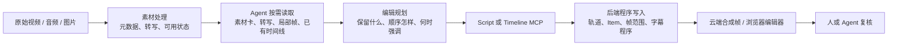

# 01｜产品全景与核心结论

> 证据范围：本篇综合当前 MCP 运行时合同、ChatCut 插件 Skill、项目读回和浏览器可见编辑器。没有读取 ChatCut 私有源码；涉及内部算法的地方均标为“实现推断”。

> 阅读边界：本篇所有“已实测 / 合同 / 推断”都只描述 ChatCut 外部产品。第 08 篇保存实验事实，第 10 篇区分证据等级与链路是否闭环；两篇都不把未知的私有实现补成结论。

## 一句话结论

**ChatCut 的核心不是“让大模型替你拖时间线”，而是把“编辑意图”和“帧级时间线”分开。**

编辑 Agent 负责回答：

> 这条片要讲什么？哪些话、镜头、反应、音乐和强调值得保留？

ChatCut 后端负责回答：

> 这些决定在第几帧开始、从源素材哪一段取、放到哪条轨道、怎样保存为可继续编辑的项目？

这套分工解释了为什么它可以做口播语义剪辑，也解释了为什么音效、MG 动画和背景音乐在结构大改后仍必须复核。

## 先用“剪辑桌”理解它

把一个 ChatCut 项目想成一张剪辑桌：

- **素材库**是抽屉：原始视频、音频、图片、MG 动画等都在这里；一个素材可以在多条成片里被重复使用。
- **Timeline**是桌上的一卷成片胶带：一条 Timeline 就是一种可播放版本，例如“横版长访谈”“30 秒高光”“竖版短视频”。一个项目可以有多条 Timeline，但同一时间只有一条是编辑器中的活动版本。
- **轨道**是同一把时间尺上的不同胶带层：V1、V2 是画面层；A1、A2 是声音层；字幕则是时间线级的字幕程序，而不是普通视频 Item。
- **Item**是“从抽屉拿出的某一段素材”：它记录源素材从哪里开始取、在成片第几帧出现、播多久、放在哪条轨道。

因此，ChatCut 不是把原片切碎后只留下一个扁平 MP4；它保存的是“原素材 + 每个被采用的片段 + 时间线排列 + 字幕/效果/声音层”。这也是后续可以继续改的原因。

## 它不是一次把所有原片和所有帧交给大模型

外部可观察到的工作方式是分层、按需读取：

这里的关键不是某一轮实验调用了几个工具，而是信息被分层保存：有声素材可形成可查询的转写时间锚；无声素材不会被伪造出一篇不存在的文字稿；画面只在 Agent 需要时按窗口读取。`browse_assets`、`inspect_asset`、`preview_timeline` 分别暴露素材卡、源时间窗口和成片结果，形成“先收窄、再判断”的阅读路径。

这也划出一个重要边界：外部接口能证明“按需取素材事实”，不能证明 ChatCut 已对所有 Vlog 或影视素材预先建立了完备的镜头、人物、事件和情绪索引。对应证据和未验证项集中在第 08 篇，不在本篇展开为实验日志。

## 五层产品结构

| 层           | 它保存或完成什么                       | 人话解释                                      | 主要责任者                    |
| ------------ | -------------------------------------- | --------------------------------------------- | ----------------------------- |
| 素材层       | 原视频、音频、图片、MG 动画、生成资源  | 不破坏原片，成片只引用它们                    | ChatCut 素材库与处理服务      |
| 证据层       | 时长、分辨率、转写、局部画面、处理状态 | 给 Agent 少量可靠线索，而不是把整片塞进上下文 | ChatCut 处理服务 + Agent 查询 |
| 规划层       | 叙事顺序、保留/删除、机位、强调点      | 决定“观众会经历什么”                        | 编辑 Agent 与用户             |
| 确定性执行层 | Track、Item、源偏移、整数帧、效果参数  | 将创意决定写成可播放、可回读的状态            | ChatCut MCP 后端              |
| 验证层       | 项目读回、合成帧、浏览器播放           | 防止“工具说成功，实际画面不对”              | Agent + 用户浏览器审片        |

这五层中，最容易混淆的是规划层与确定性执行层。比如“这里要加一个提示音”是规划；“提示音文件从第 0 帧开始，但真正起音在 0.082 秒，所以 Item 要放在事件点前几帧”是后端和时间线执行问题。

## ChatCut、Skill、MCP、Agent 各自不是一回事

### ChatCut 编辑器和后端

它是实际保存项目、素材、轨道、Item、字幕和渲染结果的地方。浏览器中看到的 Timeline 是项目的可编辑工作面，不是 Agent 画出来的示意图。

### MCP 工具

它是让 Codex 对这个项目“读、写、生成、导出”的接口。运行时 manifest 中既有读工具，也有写工具、生成工具和异步任务工具；精确数量会随版本和宿主变化，见附录 A。MCP 本身不会自动决定一条访谈该保留什么观点。

### Skill

它是工作方法。例如口播 Skill 规定：先稳定 A-roll 语音剪辑，再加字幕、B-roll、MG 动画和背景音乐；多机位 Skill 规定：先建立同步母版，再派生“跟说话人切镜头”的节目版。Skill 是“怎样做更稳妥”的说明，不是后端状态，也不等于每条 Skill 都有同名 MCP。

### 编辑 Agent

它负责内容和创作判断：把“用户要一条节奏快的访谈高光”翻译成具体的保留观点、镜头策略、声音策略和检查点。它不应持续手算几十个帧位置；要让程序承担整数帧、源偏移、冲突校验和事务提交。

## 官方插件包补充：谁说了算

官方 Codex Plugin 将 ChatCut 描述为一个**托管 MCP 连接器**：账号授权决定可访问哪些 Project，Project 内再保存素材库和一条或多条 Timeline。Skill 明确要求把当前会话实际暴露的 MCP manifest 当作运行时合同。

换成大白话：

- Plugin 和 Skill 像一本“接线说明书 + 剪辑操作手册”；
- 当前会话真正出现的工具、字段和返回值，才是“现在这台机器实际能做什么”；
- 浏览器编辑器和 MCP 都应读写同一份项目状态；
- 因此，Skill 写了某个理想流程，不能直接等同于“这次 58 个工具已经能一键执行它”。

多机位正是这个边界的例子：Skill 可以给出一套推荐方法，但是否有可调用执行入口，仍要以当前运行时合同和第 08 篇的实机证据为准。

## 两个控制面、一个项目状态中心

这是理解 ChatCut Web、原生 Agent、Codex 和 MCP 的核心架构图。它不是在猜测 ChatCut 私有微服务，而是把外部可见对象按职责排开。

~~~mermaid
flowchart TB
    U[用户] --> W[ChatCut Web 编辑器\n素材库、时间线、预览、Web AI Panel]
    U --> C[Codex 外部会话\n目标、判断、反馈]

    W --> WA[Web 原生 Agent 控制面\n内部实现未公开]
    C --> SK[Codex Plugin Skill\n方法与停止规则]
    SK --> C
    C --> MCP[Hosted MCP\n受控读写接口]

    WA --> P[ChatCut Project 状态中心]
    MCP --> P
    W --> P

    P --> A[Asset 素材库\n源媒体、处理状态]
    P --> T[Timeline / Track / Item\n可播放版本]
    P --> D[派生对象\n字幕、效果、音频关系]
    P --> J[异步任务\n转写、生成、导出]
    T --> R[合成预览 / 导出]
~~~

图中最重要的是中间的 **Project 状态中心**：Web、Web 原生 Agent 和 Codex 都可以围绕它工作，但它们不是同一段聊天，也不必共享同一份推理。外部 Codex 接手 Web 项目时，靠的是 editor URL 中的 `projectId`、目标 Timeline 与读回后的 Asset / Item 事实；不是凭文件名猜测，也不是读取 Web AI Panel 的消息。

| 平面 | 保存什么 | 典型角色 | 它不该承担什么 |
| --- | --- | --- | --- |
| **交互平面** | 用户目标、反馈、@ 引用、审片上下文 | Web 编辑器、Codex 对话 | 取代项目中的 Asset / Timeline 真相 |
| **控制平面** | 当前要读什么、怎样规划、何时写入、何时停下 | Web 原生 Agent、Codex Agent、Skill | 自己保存另一份剪辑时间线 |
| **项目数据平面** | Project、Asset、Timeline、Track、Item、字幕与任务状态 | ChatCut 项目后端 | 自动判断所有创作意图 |
| **确定性执行平面** | 帧换算、同轨约束、编译、混音关系、渲染 | MCP 后端与渲染器 | 替用户决定叙事和审美 |
| **验证平面** | 最新结构、合成画面、实际声音、未解决风险 | Agent 与用户 | 用一次 `success` 代替审片 |

因此，产品的最小共同事实不是“同一段聊天”，而是 **Project → Timeline → Asset / Item**。这也是为什么交接后要重新读回，而不能凭“我刚刚在网页里上传过”或一段旧对话继续写入。

## 深度拆解：它真正维护的是六类状态，不是一条扁平视频

把 ChatCut 想成“把一个剪辑决定翻译成可播放版本”的系统，会比“AI 在剪视频”准确得多。外部可观察到的对象可以分成六类；它们各自回答不同问题，也不能互相顶替。

~~~mermaid
flowchart TB
    P[Project：一个项目容器] --> A[Asset：原始可复用素材]
    A --> E[Evidence：转写、局部帧、处理状态]
    E --> S[Script / 编辑选择：观众应听到什么]
    A --> I[Timeline Item：一次取用的源范围]
    S --> I
    I --> T[Timeline / Track：成片第几帧播放什么]
    T --> D[派生呈现层：字幕、效果、音频关系]
    D --> R[预览 / 导出：观众实际看到和听到的结果]
~~~

| 状态层 | 它保存的不是 | 它真正保存什么 | 谁最适合修改 | 改了以后要看什么 |
| --- | --- | --- | --- | --- |
| **Project** | 一条固定成片 | 素材、多个 Timeline、项目级设置和异步任务的容器 | 用户或项目管理工具 | 是否已经定位到正确项目与目标 Timeline |
| **Asset** | “在成片里的第几秒” | 原视频/音频/图像/MG 的来源、元数据、处理可用性 | 导入、素材库与生成任务 | 是否可读、是否有转写、是否可被远端处理 |
| **Evidence** | 一句编好的剪辑文案 | 源时间上的 ASR、局部画面、时长、处理结果 | 处理服务产生；Agent 查询或修转写 | 这段事实是否足以支持一个剪辑判断 |
| **Script / 选择** | 具体的帧号与轨道坐标 | 最终保留哪些原有表达、按何种顺序播放 | 编辑 Agent 和用户 | 观点是否完整、顺序是否成立、是否使用最新版本 |
| **Timeline / Item** | “素材本身” | 某个 Asset 从哪段源时间取用、放到成片哪条轨和哪些整数帧 | ChatCut 后端通过 MCP | 同轨是否重叠、源范围是否有效、写入是否完整 |
| **派生呈现 / Render** | 唯一真相源 | 字幕 Card、Token、音效、音乐关系、效果、合成画面和导出 | 不同专用工具与渲染器 | 是否仍对准当前主线、画面/声音是否真的正确 |

这张表解释了一个很容易混淆的问题：**同一句话可以同时存在于三个地方，但含义不同。**

~~~text
源转写中的“不是等答案出现”
    = 原片里识别到的话及其源时间

Script 中保留这句话
    = 编辑决定：观众仍应该听到它

Caption Card 中显示这句话
    = 成片观众在最终帧上看到的文字和版式
~~~

如果只改第三处，画面上的字会变，但原片声音和 Script 的内容选择不一定变；如果只改第一处，则需要重新判断 Script 和字幕是否应刷新。这不是“字段很多”，而是三种事实的责任本来就不同。

### 哪个对象才是“现在真实发生了什么”的权威

外部可观察到的权威归属如下。这里的“权威”是指继续编辑或判断影响时应以谁为准，不是对 ChatCut 私有数据库表的猜测。

| 你想确认的事实 | 应以什么为准 | 不应误用成权威的东西 |
| --- | --- | --- |
| 原文件有没有、能不能处理 | Asset 及其最新处理状态 | 对话里曾经说“已经上传”的一句话 |
| 原片某句是什么、在源时间哪里 | 转写和源素材局部检查 | 一张旧的字幕截图 |
| 当前版本到底播放什么 | 最新 Timeline / Item 读回 | 旧一次 MCP 返回的 Item ID 或帧号 |
| 当前字幕显示什么 | 最新 Caption Card / Token 读回 | Script 的原始句子 |
| 当前观众看到、听到什么 | 合成预览、浏览器播放或最终导出 | 工具返回的 success |
| “为什么要在这里加 Ding / MG” | Agent 或用户写出的编辑意图 | 一个独立 Item 的绝对帧位置 |

因此，Codex 对话、Skill 文本、浏览器页面和 MCP 返回都很重要，但它们不是同一种状态：

~~~text
对话：保存目标、理由和反馈
Skill：保存推荐流程与停止规则
MCP 返回：某一刻对项目的结构化快照
浏览器：项目状态的可见工作台
ChatCut 项目：可继续编辑的实际剪辑状态
~~~

用户或另一个操作在浏览器里改过项目后，旧 MCP 快照就可能过期。第 05 篇的陈旧 Script 实验实际验证了其中一条保护：旧 Script 会被拒绝，而不是默默覆盖新 Timeline。

### 一个编辑决定怎样穿过六层状态

以“删掉访谈里重复的一句话，并让后面的主讲连续”为例，正确的控制流不是 Agent 把所有轨道逐帧搬家：

~~~mermaid
sequenceDiagram
    participant U as 用户 / 编辑意图
    participant A as 编辑 Agent
    participant S as Script 快照
    participant C as ChatCut 编译与写入
    participant T as Timeline
    participant D as 字幕与包装层
    participant V as 验证

    U->>A: 删重复说法，保留更完整的表达
    A->>S: 读取当前可听内容与锚点
    A->>S: 只修改保留顺序，不手算帧
    S->>C: 预览 / 提交最新 Script
    C->>T: 重建主线 Item、源范围与成片帧
    T->>D: 可播放语音位置变化
    D->>D: 字幕重投影或刷新；独立包装待检查
    C->>V: 读回新结构
    V->>A: 合成画面 / 浏览器 / 听感证据
~~~

**[ChatCut 已实测]** 在受控口播样本中，Agent 只删除完整语义行，后端将 V1 的源范围、Item 和帧位重新编译，字幕随新的可播放语音重新落位。  
**[ChatCut 已实测]** V2 画中画、Ding 和绝对时间 Zoom 没有因此自动“知道新的重点在哪里”。  
**[合理推断]** 产品内部至少需要把“源素材坐标”“一次 Timeline 取用”“最终播放坐标”关联起来，否则无法完成上述读回和重投影；但关联表、队列和服务如何实现并未公开。

### 高效的关键不是少算一次帧，而是把可变性关在正确层里

每一层的变化成本不同：

| 变化 | 最应该改变的层 | 为什么 |
| --- | --- | --- |
| ASR 把人名听错 | 源转写 | 修正事实源，避免之后搜索与 Script 继续引用错词 |
| 想删一段重复说法 | Script | 编辑的是“观众该不该听到”，而不是一串偶然帧号 |
| 想让一个镜头多停 6 帧 | Item / Timeline | 是明确的物理时长变化，不必重写叙事 |
| 想把字幕框抬高 | Caption layout | 只改视觉排版，不改声音和主线 |
| 想让一个 Ding 更靠近切点 | 音频 Item 的事件放置 | 需要考虑资源 onset，不应移动主画面 |
| 想把 90 秒访谈变成 30 秒观点高光 | 新 Timeline + Script / 规划 | 是另一个可编辑节目版本，不应破坏原版 |

这就是 ChatCut 外部产品最值得借鉴的抽象：**把“意图”“主线”“呈现”和“渲染结果”分开存、分开改、分开验。** 这不代表所有下游层都能自动重锚；恰好相反，越清楚对象边界，越能准确指出哪些东西要人工复核。

### 再往下看：项目里其实有三种完全不同的“关系”

很多“为什么它没跟着动”的疑问，来自把三种关系当成同一种绑定。它们在 ChatCut 里承担的事情不同，结构改动后的反应也不同：

| 关系 | 大白话 | 可观察对象 | 主线改变后应怎样理解 |
| --- | --- | --- | --- |
| **引用** | “这次播放借用了哪一段原片。” | Asset → Timeline Item 的 source offset、时长与轨道位置。 | [已实测] Script 重编译会重建或调整主线引用；原 Asset 不会被剪坏。 |
| **投影** | “原片里这个词/声音，在成片中第几帧被观众看到或听到。” | 源转写 Token → 最终 Timeline 帧 → Caption Card / Token。 | [已实测] 主线变化后，字幕可以按最终可播放语音重新映射；投影连续不等于切点自然。 |
| **编辑意图锚定** | “这个 Ding、MG、B-roll 或 Zoom 原本是为了强调什么。” | Agent 的理由、绝对帧 Item 或片段绑定效果。 | [已实测] 独立绝对时间对象不会因 V1 改动而自动理解新语义；[工具 / Skill 合同明确] 片段绑定效果可随目标片段继续关联。 |

前两种是 ChatCut 能以项目数据稳定保存和读回的关系；第三种有时会被做成片段绑定，但很多时候只存在于“编辑时为什么放这里”的判断里。外部接口没有暴露一个统一的“这个 Ding 服务哪一句话”的语义依赖图，因此不能把所有包装都想成主轨的自动子对象。第 04、06 篇后续讲的联动差异，正是这三种关系混在一起时产生的结果。

## 产品优势和不应高估的部分

### 已经比较清楚的优势

- 对**语音驱动视频**有明确流程：转写、Script、口癖/停顿清理、语义重排、字幕、声音平滑。
- 时间线是可编辑状态，不是生成一条不可再改的视频。
- 资源库、MG 动画、音效、字幕、导出、生成等能力围绕同一项目模型组织。
- 写入后可通过时间线读回和合成画面验证，而不是只依赖模型自评。

### 必须保留的不确定性

- 当前工具表中没有一个已实测的“Vlog 自动故事编排”或“影视高光自动情绪剪辑”专用工具。
- 多机位 Skill 中描述了 `multicam_sync` 的理想流程，但 2026-08-27 审计时的 58 个运行时 MCP 中未见可调用的同名工具；不能把 Skill 写成已能一键执行。
- `ripple` 的联动范围不是“整条片自动懂语义”，而是同一轨道的后续 Item；其它层是否跟随取决于它们自身的模型和后续检查。

## 读完本篇后，下一步看什么

- 想理解不同类型视频的主时间轴：看 [02-视频类型与主时间轴规划.md](./02-视频类型与主时间轴规划.md)。
- 想理解“改一帧后为什么字幕动、音效不动”：看 [04-时间线轨道与改动联动.md](./04-时间线轨道与改动联动.md)。
- 想看真实证据而不是概念解释：看 [08-实测记录浏览器验证与字段样例.md](./08-实测记录浏览器验证与字段样例.md)。
