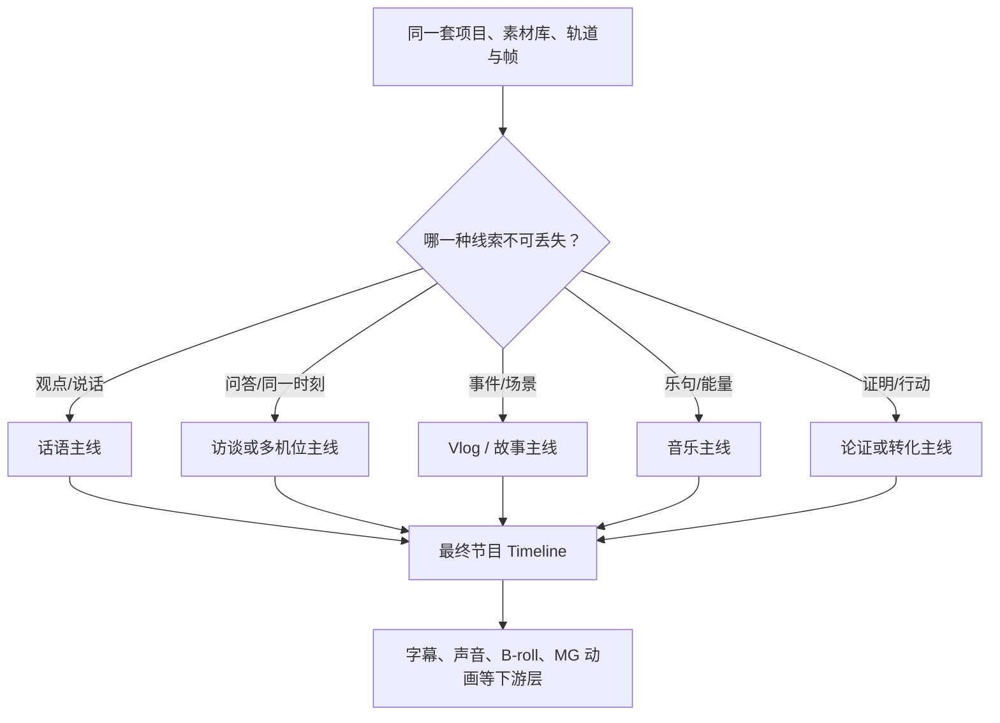

# 02｜视频类型与主时间轴规划

> 证据范围：视频分类与剪辑判断属于编辑方法；ChatCut 对口播/访谈有明确 Skill 和实测证据。Vlog、影视高光等非语音主导类型的“规划方式”是专业编辑策略，不等于 ChatCut 已有一键自动模式。

> 阅读边界：本篇说明不同类型应怎样规划主线，不是在宣称 ChatCut 已逐类自动完成规划。ChatCut 对口播 / 访谈的 Script 路径有 Skill 与实测支撑；非语音类型的规划档案是解释编辑判断的模型，当前自动规划入口和效果仍需按第 08、10 篇的证据边界理解。

## 最重要的一句话

**不同视频类型不会换一套轨道系统，但会换一套“谁决定主时间轴”的逻辑。**

同一把时间尺上始终可以有 V1、V2、A1、A2、字幕和 MG 动画；真正不同的是：编辑者先按什么线索，把原始素材排成观众最终经历的顺序。

不要把“主时间轴”误解为“V1 这条轨道”。V1 往往承载主画面，但主时间轴本质上是：

> 成片从第 0 秒到结尾，观众依次会看到和听到什么。

## 先用十种“剪辑发动机”理解视频

下表扩展了常见视频剪辑类型。真实项目常常同时属于两三类；先找**主导发动机**，再决定辅助发动机。

| 类型            | 常见内容                                     | 主时间轴由什么驱动           | 首先要理解什么                     | 最容易剪错什么                         |
| --------------- | -------------------------------------------- | ---------------------------- | ---------------------------------- | -------------------------------------- |
| 话语驱动        | 口播、访谈、播客、课程、直播切片             | 完整观点与说话节奏           | 说了什么、哪里重复、哪里停顿       | 只删口癖，观点仍然松散；切掉必要上下文 |
| 论证/证据驱动   | 知识讲解、新闻评论、科技分析、游戏历史       | 观点—原因—证据—结论       | 论点、事实依据、证据出现的时机     | 大量 B-roll 很热闹，但没有证明观点     |
| 故事/场景驱动   | 人物记录、品牌故事、旅行叙事、剧情感 Vlog    | 人物目标、阻碍、变化和结果   | 谁想做什么，发生了什么改变         | 只有事件罗列，没有人物动机或情绪变化   |
| 步骤/任务驱动   | 教程、录屏、做饭、DIY、软件演示              | 目标—输入—操作—结果       | 关键步骤、屏幕变化、可复现动作     | 只讲不展示；镜头太花导致操作看不清     |
| 事件/高光驱动   | 体育集锦、游戏高光、事故复盘、反应片段       | 事件临界点与前因后果         | 发生了什么、为什么重要、高潮在哪里 | 只堆高能瞬间，没有铺垫或上下文         |
| 音乐/节奏驱动   | MV、舞蹈、演出、预告式蒙太奇                 | 乐句、节拍、能量曲线         | 音乐结构、动作、视觉爆点           | 每一拍都硬切，画面缺少呼吸和层次       |
| 转化/销售驱动   | 产品广告、电商、App 推广、品牌宣传           | 吸引—痛点—证明—行动       | 目标用户、卖点、证据、CTA          | 只展示漂亮画面，没有可信证明或明确行动 |
| 实时同步/多机位 | 访谈、演讲、婚礼、活动、演唱会、直播         | 同一时刻的真实关系           | 各机位/录音是否对齐、谁在说话      | 机位切了但嘴型和声音错位               |
| 视觉/氛围驱动   | 风景、时尚、美食、房产、生活方式 Montage     | 构图、色彩、运动、空间和情绪 | 哪些画面有视觉信息，何时该停留     | 只有风景排列，没有视觉节奏或情绪推进   |
| 资产/图文驱动   | 图文混剪、历史档案、榜单、资讯卡片、数据视频 | 信息层级和阅读顺序           | 每屏观众应读到什么，停留多久       | 字太多、画面不停变、信息来不及读       |

## 一条判断规则：先找“观众不能丢掉的东西”

剪辑时，不是先问“有几条视频轨”，而是问：

```text
如果把所有装饰拿掉，观众仍必须理解的东西是什么？
```

- 是一句一句的观点：话语驱动。
- 是谁问谁答、谁的反应改变了意义：访谈/实时同步驱动。
- 是一趟经历或一个人物的变化：故事/场景驱动。
- 是观众能否照着完成操作：步骤/任务驱动。
- 是一瞬间的反转、命中、爆发：事件/高光驱动。
- 是情绪随音乐被推高：音乐/节奏驱动。
- 是用户为什么要相信并采取行动：转化/销售驱动。

这个答案就是主时间轴的第一版骨架。字幕、音效、B-roll、MG 动画和背景音乐都是在骨架稳定后才决定如何附着。

## 1. 口播：按“观点稿”排，不是按镜头时长排

### 主时间轴

口播的主线是观众最终会听到的观点顺序。通常表现为 V1 的主讲画面与 A1 的主讲声音一起连续前进。


### ChatCut 的明确支持

**已实测/工具合同明确：**`read_script → clean_script → apply_script` 是专门的语义剪辑路径。Agent 决定“保留哪些完整表达及其顺序”，后端将其编译为真实的切口和时间线 Item。

### 常见误区

- 把 ASR 分段当成句子；实际一个观点常跨多段转写。
- 把所有“然后、所以、啊”都当口癖；它们可能承担逻辑或语气。
- 在最终语音还会改的情况下，先批量放字幕、B-roll、MG 动画和音乐。

## 2. 访谈：按“问答关系”排，机位只是表达手段

陈清泉素材属于典型的“访谈 + 知识论证 + 多机位”混合类型。

### 主时间轴

先排：问题、回答核心、追问、不同观点、收束。然后才决定每一刻给观众看谁。

```text
主持人提出问题
→ 嘉宾给出核心观点
→ 追问或反应让观点更有意义
→ 举例 / 证据 / 结论
```

最理想的项目结构不是只做一条 Timeline，而是：


同步母版保存“真实时间”；节目版保存“观众该看的版本”。母版中不同机位可以堆在不同画面轨上；节目版则应物化成连续的主画面选择，避免让两台相机长时间叠在一起互相遮住。

### 机位切换的判断

- 观点从谁发出，通常先看谁；
- 反应本身改变一句话的意义时，才切听的人；
- 新问题、换话题、多人笑、沉默、身体动作适合用双人或广角恢复空间关系；
- 不要为了“镜头不能超过 3 秒”而追着每个插话切镜头。

### 证据边界

**Skill 明确：**多机位应先同步、再派生跟说话人切镜头的节目版。**待验证/运行时缺口：**2026-08-27 审计时的 58 个 MCP 中没有可调用的 `multicam_sync` 工具，因此不能说当前外部 MCP 已实测一键同步 A/B/C 机位。

官方多机位 Skill 还把“同步母版”和“节目版”的分工说得更严格：

1. 母版只保存“同一真实时刻，各机位和录音各在什么位置”的可复核事实；
2. 母版用普通轨道和普通 Item 组织，不依赖一个神秘的黑盒多机位对象；
3. 不在母版上做内容删改或追着说话人切镜头，而是新建节目版 / Cutting Board；
4. 先由口播工作流决定保留哪些问答，再根据同一个真实时刻挑选机位。

这样做的好处是：节目版剪错了可以重做，母版仍然能作为所有机位同步关系的“尺子”。这是一条 **Skill 明确** 的设计原则；陈清泉 A/B/C 机位仍需在当前运行时单独实测。

## 3. Vlog：按“经历”排，文字可能只是辅助线索

Vlog 的核心通常不是“这句话该不该删”，而是“这段经历是否值得观众跟着走”。

### 叙事型 Vlog

```text
出发 / 目标
→ 到达或遇到新场景
→ 体验、挫折或发现
→ 最值得记住的片段
→ 收尾感受
```

主时间轴是事件和场景的顺序。现场声、地点字幕、音乐和旁白服务于这条体验线。

### 旁白型 Vlog

如果 Vlog 有一条明确旁白，“观众听到的叙述”又会成为主线；画面可以不按拍摄顺序，但必须解释旁白。这种 Vlog 的结构接近口播，只是 V1 的主体不一定是说话的人。

### 音乐蒙太奇型 Vlog

如果没有核心旁白、重点是氛围，音乐的乐句和能量会成为编辑节拍尺。此时 A2 的背景音乐在创作上很像隐形主线，但它在数据模型中仍只是音频轨；画面还是要由 Agent 选择并放到 V1/V2。

### ChatCut 的边界

**已实测：**无声素材可被导入并得到 `no_audio` 成功终态，不会凭空生成字幕。**未实测：**没有证据证明 ChatCut 自动完成“找出旅行一天的故事线”。Vlog 的场景选择、故事组织和音乐落点仍应视为编辑 Agent 的规划工作。

## 4. 影视高光：按“情绪弧线”排，不必按原片顺序

影视高光最容易被误剪成“把所有大声台词拼在一起”。正确的主时间轴是情绪递进：

```text
钩子或悬念
→ 关系 / 冲突的建立
→ 情绪或动作升级
→ 爆点、反转或最强台词
→ 余韵、结局或回扣
```

它可以把原片后面的强台词放在开头作钩子，再回到事件起点；也可以让音乐、表演、动作和镜头运动在一个高潮点汇合。

字幕可能只保留关键台词，背景音乐也可能不是“垫底”，而是决定镜头长度的节拍尺。此时音效、转场、推近、慢动作等都要围绕情绪，而不是平均撒在时间线上。

**待验证：**当前没有一条已实测的“影视高光自动识别冲突和情绪曲线”MCP。ChatCut 能承载这种时间线结构，不代表它已经证明能自动完成专业选段。

## 5. 论证/证据型：按“观点被证明的顺序”排

知识讲解、新闻评论、科技分析常常表面是口播，实际骨架是：

```text
结论或争议
→ 为什么重要
→ 机制 / 原因
→ 证据、案例、数据或画面
→ 回到结论
```

这里 B-roll、截图、历史资料、数据卡不是装饰，而是“证据”。每一段视觉资产都要回答它在证明哪一句话；不能为了避免画面单调而无关地堆素材。

主讲声音可能仍在 A1，但 V2 上的图表、时间线、原始画面有可能承担同等重要的信息职责。字幕强调也应优先突出结论、数字、因果关系和风险，而不是每个名词都加颜色。

## 6. 步骤/任务型：按“用户能否完成任务”排

教程、录屏、做饭、DIY 的主线是：

```text
要达成什么结果
→ 需要什么输入或准备
→ 第一步做什么
→ 关键分支或容易错在哪里
→ 得到什么结果 / 怎样检查成功
```

这种视频应将画面重点放在真正执行操作的帧上。口播解释可以压缩，但按钮、手部动作、材料变化、前后对比必须给足观看时间。字幕和 Callout 的职责是帮观众定位，不是替代操作画面。

## 7. 事件/高光型：按“为什么这一刻值得看”排

体育、游戏、演出、事故回放不应只把高潮一帧接一帧地连起来。通常需要：

```text
发生前的必要铺垫
→ 关键动作 / 决策
→ 高潮瞬间
→ 反应、回放或后果
```

如果观众已经知道背景，可以极短；如果不知道，必须给出足以理解高潮的上下文。慢放、音效、标注和重复回看都应强化同一个事件，而不是制造无关热闹。

## 8. 音乐/节奏型：按“乐句和能量”排

音乐型剪辑的关键不是“每拍切一次”，而是建立能量曲线：前奏建立、主段推进、Drop/高潮爆发、尾段收束。动作、表情、视觉转场可以卡在音乐事件附近，但不能牺牲动作完整性。

**Skill 明确：**生成音乐不能保证某一鼓点精确落在某一帧；生成后仍须由 Timeline 操作完成裁切、循环、淡入淡出和对齐。因此“音乐是创作主线”不等于“音乐生成模型会自动剪好画面”。

## 9. 转化/销售型：按“相信并行动”排

常见骨架是：

```text
吸引注意 / 目标人群
→ 痛点或场景
→ 产品怎么解决
→ 真实证据、演示、对比
→ 明确下一步 CTA
```

这里的主时间轴不是“产品镜头最好看”，而是观众的决策过程。美术、节奏、音乐都可以快，但核心证据、价格/条件、免责声明和 CTA 必须留出可读、可信的时间。

## 10. 资产/图文型：按“阅读顺序”排

历史档案、榜单、新闻卡片、数据可视化混剪的主线是信息层级。每屏都要回答：观众此刻要读什么、先读标题还是数字、读完后与前一屏有什么关系。

这种类型尤其不能把字幕、图文卡、背景视频全部叠在同一个区域。主时间轴控制页面切换和阅读停留；MG 动画控制信息如何进入；字幕只在确实需要语音同步时承担文字职责。

## 补充类型：画面 / 操作驱动的旁白视频

产品演示、录屏教程、幻灯片讲解和 B-roll 说明片，常常不是“先有一段人说话，再配画面”，而是反过来：**画面上的操作、状态变化和结果，决定旁白此刻该说什么。**

这类片的主时间轴是：

```text
画面出现什么状态
→ 观众需要先看懂什么
→ 旁白解释这一件事
→ 进入下一次画面变化
```

官方 Voice Skill 把这个关系称为“同步图”：每一段都应记录画面范围、可见锚点、旁白文案、真实音频时长和摆放位置。不是按平均秒数把一整条配音盖到视频上。

如果后来把录屏步骤提前、缩短或换位置，受影响的旁白关系就变成过期状态，必须按**当前画面**重新核对。这个工作流是 **Skill 明确**，本轮没有做 TTS/旁白实测。

## 混合类型怎样定主线：以陈清泉访谈为例

陈清泉原片至少同时具备三种性质：

| 成分         | 它影响什么                   | 是否应成为第一优先级             |
| ------------ | ---------------------------- | -------------------------------- |
| 访谈         | 问答、说话人、反应、机位切换 | 是                               |
| 知识论证     | 哪些观点和证据值得保留       | 是                               |
| 多机位       | 怎样保证嘴型、声音、画面同步 | 是，但它是技术前提，不是叙事本身 |
| 竖版短视频化 | Hook、节奏、字幕、强调       | 在内容骨架确认后才进入           |

因此推荐顺序是：先同步并确认节目音频，再选问答和观点，再决定镜头，最后加字幕、MG 动画、音效和背景音乐。反过来先做“很酷的短视频包装”，后面一旦删改回答，返工会很大。

## 深度拆解：视频类型不是一个按钮，而是一份“规划档案”

“口播模式”“Vlog 模式”“高光模式”很容易让人以为系统只要选中一个标签，后面就能自动剪好。更准确的理解是：类型改变的是导演层首先相信什么证据、以什么单位做选择、用什么判断主线是否成立。

下面的 Planning Profile 是本调研用于解释产品机制的**规划档案模型**，不是已读到的 ChatCut 私有 Schema，也不是当前 Hosted MCP 的一键模式字段。

~~~text
Planning Profile
├─ 主导信号：观点、问答、场景、事件、音乐、阅读或转化
├─ 最小选择单位：完整表达、问答回合、场景、动作、情绪 beat、步骤
├─ 主时间尺：语义顺序、真实同一时刻、经历顺序、情绪曲线、乐句、阅读停留
├─ 叙事骨架：Hook → 中段推进 → 收束，以及必须保护的上下文
├─ 覆盖策略：主画面、反应镜头、B-roll、字幕、音乐分别服务什么
├─ 执行路径：优先 Script，还是先放 Timeline Item
└─ 验收问题：观众是否理解、是否自然、是否仍与证据相符
~~~

有了这份档案，Agent 才能把“我要一个 Vlog”翻译成可编辑计划，而不是从第一帧就盲目加字幕、音效和转场。

### 1. 四类最容易被混淆的主线，实际怎样不同

| 类型 | 首先要收集的证据 | 最小选择单位 | 主时间尺 / 主线 | 导演层应产出什么 | 最适合的写入 | 这轮对 ChatCut 的证据 |
| --- | --- | --- | --- | --- | --- | --- |
| **单人口播** | 原话、重拍、停顿、完整观点、口型风险 | 一段完整表达，而非一行 ASR | “观众应依次听到什么” | 保留/删除/重排的 Script；Hook、论点、收束 | Script → apply_script | [已实测] 跨 Asset 重排、删完整语义、字幕映射 |
| **双人访谈** | 问题、回答、追问、反应、说话人关系；有多机位时还要同步证据 | 一轮有完整意义的问答 / 回答段 | “问题怎样得到回答，为什么这句重要” | 节目版问答骨架；再决定谁的镜头出现 | 先 Script/节目选择；机位选择走 Timeline | [Skill 明确] 母版/节目版；[未验证] 当前 Hosted 一键多机位执行 |
| **无声 / 旁白 Vlog** | 场景、动作、地点、环境声、视觉转折；若有旁白，再有画面—旁白关系 | 场景或事件，不是语音句子 | “这段经历怎样发展、观众此刻在看什么” | 场景顺序、停留理由、旁白或音乐结构、空镜用途 | Timeline Item；旁白另建同步图 | [已实测] no_audio 正常；[未验证] 自动场景故事编排与 TTS 闭环 |
| **影视高光** | 冲突、人物关系、强台词、动作临界点、反应、情绪变化 | 一个情绪 beat 或事件链，而不只是“高能台词” | “悬念 → 升级 → 爆点 → 余韵” | 高光曲线、必要铺垫、高潮点、回扣 | Timeline Item 为主；有语音可辅助查询 | [未验证] 专用自动情绪识别/选段 MCP |

注意：四种类型在最终都可以用 V1、V2、A1、字幕和 MG；不同的不是轨道存在与否，而是**哪一类证据有资格决定 V1 该放什么**。

### 2. 同一条片怎样从“类型判断”变成可执行主线

~~~mermaid
flowchart TD
    A[素材证据
语音、画面、场景、动作、音乐] --> B[识别主导信号
哪件事丢了观众就不懂]
    B --> C[选定最小剪辑单位
句子 / 问答 / 场景 / beat / 步骤]
    C --> D[写第一版主线计划
开始、推进、收束、保护上下文]
    D --> E{主线主要由语言决定？}
    E -->|是| F[Script 语义选择与编译]
    E -->|否| G[Timeline 排列场景/事件/镜头]
    F --> H[再加字幕、声音、视觉包装]
    G --> H
    H --> I[按该类型的验收问题审片]
~~~

“主导信号”不等于唯一信号。以陈清泉访谈为例：

~~~text
内容骨架：问答与论证
技术前提：A/B/C 是否同步
画面策略：谁说话时看谁，反应何时有意义
竖版化策略：Hook、字幕、局部强调
~~~

这四层应依次推进。把多机位直接等同于故事主线，或者把竖版字幕直接等同于内容剪辑，都会让计划失焦。

### 3. 每种类型的“第一版计划”应该长什么样

| 规划项 | 口播 | 访谈 | Vlog | 影视高光 |
| --- | --- | --- | --- | --- |
| 开场 Hook | 先放结论或问题 | 先给最有张力的问题/回答，再补必要上下文 | 先给目的地、目标、意外或最美一瞬 | 先给悬念或情绪钩子，不能先泄露全部结果 |
| 主体推进 | 观点按因果/问题顺序 | 问答、追问、案例、反应 | 到达、体验、障碍、发现、变化 | 冲突建立、升级、关键选择/动作 |
| 最小保护单位 | 主语 + 转折 + 结论 | 问题 + 足以理解的回答 | 能辨认的场景/动作链 | 因果链中必要的铺垫和后果 |
| 镜头选择理由 | 遮跳切、强调、支持观点 | 说话人、反应、空间关系 | 让经历可感、给观众呼吸 | 放大表演、动作、情绪反应 |
| 声音策略 | 人声最优先，包装后置 | 对话清晰、反应自然、音乐克制 | 现场声、旁白或音乐决定体验层 | 音乐和原声共同推动情绪，但不遮关键台词 |
| 验收问题 | “删掉后还说得通吗？” | “为什么此刻切给这个人？” | “没有旁白也能感到经历在推进吗？” | “高潮是否能理解、是否有情绪递进？” |

这种计划不是脚本字数越多越好，而是要让下游知道“什么不能丢、哪些可以变、为什么要在这里加一层画面/声音”。

### 4. 无声素材、空镜头和 AI 旁白怎样进入同一规划

无声猫咪素材的 no_audio 结果只说明“没有原生口播字幕”。如果用户希望把它剪成旁白 Vlog，正确的导演逻辑应是：

~~~text
先定场景 / 事件主线
→ 在每个场景写清观众应看到的事实
→ 再写旁白要解释、补情绪还是留白
→ 生成或选定旁白后，以真实音频时长建立画面—旁白同步图
→ 让视频、旁白、字幕分别按自己的锚定规则落到 Timeline
~~~

这条链不应被说成“ChatCut 会自动给无声画面写旁白”。当前可以确认的是 no_audio 的处理分支；Voice Skill 明确建议同步图；**[未实测]** 当前选定音色、生成 TTS、将其放入时间线并在结构改后重新同步的完整 Hosted 闭环。

### 5. 类型发生混合时，怎样避免让两条主线互相抢控制权

真实视频常不是单一类型。一个实用的优先级规则是：

1. 先指定一个**主导时间尺**，它决定 V1 和 A1 的骨架；
2. 再指定一个或两个**辅助时间尺**，它们只影响局部节奏、包装或镜头选择；
3. 明确哪些对象有否决权，例如教学视频里关键操作必须可见，访谈里关键回答不能被无关 B-roll 覆盖；
4. 当两个规则冲突时，先保护观众理解，再保护节奏和装饰。

例如“知识口播 + 产品演示”可以这样写：

~~~text
主导：观点顺序（Script）
辅助：屏幕操作顺序（视觉证据）
保护：每一步关键操作必须在对应旁白期间可见
下游：Callout、字幕、B-roll 只证明正在说的点，不能替代操作本身
~~~

这样，产品不会因为给视频贴了“口播”标签，就把所有画面都固定为主讲人；也不会因为贴了“教程”标签，就牺牲解释逻辑。

## 结论：类型不同，变化的是“规划模板”，不是数据模型



换言之：ChatCut 的 Timeline 是同一种“纸”，但不同视频类型需要先写不同的“剧本”。
