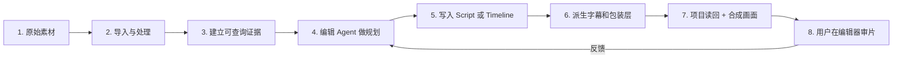
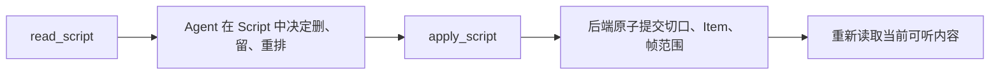
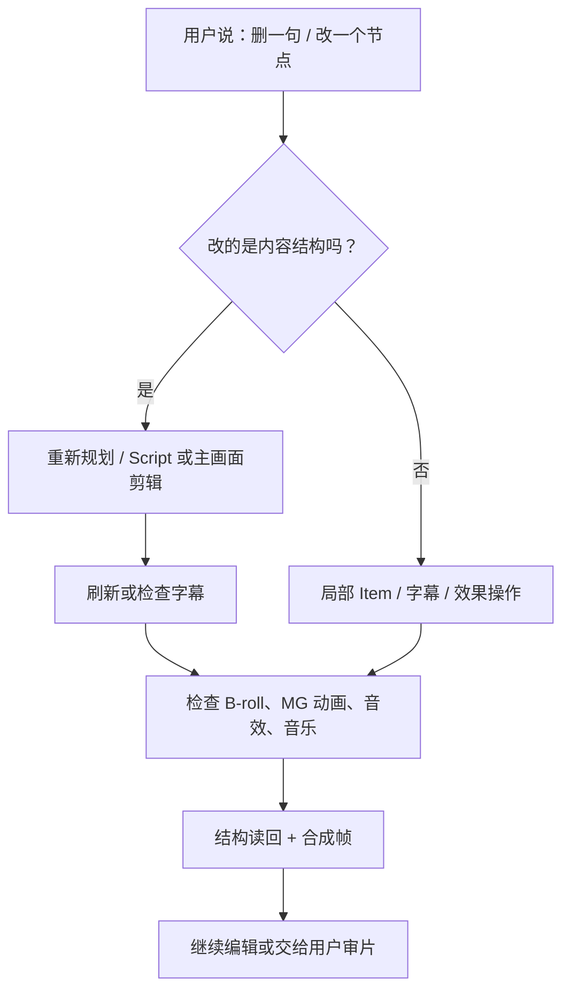

# 03｜从素材理解到成片的完整链路

> 本篇定位：这是“素材怎样变成可编辑成片”的架构链路，不是实验报告。每一段机制的实机证据、字段样例和未测边界统一回链到第 08 篇；内部服务实现未公开的部分只解释外部职责，不猜测私有代码细节。

> 阅读边界：这条链路描述 ChatCut 外部可观察的职责与状态交接。它不把“外部接口可按需读取素材”扩写成私有多模态索引，也不把某一条成功样本扩写成所有入口均已闭环；相应证据与缺口见第 08、10 篇。

## 先给全链路



它是一个循环，不是“上传 → AI 一次性吐出成片”的直线。任何上游结构性修改都可能让下游层需要刷新或重锚。

### 这条链路同时有两条线：数据怎么走，决定怎么走

如果只画“上传到导出”的箭头，会漏掉最关键的分工。ChatCut 的剪辑不是一条单纯的数据流水线，而是两条不断交叉的线：

~~~mermaid
flowchart TB
    subgraph Data[数据线：可持久保存、可回读]
        A[Asset：原始素材] --> B[处理状态 / 转写 / 源时间]
        B --> C[Timeline Item：一次取用]
        C --> D[字幕、音效、MG、音乐等派生 / 独立对象]
        D --> E[合成预览 / 导出]
    end

    subgraph Control[控制线：谁决定下一步]
        U[用户目标与反馈] --> G[Agent：理解、规划、选择]
        G --> S[Skill：方法、边界、检查点]
        S --> G
        G --> W[Script / Timeline 写入意图]
        E --> V[审片事实]
        V --> G
    end

    W --> C
    B --> G
    C --> G
~~~

数据线里保存的是以后仍能继续编辑的事实；控制线里保存的是“为什么要这样剪、下一步要不要继续”的判断。前者不能只靠聊天记忆，后者也不能由时间线 Item 自己推断出来。

| 状态类型 | 例子 | 谁用它 | 为什么不能混在一起 |
| --- | --- | --- | --- |
| **源事实** | Asset、文件元数据、源时间、转写原词 | 导入、检索、Script | 改成片不能破坏原素材或伪造源事实 |
| **编排事实** | Timeline、Track、Item、源偏移、成片帧 | 执行器、渲染器、编辑器 | 它回答“此刻实际播放什么” |
| **派生呈现** | Caption Card、Token、合成帧、导出文件 | 字幕工具、审片者 | 可以由主线刷新，但不等于主线本身 |
| **编辑意图** | 保留理由、目标时长、保护内容、声音作用 | 用户与 Agent | 有助于重新判断，不能替代项目状态 |

### 先补一个入口分叉：从 Web 上传和从 Codex 导入，最后落到同一个项目事实

用户可以在 Web 编辑器里手动上传，也可以让外部 Codex 走导入工具。两种入口的“把字节送进系统”的过程不同，但后续剪辑不该再按入口分叉：最终都应以项目素材库里可读的 Asset 为准。

~~~mermaid
flowchart LR
    W[用户在 Web 手动上传] --> A[同一 Project 的 Asset]
    C[Codex 导入本地素材] --> A
    U[已有 Asset 处理/转写状态] --> A
    A --> P[按需读取转写、局部帧、Script、Timeline]
    P --> D[Codex / Web Agent 的当前编辑判断]
~~~

外部 Codex 不应因为用户没有在 Codex 对话中附文件，就假设素材缺失；先用 editor URL 中的 `projectId` 定位项目，再用 `browse_assets` 核实 Web 已上传的 Asset。反过来，Web 上传也不会把 Web AI Panel 的聊天目标自动变成 Codex 的任务上下文。项目身份、目标 Timeline 和本轮范围仍要明确交接；详细协作架构见第 11 篇。

## 1. 原始素材：先在素材库里，不等于已经在成片里

素材导入后是项目素材库中的 Asset。它可以是视频、音频、图片、GIF、SVG、MG 动画、效果或转场。Asset 保存“这个源文件是什么”；被拖入时间线后才成为一个 Item。

一个源视频可以被剪出多段，也可以出现在不同版本里。例如同一段访谈可同时用于：

```text
长版访谈 Timeline
30 秒观点高光 Timeline
竖版 Hook Timeline
```

这三个版本不会复制原始视频，而是各自保存对同一 Asset 不同范围的引用。

## 2. 导入与处理：系统先产生“可用性”，不是自动产生故事

### 处理状态的真正作用：为不同剪辑路径开门

导入不是“上传成功 / 失败”两个状态，而是给不同下游能力逐步开放条件：

~~~text
已登记为 Asset
→ 可读基础元数据
→（有声）转写可用，或（无声）no_audio 成功终态
→ 可按需读取源时间窗口
→ 可被引用为 Timeline Item
→ 可在成片里验证
~~~

有声素材走“转写 → 语义主线”的路径；无声素材跳过不存在的 ASR，走“局部画面 / 场景证据 → 视觉主线”的路径；仍在处理或云端副本尚不可读的素材，只能用于已满足条件的操作。**“在素材库里”不等于“此刻可做任意转写、云端帧检查或导出操作”。** 各状态的实测样本见第 08 篇实验 2。

### 外部可见的状态分工

| 问题                         | 合适入口                                 | 它返回的是什么                           |
| ---------------------------- | ---------------------------------------- | ---------------------------------------- |
| 项目里有什么素材             | `browse_assets`                        | 素材卡、类型、时长、处理状态、转写摘要等 |
| 某素材的局部画面或源时间转写 | `inspect_asset`                        | 原始素材坐标上的帧、转写片段、元信息     |
| 转写是否就绪                 | `track_progress` 的 transcription 目标 | 异步进度与终态                           |
| 某句话在哪个源时间           | `find_transcript`                      | 时间坐标查找，不是全文编辑器             |

这里的“素材理解”首先是把原始媒体变成可查询的证据：时长、画面采样、ASR、处理状态等。它给 Agent 提供高效筛选入口，但不自动替 Agent 完成叙事判断。

### 官方补充：导入完成不等于可以立刻做每一件事

官方 `asset-import` 与 `transcription` Skill 将导入拆成几步：建立导入会话、上传字节、得到 Project Asset、等待转写或云端处理。不同下游工作等的不是同一个状态：

```text
拿到 Asset ID
→ 可以组织素材、放到 Timeline
→ 等转写就绪后才做 Script、字幕、语义剪辑
→ 等远端字节可读后才做依赖云端媒体的导出或远程帧检查
```

这解释了为什么“素材已经显示在库里”仍不代表字幕、云端截图、导出都已可用。无声素材的 `no_audio` 是一种成功终态，不是值得无限重试的失败。

### 从外部工具合同能确认的处理职责

这里必须把“工具合同描述的职责”和“猜不到的私有实现”分开。我们没有 ChatCut 后端源码，不能把某个合理猜测写成模型或数据库事实；但 MCP 合同已经足够让我们还原一个黑盒职责链：

~~~text
原始视频字节
→ 直接上传到存储并注册为 Asset
→ 写入素材元数据与异步处理状态
├─ 有声音：准备/切分音频 → 语言识别 → 路由至 ASR → 句段、词和时间
├─ 无声音：得到 no_audio 成功终态，不生成可读转写
├─ 需要看原片：按源时间抽取采样帧或指定帧
└─ 放入 Timeline：建立“源素材时间 → Item → 成片帧”的映射
~~~

| 证据等级 | 可以怎样说 | 依据与边界 |
| --- | --- | --- |
| **工具合同明确** | 导入工作流包含媒体字节上传与 Asset 注册；Asset 有名称、类型、时长、尺寸、文件夹、处理状态与云端可读性。 | import_media 和 browse_assets 的工具合同明确这些职责；具体存储厂商、表结构和实际传输实现未公开。 |
| **工具合同明确** | 转写存在准备/切分、上传和转写等异步状态。工具说明称新转写会先做 Gemini 语言识别，再路由到 ASR Provider；已有准备好的音频会被复用。 | 这是 trigger_transcript 的运行时工具说明，不是对私有实现的独立测量；不能由此断言 ASR 的具体模型、采样率、降噪或说话人分离算法。 |
| **工具合同明确** | 原片画面可按毫秒级源时间请求帧；均匀概览最多取 25 张粗采样帧，也可取精确指定时刻的帧。 | inspect_asset 的合同明确这些是按需读取，且提醒粗采样不能证明短暂事件从未出现。 |
| **合理推断** | 产品至少需要对象存储、项目/Asset 元数据记录、异步处理任务，以及转写查询的缓存或投影层。 | 插件说明写有 Zero / DB / S3 路径，工具还暴露上传、转写进度和刷新转写缓存；这只能说明架构职责，不能推出具体数据库、队列或索引实现。 |
| **不能确认** | 是否对整条视频自动建立视觉向量、镜头标签、人物/物体/人脸识别、OCR、情绪标签或“故事摘要”。 | 当前 MCP 没有返回这些可复核字段；不能因为 Agent 能看若干帧，就写成系统已经完成整片视觉理解。 |

这也解释了“素材处理”与“自动讲故事”为什么不是一回事：前者主要把媒体变成能定位、能查询、能落到时间线的事实；后者仍需要 Agent 根据这些事实做编辑判断。

## 3. 建立可查询证据：Agent 怎样理解，而不是把全部素材塞进上下文

### 证据不是一句视频摘要，而是一条时间坐标链

ChatCut 外部可见的证据模型，更像一本带页码、索引和书签的资料，而不是“模型已经记住整条视频”。同一件事会保留多种坐标：

~~~text
Asset
→ 原片毫秒时间
→ ASR 句段 / 词 Token
→ Timeline Item 的源偏移、时长和轨道
→ 成片 Timeline 帧
→ 字幕 Card / 字幕词的最终帧与样式
→ 该成片帧的合成画面
~~~

例如，查询一句口播时，系统可以先返回它在原片的时间；再返回这段原片被哪些 Item 使用、在 V1 的哪一段成片帧播放；若要做逐字字幕或文字动画，还能读取匹配短语内每个词的时间。这样，Agent 不必记住所有帧，只需在需要时沿坐标链查证。

### 最后实际查到的证据，带哪些数据特征

| 查询入口 | 查询依据 | 返回的可用证据 | 能推断与不能推断的事 |
| --- | --- | --- | --- |
| browse_assets | 文件名、文件夹、类型、状态、生成/音频摘要和转写文本事实。多个空格分开的词必须都命中。 | Asset 标识、时长（毫秒）、尺寸、状态、云端访问状态、转写匹配摘要与 transcriptRangesMs。 | 已知是结构化/文本事实检索；它不检索像素或“画面动作”，不能据此宣称使用了视觉向量检索。 |
| inspect_asset | 一个明确 Asset 加原片时间范围。 | 源文件元信息、指定源时间的画面帧、指定时间范围重叠的转写行、转写状态和句段数量。 | 这是按需取证，不是自动浏览整片；没看的区间必须承认未知。 |
| find_transcript | 规范化后的连续文本匹配；可选容忍口癖的词序窗口匹配。 | 原片时间、所有最终播放位置（轨道、Item、成片帧范围），可选逐词起止时间。 | 已能确认文字与时间的精确映射；内部是倒排索引、数据库全文检索还是别的实现并未公开。 |
| read_script | 当前可播放的转写段和完整源转写。 | 来源 Asset、可播放顺序、句段、静音标记和重复播放关系。 | 它用于表达“保留什么、怎样重排”；不提供逐词时间，不能替代时间查询。 |
| preview_timeline | 选定 Timeline、轨道与成片帧范围。 | Item、空洞、轨道层级、已映射的转写，以及最终叠加后的合成画面帧。 | 能证明某一成片位置真实显示什么；不能只凭成功元数据就评价整条片的节奏或听感。 |
| read_captions | Caption Program 与 Card。 | Card 起止帧、观众可见文字、词 Token 的绝对帧、来源 Token 链接、样式与布局。 | 它是“最终字幕如何附着到成片”的证据，不是原始 ASR 的唯一真相。 |

第 08 篇的数字人口播与无声素材样例，为这条语音证据与时间映射链提供了具体读回依据：前者可作为独立 Asset 完成转写并带词级时间，供 Agent 选择和重排；后者返回 `no_audio`，说明无转写不等于处理失败。它们**不代表系统已经自动理解所有手势、镜头语言或叙事意图。**

合理的工作方式是逐层缩小范围：

```text
先看素材目录和文件名
→ 对有语音的素材搜索/阅读转写
→ 对候选时段检查局部源帧
→ 定义完整语义单元、场景单元或事件单元
→ 只把被选中的范围放进节目版 Timeline
```

### 对不同素材，证据优先级不同

| 素材类型    | 首要证据                         | 次要证据                 |
| ----------- | -------------------------------- | ------------------------ |
| 口播 / 访谈 | 转写、停顿、完整句子、说话人关系 | 画面中的表情、手势、机位 |
| Vlog / 旅行 | 场景、行动、地点、环境声         | 旁白、文件名、拍摄顺序   |
| 教程 / 录屏 | 实际操作、界面状态、前后结果     | 讲解文字                 |
| 高光 / 表演 | 动作、冲突、镜头、音乐、反应     | 台词和字幕               |
| 图文 / 数据 | 信息层级、读屏时间、资产内容     | 背景音和装饰             |

重要的是，Agent 应该说“我还没有看到这段画面，无法断定”，而不是根据一张缩略图或一句转写把整段素材想象完整。

## 4. 规划：先写“观众体验”，再写帧

规划层有三种常见输出：

| 规划形式           | 适合什么                                     | 例子                                                |
| ------------------ | -------------------------------------------- | --------------------------------------------------- |
| 语义 Script        | 口播、访谈、课程等“说什么决定剪什么”的视频 | 把结论前置，删去失败重拍，保留完整回答              |
| 节目段落表         | Vlog、故事、教程、广告、高光                 | 开场 Hook → 场景/问题 → 证明/高潮 → 收束         |
| 机位/声音/包装计划 | 多机位和已经有主线的成片                     | 这句看嘉宾，这里用反应，这个结论出现 MG 动画和 Ding |

这些都是可讨论、可审阅的编辑决定。它们不应一开始就写成“第 673 帧移动到第 91 帧”；帧号会随着编辑变化，内容意图才是稳定的。

## 5. 写入：两条主要路径

### 路径 A：Script 语义剪辑

适用于“说什么”决定成片的情况：



`apply_script` 是关键边界：工具合同明确它会原子提交核心时间线变更，若核心行有错误会整体回滚。它不是让 Agent 连续手工执行 split/move 的快捷键。

### 路径 B：直接 Timeline 编辑

适用于明确的视觉、声音或结构操作：加 B-roll、放音效、摆 MG 动画、调整某个 Item、切一个现有片段、加转场、增删轨道等。

`edit_item` 支持多类 Item 的批量原子操作；`split_item` 负责切割；`edit_track` 管理轨道；`edit_captions` 管理字幕 Card。它们各自有边界，不能把字幕当普通视频 Item 来拖。

## 6. 字幕与包装是“下游层”，但不是同一种下游层

结构稳定后才应进入这些层：

```text
最终可播放语音
→ 字幕 Token / Card 映射
→ 字幕样式、换行、强调

最终节目画面
→ B-roll / MG 动画 / 效果 / 转场

最终时长与听感
→ 背景音乐、音效、淡入淡出、自动 duck
```

字幕与最终语音存在派生关系，因此结构变化后能够刷新或重新映射；音效、MG 动画和背景音乐通常是独立时间线 Item，默认按绝对时间保存，不能假设它们理解了“它原来是在强调哪一句”。详细机制见第 04、06 篇。

## 7. 验证：工具成功不等于视频正确

ChatCut 的验证应该同时满足两层：

1. **结构读回**：重读项目、Timeline、Item 或字幕，确认真实保存了什么；
2. **视觉/听觉结果**：用合成 Timeline 帧或浏览器编辑器看最终叠加后的画面。

本轮已经在浏览器看到：同一个调研 Timeline 中 V1 访谈画面、V2 关键观点 MG 动画、A1 的 Ding 音效和内置 Zoom 同时存在；因此不是只根据 MCP 的 `success` 字段判断。

## 8. 修改后的正确循环



这就是为什么“先完成结构、再做包装”不是流程洁癖，而是减少返工的工程策略。

## 深度拆解：素材不是一次性喂给模型，而是经过“可用性门”和“证据收窄”

前文列出了工具和流程。要理解它为什么能处理长素材，关键是把素材的生命周期和 Agent 的阅读方式拆开看。

### 1. 素材生命周期：可见、可读、可剪、可交付不是同一状态

下图是根据外部工具合同和实测现象整理出的**职责状态机**。它不是 ChatCut 公布的内部枚举；其中只有 no_audio、转写状态、云端可读性等是外部可见事实，其余箭头是为了说明下游应该在哪一步停止或继续。

~~~mermaid
stateDiagram-v2
    [*] --> 已登记: 导入或项目中已有 Asset
    已登记 --> 处理中: 上传/云端处理尚未完成
    已登记 --> 可直接检查: 元数据和源文件可读
    处理中 --> 可直接检查: 字节或云端副本就绪
    可直接检查 --> 转写可用: 有声素材完成 ASR
    可直接检查 --> 无声成功: no_audio
    转写可用 --> 可做语义主线: Script / find_transcript 可用
    无声成功 --> 可做视觉规划: 不等待不存在的字幕
    可做语义主线 --> 已进入 Timeline: 建立 Item
    可做视觉规划 --> 已进入 Timeline: 建立 Item
    已进入 Timeline --> 可验证成片: 结构读回、合成或导出
~~~

用大白话说：

| 状态 | 此时系统已经知道什么 | 此时绝对不能假装知道什么 | 正确下一步 |
| --- | --- | --- | --- |
| 已登记 | 有一个素材身份、名称、类型和基础元数据 | 它的云端字节一定能被远端渲染器读取 | 观察处理状态，必要时等待 |
| 有声、转写可用 | 可以查“说了什么、在源片什么时候说” | 这些句子已自动组成好故事 | 读取候选语义段，再做编辑选择 |
| 无声成功 | 这个素材没有可转写的人声，不是处理异常 | 它因此没有价值，或系统已经理解所有画面内容 | 用局部画面、文件组织、用户说明建立场景/事件候选 |
| 已进入 Timeline | 已经有某个源范围在某个成片范围播放 | 它仍是唯一主线，或所有包装都已经对齐 | 检查它在何种版本、何条轨中使用 |
| 可验证成片 | 能读结构、看合成帧或导出 | 仅凭 success 已完成审美验收 | 由 Agent / 用户审片与迭代 |

陈清泉访谈和数字人口播走的是“有声 → 转写可用 → Script”分支；猫咪无声素材走的是“无声成功 → 视觉规划”分支。两者的起点相同，**导演层收到的证据类型不同**。

### 2. 导演层真正需要的不是原片全集，而是一组可回源的候选证据

当前 Hosted MCP 没有暴露一个名为“多模态证据包”的固定对象，因此不能把下表写成 ChatCut 的实际字段 Schema。它是依据已有查询能力整理出的**下游导演最小信息形态**：每一个候选都应能回到具体 Asset 和具体时间范围。

| 候选证据应带什么 | 大白话解释 | ChatCut 外部对应的可观察来源 |
| --- | --- | --- |
| Asset 身份和媒体类型 | 知道它来自哪段原始视频/音频/图像 | browse_assets 的素材卡 |
| 源时间范围 | 知道“原片第几秒到第几秒” | inspect_asset、find_transcript |
| 事实证据 | 原话、局部帧、时长、处理状态 | 局部转写、帧、元数据 |
| 可用性 | 能否转写、能否远端检查、是否无声成功 | 处理/转写/云端状态 |
| 被选理由 | 为什么它可能是 Hook、回答、场景转换或证据镜头 | Agent 的规划文字，不应伪装成素材事实 |
| 未知和风险 | 哪些画面还没看、ASR 是否可能错、许可是否未核 | Agent 的显式保留项 |
| 回链 | 以后用户问“这句从哪来”，能定位到原片 | Asset + 源时间 + 最终 Item 的坐标链 |

把它缩成一张“候选卡”，才可能让 Agent 高效工作：

~~~text
候选：C1297 / 00:05:36–00:05:41
事实：嘉宾完整说出一个可独立成立的结论
画面：已抽查该 5 秒窗口，人物仍在主讲画面
可用性：转写完成，可进入 Script
可能用途：短版的中段论点
未知：未检查这一结论前后的反应镜头
回链：源 Asset → 语义段 → 最终 Timeline Item
~~~

**[合理推断]** 这种按需缩小上下文的工作方式，是避免把所有视频帧和全文转写一次性塞给 Agent 的必要产品职责；**[未验证]** ChatCut 内部是否正好以“候选卡”或某种视觉向量库实现它。

### 3. 一次“理解素材”的正常循环

~~~mermaid
flowchart LR
    A[先看素材卡
文件名、类型、处理状态] --> B[按目标搜索
一句话 / 一个场景 / 一个动作]
    B --> C[读取窄时间窗口
局部转写或局部帧]
    C --> D{证据足够吗？}
    D -->|否| E[扩大或换一个窗口
标记未知]
    E --> C
    D -->|是| F[形成完整语义 / 场景 / 事件候选]
    F --> G[进入导演规划
而不是立刻写时间线]
~~~

这里最重要的动作是“窄窗口复核”。例如 browse_assets 的文字匹配可以告诉 Agent 某个词在哪个 Asset 附近，但它不能证明这句话是不是重拍、前后有没有反转、说话人是否在被遮挡。inspect_asset 的局部帧和局部转写才是把“检索命中”升级为“可用编辑证据”的步骤。

### 4. 证据不足、状态不一致时如何停下来

| 看到的情况 | 不能做什么 | 正确恢复方式 | 证据等级 |
| --- | --- | --- | --- |
| Asset 仍在 processing 或云端不可读 | 直接把它说成“已经分析完并可导出” | 等待任务状态，或换已就绪素材 | [工具 / Skill 合同明确] |
| no_audio | 无限重试 ASR，或凭空生成字幕 | 把它作为视觉/场景素材；若用户需要旁白，另走 TTS / 配音流程 | [ChatCut 已实测] 前半句；TTS 摆放未实测 |
| ASR 疑似听错 | 只改字幕文字后继续用错词搜索 | 回到转写修正，再重新读取 Script / 字幕 | [工具 / Skill 合同明确] |
| 只看过粗采样帧 | 断言短暂动作“绝对没有发生” | 对候选时刻请求精确窗口或标为未知 | [工具 / Skill 合同明确] |
| 来源许可不明 | 将网页搜索结果直接放成可交付素材 | 先审计来源、许可、下载和导入权限 | [部分已实测] 检索；许可闭环未验证 |

### 5. 从导演计划到写入：两种主线的分叉点

素材理解结束不等于立刻操作 Item。应该先判断“观众最终主要靠什么理解这条片”：

| 主线依据 | 导演层产出 | 最合适的确定性写入 | 为什么 |
| --- | --- | --- | --- |
| 说话内容、问答、课程讲解 | 完整表达的保留/删除/重排 | Script → apply_script | 让后端计算源偏移、Item 和帧 |
| 场景、动作、步骤、无声 Vlog、视觉 Montage | 镜头/场景/事件清单、顺序和停留理由 | Timeline Item 编辑 | 没有可替代的“语义稿”，必须明确安排画面 |
| 画面已定、旁白解释画面 | 画面—旁白同步图 | 视频 Item + 音频 Item + 复核 | 旁白的真实时长和视觉锚点都要保存 |
| 多机位同一事件 | 同步母版与节目版的分工 | 母版 / 节目版分别建线 | 同步事实与节目选择不能混在一条线里 |

这正是“不同类型视频并非换一套数据库，而是换一套规划 IR”的含义。第 02 篇会把每种主线的计划单位、验证标准和写入路径展开。

### 6. 真正的全链路不是一次“理解”，而是四次状态交接

把“AI 看视频然后剪辑”拆开后，会发现 ChatCut 的外部工作面至少经历四次不同性质的交接。每一步交出的东西不同，上一层的成功不能跳过下一层：

~~~mermaid
flowchart LR
    A[素材事实<br/>Asset、处理状态、源时间] --> B[候选证据<br/>局部转写、局部帧、未知]
    B --> C[编辑意图<br/>保留理由、顺序、保护对象]
    C --> D[项目提交<br/>Script 或 Item、轨道、整数帧]
    D --> E[观众证据<br/>结构读回、合成画面、声音]
    E -->|发现问题| B
~~~

| 交接 | 上一步交出什么 | 谁负责把它变成下一步 | 下一步不能假装已经知道什么 |
| --- | --- | --- | --- |
| **素材事实 → 候选证据** | Asset 身份、媒体类型、处理状态、源毫秒时间。 | Agent 通过 `browse_assets`、`find_transcript`、`inspect_asset` 缩小范围；ChatCut 提供受控读取。 | “这一段为什么值得进成片”；那是编辑判断，不能由一个搜索命中自动得出。 |
| **候选证据 → 编辑意图** | 已核过的原话、局部画面、场景/事件、以及明确未知。 | Agent 与用户决定保留、删除、重排、停留、强调和保护项。 | 具体 Item ID、最终帧、音效文件起点；这些仍会随写入变化。 |
| **编辑意图 → 项目提交** | Script 的语义选择，或明确的轨道/Item/效果操作。 | ChatCut 后端校验约束、编译源范围和整数帧，原子提交或拒绝。 | 写入一定自然、所有独立包装仍有正确语义理由。 |
| **项目提交 → 观众证据** | 新的 Timeline、Caption、声音关系和生成任务状态。 | Agent / 用户重新读结构、看合成帧、听导出或在编辑器审片。 | 一条 `success` 就代表叙事、口型、听感和版权都正确。 |

这张表也解释了为什么当前外部 MCP 没有名为“自动导演”的工具，不能据此说 ChatCut 没有导演能力：导演判断可以存在于 Web 原生 Agent 或调用方 Agent 的控制面；但**对外能验证的只有它最后是否把判断写成了可读回的项目状态**。反过来，即使某次脚本写入成功，也不能倒推出它在写入前已经完成了完整的多模态故事理解。

出现异常时，恢复也要回到发生问题的交接边界，而不是从头盲重试：素材未就绪就回到素材事实；证据不足就扩大窗口；Script 过期就重新读取当前主线；结构正确但成片不自然就回到编辑意图或局部包装。这是 ChatCut 能被外部 Agent 稳定操作的关键，不是“工具调用越多越智能”。

## 小结

ChatCut 的高效之处在于：原始媒体不丢失，Agent 不必长期维护所有低层帧，程序负责将选择写成确定性时间线，最后回到浏览器检查真实画面。它的难点也在于：创意判断、语义理解和非语音视频的故事规划依然不能被一次工具调用替代。
