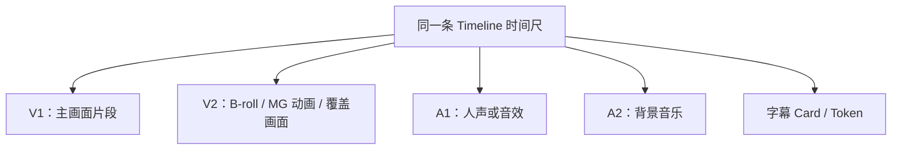
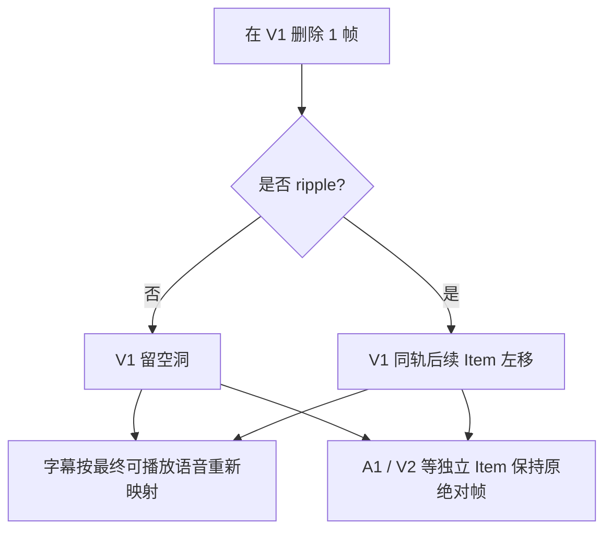

# 04｜时间线、轨道与改动联动

> 本篇定位：解释时间线的对象关系、坐标体系和改动传播机制。帧级实验只作为这些机制的证据来源，具体输入、返回字段和画面读回集中在第 08 篇；本文不按实验日志顺序叙述。

> 阅读边界：这里的“会动 / 不会动”是本轮 ChatCut Timeline 的证据，不是“任何对象都会永远如此”的全产品承诺。当前是否存在统一影响提示尚未验证；第 10 篇只盘点 ChatCut 链路的证据与缺口，不引入其他系统的设计结论。

## 先把三个容易混淆的词说清

### 1. Timeline：整条成片的时间尺

Timeline 可以理解为一把从 0 帧一直延伸到片尾的尺子。30 fps 的项目里，30 帧约等于 1 秒。所有画面、声音、字幕都使用这同一把尺：第 690 帧在 V1、V2、A1 和字幕里指的是同一个成片时刻。

### 2. Track：时间尺上的一层轨道

- V1、V2 等是视频轨。较高的视频轨会盖住较低轨的画面。
- A1、A2 等是音频轨。它们会并行混合，不会互相“盖住”。
- 同一轨内的 Item 不能重叠；需要叠加的内容要放在更高视频轨或另一条音频轨。

### 3. Item：某个素材在时间线中的一次使用

一个 Item 至少有两套位置：

```text
源素材坐标：从原始视频的哪一段取
时间线坐标：把这一段放在成片第几帧
```

例如：

```text
源视频 C1297 的 1800.0s–1890.0s
→ 被放在节目 Timeline 的第 0–2700 帧
→ 30 fps 下，正好成为 90 秒节目片段
```

源素材不移动；重新排序通常是改“这段在成片哪一帧出现”，不是把源文件本身重新剪坏。

## 主时间轴不是一个强父对象

常说的“主时间轴”是编辑上的概念：它代表观众最终主要看到和听到的骨架。对访谈往往是 V1 的主画面加主要人声；对音乐混剪可能是音乐节拍和镜头序列共同构成骨架。

但在当前 ChatCut 数据模型里，V1 不是一个会自动命令其它轨道跟着移动的“父对象”。各轨都只是同一时间尺上的独立 Item：



它们“看上去一起工作”，是因为编辑者把它们放在同一语义事件附近，而不是因为所有对象都自动继承 V1 的位置。

## 一个典型多轨版本：骨架、覆盖、声音和字幕怎样同时存在

以一条访谈精华为例，最小的可编辑结构可以是：

```text
V1：主讲画面 / 主叙事骨架
V2：关键观点 MG、B-roll 或画中画覆盖
A1：主讲原声和短促音效
A2：背景音乐
字幕：Timeline 级 Caption Program
效果：要么附着在一个 V1 Item，要么占据一个绝对时间范围
```

这不是一个“主轨带着子轨一起走”的树，而是多个对象在同一条时间尺上各自保存位置与关系。V2 能覆盖 V1 的画面，A1/A2 会混在一起，字幕另有自己的 Card / Token 模型；它们之所以在观众看来协调，是因为编辑意图把它们锚在同一事件附近。真实项目读回与浏览器核验见第 08 篇实验 1、5、9。

## 字幕为什么是特殊层

字幕不是“先找一句话所在的某一帧，然后把文字钉死在这一帧”。更接近下面的过程：


一个 Caption Card 同时有两类信息：

| 信息     | 它解决什么                                                      |
| -------- | --------------------------------------------------------------- |
| 时间信息 | 这句话/这个词在成片第几帧开始和结束；Token 的先后和不重叠关系。 |
| 视觉信息 | 字体、颜色、换行、字幕框的位置、局部强调和进出动画。            |

因此，字幕的“时间准确”和“视觉准确”是两件事：

- ASR 听错源文字，应该修转写源，而不是只改屏幕上显示的一张 Card；
- 只是想把观众看到的表述改得更短、更友好，可以改 Card 文本；
- 只想修某个词的出现时间，可用词级 Token 的绝对帧，但必须保持 Token 正序、不重叠、且在所属 Card 范围内；
- 只是字幕框太低、太窄或太密，改布局/样式，不应改变语音时间。

## 核心机制一：物理删帧与 `ripple` 如何重排同轨

“删掉第 N 帧”是一种物理时间线操作。它改变的是某一个 Timeline Item 的播放范围，而不是“删掉一句话”的语义选择。后端需要处理切分、空洞、同轨顺序和最终帧位；Agent 需要决定这刀是否合理、是否应该合拢。

第 08 篇用两个隔离版本验证了以下两种模式：

- `调研-帧级删除-不联动`：删除第 690 帧，但不 ripple；
- `调研-帧级删除-ripple`：同样删除第 690 帧，但启用 `ripple:true`。

删除前，在 V1 的第 690、691 帧切开，移除中间恰好 1 帧。实验的关键区域如下。

### A. 不启用 ripple：留出一个真实空洞

```text
V1： [663, 690) 视频 | [690, 691) 空洞 | [691, 2687) 视频
A1： Ding 音效 [661, 710)                  不移动
V2： MG 动画  [663, 718)                  不移动
```

字幕自动拆为两段：

```text
“科学家的” 663–689
“使命”     691–715
```

云端合成帧的观察结果：

| 帧  | 看到什么                      |
| --- | ----------------------------- |
| 689 | 人物画面 + MG 动画            |
| 690 | 黑画面 + MG 动画；没有字幕    |
| 691 | 人物画面 + MG 动画 + “使命” |

这说明“删除 V1 中的一帧”默认不是“让整条片缩短一帧”，而是先在 V1 留下一个空缺。视频轨没有画面时，底下又没有其它视频，渲染器自然显示黑色；V2 上的 MG 动画仍会显示，因为它仍在这个绝对时间区间内。

### B. 启用 ripple：同一轨后面的主视频左移 1 帧

```text
V1： [663, 690) 视频 | [690, 2686) 视频
A1： Ding 音效 [661, 710)                  不移动
V2： MG 动画  [663, 718)                  不移动
```

观察到的结果：

- V1 后续视频片段起点从 691 自动变为 690；
- 整体时长从 2687 帧变为 2686 帧；
- 字幕重新成为连续的“科学家的使命” Card；
- A1 的 Ding 与 V2 的 MG 动画没有因 `ripple` 被自动语义跟随；
- 689、690、691 帧都保持连续人物画面，标题与字幕没有黑洞。

### 这两种模式在架构上说明什么



结论不是“什么都不联动”，也不是“全部智能联动”，而是：

1. **`ripple` 是同轨结构操作。** 后端程序完成 V1 后续 Item 的帧位移，Agent 没有手算起点。
2. **字幕是语音派生层。** 当最终可播放语音连续时，它能重新映射成连续 Card；留空洞时也能反映空洞。
3. **MG 动画、音效、B-roll、背景音乐多是独立的绝对时间 Item。** 是否仍然恰好强调正确内容，需要重新检查和必要时重锚。

### 为什么独立轨道不会跟着 V1 一起推移

为了验证上面的结论不是只来自一条访谈线，又建立了一条独立的竖版数字人口播 Timeline（30 fps、768×1344）。它故意同时放入几种不同绑定关系的对象：

| 对象 | 基线位置 | 它用来验证什么 |
| --- | --- | --- |
| V1 主口播 | 三段顺序素材：`[0,120)`、`[120,240)`、`[240,360)` | 主叙事的连续片段。 |
| V2 画中画 | `[160,220)` | 上层独立视频 Item。 |
| A1 `Clean Ding` | `[178,227)` | 独立音频 Item；事件锚点在约第 180 帧。 |
| V3 Zoom | `[170,210)` | 绑在时间尺上的绝对时间效果。 |
| V1 片段 Zoom | 分别附着在后两个 V1 Item | 绑在某个视频 Item 上的效果。 |
| 字幕 | 只以 V1 为来源 | 从最终可播放语音派生的层。 |

先在 V1 第 120 帧插入一段 30 帧视频，并明确传入 `ripple:true`。读回结果很直观：V1 第二段从 `[120,240)` 变为 `[150,270)`，第三段从 `[240,360)` 变为 `[270,390)`，整条片从 360 帧变为 390 帧；但 V2、A1、V3 仍分别停在 `[160,220)`、`[178,227)`、`[170,210)`。

这回答了“插一个片段时其它东西会不会都往后推”的问题：**不会。** 后端替 V1 同轨后续片段计算右移；独立轨道仍按原来的成片绝对时间播放。云端合成帧确认插入边界没有黑帧，但第 160/180 帧上的画中画、音效和绝对时间 Zoom 已不一定还是原本想强调的那句内容。

随后从这条多轨线复制出新版本，通过 `read_script` 删除插入素材中的完整语义行“后来”，而不是手工删 30 帧。`apply_script(preview:true)` 先明确报告 V1 少一行、恢复为三段顺序素材，同时 V2 保留原有 gap 和画中画。提交后再次读回：V1 后续 Item 的起点被后端重新编译（原先在第 150 和第 270 帧开始的两段，分别改为第 120 和第 239 帧附近）；V2、A1、V3 仍保持原绝对位置；“后来”对应的字幕 Card 消失，后续字幕回到新的 V1 播放位置。

最后再把 V1 在第 180、181 帧切开，比较物理删 1 帧的两种模式：

| 操作 | V1 在第 180 帧 | 后续 V1 | V2 / A1 / V3 | 字幕与可见画面 |
| --- | --- | --- | --- | --- |
| 不 ripple | 留下 `[180,181)` 空洞 | 后半段仍从 181 帧开始 | 都不动 | 云端第 180 帧主画面为黑，右上角 V2 仍在；字幕在这个 1 帧窗口没有 Card。 |
| `ripple:true` | 空洞被合拢 | 后半段从 181 帧左移到 180 帧；后续第三段也左移 1 帧，片长 390→389 帧 | 都不动 | 云端第 179、180、181 帧都有主画面、画中画和字幕，没有黑帧。 |

但“没有黑帧”不等于“这是一刀好剪辑”。逐词读回显示：原本在 `[174,180)` 的“我”，在涟漪合拢后又出现一个仅 `[180,181)`、时长 1 帧的“我”，随后“最”从 181 帧开始。也就是说，系统成功把 ASR 时间投影到了新的连续时间线，却不会理解“删在一个汉字发音中间会造成听感和字幕重复”。

这正好划清分工：

```text
ChatCut 后端 / MCP：按请求切分、移动、重算最终帧位，并把字幕 Token 投影回新时间线。
Codex / 编辑 Agent：判断这是不是完整语义边界；决定应删整句、压缩停顿，还是只做物理修帧。
用户审片：判断嘴型、听感、阅读节奏和叙事是否真的自然。
```

## 核心机制二：删除完整语义如何重新编译主线

“删 1 帧”处理的是低层时间线操作；日常口播剪辑更常见的是“不要让观众听到这句完整表达”。此时 Agent 不应手工指定帧，而应通过 Script 表达语义选择，再让后端重新编译 V1 的源范围、Item 与成片帧。

以一段约 10.1 秒的数字人口播为例，内容依次是：

```text
但人可以在每一次选择里慢慢把意义做出来，
不是等答案出现，
而是先去认真的生活。
```

编辑决定是：删去第一句，以及它前后的无声空隙；保留后两句构成完整的“不是……而是……”表达。Agent 在 Script 中只表达“哪句话不要”，并没有要求“把后面片段左移多少帧”。

提交前的预览和提交后的读回一致：

```text
原始：1 个视频 Item，约 10.1 秒
删除后：仍是 1 个视频 Item，约 4.5 秒
源素材取用：从原片约 5.6 秒开始，到约 10.1 秒结束
成片位置：从新 Timeline 的第 0 帧开始
```

这件事用大白话说就是：

> ChatCut 没有把后半段视频先留在“原来的第 5.6 秒”，再请 Agent 去搬它；它直接把这个 Item 改成“从原片后半段取，并从成片开头播放”。

随后启用并刷新字幕，读回得到两张 Card：

| 成片位置   | 字幕               |
| ---------- | ------------------ |
| 0–55 帧   | 不是等答案出现     |
| 55–134 帧 | 而是先去认真的生活 |

云端合成帧也确认：第 0.33 秒已经是“不是等答案出现”的人物画面与字幕，没有黑帧，也没有残留被删句子的字幕。

这个实验补强了两个结论：

1. **Script 剪辑时的“后面怎么动”由 ChatCut 后端重新编译。** Agent 选择语义边界，后端计算新的源偏移、Item 时长和成片帧位。
2. **字幕会依据新的可播放语音重新生成/刷新。** 它不是永远死守旧时间线的位置。

但要注意，这条隔离线只有 V1 和字幕，没有 MG、B-roll、Ding 或背景音乐，因此它不能推翻前面的 1 帧实验：**独立包装层仍要在结构变化后单独检查。**

## 不能把所有“删 / 加”当成同一件事

截图里的“删 1 帧”只是最底层的物理时间线操作。真实剪辑至少还有“删完整一句”“删一段来源素材”“插入新视频”“加一层 B-roll”“替换镜头”几种不同情形；它们改变的对象、后端需要计算的内容、下游风险都不一样。

| 用户表面说法 | 实际改动对象 | 应走的主入口 | 执行语义与后续风险 |
| --- | --- | --- | --- |
| 删掉第 N 帧或已知帧范围 | Timeline Item 的物理时间范围 | Timeline 编辑 | 默认留下 gap；显式 `ripple` 才移动同轨后续 Item。切在发音/动作中间仍可能不自然。 |
| 删掉一句完整表达、口癖、重拍或回答 | “观众还要听到什么”的语义选择 | Script | 后端应依据源锚点重算主线 Item、时长与字幕投影；独立包装不因而自动获得新理由。 |
| 从很多段口播中删掉完整段落或来源片段 | 多个 Asset 的语义选择与播放顺序 | Script | Agent 编排观点顺序，后端把跨 Asset 的选择编译为新的 V1 引用序列。 |
| 给现有片段多留 / 少留几帧 | 同一个 Item 的源范围与时长 | Timeline 编辑 | 需要校验源边界、同轨重叠、字幕/旁白切口与音频连续性。 |
| 在 V1 中间插一段新视频 | V1 的顺序、后续 Item 帧位和可能的音频连续性 | Timeline 编辑；若要腾位置则明确 ripple | 只应重排目标轨的顺序 Item；其它轨按自身绑定关系复核。 |
| 在说话画面上加 B-roll | 更高视频轨上的独立覆盖 Item | Timeline 编辑 | 主语音可继续，但要检查遮挡、是否覆盖到正确语义以及嵌入音频。 |
| 原位换掉一个镜头 | 删除旧 Item + 新增新 Item 的原子批次 | Timeline 编辑 | 应明确哪些裁切、效果、字幕来源和音频关系要继承或重建，不能默认继承。 |

### “删一段视频”先分清：删的是 Item，还是删了 Asset

正常剪辑时，“把这段视频从成片删掉”应理解为删除或不再使用 Timeline 上的 Item；原始 Asset 仍在项目素材库，可以被其它 Timeline 或其它位置继续引用。它不是删除源文件本身。

~~~text
删 Timeline Item
→ 当前节目版不再播放这一段
→ 原 Asset 保留，可用于其它版本

删项目 Asset
→ 这是另一种更高风险的素材库操作
→ 可能影响其它引用它的 Timeline，不应混进普通剪辑实验
~~~

Asset 与 Item 分离是工具合同明确的项目模型；“同一个 Asset 被两个 Timeline 引用后，改其中一个 Timeline 是否完全不影响另一个”仍应作为独立实验验证，不能只靠模型说明下结论。

### 删完整语义时，和删 1 帧到底有什么不同

Script 删除一句话时，Agent 不提供“后续左移多少帧”的算术指令，而是提供“这句话不应再播放”的语义决定。后端重新编译最终可播放的源范围与 Item 边界；字幕再从这个新的语音主线生成或刷新。这就是前面“删首句后，后两句从新 Timeline 第 0 帧开始”的实测结果。

但这不等于每一层都会自动懂语义：

~~~text
Script 语义删除
→ 主 V1 / 主语音：后端重新编译
→ 字幕：从最终语音重新映射或刷新
→ Ding、背景音乐、B-roll、轨道范围效果：仍要逐项检查
→ 片段绑定效果：本次内置 Zoom 已验证能随保留 Item 继续附着；其它效果仍需隔离实测
~~~

### “增加几帧 / 插入视频”也有五种不同意思

| 用户真正想要的结果 | 应怎样理解 | 工具合同所说的默认行为 | 还必须实测什么 |
| --- | --- | --- | --- |
| 给当前镜头多留几帧 | 扩大已有 Item 使用的源范围。 | 不能越过源文件尾部，也不会凭空创造新画面。 | 在片头、中间、片尾扩展时的源偏移、时长、字幕和音频边界。 |
| 在 V1 中间插入一段新口播 | 创建新的顺序性主线 Item。 | 指定 V1 而发生重叠时不能悄悄覆盖；要么明确腾位置，要么使用 ripple。 | 后续 V1、主音频、字幕、原有音效和音乐各自怎样变化。 |
| 不挪主线，只在这一刻换画面 | 在 V2 或更高轨添加 B-roll / 覆盖。 | 上层视频覆盖下层画面，但主语音可以继续。 | B-roll 是否遮住人物/字幕；嵌入音频是否意外混入。 |
| 在片尾补一段视频 | 将新 Item 追加到轨道尾部。 | 前面的主线不需要移动。 | 新片段转写完成后，能否进入 Script、字幕和素材检索。 |
| 原位替换一段视频 | 以一个原子批次删旧 Item、加新 Item。 | 不会自动继承旧片的裁切、布局、淡入淡出或效果字段。 | 替换后字幕来源、效果绑定、音频连续性和回滚行为。 |

其中最容易误解的一点是：不指定精确轨道而把视频加到某个已有时刻，系统可能为避免同轨重叠而把它放到一个不冲突的轨道；这更像“叠一层画面”，不等于“插入主叙事”。要验证真正的插入，实验必须明确记录目标轨道、是否 ripple、后续主线帧位和所有下游对象。

## 官方补充：效果也有两种“跟随”方式

不要把所有 Zoom、LUT、滤镜或转场都看成同一种装饰。官方 Shader Skill 区分两种关系：

| 关系                                  | 大白话                                                                   | 改主画面后通常怎样                                         |
| ------------------------------------- | ------------------------------------------------------------------------ | ---------------------------------------------------------- |
| **片段绑定（clip-anchored）**   | “给这段访谈画面加 Zoom”。效果记得自己服务的是哪个视频 Item。           | 片段整体移动时，效果随这段片一起走。                       |
| **轨道范围绑定（track-bound）** | “在成片第 20–22 秒这一段加一个效果层”。效果记得的是时间尺上的一小段。 | 主轨 ripple 或重排后，它仍可能留在原来的绝对帧，需要检查。 |

所以“效果会不会跟着动”的正确问题不是“它是不是特效”，而是“它是绑在某个片段上，还是绑在时间尺上的一个范围里”。

本轮已经做了这两种关系的隔离对照：

- V3 的 Zoom 读回为 `[170,210)` 的轨道范围效果。插入 30 帧、Script 删除完整语义、以及 V1 涟漪删 1 帧后，它都留在这段绝对帧位，没有自动跟随 V1 的语义事件。
- 通过 `inspect_item` 读取 V1 的切分结果，切点后的新 V1 Item 和后续第三段 Item 都仍显示附着的 `builtin:zoom`。Script 重编译后 Item ID 已变，但本次保留片段的 Zoom 被重新挂回；物理切分后，效果落在包含其有效范围的后半段，而没有复制到切点前的半段。

这证明了本次 `builtin:zoom` 的两种绑定确实不同；**仍未证明**任意 MG、转场、LUT、B-roll 或第三方效果都具有相同的继承规则。复杂包装在结构变更后仍应逐项读回和看合成帧。

## 为什么 Ding 的 Item 会在事件点前开始

本轮将 `Clean Ding` 放在一个编辑事件点附近时，资源说明显示真正可听到的起音不在文件第 0 秒，而在约 0.082 秒。ChatCut 将“希望听到 Ding 的事件帧”转换为音频 Item 的物理起点：事件点在第 663 帧，音频 Item 实际落在约第 661 帧。

这避免了“文件开始有少量静音，就让听觉提示晚到”的问题。它也说明：

> 编辑事件点 ≠ 音频文件的物理第 0 帧。

这里的起点换算是后端执行责任；Agent 的责任是判断“这一刻是否值得有一个 Ding”。

## 哪些变化应该用 Script，哪些变化应该直接动 Timeline

| 想改什么                             | 首选入口                   | 原因                                 |
| ------------------------------------ | -------------------------- | ------------------------------------ |
| 删口癖、选最好的一次重拍、把结论前置 | Script                     | 这是“观众应听到什么”的语义决定。   |
| 在一句话处加入 Ding、B-roll、MG 动画 | Timeline Item              | 它们是独立的声画对象，需要明确摆放。 |
| 修正 ASR 听错                        | 转写修正                   | 先修源事实，再映射字幕和 Script。    |
| 改字幕的视觉文案或样式               | Caption Card               | 不应修改原始转写或主画面片段。       |
| 在一个已知帧切开已有素材             | `split_item`             | 这是明确的机械时间线操作。           |
| 缩短某段并希望同轨片段合拢           | `edit_item` + `ripple` | 让后端做同轨位移和冲突校验。         |

## 结构改动后的检查清单

每次删、插、重排或变速主线后，不要只看 V1。按下列顺序复核：

1. 主画面和主要声音是否连贯，有没有黑洞、错切、嘴型问题；
2. 字幕是否需要刷新，关键 Card 是否仍落在正确语义上；
3. B-roll、MG 动画、音效、效果和转场是否仍覆盖正确内容；
4. 背景音乐长度、循环、淡入淡出和 duck 是否仍合适；
5. 用 Timeline 读回确认结构，再用合成帧或浏览器看最终叠加结果。

## 深度拆解：一次改动靠“四套坐标 + 依赖关系”管理，不靠一条万能主轨

“主时间轴改了，为什么字幕会动、Ding 不动、某个 Zoom 又会动？”这个问题只有把对象实际记住的坐标分开，才能说清楚。

### 1. 同一个内容同时经过四套坐标

| 坐标 | 它回答的问题 | 典型对象 | 改主线后会怎样 |
| --- | --- | --- | --- |
| **源素材坐标** | 原片从第几秒到第几秒取内容 | Asset 的转写词、原片帧、源范围 | 原素材本身不因某条 Timeline 改动而移动 |
| **Item 局部坐标** | 这一次取用了源素材的哪一段、这段自身有什么绑定效果 | V1 的一个视频 Item、片段绑定 Zoom | Item 被重建或移动时，绑定关系可能随它保留 |
| **成片绝对坐标** | 观众在第几帧看到/听到它 | V2 B-roll、Ding、轨道范围 Zoom、字幕 Card | 若对象只记绝对帧，V1 ripple 后它通常仍留在原位置 |
| **语义 / 事件坐标** | 它服务哪一句话、哪个动作、哪个节拍或哪段画面 | “强调结论”的 Ding、“回答这句话”的 MG、画面—旁白关系 | 这是编辑意图，不等于当前 MCP 已暴露一张自动重锚图 |

可以把一次普通口播片段理解为下面这条可回溯链：

~~~text
原片 00:05:36–00:05:41
    ↓ 源素材坐标
V1 Item 取用该 5 秒
    ↓ Item 局部范围
成片 00:00:18–00:00:23
    ↓ 绝对 Timeline 帧
字幕 Token、Card 显示在这一小段

“这句是全片核心结论”
    ↓ 编辑意图
应让 Ding / MG / Zoom / 音乐变化服务它
~~~

前三层有明确的项目对象与读回证据；第四层在本轮更多存在于 Agent 的规划和用户意图中。**[未验证]** 当前 Hosted MCP 是否保存一张通用的“语义锚点依赖图”，并在主线重排后主动给出所有受影响对象。不能把“Agent 知道它为什么在这里”误读成“ChatCut 后端已保存并自动执行这个理由”。

### 2. 不同对象的“跟随”不是一个开关

下表按“对象究竟记住了什么”来分开，不把所有对象都当成主轨的子对象：

| 对象关系 | 它实际记住的重点 | 结构改动时的处理原则 | 谁负责下一步 |
| --- | --- | --- | --- |
| 同轨顺序 Item + ripple | 同一条轨上后续 Item 的顺序 | 显式 ripple 时，后端可在同一轨完成左/右移和冲突校验 | 后端完成算帧；Agent 只决定是否应 ripple |
| Script 主线 Item | 保留的语义段、源范围和新顺序 | 后端把 Script 选择重新编译为 V1 的 Item、源偏移和帧位；Item ID 可以变化 | Agent 选择完整表达；后端编译 |
| 字幕 Token / Card | 最终可播放语音到成片帧的投影 | 主线变化后刷新或重投影；时间连续不等于语言切口自然 | 后端维护时间映射；Agent 判断切点是否自然 |
| 片段绑定效果 | 某个 V1 Item 的局部效果关系 | 只有明确绑定到保留 Item 的效果才可能随着该 Item 延续 | 后端维护该特定关系；其它效果不可类推 |
| 绝对时间效果 | Timeline 的一个固定帧范围 | 保持在原绝对帧，除非有人明确移动或重锚 | Agent 判断是否应该重锚 |
| V2 画中画、Ding 等独立 Item | 自己的轨道和绝对范围 | 不应因 V1 ripple 或 Script 删除而被隐式平移 | Agent / 用户复核并必要时移动 |
| 音乐、MG、B-roll、转场 | 各自 Item 或效果关系 | 必须按各自保存的关系检查；没有统一的“全部跟随”开关 | 必须逐项读回、看画面或试听 |

所以“主时间轴”在编辑意义上是骨架，在数据意义上却不是一个全局父对象。系统只会对**明确存在的关系**自动处理；没有被保存的关系，只能被标记为待复核或由 Agent 重新判断。

### 3. 结构改动的真实处理链

把“删一帧”“删一句”“插一段”都称为“改主线”会掩盖它们的不同。一次安全改动应该经历下面六步：

~~~mermaid
flowchart TD
    A[先分类：物理帧操作，还是语义结构操作] --> B[读当前 Timeline / Script 快照]
    B --> C[提交明确写入：ripple、删留重排、插入或替换]
    C --> D[后端做本对象的确定性计算
切分、换算、同轨排布、编译或拒绝]
    D --> E[区分三类下游
自动更新 / 保持原位 / 不确定待复核]
    E --> F[读回结构和关键帧]
    F --> G[试听 / 浏览器审片 / 人工调整]
~~~

| 第几步 | Agent 的责任 | ChatCut 后端 / 渲染器的责任 | 这次实验实际支持的事实 |
| --- | --- | --- | --- |
| 分类 | 判断用户说的是“少一帧画面”还是“不再让观众听到这句话” | 无 | 物理删帧与 Script 删完整语义的结果确实不同 |
| 读快照 | 选择正确 Timeline、确认当前状态未过期 | 返回最新项目结构 | 旧 Script 在 Timeline 已变后被拒绝 |
| 提交意图 | 给出合法参数或 Script 语义选择 | 校验引用、帧范围、同轨约束 | 非法同轨重叠的批量编辑整体失败 |
| 确定性计算 | 不手算后续几十个 Item 的帧位 | ripple 位移、Script 编译、Token 投影、渲染 | V1 后续 Item 与字幕位置由后端读回 |
| 下游分类 | 识别哪些包装服务被删内容 | 只处理系统明确建模的关系 | V2/A1/绝对时间 Zoom 没有自动理解新语义 |
| 验证 | 判断口型、节奏、信息是否仍正确 | 提供结构、合成帧、导出结果 | 云端帧与最终 MP3 都曾用于核验不同问题 |

这也回答“删掉第 690 帧以后，帧索引是谁算的”：

> **不是 Codex 在脑中给每个后续片段重新编号。** Codex / Agent 只提出“在当前 V1 的这个范围删掉，并且是否 ripple”或“不要保留这句”；ChatCut 的项目写入逻辑计算合法的新 Item 和帧位。Codex 仍要读回这些结果，判断它是不是一次好的剪辑。

### 4. 删除与插入时，哪种状态发生了什么变化

| 用户的话 | 上游状态变化 | 后端可确定处理 | 不能自动保证的事 |
| --- | --- | --- | --- |
| “删掉第 N 帧” | 一个 Item 的播放范围被切开并移除一帧 | 是否留 gap、同轨后续是否 ripple、片长怎样变 | 切口有没有切断发音、嘴型或动作 |
| “删掉这句重复的话” | Script 中某个语义单元不再保留 | 重新选取源范围、重编译主线 Item 和字幕投影 | Ding、B-roll、MG 是否还服务正确句子 |
| “在中间插一段画面” | V1 新增顺序 Item，或 V2 新增覆盖 Item | 目标轨的冲突校验、明确 ripple 时同轨右移 | 独立声画包装是否与新内容冲突 |
| “替换这个镜头” | 旧 Item 与新 Item 的引用发生替换 | 若作为同一批合法写入，可避免半替换 | 旧片段的裁切、效果和音频是否应继承 |
| “把这段多留两秒” | 同一个 Item 的源范围或持续时间变化 | 边界不能越过源素材，且需维护同轨合法性 | 字幕、旁白、音乐的语义关系是否仍自然 |

### 5. 本轮尚未观察到统一影响报告：怎样把已测关系读成复核账本

**[未验证]** 当前 ChatCut Hosted MCP 会在每次结构改动后返回一张完整影响清单，例如“本次删句影响了 3 张字幕、1 个 Ding、1 段 B-roll、1 个 MG”。因此，不能把这种体验写成 ChatCut 已有功能。

但“没有看到自动报告”不等于“影响关系不存在”。本轮实验已经实际分出了三类结果：同轨 ripple 由程序重排；字幕从最终可播放语音重新投影；Ding、V2、绝对时间 Zoom 等独立对象保留旧绝对位置。为了把这些事实变成可审片、可复现的结论，下面这张表是**调研者/审片者使用的影响账本**，不是 ChatCut 自动输出，也不是对任何其他产品的设计要求。

| 影响账本中的一栏 | 它从本轮什么事实而来 | 它帮助判断什么 |
| --- | --- | --- |
| **本次主线变化** | Script 提交后 V1 的源范围、Item 和总时长会读回为新状态；物理删帧也会改变目标轨长度。 | 删的是一个源范围、一个语义单元，还是只是一个物理帧；片长改变多少。 |
| **已经由项目状态重算** | [已实测] 同轨后续 V1 Item 会按 `ripple` 重排；字幕会根据最终可播放语音映射。 | 不必把已由后端处理的帧位，又按旧帧号手工搬一次。 |
| **仍占旧绝对时间** | [已实测] V2、A1 Ding、轨道范围 Zoom 在结构改动后仍留在原帧区间。 | 哪些对象必须回看，确认它们还在强调正确的内容。 |
| **只保存了部分关系** | [工具 / Skill 合同明确] 片段绑定效果能记录“服务某个 Item”；外部接口未暴露所有包装的统一语义理由。 | 不能假装每个声音、B-roll、MG 都能自动知道该跟到哪一句。 |
| **验证动作** | 浏览器合成帧、字幕读回、最终 MP3 都曾被用于不同实验。 | 应看哪几个变更边界、听哪个切口，而不是只读到 `success`。 |

这张账本保留在 ChatCut 拆解中，是因为它把“删一帧后到底谁动了”的实测结果翻译成读者能检查的关系，而不是把结论缩成“工具支持 ripple”。先区分“已重算、仍固定、需要判断”，才不会误把一次时长变化理解为整条片的语义和审美都已经自动修好。

## 一句话总结

ChatCut 的“准确”不是让所有物件神奇地绑成一个整体，而是让每种对象使用合适的关系：语义剪辑由程序落帧，字幕从最终语音派生，独立音画包装按时间线摆放，并在结构变更后被明确复核。
