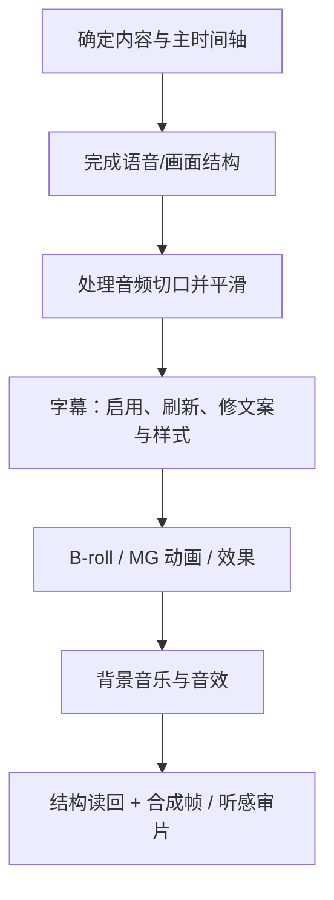

# 06｜字幕、音效、背景音乐与 MG 动画

> 本篇定位：解释字幕、音效、音乐和 MG 为什么不是同一种“装饰”，以及它们各自怎样绑定到主线。实机读回只为验证对象关系；具体时间、波形、字段和样例集中在第 08 篇。关于“某个声音是否艺术上合适”的判断属于编辑 Agent 与用户，而不是后端可以自动证明的事实。

## 先给结论：四种东西有四种“绑定方式”

| 层 | 它真正绑定的是什么 | 结构改动后最常见的行为 |
| --- | --- | --- |
| 字幕 | 最终可播放语音的 Token 与 Card | 可刷新/重新映射；能保持时间连续，但不会替人判断切点是否切在一个字或一句话中间。 |
| 音效 | 一个编辑事件附近的绝对时间点 | 音效 Item 通常不自动理解主线变化，要检查是否仍打在正确时刻。 |
| 背景音乐 | 整条片的长度、段落和人声关系 | 通常要重新裁切、循环、淡入淡出和检查 duck。 |
| MG 动画 | 一段画面要强化的信息和所占屏幕区域 | 是独立画面 Item；结构重排后要检查是否仍强调正确内容、有没有挡脸/挡字幕。 |

所以它们不能被笼统称为“视频上的装饰”。每种对象有不同的来源、时间模型和修改方法。

## 1. 字幕：先有说话时间，再有屏幕上的文字

### 字幕的两层准确性


- **时间准确**：一个词实际什么时候说，投影到成片后应该在哪些绝对帧显示。
- **视觉准确**：观众是否看得清，怎样换行，哪些词高亮，字幕框有没有压住人物和其它信息。

这两层是独立的。当前 Caption 合同中，Card 可以拥有文本、Token、起止帧、布局、样式和局部 span 强调；词级时间必须正序、非重叠，并落在 Card 的范围内。

官方字幕 Skill 还特别区分了三类“改字幕”：

- **Card 文本**：观众看见哪一句话；
- **视觉样式**：字体、颜色、一个词的强调或说到该词时的动态高亮；
- **Layout**：字幕框本身在画面上的矩形位置和大小。

它们不能互相替代。比如“某个词要有动态高亮”是在 Card 内做局部视觉处理；“字幕框挡住人物”要改 Layout；只有 ASR 把原话听错，才应修转写源。这个细分能避免为了排版问题去改声音事实。

### 四种问题，四种正确处理法

| 你发现的问题 | 正确入口 | 不该做什么 |
| --- | --- | --- |
| ASR 把原话听错 | 修转写源 | 只改屏幕文案却让 Script/检索继续使用错误原词。 |
| 观众看到的字幕想更短或更顺 | `set_card_text` | 误以为这会修改原片声音。 |
| 某个词早/晚出现 | `set_card_tokens` | 将任意 Token 改到 Card 外或与其它词重叠。 |
| 字幕太低、太窄、太密、强调不突出 | Card 样式与布局操作 | 用改转写或删视频来解决版式问题。 |

### Card 还保存空间布局，不只是文字和时间

一个真实 Card 会有独立的 `left`、`top`、`width`、`height` 等布局信息；第 08 篇的访谈样例展示了该结构。这说明字幕并不是一串没有空间信息的文本；它有独立的位置和可读性约束。

### 字幕会重投影，不等于它懂得语义

当 V1 被物理切开并删除一帧时，字幕系统面对的是“最终可播放语音发生了什么”，而不是“这一刀是否符合语言边界”。第 08 篇的多轨样例将两种操作读回为：

| 操作 | 第 180 帧的主画面 | 字幕 Card / Token 的实际读回 | 应怎样理解 |
| --- | --- | --- | --- |
| 不 ripple | V1 留下黑帧；V2 画中画仍在上层 | `[172,180)` 有“我”，`[180,181)` 没有 Card，181 帧后才继续下一段文字 | 字幕反映了可播放主语音的空洞，并没有自己补一帧。 |
| `ripple:true` | V1 后半段左移，云端第 180 帧有连续人物画面和字幕 | 一张 Card 跨 `[172,239)`；词级 Token 为“我”`[174,180)`、又一个“我”`[180,181)`，随后“最”从 181 帧开始 | 时间上连续，但切到字中间造成了 1 帧重复；这是机械映射，不是自然语言判断。 |

随后执行 `edit_captions({ action: "refresh" })`，返回 `status: "canonical"`、`changedCards: 0`。这能证明读取时的字幕计划与当前 Timeline 一致；**不能从外部 MCP 反推出**到底是哪个私有服务、在哪个内部步骤自动重算了 Token。

对编辑流程最重要的结论是：

```text
后端负责：把已存在的 ASR 词和最终视频片段重新投影到成片帧。
编辑 Agent 负责：避免在字、词、半句或口型中间做物理切割；必要时改为删完整语义或压缩停顿。
```

所以“字幕在第 180 帧仍然出现”只能证明技术上没有掉字幕，不能证明这句口播已经剪得好。

### 数字人口播里，字幕动效和 MG 动画不是一回事

为了看清对象边界，可以只使用**字幕 Card 内部的局部强调**，而不同时加入 MG 动画、Zoom 推近、B-roll、转场、背景音乐或音效。这样能明确区分“词级字幕动效”与“独立视觉 Item”。

为什么要这样控制？因为这些包装层都依赖最终说话时间；先验证语义重排、字幕映射和音频切口，才能知道后续包装该锚在什么位置。

短版主线在 24 fps 下由 25 个 Script 语义行生成了 33 张字幕 Card。默认是 Plain 样式，竖版画面中的字幕框约为：

~~~text
left=58, top=996, width=653, height=52
单行最多约 15 个中文字符
~~~

这里要分清三个层次：

| 层次 | 这轮实际做了什么 |
| --- | --- |
| Script | 先决定短版该保留哪些观点和顺序。 |
| Caption Card | 把最终可播放语音切成 33 条便于阅读的短句。 |
| Card 内 Span | 只给一条核心结论加局部颜色、大小和说到当前字时的动态效果。 |

被强调的核心结论是“慢慢把意义做出来”。它所在的 Card 范围为第 807–856 帧；Card 内部的真实词级时间并不把整句当成一个大块，例如：

| 字 | 最终时间线帧 |
| --- | --- |
| 慢（第 1 个） | 809–814 |
| 慢（第 2 个） | 815–817 |
| 把 | 817–823 |
| 意 | 823–828 |
| 义 | 828–831 |
| 做 | 831–837 |
| 出 | 837–840 |
| 来 | 840–846 |

对这 8 个字写入的样式是：

~~~text
常态：黄色、加粗、放大约 12%
正在说到的当前字：深色字 + 黄色强调底
进入动画：约 180ms 的轻微上移和缩放
~~~

Card、8 个 Token 和 180ms 动画配置已重新读回；抽样合成帧也可见强调状态随“慢—慢—把—意—义—做—出—来”逐字变化，而不是整句同时闪烁。这里没有做整段逐帧播放或听感验收，因此不能把它写成“视觉与发音已被完整逐帧确认”。

这说明两点：

1. 这不是一个独立的 MG 动画 Item，而是字幕 Card 内、绑定词级时间的 Span 样式。
2. ChatCut 能在主线改完后把字幕词级时间投影到新 Timeline；但“哪一句值得强调、要不要再加推近或 MG 动画”仍是编辑判断，不是自动结果。

### 多源/双语字幕

**工具合同明确、尚未实操：**当前 `edit_captions` / `read_captions` 合同支持多个字幕来源、翻译、单通道或自动堆叠布局。多语言不需要为了“中英两行”再新建一条视频轨；它仍是一个字幕程序中的多个来源。多机位或旁白/现场声混合时，应先决定哪些声音应显示为字幕，避免把同时存在的所有声音不加区分地堆到屏幕上。

## 2. 音效：先定义“编辑事件”，再选择声音

音效不是“发现有空白就加 Whoosh”。正确的思路是：

```text
发生了什么编辑事件？
→ 它的作用是确认、转场、强调、喜剧反应、空间感，还是节奏推进？
→ 此刻是否真的需要声音？
→ 从内置库中找最接近的候选，或明确授权后生成定制声音
→ 放到事件点附近，试听并在画面中检查
```

### ChatCut 里的三个声音来源

| 来源 | 用途 | 已知边界 |
| --- | --- | --- |
| 内置 Sound Effects | Ding、Whoosh、Impact、Click 等常见编辑音效 | 用 `browse_library` 搜索和取使用指引；2026-08-27 的动态库概览有 35 个音效。 |
| `submit_sound` 生成 | 库中没有的定制/原创音效 | 会产生异步任务并可能消耗积分；不能默认多生成。 |
| 用户/项目自有音频 | 特定品牌声、现场声、已授权声音 | 必须先进入项目素材库，再作为普通音频 Item 摆放。 |

内置库检索不是“去互联网随便搜”。它是 ChatCut Library 的一个分类；2026-08-27 的 `browse_library` 概览还显示 MG 动画、LUT、Zoom、效果和转场，但没有“内置背景音乐”分类。库内容会变化，数量不是永久产品规格。

### 事件点与物理文件起点不是同一件事

本轮使用的 `Clean Ding`，资源说明显示可听到的起音约在音频文件开始后的 0.082 秒。将 Ding 锚定在编辑事件第 663 帧时，实际音频 Item 被后端放到约第 661 帧，目的是让真正听到 Ding 的瞬间落到编辑事件附近。

```text
希望观众听到 Ding 的事件点：第 663 帧
音频文件前面有约 0.082 秒空白
→ 物理音频 Item 的开始：约第 661 帧
```

**已实测：**该音效的实际 Item 范围在测试 Timeline 中为 `[661,710)`。因此“把音效放到第 663 帧”可能是一条编辑意图，而不是 Item 一定从 663 开始的低层字段。

最终云端声音导出又补了一个同类但更直观的证据：Whoosh Item 的物理范围为 `[117,156)`（约 `3.90–5.20s`），但导出后主要声音能量约在 `4.35s` 出现。也就是说，**Item 起点、资源的可听起音和主要能量峰值可以是三个不同的时间点**。后端可以保存物理位置，编辑 Agent 则应先说清“要让观众在什么事件点感到这一声”，不能只把资源文件第 0 帧硬对齐到画面切点。

### 谁决定“这个片段需要什么音效”

后端知道如何把一个库资源放上轨道、怎样处理锚点和时长；它不能从一次 `browse_library` 调用中证明“这就是最有品味的声音”。判断分工是：

| 责任 | 责任者 |
| --- | --- |
| 判断某个观点、切换或动作是否值得强调 | 编辑 Agent / 用户 |
| 将“确认感、轻快、不过分抢戏”等意图翻译成搜索词和候选 | 编辑 Agent |
| 提供库内候选和使用方式 | ChatCut Library |
| 将声音放入时间线、保存帧位和混音参数 | ChatCut 后端 |
| 检查它是否太响、太早、太晚、抢人声 | Agent + 用户听感审片 |

### 硬切声音怎样收尾，取决于源片有没有可用余量

数字人口播等多段硬切主线，结构完成后需要再决定是否做 `smooth_audio`。它不是凭空生成声音，而是使用片段边界附近实际存在的源音频余量。

预检结果不是“自动给每个切口都做完美交叉淡化”，而是：

~~~text
真实交叉淡化：0 处
没有足够源余量、改用淡入/淡出：7 个切口
写入短淡入：8 个片段
写入短淡出：8 个片段
~~~

读回前两个视频 Item，均带有约 0.1667 秒的 audioFadeIn 和 audioFadeOut。原因很简单：每段都从源文件第 0 秒开始、一直用到源片尾，没有额外画面/声音可以拿来和相邻片段重叠，真正的交叉淡化没有“余量”可用。

大白话解释是：

> ChatCut 不会为了凑一个交叉淡化而凭空发明声音。没有可重叠的源素材时，它退化为很短的淡出再淡入，优先减少爆音和点击声。

这是一种技术性收尾，不是对听感的最终保证。仍需播放审听：连续淡入淡出可能在某些口播切点造成轻微能量下沉；如果要更自然，剪辑者可能需要保留呼吸、用 B-roll 覆盖，或重新选择切口。

## 3. 背景音乐：它服务结构，不代替结构

### 音乐从哪里来

| 来源 | 对应能力 | 重要限制 |
| --- | --- | --- |
| 生成背景音乐 | `submit_music`（工具合同） | 运行时合同只确认它提交异步音乐生成并在完成后产生项目音频 Asset。本轮没有提交付费生成，不能评价成品、Beat、时长或许可。 |
| 外部公开素材 | `search_stock_media` 后选择、下载、导入 | 已实际完成一次只读查询；它返回来源、下载候选和许可字段，但未下载/导入，也不能把搜索结果直接当已授权素材。 |
| 用户自有/已授权音乐 | 导入项目素材库 | 版权和使用范围由用户保证。 |

从工具合同可知，即使生成音乐成功，也只是先得到一段音乐素材；之后仍需放置、裁切、循环、相邻段交叠、淡入淡出和调整人声关系。这是流程边界，不是本轮已经完成的音乐成片实测。

### 人声与音乐怎样共处：Anchor / Follower

ChatCut 的音轨可设置角色：

- 口播、访谈、旁白所在轨：`anchor`，即主说话轨；
- 背景音乐、环境铺底：`follower`，即跟随轨；
- 短促音效通常不设角色，以免每个 Ding 都被自动压低。

当一条 `anchor` 轨和一条 `follower` 轨存在时，工具合同描述系统会让音乐在人声下自动 duck，在停顿和结尾恢复。它不是把音乐永久调得很小，也不应同时把音乐 Item 的基础音量大幅压低后再叠加强 duck。


### Duck 是轨道角色关系，不是“自动混好”的承诺

本轮没有测试 `submit_music` 的生成质量；但在同一条 Timeline 上，分别导出了 Duck 开、Duck 关、仅 BGM 基准三条真实云端 MP3。三条均约 29.0337 秒。以两段人声 Anchor 为窗口对比，Duck 开版本的背景音乐相对 Duck 关版本分别下降约 `-6.62 dB`、`-6.61 dB`，与 Timeline 读回的 `duckDepthDb=-6.6` 一致。

无人声的开头，两条版本基本没有差异；人声停顿处可以看到恢复尾音，片尾基本回到原音乐电平。因此这次可以严谨地说：

> **[ChatCut 已实测]** Anchor / Follower 的 Duck 配置会进入最终云端声音成片，并在本轮样本中产生可测得的音乐下沉。

但不能把它扩大为“Duck 一定自然”或“音乐一定不会盖住每种人声”。不同音乐频段、说话声、响度、停顿和播放设备都可能改变听感；本轮是渲染与波形机制验证，完整审美仍要由人播放试听。

### 音乐长度为何必须最后处理

如果主语音或节目主线还会删改，视频实际时长还不稳定。正确顺序是：

```text
先确定语音/节目骨架
→ 知道真实片尾在哪里
→ 放背景音乐
→ 过长则裁切并淡出；过短则分段循环和交叠
→ 最后再检查 duck 与听感
```

对于音乐主导的 Montage，音乐可以在创作上先成为节拍尺；但仍要由时间线逐帧落画面，不能把“生成音乐”误认为“自动把镜头卡到每一个 Beat”。

## 补充：画面驱动旁白怎样避免失准

旁白、配音和原片采访音频不是同一种对象。对产品演示、录屏和图文解释片，官方 Voice Skill 推荐先做一张“画面—旁白同步图”：

| 需要记住的内容 | 人话解释 |
| --- | --- |
| 画面范围和视觉锚点 | 这句话到底对应哪个操作、哪个界面状态或哪个图表数据。 |
| 旁白文案和真实音频时长 | 不是只估算“应该差不多 4 秒”，而是等音频生成后看真实时长。 |
| 摆放范围与混音关系 | 旁白在哪一帧开始，是否压低原声或背景音乐。 |

如果视频被重新裁切、加速、移动或替换，旧同步图里涉及的行就失效了。正确动作是先重新看当前画面，再调整旁白；不能只把旧音频 Item 平移一下就宣布同步完成。

这能解释一个很容易被忽略的联动：**画面驱动旁白与视觉时间线是强语义关系，但普通音频 Item 本身不会自动理解这层关系。** 本轮未实测 TTS，因此这部分标为 **Skill 明确**。

## 4. MG 动画：一个可复用 Asset 与一次摆放的 Item 分开

MG 动画有两层：

| 层 | 保存什么 |
| --- | --- |
| Asset | 图形的代码/样式、默认可编辑属性、自然尺寸、时长。 |
| Timeline Item | 它在这条 Timeline 的开始帧、时长、轨道、位置、大小和本次实例的属性覆盖。 |

这和视频 Asset / Item 的关系相同。改 Asset 可能影响复用它的实例；只移动某一次出现的位置，应改 Item。

### Hosted MCP 的图形创建合同，与 Desktop Skill 不是同一件事

当前 Hosted MCP 确实暴露 `create_motion_graphic_from_code`：它的工具合同说明可用内联 JSX 创建 MG Asset，再用 `edit_item` 放到时间线。但本轮访谈实验只验证了**已有 MG Asset 的摆放、读回和合成结果**，没有在 Hosted 路径实际提交过 JSX 创建。

已安装的 `create-motion-graphics` Skill 则明确面向 ChatCut Desktop / ACP 本地工作面，不能把它直接当成“Hosted 端完整创建流程已实测”的证据。两条路径共同说明的只是 Asset / Item 分层：

```text
创建或更新可编辑的 JSX Motion Graphic Asset
→ 再把该 Asset 作为 Timeline Item 放到 V2 等上层轨
→ 用合成帧检查它是否挡脸、挡字幕或在动画稳定状态下被裁切
```

前一步（若执行）决定图形本身的代码、默认属性和自然尺寸；后一步决定本次实例的时间、位置、大小和属性覆盖。已实测的 Asset / Item 分离支持“移动一次 MG 不应改共享图形本体”；至于 Hosted 路径中创建/修改共享 JSX 后所有实例的具体继承表现，仍待隔离实测。

### 正确的 MG 动画工作方式

```text
主线已经稳定
→ 找到真正值得视觉强化的一句/一个信息点
→ 查看该时刻的合成画面
→ 决定它是覆盖画面还是全屏节拍
→ 设计可读的图形和可编辑属性
→ 创建 Asset
→ 在 V2 等上层轨放置 Item
→ 看多个合成帧确认不挡脸、不挡字幕、动画完整
```

2026-08-26 访谈测试中，关键观点 MG 动画被放在 V2 的 `[663,718)` 范围。删除 V1 的一帧后它仍停在该范围，证明这一个 MG 是独立 Item，不会因主画面 ripple 自动改变自己的语义锚点。

### MG 动画与字幕的关系

MG 动画应补足字幕无法高效表达的内容：关系图、关键数字、产品界面、章节转换、人物条、对比、证据等。它不应只是把同一句字幕再做一遍更大的字。

如果 MG 动画和字幕同时存在，放置前必须看目标帧，而不是固定套一个角落。需要保护：人物的脸和嘴、重要手势、产品/Logo、正在出现的字幕、已有的图文信息。

## 5. Zoom、效果、转场：它们也有明确的时间范围

2026-08-26 访谈测试 Timeline 的 V1 上有一个内置 Zoom 效果，范围为 `[674,729)`，并含有放大倍率和进出缓动帧等参数。它不是“视频永久放大”，而是一个有起止范围的效果实例。

### 同样叫 Zoom，跟随方式也可能完全不同

在多轨隔离 Timeline 中，实际同时存在两类 Zoom：

| Zoom 类型 | 实测位置 / 读回 | 插入、语义删除或删 1 帧后发生什么 |
| --- | --- | --- |
| 轨道范围 Zoom | V3 的 `builtin:zoom`，范围 `[170,210)` | V1 插入 30 帧、Script 删除完整语义、V1 ripple 删 1 帧后都没有移动，仍留在成片第 170–210 帧。 |
| 片段绑定 Zoom | `inspect_item` 显示为附着在指定 V1 Item 上的 `builtin:zoom` | 切分后，包含效果范围的后半段新 Item 仍带该效果；Script 重编译后 Item ID 改变，但保留片段仍读到效果。 |

这是一条很实用的判断规则：

> “效果有没有跟着走”不取决于它叫不叫 Zoom，而取决于它记住的是**某段片**还是**时间尺上的一段范围**。

本次只证明了内置 `builtin:zoom` 的这两种行为。MG 动画、B-roll、转场、LUT 和第三方效果仍不能据此一概而论，结构改动后仍要读回并看合成帧。

同样地，转场、滤镜、LUT、B-roll 和 PiP 都应由它们服务的编辑目的决定：

- 转场表达段落变化，不是每个切口都加；
- Zoom 用于强调、推近信息或节奏，不是替代镜头选择；
- B-roll 用于遮跳切或证明所说内容，不是为了让画面一直变化；
- PiP 需要先检查底图和源图的保护区域，不能默认压在人物或字幕上。

## 深度拆解：四种锚不是“主轨的孩子”，而是四种不同的定位规则

字幕、音效、音乐和 MG 都可能“出现在第 18 秒”，但它们为了找到这个位置，记住的依据完全不同。这是结构修改后联动差异的根源。

| 锚定模型 | 它真正记住什么 | 后端可以确定处理什么 | 主线改动后仍需人判断什么 | 本轮证据 |
| --- | --- | --- | --- | --- |
| **文字投影锚** | 源转写词 + 被采用的播放范围 + 最终成片帧 | 将 Token 投影为 Card / 词级帧，保持时间顺序 | 这一刀是不是切在一个词、半句或嘴型中间；显示文案是否还合适 | [已实测] Script 改动后的字幕重投影、Card / Token 读回 |
| **声音事件锚** | “希望观众在某个编辑事件感到一声”的意图，加上资源自身 onset | 根据音频文件的真实起音/前导静音换算 Item 物理开始 | 该事件是否值得加声、声音是否抢戏、音量和主要能量是否恰好合适 | [已实测] Ding 前移、Whoosh 物理范围与主要能量不同 |
| **结构覆盖锚** | 节目段落、片头/高潮/片尾和人声关系 | 保存音乐 Item 的范围、淡入淡出、Anchor / Follower Duck 关系 | 主线变长或重排后音乐何时转段、何时结束、听感是否自然 | [已实测] Duck 最终 MP3；音乐重计时未完整验证 |
| **视觉对象锚** | 某个片段、一个绝对时间窗口或要强调的信息 | 保存 Item / 效果范围、层级、位置、缩放等 | 结构改后它是否仍强调正确内容、是否挡脸/挡字幕 | [已实测] 两类 Zoom；MG/B-roll 的通用继承未验证 |
| **画面—旁白锚** | 当前画面事件、旁白文案、真实音频时长和摆放范围 | 可保存音频 Item 和轨道关系 | 画面改时后这句话是否仍对应屏幕上正在发生的事 | [工具 / Skill 合同明确]，本轮未做 TTS 闭环 |

这里的“锚”是解释编辑关系的词。**[未验证]** 当前 Hosted MCP 是否把全部锚统一存为一个通用对象图；外部只明确看到了不同对象各自的时间、来源和效果关系。因此，不能假设系统会自动沿着所有语义关系传播一次修改。

### 1. 字幕：一条词级投影链，而不是“把句子钉在第 N 帧”

~~~mermaid
flowchart LR
    A[源 ASR Token
字词 + 源时间] --> B[被 Script / Item 选入最终主线]
    B --> C[映射到最终 Timeline 帧]
    C --> D[按阅读节奏组合 Card]
    D --> E[Card 文案、样式、布局、Span 动画]
    E --> F[合成画面中的可见字幕]
~~~

这条链的每一段都有不同的修改入口：

| 想改变什么 | 应动哪一段链 | 为什么不能动其它段代替 |
| --- | --- | --- |
| 原话识别错 | ASR / Transcript | 只改 Card 不能让 Script 和检索知道正确原话 |
| 不想再让观众听到一整句 | Script / 主线 | 只删 Card 会留下声音和画面 |
| 观众看到的句子想更短、更顺 | Card 文案 | 不应假装改了原始发音 |
| 一个词太早或太晚亮起 | Token 的最终帧 | 不应因此重剪原片或改变其它词顺序 |
| 字幕挡脸、行太长、重点不突出 | Layout / Style / Span | 版式不是语义选择问题 |

因此，“字幕能跟主线走”不等于“字幕永远正确”。本轮的 1 帧 ripple 实验中，字幕能够保持连续，却出现了 1 帧重复“我”；这正说明后端做的是时间映射，编辑质量仍要看完整词和完整句。

### 2. 音效：观众听到的事件点、文件起点和能量峰值可能不同

用 Ding 的实测行为把三种时间说清楚：

~~~text
编辑事件：希望观众在第 663 帧“感到确认”
资源 onset：Ding 文件开头有约 0.082 秒还没有真正起音
Item 物理开始：后端将文件约从第 661 帧放入
观众感到起音：接近第 663 帧
~~~

Whoosh 的最终导出又说明，文件开始有声音并不等于主要能量峰值已经发生。于是一个正确的音效摆放，不是只填一个数字，而是：

~~~mermaid
flowchart LR
    A[定义编辑事件
确认 / 转场 / 强调 / 反应] --> B[定义观众应感到的时刻]
    B --> C[查资源的 onset、时长和主要能量]
    C --> D[换算 Item 物理范围]
    D --> E[放入音频轨并处理混音]
    E --> F[看画面 + 实际试听]
~~~

其中 A 和 B 是编辑判断；C 和 D 是资源与时间线计算；E 是项目写入；F 才能决定它是不是“恰到好处”。当前系统可提供资源发现和精确摆放，**不能从一次库搜索中证明它已经自动知道某条访谈最适合哪一种声音。**

更细地说，Agent 选择声音时应先写出功能，而不是只搜一个泛词：

| 画面 / 叙事事件 | 先问什么 | 合理的声音方向 | 常见不该做的事 |
| --- | --- | --- | --- |
| 观点落下、数字确认 | 需要观众“收到”这件事吗 | 很短、轻、干净的 Ding / Click | 把每句话都加一个提示音 |
| 段落切换、画面掠过 | 是否真的有空间/动势变化 | 轻 Whoosh，且不盖人声 | 把硬切自动全配 Whoosh |
| 喜剧反应 | 画面本身是否已足够有趣 | 克制的反应声或完全不用 | 用夸张音效替代节奏 |
| 信息图进入 | 是强调信息还是制造转场 | 简短确认 / 上扬提示 | 让音效比信息本身更抢 |

这是 Agent 的导演规则，不是已实测的 ChatCut 内置自动推荐模型。

### 3. 背景音乐：它是跨段关系，不是许多个独立音效

音乐的难点在于它同时服务整条片的节奏和每一段人声。一个可解释的音乐状态至少要区分：

| 音乐关系 | 它需要保存什么 | 结构变动后怎样处理 |
| --- | --- | --- |
| 音乐 Item 本身 | 资源、开始/结束、循环/裁切、淡入淡出、基础音量 | 主线长度变了就重新检查片尾、循环点和段落交界 |
| 人声 Anchor | 哪条轨代表不能被音乐遮住的主要说话声 | 人声内容或停顿变了就重新复听 Duck |
| 音乐 Follower | 哪条轨应在人声下自动下沉 | Duck 会按角色关系继续工作，但“此时该不该有音乐”仍需判断 |
| 段落意图 | 开场、推进、高潮、收束各要什么能量 | 当前 MCP 未见通用语义锚图，主线重排后需人工重新标注 |

本轮的三条 MP3 导出已证明 Anchor / Follower 配置会真实进入最终声音成片，并且在两段人声窗口产生约 6.6 dB 的下沉。它证明的是“混音关系在渲染时生效”，而不是“音乐已经自动为新时长写好结构”。

### 4. MG、B-roll、Zoom：先分清它服务的是一段片，还是一段绝对时间

视觉包装最容易因为“它也是在第 18 秒出现”而被误看成同一种对象。实际至少有两类：

| 视觉关系 | 举例 | 改 V1 后的合理预期 | 本轮事实 |
| --- | --- | --- | --- |
| 片段绑定 | 给某个主讲 Item 加局部 Zoom | 该 Item 整体被保留和移动时，效果可跟着那段片 | builtin Zoom 已做隔离实测 |
| 绝对时间覆盖 | V2 的 B-roll、MG、画中画、某段轨道范围 Zoom | 它仍占原帧，可能已覆盖到另一句内容 | V2、绝对时间 Zoom 实测保持原位 |
| 视觉语义锚 | “这张图证明刚说的这个数字” | 应在相应句子附近，但必须检查新句子是否仍是它的理由 | 当前没有通用自动重锚实测 |

所以一次 MG 或 B-roll 的完整记录，应该同时有两层：

~~~text
确定性层：Asset、轨道、开始帧、结束帧、位置、尺寸、层级
编辑理由层：它在帮助观众理解哪一句、哪一个数字或哪一次转场
~~~

前一层可以让后端稳定渲染；后一层才能在主线被删改时提醒“它的理由可能失效”。当前 ChatCut 外部接口已能读到前一层的一部分，但未证明它公开保存后一层的统一依赖关系。

### 5. 每种包装何时必须重新检查

| 上游改动 | 字幕 | Ding / Whoosh | 背景音乐 | MG / B-roll / Zoom |
| --- | --- | --- | --- | --- |
| 仅改字幕颜色、布局 | 看画面即可 | 无需重锚 | 无需重锚 | 无需重锚 |
| 改 Card 文案但声音不变 | 检查阅读节奏 | 通常无影响 | 通常无影响 | 若文案改成不同信息，检查视觉强调是否仍合理 |
| 删一句或重排主语音 | 刷新 / 读回 Token 和 Card | 检查是否还打在该事件 | 重查段落、Duck、片尾 | 检查是否仍服务正确语义 |
| 插入 V1 新视频或 ripple | 检查投影是否连续 | 检查绝对位置是否提前/滞后 | 检查段落长度 | 绝对时间对象重点复核；片段绑定对象读回 |
| 替换画面 | 若声音不变，字幕时间可不变 | 仅在事件未变时可保留 | 通常无直接影响 | 必须看遮挡、构图和证明关系 |

这张表的目的不是要求每次改动都重做所有包装，而是帮助区分“可以保留”“自动已处理”“必须看一眼”。

## 6. 最稳妥的执行顺序



对于口播/访谈，这个顺序尤其重要。对于音乐型视频，可先选择音乐作为节拍参考，但一旦开始改主镜头结构，仍要回头检查所有声画锚点。

## 小结

字幕、音效、背景音乐和 MG 动画都可以被放到帧级时间坐标中，但“准确”的证据强度不同：字幕投影、Ding 事件锚点和 Duck 最终云端渲染已实测；背景音乐**生成**与 Hosted MG **创建**目前主要是工具合同；MG 的摆放与独立轨行为已实测。无论哪一种对象，“何时值得出现、是否真的合适”仍需要编辑判断与可见/可听审片。
