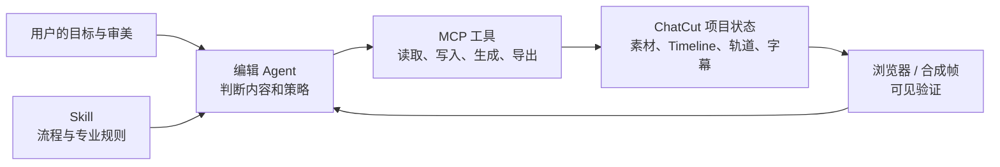
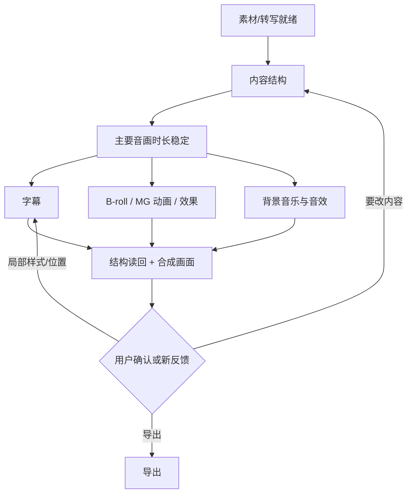

# 07｜MCP 工具、Skill 与 Agent 如何协作

> 本篇定位：解释外部 Codex 路径中的“控制面”——Skill 怎样约束 Agent，Agent 怎样读写项目，MCP 怎样提供确定性执行与反馈。工具数量、一次调用返回和当前入口缺口不是本篇主线，统一见附录 A 与第 08 篇。

> 证据范围：本篇以 2026-08-27 审计时运行时暴露的 58 个 `mcp__chatcut__*` 工具为合同依据，并结合已读取的 ChatCut 插件 Skill。工具数量、名称和参数将随插件版本变化；详细矩阵见附录 A。

## 不要把三件事混成一件事



### MCP：能“做什么”

MCP 是接口。它能列项目、看素材、查转写、创建/调整 Timeline、修改 Item、启用字幕、生成音乐、导出视频等。它保存可编辑状态，但不会自动判断“这个嘉宾说得最有价值的 15 秒是哪段”。

### Skill：应当“怎样做”

Skill 是流程和专业边界。例如：

- 口播/访谈：先完成语音剪辑，后做字幕、B-roll、MG 动画、背景音乐；
- 字幕：先区分转写错误、屏幕文案、词级时间和布局错误；
- 多机位：先做同步母版，后做节目版；
- 背景音乐：人声设置 Anchor，音乐设置 Follower，结构稳定后再裁切音乐；
- 验证：既读回结构，也看真实合成画面。

Skill 不保存项目事实，也不等于运行时一定有同名 MCP。例如多机位 Skill 叙述了 `multicam_sync` 的理想过程，但 2026-08-27 审计时的 58 个运行时 MCP 中没有该工具。

### Agent：决定“为什么这样做”

Agent 根据用户目标、素材证据、Skill 和已有时间线决定：

- 这条片究竟是口播、访谈、Vlog 还是高光；
- 哪些段落构成主时间轴；
- 哪句要强调、哪时该切机位、是否需要 B-roll；
- 是用内置 Ding、轻微 Whoosh，还是根本不应加音效；
- 所有修改后，哪些下游层必须重锚和验证。

Agent 不是底层时间线数据库。它不该持续手算帧、猜测隐含 ID 或绕过读回；应将确定性写入交给 MCP 后端。

### “编辑 Agent”不等于当前已经测通的 ChatCut 内置导演

本篇所说的编辑 Agent，默认是执行任务的 Codex / 调用方 Agent：它读取证据、遵守 Skill、调用 MCP，再根据读回继续判断。它不自动等同于 ChatCut Web 中存在一个可点击的“内置导演”。

外部 Codex 路径应把“编辑 Agent”理解为一个**调用方控制器**：它在自己的会话里读取目标、证据与 Skill，再对 ChatCut 项目发出受控读写。Web 原生 Agent 是否有同样的内部架构、是否共享同一份计划或聊天，并没有对外合同可证明。当前入口审计的具体结果见第 08 篇；这里仅保留产品边界：**不能因为 Codex 能当导演，就反推 ChatCut 后端一定内置了同样一个可调用导演服务。**

## 归档后的官方 Skill，分别补哪一段

为方便后续阅读，本次将官方 Codex Skill 中文译文归档在 [官方Skill与插件译文](./官方Skill与插件译文/README.md)。它们不是另一套工具，而是给同一套 MCP 加上工作流规则。

| 官方 Skill | 它补充的链路位置 | 本文对应章节 |
| --- | --- | --- |
| `chatcut-plugin-basics` | 项目定位、Asset / Item / Track 模型、运行时合同、浏览器验证 | 01、03、04 |
| `asset-import`、`transcription` | 导入、上传、转写状态和无声成功终态 | 03、08 |
| `talking-head-guide` | 口播、访谈、Script、清理、版本和收尾顺序 | 02、05、06 |
| `multicam-sync` | 同步母版、证据、节目版和机位选择原则 | 02、10、附录 B |
| `create-motion-graphics`、`shader-gen` | MG、特效、转场、片段绑定与轨道范围绑定 | 04、06 |
| `music`、`voice` | 生成素材后的摆放、duck、旁白同步和自定义声音 | 02、06 |
| `verification`、`export`、`known-errors` | 读回、合成帧、导出与失败恢复 | 03、07、08 |

注意：这个映射表示“该 Skill 讲了什么”，不是“当前 58 个 MCP 工具全部暴露了它所提到的执行入口”。

这次审计还发现了反方向的差异：运行时多出了 `manage_avatar`、`submit_avatar_video` 和 `submit_video_translation`。它们已经在 Schema 中可见，但本轮未执行。前两个工具要求的 `digital-human` Skill 虽存在于当前安装缓存，却没有出现在本会话可用 Skill 列表中；视频翻译工具要求的 `video-translation` Skill 则没有在当前安装缓存或会话列表中找到。因此它们只能标为“运行时工具合同暴露”，不能写成完整工作流已经可用。

## 一次完整剪辑任务，工具如何串起来

先不要把下面的工具链理解成一串固定按钮。它由两层循环组成：

~~~mermaid
flowchart LR
    U[用户目标 / 新反馈] --> P[Agent 形成或修订当前计划]
    P --> R[只读事实：项目、素材、转写、局部画面]
    R --> D{证据与权限足够？}
    D -->|否| W[等待处理 / 请求必要决定]
    W --> R
    D -->|是| E[选择 Script 或 Timeline 写入]
    E --> X[后端校验并写入可编辑项目状态]
    X --> V[读回结构、合成画面或声音]
    V --> P
~~~

- **Agent 循环**解决“下一步该做什么、为什么这样剪”；
- **MCP / 后端循环**解决“这个写入是否合法、最终对象和帧位是什么”；
- **验证循环**把项目实际结果重新交给 Agent 和用户，防止对话里的旧推理覆盖新状态。

### 流程 A：定位项目和素材

```text
list_projects / target_project
→ read_project
→ browse_assets
→ inspect_asset / track_progress / find_transcript
→ 选择需要使用的素材和证据窗口
```

这一步避免“用户已经在编辑器上传了素材，Agent 又重复导入一遍”，也避免在一个尚未处理完成的 Asset 上开始字幕或语义剪辑。

#### Web 先上传、Codex 后接手：不是“自动接到聊天”，而是一次受控项目定位

当用户已经在 ChatCut Web 上传视频，外部 Codex 的正确工具链不是重新上传，也不是从最近项目名称猜测：

~~~text
用户提供 editor URL / 明确选择项目
→ 取出其中的 projectId
→ target_project（把本 MCP 会话绑定到该项目）
→ read_project（确认项目、活动 Timeline、素材数量）
→ browse_assets（核对刚上传素材的名称、类型、时长、处理状态）
→ 需要时 track_progress / inspect_asset
→ 只在这些事实匹配后，开始转写、Script 或 Timeline 写入
~~~

这几步各自防的是不同错误：`target_project` 防止操作到别的项目；`read_project` 防止只看到一个名字却不知道要改哪条 Timeline；`browse_assets` 防止把“网页上传成功”误当成“外部 Agent 已能读、能剪”；`track_progress` 防止处理还没完成就启动依赖文字稿的工作。

项目接手失败时也不应死板重试：访问被拒时先恢复当前账号对项目的授权；项目可读但素材不在列表时核对 editor URL、账号与上传状态；多条 Timeline 时明确目标版本；Asset 仍在处理时只追踪该 Asset，而不是把所有素材重传。Web AI Panel 的聊天、@ 引用和原生 Agent 推理不在这条 MCP 工具链里，不能当作 Codex 已继承的上下文。

### 流程 B：口播、访谈、课程的内容剪辑

```text
转写就绪
→ read_script
→ （可选）clean_script 清理低歧义口癖和停顿
→ 重新 read_script
→ Agent 做完整语义单元的删、留、重排
→ apply_script 原子写入主线
→ 读回听感和逻辑
```

这里 `apply_script` 是内容结构的提交点。本轮故意让旧 Script 在读取后遇到 Timeline 改动，提交确实被拒绝；重新读取当前 Script 后才可正常预览和提交。正确做法是重新读取当前 Script，而不是盲目重试。

### 流程 C：画面和包装

```text
preview_timeline / inspect_item 先看当前成片画面
→ 决定 B-roll、MG 动画、效果或转场的编辑职责
→ browse_library / search_stock_media / create_motion_graphic_from_code
→ edit_item 放到准确轨道和时间范围
→ preview_timeline + 合成帧复核
```

`edit_item` 是广义的 Timeline Item 操作接口；字幕不属于它，字幕应走 `read_captions` / `edit_captions`。其中 `create_motion_graphic_from_code` 在 Hosted MCP 中仅有工具合同，未在本轮直接创建 JSX Asset；不要把这条建议链路写成完整实测。

### 流程 D：声音

```text
浏览音效库或确认用户自有音频
→ 判断编辑事件与人声关系
→ edit_item 放音效 / 背景音乐
→ edit_track 设置 Anchor / Follower（需要时）
→ smooth_audio 处理硬切口
→ 复听与结构读回
```

生成音乐/声音是异步且可能消耗积分的能力：工具合同说明 `submit_music` 或 `submit_sound` 只会创建项目 Asset，完成后还要用 `track_progress` 拿到素材，再放进 Timeline。本轮未调用这两类付费生成；它们不应因为“也许会更好”而被偷偷批量调用。

但声音的最终渲染机制已做过一轮不同于“生成”的验证：相同 Timeline 的 Duck 开、Duck 关、仅 BGM 基准三条云端 MP3，显示人声 Anchor 下音乐实际下降约 6.6 dB，与 `duckDepthDb` 一致。它证明 Duck 配置进入最终导出，不证明音乐生成质量或听感一定自然。

### 流程 E：字幕

```text
确认转写和主线稳定
→ edit_captions enable / refresh
→ read_captions
→ 文案、Token、样式、布局、翻译等局部编辑
→ 读回并看合成帧
```

字幕应在一轮一致的主线修改完成后再刷新一次，而不是每删除一个词就刷新一次。

### 流程 F：导出

```text
用户明确要求成片导出
→ submit_export
→ track_export
→ 完成后提供下载结果
```

编辑 Timeline 本身不是导出请求。默认交付物是可继续编辑的 ChatCut 项目版本，而不是未经用户确认自动导出的 MP4。

## “代码做什么，Agent 做什么”职责图

| 事情 | ChatCut MCP/后端程序 | 编辑 Agent |
| --- | --- | --- |
| 上传与素材处理 | 保存 Asset、追踪处理/转写状态 | 判断哪些素材值得查看。 |
| 语义剪辑 | 将 Script 编译、校验、原子写入 Timeline | 选择完整观点、删留重排。 |
| 帧级结构操作 | 切 Item、处理同轨 `ripple`、校验同轨不重叠 | 决定是否应该切、删、ripple。 |
| 字幕 | 存储 Token/Card、刷新映射、校验 Card 时间 | 决定文案、版式、强调和何时修源转写。 |
| 音效 | 导入/复用库资源、锚点换算、保存音频 Item | 判断是否需要、选什么声音、听感是否正确。 |
| MG 动画 | 创建 Asset、保存属性、合成到上层视频轨 | 决定信息、视觉职责、风格、时机和构图。 |
| 验证 | 返回项目结构、时间线状态、合成帧 | 对照目标检查，有问题后作出下一轮决策。 |

一个非常重要的边界：**MCP 后端能负责“把第 691 帧移到第 690 帧”，不能替人负责“这个 Ding 是否真的让观点更有力”。**

## 深度拆解：Agent 是“控制面”，不是又一个隐藏剪辑数据库

要把 Agent、Skill 和 MCP 串起来，最容易的误解是：以为 Agent 一边“思考”一边把所有编辑状态保存进聊天里。实际更稳妥的关系是：

~~~text
Agent 保存：当前目标、已确认事实、备选方案、下一步理由和需要用户决定的点
ChatCut 项目保存：素材、Timeline、轨道、Item、字幕、导出任务等实际剪辑状态
Skill 保存：建议先后顺序、专业判断边界和停止规则
MCP 保存：这次读取/写入所用的结构化接口合同
~~~

因此 Agent 是控制面：它负责组织一次工作循环、选择正确入口、解释结果和停止条件；它不应充当一个与 ChatCut 项目竞争的“第二份时间线”。

### 1. 一次可恢复的 Agent 工作循环

~~~mermaid
stateDiagram-v2
    [*] --> 已定位项目
    已定位项目 --> 已读取事实: 项目、素材、Timeline / Script
    已读取事实 --> 已形成计划: 目标、证据、取舍和风险清楚
    已形成计划 --> 预检中: 无副作用预览或当前范围读回
    预检中 --> 等待用户: 需要风格、授权或高影响选择
    预检中 --> 提交写入: 条件满足
    提交写入 --> 等待异步: 上传、转写、生成或导出未完成
    等待异步 --> 已读取事实: 任务终态后重新读结果
    提交写入 --> 验证中: 写入完成
    验证中 --> 已形成计划: 发现结构/画面/声音问题
    验证中 --> 等待用户: 需要审片或创意决定
    验证中 --> [*]: 当前版本已交付或可继续编辑
~~~

这个循环解决的是“为什么一个工具 success 后，Agent 还不应该直接宣布完成”：一次写入只让项目进入“待验证”状态。对于异步任务，它甚至还只是“等待终态”。

### 2. 工具调用按副作用分四类

| 类别 | 典型工具 | Agent 调用前要确认什么 | 调用后必须做什么 |
| --- | --- | --- | --- |
| **只读定位** | list_projects、read_project、browse_assets、inspect_asset、preview_timeline | 当前项目和问题范围 | 把事实与猜测分开，不需要修改项目 |
| **无副作用预检** | Script preview、局部检视、资源搜索 | 预检针对的是最新状态 | 将预计变化解释给用户或用于下一步判断 |
| **可编辑状态写入** | apply_script、edit_item、edit_track、edit_captions | 目标 Timeline、版本、轨道、影响范围 | 读回结构；必要时看合成帧 |
| **异步 / 有成本 / 交付动作** | 导入、转写、生成音乐/声音/视频、导出、下载 | 用户授权、许可、积分/交付意图、前置状态 | 追踪任务终态，再读取实际 Asset / 导出结果 |

这样分的目的不是增加流程，而是避免三种典型事故：

1. 把“搜索到一个资源”说成“已经合法导入并放到了时间线”；
2. 把“提交生成任务”说成“声音已经生成并且好听”；
3. 把“写入成功”说成“浏览器里看到的结果已经正确”。

### 3. 每个阶段交出的不是工具名，而是一份可以继续工作的状态

工具的真正链路不是 A 调 B，而是“前一步给后一步交出什么事实”：

| 前一阶段完成后 | 它应交给下一阶段的最小状态 | 下一阶段才可以安全做什么 |
| --- | --- | --- |
| 项目定位 | project、目标 Timeline、当前编辑器入口 | 避免在错项目里读写 |
| 素材处理 | Asset、类型、可用性、转写/no_audio 终态 | 决定走 Script、视觉规划还是等待 |
| 证据查询 | 源时间窗口、局部转写/帧、未知项 | 形成完整语义、场景或事件候选 |
| 主线规划 | 保留顺序、保护对象、目标时长、风险 | 选择 Script 或 Timeline 写入 |
| 主线提交 | 新的 V1 / A-roll 范围、Timeline 版本 | 刷新字幕并检查包装关系 |
| 包装写入 | 各对象的轨道、范围、资源和理由 | 进行合成帧、试听、审片 |
| 验证完成 | 已证明的结构/画面/声音事实，未解决项 | 交给用户确认、导出或下一轮修改 |

例如 “read_script → apply_script → edit_captions” 不是因为三个名字排在一起，而是因为字幕只有在最终可播放语音稳定后才有可靠的时间依据。

### 4. Agent、后端和用户分别拥有怎样的权力

| 决定类型 | Agent 可以做什么 | 后端必须做什么 | 用户应保留什么权力 |
| --- | --- | --- | --- |
| 叙事取舍 | 建议保留/删除/重排的完整内容，说明理由 | 不擅自替换用户素材或篡改源事实 | 否决方向、选择版本、补充上下文 |
| 时间线写入 | 提交明确的 Item / Script 变更 | 校验版本、源范围、同轨规则并原子提交 | 决定是否接受大范围结构改动 |
| 字幕与包装 | 提出何时、为什么强调，选择候选 | 保存独立对象与其可见参数 | 决定风格、克制程度、品牌要求 |
| 异步生成与下载 | 准备方案、说明成本和许可边界 | 创建可追踪任务、返回终态 | 明确授权付费生成、下载和交付 |
| 最终质量 | 汇总证据与风险，不假装替人“听懂审美” | 提供读回、预览或导出 | 对声音、节奏、版权和成片方向作最终确认 |

当前 Hosted 接入面没有实测到一个 ChatCut 自己运行的“自动导演入口”。本篇的 Agent 默认是 Codex / 调用方 Agent；它的价值在于把上表的工作组织起来，而不是声称 ChatCut 后端内部一定有同样一个隐藏 Agent。

### 5. 失败后如何继续，而不是卡在半路

| 当前停在哪 | 应向用户说明什么 | Agent 应保留什么 | 重新开始时必须重新读取什么 |
| --- | --- | --- | --- |
| 素材仍在处理 | 等待的是哪一个处理终态，不是“系统没反应” | 用户目标、已选素材、当前任务身份 | 最新处理状态与可用 Asset |
| Script 陈旧被拒 | 谁在何时改过主线不可由旧快照覆盖 | 原有编辑意图，不保留旧帧假设 | 当前 Script 和目标 Timeline |
| 批量写入失败 | 本轮没有半提交，哪个约束不满足 | 希望完成的编辑动作 | 当前轨道、Item 范围与错误条件 |
| 生成/导出未结束 | 请求已提交但还没有可用结果 | 任务身份、用户已授权范围 | 任务终态、实际产物 Asset 或文件 |
| 浏览器可能被用户手改 | Agent 的旧读回可能已过期 | 用户的最新反馈与意图 | 相关 Timeline、Item、Caption 的当前版本 |
| 审片发现不自然 | 结构正确不等于艺术上成立 | 哪个问题在何时发生 | 目标帧、实际声音和可替代候选 |

这比“失败了就重试同一个 MCP”更可靠。尤其对于不确定的外部写入，正确做法是先读回对账，而不是盲目重复执行。

## 工具之间的依赖，不是随便排序



这个顺序不是强制每条视频都要加所有层；它表达的是依赖关系。没有用户要求时，不应擅自加音乐、字幕、转场或 B-roll。

## 58 个工具的能力分组

| 组 | 典型工具 | 解决的问题 |
| --- | --- | --- |
| 项目与版本 | `list_projects`、`target_project`、`manage_timelines`、`duplicate_project` | 找到正确项目、建立不同成片版本。 |
| 素材与素材库 | `browse_assets`、`inspect_asset`、`import_media`、`manage_media_pool` | 看有什么、是否处理完成、怎样组织。 |
| 时间线与轨道 | `preview_timeline`、`edit_item`、`split_item`、`edit_track`、`inspect_item` | 将素材摆成可播放节目。 |
| Script 与转写 | `trigger_transcript`、`read_script`、`clean_script`、`apply_script`、`find_transcript`、`manage_transcript` | 启动/追踪转写、语义剪辑与转写修正。 |
| 字幕 | `read_captions`、`edit_captions` | 显示、翻译、样式、词级时间和布局。 |
| 创意资源与声音 | `browse_library`、`search_stock_media`、`submit_music`、`submit_sound` | 找或生成声音、效果、转场和模板。 |
| MG 动画、数字人与视觉 | `create_motion_graphic_from_code`、`manage_design_style`、`submit_shader`、`manage_avatar`、`submit_avatar_video` | 创建或管理可编辑视觉资产；数字人部分仅有工具合同，未做端到端实测。 |
| 视频翻译 | `submit_video_translation` | Schema 声明可产生新的翻译视频 Asset；依赖的 Skill 在当前会话/缓存中缺失，未实测。 |
| 异步、验证、导出 | `track_progress`、`track_export`、`submit_export`、`request_asset_download` | 等待任务、读结果、交付成片或源素材。 |

附录 A 不只列名字，还按这些调用链标明每个工具的上游、下游和常见误用。

## 失败时的正确姿势

- 同轨重叠：不要硬写，先判断应当顺序排列还是上下叠加；
- Item/轨道状态可能过期：先读取当前范围，再使用最新 ID 和帧范围；
- 写入返回成功：不等于画面正确，仍要查看合成结果；
- 生成任务未完成：用一次状态追踪，不要忙轮询或重复付费提交；
- 导入失败或云端未就绪：按返回的结构化错误恢复，不要偷偷改成本地扁平剪辑；
- 多机位同名 Skill 与 MCP 不一致：诚实报告运行时能力缺口，不用想象出来的接口补齐。

## 小结

Skill 负责“方法”，Agent 负责“判断”，MCP 负责“读写项目”，浏览器/合成帧负责“看结果”。把四者混在一起，会导致一边过度相信工具、一边又让模型承担本该由程序稳定处理的帧级工作。
