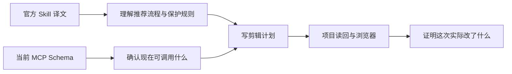

# 附录 C｜官方插件包与运行时对照

> 证据范围：本篇对照用户提供的 ChatCut Agent Plugin 中文译文 ZIP、当前已安装的 ChatCut 插件版本，以及本轮已实测的 MCP / 浏览器结果。它不读取 ChatCut 私有源码，也不执行 ZIP 内任何命令或脚本。

## 先说结论

这份 ZIP 对本调研有帮助，但帮助的方式不是“替换实测结论”，而是补足：

```text
官方建议怎样剪
→ 用哪一种 Skill 约束 Agent 的判断
→ 何时应该刷新、复核或停止
```

它**不能**单独证明：

```text
当前会话一定有哪个 MCP
→ 某个字段实际怎样返回
→ 某个工具真实写进了当前项目
→ Vlog / 影视高光已经自动规划成功
```

## 三种资料各能证明什么：先建立证据权威顺序

这次调研同时使用了官方 Skill 译文、当前 MCP Schema、项目读回和浏览器。它们不是互相冲突的“多个答案”，而是各自负责不同层面的事实。

| 资料来源 | 它最适合证明什么 | 它不能单独证明什么 | 写入正文时的标记 |
| --- | --- | --- | --- |
| 官方 Skill / 插件资料 | 推荐工作顺序、专业边界、理想工作流、何时应验证/停止 | 当前会话一定有同名工具、字段实际返回、这次项目已经写入成功 | [工具 / Skill 合同明确] |
| 当前 MCP Schema / manifest | 此刻这个宿主暴露哪些工具、参数、约束和返回形态 | 功能在所有账号、版本、Desktop / Web 面都可用 | [工具合同明确] |
| MCP 项目读回 | 某次操作后对象、帧范围、字幕/轨道等结构是否改变 | 合成画面、听感或整条片节奏一定正确 | [已实测] 的结构部分 |
| 浏览器、合成帧、最终导出 | 用户实际看到的一帧、一个时间窗口或最终声音是否符合读回 | 私有后端算法、整条片每一秒都已审完 | [已实测] 的可见/可听部分 |
| 从上述现象推导的职责 | 产品至少需要有哪些对象关系或状态边界 | 数据库、模型、队列、实时协议的具体实现 | [合理推断] |

发生冲突时，采用下面的判断顺序：

~~~text
要判断“这次到底发生了什么”：
项目读回 / 浏览器 / 导出优先

要判断“当前能调用什么”：
当前 MCP Schema / manifest 优先

要判断“推荐怎样工作”：
官方 Skill 优先

要判断“ChatCut 内部怎样实现”：
没有私有源码就保留为合理推断或未验证
~~~

这套顺序能避免两个方向的错误：一是 Skill 写了多机位流程，就当成当前 Hosted MCP 已经有入口；二是当前入口没出现，就断言 ChatCut 产品从来没有该能力。

## 1. 包与当前插件的关系

| 项目 | 观察结果 | 正确理解 |
| --- | --- | --- |
| ZIP 声明版本 | `0.2.25`；当前本机插件缓存目录也标为 `0.2.25`。 | 相同版本号不能证明两份内容逐字一致。 |
| Codex Skill 目录 | ZIP 有 15 个；当前缓存有 16 个，多出 `digital-human`。 | 归档是历史资料快照，不是当前缓存的完整镜像。 |
| 三个同名 Skill 的文本长度 | 归档 / 当前缓存：`multicam-sync` 155 / 293 行、`voice` 460 / 827 行、`widget-forms` 39 / 85 行。 | 即使同名同版本号，方法说明也已确认存在内容差异。 |
| 内容语言 | 中文译文 | 方便阅读官方方法，不等于产生新的运行时能力。 |
| MCP 工具清单 | ZIP 未提供完整 Schema | 2026-08-27 的当前运行时是 58 个工具；字段和参数仍以当次 Schema / 实测返回为准。 |

还有两个不能混写的缺口：当前缓存虽然有 `digital-human`，但本会话可用 Skill 列表没有暴露 `chatcut:digital-human`；`submit_video_translation` 的工具说明要求 `video-translation` Skill，但当前缓存和本会话列表都没有它。因此 Avatar、Avatar 视频和视频翻译目前只能写成“Schema 已暴露、未做端到端验证”，不能因为 ZIP 或缓存目录存在而写成已可用工作流。

此外，2026-08-31 对 `list_projects` 的复核返回 `Auth required`；随后命令行登录报告成功，同一已运行 MCP 会话仍未恢复项目读取。这不改变“2026-08-27 manifest 曾暴露 58 个工具”的审计事实，却提醒我们：插件文本、工具面、账户登录与当前会话授权是彼此独立的状态；只有它们都满足，某条工作流才有机会进入实测。

## 2. 为什么不能把 ZIP 当作完整安装包

ZIP 的根 README 与 `plugin.json` 都指向 `codex/.mcp.json`；但当前 ZIP 内并没有这个文件。它还缺少 README / Skill 文本提到的图标资源、上传辅助脚本和多机位文字稿偏移辅助脚本。

当前已安装缓存中这些文件存在。因此最合理的判断是：

> 这是一个适合阅读和翻译对照的资料包，不是应当直接覆盖安装的完整插件分发包。

本调研没有安装、替换、执行或从 ZIP 提取任何脚本。后续安装仍应走 ChatCut 官方产品内流程或完整插件分发流程。

## 3. 哪些文档结论被官方 Skill 直接补强

| 本文问题 | 官方 Skill 提供的补强 | 本调研中的证据等级 |
| --- | --- | --- |
| 为什么口播不用手算切口 | Script 先处理“保留什么、怎样重排”，后端再落帧；清理后需重新读 Script。 | Skill 明确；核心 Script 合同部分已实测。 |
| 为什么先剪 A-roll | 字幕、MG、B-roll、音乐都依赖最终语音时序；结构变化后要复核下游。 | Skill 明确；帧级联动已部分实测。 |
| 多机位怎样不乱 | 同步母版保存真实时钟，节目版独立派生；同步、内容选择、机位选择分开。 | Skill 明确；当前 MCP 未实测同名执行工具。 |
| MG 怎样保持可编辑 | 图形本体是 Asset，摆放是 Item；Codex 路径先建 JSX Asset，再放时间线。 | Skill / 工具合同明确；Asset / Item 分离已实测。 |
| 特效为什么有时会跟随、有时不会 | 有片段绑定与轨道范围绑定两种关系。 | Skill / 工具合同明确；内置 `builtin:zoom` 的两种关系已隔离实测，其他效果仍待验证。 |
| 旁白如何跟画面 | 用画面锚点、文案、真实音频时长和摆放范围组成同步图；画面重计时后需重核。 | Skill 明确；待实测。 |
| 如何证明剪辑真的正确 | 结构读回加合成时间线帧；源素材帧不能代替合成结果。 | Skill 明确，且已做浏览器验证。 |

## 4. 哪些结论仍不能升级

### 多机位一键同步

官方 `multicam-sync` Skill 写出了 `multicam_sync` 的理想流程，但 2026-08-27 的 58 个运行时工具中没有该入口。不能由文档存在倒推出“当前生产 MCP 已支持”。

### Vlog 与影视高光自动规划

Skill 包的重心是口播、访谈、多机位、字幕、声音、MG、生成与验证；它没有提供一个已实测的“自动识别旅行故事线”或“自动抽取影视情绪弧线”的专用流程。第 02 篇的 Vlog / 高光部分仍是专业剪辑规划方法，不是 ChatCut 一键模式宣称。

### 全量资源下载与许可

Skill 说明可以使用素材、生成音乐或生成声音，但没有证明内置库资源可以批量下载、离开 ChatCut 复用或商业再分发。第 09 篇的许可边界不变。

## 5. 建议怎样使用两套资料



一句话：**Skill 告诉 Agent 应该怎样稳妥地工作；MCP 告诉 Agent 此刻能调用什么；读回和浏览器告诉我们这次到底发生了什么。**
