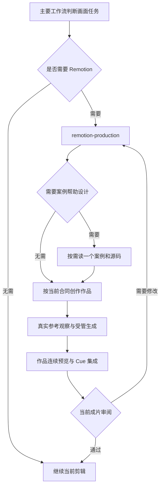

# 连续动效案例与 Skill 的接入说明

## 本次解决的问题

仅写“原创、连续、高级”不足以稳定地产生好看画面。案例需要同时交代内容关系、构图判断、对象跨拍延续、真实源码和连续预览。本次增加四个可运行案例，并把按需学习入口接到现有 `remotion-production`；没有引入新的主导演、服务或素材数据库。

案例是可改写的设计示范，不是四种必须套用的模板。票据适合条件累积，产品适合数量关系，时钟适合参照换算，通道适合瓶颈和分配。当前代码中的竖屏、14 秒、颜色、数值与安全区都不是全项目标准。更换语义、时长、画幅或人物布局时，需要重新设计相关部分和审片。

## 具体修改位置

| 文件或目录 | 作用 |
|---|---|
| `.agents/skills/motion-case-library/SKILL.md` | 何时按需学习、设计判断、数字人与解说适配、交回生产的条件 |
| `motion-case-library/references/case-methods.md` | 四例为什么这样设计、怎么改写、常见失败对照 |
| `motion-case-library/references/four-source-worked-example.md` | 示范如何把当前四站参考流程写成可执行 Skill，区分教学假设与真实观察 |
| `motion-case-library/references/observed-mechanisms.md` | 新增抖音作品的实际观察、时间段、可迁移方法与能力边界 |
| `motion-case-library/assets/cases/*.tsx` | 四份默认导出的 Remotion 源码，自绘图形，无第三方品牌或原片素材 |
| `motion-case-library/assets/cases/*.fixture.json` | 演示 Props、画布、时长、语义拍与审阅帧；不是 submission |
| `motion-case-library/assets/videos/*.mp4` | 本轮真实渲染的四份教学预览，随 Skill 同步发行，方便直接对照源码 |
| `.agents/skills/remotion-production/SKILL.md` | 增加案例 Skill 的按需入口 |
| `.agents/skills/known-errors/SKILL.md` | 将 Remotion 恢复入口对齐已存在的 Registry 与受管作品两条路径，仍禁止开发预览绕过验证 |
| `scripts/render-motion-cases.ts`、`package.json` | 开发者复现 MP4 与审阅帧的命令 |
| `tsconfig.json`、`tests/skills-v5-integration.test.ts` | 案例源码参与类型检查，验证资料可达和插件源码/参数副本一致 |

表中 `motion-case-library` 的相对目录均位于 `.agents/skills/`。`plugins/videoflowcut/skills/` 由现有同步脚本生成，不能单独改镜像。本次新增 Skill 不需要编辑用户的个人 Codex 配置。

## 调用关系



人物口播和数字人走现有 `presenter-motion-director`，视觉解说走 `visual-explainer-director`。案例学习发生在具体 Remotion 阶段，不让每个任务都加载整套资料。数字人同屏需按真实人物、手势和字幕占用重排；产品例默认透明，但上方 600 px 只是构图假设。复杂解释可以全屏接管再返回人物，没有 Mask 就不承诺后景穿插。

## 开发复现

在项目根目录安装已有依赖。需要可用的 Chrome Headless Shell、FFmpeg 与中文字体（样例优先使用 Noto Sans CJK SC，其他平台回退字体会影响排印）；Remotion 可按其标准流程获取浏览器。案例无需额外 npm 包或外部图片。

```bash
npm ci
npm run motion:cases
npm run motion:cases -- ticket-rules --stills
npm run motion:cases -- --offline
npm run typecheck
npm run plugin:sync-skills
node --import tsx --test tests/skills-v5-integration.test.ts
```

默认模式使用标准 Remotion bundler/renderer。`--offline` 模式使用实际 Remotion Player、局部帧定位、浏览器截图和 FFmpeg，无需启动 HTTP 服务。两种模式都只枚举仓库案例，不连接正式数据库、Project、Timeline 或 MCP；它们不能代替生产 `submit_motion_work` 的隔离、版本、审阅和入库。

开发输出位于 `previews/motion-cases/`，每例一份 H.264 MP4 和审阅 PNG，临时文件位于 `.candidate/`。经本轮检查的四份教学 MP4 已收录到案例 Skill 的 `assets/videos/`，以后修改源码应先重新渲染检查，再更新对应教学视频并同步插件。普通项目渲染产物和第三方研究截图不提交 Git。MP4 是无声视觉演示；产品例的预览底色用于观看，源组件的默认透明行为仍须在真实合成中复核。

脚本先运行项目的源码白名单校验与 fixture 范围检查；参数或源码不合格就停止。浏览器和 FFmpeg 错误向外报告，不写入正式对象，不把旧 MP4 当本次成功输出。字体改变、参考不清、运动或合成审阅失败，都应回到对应阶段处理。

## 美感如何形成可复用的判断

先让静态关键帧成立：一处主要注意点、清楚的中文层级、对象有适合内容的比例与材质，单位和条件不被装饰遮挡。再设计连接这些状态的运动：由同一对象的展开、复制、定位、替换或关系变化解释内容，旧信息继续可追踪。主动作后有阅读停留，结论不要与持续强动作竞争。

本轮审帧实际修正了 SVG 路径表达式、标题交叉淡化重影、流线数量与配额不一致，以及人物例的不透明背景问题；独立 Skill 试用也验证了代理会把“扩容”案例改成适合当前语义的“共享调度”，没有只换标题。这样的案例、反例和改写过程比单独的审美形容词更可执行，但不意味着每次生成都已通过审美验收。最终判断仍要看连续运动及当前成片。

## 当前平台边界

当前 `motionSubmissionSchema` 仍强制四站范围内的 `reference.url`、五类 observation 与 rights。本地案例和抖音链接都不能替代该输入；不应伪造链接或把未观察页面当参考。正式剪辑由代理主动找实际可观察且相关的参考，不要求用户每次供样片。找不到时该步保持未完成，并按当前工作流报告条件不足。

因此，本次完成的是“案例源码 + Skill + 现有入口 + 开发预览”，还不是免在线参考的原创提交通道。要支持后者，下一次平台改造至少要同步设计 submission 的本地案例/创作依据合同、持久化与审核记录、MCP Schema 和旧四站输入兼容测试；不能只删 Skill 的四站文字。当前运行时没有这些字段，本说明不把它们写成已支持能力。

本轮验证不涉及正式项目写入、当前生产 Runtime 部署或带人物/旁白/字幕的成片 E2E。`known-errors` 中旧的“生产任务只使用 Registry”恢复说明已局部对齐到当前已有的受管作品路径，避免恢复时误禁此入口；它没有增加运行时能力，仍要求核实实时 Schema 并经正式生成、入库和审阅。

开发渲染 API 依据 [Remotion renderMedia](https://www.remotion.dev/docs/renderer/render-media) 与 [renderStill](https://www.remotion.dev/docs/renderer/render-still)；源码固定使用仓库现有 Remotion 版本。
