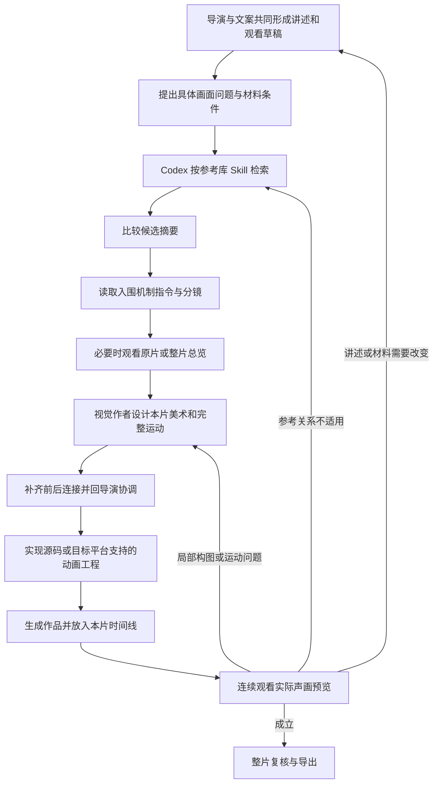

# 动效参考库：导演检索、组合与动画生成的跨项目迁移方案

版本：1.0\
整理日期：2026-10-09\
适用范围：财报解读、数据解释、科技分析，以及需要文字、图片、真实影像和图形共同演出的视频项目。

本文件是一份独立的迁移与工作流方案。通用方法不依赖 VideoFlowCut；文末单独说明现有实现的位置、接口与迁移注意事项。将本文复制到目标项目后，可以据此接入其已有导演、素材、动画和渲染流程。本文本身不包含参考视频、机制库或可执行技能，也不表示已经完成目标项目迁移。

## 一、目标与基本分工

目标是让导演和视觉作者根据当前视频的表达需要，检索少量合适的运动机制，理解其完整过程，组合为新片演出，再生成可编辑动画并通过实际预览修订。

参考库提供已经观察和描述的运动关系。Codex 负责理解创作需求、调用检索、核读资料和判断迁移方式。动画作者根据本片内容重新决定材料、美术、连接与时序，生成工具负责执行实现。

| 层次 | 保存什么 | 在工作中起什么作用 |
| --- | --- | --- |
| 参考资料 | 原片、整片总览、64宫格、独立机制指令及分镜 | 提供可观察的运动依据 |
| 检索与使用方法 | 一个参考库 Skill、按需方法、共用索引和查询实现 | 帮助作者查找、比较和按需读取 |
| 当前作品 | 声画稿、采用依据、演出设计、真实素材、源码与预览 | 把参考变成本片的具体表达 |

机制资料不承担题材、美术与配色拆解。需要判断视觉风格时，查看原片或其他美术参考，并在当前作品中完成设计。参考媒体的观看用途与生产素材的使用用途分别管理。

## 二、从导演需求到成片的完整链路



文字版链路：讲述与观看草稿 → 画面问题 → 参考检索 → 候选核读 → 完整演出 → 动画实现 → 实际合成 → 连续预览与修订 → 交付。

素材和试排反馈可以改变台词、镜头顺序和表达方法。导演采用初稿表示可以继续深化；用户没有锁定的内容仍可随真实材料与预览共同修订。

## 三、导演怎样提出参考需求

### 3.1 先判断这一段的作用

检索不能只围绕“财报”“科技”“数据图表”等题材词。完整解读视频需要多种表达方式：

| 段落作用 | 典型画面问题 |
| --- | --- |
| 开场与章节标题 | 多行标题如何建立，怎样从标题进入正文 |
| 文字运动与花字 | 词句怎样逐步出现，强调后怎样恢复阅读 |
| 多图比较 | 多个对象怎样依次加入，前项怎样保留作参照 |
| 重点聚焦 | 怎样从集合中突出一项，其余内容怎样退让 |
| 数据与机制解释 | 怎样显示增长、变化、分层、因果或传递 |
| 实际影像结合动效 | 视频继续播放时，标题、标签与说明怎样加入 |
| 空镜与环境建立 | 怎样通过轻微运镜、视差或环境变化承接旁白 |
| 留白与等待 | 信息保持可读时，哪些局部可以持续轻微运动 |
| 章节交接与收尾 | 前段留下什么，下一段如何取得主要画面 |

这些是选择视角，不要求每条视频全部使用。画面本身足够清楚时可以保持安静。

### 3.2 把用途转换成具体运动问题

推荐用自然语言说明四件事：现在有什么、希望发生什么变化、必须保留什么、最后留下什么。

例如：

> 三张业务图片及说明依次出现，前面的保持。整组建立后突出其中一项，其余退暗。讲完重点后，让集合退出，转入一句结论。

Codex 可以将它拆为三个检索阶段：

1. 图片和配套文字逐项建立，已有项保持。
2. 从现有集合突出少数项，其余退淡。
3. 集合让出主要区域，文字接管并稳定阅读。

不要把所有阶段和条件一次性做严格交集。每阶段先找可比较的演法，再判断前后能否连接。

导演还应交代准确句意、前后画面、现有素材、目标画幅及明确约束。视觉作者据此深化，避免只收到“科技感、高级、流畅”等无法执行的要求。

## 四、五种检索方式与底层实现

### 4.1 自然语言由 Codex 理解，查询程序负责召回

推荐先沿用简单可靠的实现：统一分类词表、同义词、描述文本匹配与条件筛选。Codex 将创作问题改写为运动阶段，读取匹配依据并重新判断排序。

排序分数只能说明描述相关性，不能表示审美得分，也不能证明两个机制能够连续播放。当前规模下不需要先引入向量数据库或额外自然语言服务；如后续存在反复可复现的漏检，再用真实需求评估是否需要扩展。

### 4.2 五种入口共用同一资料来源

| 方式 | 输入 | 返回后需要判断什么 |
| --- | --- | --- |
| 自然语言分阶段 | 一段运动描述，或多个独立阶段 | 是否保留了需求中的动作关系 |
| 已有状态与保持条件 | 当前画面、必须保持的层、结束状态、禁止动作 | 限制是否作用于正确对象，例如外框不动而内部可以移动 |
| 相似机制 | 已选机制编号及必要条件 | 相似在哪里，增加或缺少哪些动作 |
| 前段或后段 | 已选编号和接续方向 | 对象、位置、方向、层次及保持条件是否真的衔接 |
| 候选比较与恢复 | 编号清单或用户选择链接 | 新的顺序、采用项、未知编号与资料版本变化 |

前后接续查询只提示共同状态和连接缺口。比如“出口和入口都是集合”，还需要进一步确认集合数量、布局、方向和持续对象。

### 4.3 按需读取，避免全库装入上下文

默认路径是：少量摘要 → 入围机制正文与分镜 → 必要的原片 → 需要上下文时再看总览与64宫格。

每个具体问题可以先比较两三种不同演法，候选不足或明显不适合时再改写、扩展或分页。这个数量是控制阅读量的建议，不是强制凑数。

用户已经指定机制时直接定位；已有采用项仍适用时继续使用。改一个字或一个位置，不必重新检索整库。

### 4.4 网页负责预览与选择

网页提供标题、完整分镜、简述和原片入口，支持候选并排比较、调整顺序、移除和标记采用。

复杂自然语言仍由 Codex 处理。网页选择以可恢复清单或链接显式交回，Codex 读回后才据此继续；不能假设聊天实时知道用户在网页上的全部操作。

清单至少保留机制编号、顺序、采用状态和来源版本。现有实现将它们放在链接里，可以沿用，无需新增清单数据库。

## 五、参考库应该保存哪些文件

### 5.1 建议目录

下面是目标项目的示意目录。名称可以适配目标项目，机制编号与内部引用应保持一致。

```text
目标项目/
  docs/
    动效参考库_导演检索与动画生成_跨项目迁移方案.md
  .agents/skills/
    motion-case-library/
      SKILL.md
      references/
        mechanism-retrieval.md
  references/motion-cases/skillry/
    README.md
    case-catalogue.json
    mechanism-index.json
    taxonomy.mjs
    mechanism-search.mjs
    selection.mjs
    tools/                         # 索引生成、校验及只读资料访问
    cases/
      某案例/
        video.mp4
        overview.md
        storyboard.jpg             # 全片64宫格
        mechanisms/
          m01.md
          m01.jpg
          m02.md
          m02.jpg
```

这是结构示意，不是当前浏览网页的完整依赖清单。迁移现有网页与查询实现时，还需一起保留其引用的样式、模块和辅助文件。

### 5.2 一个机制是一段完整动作关系

例如“下落过程中缩小并转正，最后进入槽位”可以是一条机制，不应拆成互不关联的下落、缩放、旋转三个效果词。

每份机制正文说明可见运动、相对布局、发起与跟随、先后交叠、保持、运镜和结束状态，并直接嵌入该机制的真实分镜图。

原片的物体、品牌和业务题材不成为运动指令的前提；与运动无关的配色、材质与主体描述不放进机制正文。相对位置、遮挡、尺度和层次关系仍需保留，因为它们直接影响运动。

参考机制不要求固定秒数，也不要求新片遵守原64宫格编号。总览按原片顺序引用子机制，说明完整发展与交接；同一机制重复出现时可以重复引用。

### 5.3 正文与分类只维护一份

机制 Markdown 是正文和分类的唯一维护来源，搜索索引从它生成。网页、命令行或 MCP 共用同一查询逻辑。

沿用现有库时，保留其已有字段：`id`、`title`、`case_number`、`summary`、`purpose`、`relation`、`start_state`、`end_state`、`tags` 和 `retrieval`。`retrieval` 包含类别、动作、入口、出口、保持条件和连接锚点。说明不足的字段保留缺口，不推断补齐。

现有十类为：建立与累积、排列与重组、聚焦与展开、覆盖与揭示、替换与接管、形变与分合、路径与连接、触发与反馈、环绕与往复、回收与退出。一条机制可以跨类，类别用于召回，完整指令用于判断。

正式参考库保存必要阅读资料和运行文件。研究密集抽帧、额外截图、日志、压缩包、重复媒体和临时报告放在研究暂存位置，不成为参考库运行依赖。

## 六、怎样从候选机制写成新片演出稿

### 6.1 同一作者连续深化

导演负责整片讲述、段落作用和跨段取舍。视觉作者连续负责美术、运动、实现与局部修订，按需要加载方法。角色如何通过人员或代理实现，遵循目标项目已有协作规则；不为每条机制或每份 Skill 增加一个角色。

协调者负责目标项目状态、正式提交、版本与结果回传。首次主要表达或跨段讲法改变时回导演协调；已采用方向内的局部比例、路径和字位调整由原作者继续。

### 6.2 当前演出稿的必要内容

沿用项目已有声画稿，增加真正需要的信息，不再创建内容重复的多套方案。

| 内容 | 写清什么 |
| --- | --- |
| 表达目的 | 观众通过变化理解什么，结束时获得什么判断 |
| 实际输入 | 准确文字、真实图片和视频、数据依据、旁白与前后画面 |
| 参考采用 | 机制编号、资料版本、观察范围、保留关系、改造与舍弃部分 |
| 完整运动 | 起始布局，谁先动，谁跟随，谁保持，关键中途，落稳和退出 |
| 美术与阅读 | 实际字形、字级、比例、布局、颜色职责、遮挡和可读状态 |
| 前后连接 | 前段结束怎样成为当前开始，当前结束交出什么 |
| 实现与复核 | 当前平台需要的素材绑定、参数、事件，以及最容易出问题的中途 |

简单段落可以短写，复杂场面再展开。参考采用依据应跟随本片稿保存，避免日后只剩一个无法解释的机制编号。

### 6.3 用语义确定节奏，再落实到时间

设计阶段先说明“说到哪句时启动”“重点到位后读完什么”“谁接管后旧层退出”。实际生成需要时，再根据本片语音、材料事件和阅读负担转换为秒数或帧数。

参考库不固化秒数，与生成阶段需要准确时间并不矛盾。后者属于当前作品实现，不回写为机制通用约束。

### 6.4 连接必须由当前画面支持

逐对检查相邻机制：对象是不是同一个、位置和方向能否延续、哪些层需要退让、后段缺少的内容怎样提前建立。

能够直接继承的状态继续使用；不能直接连接的地方明确设计过渡或改选机制。通过开口进入下一层时，应让内层在穿入前可辨认；从集合聚焦一项时，应让观众识别其原来位置。

这些是关系检查，不要求所有镜头都变形衔接。表达需要明确分段时，直接切换也可以成立。

## 七、组合示例：从三个业务板块到一句结论

以下是迁移示例，不是已经生成并通过审阅的作品，也不代表所有财报段落都采用这一结构。

1. **建立比较。** 参考 `014-m02`，三张业务图片依次进入，各自说明随后建立；已经到位的项目保持。使用本片实际材料重新设计图片比例、文字长度和间距。
2. **集中注意。** 参考 `003-m03` 的集合聚焦关系，在原位置突出重点项，其余退暗。原参考为较多竖片，本片改为三项并列，突出幅度与遮挡需要重新设计。
3. **交出结论。** 重点读清后，集合退出，结论文字建立。退出方向、文字出现位置以及是否保留标题，是本片新增的连接设计。
4. **强调关键词。** 参考 `006-m03`，完整结论保持位置，强调块按讲述移向当前关键词；前一个词恢复普通。原片的活动后层不是本片必须复制的条件。

这条链路保留了“累积、选中、让位、局部强调”的关系。本片的主体、美术、语音时序与连接需要原创实现，机制编号本身不会生成最终动画。

## 八、动画生成与版本交付

### 8.1 将演出稿交给目标项目支持的实现方式

目标项目可以使用代码动画、合成工程或其他正式支持的生成方式。先核对真实能力，再把当前演出稿转换为其接受的完整输入。

采用 Remotion 时，输入通常包括完整 TSX、可调参数、画幅、帧率、时长、字体、图片与视频绑定、视频源范围和必要命名事件。其他平台可用对应工程表达这些信息，不必复制 Remotion 接口。

如果目标项目只支持生成视频，能够交付的是其实际产物；不能承诺必然获得可编辑源码。参考原片没有公开源码时，新片代码是依据运动观察重新创作的实现。

### 8.2 从单件作品走到实际合成

生成成功后，确认实际产物、版本、素材引用和可播放性。观看作品后放入本片时间线，加入前后画面、旁白、字幕和声音，再生成合成预览。

一次技术渲染成功，只说明产生了文件。局部作品观感成立，也不自动证明放进整片后节奏和注意力关系成立。

修订沿用目标项目的版本管理，保留源输入与产物对应关系。结果未知时先查询已有任务；明确失败、参数拒绝与仍在执行分别处理，不重复提交结果未知的生成。

### 8.3 按实际观察返回问题

| 预览问题 | 返回哪里 |
| --- | --- |
| 运动关系不适合表达 | 改写检索问题，换候选或独立设计 |
| 单段可以，拼接突兀 | 修前后状态、方向、保持与交接 |
| 动作可理解，但画面不好看 | 修构图、比例、字形、色彩职责和动作幅度 |
| 中途遮挡、突然跳位、视频重播 | 检查演出中途、素材坐标、源时钟和实现 |
| 重点读不完或旁白争抢注意力 | 调整信息释放、落稳时机和停留 |
| 内容重复、段落无发展 | 回原导演与文案共同修改讲述 |

静态分镜只能证明看过所展示的状态。速度、交叠和接管需要连续观看；声画同步需要观看并听取实际合成。记录具体已观察范围和未确认部分。

生成效果不佳时，应区分拆解不足、选用不当、连接设计、美术或实现问题，再修正对应环节。一次失败不能自动归因于整个参考库。

## 九、Skill 怎样接入新项目

保留一个 `motion-case-library` 入口，说明何时检索、五种方式、按需读取顺序、采用交接和失败处理。长方法放到它引用的参考文档里。

导演与视觉方法在需要参考时链接到该入口；参考库 Skill 不重复维护完整导演、美术、渲染或错误恢复流程。机制正文放在参考库中，不为每条机制注册独立 Skill。

迁移时检查该 Skill 的所有实际链接。现有入口还引用整片参考与历史自有案例方法；目标项目若需要这些能力，应迁移相应资料与依赖。如果只需要机制检索，在目标项目中收窄入口并移除未迁移分支的引用，不能留下失效链接。

目标项目已有技能组织方式时沿用其规范。关键是技能只有一个维护来源，`docs/` 保存方案与验收资料，运行规则不要在多个目录分别维护。

本片具体采用的机制、色板、字号和节奏保存在本片演出稿中。经过验证、具备普遍价值的新方法再考虑整理为参考，不把每次作品选择追加成通用规则。

## 十、迁移步骤与验收

### 10.1 最小迁移顺序

1. **明确目标项目能力。** 确认参考库放置位置、技能加载方式、只读检索入口、图片和视频预览方式，以及实际生成和时间线接口。
2. **迁移正式资料。** 带上原片、总览、64宫格、机制文档与分镜、来源信息，以及查询和预览所需运行文件。保留相对引用，不带研究暂存区。
3. **接入只读检索。** 目标宿主支持 MCP 时可包装为工具；已有合适接口时直接接入。只使用目标项目允许的访问方式，不因正式工具缺失而绕过项目边界。
4. **接入一个参考 Skill。** 调整目录、工具名和引用分支，在导演及视觉工作流的需要处引用。
5. **适配生成。** 将完整演出稿和素材绑定映射到目标平台的真实能力；查询与生成仍然独立。
6. **验证一个代表段。** 用一段实际内容完成检索、候选比较、组合、生成和连续预览，修正暴露的问题后再扩大使用。

### 10.2 最少需要的查询能力

| 能力 | 推荐输入与输出 |
| --- | --- |
| 搜索 | 接受阶段描述、条件、相似编号、前后关系或候选清单，返回摘要、条件、匹配依据、来源版本和预览入口 |
| 读取 | 按真实编号读取完整机制正文和分镜，必要时返回整片总览和64宫格 |
| 候选恢复 | 保存并读回编号顺序、采用状态及来源版本；可以作为搜索入口的一种模式 |

这三项是能力划分，不要求一定新增三个服务或工具。现有实现用两个只读 MCP 工具覆盖，并复用同一查询模块。

### 10.3 迁移验收

资料验收：从新位置能打开原片、总览和子机制图片；旧机器绝对路径和固定预览地址不成为隐含依赖；正文与索引一致；未知编号、缺图和过期索引有清楚提示。

检索验收：五种方式各有真实查询验证，尤其检查“外框保持、内部运动”的层级限制，以及只有粗状态相同却不能直接接续的候选。候选链接能恢复顺序与采用项。

创作验收：代表段至少能说明用了哪些关系、怎样适配真实内容、哪些连接是新增设计；已生成可播放结果，并实际检查关键运动和前后合成。参考命中和技术测试通过不代替观感判断。

首次代表段可选“多图建立 → 局部聚焦 → 文字结论”，因为它能同时检验材料、运动、连接和阅读。如果目标项目以实拍为主，也可选择“活动影像保持 → 标签进入 → 章节接管”。

## 附录 A：VideoFlowCut 现有实现位置

以下均为来源项目内的相对位置，供迁移定位，不是目标项目必须采用的目录。

| 内容 | 来源位置 |
| --- | --- |
| 参考库 | `references/motion-cases/skillry/` |
| 技能入口 | `.agents/skills/motion-case-library/SKILL.md` |
| 机制使用方法 | `.agents/skills/motion-case-library/references/mechanism-retrieval.md` |
| 共用查询 | `references/motion-cases/skillry/mechanism-search.mjs` |
| 分类与候选清单 | `taxonomy.mjs`、`selection.mjs`，位于上述库目录 |
| 资料加载 | `references/motion-cases/skillry/tools/library-store.mjs` |
| MCP 包装 | `apps/server/src/motion-library-tools.ts` |
| 开发验收记录 | `docs/动效机制检索优化_实施与验收.md` |
| 技能组织依据 | `docs/VideoFlowCut_Skills去冗余_分析与实施.md`、`docs/VideoFlowCut_Skills文件组织与按需加载_思路与实施说明.md` |

现有库在整理时包含120个案例、744条机制。迁移后数量应读取实际索引，不把这些数字写进通用执行逻辑。

迁移现有实现时注意：

- MCP 包装默认依据进程工作目录定位参考库，应改为目标项目的明确定位方式，或确保其启动目录契约成立。
- 当前资料加载器生成的预览地址包含 `http://127.0.0.1:8874/library/`。迁移时应集中适配预览基址和路由；不能只复制文件就假定此地址可用。
- 当前机制编号格式为 `三位数字-m两位数字`，例如 `014-m02`。直接迁移现有库时保留编号；需要新格式时同步调整校验、索引、链接和恢复逻辑。
- 保留来源元信息与相对文件引用；候选记录除链接外保留编号和来源版本，便于预览地址变化后恢复。
- 迁移现有网页时复制其实际引用依赖，或使用目标项目已有预览能力；不必为遵守本文重新实现一套网页。

2026-10-09 的现场核对确认：两个检索接口已在来源仓库注册源码中实现，但本会话的实时工具目录尚未发现它们。这是当时的接入状态；迁移与正式运行时需重新检查目标宿主实际工具目录，不能据此断定之后仍未接入，也不能把文件存在当作接口已经可调用。

## 附录 B：VideoFlowCut 接口映射

通用流程不依赖这些名称。迁移到其他项目时，用其正式支持的对应能力替换。

| 通用动作 | VideoFlowCut 对应能力 |
| --- | --- |
| 查询机制摘要与候选清单 | `search_motion_mechanisms` |
| 按需读取正文和分镜 | `read_motion_mechanism` |
| 读取当前动画引擎和字体能力 | `read_motion_capabilities` |
| 提交固定源码、参数与素材绑定 | `submit_motion_work` |
| 查询生成进度与实际作品 | `track_job`、`read_motion_work` |
| 获取作品观察证据并记录结论 | `inspect_asset`、`review_motion_work` |
| 放入时间线 | `manage_effect_cues` |
| 生成实际合成预览 | `render_preview_range` |
| 最终导出 | `submit_export`，配合该项目的正式检查与审阅流程 |

生产执行前核对实时接口说明和当前项目版本。创意负责人返回完整输入，协调者按目标项目要求排序提交；参考查询不会自动创建动画、放置时间线或完成审阅。

## 附录 C：给目标项目 Codex 的迁移任务说明

以下文字可作为迁移任务起点，使用时附上本文和实际参考资料位置：

> 请依据《动效参考库：导演检索、组合与动画生成的跨项目迁移方案》接入本项目。先只读核对现有导演、技能、素材、动画生成与预览能力，以及待迁移参考库的完整性，列出能够复用的部分、必须适配的目录和接口、具体缺口及最小改动方案。不要假定 VideoFlowCut 的工具在本项目存在。参考库保留独立机制指令、分镜和整片总览，以一个 Skill 按需加载，支持五种检索方式。网页用于预览与选择，Codex 负责自然语言理解和候选判断。确认迁移范围后再实施，并用一个真实代表段验证检索、组合、生成和连续预览。当前生成结果必须区分技术完成、实际观察和仍待确认的部分。
