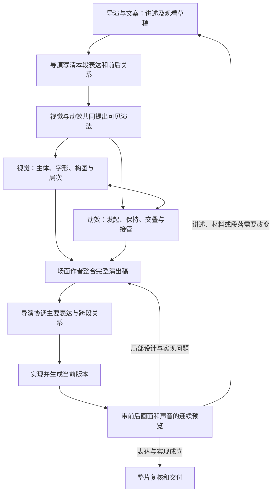

# 导演、视觉与动效协作：从动画需求到画面运动的跨项目迁移指南

版本：1.0\
整理日期：2026-10-09\
用途：将导演、视觉美术、动效设计与实现之间的创作方法迁移到其他视频剪辑项目。

本文可独立阅读，重点回答：导演怎样把动画需求写清楚，视觉和动效怎样共同设计完整画面过程，如何交付可执行内容，以及预览后如何返修。检索底层、参考库目录和接口迁移另见《动效参考库_导演检索与动画生成_跨项目迁移方案》；没有该文也能使用本文的协作方法。

本文不要求目标项目采用固定软件、工具名称或代理数量。角色代表专业责任，实际人员、代理调度和正式提交方式遵循目标项目规则。下文示例用于说明方法，尚未据此生成或审阅成片。

## 一、协作的核心：共同设计一段观看过程

导演、视觉与动效围绕同一份当前声画稿持续工作：观众先看见什么，注意力怎样移动，什么变化帮助理解，哪里需要读清或停留，最后如何进入下一段。

导演在草稿阶段就邀请视觉和动效提出材料、观察位置与演法建议。材料回来后共同修改讲述；试排回来后继续判断场面是否值得看、表达是否清楚。视觉选择可能改变动作路径，动作中途也可能要求调整构图，两者需要反复配合。

每段由一位持续负责的场面作者整合视觉与运动。项目规模较小时，同一作者可以承担两个角色；确需分工时，视觉与动效共同维护同一份演出稿，由场面作者整合后交回导演。避免同时存在互相冲突的静态稿、动效稿和实现稿。



文字版：共同构思 → 导演说明表达 → 视觉与动效联合深化 → 整合演出稿 → 实现 → 连续预览 → 按原因回改。

## 二、各角色具体负责什么

| 角色 | 主要决定 | 交给下一步的内容 |
| --- | --- | --- |
| 导演 | 本段为何存在、主要对象、观看顺序、观察距离、动作的表达作用、段落节奏和前后接法 | 准确句意、主要可见过程、材料条件、明确约束与前后画面 |
| 文案 | 连贯、准确的讲述，语言与画面的分工 | 当前准确台词、重点和限定条件；根据材料与试排更新同一份全文 |
| 视觉美术 | 实际材料如何共场，主体比例、字形、字级、颜色职责、层次、关键构图与可读状态 | 当前画幅下的具体视觉选择，以及入口、关键中途、阅读和出口的必要画面 |
| 动效设计 | 谁发起、谁跟随、谁保持，运动路径、姿态、交叠、速度变化、注意力交接和收势 | 可以逐步观看的完整运动正文、声音或语义锚点、前后接点和风险中途 |
| 动画实现 | 将采用的演出落实为目标平台支持的源码、工程、素材绑定与时序 | 可复现输入、可编辑产物、实际生成结果、实现限制与版本关系 |
| 制作协调 | 当前工程事实、任务依赖、提交顺序、结果回传和交付状态 | 真实素材及版本、生成任务、可访问预览、修改影响和待处理项 |

角色可以合并，责任必须明确。视觉或动效已经作出的设计，由实现继续兑现；实现发现缺少动作或布局决定时，回到场面作者补齐，避免在提交阶段临时猜测创意。

导演决定主要表达和跨段关系，局部字距、运动曲线和比例由原作者处理。只有改变主要对象、事实含义、讲述顺序、用户锁定项或跨段关系时，才重新协调相应范围。

## 三、导演怎样把动画需求写清楚

### 3.1 从内容关系推导可见过程

导演先明确观众进入本段时知道什么，结束时应该理解什么，再选择实际可见的变化。

| 内容需要 | 导演应该说明的观看关系 |
| --- | --- |
| 解释差异 | 比较谁，哪些条件相同，差异在哪里，哪些参照必须保留 |
| 从整体深入局部 | 整体怎样先被认出，目标局部在哪里，放大后还需保留什么定位线索 |
| 展示多个部分 | 各部分怎样建立归属，先出现什么，何时需要同时可见 |
| 说明前提或限制 | 先前判断是什么，新条件怎样进入，哪些原信息继续在场 |
| 强调一句观点 | 哪些词需要主读，强调何时发生，其他文字和素材怎样退让 |
| 实拍结合图形 | 真实画面承担什么，附加图形指认什么，怎样不挡住关键动作 |
| 氛围、空镜或留白 | 让观众感受或等待什么，哪些局部可以动，什么必须稳定 |

这些是思考入口，不能机械映射成固定组件。比较可以来自真实同框、先后观察或图形重排，过程也可以通过真实操作直接展示。

### 3.2 一份可交接需求需要说清七件事

1. **这段表达什么。** 用一句话说明观众最终应该理解或感受到的变化。
2. **实际讲什么。** 给当前准确句群，以及必须出现的画内文字；制作备注和上屏文字分开。
3. **开始有什么。** 上一镜留下哪些对象，第一关注是谁，是否已有视频或声音持续。
4. **主要变化是什么。** 用可见动作描述观看发展，指出必须保持的身份、尺度、归属或参照。
5. **材料有什么。** 提供已观察的素材及可用范围，标注真实证据、情境画面、示意和仍缺的材料。
6. **结束交给什么。** 结尾要留下的画面、下一段入口，以及是否需要同一对象连续。
7. **哪些已确定、哪些可设计。** 保留用户锁定项与事实限制，将造型、局部布局和动作细节交专业作者深化。

已有声画正文包含这些信息，就直接使用。简单段落可以几句话讲完，不为填表重复改写。

### 3.3 需求写到什么程度

“做得高级、科技感、加一些动效”可以表达倾向，还不足以执行。

可交接的描述应当类似：

> 先让三项内容依次进入同一比较范围，先到的保持。讲到其中一项时，让它从原位置取得主要面积，其余仍留作参照。标签跟随所属对象，阅读时收稳。结束后让集合让出中部，建立下一句问题。

这段话已经明确了对象关系、变化和出口。视觉与动效还要决定实际构图、片面大小、哪条路径最清楚，以及新旧共存时怎样避免拥挤。

导演可以提出具体演法，也要允许专业作者依据实际材料修正。导演不必提前指定所有坐标、曲线和秒数；用户已经给出精确参数的机械修改，则按确定参数处理。

## 四、视觉怎样把需求变成可以运动的画面

### 4.1 将准确文字与真实素材一起放入构图

先查看实际图片或视频选段，确认主体位置、视线、动作方向、亮暗、可裁空间和重要细节。用当前准确文字进行排布，尤其检查最长标题、条件句、数字和来源说明。

视觉方案要同时考虑运动需要：对象从哪里来，转向时是否还能识别，放大后是否有足够分辨率，标签是否有跟随空间，下一重点将在哪里出现。

不能只交一张漂亮的结束图，让动效临时解决全部中间状态。

### 4.2 明确视觉层级与颜色职责

本段第一关注可能是实拍主体、证据细节、数值或一句话，不默认永远是最大标题。视觉作者需要具体决定：

- 主体占多少可用面积，背景保留多少信息。
- 主读、标签、普通字幕和来源说明如何分工。
- 强调色指向什么，旧重点解除强调后回到什么状态。
- 通过尺度、对比、遮挡和清晰度怎样建立前后关系。
- 风格统一到字形、轮廓、颜色职责和空间规则，段落仍可以采用不同构图。

颜色已经承担数据类别含义时，新增强调不能让同一颜色突然代表另一类别。面积、长度和位置具有数据含义时，视觉强调也不能改变其真实比例。

### 4.3 与动效共同确定必要关键画面

按当前风险选择需要查看的状态，不固定每镜必须有几张：

| 状态 | 要解决的问题 |
| --- | --- |
| 入口 | 主体能否被认出，能否承接前镜 |
| 关键中途 | 新旧共存时谁占主位，遮挡和字量是否失控 |
| 阅读或展示状态 | 字和细节是否真的可读，必要参照是否还在 |
| 出口 | 下一镜接住什么，是否发生身份或位置跳变 |

关键中途不是简单取运动进度的50%。它可能是选中项刚越过邻项、字第一次完整显露、窗口即将接管全屏等时刻。

视觉与动效一起确定这些状态，再分别深化构图和变化。构图不足就改构图，中途不足就设计中途，不能把所有问题统一处理为放慢速度。

## 五、动效怎样把画面关系设计成连续运动

### 5.1 先写一次完整行为

动效设计要描述“谁在做什么”，同时交代它与其他对象的关系。

例如：

> 第二项从原列位向前取得更多面积，外轮廓、图片和名称一起移动。相邻项先小幅让开，再降低对比，仍能辨认原来的左右关系。新说明暂时不展开，待第二项转正且主读区域稳定后再建立。

“位移、缩放、淡出、弹性”是实现属性。完整行为还需要来源、目标、依赖、保持、中途和收势，才能指导连续演出。

### 5.2 决定发起、跟随、保持和接管

根据这段实际需要明确：谁首先引发变化；谁必须随所属对象一起动；哪些内容保留作参照；新重点达到什么可辨状态后取得注意力；旧重点何时退出。

相互关联的部分按同一行为组织，但不必共用一条曲线。大物体、轻标签、依附阴影和背景可以有不同反应；差异应服务重量、归属和阅读。

### 5.3 设计路径、姿态与可见范围

路径说明经过哪里、从哪一层经过、绕什么轴心、会挡住什么。倾斜或旋转不仅改变角度，也会改变文字的投影面积和可读性。

大幅移动时可以先保留轮廓与身份，把细字延后到稳定状态。需要持续阅读的对象应保持足够字幅和适合阅读的朝向。位移、缩放与旋转有关联时共同设计，不把它们分别套用默认效果。

### 5.4 根据动作作用决定速度

需要迅速交出重点的部分果断通过；需要辨认、比较或阅读的位置减速或停稳。连续观察多个细节时，可以保持运动惯性，避免每到一个节点都归零重启。

停顿要承担阅读、比较、情绪、源声或材料欣赏。没有作用的等待应调整；必要停留应保留。每个对象都回弹、每次转场都放大，容易把不同表达做成相同节奏。

### 5.5 设计动作交叠

后一个动作可以在前一个动作尚未完全结束时开始，前提是观众已经能够理解当前关系。

例如旧项先让出主要阅读区，新标题即可开始建立，不必等旧项完全消失。但新旧文字同时占据主位会形成竞争，应通过位置、面积、对比与出现时机分配注意力。

交叠的依据是“什么时候具备接管条件”，不能固定规定所有动作统一提前多少。

### 5.6 保持真实视频的内部连续

外框移动、缩放或被其他画面接管时，框内视频继续沿原来的源时间播放。标签依附于哪个对象，要沿同一坐标关系更新。

固定标注只适用于目标在选段中相对稳定的情况。目标会移动而项目没有可靠跟踪能力时，应选稳定范围、扩大指示区域或改用其他演法，不能把固定点当作已经跟踪。

### 5.7 从语义和阅读落点安排时间

设计稿优先写“说到哪句启动”“哪项必须先被辨认”“哪句读完再接走”。参考机制不规定本片秒数。

需要试排或正式实现时，使用本片当前语音、材料事件、总长与阅读负担确定时间，并在目标平台中落实为帧或关键帧。声音尚未完成时标注待校准；只有句级时间证据时，不伪造逐词精确时间。

## 六、三个角色怎样在同一份稿上接力

### 6.1 导演交出需求，视觉与动效反馈可行演法

导演交付本段完整意思、上下文、材料和主要过程。视觉与动效核对真实输入后，优先指出影响结果的设计问题，并给出具体演法。

只有尚未决定、且会明显影响表达的选择，才比较少量不同方案。例如“让选中项扩大”与“保持三项同尺度，仅移动强调框”，会影响比较是否公平，值得导演取舍。同一版式换三种颜色通常不能解决表达问题。

### 6.2 场面作者整合深化稿

把视觉选择、完整动作、准确文字、真实材料和前后接口整合成一个当前版本。第一次主要表达完成后，导演检查它在整片里是否成立，再继续实现。

“采用”是可以继续生产的决定，预览仍然可能暴露问题。常规局部修订由原作者直接深化，不默认每一处微调都要求用户批准。

### 6.3 实现接完整设计，缺口返回原作者

实现人员或代理需要知道哪些关系必须兑现，以及哪个函数、对象或关键帧负责它。提交前还需目标平台的画幅、素材绑定、字体、时间范围和相关参数。

如果目标平台无法表达原设计，实现应说明具体缺口和可行替代，由原作者判断表达损失。不能悄悄删除动作、把三维替成静态图后仍宣称原设计完成。

### 6.4 预览回到原作者和导演

协调者回传可访问的实际版本、输入变化、观察范围和技术结果。视觉与动效先检查当前段，导演再结合前后镜头判断整片观看发展。发现讲述和材料问题时，也交回原文案共同更新。

已经成立的部分保留，返修只覆盖受影响范围。素材或语音改变时，复核相关裁切、动作、字位和声画接点，不能只换一个文件引用。

## 七、导演需求的可复制写法

下面是一种短正文写法，可直接嵌入目标项目已有声画稿。清楚表达即可，不要求所有段落机械填写全部字段。

```text
【本段作用】
观众进入时已经知道……，本段要让他看见……，结束时理解……。

【当前讲述与画内文字】
准确旁白/原声：……
必须上屏的文字及作用：……

【入口、主要变化与出口】
上一镜留下……，先关注……。
接着发生……；其中……保持，……让位，……接管。
最后留下……，下一段从……接入。

【材料与边界】
已观察且可用的材料及范围：……
尚缺或待核的输入：……
事实、用户锁定项及其他明确约束：……

【交给视觉与动效深化】
请据此确定实际构图、关键中途、动作关系、阅读状态和前后接法；
影响主要表达的变化交回导演，局部专业选择由作者完成。
```

不要把“风格高端、转场丝滑”作为正文的全部内容。可以保留这类偏好，但必须落到具体主体、画面变化和观看关系。

## 八、完整示例：三项比较怎样变成一句判断

### 8.1 示例条件

本例是财报解读的假设教学场景，不对应任何真实企业，也不提供可直接上屏的财务数字。真实制作前，应确认数据确实支持“某项增速最高，但仍需结合规模判断贡献”，并使用准确业务名称、指标、期间和来源。

为了便于讲清过程，以下暂称三项业务为A、B、C，假设B的增速最高。示例中的字母和提示语在实际制作时换成已经核实的内容。

### 8.2 导演交给视觉与动效的需求

> **本段作用：** 观众已经知道公司总收入增长，现在要把三个业务板块放在一起比较，并认识到“增速最高”和“对总增长贡献最大”需要分别判断。
>
> **当前讲述：** “增长来自哪里？先看三个业务。B的增速最高，但要判断它贡献了多少，还得看收入规模。”这是教学句式，最终台词随真实数据核实后确定。
>
> **入口：** 上一镜的公司与报告期间已经明确。本段保留这一身份信息，建立三项业务各自的图片、名称和必要指标。
>
> **主要变化：** 三项依次出现，先到的保留，最后同时可比。讲到B时将注意力集中到它，A、C继续作为参照。随后建立“增速”和“规模”两个阅读重点，引出下一段分析。
>
> **出口：** 下一段仍然比较这三个业务。保留业务身份和顺序，交出能继续展示规模关系的画面。
>
> **边界：** 指标口径一致；不要用不同卡片大小暗示未经数据支持的规模差异。示意图片只帮助识别业务，不能代替财报证据。具体构图、文字层级和运动路径请视觉与动效共同设计。

导演已经说明表达、主要事件、持续参照和接口，没有把本段限定成一串软件效果。

### 8.3 视觉作者怎样深化

视觉先查看三个实际素材和最长业务名称，决定采用共同基线上的等宽三列。图片帮助识别，名称与指标留在各自所属区域；指标、期间和单位使用统一排印规则。

公司与报告期间位于次要位置，不与三个业务争抢主位。强调色仅表示当前讲述对象，三列在比较时保持同一视觉尺度。下方预留一处短句区域，用来建立“增速”和“规模”的关系。

需要检查的关键画面包括：三项齐全、B成为重点但A/C仍可辨、下方问题出现、下一段开始显示规模。用准确文字检查这些状态；没有实际字体或数据时，清楚标记仍待落实。

### 8.4 动效作者怎样设计完整运动

三列按讲述逐项建立。每列先形成可识别图像，再接名称和指标；先到的列保持，不随后一列重播。最后一项到位后，给观众一次稳定比较的机会。

讲到B时，强调框从现有比较范围转到B，B的名称和当前指标提高对比，A/C小幅降低对比但不消失。三列不改变数据含义上的尺度，避免视觉放大被误读成真实规模差异。

“增速最高”读清后，三列作为整体向上让出下方区域。这个移动只服务空间交接，三项相对顺序与间距保持。下方问题从让出的区域建立，先强调“增速”，再把强调移到“规模”；先前词恢复普通状态。

出口保留三项身份、报告期间和问题。下一段的数据表达在这个稳定基础上建立，不重新从空白介绍一次三项业务。后段作者需要收到这张出口画面的具体布局与当前重点。

### 8.5 参考机制怎样参与

- `014-m02` 提供“图和配套文字逐项建立、先到者保持”的关系。
- `003-m03` 提供“从集合中集中注意、其余退弱”的关系。其原片包含突出与离场，本例只保留需要的聚焦关系，三项的比较尺度和持续参照由本片重新设计。
- `006-m03` 提供“文字位置保持、强调块依次迁移”的关系，用于两个词的观看顺序。

编号用于追溯借鉴来源。整体上移、下方问题如何出现以及接入下一段的状态，是本片连接设计，需要作者补齐。目标项目尚未迁入这些案例时，可以先使用本例的完整文字理解方法，不把编号当作已安装能力。

### 8.6 实现怎样落实

三列各自拥有稳定对象身份，图像、名称和指标跟随各列；共同父层负责整组上移。强调框与文字强调独立控制，但使用统一的语义落点。显示数值来自实际输入，不能随装饰缩放改变。

如果图片换成真实视频，内部播放按各自已选源范围持续进行，外层上移不重置视频。下一段复用同一对象时，入口应与本段出口的尺度、位置、可见内容和源时刻对应。

最终根据当前旁白确定动作时机和阅读时间，生成可播放预览。此前的文字设计不构成已经验证的效果。

### 8.7 预览发现问题后怎样返修

例如实际预览中，问题文字出现时三列还在大幅移动，观众来不及从B转向下方。

有效反馈应是：

> 保留逐项建立和B的强调。问题出现在“规模”成为主读时，三列上移尚未收稳，形成两个同等强的运动重点。请让整组先让出主要阅读区，再开始问题文字；文字稳定后才迁移强调。复查这一交接及下一段入口，三项顺序和数据口径保持。

这能直接指向运动与注意力问题。若预览表明观众仍不理解为什么需要看规模，导演与文案应修改讲述或增加比较依据，而不只继续调整曲线。

## 九、其他常见段落怎样提出与执行需求

| 类型 | 导演写清 | 视觉与动效共同解决 |
| --- | --- | --- |
| 标题与章节 | 这句话是提出问题、宣布结论还是改变话题；正文从哪里开始 | 主读层级、逐字或逐行关系、稳定阅读、标题怎样退出或成为持续参照 |
| 观点花字 | 哪个词值得强调，强调过后仍需保留什么上下文 | 字形、词间关系、局部变化和恢复，避免每个词同等强烈 |
| 实拍叠字 | 画面中的什么动作必须看清，文字补充哪一层意思 | 根据实际构图安排字位和出现时机，保护主体动作，维护源片连续 |
| 多图比较 | 比较条件、顺序和共同参照 | 图文成组建立、同时可辨、标签归属、重点切换与出口 |
| 手机或屏幕展示 | 当前看外观还是屏幕内容，下一步深入哪里 | 外框与内层关系、裁切、源时间、局部靠近后的定位线索 |
| 空镜与氛围 | 这一段留给环境、情绪或旁白什么作用 | 观察距离、轻微运镜、必要视差与静止区域，是否需要任何叠加文字 |
| 等待与留白 | 观众在等待结果、阅读，还是感受停顿 | 保持主读，局部小幅循环或直接稳定；结果出现时明确接管 |
| 数据变化 | 实际指标、基线、单位和需要发现的关系 | 比例正确的变化、清楚的标注、阅读与对比；装饰不得暗示错误结论 |

## 十、交付给实现的稿件应是什么样

优先在当前声画稿中组织这些内容，简单段落短写，复杂段落展开：

```text
【当前版本与输入】
本段范围、目标画幅、准确文字、实际材料及可用源范围。
用户锁定项、前后画面、仍待核的依赖。

【导演采用的表达】
主要对象、观看顺序、动作作用、持续参照和结束理解。

【本片视觉选择】
主体与材料怎样共场，文字层级、颜色职责、实际字体和必要关键构图。

【完整连续运动】
从入口写到出口；交代发起、跟随、保持、关键中途、阅读和接管。
说明路径、姿态、遮挡和主次，写到实现者无需重新决定主要演法。

【语义时机与实现输入】
当前讲述或源事件对应的动作落点；需要时落实时间和帧。
目标平台接受的素材绑定、关键参数、源码或工程、必要命名事件。

【预览重点与修改影响】
容易失去主次的中途、需要连续观察的范围、前后接点。
采用的参考、具体改造、已看范围和未确认部分。
```

不要用不存在的素材、字体或项目对象编号填满模板。技术平台字段有长度限制时，保留完整创作正文作为附件或项目内文档，提交摘要链接回相应版本，不能默默截断关键设计。

## 十一、怎样检查协作是否真的有效

### 11.1 检查观看结果

连续预览时先记录实际体验：第一眼看哪里，哪里认不出来源，哪里等得无意义，哪里读不完，哪个变化带来理解。然后再对照设计稿找原因。

| 问题表现 | 优先返回的责任 |
| --- | --- |
| 段落没有作用、讲述重复、材料不支持主张 | 导演与文案，必要时重新取材 |
| 静止时也不好看、文字拥挤、主次不明 | 视觉美术 |
| 两端成立但中途乱、接管突兀、动作缺乏关系 | 动效与视觉共同修关键中途 |
| 坐标漂移、视频重播、漏层、错误字体或绑定 | 动画实现 |
| 单段成立但与前后风格或节奏冲突 | 导演协调相关原作者 |
| 声画落点冲突、字幕与主读竞争 | 原演出作者、文案或声音负责人按影响共同调整 |

### 11.2 返修反馈给出可操作内容

每条重要反馈说明观察位置、发生了什么、为什么影响观看、保留什么、具体修改方向和复查范围。优先解决当前根因，不一次同时换颜色、字款、布局和全部运动曲线。

技术遗漏与设计本身不成立分别处理。实现完全照稿但结果平淡时，可以推翻原演法；不能只检查“是否按计划执行”。

### 11.3 分开记录完成状态

需求清楚、源码完成、文件生成、连续看过、专业判断成立和用户认可，是不同事实。只有实际看过的范围才形成相应观察结论；抽帧不能证明全段运动，无声预览不能证明声音同步。

材料与预览回到原作者后应产生真实修订或明确保留理由。角色名字、技能加载记录和文件数量不能替代协作结果。

## 十二、迁移到其他项目的最小接入方式

1. **对应现有角色。** 找到目标项目的导演、文案、视觉、动画实现与提交负责人。可以合并责任，不为套用本文强行扩充代理数量；已有角色使用同一套交接方法。
2. **确定当前稿的位置。** 沿用目标项目已有声画稿或场面文档，将准确文字、材料、视觉与运动保持在同一当前版本，不新增重复状态系统。
3. **把方法放到需要它的入口。** 导演方法引用需求写法，视觉方法引用共同构图与关键状态，动效方法引用完整行为与连接，实现方法引用当前平台的真实能力。
4. **按需接入参考库。** 需要扩展演法时使用检索 Skill，已采用的参考继续沿用。参考提供依据，场面作者完成迁移和连接。
5. **验证一个实际段落。** 导演交需求，视觉与动效完成深化，实现生成，预览回原作者修订；检查每次交接是否减少猜测，结果是否更清楚且值得观看。

不要求所有技能一次加载。局部换字、调色或固定偏移，直接读取原稿和当前产物处理；改变主要表达时再进入导演协调。

### 迁移时应保留的原则

- 导演与文案早期共同发展讲述，视觉和动效参与可见表达。
- 导演给清楚的主要过程和边界，专业作者拥有局部设计空间。
- 视觉与运动围绕同一画面共同深化，特别关注新旧共存的中途。
- 原作者持续接收实际材料和预览，输入变化带动相关设计一起更新。
- 专业设计、技术执行和用户定稿各自依据真实结果。

## 附录 A：目标项目可直接采用的任务说明

> 请依据《导演、视觉与动效协作：从动画需求到画面运动的跨项目迁移指南》，梳理本项目已有的导演、文案、视觉、动效和动画实现协作。先只读确认当前稿件位置、角色分工、真实素材与生成预览能力，指出需求交接中哪些信息缺失、哪里重复、哪里把专业判断推给了实现者。提出最小接入方案，确认范围后实施。导演需求要包含表达目的、准确讲述、入口、主要变化、保持条件、材料和出口；视觉与动效共同完成关键构图、危险中途和完整运动，使用同一份当前稿。按目标项目允许的协作和工具方式执行，不假定 VideoFlowCut 工具已存在。最终用一个代表段验证需求、深化、实现和连续预览返修，保留实际产物及未确认范围。

## 附录 B：来源项目的方法定位

以下相对路径仅供在来源项目中找到原方法，本文内容不依赖这些文件才能理解。迁移时按目标项目规范选择性接入，不必复制整个技能树。

| 方法 | 来源项目位置 |
| --- | --- |
| 导演主线与分镜 | `.agents/skills/production-director/references/story-and-shot-design.md` |
| 视觉美术与共同构图 | `.agents/skills/visual-treatment-planning/references/art-direction.md` |
| 连续演出与关键中途 | `.agents/skills/motion-brief-writing/references/performance-design.md` |
| 完整演出稿组织 | `.agents/skills/motion-brief-writing/references/execution-brief-template.md` |
| 语义时机 | `.agents/skills/effect-timing/SKILL.md` |
| 参考库按需检索 | `.agents/skills/motion-case-library/SKILL.md` |
| 动画实现 | `.agents/skills/remotion-production/SKILL.md` |
| 角色与版本交接 | `.agents/skills/_shared/PROJECT_REVISION_AND_HANDOFF.md` |

来源项目要求通过实际宿主代理完成创意协作，并由主任务排序正式提交。其他项目采用其自身规则；这些工具和调度约束不作为通用创作方法硬编码到迁移文档中。
