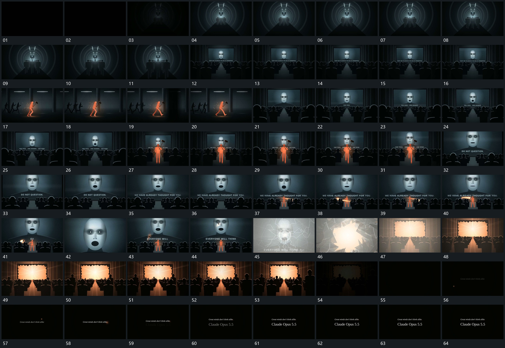

# 065 · 运动过程总览

## 运动总览

开场 [沿多重圆框纵深前推，中央组形逐渐接近](mechanisms/m01.md) 沿多重圆框形成的纵深向前推进，中央组形接近。随后完整大片与多排前层组形接入。[主形与群形同向侧移，主形领先，后形错开跟随](mechanisms/m02.md) 让主形与后层群形同向侧移，主形保持领先，后形错开跟随。回到大片前，主形由下部接入中央，后层位置保持，片内局部形反复伸缩，底字分段更新。

中段 [前层长形围端绕行，收住后斜向穿越到远处平面](mechanisms/m03.md) 让前层长形围一端反复绕行，收住后释放，沿斜向穿越到大片局部。[局部裂线向外扩展，片面破开，亮区穿过后镜头拉回](mechanisms/m04.md) 局部裂线从中心向外扩展，片面破开，亮区通过开口接管；镜头后退到完整框。[多排组形从近处逐项增高，后排接续，亮区保持](mechanisms/m05.md) 在多排组形中从近处开始逐项增高，后排接续，亮区仍保留。末段整组退暗，中央点与短字建立，附属行补齐并保持。

## 完整64宫格

按从左至右、从上至下阅读，覆盖全片首尾。具体运动分镜见各子机制。

## 原片与观察范围

[观看参考视频](video.mp4) · [原始来源](https://skillry.dev/ai-videos/opus-5-5/1littlecoder-378066)

依据真实源帧总览及必要局部序列整理，仅描述可见运动、相对布局与接续。抽帧观察不等于原速连续观看或声音核验；不推定精确曲线、隐藏结构、作者源码或原始生成指令。迁移到新片仍需实现和预览。
