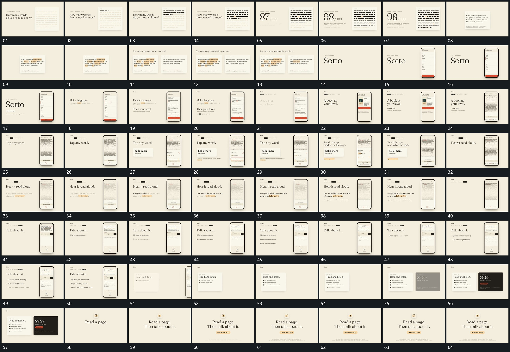

# 039 · 运动过程总览

## 运动总览

开头 [固定片面小横块逐行累积，旁侧数值后接](mechanisms/m01.md) 在固定片面上让小横块逐行累积，旁侧数值后接。[单片逐项建立强调，第二片随后并置](mechanisms/m02.md) 在单片内逐项建立局部强调，再把第二片接到旁侧，构成并置。原组退出后字组及竖框接入。

中段 [固定竖框内换态，旁侧短行与标记逐项补齐](mechanisms/m03.md) 保留竖框，框内内容更新，旁侧短字和标记逐项补齐。[框内局部副本外提，附属反馈在旁片下方追加](mechanisms/m04.md) 把框内局部副本提到旁边，再在其下增加反馈行。[固定正文中局部强调顺序推进，其余内容退弱](mechanisms/m05.md) 在稳定正文中让局部强调沿阅读顺序推进，其他字退弱但位置保持。后段重新使用 [固定竖框内换态，旁侧短行与标记逐项补齐](mechanisms/m03.md) 逐行建立问答与列表，最终两片错峰并置，再换成中央字组收尾。

## 完整64宫格

按从左至右、从上至下阅读，覆盖全片首尾。具体运动分镜见各子机制。

## 原片与观察范围

[观看参考视频](video.mp4) · [原始来源](https://skillry.dev/ai-videos/opus-5-5/1stnoel-603851)

依据真实源帧总览及必要局部序列整理，仅描述可见运动、相对布局与接续。抽帧观察不等于原速连续观看或声音核验；不推定精确曲线、隐藏结构、作者源码或原始生成指令。迁移到新片仍需实现和预览。
