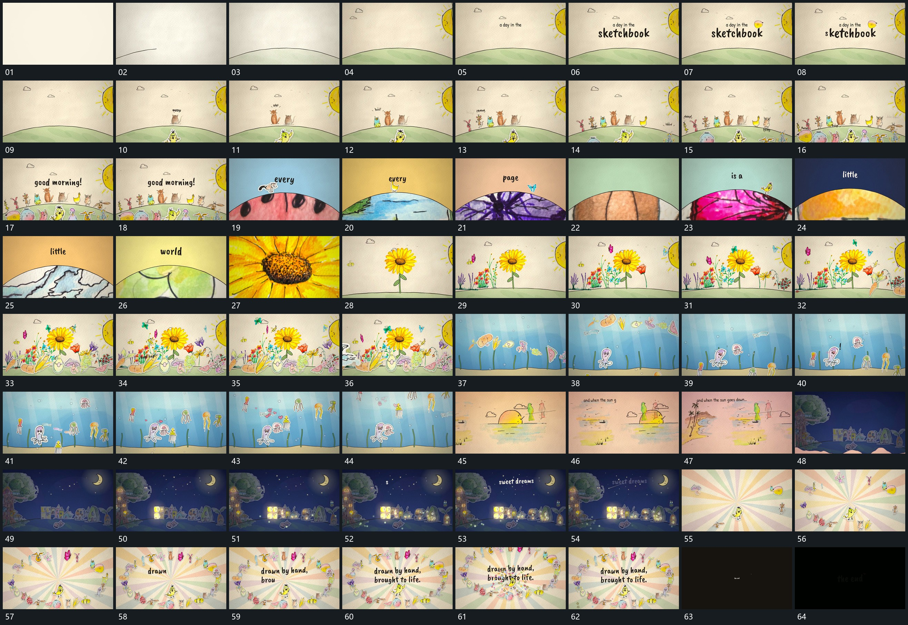

# 017 · 运动过程总览

## 运动总览

开头 [弧形线从一端延长，块面从下方接入](mechanisms/m01.md) 延长弧形线并补入其下方块面，字组在上方建立。[小形沿共同弧线逐项建立，已有项保持](mechanisms/m02.md) 沿弧线逐项补入小形，前面的留住，数量逐渐增多。随后 [弧线下内容连续更换，末项放大接管](mechanisms/m03.md) 把弧线下的内容连续替换，前景小形在边界附近短暂接力，最后局部放大接管。

中段 [细长轮廓分批建立，外围小片持续经过](mechanisms/m04.md) 在稳定底边上从少到多建立细长轮廓，周边小片持续沿不同方向经过。换入新的分层后 [活动体沿不同曲线向上穿行，底边保持](mechanisms/m05.md) 让活动体从下往上穿行，圆点与外围形跟着不同路径移动，底部边界保持。

后段底层更换，上方短句建立，前景局部下移并退出。新的场面逐项点亮内部小格，再转入 [外围散形围绕中央，字组建立后局部集中增多](mechanisms/m06.md) 的外围散形与中央字组；散形先围绕，再集中增加，末尾退为短句收尾。

## 完整64宫格

按从左至右、从上至下阅读，覆盖全片首尾。具体运动分镜见各子机制。

## 原片与观察范围

[观看参考视频](video.mp4) · [原始来源](https://skillry.dev/ai-videos/opus-5-5/abderrahmen-g-899031)

依据真实源帧总览及必要局部序列整理，仅描述可见运动、相对布局与接续。抽帧观察不等于原速连续观看或声音核验；不推定精确曲线、隐藏结构、作者源码或原始生成指令。迁移到新片仍需实现和预览。
