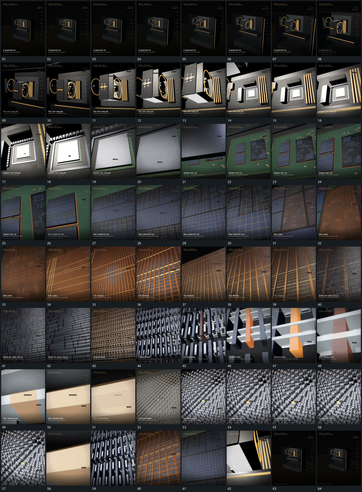

# 098 · 运动过程总览

## 运动总览

全片以[锁定局部逐级推近下一层承接再沿原路退回](mechanisms/m01.md)锁定一个局部逐层推近，从整体范围进入越来越细的网格与小形。靠近外部叠层时[近层叠组向不同方向拉开露出内部入口](mechanisms/m02.md)先沿不同方向拉开近层，给下一局部留下可见入口；[平面盖层抬离底面下方组逐步露出](mechanisms/m03.md)把平面盖层抬离，露出下方并继续推入。

进一步靠近后，[上方格层退让后下层细阵列接管近景](mechanisms/m04.md)退让上方格状层，露出更细的下层阵列。末段到达密集小球范围，取景保持局部后反向复用[锁定局部逐级推近下一层承接再沿原路退回](mechanisms/m01.md)，沿各级参照快速退回最初全貌。

## 完整64宫格

按从左至右、从上至下阅读，覆盖全片首尾。具体运动分镜见各子机制。

## 原片与观察范围

[观看参考视频](video.mp4) · [原始来源](https://skillry.dev/ai-videos/opus-5-5/acoramaa-053577)

依据真实源帧总览及必要局部序列整理，仅描述可见运动、相对布局与接续。抽帧观察不等于原速连续观看或声音核验；不推定精确曲线、隐藏结构、作者源码或原始生成指令。迁移到新片仍需实现和预览。
