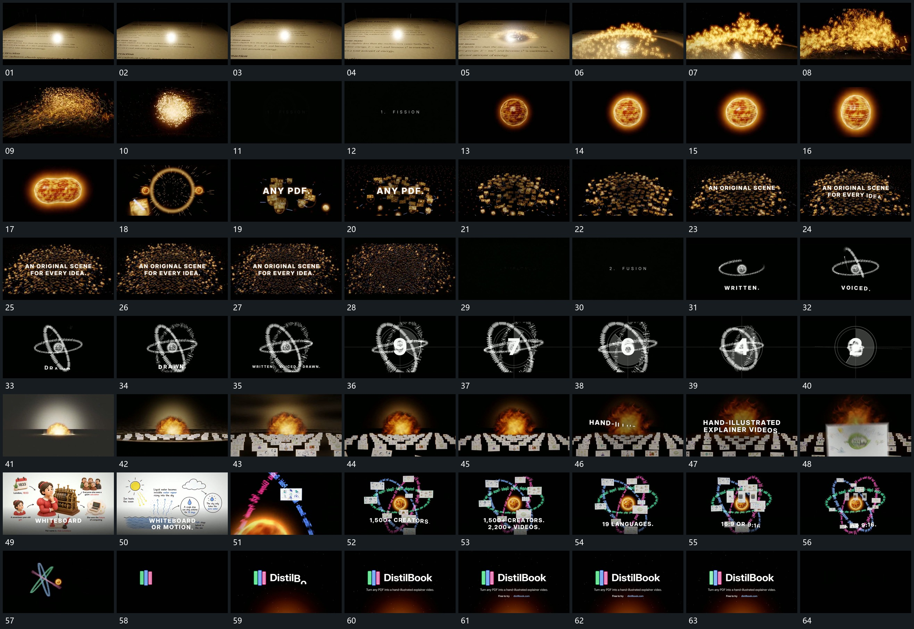

# 063 · 运动过程总览

## 运动总览

开头 [亮点沿斜面经过，字形上浮脱离后收成点群](mechanisms/m01.md) 让亮点沿斜面经过，局部字形离开片面上浮，聚成点群并收束到中央。短字组接管后 [圆形主形内层绕行，压成双瓣后分开并追加扩散圈](mechanisms/m02.md) 建立一个圆形主形，内字沿轮廓绕行，主形压成双瓣并分开，圈形反馈扩散。

中段 [小片从少到多铺成弧形空间，前字保持，外围继续经过](mechanisms/m03.md) 将小片从少到多铺成有远近的弧形群组，前字保持，外围继续经过。[不同方向环先后建立，围同一中心转动，数值接续后缩回](mechanisms/m04.md) 先后建立不同方向的环，围绕同一中心转动，短字与大数值接续变化，最后环组缩回。随后 [多排片面从近到远立起，镜头前移后选片接管](mechanisms/m05.md) 从局部膨胀形接入多排片面，片面从近到远立起，镜头前移，选片放大接管。

后段复用 [不同方向环先后建立，围同一中心转动，数值接续后缩回](mechanisms/m04.md) 的绕行关系，在环之间错开补小片，横片与竖片短暂接替。[多环与小片缩向中央，短形接管后字组补齐](mechanisms/m06.md) 将完整环组缩向中央，几段短形接管，再接主字、附属行与底条，结束保持。

## 完整64宫格

按从左至右、从上至下阅读，覆盖全片首尾。具体运动分镜见各子机制。

## 原片与观察范围

[观看参考视频](video.mp4) · [原始来源](https://skillry.dev/ai-videos/opus-5-5/ajith-io-562538)

依据真实源帧总览及必要局部序列整理，仅描述可见运动、相对布局与接续。抽帧观察不等于原速连续观看或声音核验；不推定精确曲线、隐藏结构、作者源码或原始生成指令。迁移到新片仍需实现和预览。
