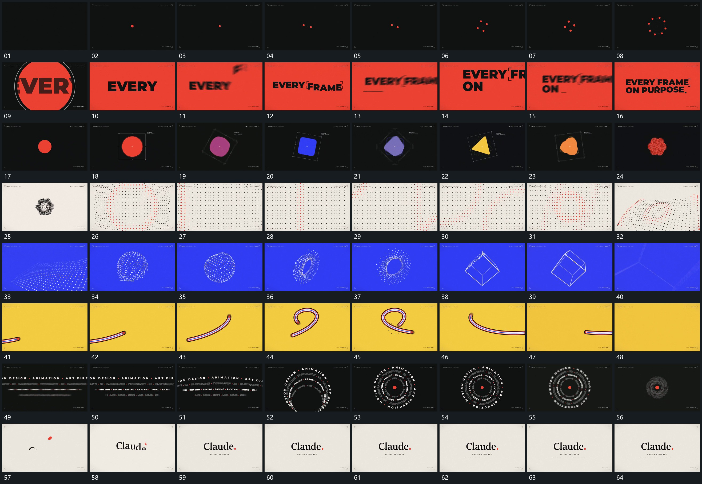

# 108 · 运动过程总览

## 运动总览

全片以[单点逐次增加成圈后圆区放大覆盖](mechanisms/m01.md)从单点增加成圈，再扩大覆盖并接上字行；[字片移入重排后分行接成完整标题](mechanisms/m02.md)把字片移入、重排和分行接成完整前层。其后[中央平面形转角中连续改变轮廓](mechanisms/m03.md)让中央平面形持续转角并连续改变轮廓。

点阵段用[稳定点阵的局部起伏沿面经过](mechanisms/m04.md)保持格位关系而让局部起伏沿阵列经过；接着[点面收成球组打开中间再向边线收拢](mechanisms/m05.md)由点面收成立体球组、打开中心形成环，再向边线收拢。后段[长带端部沿弯路经过围成圈再回收短带](mechanisms/m06.md)让长带端部沿弯曲路线经过并回收为短带，[多排字列弯成同心圈后转动收近](mechanisms/m07.md)把多排字列弯成同心圈并收近。结尾[主行逐段建立上方小点落到行末](mechanisms/m08.md)建立主行，让上方小点落到行末。

## 完整64宫格

按从左至右、从上至下阅读，覆盖全片首尾。具体运动分镜见各子机制。

## 原片与观察范围

[观看参考视频](video.mp4) · [原始来源](https://skillry.dev/ai-videos/opus-5-5/ajith-io-890146)

依据真实源帧总览及必要局部序列整理，仅描述可见运动、相对布局与接续。抽帧观察不等于原速连续观看或声音核验；不推定精确曲线、隐藏结构、作者源码或原始生成指令。迁移到新片仍需实现和预览。
