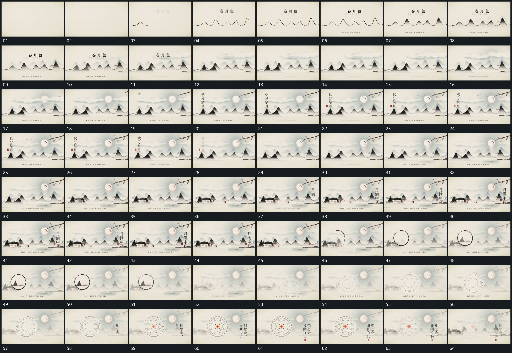

# 079 · 运动过程总览

## 运动总览

全片先用[起伏轮廓横向延长再逐层填入内部](mechanisms/m01.md)延长起伏轮廓并从轮廓内部逐层展开，继而[长条空间持续横移新局部从边缘接入](mechanisms/m02.md)持续横移，同一长条空间不断接入新局部。其间[竖行字分项建立保持后退弱接替](mechanisms/m03.md)让竖行字分项建立、保持再退弱，后层横移不中断。

新局部接入后，[圆周逐段描出后圈内小形接入](mechanisms/m04.md)沿圆周描出完整圈并在圈内补入小形；圈退弱后，[扁环从下方抬起转正再补外圈与内部](mechanisms/m05.md)从下方扁环开始抬起、转正、补外圈与内部小形。最后继续复用[竖行字分项建立保持后退弱接替](mechanisms/m03.md)建立并列竖行，原长条空间仍在经过。

## 完整64宫格

按从左至右、从上至下阅读，覆盖全片首尾。具体运动分镜见各子机制。

## 原片与观察范围

[观看参考视频](video.mp4) · [原始来源](https://skillry.dev/ai-videos/opus-5-5/amberpromptai-345137)

依据真实源帧总览及必要局部序列整理，仅描述可见运动、相对布局与接续。抽帧观察不等于原速连续观看或声音核验；不推定精确曲线、隐藏结构、作者源码或原始生成指令。迁移到新片仍需实现和预览。
