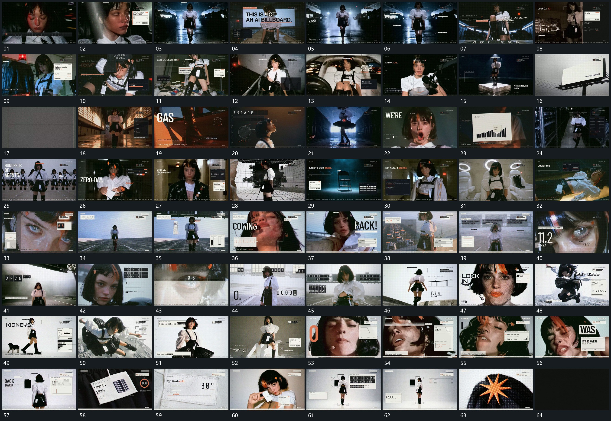

# 004 · 运动过程总览

## 运动总览

全片以连续活动材料为底层，多次切换底层而保留少量角框、短行和数字。开头 [固定字槽字符快速轮换，逐段落定成清楚短行](mechanisms/m01.md) 让分格短行从杂乱字符逐步落成清楚字组，[活动底层局部角框保持，旁卡与小条错峰补入](mechanisms/m02.md) 在局部角框旁追加短卡与数值条。中段反复用 [大数值先建立，划去原值后下方追加新结果](mechanisms/m03.md) 建立大数值，画线划去后补入新结果；前层卡中的短条和局部指标随后更新。

大片面由完整平面切入分格面，[大片面分格接管，各槽字符轮换后分行落定](mechanisms/m04.md) 让格内字符轮换并落定，随后回到活动底层，侧边卡继续接续。[独立数字位上下翻动，到结果后共同保持](mechanisms/m05.md) 将分开的大数字位翻动到结果，[固定旁片内阶梯线逐段延长，端点接向下方](mechanisms/m06.md) 在固定旁片内分段延长阶梯线。后半段反复沿用 [固定字槽字符快速轮换，逐段落定成清楚短行](mechanisms/m01.md) 与 [活动底层局部角框保持，旁卡与小条错峰补入](mechanisms/m02.md)，字片分批建立，图框、数字及短词原位更新；局部环线与分支线持续补齐。

末段 [全画面细格逐渐粗化，旁侧数值更新](mechanisms/m07.md) 让全画面细小格点逐渐粗化，旁侧数值更新。[放射条短促越界覆盖后缩回局部，主形继续转动](mechanisms/m08.md) 的放射条短促越界覆盖后缩回局部，局部主形再小幅转动，外部细框与短标签逐项补入，最后退暗。底层自身的行动不按题材逐个命名，本总览关注叠加层和画面交接。

## 完整64宫格

按从左至右、从上至下阅读，覆盖全片首尾。具体运动分镜见各子机制。

## 原片与观察范围

[观看参考视频](video.mp4) · [原始来源](https://skillry.dev/ai-videos/opus-5-5/anabology-491441)

依据真实源帧总览及必要局部序列整理，仅描述可见运动、相对布局与接续。抽帧观察不等于原速连续观看或声音核验；不推定精确曲线、隐藏结构、作者源码或原始生成指令。迁移到新片仍需实现和预览。
