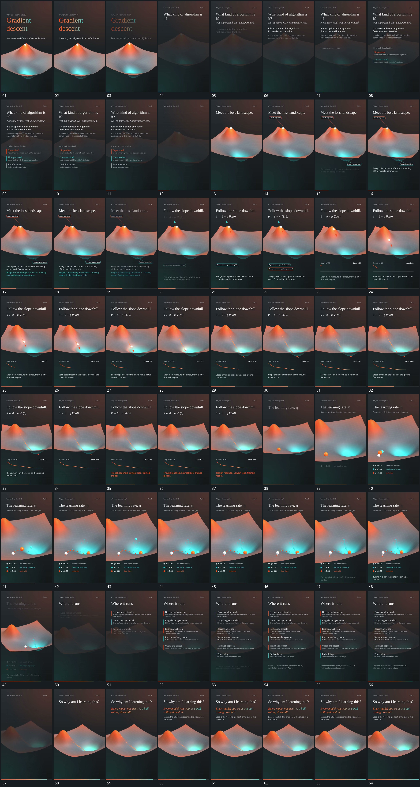

# 097 · 运动过程总览

## 运动总览

全片保留同一曲面作为运动参照。[后层曲面退弱前层行项逐次建立再释放](mechanisms/m01.md)先减弱曲面并逐项建立上方行与列表，再释放前层，让曲面重新成为主要范围。[从曲面局部延出短线并接上小标](mechanisms/m02.md)从曲面局部延出短线与小标，[单点沿曲面下降留下点迹到低处逐步收小位移](mechanisms/m03.md)让单点沿曲面下降，留下连续点迹。

下降过程中[路径推进时下方曲线逐段延长旁项更新](mechanisms/m04.md)在下方逐步延长曲线并更新旁侧短项。第二阶段[同一区域多点以不同步幅与转向经过](mechanisms/m05.md)从同一区域发起多点，各点按不同步幅和转向经过，路径并行保留。结尾曲面退小并继续复用[后层曲面退弱前层行项逐次建立再释放](mechanisms/m01.md)建立列表，再回到曲面与轨迹共同保持。

## 完整64宫格

按从左至右、从上至下阅读，覆盖全片首尾。具体运动分镜见各子机制。

## 原片与观察范围

[观看参考视频](video.mp4) · [原始来源](https://skillry.dev/ai-videos/opus-5-5/anirockshady-032809)

依据真实源帧总览及必要局部序列整理，仅描述可见运动、相对布局与接续。抽帧观察不等于原速连续观看或声音核验；不推定精确曲线、隐藏结构、作者源码或原始生成指令。迁移到新片仍需实现和预览。
