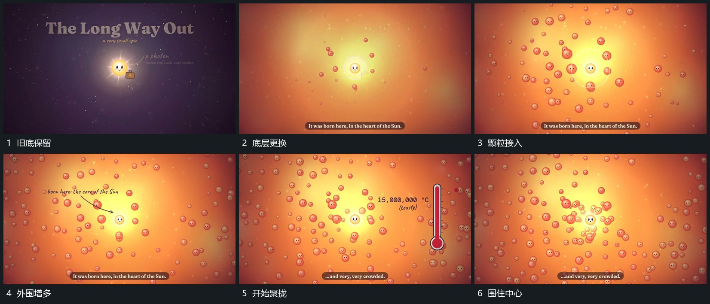

# 中心锚点保留，后层更换后颗粒向其聚拢

## 运动指令

保持中心圆形的位置，让后层叠化为新的范围，周围小粒由少到多接入。旁侧引线文字建立后，小粒逐步向中心靠近，形成更紧的分布，但不给中心本身造成完全遮挡；中心继续作为后续运动的起点。

## 分镜过程

## 组合与调整

后层更换与聚拢之间有标注阶段，不要求全部同时发生。可改变小粒数量与密度，保留中心活动通道；不能把聚拢解释成未经核实的真实物理作用。
