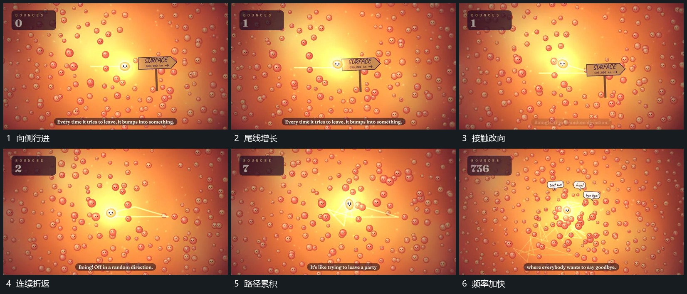

# 小圆改向行进，旧轨迹保留形成连续折线

## 运动指令

让小圆沿一个方向行进并拖出线段，接触一处小粒后改变方向，新线段从旧线末端继续延长。转向间出现短促的爆裂字块后退出，旧路径保留；随后提高转向密度，计数更快增加，外围短气泡错开出现。整段用同一运动体和不断累积的路径连接。

## 分镜过程

## 组合与调整

可改变折点、路径与变化频率，避免后段密线遮住当前端点。只描述接触后改向的可见关系，不推断轨迹由真实模拟生成。
