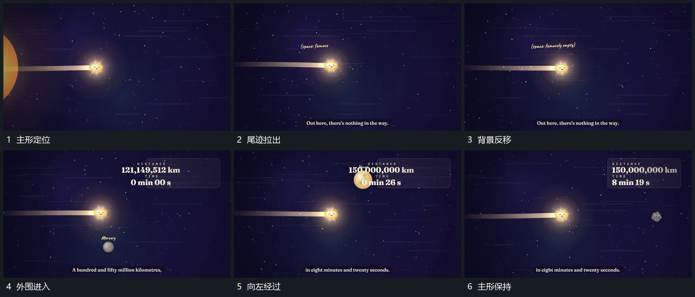

# 主形位置近乎固定，周边反向经过形成跟随感

## 运动指令

让主圆大致保持在画面中部，尾迹朝后方拉出，背景短线向相反方向移动。外围不同圆形先后从右侧进入、向左经过，旁侧数值随阶段更新；主圆不因为外围对象经过而偏离自己的主要路径。

## 分镜过程

## 组合与调整

可以改变经过物间隔与相对速度，保留主形位置稳定和环境运动之间的差异。新片可用虚拟镜头或层位移实现，本资料不确定原作者用了哪一种。
