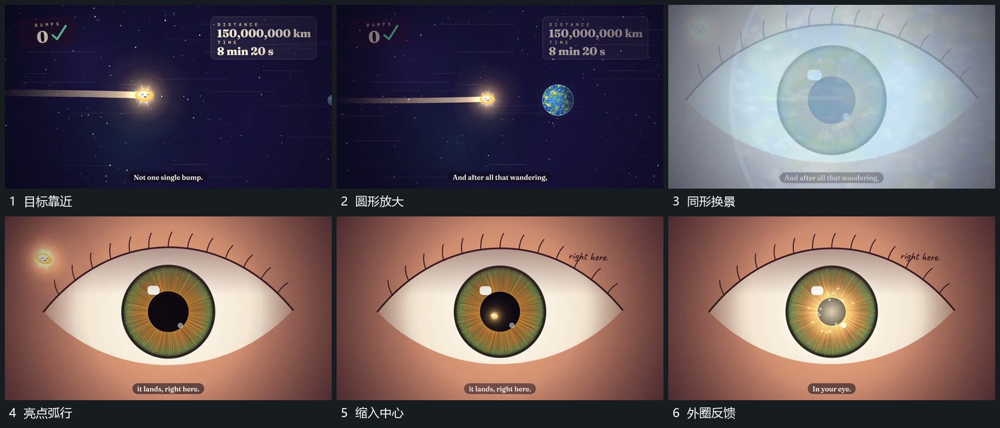

# 前方圆形靠近放大，同形叠化后亮点沿弧线汇入

## 运动指令

让前方圆形逐渐靠近并变大，占据主要视野，再以圆形位置相近的叠化切换到新的内部目标。小亮点从左上方沿弧线向中央孔移动，越接近越小，最后汇入；中心亮圈随后扩大再退去，留下新场。

## 分镜过程

## 组合与调整

靠近和汇入可分开组合，但需为第二段指定新的中心。此处是同形匹配的换景，不是已证实的对象几何变形；迁移时要另设计两幅内容的对齐。
