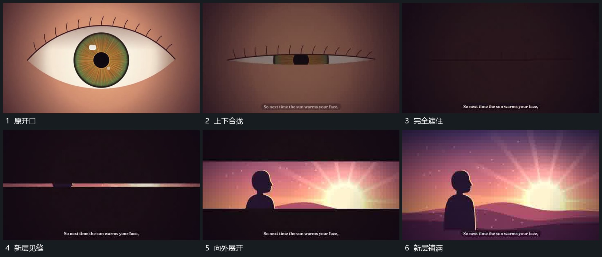

# 上下合拢遮住旧层，新层从中缝向两侧展开

## 运动指令

先让旧开口的上下边缘相向合拢，内部可见范围越来越窄，直到旧画面被遮住。遮蔽后在中央打开一条横缝，缝内已经换成新画面；继续把上、下边缘向外推开，新层从中间向上下铺满。字幕在这段交接中仍保持在下方位置。

## 分镜过程

## 组合与调整

可改合拢范围及边缘形状，核心是先闭合、遮住换底、再展开。前半段与后半段边缘不必是同一几何对象，但不能让新画面在遮蔽前无意露出。
