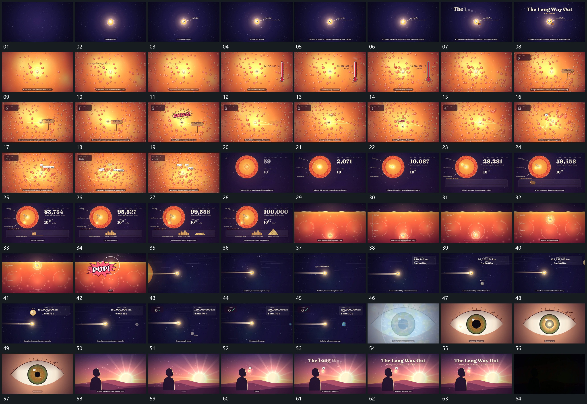

# 071 · 运动过程总览

## 运动总览

先用 [中心圆形放大落稳，引线与文字接续建立](mechanisms/m01.md) 建立中心小圆、引线和文字。[中心锚点保留，后层更换后颗粒向其聚拢](mechanisms/m02.md) 保留中心、更换后层并增加周边颗粒；旁侧 [侧槽由下向上填满，数字随填充推进](mechanisms/m03.md) 从底部填满竖槽并累计数字，之后周边继续聚拢，计数牌与指示形补入。

中段 [小圆改向行进，旧轨迹保留形成连续折线](mechanisms/m04.md) 让小圆行进并反复改向，旧路径保留，后段转向与计数加快。随后 [局部整体缩进圆区，外环显出而内部动作继续](mechanisms/m05.md) 将这段活动缩进中央圆区，露出外环，内部路径仍继续。外层稳定时，下方 [下方小块由低到高逐组垒起，前组保留](mechanisms/m06.md) 逐组垒起不同高度的小块，数值继续增长后收停。

旧标注退去，圆区推近；随后换入新的横向分层，并未把这次换景认定为同一形体的几何展开。[小圆沿弧线越过边界，扩散与亮闪接管换场](mechanisms/m07.md) 从下方向上走弧线，到边界触发扩散和亮闪，再接 [主形位置近乎固定，周边反向经过形成跟随感](mechanisms/m08.md) 的跟随感：主圆位置近乎固定，尾迹与周边反向移动。

后方小形离开，主路线仍持续；前方圆形靠近后，由 [前方圆形靠近放大，同形叠化后亮点沿弧线汇入](mechanisms/m09.md) 同形叠化进入局部，小亮点沿弧线缩入中心。留下的静止结构再用 [上下合拢遮住旧层，新层从中缝向两侧展开](mechanisms/m10.md) 合拢遮住，新场从中缝展开。尾段小圆在新的前景附近建立，文字沿用逐字显现，最后整体减淡。

## 完整64宫格

按从左至右、从上至下阅读，覆盖开头到结尾；用于查看全片发展，具体机制已在各自文档中配分镜。

## 原片与观察范围

[观看参考视频](video.mp4) · [原始来源](https://skillry.dev/ai-videos/opus-5-5/astrothewizard-618782)

本次依据真实源帧的完整总览、密集序列及必要局部补帧整理，仅记录可见运动与接续。抽帧观察不等于原速连续观看或声音核验；不据此指定精确曲线、隐藏结构、作者源码或原始生成指令。机制可迁移，具体实现仍需在新片中预览检验。
