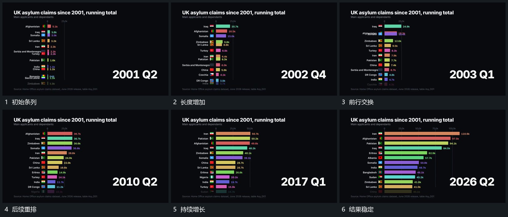

# 横条持续增长，整行随次序交换位置，末端数值跟随

## 运动指令

让多行横条共享固定左边界，条长持续增加，末端数值跟随条端更新。当两条的相对长度次序改变时，将整行沿竖向交换位置，行名前标记、横条和数值作为同组移动。旁侧阶段字在原位接替，标题和说明保持，最终所有行落到结果次序后稳定。

## 分镜过程

## 组合与调整

只保留增长与换位关系，不继承原统计题材。换位时标签必须跟随自己的条，纵向移动不应重置条长；新片按真实材料确定排序。
