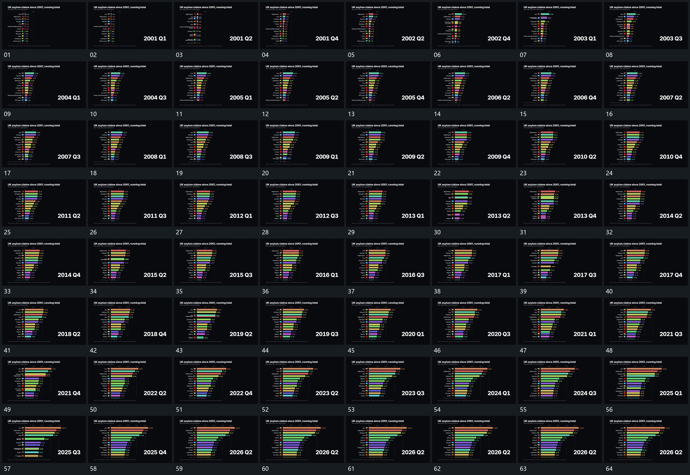

# 056 · 运动过程总览

## 运动总览

全片持续使用 [横条持续增长，整行随次序交换位置，末端数值跟随](mechanisms/m01.md)：横条沿共同左边界伸长，末端数值不断更新，增长后的相对次序变化时整行交换位置，短标记与数值随同一条一起移动。旁侧阶段字在原位接替，顶部与底部说明保持。最后横条和阶段字停在结果状态，不为每次交换位置另建重复机制。

## 完整64宫格

按从左至右、从上至下阅读，覆盖全片首尾。具体运动分镜见各子机制。

## 原片与观察范围

[观看参考视频](video.mp4) · [原始来源](https://skillry.dev/ai-videos/opus-5-5/aylmerth-356252)

依据真实源帧总览及必要局部序列整理，仅描述可见运动、相对布局与接续。抽帧观察不等于原速连续观看或声音核验；不推定精确曲线、隐藏结构、作者源码或原始生成指令。迁移到新片仍需实现和预览。
