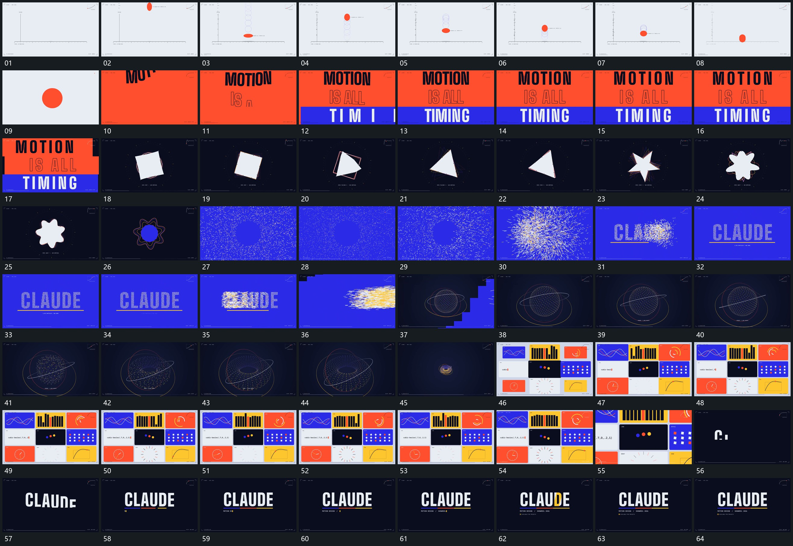

# 115 · 运动过程总览

## 运动总览

全片由[球垂向起落压扁后恢复并逐次降低高度](mechanisms/m01.md)沿底线起落并逐次收小高度，接到[多行字片错峰建立横带接上最后一行](mechanisms/m02.md)多行字片错峰建立。接着[中央轮廓转角变形外围细轮廓错开跟随](mechanisms/m03.md)改变中央轮廓与外围轮廓的角度，[点组向字行位置收齐再沿侧向散开退出](mechanisms/m04.md)从分散点汇成主行再沿侧向散开退出。

空间段[点球与外环转向中心打开后收成小环组](mechanisms/m05.md)让点球与外环共同转向，中间打开后收成较小环组。[多片并置保留各自内部运动再推向一片](mechanisms/m06.md)退为多个片面并置，各片内部继续运动，再推向局部；其中的曲线和条列运动可按[并行小范围各自起伏转角保持外框](mechanisms/m07.md)的独立变化关系采用。末尾[多行字片错峰建立横带接上最后一行](mechanisms/m02.md)重新建立主行，附属行与下线先后补齐。

## 完整64宫格

按从左至右、从上至下阅读，覆盖全片首尾。具体运动分镜见各子机制。

## 原片与观察范围

[观看参考视频](video.mp4) · [原始来源](https://skillry.dev/ai-videos/opus-5-5/blue-clarity-449603)

依据真实源帧总览及必要局部序列整理，仅描述可见运动、相对布局与接续。抽帧观察不等于原速连续观看或声音核验；不推定精确曲线、隐藏结构、作者源码或原始生成指令。迁移到新片仍需实现和预览。
