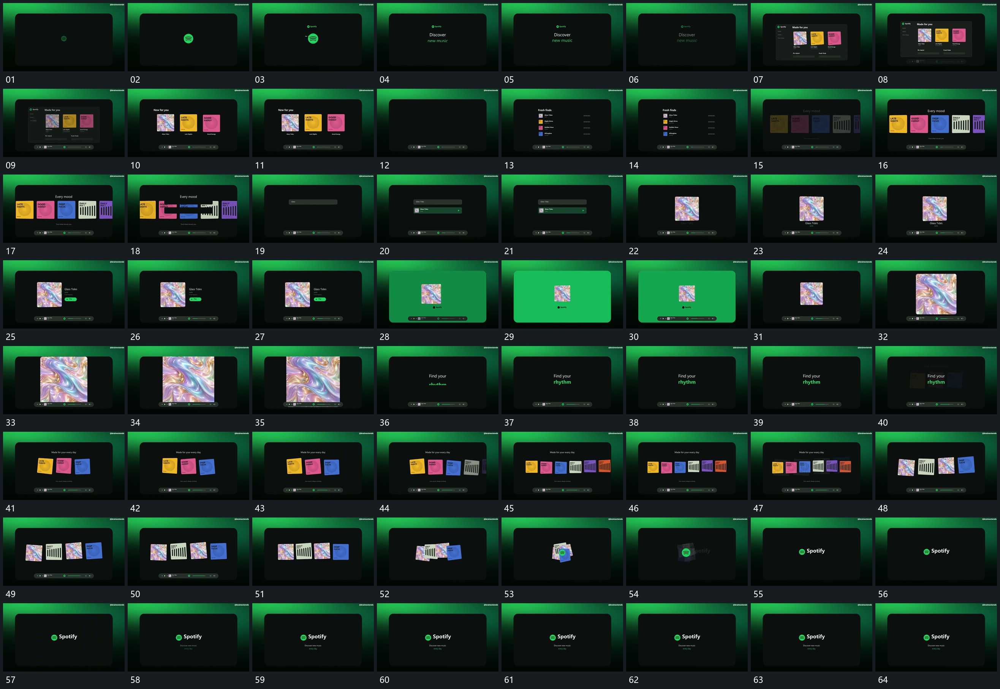

# 111 · 运动过程总览

## 运动总览

全片先在外框内建立小中心与字行，再用[内框退去原片面放大接管底条保留](mechanisms/m01.md)减去内框，保留其中片面并放大接管。[多片沿横向错开加入形成连续片列](mechanisms/m02.md)让多片沿横向错开增加，底部细条作为持续参照。中段[从小结果片放大到中央再侧移加入旁行](mechanisms/m03.md)从短行与小结果片中提取一片，放大到中央，再侧移并加入旁行。

中央片继续放大后退去，[多片沿横向错开加入形成连续片列](mechanisms/m02.md)再次展开集合。结尾[多片向中央收拢叠合并缩小留下中心小形](mechanisms/m04.md)将多片向中央收拢成带转角的堆叠，逐步缩小并退去，中心小形留下；[中心小形保持旁行下行逐次建立](mechanisms/m05.md)在其旁侧及下方补短行，完成收尾。

## 完整64宫格

按从左至右、从上至下阅读，覆盖全片首尾。具体运动分镜见各子机制。

## 原片与观察范围

[观看参考视频](video.mp4) · [原始来源](https://skillry.dev/ai-videos/opus-5-5/brainextends-606193)

依据真实源帧总览及必要局部序列整理，仅描述可见运动、相对布局与接续。抽帧观察不等于原速连续观看或声音核验；不推定精确曲线、隐藏结构、作者源码或原始生成指令。迁移到新片仍需实现和预览。
