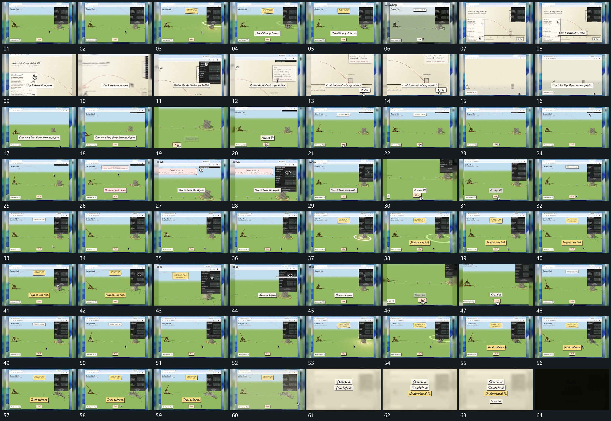

# 040 · 运动过程总览

## 运动总览

全片以持续活动的固定大框为底层。开头局部点沿弧线经过，落点圈扩散，短标签接入。[持续活动框保持，前层短条错开接入](mechanisms/m01.md) 在保留活动框时接入前层说明条，再用 [推近一个局部，横移到另一端后拉回整体](mechanisms/m02.md) 推近局部、横移到另一端，拉回整体。

中段反复沿用 [推近一个局部，横移到另一端后拉回整体](mechanisms/m02.md) 聚焦侧边与下部，再回到完整框。[局部转动接到弧向穿越，落点环扩开后块群散落](mechanisms/m03.md) 从局部转动接到弧向穿越，落点环扩开，块群散落，前层标签继续更新。末段块群运动结束后 [底层活动退虚，短片逐项叠成纵列后退暗](mechanisms/m04.md) 让底层退虚，中央短片依次叠成纵列，补入末条，最后退暗。

## 完整64宫格

按从左至右、从上至下阅读，覆盖全片首尾。具体运动分镜见各子机制。

## 原片与观察范围

[观看参考视频](video.mp4) · [原始来源](https://skillry.dev/ai-videos/opus-5-5/brainwavepub-812667)

依据真实源帧总览及必要局部序列整理，仅描述可见运动、相对布局与接续。抽帧观察不等于原速连续观看或声音核验；不推定精确曲线、隐藏结构、作者源码或原始生成指令。迁移到新片仍需实现和预览。
