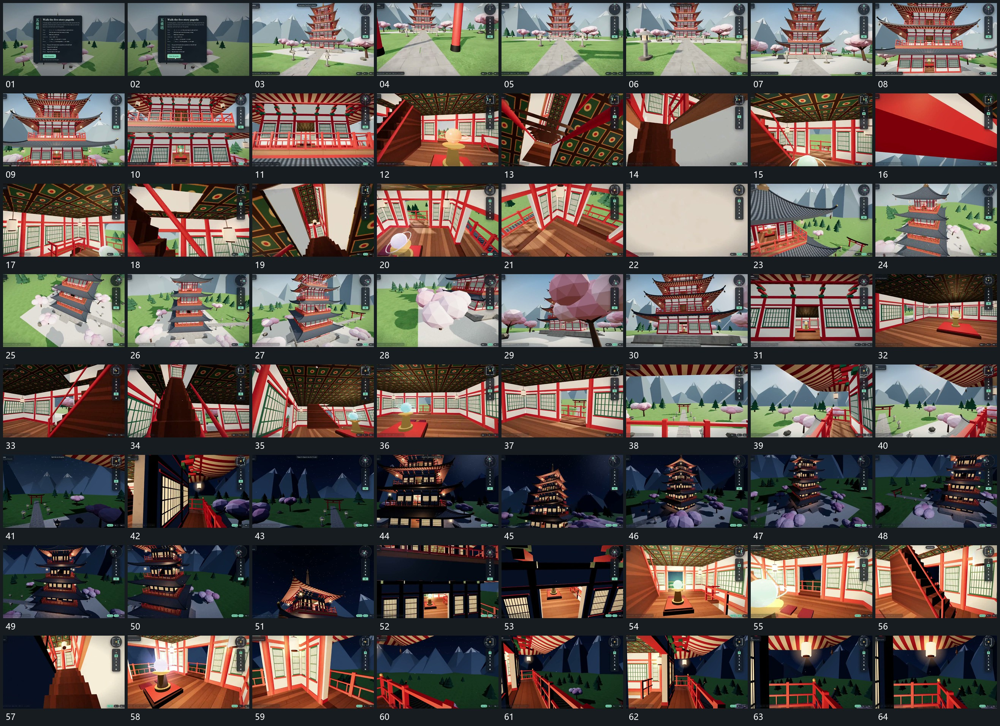

# 096 · 运动过程总览

## 运动总览

全片围同一空间多次运镜。起段[沿中心通道推进同时抬高取景](mechanisms/m01.md)沿中心通道推进并逐步抬高取景，随后[沿上扬路径转角穿过框边进入下一层](mechanisms/m02.md)沿上扬路径穿过框状边界，近侧遮挡先后经过。到外部后，[围中央长组绕行并连续改变俯仰高度](mechanisms/m03.md)围中央长组绕行，观察角度由斜下方转向侧上方，再回到正向入口。

进入内部后继续复用[沿上扬路径转角穿过框边进入下一层](mechanisms/m02.md)，在不同高度转向旁侧开口；后层状态接替后，仍沿原空间重复[围中央长组绕行并连续改变俯仰高度](mechanisms/m03.md)与[沿上扬路径转角穿过框边进入下一层](mechanisms/m02.md)。固定小参照条与前框只作观看参照，静止内容不增加机制。

## 完整64宫格

按从左至右、从上至下阅读，覆盖全片首尾。具体运动分镜见各子机制。

## 原片与观察范围

[观看参考视频](video.mp4) · [原始来源](https://skillry.dev/ai-videos/opus-5-5/buildfastwithai-597035)

依据真实源帧总览及必要局部序列整理，仅描述可见运动、相对布局与接续。抽帧观察不等于原速连续观看或声音核验；不推定精确曲线、隐藏结构、作者源码或原始生成指令。迁移到新片仍需实现和预览。
