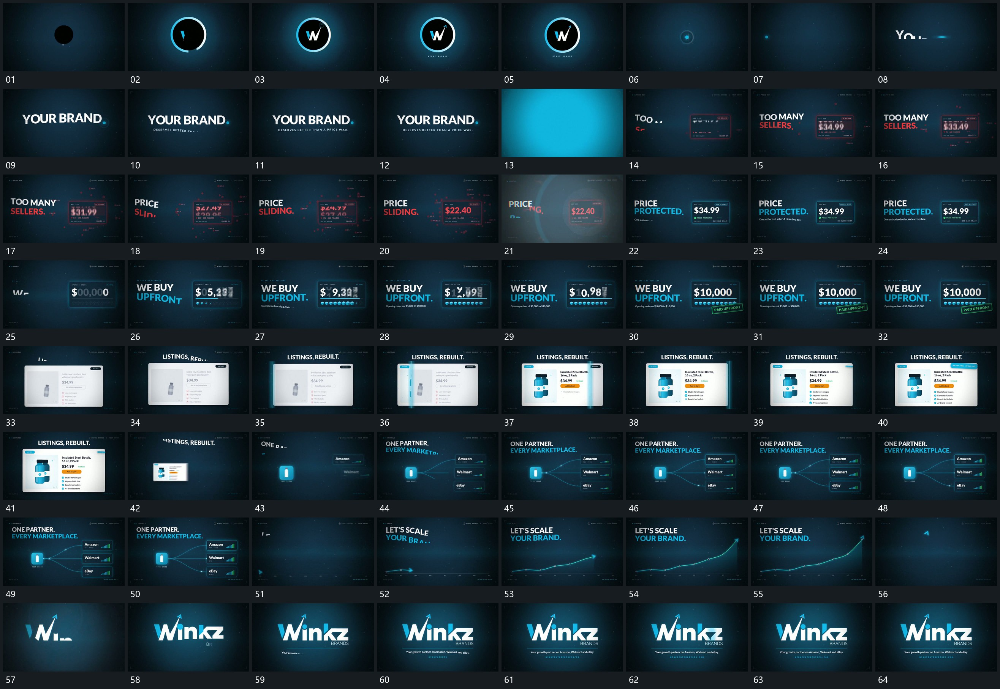

# 088 · 运动过程总览

## 运动总览

全片由[圆周先描出内部短形建立再收为小点](mechanisms/m01.md)的圆周描出与内部短形建立开始，圈收小后接到字行分段展开。之后[固定框内数字片竖向接替最后停稳](mechanisms/m02.md)在固定框内竖向接替数字片，旁侧短行同步补齐；[弧形覆盖经过原框内部与旁行原位更新](mechanisms/m03.md)用弧形覆盖经过整组，保留框位置并更新内部。

下一框继续复用[固定框内数字片竖向接替最后停稳](mechanisms/m02.md)并在底部累积小片。[窄竖带扫过宽片面经过处依次换内容](mechanisms/m04.md)让窄竖带横过宽片面，经过处依次替换内容；宽片缩回后，[单点向多旁框延长连接端部短条逐项增高](mechanisms/m05.md)由单点分出多条连接并接入旁框。后段[箭头沿上扬曲线延长留下节点后离线接续](mechanisms/m06.md)沿底部逐段延长上扬曲线，箭头从线端离开并回到中央，最后[主字形从局部展开下线与附属行后补齐](mechanisms/m07.md)逐段建立主字形与下方附属行。

## 完整64宫格

按从左至右、从上至下阅读，覆盖全片首尾。具体运动分镜见各子机制。

## 原片与观察范围

[观看参考视频](video.mp4) · [原始来源](https://skillry.dev/ai-videos/opus-5-5/ceowinkz-683602)

依据真实源帧总览及必要局部序列整理，仅描述可见运动、相对布局与接续。抽帧观察不等于原速连续观看或声音核验；不推定精确曲线、隐藏结构、作者源码或原始生成指令。迁移到新片仍需实现和预览。
