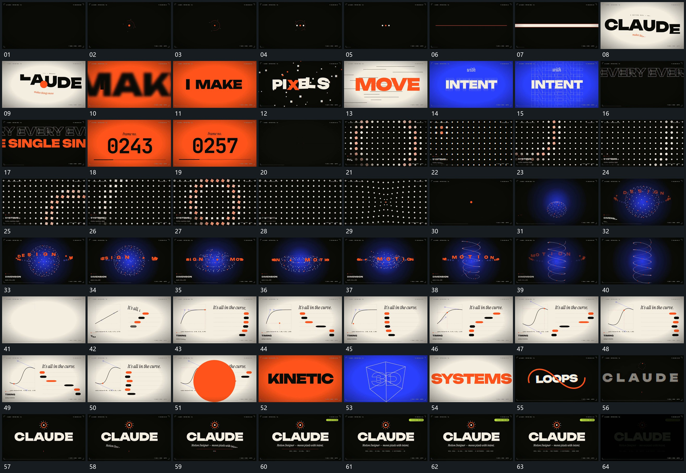

# 110 · 运动过程总览

## 运动总览

全片从小点与细圈开始，[细线横向拉长再增加宽度覆盖全幅](mechanisms/m01.md)把细线横向拉长并增加宽度，接管全幅。[字片错峰移入转正后整行缩定](mechanisms/m02.md)让字片错峰入场、转正和缩定，随后多次复用同类运动切换短行。

中段[点与方片阵列的局部波动沿格位经过](mechanisms/m03.md)在格阵中让局部点与方片波动经过，[球状点组打开中心拉成长螺旋字列围轴绕行](mechanisms/m04.md)把球状点组转为空心环和纵向螺旋，字列围其绕行。后段[曲线标点沿路径移动多排短条错开横移并归齐](mechanisms/m05.md)让曲线局部标点沿线移动，旁侧多排短条按不同推进关系横移并回到共同边界；[侧边圆区向外扩大覆盖并换底](mechanisms/m06.md)用圆区扩张完成换底。结尾复用[字片错峰移入转正后整行缩定](mechanisms/m02.md)建立主行，再[主行保持附属行逐次延长旁小片后接入](mechanisms/m07.md)逐项补下方短行和旁小片。

## 完整64宫格

按从左至右、从上至下阅读，覆盖全片首尾。具体运动分镜见各子机制。

## 原片与观察范围

[观看参考视频](video.mp4) · [原始来源](https://skillry.dev/ai-videos/opus-5-5/codestackr-328129)

依据真实源帧总览及必要局部序列整理，仅描述可见运动、相对布局与接续。抽帧观察不等于原速连续观看或声音核验；不推定精确曲线、隐藏结构、作者源码或原始生成指令。迁移到新片仍需实现和预览。
