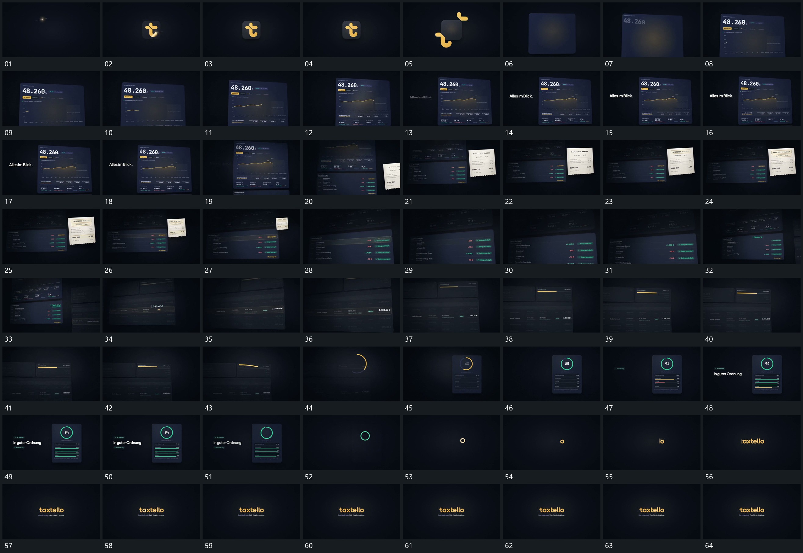

# 045 · 运动过程总览

## 运动总览

开头 [小形分开外移，承载面扩大后补入内部内容](mechanisms/m01.md) 让中央小形分开移向外围，原承载面扩大为大片，再逐项补入内容。[曲线从左向右逐段延长，下部短行随后增加](mechanisms/m02.md) 在固定片内逐段延长曲线，下部短行随后增加。大片上移，把下列表让到中心，[前层斜片接入，局部框逐项限定后缩回列表一行](mechanisms/m03.md) 在前层接入倾斜小片，局部框逐项限定后缩回列表一行。

中段选中行退场，新组接入，[横条逐步延长后弯成圆弧，圆弧接管新竖片](mechanisms/m04.md) 将稳定横条中的短线逐步延长，再弯成圆弧并接手新竖片。[圆弧内数值增加，下部多行短条错峰延长](mechanisms/m05.md) 在圆弧内增加数值，下部多行短条错峰延长，完整后保持。末段 [竖片退去，圆环缩回小圈并接入短字组](mechanisms/m06.md) 让原竖片退去，圆环缩回小圈，再由小圈接入短字组与附属行收尾。

## 完整64宫格

按从左至右、从上至下阅读，覆盖全片首尾。具体运动分镜见各子机制。

## 原片与观察范围

[观看参考视频](video.mp4) · [原始来源](https://skillry.dev/ai-videos/opus-5-5/daniel-haida-636937)

依据真实源帧总览及必要局部序列整理，仅描述可见运动、相对布局与接续。抽帧观察不等于原速连续观看或声音核验；不推定精确曲线、隐藏结构、作者源码或原始生成指令。迁移到新片仍需实现和预览。
