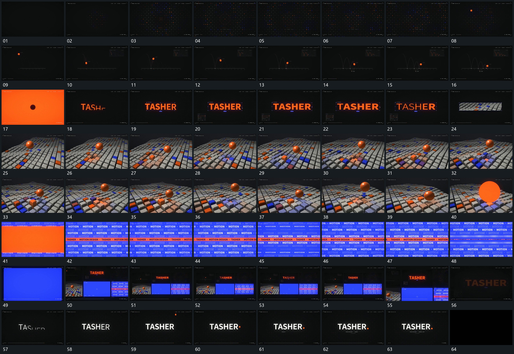

# 093 · 运动过程总览

## 运动总览

全片先用[小点阵向外展开成满幅排列](mechanisms/m01.md)让中央点阵由小到大展开，随后[单点沿逐次降低的弧线起落并向前经过](mechanisms/m02.md)把单点沿逐次变低的弧线送向底线。接到文字后，[固定字框内宽度与笔画厚度连续变化](mechanisms/m03.md)在固定框内连续改变字形宽度与笔画厚度。

转入纵深格阵时，[球上下起落格块从近落点向外先后升降](mechanisms/m04.md)让球起落与落点周边格块的先后升降交叠；[球向前放大覆盖后多排字列横向经过](mechanisms/m05.md)把球放大覆盖并接到多排字列经过。之后[活动片面缩回形成并置全貌再推向一片](mechanisms/m06.md)缩回多个片面形成并置全貌，再推向局部。结尾复用[固定字框内宽度与笔画厚度连续变化](mechanisms/m03.md)建立主行，[上方小点落到主行末端附属行再补齐](mechanisms/m07.md)让上方小点落到行末，附属行随后补齐。

## 完整64宫格

按从左至右、从上至下阅读，覆盖全片首尾。具体运动分镜见各子机制。

## 原片与观察范围

[观看参考视频](video.mp4) · [原始来源](https://skillry.dev/ai-videos/opus-5-5/dannnnnok-716687)

依据真实源帧总览及必要局部序列整理，仅描述可见运动、相对布局与接续。抽帧观察不等于原速连续观看或声音核验；不推定精确曲线、隐藏结构、作者源码或原始生成指令。迁移到新片仍需实现和预览。
