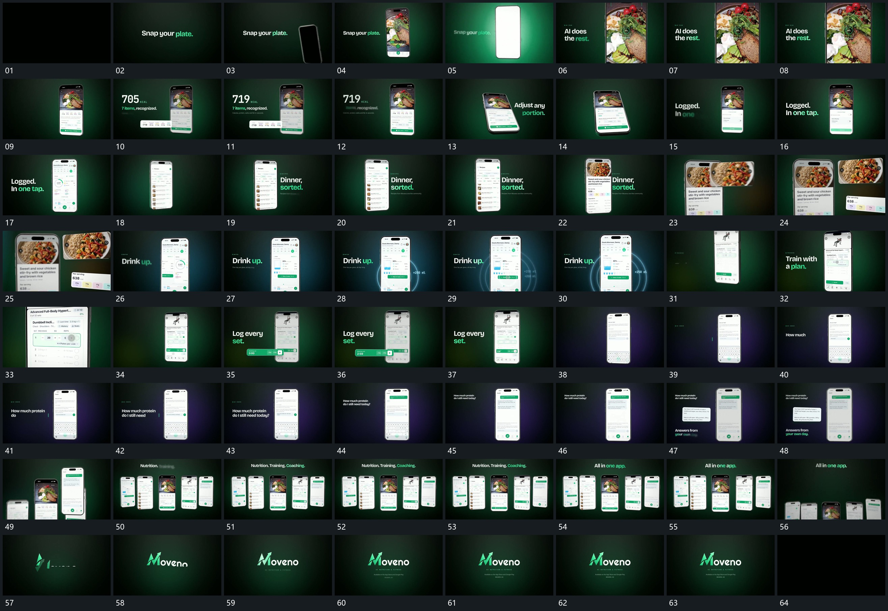

# 043 · 运动过程总览

## 运动总览

先逐词建立短句，再用 [倾斜竖框从下方升入，转正后推近](mechanisms/m01.md) 让倾斜竖框升入、转正并推近。框内局部提示变化后，[底部面板上推覆盖，整框缩回后内条向外伸出](mechanisms/m02.md) 从底部推出面板，缩回全框并将内条向外延展，伴随数字增长；强调完成后收回。

随后 [同一竖框横移转向，左右文字交替让位](mechanisms/m03.md) 使同一框横移转向，两侧字组交替建立。框内有一次向下移出旧内容，再转入 [边界固定，内部列表滚动后被侧入面板接替](mechanisms/m04.md) 的列表上行与侧板覆盖。[框内局部提成外侧浮片，强调后回收](mechanisms/m05.md) 从新内容中提取上片和下条到框外，原内部保留。换组后 [局部圆环接连扩散，数字与内部填充同步增加](mechanisms/m06.md) 用连续扩散圈带出数字上浮与内部累计。

接着 [旧框上移离场，新框从上方落入再局部靠近](mechanisms/m07.md) 让旧框上退、新框落入并完成局部靠近。内条外提和回收再次复用 [框内局部提成外侧浮片，强调后回收](mechanisms/m05.md)。下一次内容换入后，[外侧文字逐字建立，再缩移为框内短条](mechanisms/m08.md) 建立外侧文字，再缩移交给框内短条；框内内容继续增加，其中一段又用 [框内局部提成外侧浮片，强调后回收](mechanisms/m05.md) 提成外侧浮卡并回收。

末段 [多个竖框错峰升入并缩排成列，再整列退出](mechanisms/m09.md) 把多个竖框升入、缩排成横列，上方字组补入，保持后整列向下退出。[字形从底部遮挡线分段升出，副行随后接入](mechanisms/m10.md) 从底部遮挡线升出主字形与附属行，最后整体减淡。原片多次使用外提回收，合并在同一机制中保留变化方式。

## 完整64宫格

按从左至右、从上至下阅读，覆盖开头到结尾；用于查看全片发展，具体机制已在各自文档中配分镜。

## 原片与观察范围

[观看参考视频](video.mp4) · [原始来源](https://skillry.dev/ai-videos/opus-5-5/dannyverkissen-101463)

本次依据真实源帧的完整总览、密集序列及必要局部补帧整理，仅记录可见运动与接续。抽帧观察不等于原速连续观看或声音核验；不据此指定精确曲线、隐藏结构、作者源码或原始生成指令。机制可迁移，具体实现仍需在新片中预览检验。
