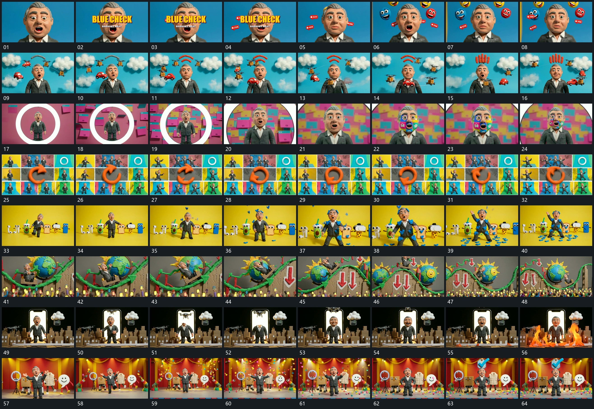

# 008 · 运动过程总览

## 运动总览

开头中心活动轮廓留场，[中心活动保持，前方字与外围小片错开进入](mechanisms/m01.md) 在其前后错开建立字组和外围小片。换入较远尺度后，[拉远露出外围层，中心保持而周边横向经过](mechanisms/m02.md) 让中心活动继续、外围层横向经过，并在上方更新短形。接 [圆框内局部放大，圆边越出后新底层铺满](mechanisms/m03.md) 从圆形框住的局部推近，圆边越出后由新底层接管。

随后 [多格活动片留场，中央环形持续自转](mechanisms/m04.md) 用多格活动片形成满幅集合，中央环形自转。换入独立全幅后 [小片从上方分批落下，在底部散开保留](mechanisms/m05.md) 从上方分批落下小片，中心活动与两侧排布保持。后段 [活动体沿波形通道上行下行，范围拉远露更多弯段](mechanisms/m06.md) 让活动体沿波形通道行进，观察范围拉远，更多弯段显出。

再进入竖框内外并置，[框内活动局部向上越出边框，外围层保持](mechanisms/m07.md) 局部上移越框并变换前景遮挡，外围仍保持；之后直接换入下一活动场面。尾段分散小片继续下落，上方标记接入，整组停在完成布局。字组入场、外围经过和小片散落在不同段落复用。

## 完整64宫格

按从左至右、从上至下阅读，覆盖全片首尾。具体运动分镜见各子机制。

## 原片与观察范围

[观看参考视频](video.mp4) · [原始来源](https://skillry.dev/ai-videos/opus-5-5/davidshulmanfl-842921)

依据真实源帧总览及必要局部序列整理，仅描述可见运动、相对布局与接续。抽帧观察不等于原速连续观看或声音核验；不推定精确曲线、隐藏结构、作者源码或原始生成指令。迁移到新片仍需实现和预览。
