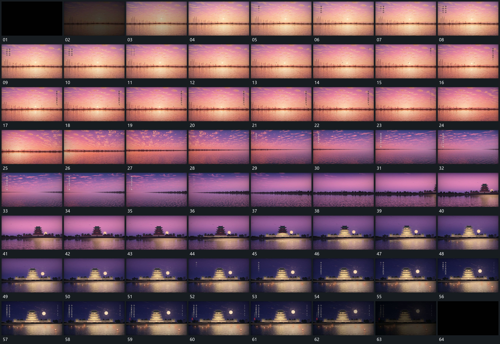

# 103 · 运动过程总览

## 运动总览

全片沿同一水平基准持续展开，[沿水平基准缓慢横移远近层连续经过](mechanisms/m01.md)缓慢横移，远近层以不同幅度经过。其间多次复用[竖向短行逐字增加保持后退弱接下一列](mechanisms/m02.md)，让竖向短行逐字建立、保持再退去；下方细线与小形继续局部运动。

取景转到新的中央组后收小横移，[下方小片分次加入并缓慢横向经过](mechanisms/m03.md)让下方小片分次加入并缓慢经过，已有后层保持。结尾继续复用[竖向短行逐字增加保持后退弱接下一列](mechanisms/m02.md)建立双竖行，整体退弱结束。

## 完整64宫格

按从左至右、从上至下阅读，覆盖全片首尾。具体运动分镜见各子机制。

## 原片与观察范围

[观看参考视频](video.mp4) · [原始来源](https://skillry.dev/ai-videos/opus-5-5/demitiyageekzen-818523)

依据真实源帧总览及必要局部序列整理，仅描述可见运动、相对布局与接续。抽帧观察不等于原速连续观看或声音核验；不推定精确曲线、隐藏结构、作者源码或原始生成指令。迁移到新片仍需实现和预览。
