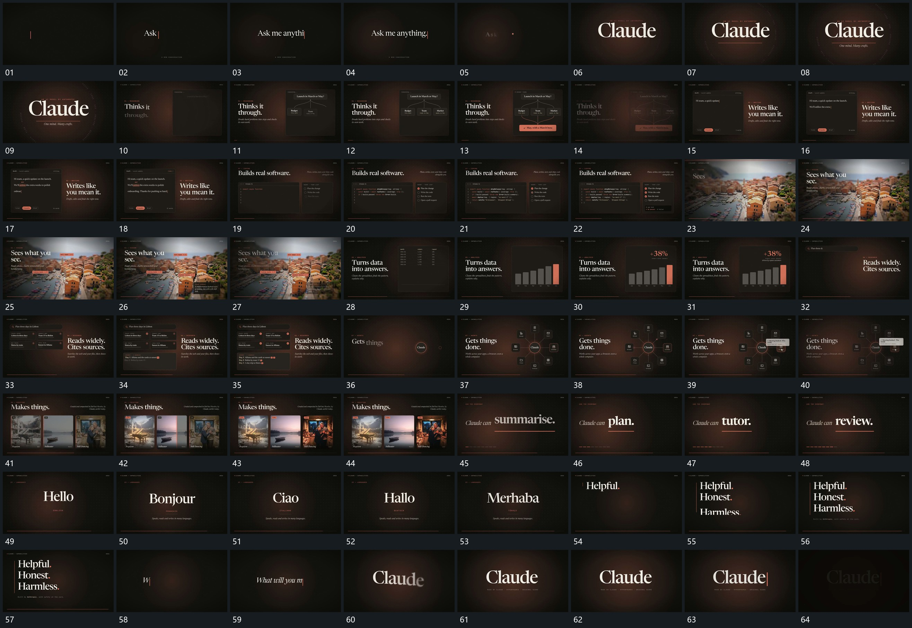

# 107 · 运动过程总览

## 运动总览

全片多次复用[逐字填入完成后局部替换再补下线](mechanisms/m01.md)的逐字填入、局部替换和下线建立。首个框内[上方节点分出连接末端框接入再汇到下框](mechanisms/m02.md)从上方节点分出多条连接，末端框和下方结果框依次接入。后续双框使用[双框保持一侧逐行填入另一侧逐项补标记](mechanisms/m03.md)，一侧逐行填入，另一侧逐项补标记。

图片段由[大图片保持局部短线与标签分次派生](mechanisms/m04.md)从局部派生短标线与标签，底图保持。数据段[框内旧行列退去竖条从共同底部增长](mechanisms/m05.md)让旧行列退去，竖条从共同底部逐次增长。随后[中心小圈向外围多框分出连接并接局部前框](mechanisms/m06.md)将中心小圈扩展为外围多个框，并在其中一处接入小前框。结尾继续复用[逐字填入完成后局部替换再补下线](mechanisms/m01.md)，同一前段保持而后段短行接替，最后多行按先后建立并退弱。

## 完整64宫格

按从左至右、从上至下阅读，覆盖全片首尾。具体运动分镜见各子机制。

## 原片与观察范围

[观看参考视频](video.mp4) · [原始来源](https://skillry.dev/ai-videos/opus-5-5/dheepanratnam-706454)

依据真实源帧总览及必要局部序列整理，仅描述可见运动、相对布局与接续。抽帧观察不等于原速连续观看或声音核验；不推定精确曲线、隐藏结构、作者源码或原始生成指令。迁移到新片仍需实现和预览。
