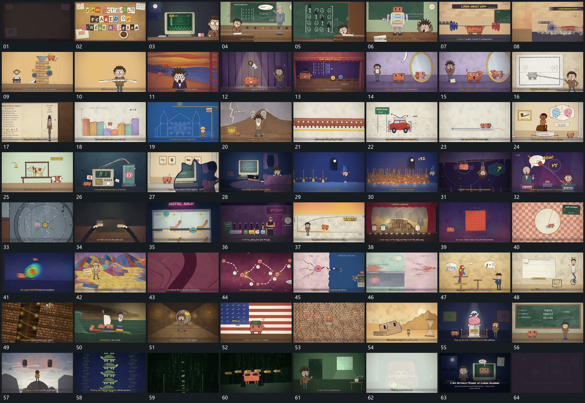

# 068 · 运动过程总览

## 运动总览

开头字片组建立，连续活动底层在多段之间接替，固定底字持续补齐。片内网格和悬挂小形按区增加。[长条从叠层承载区不断送出，字形最后离面上浮](mechanisms/m01.md) 从叠层承载区不断送出长条，条沿侧向延伸，文字最后脱离条面上浮。随后旁组与镜面轮廓接入，多个局部短形展开，已有底层保持。

中段 [宽条重分成更多窄条，高度变化贴近既有曲线](mechanisms/m02.md) 让宽条重分成更多窄条，各条高度变化贴近既有曲线，小形沿上缘经过。后续框、长排小形与旁片逐项建立；[沿长平面纵深推进，近层扩大越界，远层接手](mechanisms/m03.md) 向长平面深处推近，近层放大越界。大片和小面在多段间接替，[固定网格内局部强调逐列移动，末侧结果接续](mechanisms/m04.md) 从条面逐列移动局部强调，网格保持；[上片离开下片，内亮区显露并扩张接管](mechanisms/m05.md) 上片离开下片，内亮区显露并扩开，交给新空间。

后段 [镜头沿多层区向下移动，小圆在层内短斜线上经过](mechanisms/m06.md) 镜头沿多层承载区向下移动，层内小圆沿短斜线经过，下一层接手。并置短条和分块平面继续更新，[亮点沿弧形网络传递，经过节点时局部反馈接上](mechanisms/m07.md) 在弧形连接网上沿线传递亮点，再让小片从侧方经过网络。[上片下压弯形，弯形逐渐变扁后落稳](mechanisms/m08.md) 上片下压弯形，将其压成扁平后保持。随后 [多侧点沿线汇到中心，后续从另一侧送出并接旁片](mechanisms/m09.md) 把多侧小点沿连接汇到中心，再从另一侧送出，接到旁片。末段片群铺满后层，镜头在密集集合中推进又拉回，数值与字片接续，最后返回稳定平面并退暗。

## 完整64宫格

按从左至右、从上至下阅读，覆盖全片首尾。具体运动分镜见各子机制。

## 原片与观察范围

[观看参考视频](video.mp4) · [原始来源](https://skillry.dev/ai-videos/opus-5-5/doubleunplussed-181894)

依据真实源帧总览及必要局部序列整理，仅描述可见运动、相对布局与接续。抽帧观察不等于原速连续观看或声音核验；不推定精确曲线、隐藏结构、作者源码或原始生成指令。迁移到新片仍需实现和预览。
