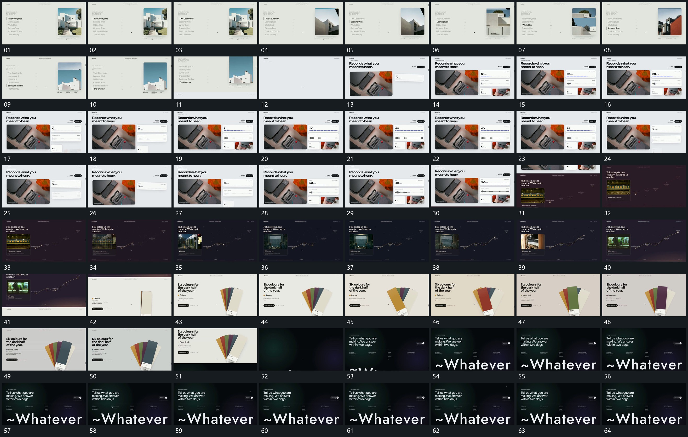

# 018 · 运动过程总览

## 运动总览

开头 [侧列重点依次下移，固定竖框内画面更换](mechanisms/m01.md) 保留固定竖框与侧方文字列，当前行变化时框内图像接续更新。整组上退后建立新的大框与侧面板，[面板内数字增减，波形与短条同步更新](mechanisms/m02.md) 让数字、细条及波形在固定边界中往复变化。

接着旧组上移露出新底，[点沿曲线路径前进，旁侧图块逐站更新](mechanisms/m03.md) 从一侧建立图块与曲线路径，点沿路径前进，图块内部随阶段更换。随后 [同轴片层扇开，各片先后向前突出](mechanisms/m04.md) 展开同轴片层，在固定扇形集合中突出不同片面。末段新底层和字组建立，下方大字向上露出后保持。

## 完整64宫格

按从左至右、从上至下阅读，覆盖全片首尾。具体运动分镜见各子机制。

## 原片与观察范围

[观看参考视频](video.mp4) · [原始来源](https://skillry.dev/ai-videos/opus-5-5/ercankeskinx-897906)

依据真实源帧总览及必要局部序列整理，仅描述可见运动、相对布局与接续。抽帧观察不等于原速连续观看或声音核验；不推定精确曲线、隐藏结构、作者源码或原始生成指令。迁移到新片仍需实现和预览。
